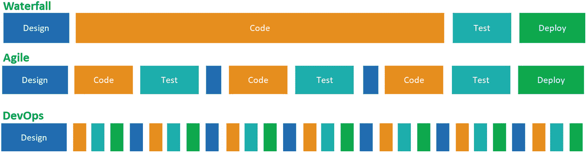
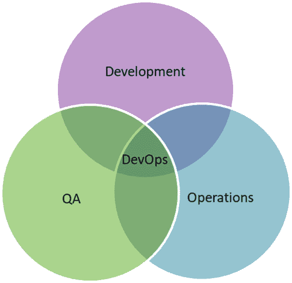
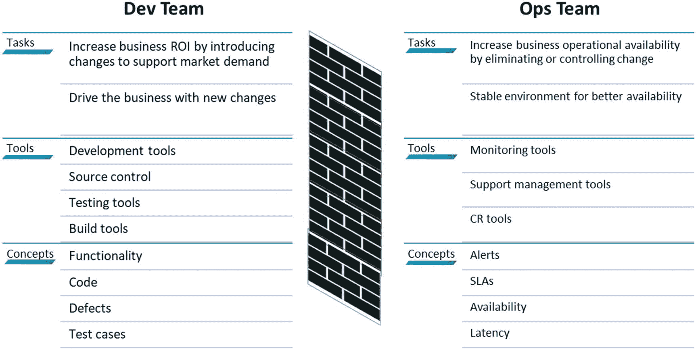
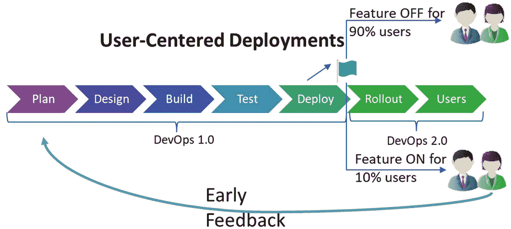
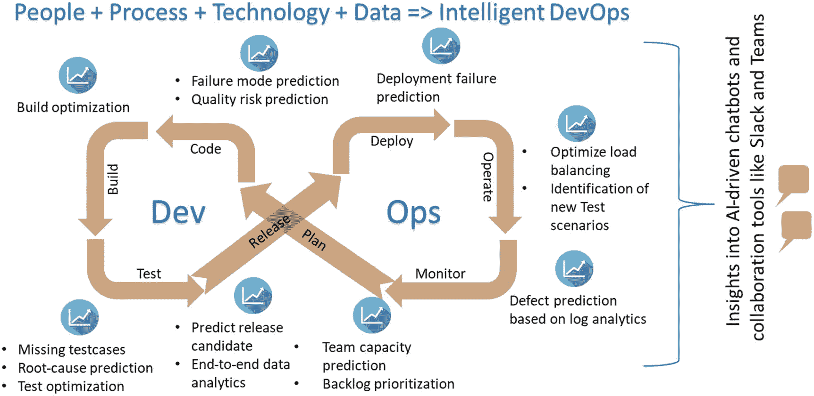

# 一、DevOps 基础和变化

软件开发过程和发布需求可以随着时间的推移而改变，以便继续为客户带来价值并获得市场的接受。为了扩大规模并获得一些早期反馈，许多组织采用了频繁发布新特性或缺陷修复的方法。这些版本部署到生产系统的频率高达每周一次，有时甚至是每天一次，每小时一次，甚至每十秒钟一次。为了保持这种市场优势或获得快速反馈周期，公司正在采用 DevOps 实践，如连续交付和连续部署。在本章中，您将了解 DevOps 的概念和实践。

## 软件开发

在遵循瀑布模型多年之后，软件开发行业逐渐采用了敏捷模型。敏捷开发模型提供了适应不断变化的需求的能力，并且它提供了团队之间更好的协作和改进的生产力。在瀑布模型中，应用开发是作为一个连续的操作来完成的，应用在项目结束时发布。然而，有时开发过程需要很长时间才能完成，并且在开始时设想的许多特性的相关性可能不再有用。此外，这种方法缺乏最终用户反馈循环，最终用户的期望和任何反馈都只有在整个开发/部署完成后才会收到。

敏捷过程要求更频繁地发布已完成的特性(生产就绪),以接收来自客户的早期反馈并做出相应的响应。没有开发运维的敏捷需要更多的周期时间和人工参与。DevOps 使用自动化发布解决了敏捷开发和部署实践中的不足，通常在两者之间有自动化验证和关口。图 [1-1](#Fig1) 显示了所有三种型号。

图 1-1

软件开发模型

## DevOps

DevOps 是 IT 领域最热门的话题之一，但它有许多不同的变体。如果十个人开始讨论 DevOps，他们会有十种不同的解释。下面是来自 [`https://en.wikipedia.org/wiki/DevOps`](https://en.wikipedia.org/wiki/DevOps) 的 DevOps 的一个流行定义，展示了 DevOps 的过程角度，换句话说，我们如何在开发和运营团队中使用单个过程:

> *DevOps 是一种* *软件开发方法论* *，它将软件开发(Dev)与信息技术运营(Ops)相结合。*

下面的定义来自 [`https://searchitoperations.techtarget.com/definition/DevOps`](https://searchitoperations.techtarget.com/definition/DevOps) 。DevOps 是从一个人的角度来定义的，它规定了团队文化如何变化，以及如何实现更具协作性的工作环境。

> *DevOps 是开发和运营* *这两个术语的混合，意在代表一种由公司的应用开发和 IT 运营团队执行任务的协作或共享方法。*

在下面的定义中，从技术的角度定义了 DevOps，其中 DevOps 用于自动化端到端的开发过程([`www.atlassian.com/devops`](http://www.atlassian.com/devops)):

> *devo PS 是自动化软件开发和 IT 团队之间的过程的一组实践，以便他们可以更快、更可靠地构建、测试和发布软件。*

考虑到 DevOps 在 IT 行业中的重要性，以及 DevOps 是软件开发不可或缺的一部分这一事实，让我们讨论一下它所包含的这些不同的可能性。

DevOps 是文化元素、实践和工具的组合，用于以更高的速度交付价值。DevOps 由人员、流程和技术组成。技术实现了端到端交付管道的自动化。此外，使用合适的工具可以增强团队的协作。敏捷流程提供了执行的敏捷性、团队之间的协作、端到端活动的管理以及创新的团队文化。DevOps 文化意味着人们接受多种技能的培训，以提高对整个流程的理解广度、团队之间的适当握手、单一团队心态和多技能团队成员。

作为 DevOps 采用的一部分，大多数公司从技术和流程实现开始，或者关注于技术和流程实现。敏捷是许多公司事实上的开发方法，自动化是采用 DevOps 的驱动力。DevOps 文化的采用是复杂的，它需要组织结构的改变和人们心态的改变。

### DevOps 团队

如果 DevOps 是开发和运营的混合体，那么测试部门和其他涉众呢？

所有的利益相关者在 DevOps 中都有自己的重要性和角色。DevOps 中的 *Dev* 包括 scrum 大师、开发人员、测试人员、项目经理、主题专家(SME)、业务分析师、领域专家、安全架构师、解决方案架构师、性能工程师等等。基于解决方案的规模、复杂性和业务影响，角色和职责因项目而异。DevOps 中的 *Ops* 包括构建工程师、生产支持、监控等运营成员。

请记住，DevOps 的目标是向客户交付价值，而不是降低成本或自动化流程；这些是实现适当的 DevOps 实践的副产品。团队结构在推动组织中的 DevOps 实践中起着重要的作用。基于各种参数，我们可以为我们的项目确定一个匹配的团队拓扑。通过阅读马修·斯凯尔顿 [`https://web.devopstopologies.com/`](https://web.devopstopologies.com/) 的文章，确定你是遵循反类型还是正确的 DevOps 团队类型。

### DevOps 实践

DevOps 涉及不同的组件来建立端到端的 DevOps 工作流。以下是一些主要的做法:

*   *需求管理*:在每个需求的状态上建立端到端的可追踪性、快速查看、有效性和可用性优先级。

*   *配置管理*:根据目标环境、用户、公司策略等管理配置。

*   *发布管理*:计划、安排和控制发布、批准和其他政策。

*   *持续集成*:将最新的更新合并到远程存储库中，并确保高质量的构建通过。

*   *持续部署*:在通过自动化质量关确保构建质量之后，将代码变更部署到更高的环境中。

*   *作为代码的基础设施*:作为代码部署的一部分提供基础设施，并以脚本格式控制配置。

*   测试自动化:自动化测试以确保更快的执行和更多的覆盖率。

*   *连续监控*:系统自动监控并对结果采取行动。这可能包括记录错误、采取纠正措施或发送通知。

还有更多的领域，比如协作、知识管理、身份/访问管理、项目组合管理、工件存储库、性能测试、安全测试、积压管理等等。

### DevOps 变体

DevOps 是软件开发不可或缺的一部分。大多数项目至少实现了 DevOps 的技术和过程部分，即使这可能不会带来 DevOps 的实际好处。文化的改变真的能帮助你认识到 DevOps 的真正好处。但是，大多数时候，我们最终将开发运维的范围局限于自动化和成本降低，而不是释放价值。

目前，基于实现存在许多 DevOps 变体。一些主要的变体如下:

*   *BizDevOps* :在整个过程中业务视图的参与。尽管常规的开发运维定义了开发运维中业务涉众的参与，但是这种变化强调了业务人员在整体执行中的角色。

*   DevSecOps/SecDevOps :这将安全性集成到了 DevOps 中。这是目前的趋势，现在大部分客户都在采用这种模式。为什么是安全？我们已经在代码中实现了安全性，那么为什么我们还需要安全性作为 DevOps 实现的一部分呢？以下是传统开发运维中可能出现安全威胁的一些场景:
    1.  在使用多个工具的 DevOps 实现中，需要通过密码、密码、令牌等在工具之间进行集成。，可以存放在安全的金库里。

    2.  如果我们启用了 CI/CD 管道，它执行代码提交并部署到生产环境中，那么我们如何确保部署到生产环境中的代码足够安全呢？我们通过自动化安全验证测试来做到这一点。

    3.  DevOps 谈到了左移，那么我们为什么需要等待一个构建来探索我们的安全漏洞呢？我们可以在编码的时候有一个集成了安全漏洞特性的 IDE 吗？如果是这样，我们可以使用安全智能感知。

    4.  我们如何确保云订阅的安全？这被称为*订阅安全性*。

    5.  我们监控生产环境中的安全问题，并采取必要的措施。对容器中应用部署的安全监控增加了另一层安全需求。这被称为*托管环境/容器安全*。

SecDevOps 试图解决我们的 DevOps 实现的端到端安全需求。基于解决方案技术、托管环境和 DevOps 工具，我们可以在整个 DevOps 生命周期中集成适当的安全工具来实现 SecDevOps。

*   CloudOps:devo PS 的一个变种，目标是基于云的系统。主要区别在于基础设施作为代码的实现以及处理 SaaS 和 PaaS 部署。

*   *MLOPs* : DevOps 是机器学习(ML)模型开发中必不可少的组件。与其他基于云的应用开发相比，MLOps 实现略有变化。在 MLOps 中，各阶段将从各种来源导入数据；做数据处理，包括数据转换，数据清理等。；使用样本数据集训练模型；部署模型；并传递实际数据进行处理。此外，作为端到端流程编排的一部分，可能需要对模型进行重新训练。MLOps 由特定的 DevOps 工具处理，如 MLFlow 和 Azure ML Pipeline。

*   *智能 DevOps* :这是 DevOps 的未来，是 DevOps 和人工智能的合作。在 DevOps 中，主要的三个组成部分是人员、流程和技术。作为 DevOps 生命周期的一部分，将会生成大量数据，但这些数据不会被正确使用。智能开发运维使用在开发运维设置中收集的数据，如日志、代码、测试用例、bug、构建报告等，来预测或获得更有意义的见解。部署失败预测、质量风险预测、新测试场景的识别以及基于日志分析的缺陷预测是我们可以从 DevOps 数据中获得的一些见解。

随着时间的推移，开发运维流程已经从开发运维 1.0 发展到智能开发运维。

#### DevOps 1.0

在 DevOps 1.0 中，主要的焦点是解决冲突并增加各种利益相关者之间的协作，如开发团队、QA 和运营，如图 [1-2](#Fig2) 所示。在理解其他团队的优先事项方面缩小差距在这里发挥了重要作用。

图 1-2

DevOps 1.0

在这种情况下，开发团队主要关注新特性以改进业务，而运营团队则在生产环境中寻找稳定性。图 [1-3](#Fig3) 显示了开发团队和运营团队之间的一些冲突或偏差。

图 1-3

开发团队对运营团队

#### DevOps 2.0

DevOps 2.0 专注于以用户为中心的部署，如图 [1-4](#Fig4) 所示。对于 SaaS 或产品来说尤其如此，在这些产品中，预览功能是向一组给出反馈的用户发布的。根据反馈，团队整合变更并向所有用户发布最终版本。

图 1-4

DevOps 2.0

这种 DevOps 实现是使用特性标志来处理的。功能标志是对功能进行标记并仅向选定用户发布的实现。

#### SecDevOps

由于最近的远程工作文化和云的采用，安全性已成为 DevOps 实施中的主要关注点之一。越来越多的 DevOps 工具正在转向基于云的订阅模式，以满足不断增长的云采用需求。安全性设计的另一个原因是在应用开发中采用开源库。例如，大多数现代 web UI 开发是基于 Angular 或 React 的，JavaScript 框架是基于 npm 包的。许多 npm 包与基础包一起用于设计丰富的 UI。部署所有这些依赖的库而不进行适当的筛选将导致安全威胁。

#### 智能开发工具

在 intelligent DevOps 中，团队将研究实施不同的智能模型，以便从 DevOps 生命周期中收集的数据中获得正确的见解。在这里，数据将作为第四个元素添加到 DevOps 生态系统中。图 [1-5](#Fig5) 显示了智能 DevOps 的示例。

图 1-5

智能开发工具

DevOps 模型已经成为现代应用开发的重要组成部分，并支持敏捷过程的自动化。传统的 DevOps 模型谈论人员、流程和技术。但是，整个软件/产品/应用开发过程涉及大量数据，特别是与需求实现、团队能力和 sprint 执行、构建失败和构建质量、未测试区域、测试失败模式、发布的候选特性、A/B 发布计划、与负载平衡器相关的操作方面、异常、缺陷等等。此外，最终客户票证/反馈和监控会触发与预期或损坏的功能、预期缺陷或异常相关的新数据。人工智能驱动的新 DevOps 模型专注于从所有这些数据中获得各种见解。智能 DevOps 试图向利益相关者提供更主动的信息，同时试图使用自我修复机制来解决一些缺陷。与聊天机器人集成的协作工具将基于洞察力增加更快的行动。

### 利益

DevOps 的好处包括从想法到发布，通过自动化、软件交付流程的编排和持续的客户反馈，更快地构建和向市场发布软件变更。DevOps 不断地向最终客户交付价值，并在减少测试周期、提高故障单解决率、减少端到端工作量等方面带来许多额外的好处。从传统 DevOps 到智能 DevOps 的过渡，将通过结合 DevOps 和 AI 的力量，为最终用户和企业带来指数级的价值。

以下是 DevOps 在业务领域的一些优势:

*   更好地响应业务需求

*   提高对 IT 流程和要求的可见性

*   提高客户满意度

*   销售额增加

*   低风险

以下是技术优势:

*   通过代码提高质量

*   更敏捷的开发

*   提高部署质量

*   更快的发布周期

*   降低复杂性

以下是团队优势:

*   协作文化

*   高效团队

*   更高的团队参与度

*   增长机会增加

*   自我驱动的团队

## Azure DevOps

Azure DevOps 提供两种产品:Azure DevOps 服务器和 Azure DevOps 服务。Azure DevOps Server，以前称为 Team Foundation Server (TFS)，是微软的内部部署产品。Azure DevOps Services，以前称为 Visual Studio Team Services (VSTS)，提供基于 SaaS 的产品来管理端到端 DevOps 生命周期。这本书将只关注 Azure DevOps 服务。

Azure DevOps Services 提供了一个跨不同 IT 部门实施 DevOps 流程的平台。该工具支持 DevOps 下的各种实践，如持续规划、持续开发、持续集成、持续测试、持续部署/交付和持续监控/反馈。此外，该工具支持与各种工具的集成，例如验证代码质量的代码分析工具、扫描代码中漏洞的安全工具、自动供应基础设施组件的基础设施供应工具等等。

## 摘要

DevOps 是现代应用开发不可或缺的一部分，无论是商业现货(COTS)产品还是定制应用，机器学习模型还是 web 应用，以及数据库还是无服务器模型。这本书将带你经历使用 Azure DevOps 的 DevOps 实现之旅。它还将在最后处理一些高级 DevOps 蓝图。