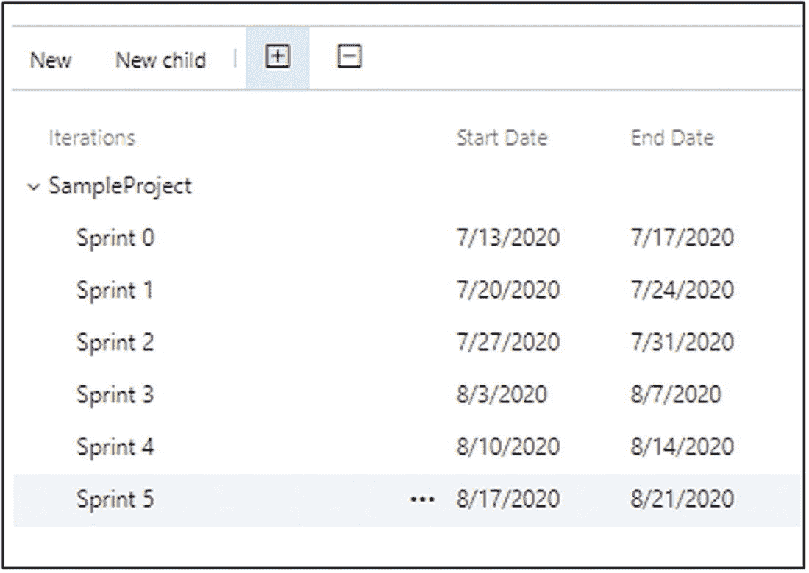
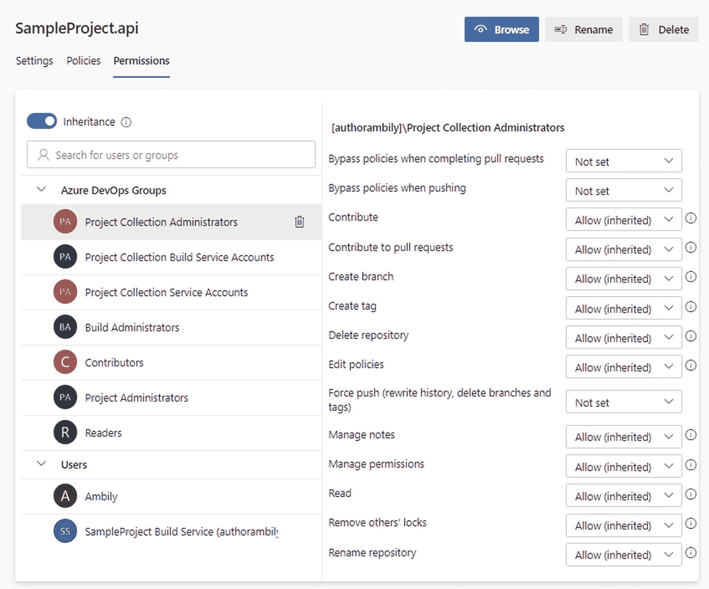

# 二、Azure DevOps 项目管理

多年来，项目管理领域已经从资源管理发展到包括诸如优化和生产力提升等领域。项目经理总是管理资源和维护时间表，但今天的项目经理在这些常规职责中增加了多个维度，如敏捷性和技术。技术经理是处理敏捷和 DevOps 实践和自动化日益增长的采用的新标准。现代劳动力的协作和自我驱动文化为项目经理优化他们的活动提供了更多的空间。

Azure DevOps 通过为管理人员提供更多的自动化功能来跟踪工作、优化区域以及严格控制和维护进度，从而补充了项目管理活动。项目执行意味着创建一个项目，管理项目的端到端开发周期，以及让团队拥有适当的权限。在 Azure DevOps 中，与同一域或业务单元相关的项目被分组到一个*组织*下。因此，组织是项目的集合。在早期版本中，这被称为*项目集合*。

正如第 [1](1.html) 章所讨论的，一个企业可以拥有多个 Azure DevOps 订阅，以保持与每个业务部门相关的计费独立，如图 [2-1](#Fig1) 所示。可以使用一个订阅来配置多个组织，以便在粒度级别或子业务部门级别捕获账单。组织在其下主持相关的项目，这支持从需求收集到部署的项目执行。

图 2-1

组织结构

每个项目可以有多个存储库来保存不同区域的代码库。例如，处理微服务的项目对于每个微服务都有一个 repo。repos 将进一步划分为分支，以管理代码版本和协作工作。本章涵盖了组织和项目的高级功能，并触及了与回购和分支机构相关的一些配置。回购和分支机构将在第 [4](4.html) 章中详细介绍。此外，本章中讨论的大多数配置将在后面的章节中根据它们在设置最新 DevOps 配置时的重要性重新讨论。

## 组织

组织是 Azure DevOps 中最高级别的聚合。从企业的角度来看，组织可以用于对用户许可证、一组相关项目的账单、与企业 Azure AD 的连接以及全局通知和策略进行分组。组织的更多特征将在本书后面讨论。

### 创建一个组织

您可以通过导航到 Azure DevOps 站点创建一个自由组织: [`https://azure.microsoft.com/en-us/services/devops/`](https://azure.microsoft.com/en-us/services/devops/) 。

选择“免费启动”选项以激活 Azure DevOps 的免费实例。Azure DevOps 支持使用 Microsoft ID 登录，您可以提供现有的实时电子邮件地址(`@hotmail.com`、`@outlook.com`、`@live.com`等)。)或创建一个以继续。

登录完成后，Azure DevOps 会提示您继续创建组织。

提供组织名称以继续旅程。创建组织后，系统会提示您创建项目，如图 [2-2](#Fig2) 所示。用最少的细节创建一个新项目。

图 2-2

创建新项目

### 组织设置

组织主页显示组织中现有项目的列表、“我的工作项”选项卡和“我的拉动请求”选项卡，如图 [2-3](#Fig3) 所示。将光标悬停在每个项目标题上允许用户导航到所选项目的组件，例如回购、董事会、管道等。“我的工作项”选项卡显示了分配给该用户的所有工作项，而不考虑项目。如果一个用户参与了多个项目，这个视图提供了分配给该用户的所有工作项的统一视图。此外，该视图列出了与用户相关的活动。“我的拉动请求”选项卡列出了用户创建的拉动请求(PRs)。关于工作项和 PRs 的更多内容将在后续章节中介绍。

组织设置允许您配置组织所需的一组功能。点击组织首页左下角的“组织设置”选项可以查看设置，如图 [2-3](#Fig3) 所示。

图 2-3

组织设置

简单看一下组织设置中可用的不同设置。这些设置用作项目执行的一部分。例如，在设置执行流程时，将使用“董事会➤流程”下的设置来自定义项目模板。同样，安全性下的设置有助于我们将组织策略定义为构建和部署操作的一部分。

#### ➤概况

“概述”部分允许您管理与组织相关联的常规属性，如组织名称、隐私 URL、时区和描述。

向下滚动概览部分，查看您可以执行的两个主要活动:更改所有者和删除组织，如图 [2-4](#Fig4) 所示。

图 2-4

更换所有者

*   *变更所有者*:该选项用于将所有者权限转移给组织的另一个成员。

*   *删除组织*:删除组织及相关项目。只有所有者可以删除组织以及与其关联的所有工件。

#### 一般➤项目

本节列出了与组织相关的项目。在这个部分，我们可以创建一个新项目，删除一个项目，或者重命名一个已有的项目，如图 [2-5](#Fig5) 所示。

图 2-5

组织设置➤通用➤项目

#### 普通➤用户

此部分列出了用户及其访问级别。Azure DevOps 为用户定义了三个访问级别。

*   基础

*   利益相关者

*   Visual Studio 订阅者

Note

自由组织设置只允许五个基本用户；但是你可以在你的项目中添加无限的利益相关者。

基本用户有权访问所有 DevOps 组件，从电路板一直到流水线。这并不意味着允许访问所有项目。权限是存在的，但是访问权限是基于每个项目中提供的粒度级别的访问权限而提供的。利益相关者可以访问面板来查看待办事项、进度、sprint 执行和仪表板。他们将无法访问代码库或构建和发布管道。Visual Studio 订阅者拥有与基本用户相同的访问权限，但附加了 Visual Studio 许可证。您可以在 [`https://docs.microsoft.com/en-us/azure/devops/organizations/security/access-levels?view=azure-devops`](https://docs.microsoft.com/en-us/azure/devops/organizations/security/access-levels%253Fview%253Dazure-devops) 找到关于权限和访问级别的详细信息。

使用“添加用户”选项添加一些用户作为基本用户，添加一些用户作为利益相关者。

添加用户选项允许我们将新的团队成员加入到具有特定权限的组织中，如图 [2-6](#Fig6) 所示。如果有可用的现有项目，在入职时，使用 Azure DevOps 组向不同的项目提供权限。Azure DevOps 组用于对团队成员进行分组并分配特定权限。您可以在“安全性➤权限”一节中了解有关组的更多信息

图 2-6

添加新用户

在用户部分，您可以更改用户访问级别。此部分允许您将用户许可证重新分配给新用户，从组织中删除现有用户，或重新发送加入组织的邀请。此外，管理用户选项允许您跟踪整体用户权限。

#### ➤通用帐单

账单部分显示了该订阅的账单。为了探索 Azure DevOps 的各种功能，这里配置了一个免费试用帐户。图 [2-7](#Fig7) 所示的计费对应的是免费试用账户。

图 2-7

演员表

#### ➤审计总署

审计部分列出了跨组织中不同项目执行的活动。它还提供了一个导出 CSV 和 JSON 格式日志的选项，如图 [2-8](#Fig8) 所示。

图 2-8

审计科

此外,“流”选项卡允许您从 Azure 事件网格、Splunk 和 Azure Monitor 日志中配置新的日志流。流主要用于分析生产或暂存环境日志，以识别任何潜在的威胁。

#### ➤通用全球通知

通知部分列出了默认通知，可以对该组织中的所有项目禁用或启用，如图 [2-9](#Fig9) 所示。

图 2-9

默认通知

“订户”选项卡显示基于用户的通知，也就是说，为选定用户设置了哪些通知。统计页签显示活动订阅者和顶级事件发起者，并处理交付配置，如图 [2-10](#Fig10) 所示。

图 2-10

通知:设置

#### ➤的一般用法

Usage 部分显示了通过单元(TSTUs)的团队服务的系统使用的动态视图。

有许多过滤器和列选择选项可用于过滤较低级别的数据。此外，该报告还提供了一个将内容保存为 CSV 格式的选项。

#### 通用➤扩展

扩展部分提供了从社区或其他公司添加定制服务的选项。扩展部分提供了一个基于您的需求定制 Azure DevOps 的接口。此外，该选项帮助您探索有用的社区构建的服务集成。Azure DevOps 扩展在 Visual Studio Marketplace 中可用: [`https://marketplace.visualstudio.com/azuredevops?utm_source=vstsproduct&utm_medium=L1BrowseMarketplace&targetId=bc12d2e1-b56e-461e-a3eb-1852f2030883`](https://marketplace.visualstudio.com/azuredevops%253Futm_source%253Dvstsproduct%2526utm_medium%253DL1BrowseMarketplace%2526targetId%253Dbc12d2e1-b56e-461e-a3eb-1852f2030883) 。

例如，市场上可用的 sonar cube 扩展( [`https://marketplace.visualstudio.com/items?itemName=SonarSource.sonarqube`](https://marketplace.visualstudio.com/items%253FitemName%253DSonarSource.sonarqube) )支持构建任务，将 sonar cube 代码分析集成为构建步骤的一部分。我们将在后面的章节中探讨不同的扩展。

本节中可用的安全选项非常重要。组织所有者可以允许其他成员使用此功能安装扩展。否则，仅允许组织所有者安装外部扩展。

#### 通用➤ Azure 活动目录

Azure AD 集成有助于将组织成员映射到企业 Azure AD 身份。这有助于跟踪内部用户的活动。

#### 安全➤政策

组织级策略在策略部分进行配置，如图 [2-11](#Fig11) 所示。项目级政策在“项目设置➤回购政策”一节中解释。

图 2-11

组织:策略

#### 安全➤权限

权限部分包含与每个组和用户的组织级权限相关的设置。在这里，新组也可以配置特定的权限。

您可以在“项目设置➤常规➤权限”部分了解有关权限及其值的更多信息。

#### 董事会➤进程

默认情况下，Azure DevOps 支持四种流程类型来执行项目。

*   *基础*:这个适合刚入门 Azure DevOps 项目管理的人。

*   *敏捷*:这是为敏捷团队定义的模板。

*   Scrum :这是为 Scrum 团队准备的。

*   CMMI:这是一个标准模板，用于有很多手续和可审计需求的项目。

理解过程模板对于定义适当的项目管理非常重要。选择一个过程模板来进一步研究这一点。

##### 基本流程模板

基本流程模板提供了将需求映射到系统所需的基本结构，如图 [2-12](#Fig12) 所示。Epics 从较高的层面捕捉业务和功能需求。问题跟踪与可交付成果相关的缺陷，任务定义与项目相关的实现任务。测试用例、测试计划和测试套件类型提供了在系统中正确管理测试工件的工具。

图 2-12

过程模板:基本

##### 敏捷流程模板

在敏捷过程模板中，epics 处理高级业务需求，而特性定义应用、产品或软件的功能级特性。用户故事详细描述了用户活动和应用的预期行为。bug 跟踪缺陷，而问题是执行项目的挑战。任务是与用户故事相关联的实现任务。同样在这个模板中，被称为测试计划、测试套件和测试用例的项目处理测试管理，如图 [2-13](#Fig13) 所示。

图 2-13

过程模板:敏捷

##### Scrum 流程模板

在 Scrum 过程模板中，epics 处理高层业务需求，而 feature 定义应用或软件的功能级特性。产品待办事项详细阐述了用户活动和应用的预期行为。任务定义了实现工作。bug 跟踪缺陷，而阻碍是项目执行中的挑战。同样在这个模板中，测试计划、测试套件和测试用例都处理测试管理，如图 [2-14](#Fig14) 所示。

图 2-14

过程模板:Scrum

##### CMMI 流程模板

在 CMMI 过程模板中，epics 处理高级业务需求，而 feature 定义应用或软件的功能级特性。bug 跟踪缺陷，而问题是项目执行中的挑战。变更请求用于跟踪生命周期中的变更。需求跟踪需求生命周期。评审跟踪评审过程和结果。风险跟踪风险缓解。任务定义了实现工作。同样在这个模板中，测试计划、测试套件和测试用例处理测试管理。图 [2-15](#Fig15) 显示了与 CMMI 模板相关的工作项。

图 2-15

流程模板:CMMI

过程模板的自定义将在本章的“过程模板自定义”一节中介绍。

#### 管道➤代理池

管道作业由代理执行。代理池是基于位置或功能分组在一起的代理集合。默认情况下，Microsoft 提供托管代理池来运行作业。以下是不同的代理配置:

*   *Microsoft 托管的代理*:代理由 Microsoft 托管，根据您的订阅模式提供。

*   *自托管代理*:用户可以在自己的系统或云订阅中托管或配置代理。

*   Azure 虚拟机规模集(VMSS)代理:这些是自托管代理，可自动扩展以支持需求。

每个代理池显示池中运行的作业、针对池配置的代理、所有者和权限。我们将在第 [6](6.html) 章中了解代理池。

#### 管道➤设置

设置部分提供对配置全局决策的控制，如图 [2-16](#Fig16) 所示。例如，如果企业策略定义市场任务的使用不安全，则在组织级别禁用它。

图 2-16

组织设置➤管道➤设置

#### 管道➤部署池

部署池定义了一组目标系统，这些系统将被该组织下的一些或所有项目用于部署。定义新的部署池需要您使用 PowerShell 命令配置目标系统，这将在第 [6](6.html) 章中详细解释。

#### 管道➤平行工作

并行作业执行取决于代理池配置和订阅层。对于免费试用帐户，Microsoft hosted agent pool 提供了十个并行作业，这意味着构建可以配置为并行执行多个任务。您将在第 [6](6.html) 章中了解更多关于作业执行的信息。

#### ➤ OAuth 管道配置

OAuth 配置设置允许您定义与企业订阅的连接，如 GitHub、GitHub Enterprise 和 OAuth 2.0 上的 Bitbucket。

#### 文物➤存储

工件是从用于部署的构建或包中产生的可执行文件。“工件存储”设置显示了不同工件使用的存储，例如管道工件、用于调试的符号、NuGet 包提要等等。

这些数据有助于组织管理员分析存储使用情况，并通过配置适当的保留策略来控制与组织相关的成本。

## 项目

项目用于对与解决方案或产品开发相关的活动进行分组。一个项目由从事该项目的团队组成，遵循不同的策略，遵循 sprint 步调，发布管道，以及日常活动。如果业务组的组织存在，新的业务项目启动将通过在 Azure DevOps 中创建新的团队项目开始。Azure DevOPs 中团队项目的设置决定了项目将如何执行。

### 创建项目

在“创建组织”( Create Organization)下，我们已经创建了一个项目，其中包含项目名称和项目类型(公共或私有)等基本详细信息。在此部分中，单击组织主页上的“新建项目”选项，浏览与创建项目对应的更多选项。从配置新项目开始，了解项目的不同元素。

点击“新建项目”，如图 [2-17](#Fig17) 所示，开始创建新项目。

图 2-17

开始一个新项目

在“新建项目”窗口中提供项目名称、项目描述、是公共项目还是私有项目、版本控制、工作项处理，如图 [2-18](#Fig18) 所示。

图 2-18

新项目设置

Azure DevOps 支持两种版本控制。

*   *Git* :这是一个分布式版本控制系统，用户在本地分支代码。用户可以在本地创建不同的分支，并在任务或工作的逻辑完成中提交更改。所有的变更都可以在本地进行管理和版本控制，直到合并到集中的存储库中。

*   *Team Foundation 版本控制*:在这种版本控制中，版本控制只在集中式服务器中完成。用户应该经常将变更合并到集中的存储库中，以避免丢失任何工作。版本控制在本地不可用。

“工作项流程”设置定义了项目遵循的执行方法。Azure DevOps 支持不同的执行方法，还允许用户装载自定义流程模板，以符合企业定义的流程。内置流程模板如下:

*   敏捷:敏捷是最流行的执行方法之一，其中需求在定义的迭代中实现。这种迭代方法允许团队向最终客户大块地交付价值，这使得团队能够在早期阶段敏感化真实的用户期望和反馈。

*   *基本*:基本模板为初次使用 Azure DevOps 的用户提供了一个简单的模板。

*   CMMI:这种方法在执行的水流模型中被沿用了，在这个模型中，活动是按顺序执行的。所有的设计和开发作为一个完整的工作项目完成，以便一次性将最终产品交付给客户。这种方法需要更多的时间进入市场，并从客户那里获得真实的反馈。但是这种方法适用于特定的产品，在这些产品中，部分发布并没有真正向最终客户交付任何价值。

*   Scrum :这种方法遵循敏捷原则，在完成项目之前发布特性。在 scrum 中，团队在 sprint 中执行活动，并在 sprint 中交付不同的产品积压。大多数 sprint 可交付产品没有发布给最终客户；相反，scrum 团队定义了一个单独的发布节奏来处理最终用户的发布。

选择适当的版本控制系统和过程模板以继续创建项目。

### 项目设置

在进入项目组件的细节之前，先研究一下项目设置，尤其是由项目管理员配置的设置。项目设置提供了一个集中的位置来处理所有与项目相关的配置。

#### ➤概况

概述部分允许您重新配置项目名称、描述、过程模板和可见性。除了这些基本细节，它还允许您添加新的项目管理员和删除项目。

“概述”下的“Azure DevOps 服务”部分允许您控制项目的使用。默认情况下，项目将被配置为处理以下内容:

*   *董事会*:敏捷计划和执行

*   *Repos* :代码版本管理

*   *管道*:建立和释放管道

*   *测试计划*:手工测试计划

*   *工件*:准备交付的包裹管理

基于项目，禁用将不使用的组件。例如，一些高度安全的企业项目在本地 Git 存储库中而不是 Azure DevOps 中管理代码，并使用 Azure DevOps 板进行敏捷执行，使用 Azure DevOps 管道进行构建和发布。在容器化应用部署的情况下，不使用内置工件组件；相反，将使用像 Azure 容器注册表或 Docker 图像注册表这样的外部容器注册表。在这种情况下，项目管理员可以禁用工件选项。

#### ➤将军团队

默认情况下，系统会提供一个带有项目名称的团队来管理对项目的访问，如图 [2-19](#Fig19) 所示。可以提供新的团队来控制团队级别的访问，例如测试团队可以访问测试计划，而涉众只需要对某些工件进行只读访问。

图 2-19

组

选择一个已有的团队，向该团队添加新成员，如图 [2-20](#Fig20) 所示。可以通过导航到设置选项卡来修改团队详细信息，如名称、头像和描述。此外，您可以使用 Settings 选项卡删除任何不是项目默认团队的团队。

图 2-20

添加团队成员

##### 创建新团队

就像一个项目有一个头像表明项目的标志或者项目的真正精神，我们可以为每个团队有一个头像。指定团队的名称、简要描述，并添加一些成员作为该团队的一部分，如图 [2-21](#Fig21) 所示。

图 2-21

创建新团队

此部分将允许您将项目管理员添加为团队成员，并基于内置角色提供权限。您将在后面的章节中了解更多关于内置角色的内容。区域路径是另一个方面，如图 [2-22](#Fig22) 所示，将在后续章节中介绍。

图 2-22

创建另一个新团队

#### 一般➤权限

端到端的项目执行涉及许多具有不同角色和需求的人。项目经理或业务涉众会对任务完成情况以及有多少未完成的活动感兴趣。同时，开发人员将会关注源代码和相关的工件，测试人员将会关注测试计划和整体功能，等等。将不同的团队成员分组到不同的组中，以定义所需的权限。

如图 [2-23](#Fig23) 所示，团队也是作为组添加的。可以从此部分设置一个新组来分配权限。选择一个组以了解分配给它的权限。

图 2-23

项目权限

权限分组在常规、板、分析和测试计划下，如图 [2-24](#Fig24) 所示。根据需要，将权限值更改为“允许”、“拒绝”或“未设置”更改将立即保存并对相应的团队成员生效。

图 2-24

编辑权限

“成员”选项卡显示属于该组的成员。同样,“成员”选项卡显示该组所属的组，如图 [2-25](#Fig25) 所示。默认情况下，添加到项目中的每个组都将是项目有效用户组的一部分。如果需要，添加新组。

图 2-25

权限:选项卡的成员

“设置”选项卡允许您修改群组图像或头像、名称和描述。它还允许您删除组。

#### 一般➤通知

通知部分提供了不同的内置通知功能。有些通知是默认配置的。例如，当构建完成时，成员会收到针对其配置的电子邮件的通知。

要了解与通知相关的条件，请选择地球仪图标旁边的查看选项，如图 [2-26](#Fig26) 所示。

图 2-26

查看通知详细信息

选择查看选项将打开所选通知的配置；您可以定义通知的描述、通知的接收人以及过滤标准。

在任何时候，用户都可以使用每个通知末尾的切换键选择退出通知，如图 [2-27](#Fig27) 所示。

图 2-27

退出通知

单击“新建订阅”向列表中添加新的通知。例如，通过为类别选择“构建”并为模板选择“构建失败”,为构建失败标准添加新的通知，如图 [2-28](#Fig28) 所示。

图 2-28

新通知

单击“下一步”定义通知标准。对于构建失败，我们可以将通知发送到一个定制的电子邮件地址，比如服务组的 ID，如图 [2-29](#Fig29) 所示。使用过滤器选项，您可以将通知配置应用于该组织下的所有项目或特定项目。

图 2-29

新通知标准

单击 Finish 完成新通知的配置，该通知在构建失败时触发。

可以使用发送设置来控制每个通知的发送，如图 [2-30](#Fig30) 所示。选择其中一个通知，然后选择顶部可用的传送设置选项来重新配置传送选项。

图 2-30

交付设置

Note

单击[  ]以全屏模式打开该部分。

#### ➤通用服务钩

服务挂钩有助于触发或通知外部系统内部事件。例如，如果您在外部 Jenkins 系统中配置了您的构建，并希望将代码提交通知给 Jenkins，请利用 Azure DevOps 中定义的带有代码推送事件的服务挂钩。

点击“创建订阅”将打开新服务挂钩订阅对话框，其中包含可用的集成选项，如图 [2-31](#Fig31) 所示。我们将在本书的后面研究这些集成。

图 2-31

创建订阅

#### ➤通用仪表板

仪表板部分允许项目管理员向团队成员提供配置仪表板的权限。默认情况下，团队成员无权配置新的仪表板，也无权编辑或删除仪表板，如图 [2-32](#Fig32) 所示。

图 2-32

仪表板权限

#### 董事会➤项目配置

在项目配置部分，配置迭代或者冲刺和区域。Sprints 定义了每个迭代的持续时间，从一周到四周不等。基于敏捷计划和项目的复杂性，团队决定冲刺持续时间，称为*冲刺节奏*。在 scrum 中，会有一个不同的发布周期，可能会覆盖一个或多个 sprints。释放周期被称为*释放节奏*。默认情况下，Sprint 标记为 Sprint 1、Sprint 2 等，这可以根据项目需求进行更改，如图 [2-33](#Fig33) 所示。

图 2-33

冲刺迭代:多级

迭代也可以在不同的层次上定义。例如，节奏为四周的 sprint 可以进一步划分为一周的迭代，以专注于特定的任务。此外，这可以在没有多级迭代的情况下进行配置，如图 [2-34](#Fig34) 所示。

图 2-34

冲刺迭代

区域可以用多种方式定义，如图 [2-35](#Fig35) 所示。这可以用于分离与不同团队相关的工作项；它可以表示不同的特征，可以是不同的组件，可以是不同的层，等等。

图 2-35

区域:基于不同的模块和组件

区域被用来分隔工作，尤其是板中的工作项，并作为查询的一部分。这将作为第 [3](3.html) 章的一部分进行讨论。

#### 董事会➤团队配置

团队配置设置与团队的讨论板、迭代、区域和模板相关。在常规设置下，配置导航级别和工作日。此外，这允许您配置如何将 bug 或缺陷作为 sprint 板的一部分来处理。

Iterations 选项卡允许您决定这个团队将贡献什么样的迭代。像设计团队这样的团队可能会作为初始迭代的一部分加入进来。有时候，性能测试人员仅仅在几次迭代之后就会被加入。

同样，区域页签支持区域的团队级配置，如图 [2-36](#Fig36) 所示。例如，移动应用开发团队可能需要访问与移动应用区域相关的工作项，而 UI 开发人员只需要访问与 UI 区域相关的任务。

图 2-36

团队配置:区域

#### ➤ GitHub 连接板

尽管 Azure DevOps 为 DevOps 实现提供了成熟的端到端解决方案，但企业可能希望使用多种工具来管理整个 DevOps 流程，如 GitHub、GitLab、Jenkins 等。GitHub 是一个流行的代码库，它可以与 Azure Boards 集成来管理端到端的活动。

使用以下三种方法之一连接 GitHub 和 Azure DevOps:

*   *使用 GitHub 账户*:该选项允许用户通过提供 GitHub 凭证来配置连接。

*   *个人访问令牌*:将在 GitHub 中创建的个人访问令牌(PAT)传递给 Azure DevOps 来配置连接。参考 [`https://docs.github.com/en/github/authenticating-to-github/creating-a-personal-access-token`](https://docs.github.com/en/github/authenticating-to-github/creating-a-personal-access-token) 了解如何创建 PAT。

*   *GitHub Enterprise Server* :如果企业设置了 GitHub Enterprise，使用该选项，并使用 GitHub Enterprise 配置中的客户端 ID 和客户端密码进行连接。参考微软文档了解更多关于 GitHub 企业服务器配置: [`https://docs.microsoft.com/en-us/azure/devops/boards/github/connect-to-github?view=azure-devops#connect-azure-devops-services-to-github-enterprise-server`](https://docs.microsoft.com/en-us/azure/devops/boards/github/connect-to-github%253Fview%253Dazure-devops%2523connect-azure-devops-services-to-github-enterprise-server) 。

一旦 GitHub 凭证或 PAT 或企业配置通过，系统将要求授权一些权限，以便在 GitHub 帐户和 Azure DevOps 之间共享数据。

GitHub 集成现在完成了，并被添加到 Azure DevOps 设置中，如图 [2-37](#Fig37) 所示。

图 2-37

GitHub 集成，已完成

#### 休息存储库

存储库部分展示了驻留在 Azure DevOps 项目中的单个代码项目。默认情况下，在项目创建时配置一个存储库，如图 [2-38](#Fig38) 所示。如果您正在处理一个包含多个微服务的项目，那么每个服务都可以配置一个单独的 repo 来单独处理代码库。此外，粒度回购有助于为每个回购定义不同的构建和发布渠道。

图 2-38

预设休息时间

使用“创建”按钮将新的回购添加到现有项目中。Repos 可以使用不同的存储库类型，如 Git 或 Team Foundation 版本控制(TFVC)，如图 [2-39](#Fig39) 所示。Git 允许您向空白 repo 添加一个自述文件，该文件解释了项目的用法。该文件捕获项目的描述和使用。

图 2-39

用 Git 创建新的回购协议

此外，该对话框允许您设置`.gitignore`文件，它解释了作为版本控制的一部分，哪些文件类型应该被忽略。例如，在 C#项目中，我们可能不会对作为构建的一部分生成的 dll 进行版本控制。

对于基于 TFVC 的回购，不需要配置 ReadMe 和`.gitignore`文件，如图 [2-40](#Fig40) 所示。

图 2-40

与 TFVC 创建新的回购协议

##### 回购设置

选择新创建的 repo 来配置设置。设置页签提供了禁用提交和相关工作项的分叉和自动链接创建的选项，如图 [2-41](#Fig41) 所示。

图 2-41

回购设置

##### 回购政策

选择“策略”选项卡，为回购和分支机构设置不同的策略。打开回购所需的策略，以保护代码质量。

图 [2-42](#Fig42) 中的策略将提交限制于电子邮件以`@org.com`结尾的团队成员，并阻止来自`service@org.com`的提交。

图 2-42

回购政策

在图 [2-43](#Fig43) 的配置中，文件大小被限制为 100MB。大于 100MB 的文件将被拒绝提交。

图 2-43

回购策略文件大小

###### 分支政策

分支策略控制与分支相关的策略。每个回购配置一个名为*主*的分支，如图 [2-44](#Fig44) 所示。基于分支和合并决策，项目管理员可以配置不同的分支。

图 2-44

分支策略设置

选择配置设置的分支，如图 [2-45](#Fig45) 所示。每个分支都有四种可用的策略设置:分支策略、构建验证策略、状态检查和自动包含的审阅者。

图 2-45

分支政策

“要求最少数量的审阅者”定义了可以批准拉式请求的审阅者数量以及与拉式请求相关的操作。在图 [2-46](#Fig46) 中，策略被配置为至少有两个批准者来完成合并操作。如果其中一个审查者选择了等待，由于策略中此处显示的设置，操作仍会完成。

图 2-46

需要最少数量的审查者

将代码更改链接到一个或多个工作项是一种很好的做法；这将实现应用的可追溯性。*可追溯性*是指与特定需求相关的代码变更的识别。它还跟踪针对需求提出的 bug 和针对代码变更执行的测试用例，并建立从需求到发布的端到端视图。在“检查链接的工作项”下选择所需选项，针对代码变更强制链接至少一个工作项，如图 [2-47](#Fig47) 所示。

图 2-47

“检查链接的工作项”选项

在理解了将注释用作拉请求的一部分之后，将讨论“检查注释解析”策略。评审注释提供了一个协作选项，并向另一个人传递关于 Git 提交的消息。

下一个限制合并类型的策略控制两个分支之间支持的合并类型，如图 [2-48](#Fig48) 所示。在第 4 章[中你会学到更多关于合并类型的知识。](4.html)

图 2-48

合并类型

默认情况下，Azure DevOps 提供四种类型的合并。

*   *基本合并*:这通过指向源和目标作为父对象来创建对目标的合并提交。这将保留所有历史信息。当分支数量增加时，目标或父分支中的提交历史将更加复杂，并且难以管理。

*   *挤压合并*:挤压合并不是从源分支添加所有的提交，而是将所有的更改作为一个提交添加到目标分支。这将减少目标或父分支中的提交历史。

*   *Rebase 和快进* : Rebase 将变更从一个分支重写到另一个分支，而不创建任何提交。

*   *Rebase with merge commit* :在 Rebase 目标分支之后，执行一个 merge commit 来完成合并操作。

向下滚动以查看与构建验证、状态检查和自动包含的审阅者相关的策略设置，如图 [2-49](#Fig49) 所示。

图 2-49

分支策略，扩展

添加一个新的“自动包含的审阅者”策略来控制提取请求。例如，对主设备的拉请求应该由两个审查者审查，以确保正确的代码质量和逻辑实现，如图 [2-50](#Fig50) 所示。

图 2-50

分支策略，审阅者策略

##### 回购权限

“存储库权限”部分显示每个定义的组和用户的权限。此外，该部分还提供了一个选项来配置与标签和分支相关的权限，如图 [2-51](#Fig51) 所示。不同的支持权限值包括拒绝、允许和未设置。Deny 将拒绝特定的权限，而 Allow 将显式地允许该权限。如果该值为“未设置”，则它可以被父组的权限覆盖，父组的权限将显示为“允许”(继承)或“拒绝”(继承)。

图 2-51

回购权限

向下滚动查看 Git repo 的权限部分，如图 [2-52](#Fig52) 所示。

图 2-52

回购权限:Git 引用权限

选择一个分支以修改与该分支相关联的权限。类似地，可以在这里修改与标签相关的权限。

##### 所有存储库:设置

与所有存储库相关的设置部分允许您为组织外的外部用户配置 Gravatar 映像，如图 [2-53](#Fig53) 所示。

图 2-53

所有存储库设置

##### 所有存储库:策略

所有存储库下的策略部分允许类似于回购策略的配置。除了常规策略之外，这一部分还允许您保护与所有存储库相关联的名称空间。

您可以使用“分支策略”部分中的加号添加新的分支保护。见图 [2-54](#Fig54) 。

图 2-54

添加分支保护

选择分支继续运行所需的保护类型。选择保护类型后，请选择前面“分支策略”一节中讨论的不同分支策略。用户可以使用`master`、`releases/*`、`dev`等模式保护当前和未来的分支。用户可以指定分支名称或者提供指示分支名称的模式。例如，`*`表示回购中的所有分支。

#### 管道➤代理池

管道作业由代理执行。代理池是基于位置或功能分组在一起的代理集合。默认情况下，Microsoft 提供托管代理池来运行作业。不同的代理配置如下:

*   *Microsoft 托管的代理*:代理由 Microsoft 托管，根据您的订阅模式提供。

*   *自托管代理*:用户可以在自己的系统或云订阅中托管或配置代理。

*   Azure 虚拟机规模集(VMSS)代理:这些是自托管代理，可自动扩展以支持需求。

每个代理池显示池中运行的作业、针对池配置的代理、所有者和权限。我们将在第 [6](6.html) 章中了解代理池。

#### 管道➤并行作业

平行作业配置作为组织设置的一部分进行了详细解释。项目级设置有助于您控制代理池的使用和并行作业的可用性。

#### 管道➤设置

“管道”下的“设置”部分配置与运行和管道关联的保留策略。此外，本节还提供了配置一些管道参数的选项，如从管道发布元数据、禁止匿名访问状态标记 API 等。

#### 管道➤测试管理

测试管理部分处理易变的测试用例。这些测试用例在没有任何代码更改的情况下，对同一组数据产生不同的结果。这些类型的测试用例可能会导致开发人员关注不必要的领域。检测和修复脆弱的测试用例减少了构建失败。在“测试管理”部分配置不同的选项来检测片状测试用例，如图 [2-55](#Fig55) 所示。

图 2-55

测试管理设置

#### 管道➤释放滞留

“发布保留策略”部分，如图 [2-56](#Fig56) 所示，提供了配置发布和发布工件的保留的选项。

图 2-56

发布保留策略

#### 管道➤服务连接

本节介绍外部系统的连接设置。如果项目部署在 Azure 中，那么使用各种支持的机制定义到 Azure 订阅的服务连接。“新服务连接”选项显示支持的外部系统列表，包括 Azure、Chef、GitHub、Jenkin、SSH 等等。您将在第 [6](6.html) 章中了解更多关于服务连接以及如何配置各种连接的信息。

#### 管道➤ XAML 构建服务

XAML 版本是基于 Windows Workflow Foundation (WWF)的旧版本设置。本节支持您的项目中可用的任何遗留 XAML 版本。

#### 测试➤保持力

本节定义了与测试运行和相关结果的保留相关的配置，如图 [2-57](#Fig57) 所示。根据企业要求配置保留期。

图 2-57

测试结果的保留

## 流程模板定制

Azure DevOps 提供了四种过程模板:基本、敏捷、Scrum 和 CMMI。根据企业需求，您可能需要对现有流程模板进行基本自定义。不推荐复杂的流程定制。

### 开始定制

定位至“组织设置”“➤董事会”“➤流程”以启动定制流程。选择一个已有的模板作为基础模板，并选择“创建继承流程”选项，如图 [2-58](#Fig58) 所示。

图 2-58

创建继承的流程

为定制过程模板提供一个名称，比如 SampleScrum。一旦创建了它，选择它来导航到与之相关联的工作项。最初，自定义模板将具有与基础过程模板相同的工作项集。您可以向过程模板添加新的工作项类型，也可以编辑现有的过程模板。

### 添加新的工作项

选择所列工作项类型顶部的“新建工作项类型”选项。为工作项和描述提供一个新的名称。用户可以为新的工作项类型选择图标和图标颜色，如图 [2-59](#Fig59) 所示。

图 2-59

创建新的工作项类型

工作项的结构将被定义为三个主要部分，称为布局、状态和规则，如图 [2-60](#Fig60) 所示。

图 2-60

创建新的工作项类型

图 2-61

创建新的工作项类型

*   *布局*:布局定义了工作项的基本结构或元素。用户可以使用选项“新字段”、“新组”和“新页面”“获取扩展”选项有助于添加 Marketplace 中可用的更复杂的控件，如多值控件、颜色选项列表控件等。“新建字段”选项打开“向*新工作项*添加字段”对话框，如图 [2-61](#Fig61) 所示。选择现有字段或添加新字段。指定该字段是否为必填字段，并使用选项选项卡指定该字段的默认值。Layout 选项卡有助于安排工作项中的新字段。

图 2-62

创建新的工作项类型

*   *状态*:默认会定义三种状态:新建、提交、完成。用户可以在不同的预定义类别下添加新的状态。

*   *规则*:用户可以定义与工作项关联的规则。图 [2-62](#Fig62) 显示了一个自定义规则的例子，当创建一个新的工作项时，它将优先级字段标记为强制，并将默认值标记为 3。

规则将被定义为一组条件和动作的组合。

同样，您可以编辑和禁用现有的工作项。禁用将从与过程模板关联的可用工作项列表中移除不需要的工作项。

## 摘要

本章重点介绍不同的组织和项目配置设置。这些配置和权限设置在项目执行的整个生命周期中使用。每个设置都将根据其在生命周期的其他方面的使用情况进行重新审查。完成组织和项目配置后，我们可以在下一章探索如何使用 Azure DevOps 的需求管理功能来管理需求。