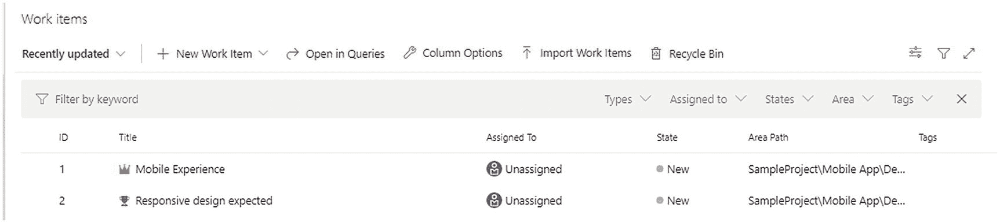
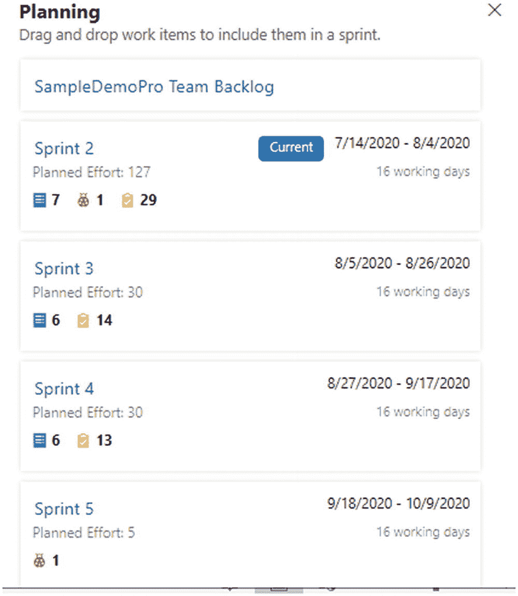
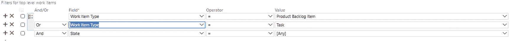

# 三、Azure DevOps 需求管理

需求管理对任何项目的成功都很重要。一个合适的需求管理工具将帮助你从不同的涉众和不同的视角收集需求，并对软件开发的不同组件进行端到端的跟踪。Azure DevOps 提供了一组特性来处理需求和相关功能。本章将深入探讨 Azure DevOps 提供的需求管理特性。

过程模板定义了项目执行的方式和不同的需求类别，如任务、用户故事等等。我们在前面的章节中讨论了各种过程模板。本书的其余部分将关注基于 scrum 的过程模板。除了需求处理之外，其他模板没有什么不同。

## 工作项目

工作项以系统的方式捕获需求。根据您选择的过程模板，不同的工作项将可用于跟踪应用开发的整体进度。当使用 Scrum 模板时，以下是可用于跟踪需求的不同工作项目:

*   *Epic* :这捕获了高层次的业务需求。如果史诗很复杂，它可以被进一步定义为子史诗，以正确地跟踪需求。

*   *特性*:它定义了作为应用的一部分发布的功能特性。Epics 将被映射到父子关系中的多个特性或产品待定项(pbi ),这将满足预期的业务需求。

*   *产品待办事项*:跟踪用户特定的动作。

*   *任务*:这是开发产品需要完成的实现工作。

*   *Bug* :跟踪实现中的任何功能性或非功能性缺陷。

*   *障碍*:这是项目执行过程中遇到的挑战。

*   测试计划:这捕获了团队遵循的整体测试策略。

*   测试套件(Test Suite):这是一组测试用例，用于测试特定的特性、版本或模块。

*   *测试用例*:这是一组步骤，将被执行来验证特性实现的正确性。

“工作项”部分是您定义新工作项和相关功能的地方。让我们探讨一下本节中提供的不同功能。

### 工作项目

“新建工作项”选项用于向项目中添加新的工作项。Scrum 过程模板允许您使用工作项模板来捕获需求，如图 [3-1](#Fig1) 所示。

图 3-1

新工作项选项

创建一个 epic 来探索作为工作项一部分的不同字段和选项，如图 [3-2](#Fig2) 所示。

图 3-2

新史诗

#### 工作项字段:详细信息选项卡

Details 选项卡捕获与工作项目相关的所有相关细节，例如描述、优先级等等。

*   标题:这是需求的简要描述。例如，描述“移动体验”意味着企业希望应用能够在移动设备上正常运行。

*   *分配给*:一旦史诗准备开始工作，就可以分配给一个团队成员进行提炼。

Note

*待定项细化*，以前被称为*待定项整理*，是整合不同观点、边界条件、风险和缓解、选项验证以及需求的整体方面的过程。不同的涉众讨论需求并捕获所有方面，这有助于实现团队满足需求。另一个重要的概念是*待办事项优先级*，团队对产品待办事项进行优先级排序，以对特性的开发和部署进行排序。

图 3-3

讨论区

*   *状态*:定义工作项的当前进度。epic 的状态值为新、进行中、完成和删除。

*   *区域*:列出项目设置➤团队配置中映射到团队的区域。

*   *迭代*:类似地，一个迭代定义了在项目设置➤团队配置下为这个团队映射的迭代。如果项目级别的区域或迭代对团队不可见，请在“项目设置”“➤团队配置”下验证它。

*   *描述*:该字段详细解释了需求，为实现团队满足需求提供了足够的细节。

*   *验收标准*:定义验证条件，验证工作项实现的完整性。对于任务级别，验收标准可以是该任务的技术实现。从史诗级别来看，这可以描述您如何验证业务或架构史诗的实现。

*   *讨论*:该字段提供了与其他团队成员协作讨论工作项的各种细节的选项，如图 [3-3](#Fig3) 所示。通过添加带有@符号的成员名称，您可以向特定的人询问与工作项相关的问题，您可以引用带有# work item ID 的另一个工作项，并且您可以提供关于工作项的描述或接受标准的反馈。

图 3-4

添加链接

*   *状态*:在状态下，有选项指定执行具体 epic 的开始日期和结束日期。这些数据将帮助实现团队对开发 epic 的总体工作进行优先排序和计算。

*   *明细*:在明细下，为多个字段抓取数据。
    *   *优先级*:定义史诗的优先级。

    *   *工作*:这是实现指定 epic 的估计工作。此字段帮助团队定义功能、产品积压和源自此 epic 的任务的相关工作。

    *   *业务价值*:在这里，您指定一个优先级，该优先级捕获了一个 epic、feature 或 backlog 项目相对于其他同类型项目的相对价值。数字越高，商业价值越大。当你想从 Azure Boards 中可变的 backlog 栈排序中获取一个独立的优先级时，使用这个字段。

    *   *时间关键度*:这是一个主观的度量单位，用于捕捉业务价值如何随着时间的推移而减少。较高的值表明 epic 或特性比那些具有较低值的项目在时间上更重要。

    *   *价值区域*:这是由 epic、feature 或 backlog 项目解决的客户价值。这些值包括以下内容:
        *   *架构*:实现交付解决方案的业务特性的技术服务

        *   *业务*(默认):满足客户或利益相关者需求的服务，直接交付客户价值以支持业务

*   *Deployment* :此部分与发布管道相关，并显示哪个发布包含此 epic 的实现。这将为每个业务需求建立端到端的可追溯性。该字段将在第 [6](6.html) 章中进一步讨论。

*   *Development*: This section links the epic to the branch that holds the implementation, the build that contains the changes, or the commits that capture the implementation. Select the “Add link” option to link to an entity explaining the implementation of the epic. This process can be automated using the repo policies defined in the previous chapter.
    *   *链接类型*:显示链接的项目类型。这可能如下所示:
        *   *Build related* :使用以下选项链接到包含特定 epic 实现的构建:Build、found in build 或 Integrated in build。

        *   *代码相关*:使用以下选项链接到实现代码:分支、变更集、提交、拉请求或版本化项目。在大型项目中，epics 可能拥有一个全新的特性，开发团队可能会创建一个新的分支来处理特性开发。在这样的场景中，epic 将被链接到相应的分支，以建立端到端的可追溯性。提交和拉请求用于链接到基于 Git 的版本控制，而变更集和版本化项用于 TFVC。

        *   GitHub: 这是新引入的链接类型，用于处理 GitHub 与 Azure DevOps 的集成。如果您的版本控制是基于 GitHub 的，那么使用这个选项将实现与 epic 链接起来。可用的选项有 GitHub 提交和 GitHub 拉请求。

    *   其余字段根据链接类型选择而变化。如果将其设置为 Branch，则选项允许您选择与组织中的项目相关联的存储库。一旦选择了存储库，就会显示与该存储库相关的所有分支以供选择。提供注释以完成 epic 与实现代码或构建的链接。如果链接类型设置为构建，系统会提供一个选项来选择一个构建编号。类似地，所有其他选择将提供相应的字段来链接到它。

    *   *相关工作*:在继续定义相关工作项之前，保存当前的 epic。一旦保存了 epic 并生成了 ID，就转到 Related Work 来定义相关的工作项。添加现有项目或新项目有两个选项。现有项提供了将现有工作项与关系相链接的选项。

    选择“新建项目”以浏览有关相关工作项目的更多信息。

新条目提供了定义链接类型的选项，如图 [3-4](#Fig4) (与之前的链接类型不同)处理与 epic 的关系。可用的链接类型如下:

图 3-5

链接类型

*   *子*:定义父子关系。在 epic 的情况下，它可以进一步定义为特性、产品积压、任务等等。

*   复制:这允许你复制同一个 epic 来处理另一个变化或者添加到另一个项目来实现类似的特性。

*   *Duplicate Of:* 这指定当前的 epic 是同一项目或不同项目中定义的另一个 epic 的副本。

*   *Parent* :一个新条目将成为当前工作条目的父条目。

*   *前置*:建立一个顺序关系，依次执行依赖需求。在执行当前史诗之前应该创建一个新物品。

*   *Related* :两个项目有关联，但可能没有父子或顺序执行这样的特定关系。

*   *继任者*:新项目将是下一个要实现的项目。

*   *由*测试:一个新的项目实现将由 epic 描述测试或用于验证。

*   *测试*:一个新项由 epic 对应的测试用例组成，如图 [3-5](#Fig5) 所示。

添加子项以继续。一旦您提供了标题信息并单击确定，系统将在一个对话框中打开新项目，以便您可以填写所需的信息。填写所需的详细信息，然后选择保存并关闭以导航回 epic。

#### 工作项字段:历史选项卡

在一个工作项中，History 选项卡捕获了一段时间内的所有变更，如图 [3-6](#Fig6) 所示。出于审计目的，Azure DevOps 会跟踪所有操作。该选项卡显示了由何人在何时完成的更改。此外，它还捕获变更细节，比如添加一个新的子项。

图 3-6

历史

#### 工作项字段:“链接”选项卡

导航到链接选项卡，查看所有相关项目，如图 [3-7](#Fig7) 所示。系统还提供了一个选项，可以从这个选项卡中添加新的或现有的工作项。

图 3-7

链接选项卡

选择省略号图标(…)查看可用选项。对于每个链接的项目，系统提供两个选项。

*   *编辑注释*:您可以编辑作为链接项目的一部分而输入的注释。

*   *移除链接*:可以移除两个工作项之间的关系或链接。

#### 工作项字段:附件选项卡

Attachments 选项卡提供了一个附加相关文档的选项，如架构图、为 UI 设计准备的线框、技术设计决策或任何其他与 epic 相关的工件，如图 [3-8](#Fig8) 所示。

图 3-8

添加附件

添加后,“附件”标签会提供不同的视图。

*   *网格视图*:以网格格式列出附件。

    单击省略号图标(…)查看可用于添加附件的操作。

    *   *编辑评论*:这允许您编辑作为附件上传的一部分输入的评论。

    *   *预览附件*:根据附件的类型进行预览。如果是图像，会显示预览。但是，如果附件是文档，它不会显示任何预览。

    *   *下载附件*:允许您下载附件。

    *   *删除附件*:您可以删除不想要的或错误附加的文档。

*   *缩略图视图*:以卡片形式列出附件。将光标悬停在卡片顶部可查看上下文菜单图标(…)，单击它可查看菜单选项。

#### 工作项选项

现在，看看定义的 epic 上可用的选项。右上角有一组可用的选项，包括“保存”按钮。

图 3-9

工作项选项

其他可用选项如下:

*   *Follow* :这允许您被通知工作项的变更。

*   *设置*:包括工作项级别的通知设置。如果任何工作项目非常重要或者确实影响到您的活动或者具有很高的商业价值，您可以使用这些设置来跟踪它们。可用的选项如下:
    *   *未订阅(默认):*这不是在工作项级别订阅的。但是，如果工作项将成为任何项目或组织通知设置的一部分，则会显示出来。

    *   *已订阅*:您可以接收与某个具体工作项目相关的所有通知。

    *   *Custom* :这允许您选择特定的通知选项，例如仅在状态发生变化时发送通知。

*   *刷新*:刷新项目，以反映其他用户或其他系统所做的更改；例如，链接到工作项的提交将立即得到反映。

*   *恢复*:恢复未保存的更改。如果没有未保存的更改，则保存和刷新图标都将被禁用。

*   *Options (…):* 这为一个工作项提供了额外的操作和配置。可用的选项如下:
    *   *新建链接工作项*:这是添加链接工作项的另一个选项。

    *   *变更类型*:变更工作项的类型；例如，您可以根据详细的分析将一个 epic 更改为一个特性，或者将一个任务更改为产品 backlog。“更改工作项类型”向导提供了一个选项来选择目标类型并提供更改的原因。此信息将作为工作项历史的一部分被跟踪，并且可以在将来被审核以了解更改的原因。

    *   *移动到团队项目*:将现有的工作项移动到组织内的另一个项目。此外，如果需要的话，这个选项允许您将工作项类型作为移动的一部分进行更改。“移动工作项”对话框提供了一个选项来选择目标项目，键入并提供移动的原因，以便进行跟踪。

    *   *创建工作项的副本…* :在相同或不同的项目中创建现有工作项的副本。此选项还允许您将工作项复制到不同的工作项类型。在复制的时候，系统允许您包含相关的工件，比如附件、链接和子工作项。

    *   *邮件工作项目*:通过邮件分享工作项目。此选项将打开“电子邮件构造”页面，其中包含添加到电子邮件 id、指定主题、在注释字段中添加详细信息以及附加工作项目的主要详细信息的选项。通过向工作项 ID 添加超链接，工作项数据可以链接到工作项。电子邮件的接收者可以使用这个链接直接打开工作项。

    *   *删除*:删除当前工作项。

    *   *Templates*: Create a template to define the default values for a set of fields. For example, you can define a task template with a predefined area path for a team and share it with them, as shown in Figure [3-10](#Fig10).

        

        图 3-10

        捕获模板

        保存后，使用“复制链接”来复制模板的链接，该链接可以与其他人共享，或者发布在您的团队配置或仪表板上，以基于该模板创建新的工作项。也可以通过选择工作项上下文菜单来应用模板。

*   *New branch* :这个选项允许您从现有的分支中创建一个新的分支，并链接到当前的工作项。当 epic 代表一个特性，并且开发特性的团队遵循一个特性分支策略时，那么这个选项支持快速分支和链接操作。

*   *Request Feedback:* You can request a team member or stakeholder verify the completeness of the current work item or provide feedback on the work item. This feature is used to fine-tune the work items before considering them as part of sprint planning or can be used to get different viewpoints or sign-off from concerned stakeholders, as shown in Figure [3-11](#Fig11).

    

    图 3-11

    请求反馈

    The “Request feedback” dialog allows you to specify the target members of the feedback request and instructions to provide the feedback, as shown in Figure [3-12](#Fig12). The Preview option shows the preview of the mail shared with the team.

    

    图 3-12

    预览反馈请求 1

    图 [3-12](#Fig12) 显示了请求反馈邮件的预览。该电子邮件捕获项目名称和请求者所属的团队。向下滚动查看“提供反馈”按钮。单击此按钮会将用户带到指定的工作项，在那里用户可以在讨论部分提供反馈。

*   *定制*:这将把用户带到组织设置➤板➤过程定制。过程模板定制在第 [2](2.html) 章中介绍。

*   *键盘快捷键*:该选项突出显示了 Azure DevOps 中使用的重要键盘快捷键。通过单击“键盘快捷键完整列表”链接，您可以参考完整的快捷键集。

工作项上剩下的两个可用选项是 comments 和 Add tag。

*   *Comments* :这提供了添加到工作项中的讨论数量，以及一个到工作项中讨论部分的导航链接。

*   *添加标签*:这个选项提供了一个向工作项添加标签的工具。标签有助于过滤和查询工作项。

### 过滤

导航回“工作项”部分，查看到目前为止创建的所有工作项，如图 [3-13](#Fig13) 所示。

图 3-13

工作项目

正如您在图 [3-13](#Fig13) 中所看到的，一组过滤选项就在工作项目列表的上方。这些选项有助于过滤所需的工作项。可用的过滤器如下:

*   *按关键字*过滤:根据需求，使用*特性*或*史诗*等关键字过滤工作项列表。

*   *按类型过滤*:按类型过滤工作项。此筛选器选项基于过程模板列出所有可用的工作项类型。可以选择多种类型来查看各种类型的工作项。

*   *按分配给*过滤:根据工作项分配给团队成员进行过滤。

*   *按状态过滤*:根据工作项的各种状态进行过滤。

*   *按区域过滤*:按定义的区域过滤。

*   *按标签过滤*:按标签过滤。此选项允许您使用 OR 和 and 运算符组合标签。

### 查看选项

图 [3-14](#Fig14) 显示了工作项右上角的可用视图选项。

图 3-14

查看选项

*   *查看*:可以查看列表中是否已经完成的工作项。

*   *过滤器*:这个选项允许你查看过滤器选项，在前面的章节中已经讨论过。

*   *全屏*:最后一个图标允许您以全屏模式查看工作项目列表。

### 选择

以下是工作项列表顶部的可用选项:

图 3-15

列

*   *最近使用的*:该下拉菜单提供了基于一些参数进行过滤的选项，例如分配给用户的工作项、用户正在关注的工作项、在讨论中提到用户名字的项、与用户活动相关的项以及基于最近状态更新的项。

*   *新的工作项*:这个选项支持向项目中添加新的工作项，在本章的前面已经讨论过了。

*   *在查询中打开*:这将在查询窗口中打开过滤后的工作项列表，您可以在其中添加更多的过滤器和查询元素。我们将在本章后面更详细地讨论查询。

*   *列选项*:该选项允许您在工作项的网格视图中添加新的列或者删除已有的列，如图 [3-15](#Fig15) 所示。此外，您可以基于特定的列设置工作项的默认排序顺序。

*   *导入工作项*:工作项可以使用 CSV 文件离线准备，批量导入到系统中。

    Explore this feature further using the sample CSV file content shown in Figure [3-16](#Fig16), with one task and one bug. If required, we can add more columns such as Description, Area Path, etc., and capture the requirement details.

    

    图 3-16

    数据

    选择“导入工作项”选项将文件上载到 Azure DevOps。

    The system will parse the data based on the columns defined and shown to the user to confirm, as shown in Figure [3-17](#Fig17). The user can either edit the data or save it as is.

    

    图 3-17

    上传的数据

    Select Save Items to create the work items and generate the IDs for newly created work items, as shown in Figure [3-18](#Fig18).

    

    图 3-18

    保存项目

*   *回收站* : Azure DevOps 允许您通过将状态更改为移除来移除不需要的工作项目。一旦工作项被标记为 Remove，它们将被移动到回收站，在那里用户可以永久删除工作项或通过更改状态来恢复它。

## 纸板

板支持工作项的另一个视图，并提供额外的选项来执行与工作项相关的不同活动。默认情况下，将为每个团队配置一个板。用户可以将其中一个板标记为他们的最爱。

选择其中一个板卡，导航到具体的板卡，查看工作项，如图 [3-19](#Fig19) 所示。每个工作项都显示为带有特定字段的卡片。

图 3-19

选定的电路板

### 电路板选择

有多个选项可用于处理纸板和工作项目。让我们从顶层开始探索特性。在左上角，有选择不同板的选项。根据您的权限，从下拉列表中选择另一个板以导航到不同的板，如图 [3-20](#Fig20) 所示。

图 3-20

团队董事会选择

使用团队板选项上或附近的星形符号将特定板标记为您的最爱。选择星形符号旁边的人员图标以查看团队概要信息页面。这个视图列出了与团队相对应的董事会、backlog、sprints 和仪表板。此外，该视图显示了属于团队的成员。

### 分析学

团队板名称下的下一组选项由以下选项组成:

图 3-21

累积流程图

*   *板子*:工作项会以卡片的形式显示在板子上。

*   *分析*:以累积流量图和速度显示分析报告。

    *累积流程图*:深入了解所选团队的工作量、吞吐量和潜在瓶颈，如图 [3-21](#Fig21) 所示。要自定义报告，请设置列、泳道和时间范围。​

*速度报告*:显示团队在几个冲刺阶段完成工作的平均速度，如图 [3-22](#Fig22) 所示。团队速度是一个团队在 sprint 期间可以完成多少工作的度量，基于不同的度量标准，例如基于 pbi 的工作、基于用户故事的故事点以及基于需求的规模。使用这些信息来规划未来的 sprint 能力。

图 3-22

速度报告

该报告可以基于工作、剩余工作、业务价值、工作项的数量以及要考虑的迭代次数进行定制。

*   *View as Backlog* :在 Backlog 视图中显示工作项目，这将在下一节中讨论。

### 查看选项

与“工作项目”部分类似，电路板也在右上角提供不同的视图选项，如图 [3-23](#Fig23) 所示。

图 3-23

查看纸板选项

第一个选项允许你查看待办事项、史诗和特性。根据选择，委员会更改显示的列和工作项类型。图 [3-24](#Fig24) 显示了电路板的 epics 视图，其中各列已更改为“新建”、“进行中”和“完成”。

图 3-24

史诗观

第二个图标()显示打开和关闭实时更新的选项。第三个图标()切换面板顶部的过滤器选项。最后一个图标()允许用户导航到全屏模式。

### 电路板设置

单击齿轮符号会显示团队配置，尤其是板级配置。设置对话框支持各种选项来定制卡和板。

#### 卡片配置

此部分中的设置有助于自定义卡数据及其外观。

图 3-25

卡片样式 1

*   *字段*:该部分列出了卡片中显示的字段。用户可以在此配置重要字段。

*   *样式*:定义一个样式规则，使重要内容突出。在图 [3-25](#Fig25) 中，选择的样式用不同的背景色定义了 bugs 这使得 bug 在板中很突出。

一旦应用了这种风格，电路板就会改变其 bug 显示，如图 [3-26](#Fig26) 所示。

图 3-26

卡片样式 2

图 3-27

标签颜色

*   *标签颜色*:标签颜色支持不同标签颜色的配置。选择一个标签，并针对每个标签配置颜色，以突出显示纸板中的一些重要标签。

    一旦标签颜色被应用，卡片将改变标签的显示，如图 [3-27](#Fig27) 所示。

图 3-28

注释 1

*   *标注*:标注显示当前工作项链接的任务、测试或 GitHub 的数量，如图 [3-28](#Fig28) 所示。默认情况下，所有这些可视图标都被选中并显示在卡片上。

在图 [3-29](#Fig29) 中，有三个任务与当前工作项和一个测试用例相关联。这三项任务中，一项已经完成，另外两项正在进行中。

图 3-29

注释 2

*   *测试*:该配置定义了测试应该如何在卡上显示。

#### 电路板配置

“板配置”部分定义了可用于配置板的定制选项。以下是可用的选项:

图 3-30

列移动

*   *列*:定义板卡中可用的列。默认情况下，有四个不同的列:新建、已批准、构建和测试以及部署。

    每个列部分显示了 bug 和产品 backlog 项的列名和状态映射。此设置与待办事项相关。如果我们打开与史诗或功能相关的设置，将会列出不同的选项。

    “已批准”列有额外的选项来配置工作进行中限制，指示应该显示或显示为进行中的工作项目的数量。这一部分允许你将栏目分为待办事项和已完成事项。done 的定义是另一种配置，可用于定义对标记为 Done 的工作项进行限定的标准。Build 和 Test 列有相似的选项来配置 WIP、done 的定义和列的拆分。

    此外，该选项卡使您能够使用顶部的加号或使用列名标题上的选项向电路板添加列，如图 [3-30](#Fig30) 所示。

图 3-31

泳道 1

*   *泳道*:泳道允许您对工作项目进行水平分组。默认情况下，只有一个泳道可用。此设置允许您添加更多泳道，以便在板上水平分组工作项。在图 [3-31](#Fig31) 中，配置了两条新的泳道:bug 和产品 Backlog。

默认情况下，新创建的泳道将是空白的。用户可以使用不同的泳道拖拽工作项，使其水平排列，如图 [3-32](#Fig32) 所示。

图 3-32

泳道 2

图 3-33

卡片重新排序

*   *卡片重新排序*:该配置定义了卡片拖放到新列时的行为。订购卡片有两种选择:要么将新卡片放在放置位置，要么将其推到起始位置，并保持其他卡片的顺序不变，如图 [3-33](#Fig33) 所示。

图 3-34

状态徽章

*   *状态徽章*:徽章将用于在仪表盘上显示团队的当前状态。可以使用此部分并复制图像 URL 来配置徽章，徽章可以插入到任何自定义应用中以显示状态信息，如图 [3-34](#Fig34) 所示。

#### 一般配置

本部分包含与团队板相关的常规设置:

*   *待办事项*:待办事项配置允许您配置团队板中可用的待办事项导航级别。

*   *工作日:*此配置允许您配置团队的工作日。这些信息支持团队的容量规划。

*   *处理 bug*:配置你的团队如何处理 bug。一些团队将 bug 和任务一起考虑，并将它们包含在 sprint 计划中；其他人以不同的方式处理 bug，不会将它们包含在 backlog 和 sprint 规划区域中。

### 信用卡

棋盘上的每张卡片代表一个工作项目。如果选择的视图是针对待办事项的，那么卡片显示与当前团队相关联的待办事项。在卡片的开头，有一个使用这个图标添加新项目的选项:。该选项支持创建新的产品 backlog 或 bug。如果视图改变，那么这个选项允许你创建一个新的功能和史诗。

每张卡片都具有在棋盘上拖放的功能，这将根据拖放的位置或列来改变项目的状态。卡片上会有一个徽章，标明工作项目的类型和头衔，如图 [3-35](#Fig35) 所示。其余字段是可选的，可以根据卡的设置进行配置。

图 3-35

卡片

卡片设置提供了在线编辑内容的选项，如分配、工作、优先级、状态和区域路径。选中时，这些字段中的每一个都提供了有效值列表，并允许更改值，如图 [3-36](#Fig36) 所示。

图 3-36

状态

每张卡都有一个右上角菜单(…)支持附加操作，如图 [3-37](#Fig37) 所示。

图 3-37

上下文菜单

以下是卡片菜单中可用的附加选项:

*   *Open* :这允许您以弹出窗口的形式打开工作项。也可以通过单击工作项的标题来打开工作项。

*   *编辑标题:*这允许标题的内嵌编辑。

*   *移动到迭代*:将工作项分配给一个特定的迭代，比如 Sprint 2 或者 Sprint 3。

*   *增加任务*:增加一个子任务，实现产品待办事项的全部或部分。一个产品 backlog 可以有多个任务来实现它。“添加任务”操作展开卡片，并提供输入任务标题的选项。

    添加后，用户可以通过单击标题并填写剩余的详细信息(如果需要)来导航到任务。

    此外，该视图允许您通过拖动来重新排列任务的顺序。新添加的任务可以上移，以首先完成它们或为它们设置更高的优先级。

Note

如果用户使用复选框选择了该任务，这表明该任务已完成并标记为完成。

图 3-38

测试套

*   *添加测试*:与添加任务相同。用户可以针对产品待定项添加测试用例来测试功能。

    使用“添加测试”旁边的右箭头，可以打开对应于测试用例的测试套件图 [3-38](#Fig38) 显示了为一些测试用例打开的测试套件。我们将在本章后面更详细地讨论测试套件。

*   *删除*:删除工作项。这将把工作项移入回收站。如果需要，用户可以还原工作项。

*   *New Branch* :创建一个新的分支来实现当前的工作项，并链接到该工作项。

## 存货

积压工作部分提供了工作项的另一个视图，并支持板中可用的大多数选项，如图 [3-39](#Fig39) 所示。

图 3-39

积压标签

它们不是以卡片的形式列出工作项，而是以分组列表的形式显示，并带有进行迭代或冲刺计划的选项。选项，如团队待办事项筛选器；最喜欢的图标；团队设置；过滤器；基于 backlog、epics 和 feature 的不同视图；过滤器选项；分析；和新的工作项与板相同。本节将讨论其他选项。

Backlog 项可以展开以查看每个 backlog 下定义的任务。使用待办事项列表标题上的+和–图标一次展开和折叠所有项目。为了计划每个 sprint 的活动，可以将待办事项拖放到右侧显示的相应 sprint 中，如图 [3-40](#Fig40) 所示。

图 3-40

积压计划

使用 Planning blade 末尾的新 Sprint 选项，您可以向列表中添加更多的迭代 Sprint。可以关闭 Planning blade 来查看工作项的更多字段。

### 列选项

此选项有助于配置工作项列表中所需的列。有两种类型的列。一个与工作项相关的字段相关，另一个与汇总列相关。“汇总”列是基于子任务和链接项的计算字段。在产品待定项的情况下，rollup 列考虑链接到待定项的任务和测试用例。

图 3-41

列选项

在图 [3-41](#Fig41) 中，配置了两个汇总列:按任务进度和任务计数。图 [3-42](#Fig42) 显示了待办事项的新视图。

图 3-42

汇总列

总成域提供了有关任务和相关工作项的完整性的大量信息。

预定义的汇总字段如下:

*   *所有工作项的进度*:进度指标，通过计算与当前待办事项相关的所有工作项的进度

*   *按 bug 进度*:仅基于 Bug 的进度计算

*   *努力进步*:基于努力的进步

*   *按任务进度*:按任务完成进度

*   *工作项计数*:关联工作项计数

*   *Bug 计数*:针对 backlog 记录的 Bug 计数

*   *任务计数*:任务计数

*   *努力总和*:努力总和

*   *剩余工作总和*:剩余工作总和

除了这些预定义的汇总列，Azure DevOps 还提供了一个定义自定义汇总的选项，如图 [3-43](#Fig43) 所示。

图 3-43

自定义汇总 1

选择“配置自定义汇总”继续。从选项中选择汇总类型；您可以选择进度条或总显示，如图 [3-44](#Fig44) 所示。此外，选择工作项类型和列度量(计数或总和)。

图 3-44

自定义汇总 2

### 选择

backlog 中有多个选项可以用来处理和维护工作项。列旁边的更多命令(…)选项提供了创建查询和电子邮件选项，如图 [3-45](#Fig45) 所示。

图 3-45

积压选项

Create Query 捕获筛选的工作项作为查询供将来使用。我们将在本章后面更详细地讨论查询。电子邮件选项将用于通过电子邮件格式共享列出的工作项目。

基本工作项的详细信息以及指向工作项的链接将在电子邮件中捕获。

另一组选项可用于视图中列出的工作项。选择工作项标题旁边的图标(…)调用其他可用的操作，如图 [3-46](#Fig46) 所示。

图 3-46

积压选项

这些选项中的大多数已在前面的章节中详细讨论过。Backlog 视图支持批量编辑，也支持一次对一组工作项应用一个操作。

图 3-47

编辑工作项

*   *编辑*:可以编辑工作项的字段。用户可以使用 Shift 和箭头键选择多个工作项。选择多项后，选择编辑选项可以一次性编辑一组字段，如图 [3-47](#Fig47) 所示。

在图 [3-47](#Fig47) 中，选择了 12 项，区域路径设置为`SampleDemoProj\Mobile`，力度不同。在编辑对话框中更改区域路径和效果，然后单击保存。如图 [3-48](#Fig48) 所示，前 12 个工作项的工作量和面积路径发生了变化。

图 3-48

批量编辑结果

图 3-49

添加链接

*   *分配给*:和编辑选项一样，该选项支持批量分配选中的工作项。

*   *Copy to clipboard* :选择一组工作项，并将列出的字段细节复制到一个文件中。

*   *删除*:删除选中的工作项。

*   *Templates* :这从一个工作项中获取模板，如前一节所述。

*   *添加链接*:这将一个链接添加到一个现有的或者新的工作条目中。此操作支持多个工作项与单个工作项的链接。但是根据为工作项链接选择的关系或链接类型，链接可能会失败。例如，在图 [3-49](#Fig49) 中，有 12 个工作项被选中并试图链接到一个链接类型为子级的现有工作项。

由于链接类型是子链接，因此只有一个工作项能够与选定的工作项链接。其余环节将失效，如图 [3-50](#Fig50) 所示。

图 3-50

添加链接结果

*   *移动到迭代*:这将所选择的工作条目映射到一个迭代或者 sprint。

*   *Change parent* :这将工作项的父项更改为一个不同的现有工作项。

*   *移动到位置*:这个选项有助于在 Backlog 视图中重新排列工作项目的优先级。这也可以通过将工作项拖动到不同的位置来完成。

*   *变更类型*:这将变更工作项的类型，如前一部分所解释的。

*   *移动到团队项目*:这将工作项移动到另一个团队项目。

*   *Email* :通过电子邮件将工作项目发送给一个小组或者涉众，以审查内容。

*   *New Branch* :为实现该工作项创建一个新的分支。

## 短距离赛跑

Sprints 部分提供了为迭代或 sprint 计划的工作项、sprint 的持续时间、工作完成的进度、从事 sprint 的团队以及其他 sprint 相关信息的视图，如图 [3-51](#Fig51) 所示。使用董事会和积压订单，团队决定 sprint 的工作项目。一旦 sprint 的工作项最终确定，团队就可以根据可用的细节开始实现它们，而不考虑计划中的任何变化。

图 3-51

短距离赛跑

sprint 视图为执行 sprint 活动提供了各种选项。该视图将作为每日例会的一部分，用于跟踪进度。左上角有允许导航到 sprint 目录和其他团队的 sprint 视图的选项，如图 [3-52](#Fig52) 所示。接下来的两个图标显示收藏夹和团队概况，与公告板和积压工作部分相同。

图 3-52

Sprints 选项

右上角显示冲刺的开始和结束日期以及燃尽趋势，如图 [3-53](#Fig53) 所示。可以编辑 Sprint 的开始和结束日期，但通常不建议这样做。在 sprint 开始后，不建议对 sprint 节奏或工作项目进行更改。

图 3-53

冲刺:首选

燃尽趋势显示了冲刺活动的进度。随着时间的推移，活动应该完成了，趋势线应该是向下的。如果趋势线没有出现稳步下跌，那么就有可能无法按时完成活动。我们将在本书的后面讨论不同的 sprint 仪表盘。通过选择燃尽趋势图标，打开燃尽趋势报告，如图 [3-54](#Fig54) 所示。

图 3-54

燃尽趋势报告 1

您可以进一步深入查看该报告，其他详细信息可在“分析”选项卡上获得，或者通过选择该报告顶部的“查看完整报告”链接获得，如图 [3-55](#Fig55) 所示。

图 3-55

燃尽趋势报告 2

该行显示理想趋势，而该列显示实际进展。报告顶部提供了各种过滤和搜索选项，可以从中提取所需的信息。

图 [3-56](#Fig56) 显示了团队名称下方的下一组可用选项。

图 3-56

更多冲刺选项

图 3-57

容量

*   *Taskboard* :这显示了板中的 sprint 工作项，就像 Boards 部分一样。工作项卡提供了类似于 Boards 部分中的卡的选项，允许您更改卡的外观和感觉，并对工作项进行有限的操作。

*   *Backlog* :这是一个类似于 Backlog 部分的视图，但是受限于为所选择的 sprint 映射的工作项目。

*   *容量*:该部分帮助配置团队容量。根据团队的可用性，可以计算出 sprint 的总工作量。团队可以输入休息日和部分可用性数据，这有助于 sprint 规划。

    团队可以使用“能力”选项卡中提供的链接输入休息日。

    团队还可以指定一个人可以执行的工作或活动的种类，如图 [3-57](#Fig57) 所示。

此外，该选项卡有助于为一个团队成员添加多个活动，并将该用户的可用性或工作分配给多个活动，如图 [3-58](#Fig58) 所示。scrum 大师可以使用所有这些细节来计划冲刺。

图 3-58

冲刺:容量 2

图 3-59

人员视图

*   *分析*:显示上一节讨论的燃耗趋势报告。

*   *新工作项:*这显示了向列表添加新工作项的另一个选项。

*   *列选项*:显示板卡的不同列选项。用户可以使用这个选项根据 sprint 需求添加或删除列。

*   *sprint* :选择不同的 Sprint，查看每个 Sprint 计划的工作项目或之前 Sprint 已经完成的项目。

*   *人员全部*:可以过滤指定团队成员的视图，如图 [3-59](#Fig59) 所示。此视图将展开并仅显示分配给所选团队成员的工作项；剩余的工作项将处于折叠模式。

图 3-60

工作细节

*   *查看选项*:默认情况下，任务板显示待办事项下分组的工作项。您可以使用“人员”选项更改此视图，将他们分组到分配的团队成员下。这将有助于推动每日站立电话和跟踪个人的进展。

    此外，用户可以选择侧窗格来显示工作细节或计划。“工作细节”按活动和团队成员显示工作组，并显示待完成的工作或完成工作所需的努力，如图 [3-60](#Fig60) 所示。

计划显示迭代或 sprints，其中包含许多计划的工作项、计划的工作、开始和结束日期以及其他细节，如图 [3-61](#Fig61) 所示。

图 3-61

冲刺:计划

*   *滤波器*:切换板卡可用的滤波器选项。

*   *设置*:这是板卡部分设置的子集，决定板卡数据和一般设置。

*   *全屏:*以全屏模式显示该部分，为用户处理工作项目提供额外的屏幕空间。

## 问题

查询部分支持基于各种标准过滤所需的工作项。初始视图在 My Queries 和 Shared Queries 下面列出了保存的查询，其中 My Queries 只对用户可用，而 Shared Queries 将在整个团队中共享。

为了更好地管理，用户可以在“我的查询”和“共享查询”下创建子文件夹，并将相应的查询移动到这些文件夹中。使用查询列表顶部的“新建文件夹”选项，在任何现有文件夹下创建一个新文件夹。用户可以定义新的查询，也可以将现有的查询拖到文件夹中。在图 [3-62](#Fig62) 中，两个现有的查询被拖到共享查询下名为 Bug Related 的新文件夹中。

图 3-62

文件夹

Import Work Items 提供了导入 CSV 文件的选项，在前面的部分中已经解释过了。通过关键字过滤，您可以根据特定的过滤条件(如 bug)对查询进行过滤，如图 [3-63](#Fig63) 所示。

图 3-63

过滤查询

对于每个查询，都有一个通过选择星号图标将查询添加到收藏夹列表的选项。此外，有多个选项作为文件夹和查询的上下文菜单。

图 3-64

运行查询

*   *运行查询*:运行查询并显示结果页面，如图 [3-64](#Fig64) 所示。

*   *编辑*:这允许您编辑一个已有的查询。

*   *重命名:*这允许您重命名现有的查询。

*   *删除*:删除查询。

*   *添加到团队收藏夹*:这允许您将查询添加到团队收藏夹列表。

*   *安全性*:定义查询的安全性和权限。选择用户或组，并允许诸如参与、删除、权限管理和读取等权限。用户可以设置权限，如允许、拒绝和不设置。

*   *添加到仪表板*:将不同形式的查询结果添加到团队的仪表板中。

### 新查询

新建查询将打开带有默认查询条件的页面，如图 [3-65](#Fig65) 所示，该页面列出了所有状态的所有工作项。选择“运行查询”选项以执行默认查询，默认查询会在查询本身下方显示查询结果。

图 3-65

默认查询条件

默认情况下，查询结果视图中只列出几列。用户可以使用列选项添加更多列。“保存查询”选项将用于将查询保存到不同的文件夹中。

保存查询后，使用不同名称保存查询(另存为)和重命名的新选项将出现在顶部选项列表中。以下是查询编辑器上的一些其他可用选项:

*   *结果页签*:在单独的页签上显示查询结果。

*   *新选项*:这有助于创建新的查询或工作项。

*   *恢复更改*:将启用此选项，恢复尚未保存的更改。

*   *邮件查询:*发送当前查询结果。

*   *复制查询 URL* :这将复制当前的查询 URL，这将允许团队成员将其共享给其他风险承担者，以引用特定的查询列表。

*   *导出为 CSV* :将结果导出为 CSV 格式，供离线参考。更新后，这也可以导入回系统。

#### 查询类型

有三种类型的查询可用。

图 3-66

工作项的平面列表

*   *工作项列表(默认)*:这是工作项列表，如图 [3-66](#Fig66) 所示。

*   *工作项和直接链接*:这些是带有一级子元素的工作项。

*   *工作项目树*:这些是具有多级视图的工作项目。

“工作项和直接链接”项根据所选择的过滤选项和链接选择的类型显示带有直接链接的工作项，如图 [3-67](#Fig67) 所示。

图 3-67

工作项和直接链接

不同的过滤器选项可用，如图 [3-68](#Fig68) 所示。

图 3-68

过滤选项

“工作项树”也由不同的过滤器选项和树类型控制。有两个可用的过滤器选项:首先匹配顶级工作项和首先匹配链接的工作项。树的类型也有两个值:重复/重复和父/子，如图 [3-69](#Fig69) 所示。

图 3-69

工作项树

此外，在这两种情况下，都有对应于顶级工作项和链接工作项的过滤器。过滤器定义了工作项的过滤条件或要求。可以使用过滤器行开头的加号添加新过滤器，并使用过滤器旁边的十字图标删除新过滤器。第三个图标是复选框，代表基于逻辑运算(如 AND 或 or)的过滤器分组。

例如，图 [3-70](#Fig70) 显示了文件管理员仅查看任何状态的任务和产品积压。使用复选框选择过滤器，然后单击顶部的组图标对其进行分组。

图 3-70

过滤

接下来的三列显示了定义核心过滤条件的字段、运算符和值的组合。

用户可以查询组织中的所有项目，以查看组织中的工作状态。选择“跨项目查询”选项来查询整个组织中的工作项。

### 脱机工作

Export to CSV 选项允许您将查询结果下载为 CSV 格式。

下载的数据将只选择列作为查询结果的一部分。如果需要更多列，请在下载之前选择该列，以便将其包含在结果中。如果结果包含多个标题字段，如图 [3-70](#Fig70) 所示，那么查询将是带有直接链接的工作项或工作项树。在图 [3-70](#Fig70) 中，标题 1 显示产品待办事项的标题，而标题 2 显示任务的标题，即产品待办事项的子任务。

要向 Azure DevOps 添加或删除离线工作项，请从 [`https://visualstudio.microsoft.com/downloads/`](https://visualstudio.microsoft.com/downloads/) 安装并配置 Azure DevOps Office 集成。

现在，打开一个 Excel 文件，导航到团队➤新列表选项。

添加或选择 DevOps 服务器以继续。一旦选择了服务器，就会列出所有的组织和团队项目，如图 [3-71](#Fig71) 所示。

图 3-71

正在连接到 Azure DevOps 服务器

选择团队项目，连接到项目，得到可用查询列表，如图 [3-72](#Fig72) 所示。

图 3-72

选择查询

选择查询，将查询结果加载到 Excel 表中，如图 [3-73](#Fig73) 所示。

图 3-73

工作项的脱机视图

添加没有 ID 字段的新工作项，或者编辑已有的工作项详细信息，对工作项进行离线工作，如图 [3-74](#Fig74) 所示。编辑完成后，单击“发布”将更改发布到 Azure DevOps。

图 3-74

工作项的脱机编辑

一旦发布，新添加的 id 将被填充到 Excel 电子表格中，如图 [3-75](#Fig75) 所示。Excel 提供了一些额外的选项来管理工作项，例如选择列、编辑区域和迭代的能力，等等。

图 3-75

发布工作项

## 摘要

Azure DevOps 特性从各个方面支持端到端的需求管理。业务需求可以使用各种 epics 和特性来捕获，而底层实现任务将使用产品 backlog 项目和任务来捕获。需求不限于功能和架构需求；Azure DevOps 还涵盖了 nfr，比如可伸缩性测试、安全性测试、性能测试等等。系统支持需求在不同维度上的可追溯性，例如基于需求开发的代码、为验证需求而执行的测试用例、实现中识别的缺陷、包含需求的构建或发布等等。