# 4.使用 Azure DevOps 进行版本控制

代码的版本控制在 DevOps 实现中非常重要。版本控制系统通过跟踪和控制代码中的更改，使您能够与团队成员协作。大多数版本控制系统提供了团队成员在相同的代码库或文件上并行工作所需的基本特性。这些特性包括对代码进行版本控制、回滚到以前的版本、比较版本以识别变更等等。

本章关注版本控制系统、分支和合并策略，以及相关的功能。

## 回购

存储库定义了 Azure DevOps 的源代码管理组件。您可以在团队项目中配置多个存储库，以管理与项目相关的不同源代码。例如，团队可以为 UI 应用程序计划一个 repo，并为 API 开发计划另一个 repo。

一旦创建，这个新的回购将是空的。初始化自述文件是一个可选步骤，但却是行业最佳实践，如图 [4-1](#Fig1) 所示。自述文件有助于读者理解项目的用法、语言以及项目设置所需的步骤。

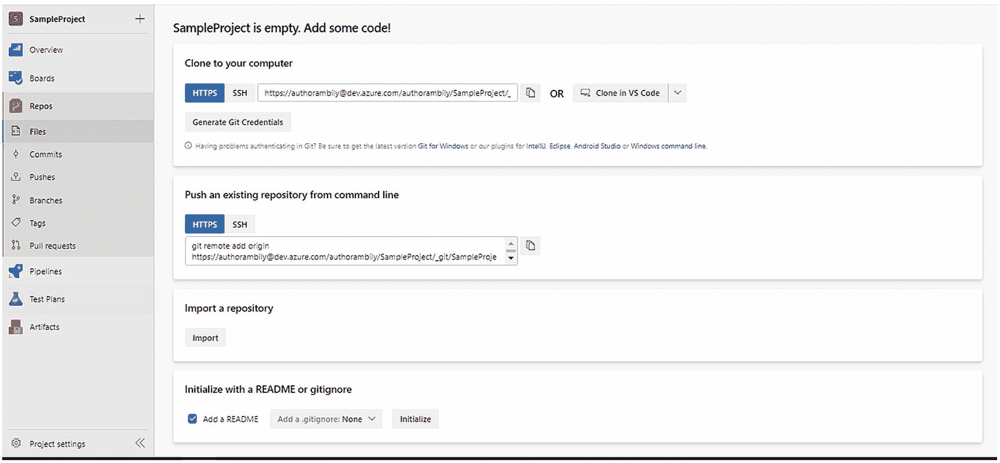

图 4-1

初始回购设置

团队可以通过直接从另一个存储库中导入现有的 repo，或者通过使用命令行从系统中推送现有的项目，来设置 repo。

以下是用于从本地系统推送现有代码库的步骤:

1.  打开命令提示符(启动➤命令)。

2.  导航到包含项目源代码的文件夹。

    应该在克隆或推送 Git 存储库之前安装 Git。从 [`https://git-scm.com/download/win`](https://git-scm.com/download/win) 下载 Git 并安装继续。

3.  使用以下代码初始化 Git 存储库:

    ```
    git init

    ```

4.  一旦存储库被初始化，通过将`origin`添加到`git remote`命令，将本地 Git 设置链接到 Azure“远程”repo，以便它们可以通信。

    ```
    git remote add origin https://authorambily@dev.azure.com/authorambily/SampleProject/_git/SampleProject

    ```

5.  一旦 repo 与 Azure DevOps 链接，使用`git push`命令将现有代码从本地版本推送到远程版本。你会在 Azure 仓库中看到名为 SampleProject 的代码。

    ```
    git push -u origin –all

    ```

    这可能会提示您提供 Azure DevOps 凭据以继续。

6.  如果您收到以下错误消息，请设置与我们的回购相对应的分支。

    *无共同参考，无指定参考；无所事事。*

    也许你应该指定一个分支，比如“主”。

    *一切都是最新的*

    To fix the previous error, clone the Azure DevOps repository again using the `git clone` command.

    ```
    git clone https://authorambily@dev.azure.com/authorambily/SampleProject/_git/SampleProject

    ```

7.  使用`cd SampleProject`导航到我们的项目文件夹。

8.  如果没有自动检测到用户名和密码，使用 Git `global`设置命令设置它们。

    ```
    git config --global user.email sss.ambily@outlook.com
    git config --global user,name "Ambily"

    ```

9.  使用以下代码将现有内容添加到本地 Git 存储库中:

    ```
    git add .

    ```

10.  添加内容后，使用以下命令将更改提交到本地存储库:

    ```
    git commit -m "first file update"

    ```

11.  一旦本地代码库准备好与中央存储库合并，使用`git push`命令推送代码。

    ```
    git push

    ```

观察 Azure DevOps 中合并的代码库以及变更命令，如图 [4-2](#Fig2) 所示。

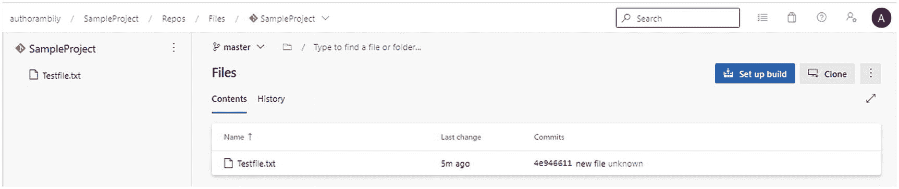

图 4-2

回购文件

用户可以在浏览器中做最小的改变。基于浏览器的代码编辑器支持最低级别的智能感知，如图 [4-3](#Fig3) 所示。

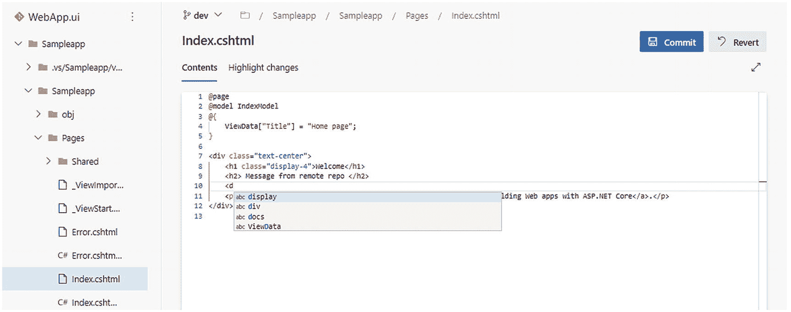

图 4-3

使用浏览器编辑器进行更改

### 分支和合并

在继续之前，让我们探讨一下与回购和分支机构相关的概念。默认情况下，每个回购都有一个关联的分支:主回购。按照行业惯例，主分支代码应该与发布到产品中的代码相同。开发人员将在从主服务器创建的独立分支中工作，通常称为*开发分支*。根据组织的分支和合并策略，分支的数量和名称会有所不同。例如，一些组织使用一个叫做*发布分支*的独立分支来进行生产部署。

应该定义并记录分支策略和合并，以控制与项目相关的发布活动。除了分支和合并，标记还可以用于跟踪中间补丁发布和修补程序。

分支允许以下操作:

*   开发团队在不同的功能中并行工作

*   多个团队，如生产支持和开发人员独立工作

*   对发布管理的适当控制

除非受策略保护，否则您可以从任何现有分支创建分支。如图 [4-4](#Fig4) 所示，在一个正常的项目设置中，如果需要，将会有一个主分支和一个开发分支以及其他特性开发分支。开发人员克隆存储库以及到本地系统的分支来实现这些特性。一旦被克隆，来自远程存储库的更新将被拉至本地存储库，并与本地变更合并。代码实现后，开发人员将代码推回远程存储库。使用*拉请求* (PRs)将分支机构合并到主分支机构或母分支机构。

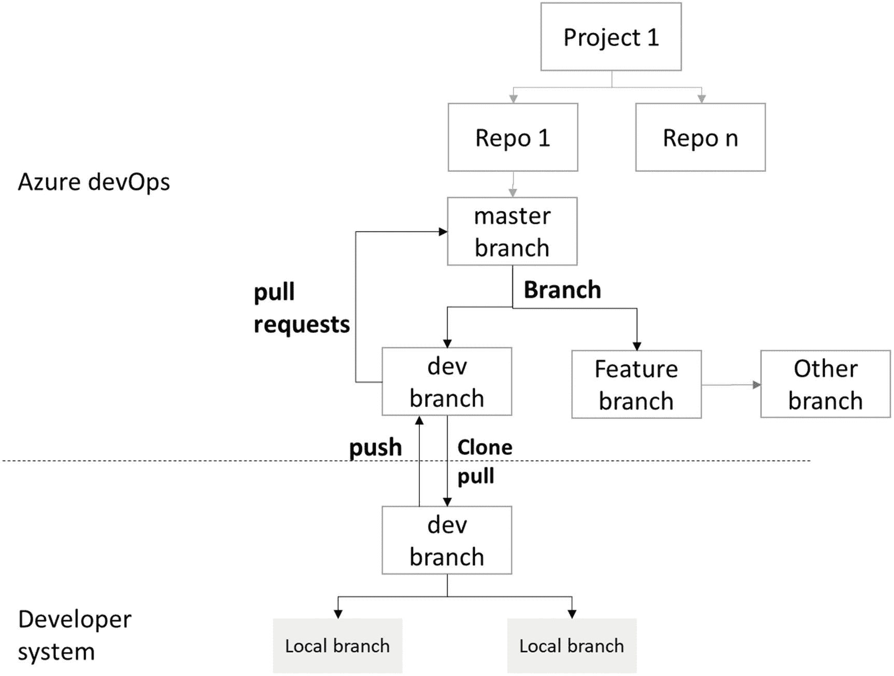

图 4-4

分支、推动和拉动

建议开发人员每天将代码推送到远程存储库，以避免合并变更中的大量冲突。但是，在某些情况下，开发人员将继续在本地副本上工作更长时间，或者在本地 Git 分支中离线工作，以完成该特性的实现。一旦特性实现完成，开发人员将把变更推送到远程存储库。开发人员使用本地 Git 设置中的不同分支来管理代码库和功能实现。例如，开发一个特性的开发人员可能需要处理一个产品 bug，作为修补程序的一部分。在这种情况下，开发人员可以配置不同的分支来处理需求和错误修复。

微软关于分支战略的建议可在 [`https://docs.microsoft.com/en-us/azure/devops/repos/git/git-branching-guidance?view=azure-devops`](https://docs.microsoft.com/en-us/azure/devops/repos/git/git-branching-guidance%253Fview%253Dazure-devops) 获得。

### 项目回购

Azure DevOps 中的项目回购提供了一组有效管理回购的功能。图 [4-5](#Fig5) 显示了回购级别的可用选项。

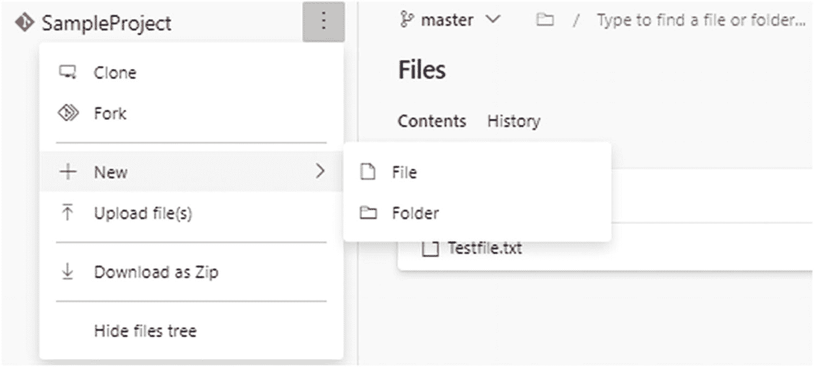

图 4-5

回购级别的期权

*   *克隆*:该选项允许您使用 HTTPS 或 SSH 将回购克隆到本地系统中。此外，它还提供了一个在 Visual Studio 中直接打开存储库的选项。

*   *Fork* :这允许您在当前的或者不同的项目中创建一个现有存储库的副本。

*   *New* :该选项允许您通过浏览器直接在 repo 中添加新的文件和文件夹。

*   *上传文件*:将一个或多个文件从本地系统上传到 Azure repo。

*   *Download as Zip* :将存储库作为 Zip 文件夹下载到本地系统。

*   *隐藏文件树*:隐藏文件树，为文件列表获得更多屏幕空间。

文件树中列出的每个文件的其他可用选项有编辑、重命名、删除和下载。

历史页签列出了所选分支下对当前回购的变更或提交，如图 [4-6](#Fig6) 所示。此外，该选项卡还提供了根据不同的视图、作者以及开始和结束日期过滤数据的选项。每次提交都会通过图形列捕获合并操作，并在提交列中列出其他详细信息。

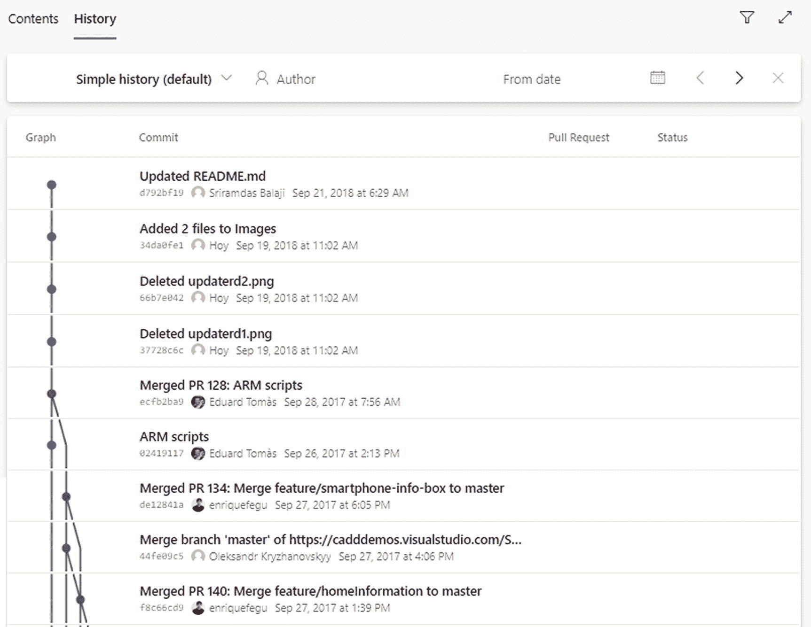

图 4-6

文件历史记录

单击 Commit 条目导航到作为提交的一部分提交的文件，并查看每个文件级别的更改，如图 [4-7](#Fig7) 所示。作为提交的一部分添加的新行或代码将以绿色突出显示，而删除的行将以红色突出显示。

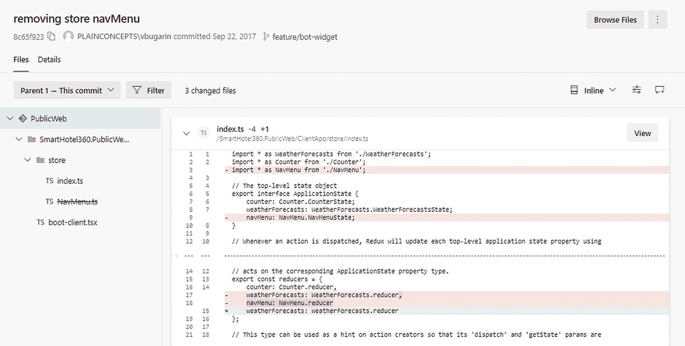

图 4-7

提交历史记录

在变更的顶部有许多过滤选项，可以深入到变更。此外，在右上角有一个选项()可以为提交添加一个全局注释。此选项可用于提供提交的审核注释或更改。

### 分支和标签

基于分支和合并策略，将从远程现有分支创建新分支。此外，用户可以使用标签来标记当前代码库，稍后可以参考该标签来获得特定时间的代码库快照。标记对于将代码版本化到提交历史中的特定点非常有用。标记后，将来可以使用标记检索相同的代码库。例如，作为 QA 版本的一部分创建的标签可以用于调试和重现最新代码库中没有显示的错误。参见图 [4-8](#Fig8) 。

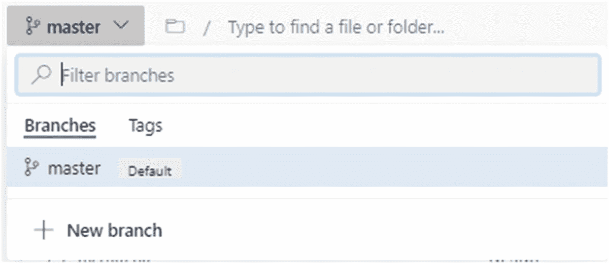

图 4-8

分支和标记选项

使用分支菜单中的“新建分支”选项创建一个新分支，如图 [4-8](#Fig8) 所示。提供新分支和基本分支的名称；基本分支将是您的父分支。见图 [4-9](#Fig9) 。

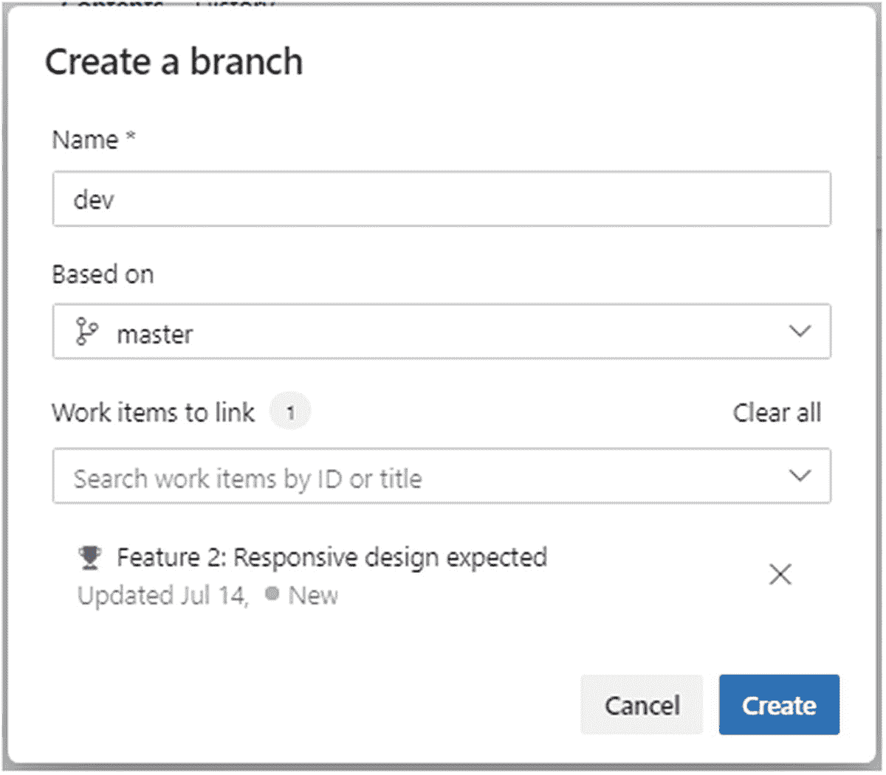

图 4-9

创建新分支

此外，系统允许您将一个或多个工作项链接到新的分支，如图 [4-9](#Fig9) 所示。如果您的分支策略是为每个特性创建一个新的分支，那么将这个新特性链接到这个新分支。

类似地，您可以使用现有存储库旁边的“新存储库”选项来添加存储库，如图 [4-10](#Fig10) 所示。

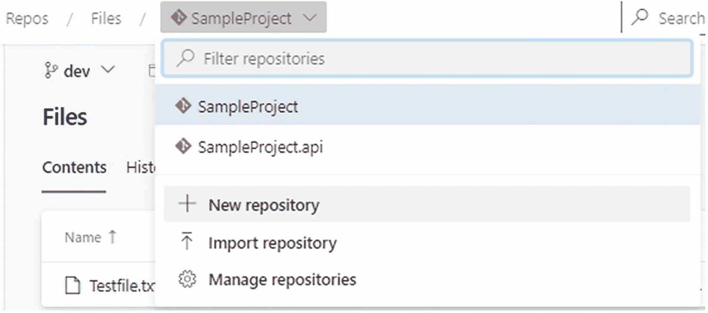

图 4-10

创建新的回购协议

“管理存储库”选项将用户带到项目设置➤存储库，我们在第 [2](2.html) 章中讨论过。“Import repository”选项允许您从其他系统(如 GitHub)或其他组织或项目克隆或导入存储库。

## 承诺

提交部分显示了带有过滤器和选项的提交历史，以便进一步深入查看，如图 [4-11](#Fig11) 所示。

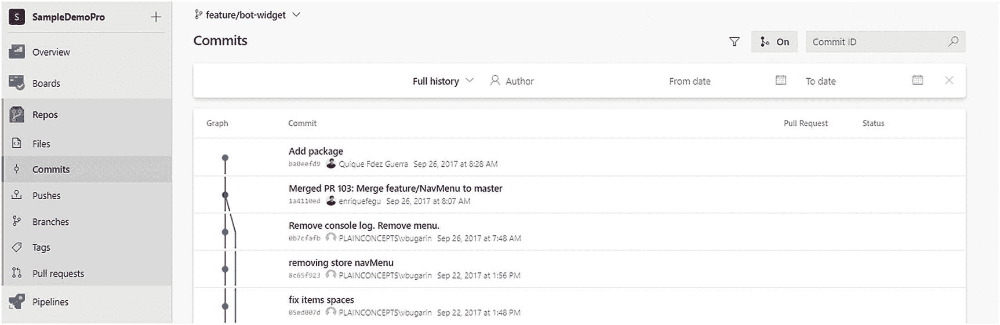

图 4-11

提交部分

使用顶部的图形选项，用户可以切换提交图形。如果可用，用户可以使用提交 ID 进行搜索。单击提交以查看文件和相关的更改。

除了浏览和理解更改之外，提交详细信息页面上还有两个重要的操作，即精选和恢复，如图 [4-12](#Fig12) 所示。

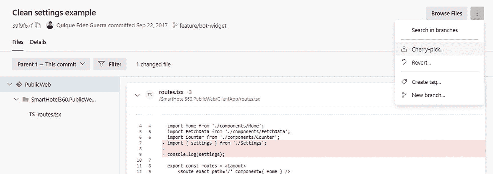

图 4-12

提交详细信息

*   Cherry-pick : Git 的 Cherry-pick 操作用于将更改应用到不同的分支，该分支不是当前分支的父分支。例如，如果您在发布分支中做了一些更改，作为生产问题修复的一部分，并且想要在功能分支中应用它，您可以从发布分支中挑选提交，并将其直接应用到功能分支。系统不会将更改直接应用到特征分支；相反，它从特性分支中创建一个新的分支，应用新的提交，并请求一个拉请求来将其合并到一个特性分支中。这样，Azure DevOps 保护功能分支代码库免受任何不必要的精选合并。多个代码审查者或批准可以进一步增强拉请求。

*   *Revert* :该选项恢复提交操作中所做的更改。还原操作还会从当前分支创建一个新分支，但不包含选定的提交，并要求用户创建一个拉请求来将其合并回去。

## 推

推送部分显示了推送到远程存储库的提交列表(参见图 [4-13](#Fig13) )。每个推送都可以在本地存储库上进行一次或多次提交。提交在本地存储库中完成，以便在本地跟踪更改。与任务或功能实现相关联的一组提交将被推送，并将被合并到远程存储库中。

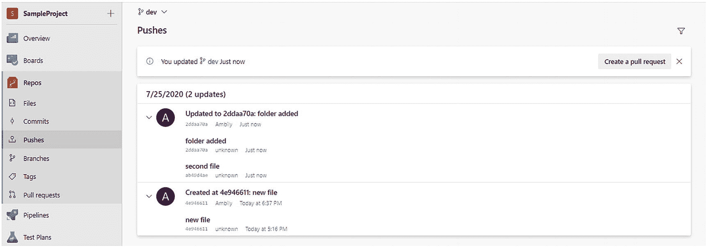

图 4-13

推

图 [4-13](#Fig13) 中，有两次推送；一个有一个提交，另一个有两个提交。用户可以点击推送项，查看已更改的文件和相应的更改。正如在“提交”一节中所讨论的，您可以恢复变更，精选提交，或者从变更中创建一个新的分支。

此外，Pushes 视图提供了一个选项来提出一个 pull 请求，将提交与另一个分支合并。我们将在下一节研究拉取请求。

## 分支

此部分列出了与所选回购和相关选项相关的所有分支。分支分组在“我的”、“全部”和“陈旧”下。

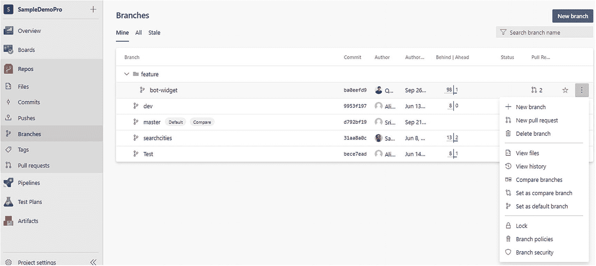

图 4-14

分支和选项

*   *Mine* :列出用户创建的所有分支。

*   *All* :列出所有与回购相关的分支机构。

*   *Stale* :这列出了在过去三个月或更长时间内没有任何提交或活动的分支。这将有助于跟踪未使用的回购，并删除它们。见图 [4-14](#Fig14) 。

除了分支名称之外，还会显示以下其他详细信息:最后一次提交、提交者、提交日期和拉请求详细信息。此外，用户可以查看关于主分支的分支状态；前面的数据显示尚未与主分支或父分支合并的提交数量，后面的数据显示需要合并到该分支的提交数量。“添加到收藏夹”选项可用于每个分支，因此用户可以选择一个收藏夹分支。

如图 [4-14](#Fig14) 所示，其他选项如下:

*   *新建分支*:在已有分支的基础上新建一个分支。

*   *New pull request* :创建一个新的 pull request，将变更与另一个分支合并。

*   *删除分支*:删除分支。

*   *查看文件*:这允许您查看与分支相关的文件。

*   *查看历史*:这允许您查看提交历史。

*   *比较分支*:比较两个分支。

*   *设置为比较分支*:标记一个基本分支进行比较。

*   *设置为默认分支*:设置默认分支。

*   *Lock* :这将锁定分支，并防止对提交历史的任何更新或来自其他人的任何新更新。只有锁定的用户才能在分支上执行活动。此功能可用于冻结功能分支，以完成功能实施。

*   *分支策略*:使用项目设置➤存储库➤分支定义分支策略，如第 [2](2.html) 章所述。

*   *分支安全*:定义每个组和用户对应的分支安全。此选项还允许您接收一封电子邮件，其中包含关于分行安全性的详细报告。

## 标签

标签部分显示标签集和相关选项，如图 [4-15](#Fig15) 所示。标记有助于将代码库版本化为特定的提交，并根据需要提取标记的代码库以用于多种目的。我们可以使用`git checkout`命令和标签名作为参数。

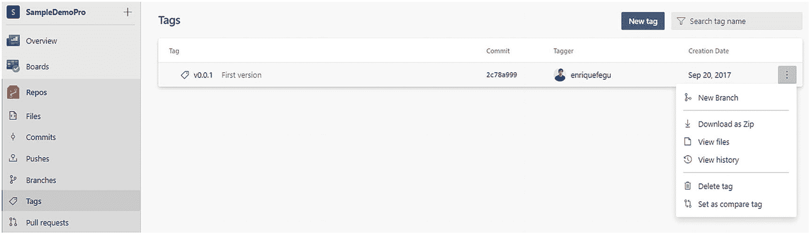

图 4-15

标签

可用的选项如下:

*   *新分支*:这在标签之外创建了一个新分支。

*   *下载为 zip 文件*:这将带标签的代码库下载为一个 Zip 文件。

*   *查看文件*:允许您查看带有该标签的文件。

*   *查看历史*:使用指定的标签标记代码库的历史。

*   *删除标签*:删除已有的标签。

*   *设置为比较标签*:使用标签作为比较的基本标签。

## 拉取请求

“拉取请求”部分列出了所有拉取请求和创建新拉取请求的选项，如图 [4-16](#Fig16) 所示。拉取请求按“我的”、“活动”、“已完成”和“已放弃”分组。

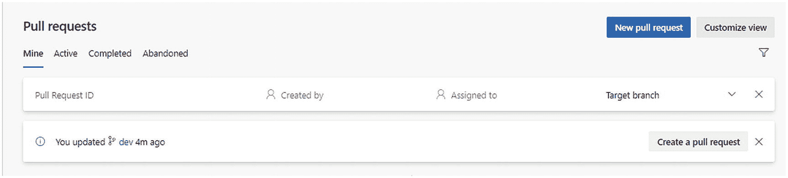

图 4-16

拉取请求

选择“New pull request”创建一个 pull request，将任何分支的变更合并到主分支或另一个分支，如图 [4-17](#Fig17) 所示。

在图 [4-17](#Fig17) 中，源分支被设置为 dev，目标分支是主分支，表示来自 dev 分支的提交将被合并到主分支中。提供一个标题和描述，以便以后引用拉请求。如果 PR 需要评审者，在与其他分支合并之前，将他们添加到评审代码库中。如果某个人必须审查代码库，那么通过使用“添加必需的审查者”链接，将该人添加为必需的审查者用户可以选择链接到一个或多个工作项，以建立实现的可追溯性。此外，用户可以添加一些标签来标记 PR。

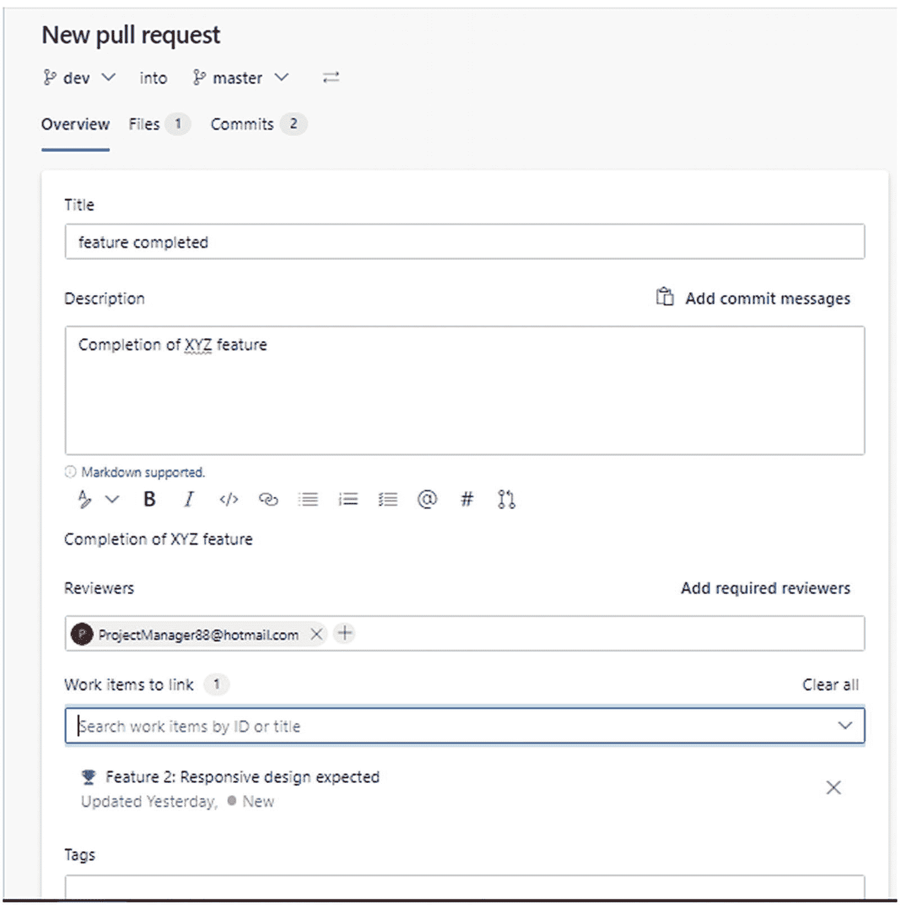

图 4-17

新拉取请求

创建 PR 后，审阅者可以查看它并选择批准。用户可以根据审核情况为请购单选择设置自动完成、完成或放弃。

在图 [4-18](#Fig18) 中，没有必需的评审者，因此任何具有访问权的团队成员都可以完成 PR 并将变更合并到目标分支。

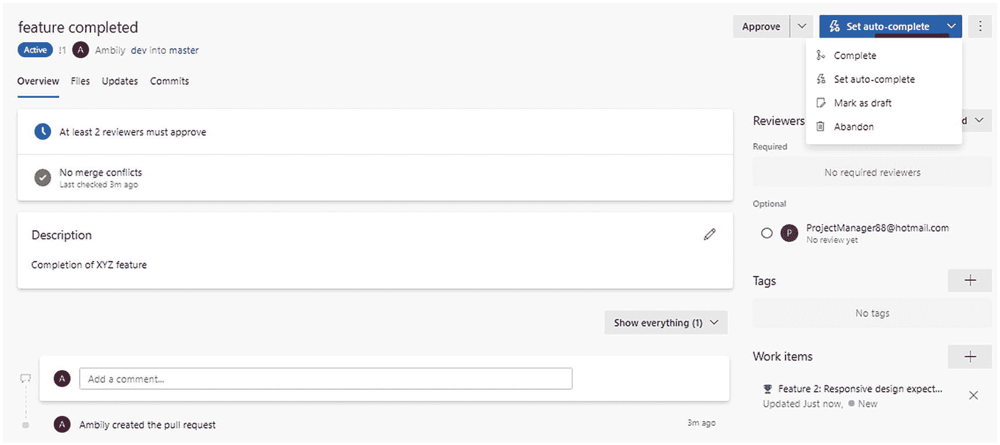

图 4-18

拉式请求:审批

图 [4-19](#Fig19) 显示了另一组选项，作为要处理的请购单的一部分。

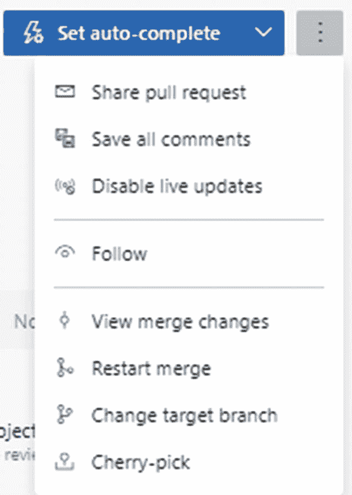

图 4-19

拉请求选项

*   *分享拉取请求*:这允许您通过电子邮件分享 PR。如果需要，此选项可帮助您与审阅者共享其他信息。

*   *Save all comments*: Review comments are added in the PR for tracking. By default the comments appear as Active with edit, delete, and like options, as shown in Figure [4-20](#Fig20). Users can respond to the comments or mark them with a status such as Pending, Resolved, Won’t fix, and Closed.

    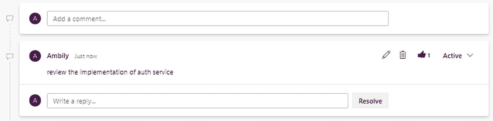

    图 4-20

    提取请求注释

*   *禁用实时更新*:禁用实时更新。

*   *关注*:关注公关，了解新的评论和活动。

*   *查看合并变更*:查看合并后的变更。

*   *重启合并*:基于开发人员所做的修正重启合并操作，以合并评审意见。

*   *改变目标分支*:改变目标分支。

*   精选:将变更精选到另一个分支。

在“完成拉取请求”屏幕上，选择 Azure DevOps 支持的不同合并选项，如图 [4-21](#Fig21) 所示。

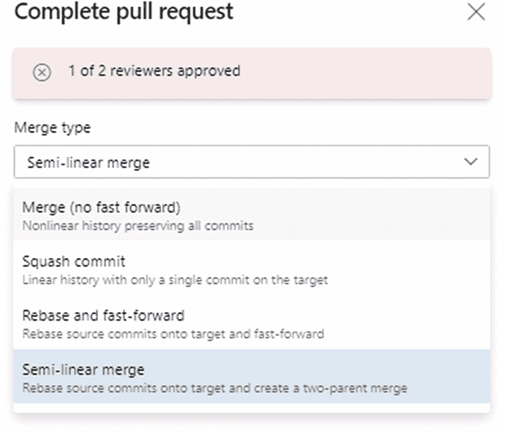

图 4-21

提取请求:合并选项

*   *Merge(默认)*:这将合并代码库和所有提交。

*   *挤压提交*:这将代码库合并为一个提交到目标分支。在这种情况下，目标分支不知道发生在源分支上的提交，也不跟踪提交注释。

*   *Rebase and fast-forward* :这将目标变更合并到源中，并从源中对目标进行 Rebase 和 fast-forward。

*   *半线性合并*:这将源提交重新置于目标之上，并合并两个父提交。

## 使用 Visual Studio

大多数使用 Microsoft 技术堆栈进行开发的开发人员使用 Visual Studio 进行开发活动。若要将 Visual Studio 连接到 Azure DevOps，请使用菜单视图➤团队资源管理器打开团队资源管理器。打开团队资源管理器后，选择项目➤管理连接，如图[4-22](#Fig22)T2 所示。

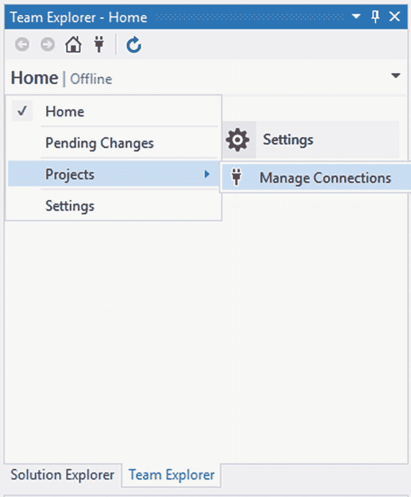

图 4-22

团队浏览器

这将显示带有两个选项的管理连接菜单，托管服务提供者和本地 Git 存储库，如图 [4-23](#Fig23) 所示。

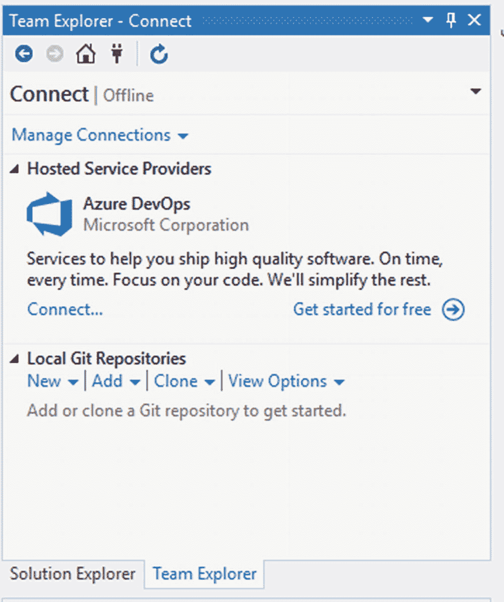

图 4-23

团队资源管理器，管理连接菜单

单击 Azure DevOps 下的连接链接以连接到已配置的 DevOps repo。系统将提示您输入 DevOps 凭据以连接到相应的组织。验证凭据后，系统将填充用户有权连接的所有组织。

选择回购进行，如图 [4-24](#Fig24) 所示。

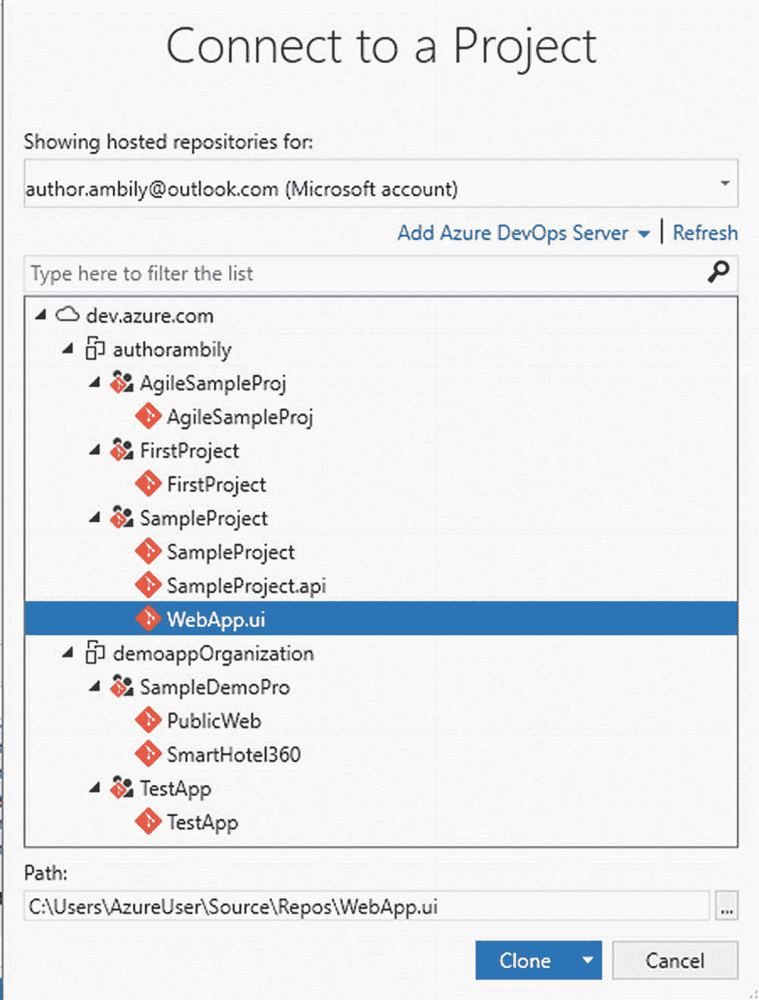

图 4-24

连接到项目

Visual Studio 将建立到所选 repo 的连接，并向开发人员提供与 repo 相关联的所有服务，以便在 Visual Studio 中执行。参见图 [4-25](#Fig25) 。

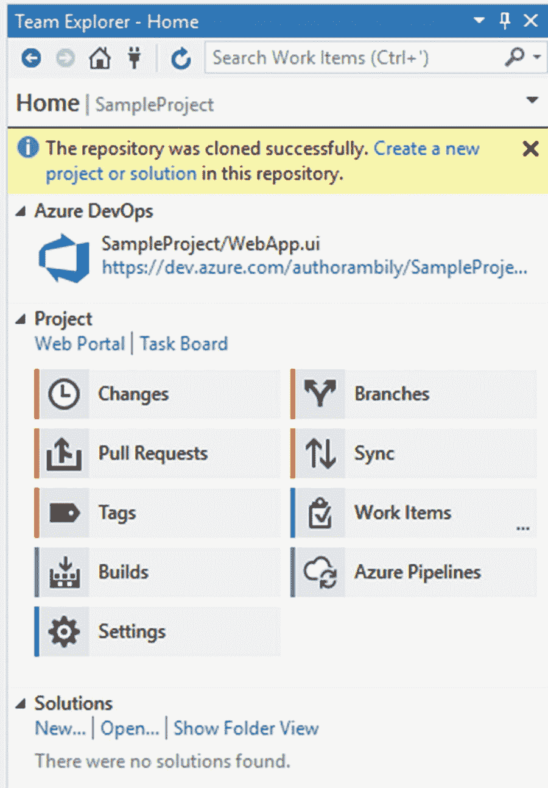

图 4-25

Azure DevOps 运营

所有用源代码讨论的操作都可以直接在 Visual Studio 内执行，如图 [4-25](#Fig25) 所示。例如，选择“分支”以查看与该分支相关联的选项和现有分支的列表。见图 [4-26](#Fig26) 。

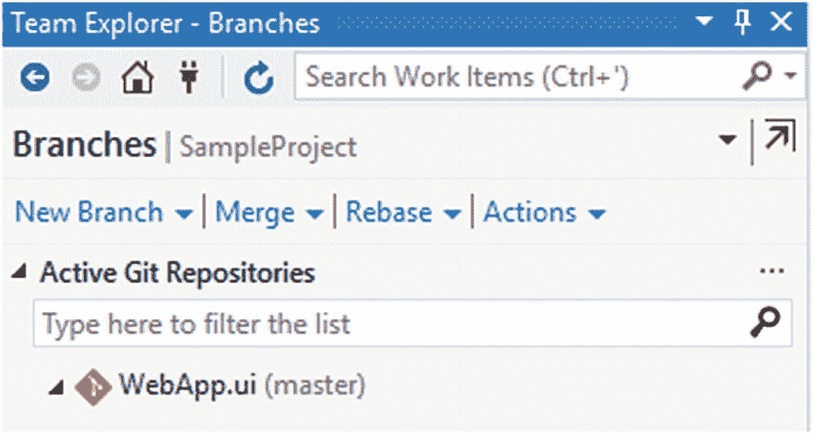

图 4-26

团队资源管理器，分支

New Branch 选项有助于创建新的分支，而 Merge 允许您合并两个分支的代码。Rebase 将用选定的分支覆盖现有的分支代码。图 [4-26](#Fig26) 显示了这些分支相关的选项。

导航到“Changes”部分，配置用户名和电子邮件，以便将更改提交给存储库。执行从本地 repo 到 Azure DevOps repo 的代码库提交和推送。在远程执行模式中，有四种方法:拉、推、取和同步。图 [4-27](#Fig27) 显示了与变更跟踪相关的所有选项。

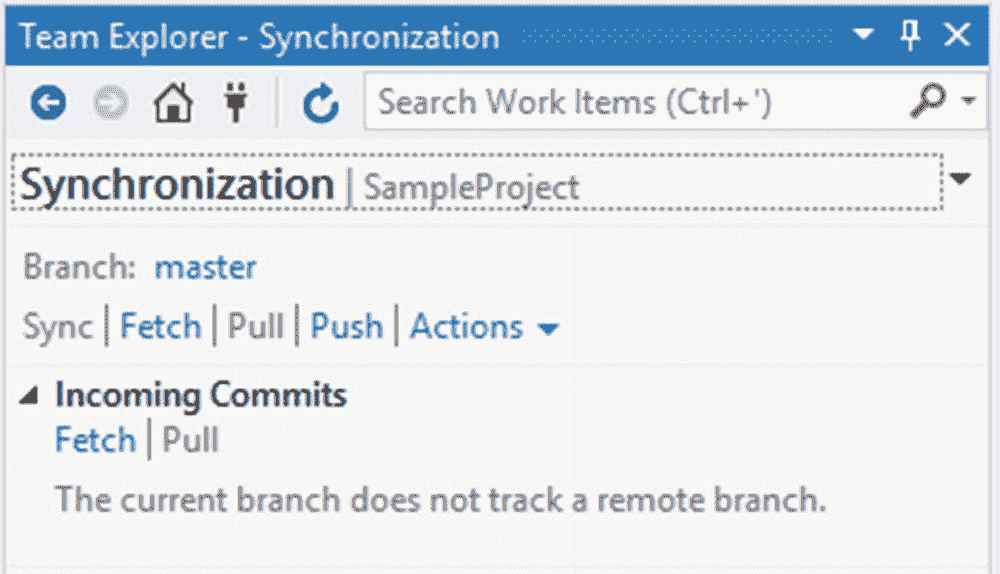

图 4-27

团队资源管理器，同步菜单

*   *Fetch* :这将获取远程变更，但不会将它们应用到任何本地分支。选择 Fetch 后，调用 Merge 将远程更改与本地 repo 合并。

*   *Pull* :这是获取和合并的组合，系统从远程 repo 获取变更，并将其与本地副本合并。

*   *Push* :将本地更改推送到远程服务器。

*   *Sync* :这也是拉和推的组合，其中系统拉远程更改，并将本地更改推回。

提交是另一个让开发人员感到困惑的活动。提交将用新的更改标记本地回购，并对更改进行版本控制。提交不会影响远程存储库。提交用于保护版本控制系统中的本地更改。一旦代码库准备好与远程存储库或者其他开发人员的代码变更合并，那么使用前面讨论的任何方法将变更与中央存储库合并。图 [4-28](#Fig28) 显示了不同的 Git 操作。

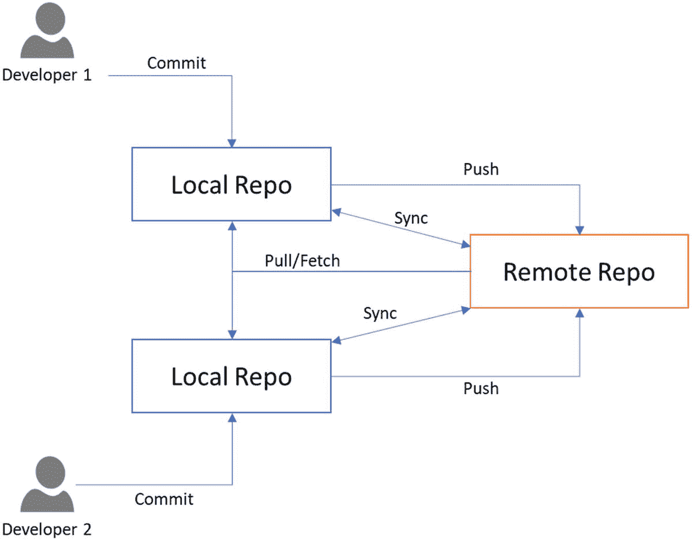

图 4-28

Git 操作

## 使用 Visual Studio 代码

要将 Visual Studio 代码与 Azure DevOps 连接，请从 Extensions 安装 Azure Repo 扩展，如图 [4-29](#Fig29) 所示。


图 4-29

Azure 回购扩展

安装完成后，确保已经用 TFVC 命令行客户端(`TF.exe`)设置了系统。如果用户拥有 Visual Studio 社区版，`TF.exe`将在`C:\Program Files (x86)\Microsoft Visual Studio\2019\Community\Common7\IDE\CommonExtensions\Microsoft\TeamFoundation\Team Explorer\tf.exe`中可用*。*将该位置设置为 VS 代码设置下的 tfvc.location 设置，如图 [4-30](#Fig30) 所示。

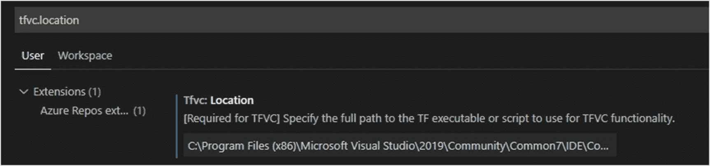

图 4-30

TFVC 位置

现在，在 VS 代码的状态栏选择团队选项，如图 [4-31](#Fig31) 所示，连接 Azure DevOps。


图 4-31

VS 代码状态栏

您有两种选择来连接 Azure DevOps 要么提供访问令牌，要么按照指示连接并生成令牌，如图 [4-32](#Fig32) 所示。

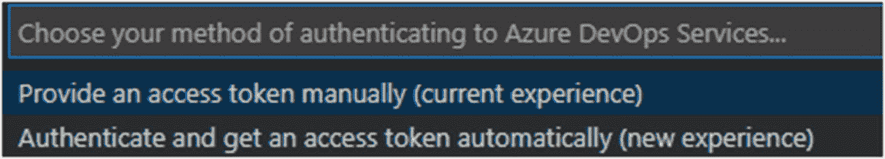

图 4-32

Azure DevOps 连接选项

按照步骤连接到 Azure DevOps。请注意，此扩展或 TFVC 支持仅限于本地工作区。该选项支持本地分支机构管理，并与 Azure DevOps 服务器直接集成。

## 使用 Git Bash

Git Bash 类似于标准的命令提示符，在这里可以执行 Git 命令。除了 Git 命令支持，Git Bash 在标准命令行上有一个包装器，并支持 Linux 命令。如果您来自 Linux 背景，并且想要使用类似的命令，那么使用 Git Bash 来管理 Git repos。

本章开头讨论了一些用于管理回购的 Git 命令。一些最有用的与分支相关的 Git 命令如下:

*   使用此命令列出可用的分支:

    ```
    git branch

    ```

    or

    ```
    git branch -a

    ```

第一个命令将列出所有远程分支，而第二个命令将列出可用的远程和本地分支，如图 [4-33](#Fig33) 所示。

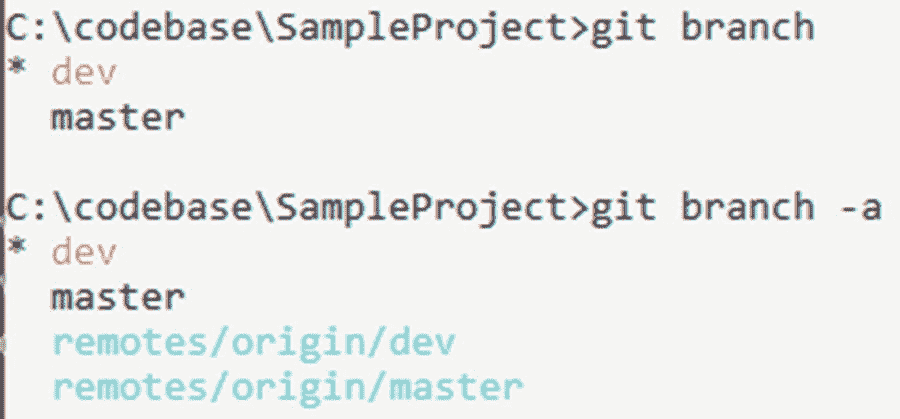

图 4-33

Git 分支

*   使用此命令切换到另一个分支:

    ```
    git switch <<branch>>

    ```

*   使用此命令签出分支:

    ```
    git checkout <<branch>>

    ```

*   使用此命令显示工作分支的状态:

    ```
    git status

    ```

## 示例应用程序

我们已经讨论了 Azure DevOps 服务提供的各种版本控制特性。让我们通过一个使用 Angular 和。NET Web API，如图 [4-34](#Fig34) 所示。

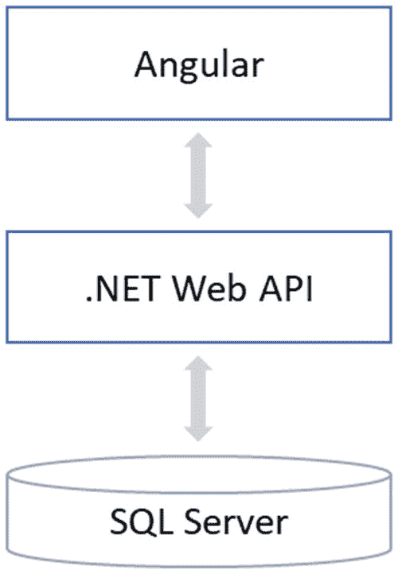

图 4-34

示例应用程序

角度开发将使用 Visual Studio 代码 IDE 完成，而。NET API 将使用 Visual Studio 作为集成开发环境(IDE)。还可以使用 Visual Studio 中提供的数据库项目模板将 SQL Server 数据库添加到源存储库中。

### 控制角度应用程序的版本

如前所述，Angular 开发将使用 Visual Studio 代码 IDE 来完成。到目前为止，这个 IDE 还不支持与 Azure DevOps 服务的直接集成。按照以下步骤将 Angular 应用程序添加到 Azure DevOps 服务中:

1.  使用 Git 作为版本控制系统，在 Azure DevOps 服务中创建一个团队项目。

2.  配置 repo 以添加 Angular 应用程序。

3.  使用`git clone`命令将空存储库克隆到本地系统。

    ```
    git clone https://authorambily@dev.azure.com/authorambily/SampleApp/_git/angularapp

    ```

Note

相反，您可以使用以下命令从系统中推送现有的存储库:

1.  导航到新创建的存储库，如下所示:

    ```
    cd angularapp

    ```

2.  使用`ng`创建一个新的 Angular 应用程序，如下所示:

    ```
    ng new <<appname>>

    ```

3.  使用以下代码将所有新创建的文件添加到 Git 中:

    ```
    git add .

    ```

4.  提交新添加的文件或更改，如下所示:

    ```
    git commit -m "first version"

    ```

5.  将更改推送到远程存储库，如下所示:

    ```
    git push

    ```

```
git remote add origin https://authorambily@dev.azure.com/authorambily/SampleApp/_git/angularapp
git push -u origin –all

```

Note

如果回购是用`ReadMe.md`发起的，那么先拉后推，如下所示:

```
git pull

```

Angular 应用程序的第一个版本被更新到远程存储库。第一次提交将在主分支中完成，该分支将与回购创建一起创建。任何进一步的变更或修改都将在一个单独的分支中完成，比如开发或特性分支。按照以下步骤更新 Angular 应用程序:

*   使用 Azure DevOps 门户从主分支创建开发分支。

*   查看开发分支。

    ```
    git checkout dev

    ```

Note

这可能会导致以下错误:

*错误:pathspec 'dev '与 git 已知的任何文件都不匹配*

这是因为新的分支机构被添加到了远程回购中。与使用`git pull`命令时一样，在签出前提取新添加的分支细节。

*   验证分支。

    ```
    git branch

    ```

*   修改应用程序以实现某个功能或错误修复。

*   将更改正确地提交到本地存储库。进行变革

    ```
    git add .
    git commit -m "commit comment"

    ```

*   一旦实现完成，就推送到远程存储库。

    ```
    git push origin dev

    ```

```
git pull
git checkout dev

```

根据远程回购修改和本地更新，可能会出现合并冲突的情况，系统会尝试使用默认合并策略来解决这些冲突。如果未能解决冲突，则在`git push`中显示以下类型的错误:

*   [`https://dev.azure.com/authorambily/SampleApp/_git/angularapp`](https://dev.azure.com/authorambily/SampleApp/_git/angularapp)

*   ！[拒绝]开发->开发(先取)

*   错误:无法将一些参考推送到' [`https://dev.azure.com/authorambily/SampleApp/_git/angularapp` 【T2 ' '](https://dev.azure.com/authorambily/SampleApp/_git/angularapp)

*   提示:更新被拒绝，因为远程包含您所做的工作

*   提示:本地没有。这通常是由另一个存储库推送造成的

*   提示:对同一个裁判。您可能希望首先集成远程更改

*   提示:(例如，“git pull ...”)再推之前。

*   提示:请参阅“git push - help”中的“关于快进的注意事项”了解详细信息。

要解决这个问题，请使用`git pull`提取更改。这会将远程更改带到本地版本，并显示 Visual Studio 代码中的更改以及解决这些更改的选项，如图 [4-35](#Fig35) 所示。

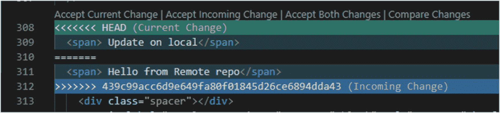

图 4-35

合并冲突

*   *接受当前更改*:该选项接受本地更改。

*   *接受输入变更*:该选项接受远程变更。

*   *接受两种更改*:该选项接受远程和本地更改。

*   *比较变化*:该选项比较变化，手动做出决定。

另一种合并冲突变更的方法是使用`git merge`命令。

```
git merge -s <<strategy>>
git merge -s ours

```

参考 [`https://git-scm.com/docs/merge-strategies`](https://git-scm.com/docs/merge-strategies) 的合并策略，了解不同的策略及其用法。

### 版本控制。NET API

应用程序的 API 或中间层将使用任何 ide(如 Eclipse 或 Visual Studio)来开发。。NET APIs 一般使用 Visual Studio 开发，支持与 Azure DevOps 直接集成。请参考“使用 Visual Studio”一节来控制。NET API 使用 Azure DevOps 和 VS。

## 摘要

版本控制和分支策略定义了项目的开发和发布管理。基于分支策略，团队在不同的分支上并行工作，以完成开发、生产支持和功能发布。构建和发布设置也取决于版本控制管理系统配置分支策略的方式。