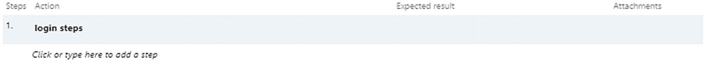

# 五、Azure DevOps 测试管理

Azure DevOps 服务拥有支持端到端测试管理所需的所有测试相关功能。默认情况下，测试管理功能不可用，因此您必须启用它们。您可以在 Azure DevOps 的组织设置屏幕上的计费部分中启用测试计划，以开始探索测试计划、跟踪、执行、基于浏览器的测试注释、集中报告等功能(图 [5-1](#Fig1) )。本章将解释 Azure DevOps 服务中可用的各种测试管理特性。

图 5-1

账单页面

Azure DevOps 提供了三种不同的测试管理特性:测试计划、测试套件和测试用例。

*   *测试计划*:这是一组要在一个迭代或者一个区域中执行的测试套件和测试用例。

*   *测试套件*:这是一组测试用例，用于验证一个场景或用例。可以是静态测试套件，基于需求的测试套件，也可以是基于查询的测试套件；我们将在本章的“测试套件”部分讨论更多关于测试套件的内容。

*   *测试用例*:验证应用程序的单一功能。测试用例可以被添加到测试套件或测试计划中，并且可以一次被映射到多个套件或计划中。

## 测试用例

测试用例是验证应用程序的功能或与应用程序相关的非功能性需求的基本测试元素。在测试管理中，测试用例是根据它们的用途来分类的。以下是其中的一些:

*   *单元测试用例*:这将被开发者用来验证他们实现的完整性。有许多工具和技术与每一种实现技术相关联，用来自动化单元测试用例。有许多单元测试框架和库，比如用于基于 Java 的应用程序的 Junit，用于。净馨和因缘对棱角分明，而摩卡和柴对反应过来。

*   *功能测试用例*:这是用于验证系统功能实现的测试用例。

*   *安全测试用例*:验证系统的安全约束。例如，安全测试用例可以验证 web 应用程序的任何跨站点脚本问题。

*   *性能测试用例*:通过数据量、用户负载、压力测试等不同参数来验证系统的性能。

*   *用户验收测试*:这是由业务涉众进行的验收测试。

有许多测试用例，如回归测试、集成测试、冒烟测试、健全性测试、系统测试、BVT 测试用例等等。作为一种良好的做法，测试案例将由测试主管或职能 SME 审查，以使测试案例与预期功能保持一致。大多数与 NFR 相关的测试用例将由架构师审查。

在大多数情况下，测试用例将具有很少的预定义字段或信息，例如验证功能的步骤、每个步骤的验收标准等。Azure DevOps 提供了一个测试用例模板，可以对其进行定制，以满足各个项目的需求。图 [5-2](#Fig2) 显示了默认模板。

图 5-2

测试用例模板

主要字段是定义操作和预期结果的步骤，以及参数。步骤定义了用户在系统中验证用户交互的动作。例如，用户可以在登录表单中提供凭据，然后单击登录按钮登录到系统。当用户执行登录等操作时，需要用户输入。当测试人员执行这样的步骤时，他们应该传递不同的值来识别系统是否正常工作以及是否响应不同的用户输入值。这些值定义了肯定情况、否定情况和边界条件。如果一个测试步骤需要一个可以变化并返回不同结果的用户值，那么这样的字段被标记为参数。

共享步骤是另一个重要的概念；在这里，一组步骤将在多个测试用例中共享。例如，登录测试步骤将在大多数需要用户认证的测试用例中重复。用户可以将这些步骤以及动作、结果和参数定义为一个共享步骤，并在其他测试用例中重用它，以避免相同内容的重复。遵循不要重复自己(DRY)的原则，以避免在另一个测试用例中重复相同的步骤。

## 共享步骤和参数

如前所述，共享步骤是一组测试用例步骤，可以在多个测试用例中重用。例如，登录到系统的步骤可以被定义为一个共享步骤，并包含在许多其他测试用例中。

定义步骤，选择步骤，将其分组为共享步骤，点击步骤顶部的“创建共享步骤”图标(第三个图标)，如图 [5-3](#Fig3) 所示。

图 5-3

共享步骤

为要继续的步骤提供一个名称。这将用共享步骤名称引用的单个步骤替换所有现有步骤，如图 [5-4](#Fig4) 所示。

图 5-4

插入的共享步骤

双击步骤名称后，它会打开新添加的“共享步骤”工作项，如图 [5-5](#Fig5) 所示。

图 5-5

“共享步骤”工作项

用户可以通过添加参数来进一步定制这些步骤，这些参数在执行时需要来自用户的数据。对于前面的场景，添加参数*用户名*和*密码*并绑定到步骤。

可通过选择参数选项()或添加带@的变量来添加参数，如`@username`。一旦它们被添加，导航回测试用例，参数将在“参数值”部分中列出。提供该参数的一组期望值，如图 [5-6](#Fig6) 所示。

图 5-6

参数值

如果参数在多个测试用例中使用，它们可以作为共享参数集添加。就像共享步骤一样，所有测试用例都可以使用一个共享参数集，以便在多个测试场景中重用相同的数据集。

在图 [5-6](#Fig6) 中，选择参数，点击“转换为共享参数”链接，将其转换为共享参数集。“参数”一节将介绍更多的参数。

## 测试套件

测试套件是一组测试用例，用来验证某个特性或组件的实现。我们可以使用静态套件、基于需求的套件和基于查询的套件来定义测试套件，如图 [5-7](#Fig7) 所示。

图 5-7

测试套件

以下是三个选项之间的区别:

*   *静态套件*:将测试用例手工添加到套件中。

*   *基于需求的套件*:根据需求选择测试用例。

*   *基于查询的套件*:使用查询选择测试用例。

## 测试计划

测试计划定义了与一个区域或迭代相对应的测试套件和测试用例。它用于根据迭代中的优先特性或者与特定区域相关的特性对测试用例进行分组。

该部分显示现有的计划，并允许我们创建新的测试计划，如图 [5-8](#Fig8) 所示。

图 5-8

测试计划部分

选择 New Test Plan 选项创建一个新的测试计划，如图 [5-9](#Fig9) 所示。

图 5-9

创建新的测试计划

一旦创建了测试计划，用户将被重定向到细节页面来添加新的测试用例。可以使用以下两个选项将测试用例添加到测试计划中:

图 5-10

将测试用例添加到套件中

*   *添加已有的测试用例*:添加一个已有的测试用例。该选项打开查询窗口，根据查询选择测试用例，如图 [5-10](#Fig10) 所示。用户可以编辑查询来过滤测试用例，并从结果集中选择特定的测试用例。

图 5-11

使用网格添加测试用例

*   *使用网格添加测试用例*:该选项支持使用 Excel 或表格格式输入多个测试用例。用户可以创建 Excel 或 CSV 格式的测试用例，然后可以将测试用例直接复制到网格视图中插入测试用例。这个特性帮助测试人员离线工作。

    在第一列中输入测试用例标题，并在第二列中定义与测试用例相关的步骤。每一步都应在不同的行中与预期结果一起指定，如图 [5-11](#Fig11) 所示。

“分配给”和“状态”列可以根据要求填充，也可以留空。默认选项是系统将状态设计添加到每个新的测试用例中。一旦添加了测试用例，点击网格顶部的保存图标()来保存测试用例。

一旦保存，系统将创建新的测试用例，并显示每个测试用例的 ID，如图 [5-12](#Fig12) 所示。

图 5-12

测试用例，网格视图

### 定义选项卡

定义页签显示与所选测试计划对应的已有测试用例，如图 [5-13](#Fig13) 所示。用户可以将列表视图改变为网格视图，这允许多个测试用例编辑。此外，系统提供了使用上移和下移图标对测试用例重新排序、选择列以及使用各种过滤选项过滤测试用例的选项。

图 5-13

定义选项卡

对于每个测试用例，都有一组可用的选项。

图 5-14

链接项目

*   *查看链接的项目*:这个选项显示了链接的测试套件、需求和 bug。如果系统建立了适当的可追溯性，用户可以识别与当前测试用例相关的需求和缺陷，如图 [5-14](#Fig14) 所示。

图 5-15

分配配置

*   *打开测试用例*:该选项打开测试用例。

*   *分配配置*:指定执行测试用例所需的系统配置；详见“配置”部分，如图 [5-15](#Fig15) 所示。

图 5-16

“编辑工作项目”屏幕

*   *删除*:该选项删除选中的测试用例。

*   在网格中编辑测试用例:这允许你在一个网格中编辑多个测试用例。

*   *编辑测试用例*:通过选择特定的字段，可以编辑测试用例，如图 [5-16](#Fig16) 所示。

*   *复制测试用例*:这将复制测试用例。

*   *将测试用例导出到 csv* :这允许您将选择的测试用例导出到 csv。

### 执行选项卡

一旦带有几个测试用例的测试计划准备好了，那么导航到 Execute 选项卡来执行测试用例。用户可以选择一个或多个测试用例，并标记为通过测试、失败测试、阻塞测试和不适用，如图 [5-17](#Fig17) 所示。

图 5-17

执行测试计划

您将会看到一个运行选项列表，可以用来执行所选择的测试用例。可用的运行选项如下:为 web 应用程序运行、为桌面应用程序运行和带选项运行。

此外，用户可以使用测试顶部的列选项()选择其他列。还有另一个选项来使用各种参数过滤测试用例列表，如图 [5-18](#Fig18) 所示。

图 5-18

过滤选项

#### 为 Web 应用程序运行

选择一个或多个测试用例，并单击“为 web 应用程序运行”选项。这将打开 Runner 窗口，其中有许多选项和与测试用例相关的步骤列表，如图 [5-19](#Fig19) 所示。

图 5-19

运行窗口，测试计划

测试步骤提供三个选项:编辑()、通过测试步骤()和失败测试步骤()。点击编辑图标，可以编辑与测试步骤相关的步骤和预期结果，如图 [5-20](#Fig20) 所示。

图 5-20

流道窗口，编辑步骤

用户将获得更多的选项来添加新的测试步骤，删除现有的步骤，以及在测试用例中上下移动所选择的步骤。作为该执行的一部分，通过和失败标记测试步骤状态。

测试用例标题附近的可用选项使用户能够用通过、失败、暂停、阻塞和不适用来标记整个测试用例，如图 [5-21](#Fig21) 所示。

图 5-21

转轮窗口，标记状态

转轮窗口顶部的其他可用选项如下:

*   *保存*:保存修改。

*   *保存并关闭*:保存并关闭流道窗口。

*   *创建新的 Bug/添加到现有的 bug* :从 Runner 窗口，用户可以创建一个与当前测试用例执行相关的 Bug。

*   *抓取截图*:抓取当前屏幕，为修复 bug 或反馈提供更多细节。

*   *将用户动作捕获为图像动作日志*:将所有用户动作捕获为图像日志，这将有助于团队重现执行或缺陷。

*   *记录屏幕*:添加测试用例执行的视频记录，这将有助于提供关于用户操作的进一步细节。

*   *添加注释*:添加注释作为测试用例执行的一部分。

*   *添加附件*:添加附加信息作为附件，如日志文件。

*   *录音屏*:增加一个录音屏，用户可以清楚的解释观察到的情况。

这些选项帮助 QA 工程师或测试人员向开发团队提供足够的细节来重现缺陷。在进行屏幕录制或图像捕捉之前，如果用户正在使用 Chrome 浏览 web 应用程序，用户应安装 Google Chrome 的测试和反馈扩展，如图 [5-22](#Fig22) 所示。

图 5-22

安装测试和反馈扩展

安装完成后，配置测试与反馈扩展以连接 Azure DevOps 组织，如图 [5-23](#Fig23) 所示。

图 5-23

测试和反馈扩展

一旦与 Azure DevOps 集成，重新启动 Runner 窗口来执行带有图像或屏幕记录的测试用例。

用户可以针对测试用例的每一步记录单独的操作。在图 [5-24](#Fig24) 中，用户通过了第一步，但第二步失败了，并试图针对失败的步骤创建一个新的 bug。

图 5-24

跑步者窗口，新 bug

系统自动捕获步骤、每个测试步骤的状态以及视频或图像日志。此外，系统捕获当前的系统信息，这有助于开发人员在类似的设置中重现问题。图 [5-25](#Fig25) 显示了捕获的样本系统信息。

图 5-25

捕获的系统信息

与该 bug 相关的所有细节都会被附加到该 bug 的附件页签中，如图 [5-26](#Fig26) 所示。

图 5-26

附件

基于测试用例执行创建一个 bug 提供了足够的信息，比如遵循的步骤、屏幕记录、捕获的图像、注释等等。，以在类似的设置中再现缺陷。

测试和反馈扩展将用于探索性测试，其中测试用例没有在系统中定义。探索性测试是对系统的随机测试，以识别缺陷。这在我发表在《简单谈》( [`https://www.red-gate.com/simple-talk/dotnet/net-development/exploratory-testing-chrome-plugin/`](https://www.red-gate.com/simple-talk/dotnet/net-development/exploratory-testing-chrome-plugin/) )的文章中有更详细的解释。

“测试用例”部分讨论了测试用例、共享测试用例以及参数化测试用例，并展示了一个验证用户登录的示例测试用例。这个测试用例有与之相关的参数。当这种带有参数的测试用例被执行时，它会提示每个参数值的测试用例步骤的执行。每个参数集的测试用例执行将作为一个迭代添加到测试运行程序中。在图 [5-27](#Fig27) 中，参数集包含三组值，表示三次迭代。

图 5-27

转轮窗口，多次迭代

#### 为桌面应用程序运行

该选项支持用户针对桌面应用程序运行测试用例。选择“为桌面应用程序运行”选项来运行一个或多个与桌面应用程序相关联的测试用例。如果这是您第一次使用“运行桌面应用”选项执行测试用例，系统会提示您在执行测试用例之前下载并安装测试运行器，如图 [5-28](#Fig28) 所示。

图 5-28

桌面跑步者

下载并安装测试运行程序。针对桌面应用程序运行的任何新测试用例都将启动基于桌面的测试运行程序，并在运行系统中安装的应用程序时捕获桌面环境的详细信息。

#### 带选项运行

“Run with options”对话框列出了基于各种现有工具执行测试用例的选项。基于测试类型和运行器的选择，动作将会改变。例如，如果您计划使用发布阶段执行一个自动化测试用例，那么所需的输入数据将如图 [5-29](#Fig29) 所示。

图 5-29

“带选项运行”窗口

测试类型和流道的不同选项如下:

*   使用基于浏览器的运行器进行手动测试

*   使用测试运行器客户端进行手动测试

*   使用发布阶段的自动化测试

*   使用 Microsoft 测试管理器 2017 客户端进行手动测试

*   使用 Microsoft Test Manager 2015 或更早版本的客户端进行手动测试

每个测试用例都有其他选项，如图 [5-30](#Fig30) 所示。

图 5-30

测试用例，选项

选项如下:

*   *查看执行历史*:显示测试用例的执行历史。

*   *标记结果*:将结果标记为通过、失败、阻塞等。

*   *Run* :使用前面提到的三个选项中的任何一个来运行测试用例。

*   *将测试重置为激活*:这将测试重置为激活模式。

*   *编辑测试用例*:编辑测试用例。

*   *分配测试员*:分配一个测试员。

*   *查看测试结果*:查看测试结果。

### 图表

Chart 选项卡提供了两个不同的选项来创建基于测试用例及结果的图表。

图 5-31

新测试用例图表

*   *新建测试用例图表*:选择该选项将根据该测试计划下分组的测试用例创建一个新的图表，如图 [5-31](#Fig31) 所示。用户可以选择特定的图表类型和相关联的参数来定义带来一些洞察力的图表。

图 5-32

新测试结果图表

*   *新建测试结果图表*:该选项支持根据测试用例结果新建图表，如图 [5-32](#Fig32) 所示。

在这种情况下，与测试用例图表相比，可用的图表类型较少。此外,“Group by”参数将只基于测试运行和结果。

添加图表后，可以将它们添加到仪表板中。“Add to dashboard”选项帮助用户将指定的图表添加到团队仪表板，以将洞察力带到仪表板，如图 [5-33](#Fig33) 所示。

图 5-33

“添加到仪表板”选项

在图 [5-34](#Fig34) 所示的“测试计划设置”窗口中，您可以设置测试运行设置和测试结果设置。

图 5-34

测试计划设置

## 进度报告

这个部分在一个仪表板中显示了测试计划、套件和测试用例的执行和结果。用户可以根据各种标准过滤报告，例如测试套件、日期范围、测试人员等。图 [5-35](#Fig35) 显示了进度报告的示例。

图 5-35

进度报告

## 因素

参数部分显示了项目中定义的共享参数，以及它们的值和相关的测试用例。图 [5-36](#Fig36) 显示了前面章节中定义的参数。

图 5-36

因素

用户将能够添加新的共享参数以及这些值。用户可以打开或关闭相关的测试用例视图。

## 配置

配置部分处理不同的测试环境配置和相关的配置变量。

图 5-37

测试配置

*   *测试配置*:这定义了一组可用于执行特定测试用例的配置。例如，当用户测试平台时，配置将包含支持的操作系统，如 Windows、Mac 或 Linux，以及其他配置变量。

*   *配置变量*:用于定义变量，可以为测试配置进行配置，如图 [5-37](#Fig37) 所示。

## 跑

运行部分显示最近运行的列表以及运行结果，如图 [5-38](#Fig38) 所示。用户可以使用运行 ID 或过滤器选项卡选择特定的运行。

图 5-38

试运转

此外，用户可以通过双击运行的行来选择一个运行，并查看与其相关的完整详细信息，如图 [5-39](#Fig39) 所示。

图 5-39

运行详细信息

## 负荷试验

负载测试功能允许您对应用程序进行性能测试。理解端到端负载测试需要很好地理解性能测试。Visual Studio 和 Azure DevOps 中的负载测试功能已被否决；更多详情请参考微软博客 [`https://devblogs.microsoft.com/devops/cloud-based-load-testing-service-eol/`](https://devblogs.microsoft.com/devops/cloud-based-load-testing-service-eol/) 。

你也可以参考我在亚马逊上的书。

*   *Kindle 版* : [`https://www.amazon.com/Dialogue-Visual-Studio-Performance-Testing-ebook/dp/B01LYSDNCN`](https://www.amazon.com/Dialogue-Visual-Studio-Performance-Testing-ebook/dp/B01LYSDNCN)

*   *平装* : [`https://www.amazon.com/Performance-Testing-Visual-Studio-product/dp/1522000712`](https://www.amazon.com/Performance-Testing-Visual-Studio-product/dp/1522000712)

## 摘要

Azure DevOps 提供了一组测试特性来进行端到端的测试管理。测试计划、测试套件和测试用例以及其他支持特性是测试管理的基本元素。此外，集成平台提供了测试用例与需求、实现、缺陷和其他工件之间的端到端集成，这实现了完全的可追溯性。