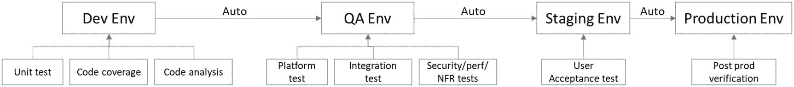
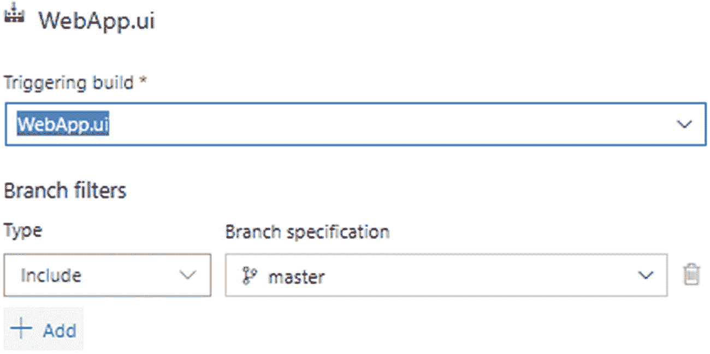
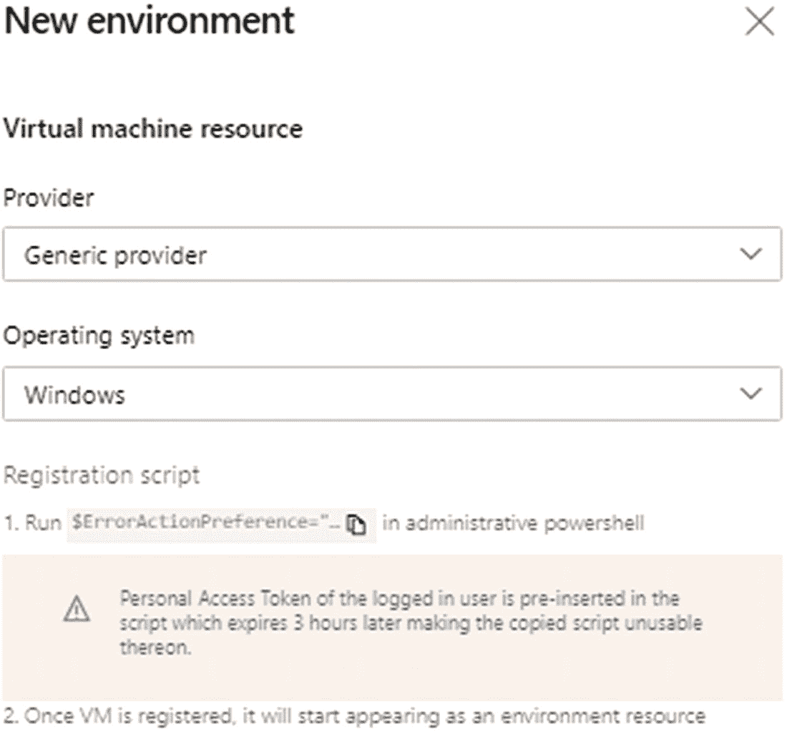

# 六、构建自动化和发布管理

构建自动化和发布管理是 DevOps 实现中的两个核心概念。构建自动化不仅包括构建过程的自动化，还包括许多其他验证的集成，例如单元测试、代码覆盖、代码分析、安全性验证等等。否则，在进行正确构建的同时进行所有这些验证需要大量的人工工作。类似地，发布和部署管理涉及许多概念，例如部署到各种环境、批准流程、前置和后置条件、验证关口、基础设施供应等等。本章详细解释了构建自动化和发布管理过程。

## 构建和发布流程

在 DevOps 中，基于公司中 DevOps 过程的成熟度，涉及并采用不同的构建和发布过程。一般来说，DevOps 中常用的流程有两个:持续集成(CI)和持续部署(CD)。

### 连续累计

应用程序的构建或构建自动化意味着准备一个可部署的代码库。这因程序而异。在桌面应用程序的情况下，这可能是生成安装文件或可执行(EXE)文件。当涉及到 API 或 web 应用程序时，它涉及到所有依赖项的打包、编译的代码库以及相关的工件，如资源文件、图像等。

手动准备构建容易出错。在 DevOps 之前，开发、测试和运营团队在孤岛中工作。每个团队的活动都是孤立的，并且不同步，这影响了应用程序的整体交付和质量。

自动化构建是整个 DevOps 过程中必不可少的步骤之一。构建是自动化的，并被配置为手动运行或在开发运维流程的不同阶段进行调度。通过“管道”菜单，可以创建构建定义。最常用的构建定义类型如下:

*   *门控签入构建*:在这种类型中，构建按照分支策略设置执行，并且代码被推送到该分支。这些构建帮助您验证被推送到原始分支的代码的质量。如果构建成功，那么提交也将成功，其他团队成员也可以使用这些更改。如果构建失败，提交将自动回滚。这种构建有助于保护分布式存储库中的代码；分布式回购中的代码总是高质量的。这个构建有不同的名字，比如*提交验证构建*等等。需要注意的一个要点是，封闭签入构建不会为部署创建任何工件或放置文件夹。

*   *计划的构建*:在这种类型中，构建被安排在一个特定的时间框架内。例如，在 sprint 结束时触发的 sprint 构建可以是一个预定的构建。预定的构建确保不同环境的发布模式，如开发、qa、试运行和生产。

*   *持续集成构建*:当提交成功地将远程源分支合并到特定分支时，这种构建触发。例如，构建管理员可以为 dev 分支配置一个 CI 构建，以执行构建并运行与应用程序相关联的单元测试用例。这将确保自动化单元测试脚本在每次提交时都得到验证。门控签入构建有助于保持远程 repo 的完整性，并创建可执行的代码库，而 CI 构建确保每次提交的代码质量。

不仅单元测试脚本被集成为构建管道的一部分，其他工具和实用程序如代码分析工具(SonarQube，code analysis 等)也被集成。)也进行了集成，如图 [6-1](#Fig1) 所示，以保证代码的完整性、质量等。


图 6-1

构建流程

### 持续交付和持续部署

一旦构建就绪，就应该将其部署到环境中，以验证其功能。如果有一个从开发环境一直到生产部署的自动化管道，那么我们称之为*连续部署*。在连续交付中，任何人在完成了应有的检查或者完成了必要的沟通之后，都可以通过几次点击来部署和监控一个新的发布。

作为管道的一部分，集成了许多工具和技术，以确保应用程序的稳定性、功能性等，如图 [6-2](#Fig2) 所示。对每个环境的部署可以通过不同的质量关卡和批准流程来控制，我们将在后续部分中详细讨论。以下部分讨论了一些常用的部署模型。



图 6-2

发布过程

#### 蓝色/绿色部署

在*蓝/绿部署*中，有两个相同的生产环境。在任何时候，一个将是活跃的，而另一个不会。新的更改将被部署到第二个环境中并进行测试。一旦确认和验证完成，您就可以将路由器更改为第二个环境。现在，第一个环境将处于非活动状态。图 [6-3](#Fig3) 显示了该部署。


图 6-3

蓝色/绿色部署

以下是优点:

*   跨多个环境的交错部署

*   减少或零停机时间

挑战如下:

*   应用程序的向后兼容性

*   运营开销增加

*   更新数据库模式需要谨慎

#### 金丝雀部署

在 *canary deployment* 中，新的变更将被发布给一部分用户，进行测试，然后部署给所有人。该模型有助于整合来自最终用户的早期反馈，并在最终发布之前识别功能问题。图 [6-4](#Fig4) 展示了金丝雀的部署。


图 6-4

金丝雀部署

以下是优点:

*   发布给用户或服务器的子集

*   影响最小的快速回滚

*   功能切换或服务器选项

挑战如下:

*   路由决策

#### 滚动部署

在*滚动部署*中，新版本将一次部署到一个服务器，而不是一次部署到所有服务器；换句话说，您需要一个服务器一个服务器地慢慢部署。图 [6-5](#Fig5) 描绘了滚动部署。


图 6-5

滚动部署

以下是优点:

*   减少停机时间

*   一次部署到一台服务器

挑战如下:

*   应用程序的向后兼容性

*   多个版本在生产中共存

## 管道

管道定义了构建和发布过程以及相关的集成。

### 创建管道

使用四个步骤定义管道:连接、选择、配置和检查。

connect 步骤有助于连接到 Azure DevOps 中的 repo 或外部 repo，如图 [6-6](#Fig6) 所示。默认情况下，管道使用基于 YAML 的生成设置。如果用户熟悉基于任务或活动的设置，用户可以单击底部显示的链接切换到经典编辑器。(经典的构建步骤将在基于 YAML 的构建配置之后解释。)


图 6-6

连接步骤

请注意，YAML 是一种人类可读的数据序列化语言。它主要用于 Docker 文件等配置文件。它是许多 DevOps 工具遵循的标准之一，理解 YAML 将有助于处理多个 DevOps 方面，例如作为代码的基础设施。

如果您选择了 Azure Repos Git 以外的 repo，Azure DevOps 管道流程会将您重定向到相应集成的登录页面以继续。一旦选择了 Azure Repos Git，管道流程将列出项目中可用的现有 Repos，如图 [6-7](#Fig7) 所示。


图 6-7

选择步骤

选择要为其配置管道的 repo，并继续配置它。选择图 [6-8](#Fig8) 中列出的一个预定义的 YAML 模板来构建应用程序。


图 6-8

配置步骤

审查选定的详细信息，如回购、分支、技术堆栈等。，在 YAML 形成并完成管道，如图 [6-9](#Fig9) 所示。


图 6-9

审查步骤

#### 变量

在完成管道设置之前，我们可以定义一组配置构建所需的变量。变量有助于处理动态或环境相关的配置或参数。例如，在图 [6-10](#Fig10) 中，*分支*被定义为一个变量，默认值为*主*，这是一个秘密，允许用户在运行管道时提供该值。


图 6-10

变量

变量可以插入到 YAML 或 ARM 模板或其他构建区域。如果是 YAML，使用`$(variable)`语法引用变量，如图 [6-11](#Fig11) 所示。


图 6-11

可变用法

此外，YAML 审查屏幕提供了一个选项，使用右侧的“显示助理”链接添加任务。单击该链接后，您将看到一个可用于与当前 YAML 流集成的步骤列表。我们将在“经典编辑器”部分更详细地介绍任务。

#### 设置和触发器

右上角的菜单显示了与 YAML 版本相关的其他选项。用户可以选择设置，如图 [6-12](#Fig12) 所示，以启用新的构建和工作项选项的自动链接。


图 6-12

设置菜单

Validate 选项验证 YAML 构建脚本。“下载完整的 YAML”选项允许您下载和分发构建定义。触发器选项有助于设置各种构建触发器，如 CI、计划和构建完成，如图 [6-13](#Fig13) 所示。这些触发器以及各种可用的选项在“经典编辑器”一节中进行了解释。


图 6-13

扳机

管道 YAML 修改完成后，选择“保存并运行”选项将构建排队。用户可以在作业详细信息窗口中观察构建和日志的进度，如图 [6-14](#Fig14) 所示。


图 6-14

执行

### 经典编辑器

经典编辑器从源代码选择开始，如图 [6-15](#Fig15) 所示，还有 repo 和 branch。


图 6-15

源选择

一旦选择了 source、repo 和 branch，继续选择构建模板。选择一个预定义的模板，如图 [6-16](#Fig16) 所示，或者从一个空任务开始。


图 6-16

模板

这将完成管道的创建，并让构建工程师了解管道的细节。用户可以在这里配置所有与构建相关的活动，如图 [6-17](#Fig17) 所示。


图 6-17

配置所有与构建相关的活动

#### 任务

Tasks 选项卡是构建管道定义中的第一个选项卡，其中列出了所有选定的任务以及添加新任务的选项。在图 [6-17](#Fig17) 中，用户选择了一个 ASP.NET 核心构建模板，该模板包含一系列任务，用于获取最新源代码、恢复 NuGet 包、构建解决方案、测试程序集、发布符号以及发布工件。用户可以添加或删除其中的一些步骤。单击代理作业的“添加”图标，将新任务添加到列表中。

用户可以选择一个步骤并拖动它来重新排列管道中步骤的顺序。此外，系统还提供了查看链接设置、获得步骤的 YAML 视图以及移除所选步骤的选项，如图 [6-18](#Fig18) 所示。


图 6-18

编辑任务

除了任务管理，您还会在任务选项卡的右上角看到“添加代理作业”和“添加无代理作业”选项，如图 [6-19](#Fig19) 所示。


图 6-19

代理作业选项

*   *代理作业*:这些是在代理池下的代理上运行的作业，比如构建. NET 项目、安装 npm 包等等。

*   *无代理作业*:这些是在服务器或 Azure DevOps 管道中运行的作业，比如延迟执行、调用 Azure 函数、查询工作项等等。

#### 变量

变量选项卡显示参数或环境变量，如图 [6-20](#Fig20) 所示。构建工程师可以根据环境需求定义变量，并将它们标记为*秘密*，并在发布运行时将其设置或标记为*队列时间*属性。


图 6-20

变量选项卡

可以将变量分成不同的类别来管理它们，例如特定于环境的组或特定于构建的组。我们将在“库”部分了解更多关于变量组的知识。

#### 扳机

Triggers 选项卡提供了运行构建或管道的选项，如图 [6-21](#Fig21) 所示。默认情况下，触发器下不会选择任何内容。构建工程师可以通过选择“启用持续集成”选项来配置持续集成构建系统提供了另一个选项“在构建过程中进行批量更改”，以控制 CI 构建的数量。如果构建需要更多时间，那么执行期间的所有提交都将作为单个构建进行批处理和触发。


图 6-21

触发器选项卡

在 CI 构建中，构建工程师可以包括和排除分支以及特定路径。在前面的配置中，主分支包含在构建中。此外，路径`/images`被排除。这表明除了在路径`/images`下，主分支上的任何修改都会触发这个构建。`/images`中的任何改变都不会触发构建。

构建工程师可以通过单击构建的添加链接来添加计划的构建。用户可以将日期、时间和分支过滤器配置为计划构建的一部分，如图 [6-22](#Fig22) 所示。此外，使用“仅在源代码或管道发生更改时调度构建”选项，可以控制只有在最后一次构建后有任何更改时才触发构建。


图 6-22

创建时间表

另一个选项是将构建作为另一个构建的延续来执行。如果前面的构建成功，那么只执行这个构建。此选项有助于定义相关的版本；例如，UI 构建之后应该是所有 API 构建，否则 API 构建将在数据库构建之后执行，如图 [6-23](#Fig23) 所示。



图 6-23

触发构建

#### 选择

Options 选项卡列出了与构建相关联的选项，例如构建作业超时、构建编号格式、将工作项与构建链接等等，如图 [6-24](#Fig24) 所示。


图 6-24

选择

下一个选项卡 Retention 处理保留策略，如该工具以前版本中的构建结果保留期，但现在该选项卡集中用于项目设置。“历史记录”选项卡显示对管道所做的所有更改。“摘要”选项卡显示构建的运行摘要。

在 More Options (…)中，Security 选项在控制构建安全性方面起着重要的作用。构建工程师可以配置安全性，以确保只有授权的团队成员才能编辑构建或对构建进行排队。可以将权限分配给组或单个用户来管理版本的安全性。

一旦管道配置完成，我们就可以对构建进行排队以执行它。

## 环境

环境部分定义了部署应用程序所需的各种环境。您可以将虚拟机和 Kubernetes 配置为环境的一部分，如图 [6-25](#Fig25) 所示。


图 6-25

创造新环境

基于 Kubernetes 的环境将提示您选择一个提供者:Azure Kubernetes 提供者或通用提供者。如果您选择 Azure Kubernetes 提供商，用户应该提供 Azure 订阅详细信息以连接到 Azure 订阅。如果选择通用提供程序，请提供与集群名称、名称空间、服务器 URL 和密码相关的详细信息，以连接到本地 Kubernetes 集群。

向环境中添加虚拟机需要执行 PowerShell 脚本，这些脚本可以直接从 Azure DevOps 下载。

选择操作系统为 Windows 或 Linux，复制 PowerShell 脚本，如图 [6-26](#Fig26) 所示。一旦脚本在虚拟机中执行，相应的虚拟机将出现在此窗口中，用于作为环境的一部分进行配置。



图 6-26

虚拟机设置

## 放

在进入发布过程的细节之前，让我们先讨论两个经常互换使用的词:发布和部署。*发布*意味着产品面向更广泛的受众，而*部署*意味着在目标系统中安装和配置软件或产品。发布管理包括将应用程序的不同版本部署到不同的环境中。此外，发布管道定义了正确和安全发布产品所需的控制。

### 创建发布管道

创建新的发布管道时，您可以选择从一个空作业开始，或者选择一个预定义的模板并进行配置，如图 [6-27](#Fig27) 所示。


图 6-27

发布管道选项

每个发布管道都以工件作为输入开始。然后，管道将各种环境定义为部署产品的阶段，以及在部署之前和之后的每个阶段中要执行的活动。

#### 史前古器物

工件定义了基于分阶段配置部署到目标环境中的部署包或文件。目前，Azure DevOps 服务支持九种来源类型，如图 [6-28](#Fig28) 所示。用户可以从九种源类型中选择一种，并提供所需的配置详细信息。


图 6-28

添加工件

*   *Build* :如果部署是基于构建的，那么将构建的输出配置为当前管道的工件。大多数时候，选择这个选项来集成构建和发布管道。

*   Azure Repos Git :这个选项有助于直接从 repo 本身部署文件。基于 Python 的模型不是使用任何构建系统构建的；相反，它们是使用发布管道部署的。

*   *GitHub* :将 GitHub 配置为工件仓库，将文件从 GitHub 部署到不同的环境。

*   *TFVC* :如果项目配置了 Team Foundation 版本控制(TFVC)，则该选项将用于将文件从源代码控制直接部署到部署环境。

*   *Azure 工件*:用户可以将 Azure 工件配置为工件库，并在构建管道中使用它。如果构建配置使用 Azure 工件存储库，那么将其用作发布管道的输入。

*   *GitHub Release* :将 GitHub Release 输出配置为当前发布管道的输入。

*   *Azure Container Repository(ACR)*:如果构建管道将任何映像部署到 ACR，则将它们配置为发布管道的工件存储库，以将容器映像部署到目标环境中。

*   *Docker Hub* :就像 Azure 容器库一样，Docker Hub 也用于存储为基于容器的部署生成的自定义映像。从构建管道中，我们可以将映像部署到 Docker Hub 或 ACR。

*   *Jenkins* :如果发布管道基于基于 Jenkins 的构建，那么使用它来配置它。

根据发布管道设置要求，我们可以选择任何一个可能需要的部署。例如，一个发布管道可能包含用于完成单个部署的 UI 工件、API 工件和数据库工件。

另一个可用的选项是发布管道的调度。我们可以多次添加释放管道应该运行的时间，如图 [6-29](#Fig29) 所示。在图 [6-29](#Fig29) 中，释放将在周一凌晨 3 点和周五周日凌晨 1 点触发。


图 6-29

安排发布管道

#### 阶段

每个阶段将定义一个部署单元或环境设置。选择阶段名称将允许用户更改、删除、移动阶段名称，并将其保存为模板。有两个条件与阶段相关联。

##### 部署前条件

“预部署条件”部分定义了在部署到当前阶段之前应该评估或满足的条件。此部分有多个可用的配置项目。

*   *触发器*:该部分定义了释放的触发器；它可以是手动的，也可以是释放后的。如果是在发布之后，则系统会在创建发布后自动将其部署到阶段。如果是手动，即使有新版本，系统也会等待手动部署。以下是要设置的其他选项:
    *   *工件过滤器*:您可以定义一个工件条件来部署到这个阶段。只有在满足工件条件的情况下，发布才会被部署到这个阶段。

    *   *时间表*:这是一个分阶段的部署时间表。

    *   *拉式请求部署*:根据拉式请求触发部署。但是这个选项依赖于发布管道的工件是如何配置的。

*   *Pre-deployment approvals*: This section defines the approvals required to deploy any new artifact to this stage, as shown in Figure [6-30](#Fig30). If multiple users are added under Approvers, all approvers are required to approve the release for deployment. If a group is added to the Approvers list, then one member of the group can approve and proceed with deployment.

    

    图 6-30

    部署前批准

    超时属性允许您设置等待批准的最长时间。如果在此时间限制内没有发生任何操作，系统将在此阶段自动拒绝部署。除了这些设置之外，系统还允许您配置两个批准策略。第一个阻止发布或部署请求者批准它。第二个策略消除了来自同一个团队成员的多个批准；如果该人员批准了前一阶段，则该阶段会自动批准到当前阶段。

*   *门*:增加评估健康参数的门。它们被周期性地并行重新评估。当所有关口在成功标准持续时间内成功时，部署将继续进行。如果在超时期限之前没有出现这种情况，部署将被拒绝。

    As listed in Figure [6-31](#Fig31), the options available for adding a new gate are as follows: Check Azure Policy compliance, Invoke Azure Function, Invoke REST API, Query Azure Monitor alerts, and Query Work items.

    

    图 6-31

    盖茨

*   *Deployment queue settings*: This section provides settings to execute multiple parallel deployments and control subsequent releases, as shown in Figure [6-32](#Fig32).

    

    图 6-32

    部署队列设置

##### 部署后条件

部署后条件有助于在部署到某个阶段后处理所需的控制。以下是该部分中可用的主要设置:


图 6-33

自动重新部署触发器

*   *部署后审批*:与部署前审批一样，部署后审批处理部署到某个阶段的审批或拒绝。类似的属性如超时和策略配置在这里也是可用的。

*   *关卡*:类似于预部署批准，关卡保护部署质量和完整性。

*   *自动* - *重新部署触发*:配置触发自动重新部署到舞台的事件，如图 [6-33](#Fig33) 所示。选择事件和相应的操作来配置重新部署。

##### 乔布斯

每个阶段都有一个或多个相关联的作业。经典模式和 YAML 模式支持三种类型的作业。经典模式下可用的作业类型如下:

*   *代理作业*:在代理池中的代理上运行。

*   *无代理作业*:运行在 Azure DevOps 服务器上。

*   *部署组作业*:在部署组中的机器上运行。部署组使得对部署应用程序的目标机器进行分组变得容易。

在基于 YAML 的发布管道和构建中，有三种不同的工作。

*   *代理池作业*:在代理池中的代理上运行。

*   *服务器作业*:在 Azure DevOps 服务器上运行。

*   *容器作业*:在代理池中的代理上的容器中运行。

这些作业中的每一个都有一组与其相关联的任务来运行管道。

#### 多阶段

构建工程师可以按顺序或并行的形式定义多个阶段。在图 [6-34](#Fig34) 中，有四个阶段，从开发阶段开始，并行部署到两个 QA 阶段。之后，生产阶段部署将快速开始。


图 6-34

多阶段

在预部署条件下，可以使用“阶段选择”选项将阶段相互连接。该系统允许用户选择多个阶段，以确保并行部署到各个阶段。如果存在任何循环依赖问题，系统会检测出来并提示用户。

#### 任务

任务是执行活动的低级执行单元。基于执行环境，任务被添加到作业下。如果任务执行是构建活动或工件处理的一部分，那么将其添加到代理作业中。如果它独立于工件并在服务器级别执行，请将其添加到无代理作业中。如果任务应该在目标系统中执行，那么将它们添加到部署组作业下。

单击加号将新任务添加到代理作业中。将列出可以在代理中执行的任务。用户可以从列表中选择任务，如图 [6-35](#Fig35) 所示，并进行配置。


图 6-35

任务，部署选项卡

任务列表已经根据作业进行了筛选。如果用户尝试在部署组作业下添加任务，将会列出不同的任务。图 [6-36](#Fig36) 显示了任务如何在每个工作类别下分组。


图 6-36

按类别列出的工作

#### 变量

“变量”选项卡显示管道变量和变量组。这类似于构建管道中的“变量”选项卡。

#### 保留

保留选项卡列出了每个阶段的保留配置，如图 [6-37](#Fig37) 所示。


图 6-37

卷紧标签

项目设置➤管道➤版本保留中记录了集中式保留配置。

用户可以覆盖每个阶段的默认配置。保留配置控制着版本应该保留多少天，以及有多少版本与相关的工件一起保留。

#### 选择

“选项”选项卡上有两种不同的配置。第一个是发布名称格式，它可以根据项目需求进行更改。默认的发布名称格式是`Release-$(rev:r)`。

第二组配置有助于与外部系统集成，如图 [6-38](#Fig38) 所示。使用这些配置，系统可以将一个或多个阶段的部署状态通知像 JIRA 这样的外部系统。


图 6-38

选项选项卡

## 图书馆

库部分处理可重用组件，如变量组和安全文件。变量组帮助构建工程师创建一组可以跨多个管道共享的变量。

### 可变组

构建工程师可以通过提供名称和关于变量组的简要描述来添加新的变量组，如图 [6-39](#Fig39) 所示，这将有助于其他人理解用法。系统提供了允许访问所有管道或限制到特定管道的选项。


图 6-39

可变组

此外，用户可以链接 Azure Key Vault 中的一个秘密作为变量，并在管道中使用它。Azure Key Vault 是来自 Azure 的秘密或密码管理产品，可以用来在应用程序中安全地使用秘密和密码。选择此选项后，所有现有变量都将被删除，系统将提示您集成 Azure 服务连接和密钥库名称以继续。

变量组将作为管道定义的一部分出现在变量选项卡上，并通过点击选项“链接变量组”来调用，如图 [6-40](#Fig40) 所示。


图 6-40

可变组

### 安全文件

“安全文件”部分帮助构建工程师管理安全文件，如证书文件或签名密钥，并在不同的管道中使用它们。此外，用户可以控制每个文件级别的权限，以确保使用安全选项添加到“安全文件”部分的每个文件的安全性，如图 [6-41](#Fig41) 所示。


图 6-41

“安全文件”部分

## 任务组

任务组定义了不同管道中常用的任务集，有助于在管道中重用相同的配置和变量。这减少了在多个地方维护相同配置的开销。此外，这减少了由于相同任务组的重复存在而错过其中一个管道中的变更的机会。

任务组仅适用于经典版本。这不适用于基于 YAML 的构建模板，在那里我们使用 YAML 模板进行重用。在解除所有链接参数的链接后，将从构建或管道中创建任务组。

点击图 [6-42](#Fig42) 中“任务”选项卡根级的“取消所有链接”链接，取消所有参数的链接。


图 6-42

任务选项卡

选择步骤，右键选择“创建任务组”选项，如图 [6-43](#Fig43) 所示。


图 6-43

创建任务组

出现提示后，提供所需的详细信息，如任务组名称、描述和类别。此外，系统将列出用作任务组一部分的变量和默认值。用户可以更改变量值并创建任务组，如图 [6-44](#Fig44) 所示。


图 6-44

更改任务组的变量

这将在生成或管道中用任务组名称替换指定的步骤。请注意右侧的“任务版本”选项，它被设置为 1。*现在，如图 [6-45](#Fig45) 所示。


图 6-45

包括任务组

导航回“任务组”部分，查看新创建的任务组。打开任务组，编辑一些元素或配置以发布其新版本。修改后，单击“另存为草稿”创建任务组的草稿版本。系统会添加一个后缀为`-test`的新版本，所以命名为`1.*-test`。此外，它还提供了“发布草稿”选项，这将使更改成为预览功能。这将增加一个名为`2.*(preview)`的新版本，如图 [6-46](#Fig46) 所示。


图 6-46

任务组预览

在任务组中，它显示“发布预览”选项，将当前预览更改发布为新版本。一旦用户选择此项，系统将发布任务组的新版本`2.*`。“任务组”部分支持任务组的版本控制和管理。此外，系统捕获变更和相关注释作为历史记录，以备将来审计之用。我们可以在 References 部分引用构建管道、发布管道和其他任务组，它们引用当前的任务组。

## 部署组

部署组为并行部署定义了一组逻辑目标计算机。通过指定名称和描述来添加新的部署组。选择目标操作系统后，系统将提示您输入 PowerShell 脚本，如图 [6-47](#Fig47) 所示，用于将系统配置为部署组的一部分。


图 6-47

部署组

用户可以决定在用于身份验证的脚本中包含个人访问令牌，或者在脚本执行时提供它。复制脚本并在目标虚拟机中执行，以将它们添加为部署组的一部分。

定义顶部的 Share 选项允许用户选择同一个组织中的其他项目来共享部署组。安全选项帮助您配置部署组的权限。

## 示例构建和发布实现

在第 4 章中，我们讨论了一个使用 Angular 和。NET Web API，如图 [6-48](#Fig48) 所示。


图 6-48

示例应用程序

在本节中，我们将为应用程序配置构建和发布管道。

### 角度应用程序的构建和发布

Angular 应用程序构建包括以下步骤:

1.  *安装 npm* :使用`npm install`安装依赖项。

2.  *构建 Angular* :使用`npm run`命令构建并打包一个 Angular 项目。对于生产部署，在构建之前使用生产构建(`ng build --prod`)来缩小文件。配置它的一个简单方法是在 Angular 应用程序的`package.json`文件中，如下面的代码片段所示:

```
 "scripts": {
    "ng": "ng",
    "start": "ng serve",
    "start-qa":"ng serve -c=qa",
    "build": "ng build",
    "build-prod": "ng build --prod",
    "build-qa":"ng build -c=qa",

```

现在在 npm 任务中调用它，如图 [6-49](#Fig49) 所示。


图 6-49

npm 任务配置

1.  *归档文件*:这个任务压缩打包的文件和其他工件。Azure DevOps 提供 zip、7zip、tar 和 wim 等归档选项。

2.  *发布工件*:将工件发布到一个仓库，比如 Azure 工件仓库或 Nexus 工件仓库。

此外，用户可以添加许多其他任务，比如代码分析、与单元测试脚本的集成等等。两个这样的任务是用于代码分析的 Lint 和用于漏洞分析的 WhiteSource。

*   *Lint* :将 npm 任务添加到列表中，并在“命令和参数”下指定`run lint`

*   *WhiteSource* :检测并修复安全漏洞和有问题的开源许可证。使用组织设置➤通用➤扩展从市场安装 WhiteSource 扩展(免费)。在 npm 软件包安装的第一步之后添加 WhiteSource Bolt 任务，以扫描漏洞。这将在 Pipelines 部分添加一个带有详细报告的菜单项。

保存构建管道并将其排队等待执行。排队时，用户需要选择代理池和代理规范。默认情况下，Azure DevOps 提供了一个名为 Azure Pipeline 的代理池，由一个托管代理组成，具有多个代理规范，如 ubuntu-16.04、windows-2019、vs2017-win2016 等。此外，用户可以使用项目设置➤管道➤代理池来设置自托管代理或 Azure 虚拟机规模集(VMSS)中的代理。

用户可以通过提供一个名称(比如 angular-agents)来添加一个新的代理池，并将池类型设置为“自托管”现在使用“新建代理”添加代理，这将打开设置代理的详细步骤，如图 [6-50](#Fig50) 所示。


图 6-50

新的自托管代理设置

按照以下步骤设置代理:

1.  使用给定命令(`config.cmd`)将代理配置为服务，或者以交互模式执行。我们建议使用交互式模式进行初始设置和调试；否则，将代理作为代理运行。

*   导航到代理位置，运行上图中“创建代理”部分给出的命令。

1.  根据代理计算机中的操作系统下载代理。

使用发布管道，我们将把 Angular 应用程序部署到 Azure App 服务。按照以下步骤将其部署到预配置的应用服务中:

1.  在项目设置➤管道➤服务连接下配置 Azure 服务连接。

2.  在 Azure 中创建应用服务。

3.  定义发布管道。
    1.  将先前的构建输出添加为工件。

    2.  如果需要，启用连续部署触发器。

    3.  添加包含以下任务的第一阶段:
        1.  *停止 Azure app 服务*:部署前停止 Azure App 服务。

        2.  *Azure App Service Deploy* :选择 Azure 服务连接、App Service 以及复制构建输出的包/文件夹。指定`npx serve -s`为启动命令。

            注意:npx 是 npm 的包运行器，这使得运行任何种类的节点可执行文件都很容易。

        3.  *启动 Azure App 服务*:部署后启动 App 服务。

4.  保存并排队新版本，并部署它来验证管道。

5.  一旦管道成功，向管道添加更多阶段和前置/后置条件。

### . NET 应用程序的构建和发布

内置模板支持任何。NET 应用程序。在这里，我们将为。NET API。所需的主要步骤如下:

1.  将 Docker 文件添加到应用程序中。用于的示例 Docker 文件。这里给出 NET Core API:

    ```
    FROM mcr.microsoft.com/dotnet/core/aspnet:3.1-buster-slim AS base

    ```

    ```
    WORKDIR /app
    EXPOSE 80
    EXPOSE 443

    FROM mcr.microsoft.com/dotnet/core/sdk:3.1-buster AS build
    WORKDIR /src
    COPY ["Sample.TestApi.csproj", ""]
    RUN dotnet restore "./ Sample.TestApi.csproj"
    COPY . .
    WORKDIR "/src/."
    RUN dotnet build " Sample.TestApi.csproj" -c Release -o /app/build

    FROM build AS publish
    RUN dotnet publish " Sample.TestApi.csproj" -c Release -o /app/publish

    FROM base AS final
    WORKDIR /app
    COPY --from=publish /app/publish .
    ENTRYPOINT ["dotnet", " Sample.TestApi.dll"]

    ```

2.  通过以下任务准备构建管道:
    1.  *获取资源*:这是获取资源的第一步。

    2.  *使用 NuGet* :这将安装项目中引用的 NuGet 包。

    3.  *NuGet 恢复*:恢复 NuGet 包。

    4.  *构建一个映像*:这提供了容器注册表，比如 Azure 容器注册表或 Docker Hubor Docker 文件路径，以及一个映像名称。

    5.  *推送图像*:推送图像。

集装箱化的。NET Core API 可以部署到不同的 Azure 产品，如 Azure Container Instance (ACI)、Azure Kubernetes Services (AKS)或 Azure App Service。按照 Angular 应用程序中使用的三步发布流程将其部署到 Azure 应用程序服务中。在第二步(Azure App Service deploy 步骤)中指定 Azure 容器注册表和图像细节，以将容器部署到应用服务中。

## 摘要

Azure DevOps 提供了许多功能和组件来自动化构建和发布管道。基于 YAML 和经典的基于任务的模型支持许多第三方工具集成，以帮助您创建构建和发布生态系统。