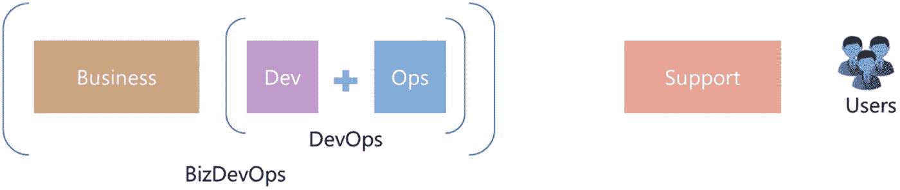

# 八、DevOps 架构蓝图

DevOps 处理整个软件开发生命周期，从需求收集到后期生产监控。第 [1](1.html) 章介绍了主要的 DevOps 概念和方法。在本章中，我们将了解各种 DevOps 架构。

## Web 应用的 DevOps 方法

web 应用开发的 DevOps 方法遵循需求管理、版本控制、分支和合并策略以及持续集成和部署的传统模型。有时，这还会进一步扩展为一个持续的监控和反馈循环。除了基本组件之外，大多数情况下，每个流程步骤中所需的工具集成因应用而异。

DevOps 管道中集成的工具和技术基于技术堆栈和客户的要求。XebiaLabs 发布了一份跨管道使用的领先 DevOps 工具列表( [`https://digital.ai/periodic-table-of-devops-tools`](https://digital.ai/periodic-table-of-devops-tools) )，按不同用途分类。这对 DevOps 建筑师来说是一个很好的参考。

考虑一个用 Angular 开发的 *n* 层 web 应用表示层，以微服务作为中间层。以下是一些可与 Azure DevOps 一起用于 DevOps 实现的工具:

*   *需求管理*:蓝色板

*   *版本控制* : Azure Repo 或者 GitLab

*   *持续集成*:构建自动化的 Azure 管道
    *   Jasmine 和单元测试的 Karma

    *   开源漏洞分析的白源

    *   用于 API 单元测试的 Nunit/SOAP UI/Postman

    *   代码分析声纳

*   *持续部署* : Azure 发布管道
    *   ARM/Terraform/Pulumi 用于基础架构配置

    *   端到端测试的量角器和 Karma

    *   用于功能测试的硒

*   *持续监控* : Azure Monitor 或专门用于监控的应用洞察

这只是现代应用开发的基本设置，工具集成列表会根据客户需求而变化。

### 微服务

采用微服务架构使公司能够快速将小型独立工作单元发布到生产环境中。具体来说，Azure DevOps 允许您创建多个发布管道，以并行和相互独立的方式自动部署微服务。图 [8-1](#Fig1) 显示了微服务部署方法的高级视图。

图 8-1

微服务架构

## 数据库的开发运维方法

有许多数据平台工具和技术，如 Oracle 数据库、Azure 数据湖存储、SSIS 包、Azure SQL 和 Cosmos DB，可以处理各种数据需求。为了存储数据，有多个基于 SQL 和 NoSQL 的数据存储。Azure DevOps 支持各种类型的数据库和相关平台，如 SSIS 包、数据湖部署等。

### SQL Server 数据库

SQL Server 数据库开发从使用 Visual Studio 创建数据库项目开始。Visual Studio 支持架构文件的开发和 SQL 架构的单元测试。此外，使用 Azure Repos 的适当版本控制将通过 Visual Studio 处理。数据库项目支持部署时所需的前置条件和后置条件的配置。这些条件将用于执行清理活动、用户创建和其他常见的特定于环境的配置。

Azure DevOps 使用 DACPAC 打包来打包 SQL 版本和发布。DACPAC 是一种包含数据库对象的文件格式，扩展名为`.dacpac`。基于任务的构建管道和基于 YAML 的构建都支持基于 DACPAC 的数据库项目处理。见图 [8-2](#Fig2) 。

图 8-2

开发操作系统，SQL 数据库

此外，MySQL 部署支持在 Azure DevOps 管道中使用 MySQL 任务和 YAML 脚本。Azure DevOps 中支持 SSIS 包，生成的包类似于 DACPAC，扩展名为`.ispac`。Azure 为 Azure 数据工厂提供了另一个称为数据工厂管道的管道，提供了数据清理、转换等所需的所有支持。

## 机器学习模型的 DevOps 方法

机器学习模型是现代应用开发不可或缺的一部分。与正常的应用生命周期相比，机器学习模型具有不同的过程步骤。一般来说，将使用图 [8-3](#Fig3) 中所示的步骤来定义 ML 生命周期。

图 8-3

ML 管道

1.  *计划*:确定一个模型的需求，确定算法和技术以及实现计划。

2.  *开发模型*:使用 Python 或 r 等特定算法和语言开发模型。

3.  *训练模型*:馈入训练数据，训练模型。模型训练因各种因素而异，例如使用的算法类型:监督、半监督或无监督、数据量、预期精度等。

4.  *打包模型*:打包模型进行部署。DevOps 活动从这里开始。

5.  *验证模型*:在环境中验证模型。

6.  *部署模型*:将模型部署到目标环境，并提供模型需要作用的真实数据。

7.  *监控模型*:监控精度、响应、性能等。部署模型的。如果需要，使用其他数据重新训练模型。

DevOps 活动从打包步骤开始，有时甚至更早。一般来说，可以使用以下选项之一将 ML 模型部署到 Azure:

*   手动部署

*   Azure DevOps 和部署作为应用服务中的容器

*   通过 Azure 容器实例(ACI)进行 Azure 开发和部署

*   通过 Azure Kubernetes 服务(AKS)进行 Azure 开发和部署

*   Azure 机器学习工作区管道

手动部署要求开发人员将模型打包并部署到 Azure 服务。这不是推荐的选项。Azure DevOps 和 Azure ML Workspace Pipeline 是基于目标用户推荐的两个选项。

表 [8-1](#Tab1) 根据 [`https://docs.microsoft.com/en-us/azure/machine-learning/concept-ml-pipelines`](https://docs.microsoft.com/en-us/azure/machine-learning/concept-ml-pipelines) 显示了基于用户的不同方法。

表 8-1

ML 方法

    
| 

方案

 | 

用户

 | 

Azure 产品

 | 

强项

 |
| --- | --- | --- | --- |
| 模型编排 | 数据科学家 | Azure 机器学习管道 | 分发、缓存、代码优先、重用 |
| 数据编排 | 数据工程师 | Azure 数据工厂管道 | 强类型移动，以数据为中心的活动 |
| 代码和应用编排 | 应用开发人员/运维 | Azure DevOps 管道 | 最开放、最灵活的活动支持、审批队列、带门控的阶段 |

如果用户是数据科学家，那么通过 Azure 机器学习管道使用端到端的 ML 管道。这种方法被称为*机器学习操作化* (MLOps)。

### 机器学习操作化

图 8-4 显示了使用 Azure ML 管道的 MLOps。

图 8-4

MLOPs

编排步骤很重要；它处理数据注入、数据清理、转换、训练等核心活动。“创建 Docker 映像”将创建用户可以部署到计算目标的 Docker 容器。在“计算目标”下，用户可以选择基于 CPU 的虚拟机或支持 GPU 的虚拟机。如果模型基于神经网络或需要 GPU 功能，则选择基于 GPU 的计算目标。这个流程主要由处理 ML 生命周期的数据科学家使用。

### Azure DevOps

Azure DevOps 提供了更多的控制和简化的流程来处理 ML 模型开发和部署。与任何其他编程语言类似，ML 模型可以遵循相同的 DevOps 流程，从 Azure Boards 中的需求开始，使用 Azure Repos 进行代码版本控制，使用 Azure Pipelines 进行部署。图 [8-5](#Fig5) 描绘了一个使用 Azure DevOps 和 AKS 的高级 DevOps 架构。

图 8-5

Azure DevOps 和 AKS

Azure DevOps 管道将容器映像存储在 Azure 容器注册表中，并使用发布管道将其部署到 AKS。为了实现进一步的安全性，我们可以配置入口控制器来处理模型的安全性和路由。一般来说，模型将使用内部 IPs 进行保护，并通过 API 向外部公开。在这种情况下，API 将在入口控制器中配置。将根据系统要求添加 API 管理和应用服务的附加层。不建议在 Azure 之外公开入口控制器，而是在入口控制器之前配置 API 管理来处理传入的请求并应用安全验证。

AKS 设置用于训练 ML 模型；请参考微软 [`https://azure.microsoft.com/en-in/solutions/architecture/machine-learning-with-aks/`](https://azure.microsoft.com/en-in/solutions/architecture/machine-learning-with-aks/) 的参考架构。

## COTS 应用的 DevOps 方法

商业现货(COTS)应用是可随时用于特定目的的软件产品。例如，SAP、Salesforce 和 CRM 就是一些 COTS 应用。COTS 应用中的 DevOps 实现不同于传统的应用，这意味着应用特定于一个客户的需求。

图 [8-6](#Fig6) 展示了使用 Azure DevOps 和 SAP 的 Project Piper 为 SAP 平台应用实现端到端 DevOps。Project Piper 是 SAP 用于持续集成和交付的开源解决方案。更多详情请参考 [`https://sap.github.io/jenkins-library/`](https://sap.github.io/jenkins-library/) 。

图 8-6

精力

COTS 的 DevOps 依赖于应用对实现 DevOps 的支持。一般来说，实现 COTS 的端到端 DevOps 是完全不可能的。目前，大多数 COTS 开发和部署涉及很少的手动任务，DevOps 工具不会处理这些任务。一些主要的 COTS 参与者，如 SAP 和 Saleforce，改变了定制实现和部署的流程，以与 DevOps 保持一致。我们可以实现 DevOps 的某些方面，但仍然涉及一些手动元素来完成完整的发布周期。

## 支持团队的开发运维方法

开发人员经常忽视支持团队，而支持团队在整个应用开发周期中扮演着重要的角色。

*   我们如何将支持团队纳入 DevOps 生态系统？

*   这种方法的优点或局限性是什么？

*   包含一个支持团队是否可行？

*   L1、L2 和 L3/L4 团队将如何与 DevOps 原则保持一致？

DevOps 被定义为人们的协作，使用适当的流程和技术，以更快的方式释放价值。DevOps 的主要理念是人，尤其是团队文化。DevOps 使用更小、更频繁的发布和无可指责的事后分析等实践，结合支持团队间透明沟通和合作的技术和工具，消除了开发和运维之间的孤岛。

在团队组建、工具使用、敏捷方法等方面，DevOps 实现有许多变化。DevOps 的一个变体是 BizDevOps，其中业务被添加到 DevOps 的上下文中并扩展了边界。参见图 [8-7](#Fig7) 。

图 8-7

BizDevOps

没有支持生态系统的 DevOps 团队可能能够更快地向客户交付价值。但是客户满意度主要取决于问题或挑战解决的速度。如果您向客户交付了数百个令人惊叹的功能，但花了更多时间来修复错误和发布，未能及时响应生产中断，或努力减少业务的应用停机时间，这将对客户满意度产生负面影响。

大多数时候，传统的支持模式无法以有效的方式满足客户的需求。参见图 [8-8](#Fig8) 。

图 8-8

传统支持模式

传统的支持模型包括分层或分级模型，其中 L1 团队接收票证，然后根据分析将票证升级或传递给 L2 团队。L3/L4 团队将进行主要的代码更改。当前分层方法的一些问题如下:

*   票务处理延迟

*   分层方法

*   协作减少

*   跳票

*   非专家的分类

*   孤立的团队

*   较少参与核心发展活动

*   未充分利用的技能组合

*   操作无变化

*   不旋转

*   传统团队

### 智能集群支持模型

智能群集支持模式是针对传统支持模式的服务创新。服务创新联盟( [`https://www.serviceinnovation.org/intelligent-swarming/`](https://www.serviceinnovation.org/intelligent-swarming/) )将智能集群支持模型定义为一种新的支持模型，取消了分层支持模型。它带来了“运维效率、员工参与度、客户满意度和忠诚度的提高，同时也带来了一系列关于实践和衡量的问题。”参见图 [8-9](#Fig9) 。

图 8-9

群集模型

在群集支持模型中，专家团队组成群集团队。可能有一个或多个群组团队来处理支持票。如果 L1 支持没有完全自动化，那么可能会有一个 swarm 团队来支持 L1 门票并帮助实现自动化。L2/L3/L4 区域将由一个了解应用功能和技术的专家团队处理。

图 [8-10](#Fig10) 显示了一个正常的群集支持设置，其中一个群集团队与开发团队轮流工作。可重复操作和票证处理的自动化将使团队能够交叉技能并成为 swarm 团队的一部分，该团队与开发和支持团队轮流工作。

图 8-10

智能集群支持模型

以下是群集支持模式的一些优势:

*   解决问题的速度

*   扁平化团队

*   快速协作

*   一个所有者

*   专家处理门票

*   单队；与核心团队交换

*   更高的团队满意度

*   适当的技能利用

*   文化和流程变革

*   支持团队和核心团队之间的轮换

*   成功实现的适当团队组合

## 摘要

开发运维方法和架构因应用而异，但基本组件是相同的。越来越多的 COTS 应用开始支持外部 DevOps 工具来与核心部署模型集成。一个合适的 DevOps 架构有助于以敏捷的方式快速管理价值的释放。