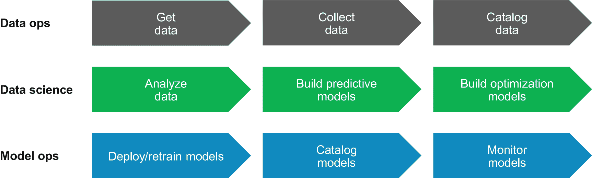
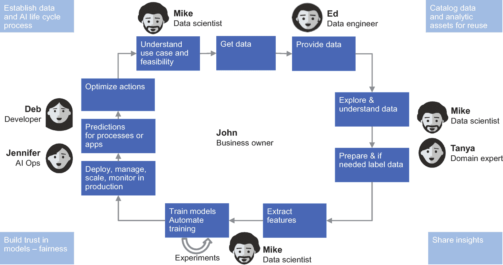
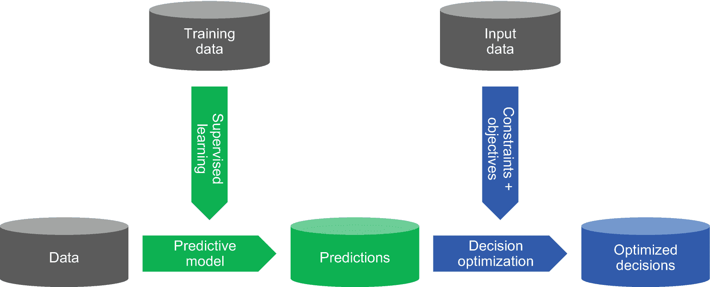
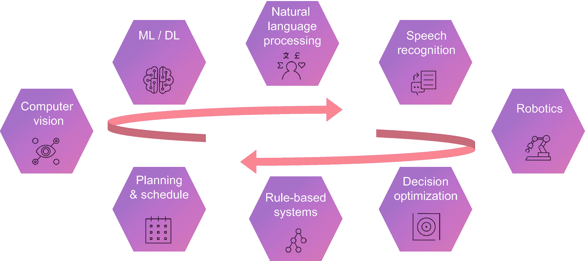

# 1.艾游戏攻略

长期以来，人工智能(AI)一直是人类的愿景。小说作品从多个角度探讨了人工智能的话题。例如，*， *2001:太空漫游*，*终结者*，*人工智能*，*星际迷航*，*外星人*，*母亲*等等以许多不同的表现形式展现了人工智能:一些像人类，一些非常不同，一些为人类服务，一些与人类合作，一些甚至与人类战斗。*

 *虽然科幻小说和电影中的人工通用智能(AGI)仍然难以捉摸，但人工智能的几个实际领域已经取得了很大进展，已经从小说变成了现实。

特别是，机器学习(ML)和深度学习(DL)的人工智能领域已经从研究发展到实践，同时被大量公司和组织应用到世界各地令人惊叹的广泛用例中。我们现在正处于这样一个阶段，利用 ML 和 DL 是现代企业的最先进技术，但更大规模的采用仍在前面。早期采用者将在他们的 ML 和 DL 应用程序中走得更深更广，那些还没有认真开始的人将需要很快跟上。

## 面向企业的人工智能

这本书为你提供了在企业和组织环境中整体应用人工智能的建议和最佳实践。为了帮助利用人工智能并以有意义和与业务相关的方式实现其承诺，我们为您提供了一个关于人工智能以及如何释放其变革性和颠覆性力量的务实观点。

企业人工智能不仅需要利用先进的 ML 和 DL，还需要利用自然语言处理(NLP)和决策优化(DO)来实现自动化操作、机器人和其他领域，以优化现有的业务流程并实现新的用例。企业中的人工智能 [1](#Fn1) 旨在发现组织知识，并以一种与人类如何完成这些任务一致的方式将分析洞察力传递和注入决策过程，但以数量级加速这些过程。

我们为您提供了一个由挑战和差距驱动的全面的人工智能视图，以及随后的机遇，让您获得竞争优势。一个特殊的领域与人工智能生命周期和部署有关，包括人工智能可操作化挑战，通过提供数据来支持人工智能的全面信息架构(IA)的需求，开发运维方面，以及如何基于从 ML/DL 和 DO 模型中获得的洞察力做出可操作的决策。我们还在特定领域的背景下探索人工智能，如主数据管理(MDM)、治理和变革管理、区块链，以及量子计算等未来方向。

AI 对企业 [2](#Fn2) 的适用性提供了一个相当多样化的视角。ML、DL 和 DO 是我们在整本书中始终关注的关键领域。在本简介以及第 5 章、*从数据到预测再到最佳行动*中，我们一方面让您了解 ML/DL 与 DO 的互补性质，另一方面允许您从数据到预测再到优化决策，从而实现自动化行动。此外，我们还为您提供了人工智能在过去几十年中的进展和进步的高层次描述，因为这对于评估人工智能的成熟度——或者说缺失的能力——是必不可少的。

对企业中人工智能的讨论需要对人工智能信息架构和人工智能具有挑战性的可操作性方面进行深入探讨，包括人工智能背景下的 DevOps。没有强大的信息架构(IA)，任何企业都无法维持当今的业务动态和所需的业务敏捷性，包括数据存储和管理、治理和变更管理以及主数据管理(MDM)等方面。

人工智能的影响以及人工智能为这些领域带来的机遇将在第 3 部分*中详细讨论。*

 *## 人工智能目标:自动行动

大多数公司和组织最终希望从应用人工智能中获得的是自动化决策，以推动自动化行动，从而加速他们的业务或其他目标，或者在不可能或不可接受取代人类判断的情况下，通过建议来协助人类决策。自动化或辅助决策以及由此产生的行动可以带来巨大的效率和速度，并且在某些情况下可以实现全新的商业模式，否则这是不可能的，例如，现代电子商务、欺诈检测、约会应用等等。

另一方面，如果做得不好，决策和行动的自动化可能会导致损害或损失——例如自动驾驶汽车导致撞车或自动交易算法导致财务损失，或者法律或道德错误的决策导致罚款或品牌损害。

在接下来的章节中，我们从目标“驱动自动化行动的自动化决策”开始，并回到实现该目标所需的手段和技术方法。

### 行动需要决策

公司和组织日复一日地做出大量决策 [3](#Fn3) ，并根据这些决策采取大量具体行动。

重大战略决策是由领导者和董事会做出的，例如，是否为了扩大业务而收购一家公司，如何塑造企业文化和形象，以及在与收入目标的平衡中承担多大的总体风险。这些战略决策可以通过利用人工智能技术来提供信息；然而，最终的判断和决定仍然是人类的责任——这不会有重大改变。最终，领导者和董事会仍然要对这些战略决策及其所有后果负责，但人工智能可能会帮助他们做出更好的决策。这类决策通常数量不多，它们非常适合由人类在经过适当的考虑和讨论后做出。

然而，在一个企业或组织中，大量的决策——可能是数百万或数十亿——需要一致地、快速地、高频率地基于数据、指导方针和约束做出。这种频繁决策的例子包括是否为想要进入的人开门、在情境营销活动中提供什么、优化代理-客户交互、决定自动驾驶汽车是否应该在给定情况下闯入、决定是否批准或拒绝保险索赔或贷款请求，以及促进购买决策。

下面是一些典型的大数量和高频率决策的例子，我们将在下面的章节中进一步探讨:

*   **下一个最佳报价**:决定登录网站时向顾客提供什么产品

*   **准确的旅行信息**:在机场屏幕和网站上显示什么航班出发和到达时间

*   **车间生产优化**:是否在工厂车间保留生产线

这些种类的决策 [4](#Fn4) 不是由人类最优地做出的，因为这些决策的数量太大，并且这些决策的输入参数复杂，使得工作人员与人类一起做出这些大量决策是不可行的。

为了自动化这种大量数据驱动的决策，过去通常使用不灵活的确定性程序，要求开发人员制定确定性算法和预定义规则来处理输入参数并确定所需的决策。这要求开发人员在需要时随时可以更改代码，即使是很小的调整，随着时间的推移，这可能是经常需要的。或者人类仍然会遵循为他们定义的规则和指导方针和/或基于他们自己的判断来确定这些决策，允许对变化的环境进行调整，但是需要大量的人员，导致高成本，并且每个决策需要更多的时间来做出。

### 决策需要预测

为了以自动化的方式灵活地做出大量决策，需要数据驱动的预测。这些预测可以使用最先进的人工智能技术来生成，使用相关数据来推动一个过程，该过程访问数据并将数据输入预测模型，并获得最终的预测，如图 [1-1](#Fig1) 所示。

图 1-1

从数据到预测

然后，这种预测性的洞察力将作为决策过程的基本输入之一。以下只是预测洞察力的几个示例，对应于我们在上一节中给出的所需决策的三个示例:

*   **通知下一步最佳行动的可能产品兴趣**:客户可能对什么产品感兴趣并准备购买，以及客户购买一个甚至几个建议产品的可能性有多大。需要这种预测来决定下一步向客户提供什么产品或服务，保证接受的最大可能性。

*   **预计航班到达登机口通知准确的出行信息**:当一架仍在飞行的飞机将到达登机口时，给定所有情况，如空中交通、逆风或顺风、滑行时间等。需要这个预测来决定显示进港航班的到达时间。

*   ****车间生产优化**预测零件质量:根据当前传感器信息，工厂机器生产的下一批零件是好的还是有缺陷的。需要这种预测来决定是继续生产还是保持生产线。**

 **然而，单靠预测通常不足以做出明智的、理想的最佳决策。例如，仅使用客户对产品的兴趣预测本身可能会导致有问题的决策，例如提供没有库存的产品，然后让客户失望，等待很长时间。要做出明智的决策，你需要的不仅仅是预测。

### 明智的决策:预测和优化

通常，决策和行动不能纯粹基于个人预测。再看前面的例子，除了客户的兴趣之外，向哪个客户提供什么产品真正有意义还取决于仓库中的库存和交付时间、产品的盈利能力、营销预算的规模、客户状态、过去报价的接受或拒绝历史以及许多其他参数。

在需要更全面地做出决策的情况下，不仅要基于预测，还要考虑业务约束和其他因素，仅靠预测不足以解决问题。为了确定决策和最终行动的最佳组合，需要将多组预测与基于这些预测和附加数据、约束和目标的优化相结合。

图 [1-2](#Fig2) 展示了从相关数据通过预测洞察到优化决策的流程。预测 ML 和 DL 建模与决策优化(DO)相结合实现了这一流程。

图 1-2

从数据到优化决策的流程

ML 的人工智能学科建立了基于*数据*进行预测的方法，而不需要为每个不同的问题编写确定性代码。ML 算法基于样本数据建立数学*模型*，用于训练这些模型。对于不同的问题领域，有各种各样的 ML 模型类型，它们由 ML 算法训练。三种主要类型的 ML 算法是监督学习、非监督学习和强化学习算法。

有关 ML、DL 和 DO 概念的更多信息，请参见第*章* [*3*](03.html) 、*关键 ML、DL 和 DO 概念*

## 数据推动人工智能

为了创建和训练*好的* ML 和 DL 模型，我们需要好的数据作为任何基于人工智能的解决方案的基础。数据必须足够相关、准确和完整，才能对训练模型有用。此外，数据需要具有代表性并反映现实，避免不必要的偏差。只有当定性和相关数据被用于训练 ML 和 DL 模型时，作为训练过程的结果，才能创建准确和精确的模型。如果数据不合适，并且不能充分代表给定的业务场景，那么得到的模型通常表现不佳和/或有偏差。

### 垃圾进，垃圾出

这听起来可能微不足道，但如果用差的数据来训练 ML 和 DL 模型，垃圾入将导致垃圾出。一个很好的例子是早期图像识别项目的一则轶事，数据科学家使用有坦克的图像和没有坦克的图像来训练一个人工神经网络模型，以识别有坦克的图像。该模型用一组标记的训练图像来训练，然后用一组标记的验证图像来验证。由此产生的模型似乎运行良好。后来，它用一组新的图像进行了进一步测试，然后表现很差。在现实项目中，这种现象确实经常发生。

经过一些分析后，数据科学家发现，在拍摄第一组图像时，不管有没有坦克，这些标签都与晴朗或多云的天气条件密切相关。结果，人工神经网络(ANN) [6](#Fn6) 模型的输出受到是否在晴天对阴天拍摄照片的强烈影响。只有用改进的、更充分的标记训练数据集重复训练过程，人工神经网络模型才能取得更好的结果。

对于数据科学家和数据工程师来说，为训练、验证和测试生成一组定性的、有代表性的标记数据集是一项必不可少且通常非常耗时的任务。

### 偏见

如果使用有偏差的数据来训练模型，得到的模型也可能会显示偏差。例如，一家银行可能希望在贷款审批流程中实现决策自动化，方法是获取我的员工以前做出的贷款决策的样本，并使用这些样本来训练一个模型，以便将来实现这些决策的自动化。如果过去人类决策的数据集是没有偏见的，那么这个模型应该是公平的。

然而，如果训练数据集中过去的人类决策偏向于某些人口统计学特征(例如，年龄、种族、民族、性别、婚姻状况)的更可能拒绝的贷款，则模型也将被训练成偏向的。

即使过去人类决策的整体没有偏差，如果以不具有充分代表性的方式对训练数据集进行采样，则得到的模型仍可能具有偏差 [7](#Fn7) 。

### 人工智能的信息架构

鉴于数据对人工智能的重要性，建立适当的信息架构(IA) [8](#Fn8) 来管理将用于推动人工智能的数据和为构建人工智能而创建的分析资产至关重要。

这涉及到*数据运营*、*数据科学*和*模型运营*协同工作的可信流程，如图 [1-3](#Fig3) 所示。

图 1-3

数据运营、数据科学和模型运营

以下是对这三个过程的简短描述。

*   **数据操作**包括从所有相关来源获取数据，在随时可用的高性能数据存储中收集数据，并对数据进行一定程度的分类验证，确保数据具有代表性且没有偏差，如果采样，则在采样过程中不会出现偏差，最后但同样重要的是，管理可靠且不可变的数据，以支持再现性。对于任何基于数据训练的模型，一个好的信息架构应该确保模型不仅可以追溯到用于训练它的代码，还可以追溯到用于训练、验证和测试它的实际数据以及该数据的血统或来源。甚至用于后续再训练过程的新数据，以及模型的额外修改，都需要考虑在内。

*   **数据科学**要求从数据到模型。从信息架构的数据运营元素提供的数据中获取预测和/或说明性模型需要数据科学技能，通常还需要主题专业知识，这些数据可通过模型运营供流程和应用程序使用。这通常包括分析数据以充分了解它，从而确定它是否是要使用的正确数据，可能需要特殊主题专业知识的数据标记，构建和验证预测模型，可能还需要构建优化模型以处理数据和预测。

*   **模型操作**包括部署模型用于生产，如果需要，再培训模型，并监控生产中的模型。与处理数据类似，信息架构也应该将模型和模型部署视为一级实体，需要将其编目为系统中众所周知的实体。模型操作通常还需要连接到数据操作，以可靠和高性能的方式向生产模型提供新数据，例如，用于实时评分。

## 放在一起:人工智能的生命周期

我们观察到，为了在企业或组织中实现通知和自动化决策和行动的目标，我们需要预测，通常还需要优化。为了进行预测，我们需要训练机器学习模型，这需要良好、可信的数据。为了收集和管理大量可靠的数据，我们需要一个人工智能信息架构。

虽然我们从实现自动化行动的目标开始推理，并返回到实现它的方法，但为了构建可行的解决方案，我们需要从数据开始，并从数据驱动预测到最佳行动。

如图 [1-4](#Fig4) 所示，这种实现成果的实用方法已经在 ML 生命周期 [9](#Fn9) 中得到体现。我们在第 [4](04.html) 、“ *AI 信息架构*”章节中进一步阐述了信息架构背景下的各种 ML 生命周期方面

图 1-4

端到端数据科学/ML 周期

### 理解用例及可行性

ML 生命周期的第一个阶段通常是从理解用例以及它在实践中是否可行开始。要定义和阐明的关键方面是项目的确切目标是什么，要自动化的具体决策和行动是什么，以及用最先进的 AI 和 ML 方法以及可以在实践中获得和使用的数据解决用例的可行性。

所有这些都不是理所当然的:许多问题还不能用当前的 ML 方法来解决。通常，法律或政策可能无法或不允许实际获取所需的数据，例如，由于数据隐私的原因，或者一些所需的数据可能还没有被收集和存储。

在这一阶段结束后，对于解决什么问题和使用什么数据来解决问题应该有一个很好的清晰度，并确认所需的数据确实可以在实践中获得和使用，同时需要对现有的 ML 技术可以应用有信心。

### 收集数据

ML 生命周期的下一阶段是收集原始数据，为工作打下坚实的基础。通常，在企业或其他组织中，会有各种各样的数据源，有些在内部，有些在外部，有些是结构化的，有些是非结构化的，有些已经有了适当的质量，有些需要改进才能有用。

在这一阶段，正确地对数据进行分类是很重要的，这样在后续步骤中，就可以很容易地在数据科学和 ML 项目中找到、访问和使用它。根据数据的来源，在数据仓库或数据湖中引用数据或创建数据副本或数据样本，并对数据进行编目以备将来使用可能是有意义的。

在此阶段，有时可能需要忽略或匿名敏感数据，例如姓名、社会保险号、信用卡号等，然后才能将这些数据提供给数据科学家用于后续步骤。

### 探索和理解数据

下一阶段通常是开始探索、分析和理解可用数据，例如，寻找相关模式和异常，并理解数据的统计分布及其随时间、地理、人口统计等的覆盖范围。

在此阶段，还应检查数据的偏差，例如，如果使用历史信贷审批决策来训练信贷审批模型，则在此阶段，检查偏差是有意义的，例如，基于性别或年龄、邮政编码或其他不应影响模型以后如何工作的属性。然而，根据用例场景，偏向实际上可能是一个期望的特征。例如，用于 ATM 或 POS 网络中借记卡使用的欺诈发现的 ML 模型可以很好地考虑邮政编码或某些商店，在这些地方欺诈可能更频繁地发生或在某些情况下发生。

在进入后续步骤之前，真正理解数据并确保它代表一个领域是至关重要的。如果事实上可用的数据和可以用它做什么没有被充分理解，数据科学和 ML 项目很容易陷入后期阶段。

通常，可能有必要重复或扩展数据收集过程，并收集更具代表性的数据，获得获取更多数据的额外许可，或者甚至细化用例定义，使其在对可用数据有了更好的理解后变得可解决。

### 准备标签数据(如果需要)

下一个阶段是准备和(如果需要的话)标记数据，以便得到可以有效地用于训练模型的数据集。数据标记，即标记或注释数据样本，可能是一项非常具有挑战性且耗时的工作。 [10](#Fn10) 此外，可能有必要以一种有代表性且没有偏见的方式对数据进行采样。

例如，如果一个人力资源用例中的原始数据集有太多关于男性的数据点和太少关于女性的数据点，这可能会导致以后有偏见的模型。为了解决这个问题，可以收集和添加更多关于女性的数据点，或者如果有大量的数据点，可以将关于男性的数据点减少到相同的数量。

例如，对于受监督的 ML，通常需要带标签的数据。如果标记需要高技能，这可能需要让主题专家参与项目，例如，用诊断标记 X 射线图像或用资格标记贷款申请数据，或者在其他一些情况下，可能只需要正常的人类认知，例如在图像中标记汽车或行人。对于后者，可以利用提供标签服务的第三方。数据标签的准确性和质量对于最终得到的模型的准确性和质量至关重要，这可能需要多个杰出的学科专家来标记相同的数据，并基于组合的输入来确定正确的标签。

### 提取特征

在此阶段，数据科学家从数据中提取特征，也就是说，他们确定输入数据的哪些方面与预测或分类相关，以及哪些方面应该用作模型训练的一部分。此步骤可能不仅仅是纯粹的数据驱动，基于公司或组织内的现有法律、法规和指南，输入数据的某些属性可能不被允许或不希望影响 ML 或 DL 模型决策。

例如，信贷审批模式不应该有性别歧视；因此，可能包含在数据中的性别属性不应成为用于训练信贷批准模型的特征。

### 训练和验证模型

为了训练模型，最初数据科学家通常会探索许多选项并进行一系列实验，以确定良好的候选模型管道，验证生成的模型，并确定模型质量和性能指标。这可能是非常计算和内存资源密集型的，取决于数据大小和使用的 ML 或 DL 算法。为了促进企业中数据科学团队的模型培训，通常使用公共云或私有云方法，允许按需从资源池中分配计算和内存容量。

在训练和验证模型之后，应该用更多的数据对最有希望的模型进行彻底的测试，最终得到一个数据科学团队确信运行良好并且符合在项目早期确定的相关法律和准则的模型。

### 模型审查和批准

对于关键用例，模型通常需要通过模型审查和批准过程。例如，在银行、保险和医疗保健组织中，一个模型可能会影响数百万的收入或风险、数千个医疗保健覆盖范围决策或数千个诊断辅助建议。为了避免部署新模型或新版本模型的代价高昂或危险的后果，数据科学家可能需要提供关于模型如何工作以及模型基于哪些输入做出决策的大量文档，以供其他数据科学家、业务利益相关者、法律职能部门和许多其他人审查，直到模型获得所有必需的签准，以继续部署和操作应用程序或业务流程对模型的使用。

模型风险管理解决方案 [11](#Fn11) 可以帮助简化文档和批准流程，并说明和跟踪模型风险。

### 在生产中部署和监控模型

在许多项目中，跨越数据科学团队执行的数据科学和实验与 IT 部门管理和运行的僵化生产部署流程之间的鸿沟是一项挑战。为了从数据科学家试验和创建初始数据和模型(包括模型管道工件)的工作环境过渡到严格控制的测试和生产部署系统，需要从数据科学家向运营 IT 人员进行适当的移交。

在许多情况下，数据科学家使用的工作环境和最终部署模型的 IT 系统是完全独立的系统。例如，数据科学家的工作环境可能是基于云的软件即服务解决方案，或者是私有云中 Kubernetes 集群上的软件解决方案。需要部署模型的生产系统可能是汽车中的应用程序、工厂生产车间的服务器，或者是由完全不同的组织运营和运行的公共云或私有云上的应用程序或业务流程上下文中的模型评分服务。

为了连接，数据科学家通常需要将他们的模型训练代码(或者模型训练流，如果使用可视化工具的话)和所有需要的源工件交付到代码存储库中，例如，企业 Git 服务。这可以实现一个 IT 过程，其中在任何所需的签署之后，可以建立一个持续集成/持续交付(CI/CD)管道，以使用来自存储库的训练代码或流来训练生产就绪模型和模型管道，将这些模型和模型管道存储在模型库中，然后从那里部署到测试系统，并最终部署到生产系统。

在开发周期中，AI 模型和工件在现有 IT 和应用程序环境中的可操作性经常被忽略。由于企业确实在努力进行部署和操作，我们用了整整一章 [12](#Fn12) 来讨论这个特定的主题。

### 对应用或过程的预测

为了在应用程序或业务流程的上下文中使用模型，模型部署服务需要与消费应用程序和流程的服务质量相匹配。对于需要高可用性和灾难恢复的生产级应用程序，所使用的模型也需要部署匹配的 HA 和 DR 特征。为了实现这一点，ML 和 DL 模型可能需要部署在不同站点甚至不同地区的多个独立系统上，以便在一个部署变得不可用时，来自应用程序或业务流程的模型评分请求可以通过故障转移跨部署进行负载平衡。对于非平凡模型的大规模使用，需要对模型进行缩放，以允许模型运行在需要的尽可能多的内核和尽可能多的内存上。

一旦模型被部署到生产中，就需要不断地监控它的操作，以确保模型部署满足响应时间约束，并在预期的参数内执行。在许多用例中，当输入数据随着时间的推移与用于训练模型的训练数据相差太大时，还必须连续监视和分析模型的输入和输出，以检测模型可能具有的任何偏差或模型可能随着时间的推移而产生的漂移。

如果检测到问题，在某些用例及情况下，可以在生产系统上执行本地再培训以调整模型。然而，在许多情况下，数据科学家可能不得不再次参与创建一个新的更健壮的模型，然后再次将其提交给生产部署流程。

### 优化操作

正如我们前面所观察到的，通常仅从 ML 或 DL 模型中得出的预测不足以得出好的行动。基于预测做出什么决定和采取什么行动通常取决于环境:其他预测、附加数据和约束。在简单的情况下，一些应用程序或流程逻辑可以在上下文中包装模型和因素的使用，以确定决策和最终的操作。然而，这通常不会导致最佳结果。

正如我们在开始时简要提到的，为了在一系列预测、数据和约束的背景下持续优化决策，可以应用决策优化(DO)。例如，应用程序或业务流程可以使用部署的 ML 模型进行批量预测。然后，应用程序或流程可以调用 DO 模型的求解，将这些预测与上下文数据和约束条件相结合，以确定最佳决策集，然后将这些决策付诸实施。

图 [1-5](#Fig5) 是该过程的示意图。第 5 章、*从数据到预测再到优化措施、*详细阐述了各种数据输入流、相应的预测和优化措施之间的一致性。

图 1-5

走向优化决策

### 获得自动化操作的好处

如果你设法为你的企业或业务领域建立和运营端到端的人工智能生命周期，可以实现前所未有的业务加速和效率。如果完全自动化，过去需要花费时间的决策可以立即做出，或者当人工智能增强人类决策时，可以显著加快速度，以推动自动化或人工智能增强的行动。因此，可以缩短业务流程持续时间，并提高产量和客户满意度。

### 人工智能和认知计算

人工智能和认知计算(CC)是非常相关的。人工智能是由模仿人类与其他人类思维相关联的*认知*功能的机器展示的智能，例如*学习*、*推理*，以及*解决问题*。因此，人工智能由许多领域组成，如 ML 和 DL、DO 和基于规则的系统等，以提供例如预测和说明性的洞察力。

认知计算处理强调通过经验学习行为和决策的能力的系统，包括从零开始学习或基于反馈学习，甚至教育或培训。CC 侧重于认知能力，并支持多种形式的表达，这些表达对人类互动来说更自然，其中 CC 的主要价值是学到的专业知识。对于 CC，重点是随着新的经验、场景和响应的出现而不断学习和发展。

图 1-6

AI 和 CC 域

在某种程度上，AI 和 CC 是一个硬币的两面。图 [1-6](#Fig6) 描绘了组成 AI 和 CC 的各种域。如您所见，AI 和 CC 的范围相当广泛。在本书中，我们触及了这些领域中的大部分，但是我们的重点更多地放在企业相关性上。例如，我们不打算详述*机器人*和*计算机视觉*。

在第 [13](13.html) 、“*人工智能的局限性*章节中，我们将特别详细阐述人工智能在认知能力方面的局限性。

## 人工智能，区块链，量子计算

人工智能不是为企业提供商业利益的唯一领域。区块链正在取得更大的进展，将自己确立为一个基本的不可改变的共享账本应用程序，可用于记录各种资产的交易。在第 [11](11.html) 、“ *AI 和区块链*章节中，我们与你分享我们对 AI 与区块链交集的看法。尽管量子计算在研究和开发中已经成为现实，但它似乎在技术层面上更进一步——至少就其在当今企业中的部署和使用而言。然而，在第 [12 章](12.html)、 *AI 和* *量子计算*中，我们为你提供了我们对一些 AI 问题的想法，这些问题很可能会从量子计算中受益。

## 关键要点

我们总结了本章的一些要点，总结在表 [1-1](#Tab1) 中。

表 1-1

关键要点

<colgroup><col class="tcol1 align-left"> <col class="tcol2 align-left"> <col class="tcol3 align-left"></colgroup> 
| 

#

 | 

关键外卖

 | 

高级描述

 |
| --- | --- | --- |
| one | 人工智能目标:自动操作 | 自动化的行动需要自动化的决策。当基于好的决策时，结果可能很好，但是如果决策不好，可能会导致重大损失 |
| Two | 做出好的决定并不容易 | 预测有助于自动决策，但不足以做出好的决策。决策需要考虑其他决策和背景 |
| three | 预测+优化的明智决策 | 基于数据+预测+约束优化决策允许做出明智的决策 |
| four | 机器学习来做预测 | 机器学习可以根据数据进行预测，而不需要为每个不同的问题编写特定的代码 |
| five | 数据推动人工智能——垃圾进，垃圾出 | 数据对于人工智能，尤其是机器学习来说至关重要，需要一个可靠的信息架构来确保可靠的质量数据 |
| six | 信息架构 | 人工智能的信息架构涉及与数据科学和模型操作流程相关的数据操作 |
| seven | 放在一起:人工智能生命周期 | 人工智能生命周期包括连接和收集数据、理解和提炼数据、使用数据构建预测和说明性模型，以及在生产中部署、运行和监控模型 |

## 参考

1.  福布斯 j .潘迪亚。*企业 AI 的未来是怎样的？* 2019，[`www.forbes.com/sites/cognitiveworld/2019/11/17/what-is-the-future-of-enterprise-ai/#1fea7eda7a79`](http://www.forbes.com/sites/cognitiveworld/2019/11/17/what-is-the-future-of-enterprise-ai/%25231fea7eda7a79)(2020 年 4 月 28 日访问)。

2.  埃利奥特，b .安德鲁斯，w .加特纳。*AI 在企业中应用的框架*、[、`www.gartner.com/en/doc/3751363-a-framework-for-applying-ai-in-the-enterprise`、](http://www.gartner.com/en/doc/3751363-a-framework-for-applying-ai-in-the-enterprise)(2020 年 4 月 28 日访问)。

3.  人工智能驱动的企业:利用本体的力量让你的企业更聪明、更快、更有利可图。ISBN-13: 978-1-928055-50-1，英格拉姆出版服务公司，2020 年。

4.  多标准决策分析:方法和软件。ISBN-13: 978-1119974079，威利，2013。

5.  说明性分析:基于证据的管理和最佳决策的最终前沿。ISBN-13: 978-0134387055，皮尔逊 FT 出版社，2019。

6.  数据科学中心。*从数据的生命周期解释 AI*，[`www.datasciencecentral.com/profiles/blogs/explaining-ai-from-a-life-cycle-of-data`](http://www.datasciencecentral.com/profiles/blogs/explaining-ai-from-a-life-cycle-of-data)(2020 年 4 月 28 日访问)。

7.  《经济学人》。*数据标签初创公司希望帮助提高企业人工智能*。[`www.economist.com/business/2019/10/17/data-labelling-startups-want-to-help-improve-corporate-ai`](http://www.economist.com/business/2019/10/17/data-labelling-startups-want-to-help-improve-corporate-ai)(2020 年 4 月 28 日访问)。

8.  中等。数据注解:*AI 突破背后的百亿美元业务*。[`https://medium.com/syncedreview/data-annotation-the-billion-dollar-business-behind-ai-breakthroughs-d929b0a50d23`](https://medium.com/syncedreview/data-annotation-the-billion-dollar-business-behind-ai-breakthroughs-d929b0a50d23)(2020 年 4 月访问)。

<aside aria-label="Footnotes" class="FootnoteSection" epub:type="footnotes">Footnotes [1](#Fn1_source)

有关企业中 AI 的更多信息，请参见[1]和[2]。

  [2](#Fn2_source)

有关人工智能驱动的企业的更多信息，请参见[3]。

  [3](#Fn3_source)

有关决策分析的理论和应用的更多信息，请参见[4]。

  [4](#Fn4_source)

有关自动决策的更多信息，请参见[5]。

  [5](#Fn5_source)

根据业务环境和用例，ML 或 DL 模型中的偏差可能是一个预期的方面。然而，在大多数情况下，应该避免偏见。

  [6](#Fn6_source)

我们在第 [3 章](03.html)、*关键 ML、DL 和 DO 概念*中提供了人工神经网络(ann)的高级描述

  [7](#Fn7_source)

我们在第 [4 章](04.html)、*人工智能信息架构、*和第 [6 章](06.html)、*人工智能的可操作化*中详细阐述了偏差，包括如何监控偏差

  [8](#Fn8_source)

我们在第四章、*人工智能信息架构*中描述了人工智能信息架构的关键概念

  [9](#Fn9_source)

有关人工智能生命周期的更多信息，请参见[6]。

  [10](#Fn10_source)

有关数据科学相关数据标注的更多信息，请参见[7]和[8]。

  [11](#Fn11_source)

请参考第[章第 8](08.html) 、“*人工智能和治理”、*章，了解人工智能背景下风险管理的更多信息。

  [12](#Fn12_source)

参见第[章第 6](06.html) 、*节人工智能的可操作化*

 </aside>****