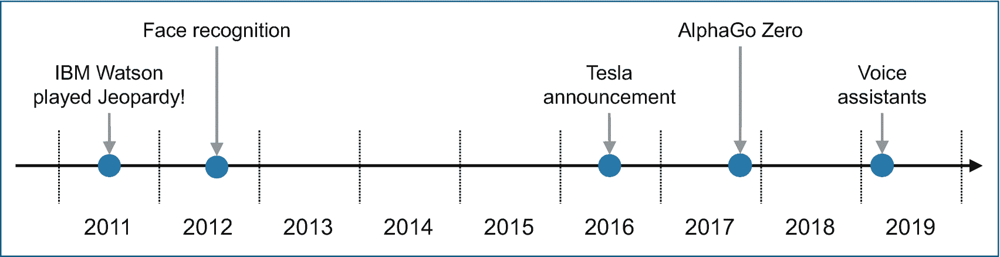

# 二、AI 历史视角

在我们没有充分意识到并不断欣赏它的情况下，人工智能已经影响了我们几年，甚至几十年。因此，人工智能的历史观点似乎不再是一个重要的考虑因素:人工智能已经成为不可否认的事实。它的影响对每个人和整个社会都是显而易见的。

那么什么改变了，为什么我们仍然打算提供一个人工智能的历史视角？人工智能从主要的学术和研究领域向广泛的商业相关人工智能应用的转变，数千个可免费下载的开源库的可用性，以及专用处理器(如 GPU、FPGAs、ASICs)的进步，代表了过去十年中发生的一些重大变化。

然而，即使在今天，也有一些场景根本不需要人工智能，因为问题或议题太简单，或者问题对于今天的人工智能能力来说太复杂。这些方面将在第 [13 章](13.html)、*AI 的局限性*中讨论此外，在使用 AI 时往往会有一定的犹豫(伦理问题、监管要求等。);这些方面将在第 8 章、 *AI 和治理*中讨论

在这个相对较短的章节中，我们打算提供一个简短的历史观点，一瞥最近的过去，在那里人工智能能力仍然有些不成熟，因此人工智能的应用相对有限。因此，这种历史视角应该有助于理解 20 世纪 50 年代和 60 年代人工智能的出现与近年来人工智能应用的爆炸之间的差距，以及为什么用了这么长时间——半个世纪——来采用人工智能。

## 介绍

技术的进步和采用通常是逐渐发生的；这是一种进化的方法。因此，确定一个没有人工智能的日期可能具有挑战性。人工智能这个术语是约翰·麦卡锡在 1955 年创造的。然而，导致后来被称为人工智能的概念、思想、想法甚至算法却存在得更早 [2](#Fn2) 。这里仅举几个例子:关于条件概率的贝叶斯定理可以追溯到十八世纪的英国数学家托马斯·贝叶斯。最小二乘法在 200 多年前就已经发展起来；马尔可夫链的随机概念是在二十世纪初发展起来的。甚至第一个人工神经网络(ann)也是在 20 世纪 50 年代初基于 20 世纪 40 年代的概念实现的。

这些早期人工智能的发展和进步更多的是理论性的，而不是成熟和经过验证的。因此，它们在该领域不太适用，或多或少地留在学术界。

在这一章中，我们打算讨论这一差距，并说明为什么二十世纪下半叶的理论人工智能基础导致了过去十年中人工智能的显著发展。

## （从）历史的视角

虽然人工智能包括关键的 ML 和 DL 概念可以追溯到几十年前，在 20 世纪 60 年代和 70 年代，但在该领域具有显著相关性的人工智能能力有限。在这一节中，我们讨论了人工智能技术的进步如何改变了人工智能的使用方式，以及这对企业、个人和整个社会产生了什么影响。

我们还通过简要阐述 AI 之外的*来冒险一瞥未来，这意味着在不久的将来会发生什么变化。这在第 [14 章](14.html)、*的总结和后续章节*中再次被提及*

### 技术进步

正如所有领域一样，它也适用于人工智能，因为有新的方法和方法以及创新的技术进步，例如，硬件处理器速度和内存大小的改进，新兴的专用处理器(例如，GPU、FPGAs、ASICs 等)。)，随着时间的推移，这将使人工智能应用更加丰富和相关。因此，这种*历史视角*试图从进化和动机的角度来看待人工智能:理解几年前或几十年前(鉴于当时的技术现状)人工智能的能力和应用领域是什么，以及今天(随着最近的人工智能和技术进步)可能会发生什么，以及在不久的将来(基于有前途的研发努力)我们甚至可能会面临什么。

我们对人工智能的定位一直或多或少地取决于最先进的人工智能技术和人工智能在该领域的适用性。在人工智能一词被创造出来后的最初几十年，以及几乎整个二十世纪下半叶，人工智能及其兄弟姐妹大多与学术和研究活动有关。因此，组织和个人受到人工智能的影响要小得多；人工智能的商业化和人工智能在该领域的可见性相当有限。

在二十世纪的最后十年，我们已经看到了重大的人工智能进步，如 IBM 的深蓝 [3](#Fn3) 系统，它在六场比赛后击败了世界象棋冠军。然而，在 21 世纪，特别是在过去的十年中，人工智能的增强有了显著的增长，并且足够成熟，可以在现场部署。

表 [2-1](#Tab1) 列出了过去十年人工智能的主要里程碑。正如你从这个(不完整的)列表中看到的，组织和个人越来越受到人工智能的影响；人工智能的商业化正在进行中，而*不要人工智能*显然是没有选择了。

表 2-1

过去十年人工智能的主要里程碑

    
| 

#

 | 

里程碑

 | 

描述

 | 

影响

 |
| --- | --- | --- | --- |
| one | IBM 沃森[4](#Fn4)T3】 | IBM Watson 玩了 Jeopardy！战胜了人类对手 | 这清楚地证明了人工智能在像 Jeopardy 这样与自然语言相关的游戏方面比人类更好 |
| Two | AlphaGo 零T1】5T3】 | 高级搜索树与人工神经网络的结合战胜围棋冠军 | 第一次成功是人工神经网络可以学习像“从零开始”这样的游戏，而不需要用标记数据进行初始训练 |
| three | 人脸识别 [6](#Fn6) | 无需标记图像就能成功训练人脸检测人工神经网络(无监督学习) | 人工神经网络(ann)首次获得成功，可以学习人脸识别，而无需使用标记图像数据进行显式训练 |
| four | 语音助手 [7](#Fn7) | 苹果 Siri、亚马逊 Alexa、谷歌等都是第二代语音助手 | 向基于语音的计算机交互(语音控制的人工智能)转变，在执行一系列操作后，助手能够理解并回答自然语言中的陈述和问题 |
| five | 特斯拉 [8](#Fn8) 自动驾驶车辆 | 特斯拉宣布 2016 年 11 月后生产的汽车拥有完全自动驾驶硬件 | 对汽车行业、司机和运输行业的深远影响 |

这些主要里程碑如图 [2-1](#Fig1) 所示。

图 2-1

过去十年人工智能的主要里程碑

通过开源软件许可 [9](#Fn9) 的开源社区以及苹果、IBM、脸书、谷歌等供应商，进一步增强了人工智能，这实际上导致了人工智能应用的爆炸，尤其是在过去十年中。

### 人工智能的进化

到目前为止，我们已经阐述了 20 世纪 50 年代和 60 年代 AI 的出现，包括最近十年 AI 的最新关键里程碑。人工智能的这种演变的特点是不断增加的商业化和人工智能在该领域的存在，实际上影响了各行各业。这显然是一个从人工智能主要局限于学术和研究领域向成熟和可用的人工智能应用爆炸的转变。在过去的 50 年中，人工智能在实际应用中的限制已经明显地变成了人工智能的快速扩展和商业化使用。

人工智能的发展和商业化以前所未有的速度继续，主要的人工智能缺陷正在由研究和供应商等解决。没有初始训练的带标签数据的强化学习、泛化和多任务学习、自主人工智能，以及——最重要的是——用认知能力(如推理和理解)丰富人工智能，只是人工智能未来发展方向的几个例子。到那时，我们会看到人工智能以无所不包的方式嵌入，而我们却没有意识到它的存在。

在第 [13](13.html) 、*人工智能的局限性*章节中，我们进一步阐述了当前人工智能的局限性，并描述了试图克服其中一些局限性的关键研究工作。在第 [14 章](14.html)、*总结和继续*，我们提供了一个对一个确定的人工智能无处不在的世界的展望。

## 一些行业示例

关于人工智能，大多数企业和个人都已经开始了他们的人工智能之旅。但是，还是有区别的。例如，在 O'Reilly [10](#Fn10) 最近的一项调查中，49%的受访者表示他们组织中采用 ML 的阶段为*探索*，36%的人表示为*早期适应者*，只有 15%的人表示为*成熟*。

不管这种多样化的人工智能采用情况在未来会如何改善，今天当我们看各个行业时，它都是正确的:尽管人工智能存在于所有行业，但是否转向人工智能的决定因行业而异。这主要与各行业的机会、特点、商业模式不同有关。我们专注于以下六个行业领域，通过证明人工智能使用的(不完整)示例性描述，并强调人工智能近年来如何改变这些行业，以及最重要的是，这些行业中的关键人工智能趋势是什么:

*   **金融服务行业**:在金融服务行业，欺诈发现和防范仍然主要通过基于规则的模型来完成，而 ML 模型只是找到了进入领先银行的入口。人工智能越来越多地融入信用评分和信贷决策过程。人工智能注入的风险管理和基于人工智能的监管合规性进一步提高了合规性，并减少了洞察的延迟。AI 进一步支持定制和有针对性的客户交互，以改善个性化的银行体验。人工智能将大大提高银行交易和客户互动的安全性。我们将看到人工智能在发现和防止欺诈活动方面的重大进步，如身份盗窃、投资欺诈、信用卡和借记卡欺诈、洗钱、欺诈性支出等。

*   **汽车行业**:在汽车行业，采用情况喜忧参半，因为一些汽车制造商正在率先逐步使用人工智能进行全面的自动驾驶，而其他汽车制造商则更加犹豫，并寻找低风险的进入场景，例如使用智能停车辅助或交通堵塞辅助系统或其他先进的驾驶辅助系统 [11](#Fn11) 。尽管自动驾驶人工智能用于进一步优化和自动制造将代表着汽车行业的一个重大转变，但还有其他的破坏，这代表着我们对交通运输的看法的范式转变，例如自动驾驶交通客运服务或人工智能融入的货物交付服务。人工智能和自动驾驶汽车将被开发为出租车，用于商业和个人交通。

*   **航空航天业**:在航空航天业，这是一个相对保守的行业，在应用新技术方面，特别是在驾驶舱，人工智能的采用可能在客户服务和票务、市场营销和乘客识别(面部识别)方面更先进，而不是在驾驶舱和航空电子控制系统中使用人工智能。即使是预测性的 MRO(维护、修理和操作)供应仍然是航空业的新兴领域。AI 仍然必须找到进入飞行甲板的方法，补充自动驾驶技术，并为飞行员提供智能协助。

*   **医疗保健行业** : AI 已经在医疗保健行业站稳脚跟。人工智能驱动的预测分析和模式识别可以支持临床决策过程，并提高识别处于出现特定症状群风险中的患者的准确性。在过去的三十年里，机器人被用于医疗保健，以协助外科医生。例如，IBM Watson Health 通过企业成像和互操作性解决方案推动了医疗保健的发展。它还通过在来自相关指南、最佳实践、医学杂志和教科书的*信息背景下评估患者病历来帮助肿瘤学家*。一些人可能会看到人工智能在医疗保健领域的未来，他们关心的问题是，人工智能何时不仅会协助医生，还会取代医生。然而，人工智能在医疗保健领域的近期未来更多的是分析和发现大量医疗数据中的模式和相关性，包括从 DNA 中获得的信息；医学图像，如 CT 扫描、X 射线和核磁共振成像；从而比现在更早地预测恶性肿瘤、血管疾病和其他问题。

*   **制造业** : AI 早就进入制造业了。最近的一些趋势是基于相对较短的学习周期的人工智能视觉检查，这些学习周期仅基于少数产品缺陷图像。通过人工智能自动生成的程序来优化和缩短机器人的编程周期是另一个趋势。虽然制造业中的机器人仍然主要是编程的，但未来的机器人能够识别模式，从过去的经验中学习，并理解视觉和文本输入。今天制造业中的机器人被编程来执行特定的任务(它们实际上远不如它们看起来那么智能)；未来的机器人可以被训练，可以学习——它们是可调的，可以真正与其他机器人合作，并接受人类的新指令，这些指令可能会补充机器人的原始编程。

*   **零售行业** : AI 和 ML 已经是零售行业忠实的、长久的伙伴。它们有助于了解顾客在购物世界中的旅程，预测消费者的购买模式，并个性化消费者互动和营销。零售业中一些新兴的人工智能趋势是根据聊天机器人的对话提供非常个性化的产品推荐，或者通过商店更好地理解和发现行为、姿势和运动的模式，以检测和防止盗窃，特别是对于未来的无人商店。向消费者交付商品的创新方式——例如，通过无人机——是又一个人工智能驱动的应用，将极大地改变零售业 [14](#Fn14) 。

在许多跨行业领域，二十年前仍普遍存在的对利用人工智能的犹豫已经转向人工智能的明确应用:有针对性的上下文营销活动、一般业务领域的自动化、人力资源规划、治理以及风险和合规——仅举几例。

## 关键要点

我们总结了本章的一些要点，总结在表 [2-2](#Tab2) 中。

表 2-2

关键要点

   
| 

#

 | 

关键外卖

 | 

高级描述

 |
| --- | --- | --- |
| one | 技术进步 | 过去十年见证了人工智能技术的重大进步，这些进步导致了人工智能应用的显著增加和商业化 |
| Two | 人工智能术语的起源 | 人工智能一词是约翰·麦卡锡在 1955 年创造的；然而，导致后来被称为人工智能的概念和算法的开发要早得多 |
| three | 人工智能进化 | 没有带标签数据的初始训练的强化学习，泛化和多任务学习，自主人工智能，以及最重要的是，用认知能力丰富人工智能，如推理和理解，是一些热门的人工智能主题 |
| four | 对艾还是不对艾 | 在 20 世纪 60 年代和 70 年代，以及整个 20 世纪下半叶，人工智能主要是一个学术和研究领域。关于商业化，在过去的二十年里，对应用人工智能的犹豫已经变成了如何以及何时将人工智能应用到用例及应用中 |
| five | 各行业的 AI | 今天，人工智能已经在一些处于领先地位的行业中得到很好的确立，而进一步的人工智能进步将增加人工智能在大多数(如果不是所有)其他行业中的无缝开发和集成 |

## 参考

1.  McCarthy，j .，Minsky，M.L .，Rochester，n .，Shannon，C.E. *达特茅斯人工智能夏季研究项目建议书*，1955 年，[`http://jmc.stanford.edu/articles/dartmouth/dartmouth.pdf`](http://jmc.stanford.edu/articles/dartmouth/dartmouth.pdf)(2019 年 11 月 27 日访问)。

2.  斯坦福大学。*人工智能百年研究(AI100)* ，[`https://ai100.stanford.edu/`](https://ai100.stanford.edu/)(2019 . 11 . 27 访问)。

3.  IBM。*深蓝色。概述*、[、`www.ibm.com/ibm/history/ibm100/us/en/icons/deepblue/`、](http://www.ibm.com/ibm/history/ibm100/us/en/icons/deepblue/)(2019 . 11 . 29 访问)。

4.  IBM。*面向企业的 AI。为什么在像《危险边缘》*、[、`www.ibm.com/blogs/watson/2017/06/why-it-matters-that-ai-is-better-than-humans-at-their-own-games/`、](http://www.ibm.com/blogs/watson/2017/06/why-it-matters-that-ai-is-better-than-humans-at-their-own-games/)(2019 年 11 月 29 日访问)这样的游戏中，人工智能优于人类很重要。

5.  西尔弗博士，哈萨比斯博士 *DeepMind。研究博客帖子。AlphaGo Zero:从零开始*、[`https://deepmind.com/blog/article/alphago-zero-starting-scratch`](https://deepmind.com/blog/article/alphago-zero-starting-scratch)(2019 年 11 月 29 日访问)。

6.  Ng，A.Y .等*利用大规模无监督学习构建高级特征*、[`https://icml.cc/2012/papers/73.pdf`](https://icml.cc/2012/papers/73.pdf)(2019 年 11 月 29 日访问)。

7.  告诉我:亚马逊、谷歌、苹果和声控人工智能的竞赛。ISBN-13: 978-1847948069，兰登书屋，2019。

8.  特斯拉。*现在生产的所有特斯拉汽车都有全自动驾驶硬件*、[、`www.tesla.com/blog/all-tesla-cars-being-produced-now-have-full-self-driving-hardware`、](http://www.tesla.com/blog/all-tesla-cars-being-produced-now-have-full-self-driving-hardware)(2019 年 11 月 29 日接入)。

9.  Meeker，H. *商业开放(源代码):开源软件许可实用指南-第二版*。ISBN-13: 978-1544737645，CreateSpace 独立出版平台，2017。

10.  Lorica，b .，Nathan，P. *企业采用机器学习的状况*。奥莱利媒体，2018。

11.  大众汽车。*驾驶辅助*、[`www.volkswagenag.com/en/group/research/driver-assistance.html#`](http://www.volkswagenag.com/en/group/research/driver-assistance.html#)(2019 . 11 . 29 访问)。

12.  博世。*为生活而发明。堵车辅助*、[、`www.bosch-mobility-solutions.com/en/products-and-services/passenger-cars-and-light-commercial-vehicles/automated-driving/traffic-jam-assist/`、](http://www.bosch-mobility-solutions.com/en/products-and-services/passenger-cars-and-light-commercial-vehicles/automated-driving/traffic-jam-assist/)(2019 年 11 月 29 日接入)。

13.  贝拉米 III，W. *国际航空电子公司。航空公司越来越多地将人工智能与他们的 MRO 战略*、[、`http://interactive.aviationtoday.com/avionicsmagazine/june-2019/airlines-are-increasingly-connecting-artificial-intelligence-to-their-mro-strategies/`、](http://interactive.aviationtoday.com/avionicsmagazine/june-2019/airlines-are-increasingly-connecting-artificial-intelligence-to-their-mro-strategies/)(2019 年 11 月 30 日访问)。

14.  IBM。 *IBM 屈臣氏健康产品*、[、](http://www.ibm.com/watson-health/products)、`accessed November 30`，2019)。

15.  亚马逊。*首个 Prime Air 交付*、[、`www.amazon.com/Amazon-Prime-Air/b?ie=UTF8&node=8037720011`、](http://www.amazon.com/Amazon-Prime-Air/b%253Fie%253DUTF8%2526node%253D8037720011)(2019 年 12 月 2 日接入)。

<aside aria-label="Footnotes" class="FootnoteSection" epub:type="footnotes">Footnotes [1](#Fn1_source)

关于达特茅斯夏季研究项目的更多信息见[1]，人工智能一词就是在这个项目中产生的。

  [2](#Fn2_source)

参见[2]人工智能的简短历史。

  [3](#Fn3_source)

有关 IBM 深蓝系统的更多信息，请参见[3]。

  [4](#Fn4_source)

参见[4]了解 IBM Watson 在 Jeopardy 上获胜的更多信息！

  [5](#Fn5_source)

有关 AlphaGo 和 AlphaGo Zero 的更多信息，请参见[5]。

  [6](#Fn6_source)

有关人脸检测问题的更多信息，请参见[6]。

  [7](#Fn7_source)

有关语音助手的更多信息，请参见[7]。

  [8](#Fn8_source)

参见[8]了解更多关于特斯拉宣布自动驾驶硬件的信息。

  [9](#Fn9_source)

有关开源软件许可的更多信息，请参见[9]。

  [10](#Fn10_source)

参见[10]关于 O'Reilly 进行的调查的更多信息。

  [11](#Fn11_source)

有关高级驾驶员辅助系统的更多信息，请参见[11]和[12]。

  [12](#Fn12_source)

参见[13]关于航空航天工业中人工智能的更多信息。

  [13](#Fn13_source)

有关 IBM Watson Health 和 IBM Watson for Oncology 的更多信息，请参见[14]。

  [14](#Fn14_source)

参见[15]了解更多关于亚马逊 Prime Air 快递的信息。

 </aside>