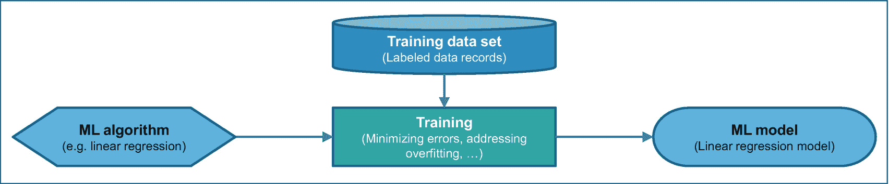
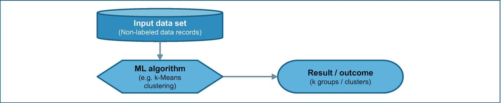
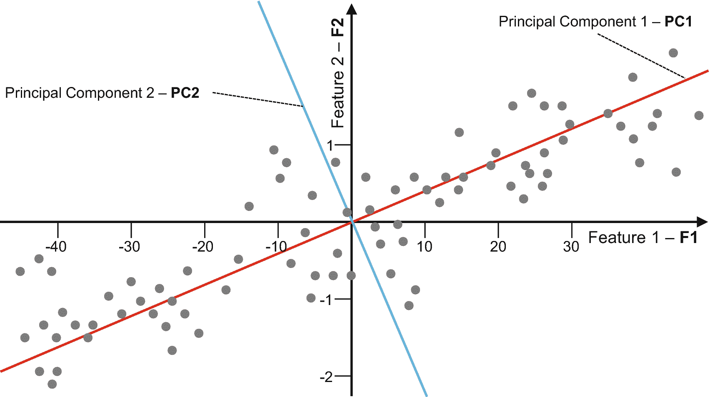
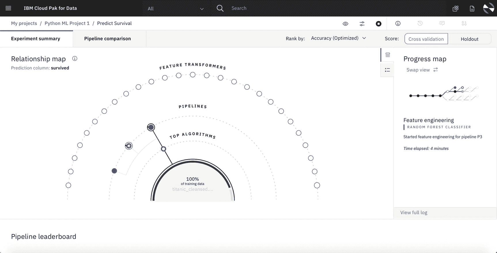
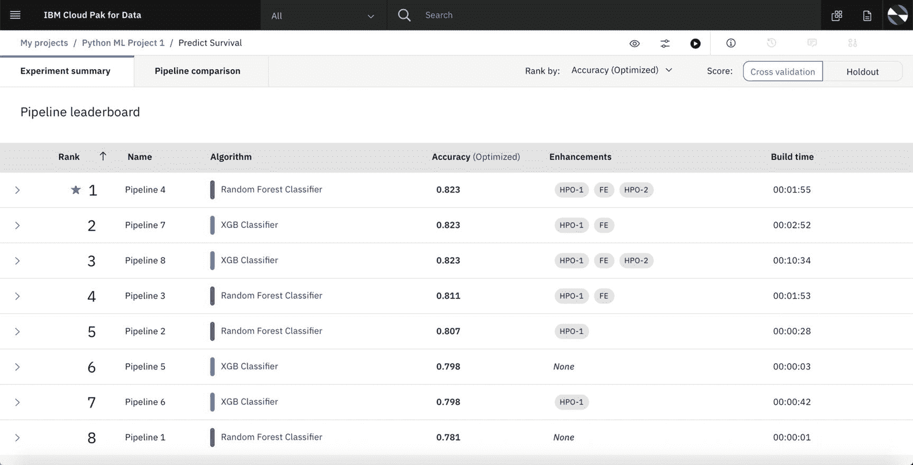
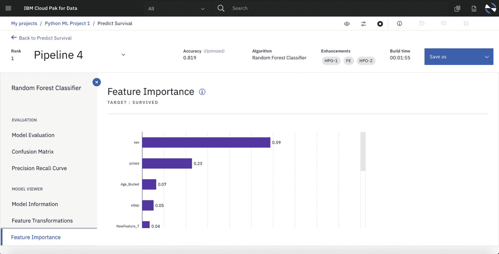
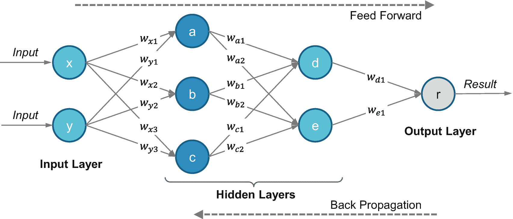

# 3.关键的 ML、DL 和 DO 概念

继上一章的人工智能发展之后，本章专门讨论机器学习(ML)、深度学习(DL)和决策优化(DO)的关键概念。我们不去探究这些概念的细节或这些领域背后的数学和统计科学；相反，我们正在讨论它们在企业或其他组织中的实际应用。它应该作为对这一领域知识有限的读者的高水平介绍。

## 机器学习

机器学习(ML)的人工智能学科建立了基于*数据*进行预测的方法，而不需要针对每个不同问题的确定性代码。ML 算法基于样本数据建立数学*模型*，用于训练这些模型。*机器学习(ML)是对通过经验自动改进的计算机算法的研究。它被视为人工智能的一个子集。机器学习算法基于样本数据建立数学模型，称为“* *训练数据* *”，以便在没有明确编程的情况下进行预测或决策。* [1](#Fn1)

该定义中最重要的语句是没有明确编程的*。与经典编程相反，ML 使计算机能够基于提供给 ML 算法的训练数据来生成和训练 ML 模型。有时候， *ML 算法*、 *ML 模型*、*训练、*和*训练数据*这些术语会有些混淆。因此，我们为您提供关于这些术语如何相互关联的简单描述:用训练数据训练 ML 算法生成 ML 模型。换句话说，ML 模型是使用 ML 算法和训练数据进行训练的结果。*

 *图 [3-1](#Fig1) 是这种关系的简单说明。这种观点对于预测 ML 模型尤其正确，例如回归模型，其中训练数据集被标记为数据记录。训练意味着使用标记的训练数据集最小化 ML 模型的误差，同时避免过程中的过拟合。过度拟合是指 ML 算法产生的模型过度适应训练数据集。这将导致相对于训练数据集的非常高的准确性，但是在使用具有新数据的模型时通常会导致较差的结果。本质上，在训练过程之后，ML 算法产生 ML 模型，只要避免过度拟合，该模型可以应用于新数据以预测结果。

表 3-1

关键要点

<colgroup><col class="tcol1 align-left"> <col class="tcol2 align-left"> <col class="tcol3 align-left"></colgroup> 
| 

#

 | 

关键外卖

 | 

高级描述

 |
| --- | --- | --- |
| one | 机器学习允许在没有显式编程的情况下训练模型 | 机器学习算法基于样本数据建立一个数学模型，称为“T2”训练数据，以便在没有明确编程的情况下进行预测或决策 |
| Two | 监督学习旨在预测 | 训练数据需要包括被识别为预测目标的期望输出；模型被训练来预测新输入数据的输出 |
| three | 无监督学习发现数据中的结构 | 针对相似数据的聚类来分析数据 |
| four | 人工神经网络可用于识别 | 模拟生物神经网络，人工神经网络可用于图像识别，语音识别，语言翻译，等等 |
| five | 决策树可用于预测类或值 | 决策树是基于输入变量构建的，目的是预测类别(分类决策树)或连续值(回归决策树) |
| six | 贝叶斯网络可以根据观察到的数据预测原因 | 例如，可以构建贝叶斯网络模型以预测引起所观察到的症状的疾病 |
| seven | DO 用于说明性分析 | 与侧重于将会发生什么的预测分析相反，决策优化(DO)侧重于确定决策/行动 |
| eight | DO 可以解决所有行业的复杂问题 | 优化问题通过约束、优化目标和输入数据来描述。DO 解决优化问题，允许做出最佳决策以采取最佳行动 |
| nine | ML 加 DO 提供了巨大的价值 | 通过结合 ML + DO，有可能从数据到预测到最佳决策和最终行动。相对于基于预测的强力操作，这可以节省大量成本 |

图 3-1

用标记数据集训练 ML 算法

然而，对于一些数据准备任务，我们不一定要生成 ML 模型。例如，为了降低数据空间的维度，从而降低其复杂性，可以使用一种叫做*主成分分析* (PCA)的降维算法。对于这种情况，PCA 算法被应用于输入数据空间，这产生具有降低的复杂性和维度的输出数据空间。另一个例子是 k-均值聚类算法，其被应用于输入数据集(例如，客户交易记录)以产生客户的 k 个组或聚类，例如，钻石、黄金和白银客户聚类。对于这些场景，没有可用和必需的标记数据。图 [3-2](#Fig2) 描述了这一概念。

图 3-2

最大似然算法在无标记输入数据集上的应用

正如你之前看到的，有不同类型的 ML(或 ML 类别)来解决不同的问题或业务领域。图 [3-1](#Fig1) 描述了我们称之为监督学习的特征，而图 [3-2](#Fig2) 描述了一个非监督学习的例子。除了各种类型的 ML 之外，还有不同的 ML 算法。

在本节的剩余部分，我们将向您介绍 ML 的主要类型和 ML 算法的类型。

### ML 的类型

以下是三种主要的 ML 类型:*监督学习*、*非监督学习*、*强化学习*。

*   **监督学习**关注于具有一组输入变量(预测器)和待预测目标变量的训练模型，其中训练过程持续进行，直到模型在训练数据上预测目标变量时达到一定的准确度和精确度水平。这需要已标记的训练数据集或恰好已经填充了目标属性的训练数据集。回归和分类是监督学习的关键领域。由监督学习实现的预测的例子是预测客户可能购买什么，机器何时可能出现故障，基于内容对图像或视频进行分类，等等。为了让监督学习算法工作，训练数据需要包括期望的输出。

*   **无监督学习**不涉及任何目标变量，不需要带标签的训练数据集；相反，它的目的是将数据点聚类成不同的组。聚类以及维数减少(例如，用于特征减少、结构发现等。)是无监督学习的关键领域。

*   **强化学习(RL)** [2](#Fn2) 是基于从试错中通过经验学习。强化学习是一个代理与环境交互，从执行特定任务的策略中学习，并根据其收到的奖励和惩罚随着时间的推移进一步改进和优化其行动。代理人根据其收到的奖励学习改进其行动。RL 是面向优化学习策略的。学习代理可以通过各种 RL 算法来实现，例如使用 *Q 学习*的无模型 RL，或者使用*马尔可夫决策过程* (MDP)的基于模型的 RL。 [3](#Fn3)

### ML 算法的类型

存在相当多的 ML 算法，可以根据要实现的用例或要执行的数据科学任务来应用这些算法。这些最大似然算法可以分为以下类型的最大似然算法:

*   回归和分类

*   使聚集

*   决策树

*   贝叶斯定理的

*   降维

*   人工神经网络

*   全体

*   正规化

*   规则系统

*   基于实例

我们不打算描述所有这些类型的 ML 算法；然而，我们将向您介绍本书上下文中最相关的一小部分。人工神经网络将在下文中有关 DL 的章节中详细介绍。

#### 回归和分类

当预测离散值时，使用回归模型。业务示例包括股票价格预测、批处理作业耗时预测、天气温度预测或医疗诊断分析环境中的预期寿命预测。

*线性回归*是最常见的回归分析形式，其中根据数学标准(如普通最小二乘法)绘制一条线来最佳拟合数据。其他形式的回归分析有*逻辑回归*、*多项式回归*、*逐步回归*等等。

分类算法 [4](#Fn4) 用于预测类别，该类别可以是两类(二元)或多类类别。业务示例包括欺诈检测(欺诈与非欺诈)、垃圾邮件检测(垃圾邮件与非垃圾邮件)、客户流失预测(客户流失与非客户流失)或客户分类(钻石与黄金和白银)。其他示例包括药物(医疗)、对象(自动驾驶车辆)、贷款申请等的分类。

有相当多的 ML 算法，可以用于分类应用，如*逻辑回归*、 *k 近邻*、*决策树、支持向量机* (SVMs)等。

*支持向量机* (SVMs)使用被标记为属于两个类别之一的示例来训练，以便得到的模型可以预测新示例是属于一个类别还是另一个类别。

#### 决策树

*决策树*可以作为预测模型，其中对分支中表示的项目的观察导致对树叶中表示的目标值的结论。决策树可用于回归和分类任务。

如前所述，当输出是离散类时使用分类树，当预测结果被认为是实数时使用回归树。像 *boosted trees* 这样的集成方法构建了不止一个决策树。构造决策树的算法通常自上而下地工作，在每一步选择一个变量来最好地分割项目。

*随机森林*是决策树的一个例子，决策树是一种可用于分类、回归或其他任务的集成训练方法，其中在训练期间，构建许多决策树，并组合输出以确定输出类别或值。当模型过度适应训练数据集时，随机森林相对于单个决策树有助于改进。

#### 使聚集

聚类算法的目标是将数据分组为簇，以便更好地组织数据。聚类的一个重要方面是没有标记可用的数据点。因此，聚类属于无监督类型的 ML。评估结果的正确性取决于业务环境，这可能导致重复执行聚类算法，直到找到满意的业务结果(聚类集)。业务示例是根据客户的购买行为、信用卡使用模式、与旅行相关的偏好等对客户进行聚类(客户细分)。

有相当多的聚类算法，如 *k-means* ，k *- medians* ，*层次聚类*，以及*期望最大化*。

#### 贝叶斯定理的

*贝叶斯* *网络*是一种算法，它通过有向无环图来表示一组变量及其条件依赖关系。贝叶斯网络非常适合预测事件发生的原因，例如，根据观察到的症状预测疾病。贝叶斯算法的其他例子有*朴素贝叶斯分类器*、*高斯朴素贝叶斯*、*贝叶斯信任网络* (BNN)等等。

#### 降维

AI 和机器学习不仅仅是开发 AI 模型或聚类数据。在能够开发任何种类的人工智能工件之前，需要理解可用的源数据；数据的复杂性需要简化；需要通过例如省略对减少误差没有贡献的特征或预测器来选择和转换特征；并且由于某些特征之间存在相关性，特征空间的维度可能不得不降低。降维涉及特征的选择和表示，以优化和简化分类器的开发。

由于在数据科学中的重要性，降维 [6](#Fn6) 仍然是一个热门的研究领域。如今已经有相当多的算法可供选择，比如*线性判别分析*(LDA)*偏最小二乘回归*(PLSR)*混合判别分析*(MDA)*灵活判别分析*(FDA)*主成分分析* (PCA)，不一而足。

例如，PCA， [7](#Fn7) 是一种算法——通常称为技术或方法——用于将一大组可能相关的分量或维度(预测值、特征)减少到一组不相关(或不太相关)的维度，可能但不一定是更少的维度，称为主分量。这些维度彼此正交(线性独立)，并根据这些维度上的数据方差进行排序。目标是沿着一组新的主成分从数据点中提取最相关的信息，以容易地描述数据变化的原因。

图 3-3

主成分分析

如图 [3-3](#Fig3) 所示，两个主分量 PC1 和 PC2 是新的维度，它们相互正交。它们是由原始特征 F1 和 F2 的线性组合得到的。PC1 和 PC2 以这样的方式确定，即方差 *var* ( *PC* 1)和*var*(*PC*2)——分别测量沿着 PC1 和 PC2 的数据点与平均值的偏差——沿着新的维度用*var*(*PC*1)>var(*PC*2)最大化。协方差 *cov* ( *PC* 1， *PC* 2)被带入等式，以理解沿着新维度的值之间的关系。

下面是另一个例子，其中原始的三维特征空间可以简化为二维主成分空间:设想一组分布在三维空间中的数据点，其中数据点在二维平面上是近似可定位的。如果应用 PCA 来创建代表该平面的两个主分量 PC1 和 PC2(当然，彼此正交)，则第三个主分量 PC3 可能具有如此低的方差 *var* ( *PC* 3)，以至于可以简单地将其忽略。随后，您将原来的三维空间缩减为二维空间，现在可以简化基于这个“新”特征空间的 AI 模型开发。

作为 PCA 算法的结果，相关特征的复杂性和数量可以减少。然而，这可能会带来后续开发的人工智能模型的可解释性较差的缺点。

### 汽车人工智能

机器学习中一个相对较新的概念是 Auto AI 或 Auto ML，其目标是自动创建机器学习管道，并自动对产生的模型进行排序，以帮助数据科学家更快地找到好的模型。

图 3-4

自动人工智能使用多个训练管道训练一组模型

原则上，没有数据科学技能的用户也可能使用 Auto AI 来建立模型。然而，最终需要基于数据科学和主题专家技能的专家判断，以评估自动创建的模型是否满足特定用例的要求，以及在给定的业务环境中哪个模型在实践中是最适合使用的。

图 [3-4](#Fig4) 中显示了一个自动人工智能的例子，基于 IBM Watson Studio 中的自动人工智能功能，该功能运行在 IBM Cloud Pak for Data 上。该图显示了以下信息的可视化效果:

*   自动人工智能选择的算法

*   应用这些算法创建的管道

*   特定管道使用的特征转换

图 [3-5](#Fig5) 中的以下管道排行榜显示了基于所选指标(在本例中为精确度)的最佳模型。

图 3-5

汽车人工智能生成的模型训练管道的领先板

然后，可以钻取生成的模型的各种指标，以探索哪个管道具有最佳的总体结果，并了解哪些特征对预测影响最大，例如，在这种情况下，模型使用包含泰坦尼克号乘客以及幸存者或未幸存者信息的公共数据集进行训练，最重要的特征是乘客的性别，如图 [3-6](#Fig6) 所示。

图 3-6

汽车人工智能的特征重要性分析有助于理解模型

### 走向人工智能模式的卓越

在选择要使用的模型时，技术模型评估指标(如准确性、混淆矩阵、精确召回率等)是一个需要考虑的重要因素。

但是，可能会有一系列的业务考虑因素和适用法律最终会排除某些方法、某些功能的使用，或者可能要求故意不选择具有最佳技术评估指标的模型。

例如，在贷款决策模型中，使用个人的性别或显著相关的值作为影响贷款是否被批准的特征是不可接受的。根据可解释性或性能要求，可能需要选择更简单的模型，而不是原则上给出更好结果但不太可解释或计算时间太长的模型。根据假阳性的影响，可能必须选择总体不太准确的模型来最小化假阳性预测的数量，例如，在信用卡欺诈检查中，任何假阳性都会导致巨大的客户挫折，因为他们想要支付合法的东西，但它不起作用。

## 深度学习

在 DL [8](#Fn8) 上写了无数的书、文章和博客。然而，您可能仍然想知道 ML、DL 和 RL 之间的区别以及它们之间的相互关系。在本书中，我们没有足够的篇幅来详细介绍 DL 主题。我们不是描述理论和数学基础，而是让你更好地理解数字逻辑的关键特征，以及数字逻辑与数学逻辑和逻辑逻辑的区别和一致性。

### DL 是什么？

一方面，DL 可以被视为 ML 的子集，因为它通过专注于人工神经网络(ann)来提供真正可扩展的 ML，正如我们之前看到的那样，人工神经网络是一种特殊类型的 ML 算法。*真正可扩展的* ML 解决方案的实施依赖于专用引擎，如 GPU、FPGAs 或 ASICs。此外，类似于我们在本章开始时讨论的 ML 的类型，DL 可以被分类为有监督的、无监督的和强化学习。

另一方面，DL 可以被视为 ML 的进化，专注于不同的算法，允许真正意义上的学习，意味着有和没有标记的数据集的*。使用 ML，我们可以训练和重新训练 ML 模型，以确保预定义场景的准确性和精度保持在一定水平，而使用 DL，模型可以“自己”学习，随着时间的推移变得更加独特和准确，而无需手动或基于工具的重新训练。例如，DL 可以基于监督特征学习，利用监督神经网络或监督字典学习，其中可以执行初始训练。然而，关于决策过程的相关性和精确性的后续增加可以由 ML 模型本身完成——基于新的数据——而不需要人工或基于工具的干预。因此，DL 能力处于不同的水平，并且真正地模仿人类行为。*

RL 和 DL 之间的区别有时会让人混淆。正如我们在本章开始时讨论各种类型的 ML 时所看到的，RL 是关于通过奖励和惩罚来学习一项政策。但是当数据维数相当大时，RL 可能是有挑战性的和麻烦的。这可以通过深度强化学习(DRL)来有效解决，其中 RL 算法与 ann 或 DL 算法相结合。

现在让我们对人工神经网络和深度学习网络(DLNs)进行一些了解，并为您澄清为什么我们将它们分为不同类型的神经网络。

### 人工神经网络

ann 是第一个相对简单的神经网络，它松散地模拟了生物大脑中的神经元。人工神经元具有带权重的输入连接和输出连接，并且可以具有阈值，使得它们仅在超过该阈值时才发送输出信号。人工神经网络通常由输入层、隐藏层和输出层组成。人工神经网络能够学习各种非线性函数。在这个学习过程中，通过减少或最小化所谓的损失函数来调整连接上的权重。损失函数可以被视为使用 ANN 或 DLN 算法来训练这些神经网络的组成部分。

图 3-7

人工神经网络

当我们使用术语 *ANN 或 DLN 算法*时，我们指的是用于训练神经网络的算法。在某种程度上，我们可以将经过训练的 ANN 或 DLN 称为 DL 模型(与我们的术语保持一致)。*反向传播*可能是最流行的人工神经网络算法，它实际上由一组用于反向传播的训练算法组成。其他的 ANN 算法有*径向基函数网络* (RBFN)、 *Hopfield 网络*、*多层感知器* (MLP)、*随机梯度下降*等等。

图 [3-7](#Fig7) 描述了一个简单的前馈人工神经网络，具有输入层、两个隐藏层和输出层。隐藏层通常由几个节点组成。在我们的示例中，第一层由节点 a、b 和 c 组成，而第二层由节点 d 和 e 组成。前馈指的是从输入层到输出层的信息单向流动。可以使用各种反向传播算法(例如随机梯度下降)来训练 ANN，这意味着调整各种权重*w*T5】ij，如图 [3-7](#Fig7) 所示。

人工神经网络的应用包括计算机视觉、语音识别和机器翻译。*深度学习*采用具有多个隐藏层的人工神经网络。

### 深度学习网络

人工神经网络可以被看作是原始的、经典类型的神经网络，它是直截了当和相对简单的。相应的人工神经网络算法不太复杂。正如我们所提到的，训练人工神经网络基本上是基于应用各种反向传播算法。对于今天要求高的人工智能应用，需要具有潜在大量隐藏层的更复杂的人工神经网络。然而，对于那些复杂的 ann，需要调整的权重 *w* *ij* 的数量变得不可估量的大。另一个问题是所谓的*消失和爆炸梯度*，这使得人工神经网络不稳定，学习能力较差。这与损失函数有关，该函数计算的梯度太大，因此不适于充分调整权重 *w* *ij* 。这种现象甚至会变得如此普遍，以至于人工神经网络不再是可训练的，因此不再可用。

有几种技术可以解决这个问题，如权重正则化或梯度裁剪。然而，更多最先进的神经网络已经出现，它们提供了新的和更具创新性的方法来处理前面的问题，我们称之为深度学习网络(DLNs)。DLNs 和相应的 DL 算法关注于开发和有效地训练更大和更复杂的神经网络，这些神经网络可以处理更大容量的数据，并适合于今天具有挑战性的人工智能应用。

一些最流行的 dln[9](#Fn9)有*递归神经网络*(RNNs)*卷积神经网络*(CNN)*深度信念网络* (DBNs)，深度玻尔兹曼机器(DBMs)等等。rnn 具有从单个节点到其自身的循环连接，该连接将结果链接到输入数据。CNN[10](#Fn10)主要用于图像处理，也用于分类和分割。他们利用内核和过滤器来训练神经网络。核就像一个 n 维的权重矩阵，它被重复应用于输入数据。过滤器是几个内核的串联，其中每个内核被分配给输入数据的一个子集(通道)。

这些 dln 的出现和进一步的发展和研究，以及它们代表了人工智能中一个独特的领域的事实，使我们看到 DL 不完全是 ML 的子集。

## 决策优化

决策优化 [11](#Fn11) 是用于规范分析的数据科学技术的子集。与旨在预测将发生什么的预测性分析相比，规定性分析有助于决定采取什么行动。

DO 分析可能的选择，并从大量备选方案中提供最佳选项。例如，您不知道客户是否会退订(客户流失)或某项工业资产何时可能会失败，但您可以决定是否向您的客户提供特定的促销或决定为您的资产运行维护计划。这些决定在你的控制之下。然而，它们受到业务约束的限制，例如，最大促销预算或维护人员规模。在所有可能的决策中，有些是基于您想要优化的目标的首选决策。DO 规定了在这种情况下你该做什么决定。

在第 [5](05.html) 、*从数据到预测再到最佳行动*章节中，我们深入探讨了 ML 与 DOT5】12的集成，以及将这两个领域结合起来所能实现的整体效益。

DO 几乎适用于所有行业。示例应用包括众所周知的用例，如供应链和生产计划和调度的优化，以及投资组合优化、预测性维护、电力单位承诺，甚至更令人惊讶的应用，如价格优化或货架空间优化。

## 关键要点

我们总结了本章的一些要点，总结在表 [3-1](#Tab1) 中。

## 参考

1.  维基百科。*机器学习*、[`https://en.wikipedia.org/wiki/Machine_learning`](https://en.wikipedia.org/wiki/Machine_learning)*(2020 年 4 月 25 日访问)。*

2.  理解机器学习:从理论到算法。ISBN-13: 978-1107057135，剑桥大学出版社，2014 年。

3.  Alpaydin，E. *机器学习介绍(自适应计算和机器学习系列*)。ISBN-13: 978-0262043793，麻省理工学院出版社，2020 年

4.  萨顿，R. S .，巴尔托，A. G. *强化学习:导论(自适应计算和机器学习系列)*。ISBN-13: 978-0262039246，布拉德福德图书，2018 年。

5.  莫尼河中等。*强化学习算法——直观概述*、[`https://medium.com/@SmartLabAI/reinforcement-learning-algorithms-an-intuitive-overview-904e2dff5bbc`](https://medium.com/%2540SmartLabAI/reinforcement-learning-algorithms-an-intuitive-overview-904e2dff5bbc)(2020 年 4 月 30 日访问)。

6.  Priyadarshiny。*分类算法介绍*，[`https://dzone.com/articles/introduction-to-classification-algorithms`](https://dzone.com/articles/introduction-to-classification-algorithms)(2020 年 4 月 29 日访问)。

7.  霍奇森。*聚类算法:哪种算法适合您的业务？*[`www.dotactiv.com/blog/clustering-algorithms`](http://www.dotactiv.com/blog/clustering-algorithms)(2020 年 4 月 29 日访问)。

8.  Silipo，r .，Widmann，M. *机器学习中数据降维的 3 种新技术*，[`https://thenewstack.io/3-new-techniques-for-data-dimensionality-reduction-in-machine-learning/`](https://thenewstack.io/3-new-techniques-for-data-dimensionality-reduction-in-machine-learning/)(2020 年 4 月 30 日访问)。

9.  Vidal，r .，Ma，y .，Sastry，S. *广义主成分分析(跨学科应用数学)*。ISBN-13: 978-0387878102，施普林格，2016。

10.  Skansi，S. *深度学习简介:从逻辑演算到人工智能(计算机科学本科专题)*。ISBN-13: 978-3319730035，施普林格，2018。

11.  Gad，A. F .，*使用深度学习和 CNN 的实际计算机视觉应用:使用 TensorFlow 和 Kivy 的 Python 中的详细示例*。ISBN-13: 978-1484241660，Apress，2018。

12.  中号古普塔河。*走向数据科学。6 种深度学习模型——什么时候应该使用它们？*[`https://towardsdatascience.com/6-deep-learning-models-10d20afec175`](https://towardsdatascience.com/6-deep-learning-models-10d20afec175)(2020 年 5 月 1 日访问)。

13.  Khan，s .，Rahmani，h .，Shah，S. A. A .，Bennamoun，M. A *计算机视觉卷积神经网络指南(计算机视觉综合讲座)*。ISBN-13: 978-1681730219，摩根&克莱普出版社，2018。

14.  IBM。*决策优化*，[`www.ibm.com/analytics/decision-optimization`](http://www.ibm.com/analytics/decision-optimization)(2020 年 4 月 29 日访问)。

15.  夏布利埃葡萄酒，中等。*将机器学习和决策优化结合在云 Pak 进行数据*、[`https://medium.com/@AlainChabrier/combine-machine-learning-and-decision-optimization-in-cloud-pak-for-data-60e47de18853`](https://medium.com/%2540AlainChabrier/combine-machine-learning-and-decision-optimization-in-cloud-pak-for-data-60e47de18853)(2020 年 5 月 1 日接入)。

<aside aria-label="Footnotes" class="FootnoteSection" epub:type="footnotes">Footnotes [1](#Fn1_source)

参见[1]对 ML 的简要概述，以及[2]和[3]对 ML 更全面的论述。

  [2](#Fn2_source)

参见[4]对强化学习的介绍。

  [3](#Fn3_source)

有关各种 RL 算法的简要概述，请参见[5]。

  [4](#Fn4_source)

分类算法简介见[6]。

  [5](#Fn5_source)

有关聚类算法的简短介绍，请参见[7]。

  [6](#Fn6_source)

关于降维的简要概述，参见[8]。

  [7](#Fn7_source)

参见[9]对主成分分析(PCA)的综合和理论处理，包括数学背景。

  [8](#Fn8_source)

参见[10]中对 DL 的深入探讨，以及[11]中更实用的 DL 指南。

  [9](#Fn9_source)

参见[12]对一些最流行的 dln 的高级概述。

  [10](#Fn10_source)

参见[13]对 CNN 的深入研究。

  [11](#Fn11_source)

有关决策优化的简要概述，请参见[14]。

  [12](#Fn12_source)

参见[15]对 ML 与 DO 集成的简要概述。

 </aside>*