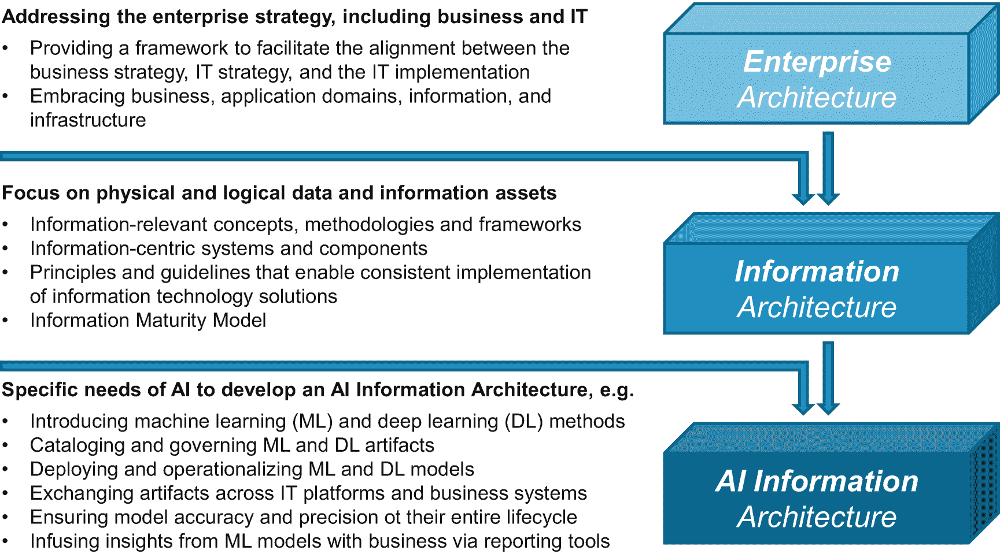
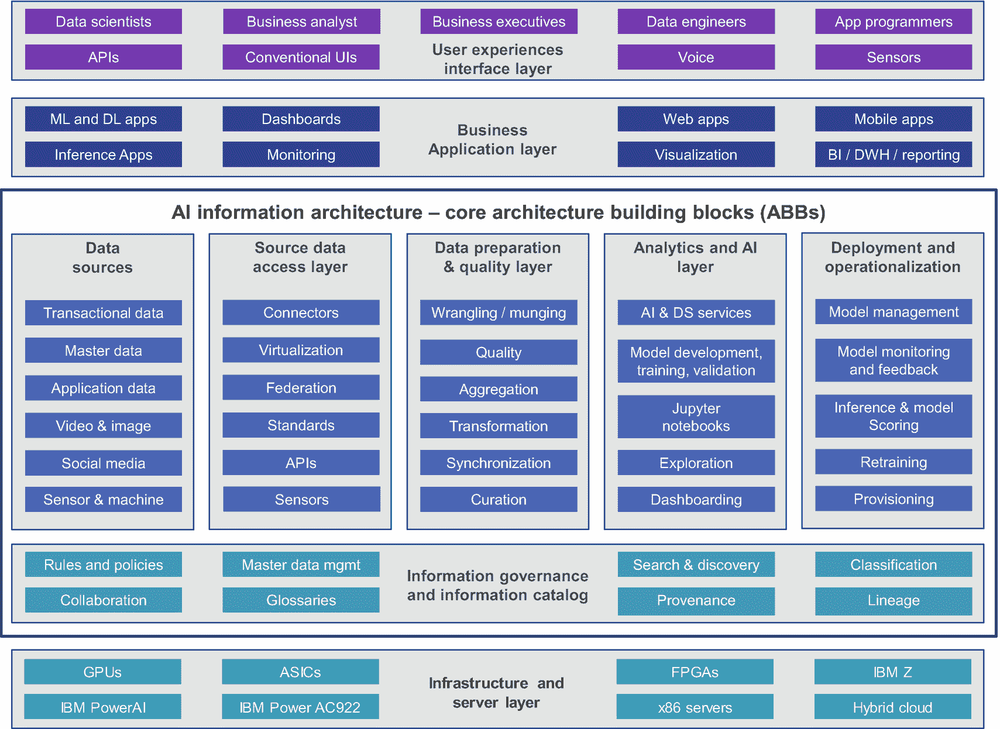
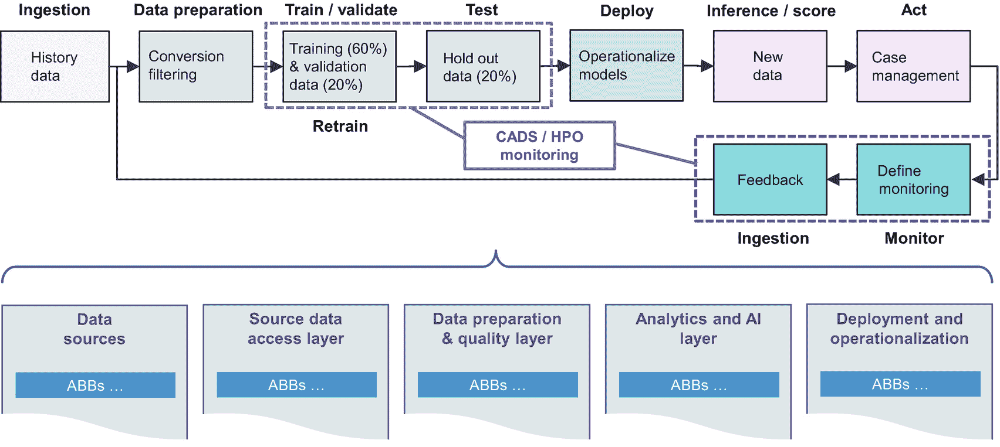
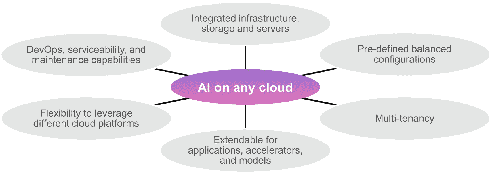
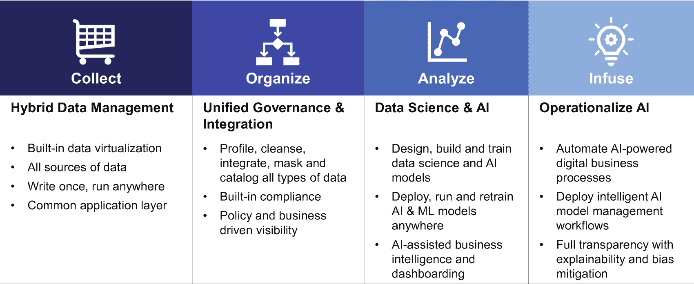
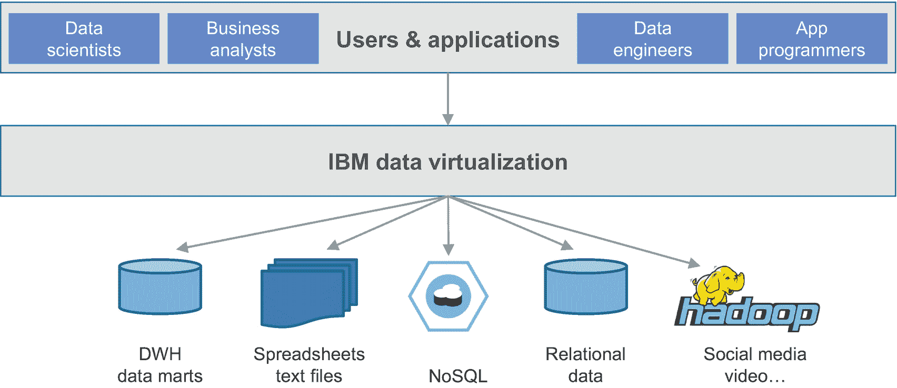
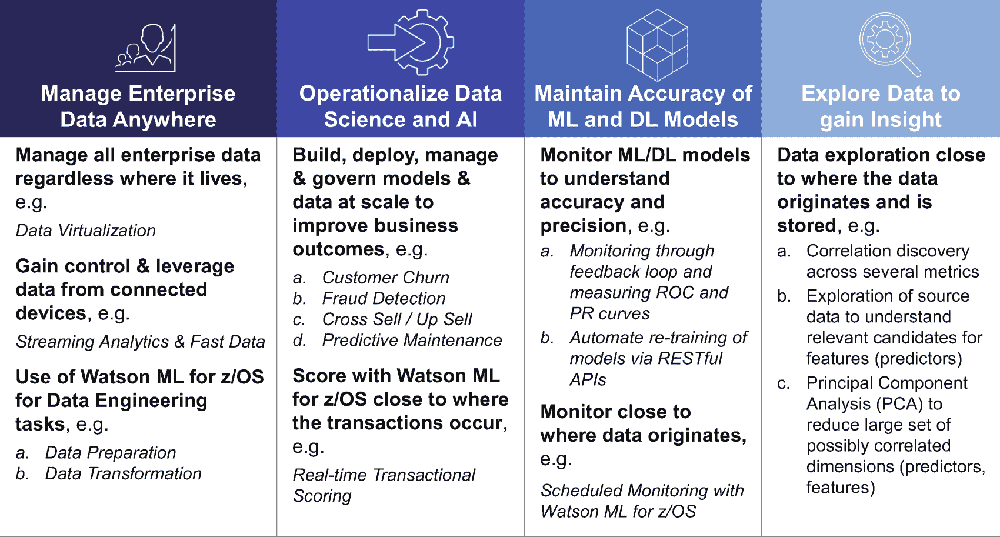

# 4.人工智能信息架构

在本章中，您将了解信息架构(IA)在提供可信的企业级人工智能基础方面的具体作用。作为对这个主题的介绍，我们简要回顾了信息架构(IA)的关键方面，并强调了 AI 环境中的逻辑和物理 IA 组件。这些对读者来说很重要，以便充分理解 AI 对现有信息架构的影响。任何架构都需要以产品和服务为基础。我们学习人工智能信息架构的关键组成部分及其在企业适应性中的作用。我们以说明信息架构中的人工智能的用例来结束。

在 IBM，我们已经通过下载和使用一些免费的开源包和库，例如 Apache Spark 库，帮助我们的一些客户开始了他们的人工智能之旅。需要有企业范围的指导方针；否则，这可能导致企业内不同的部门或组织使用不同的开源库。由于这些包和库不是集成的和可互操作的，AI 工件，即 ML 或 DL 模型，具有不同的格式，并且不容易跨组织和不同平台进行交换和部署。任何人工智能的努力都不仅仅需要下载一些免费的开源 ML 或 DL 库和运行时引擎。您应该采取一种整体的、企业范围的方法，并为协作、集成、专用引擎、开源、企业范围的产品等进行规划。

此外，每个部门或组织都在努力访问和转换所需的源数据，以便在特定的应用程序或用例环境中充分使用。我们将在第 [8](08.html) 、“*人工智能和治理*”章节中讨论对人工智能产品的访问和使用的治理，这同样留给了各个部门和组织。因此，缺乏企业范围的信息架构确实经常导致整个企业中不一致且笨拙的影子 IT 实现。

其他组织可能通过部署商业可用的 AI 工具集来开始他们的 AI 之旅，即 ML 或 DL 产品，如 IBM Watson Machine Learning(ML for z/OS ),它由数十甚至数百个库和算法、一些运行时引擎以及存储和管理 AI 工件的组件组成。然而，源数据发现和提供给具有所需数据质量的 AI 工具集仍然是一项具有挑战性的工作。让您的员工接受培训并习惯这样的工具堆栈是另一个挑战。源数据到所需数据和特征格式的访问和转换通常是不完整的或者根本没有。后续的数据同步和组织任务以及数据隐私和保护需求往往不在 AI 工具的范围之内。此外，将这些人工智能工具集成到现有的 IT 和业务环境中会伴随着不可预见的组织和技术障碍，通常会将人工智能项目变成令人沮丧的体验。因此，缺乏企业范围的信息架构确实导致了支离破碎的人工智能基础设施，使企业规模的人工智能项目和用例具有挑战性和风险性。

没有 IA 就没有 AI[1](#Fn1)听起来可能又是一个热门短语。然而，这一章提供了进一步的理由，说明当你在人工智能的阶梯上向上移动时，应该充分投资于你的人工智能。

## 信息架构——简短回顾

由于信息密集型业务挑战已经存在了几十年，因此有大量与信息架构 [2](#Fn2) 相关的知识和出版物。本节简要回顾了术语信息架构和企业信息架构(EIA ),并定义了最重要的方面，如企业架构层、参考架构(RA)的概念以及 EIA 参考架构工作产品。此外，我们还提供了对关键架构模型和方法的简短回顾，例如信息成熟度模型。这篇简短的回顾是一般性的，应该能使读者理解术语和概念，我们将在本章的后续部分详细阐述。 [3](#Fn3)

### 术语和定义

我们从企业架构的定义开始我们的回顾，因为这提供了定位术语 IA 和 EIA 的方法。开放集团架构框架(TOGAF)， [4](#Fn4) 一个开放集团的标准，是最全面的企业架构方法论和框架之一 [5](#Fn5) 。根据 TOGAF 标准，企业架构"*的目标是在整个企业中优化通常是分散的遗留流程(包括手动和自动的)到一个集成的环境中，该环境响应变化并支持业务策略的交付。*“企业架构提供了一个框架来促进业务策略、IT 策略和 IT 实现之间的一致性。因此，它包含了解决企业战略、业务和应用程序领域的需求、信息(或数据)领域以及基础设施的各个领域。

以下是 TOGAF 的部分架构:

*   业务架构

*   数据架构

*   应用架构

*   技术架构

根据 TOGAF 的说法，数据架构"*描述了组织的逻辑和物理数据资产以及数据管理资源的结构。*“为了我们的目的和本书的范围来揭开人工智能的神秘面纱，信息架构提供了基础的信息相关概念、方法和框架，以保证业务从其信息层所需的响应能力和可信的信息洞察力。信息体系结构拓宽和扩展了数据体系结构，利用了 IT 环境中以信息为中心的系统和组件，并定义了它与业务目标的关系。

此外，信息架构还描述了支持信息技术解决方案一致实施的原则和指南，如何在整个企业中管理和共享数据和信息，以及需要做些什么来获得与业务相关的可信信息洞察力。我们将在第 8 章、 *AI 和治理*中回到这个特定的方面

以下是指导信息体系结构的核心原则的一些示例:

*   **访问和信息流动**:信息服务应该在适当的时间向适当的用户提供不受限制的访问，并提供促进所需信息流动的手段。

*   服务重用:促进信息相关服务的发现、选择和重用，并且——只要有可能——鼓励使用统一的接口。

*   **信息治理**:充分的信息架构和相应的信息技术应该支持信息治理策略的有效执行。

*   **标准**:应该定义一套一致的数据和技术标准，以促进整个信息基础设施的简化。

企业信息架构(EIA)是一个框架，它定义了支撑企业架构的以信息为中心的原则、架构模型、标准、方法和过程。EIA 处理整个企业和相关业务组织的信息技术决策。因此，EIA 将业务需求转化为信息策略，并处理整个信息供应链，从可用的和必需的数据组件到由业务应用程序消费的派生洞察。在 EIA 术语中使用“*企业*”将企业范围的业务上下文添加到本节描述的信息架构的定义中。

在我们详细阐述 IA 方法和模型之前，让我们先介绍一下术语参考架构 [6](#Fn6) 。参考架构(RA)是一种企业架构，可以解决特定领域、行业或主题的特定需求，例如逻辑数据仓库(DWH)、汽车行业或人工智能。它基于企业架构框架的原则，但经过调整以适应该领域、行业或主题的特定需求。因此，我们称之为人工智能参考架构(AIRA)，或企业信息架构参考架构(EIARA)。理想情况下，任何 RA 都应该基于大量具体的客户约定和解决方案部署。它应该以从这些项目和部署中获得的最佳实践为基础。在下面的章节中，我们将描述人工智能的信息架构的关键方面，我们可以称之为人工智能信息参考架构(AIIRA)或更简单的人工智能信息架构(AIIA)。

### 方法和模型

在过去的几十年中，已经开发了许多企业架构方法。在这个简短的介绍中，我们继续关注 TOGAF。TOGAF 的架构开发方法(ADM) [7](#Fn7) 由各种开发架构的方法组成。一种方法是信息系统架构——数据架构 ADM " *,它支持业务架构和架构愿景，同时解决架构工作和涉众关注的请求*它详细描述了企业架构开发周期，包括它的迭代方法、所需的调整，以及与企业架构的特定范围和架构资产相关的要解决的决策。

有许多可用的企业和信息架构指导方针和原则、架构风格和模式、最佳实践和模型，它们或者具有更一般的性质，或者包含在与特定行业(保险、汽车等)相关的参考架构中。)或域(逻辑 DWH、人工智能等。).在这篇简短的回顾中，我们简要阐述了 IA 信息成熟度模型。在本章的后续章节中，我们将这个信息成熟度模型与特定的人工智能领域联系起来。

信息成熟度模型是一种模型或技术，用于评估信息架构的成熟度以及将数据和信息转换为业务相关洞察力的成熟度。它可以被视为开发 IA 的一种技术或一组必要条件，可以解决以下问题:

1.  **减少访问信息所需的时间**:及时访问和提供数据和信息给消费业务系统和应用程序。

2.  **降低信息复杂性**:解决从结构化(如关系型)到非结构化(如文本、社交媒体、视频)的数据格式的多样性、复杂性和多样性。

3.  **通过优化的基础设施降低成本**:通过简化的基础设施降低成本，该基础设施能够根据不断变化的业务需求和频繁发生的中断进行灵活调整。

4.  **通过分析和发现获得洞察力**:能够发现、分析并加速推理和洞察是所有业务线组织的一项关键需求。

5.  **利用信息进行业务转型**:不断注入数据和信息以促进业务转型，并实现新兴业务用例场景。

6.  **获得对主数据的控制**:通过适当的企业 MDM 系统 [8](#Fn8) 管理主数据(如客户、业务伙伴、员工、产品和服务)和参考数据。

7.  **通过单一版本的真相管理风险和合规性**:解决日益增多的业务法规的合规性问题，并进一步了解和降低风险。

如前所述，我们的未决任务是调整和映射前面的领域(和类似的领域)到人工智能的特定需求，以开发一个人工智能信息架构。

## 人工智能的企业适用性

在前面的章节中，我们简要回顾了企业和信息架构的关键概念。本节描述了在人工智能背景下，IA 的适用性和含义。我们阐述了人工智能的影响因素，这些因素推动了对全面人工智能信息架构的需求。

### 人工智能信息架构的相关性

随着各组织正在制定自己的人工智能战略，并越来越多地使用人工智能、机器学习和深度学习，调整和改善现有人工智能的需求变得显而易见。正如您在第 [1](01.html) 、 *AI 简介*中所看到的，数据和信息的新用例及使用模式正在出现，新的工件(如分析模型)将被开发出来。

此外，必须实施跨各种组织的各种角色和职责的创新和高效的协作模式。业务用户、数据科学家、数据工程师和 IT 操作专家必须有效地协作，以便交换和管理新类型的工件；提供数据并将其转化为新的消费模式；介绍 ML 和 DL 模型开发、学习、部署和管理的新组件；并且部署和操作例如 ML 和 DL 模型以及诸如实时交易评分或实时客户分类的新型应用。

表 [4-1](#Tab1) 概述了人工智能信息架构的相关性，并列出了驱动人工智能信息架构的必要条件和需求。这个列表可能不完整，也没有按照优先顺序排列。显然，在一些迫切需要和需求之间有一些重叠和关联。

表 4-1

人工智能信息架构的必要性和需求

<colgroup><col class="tcol1 align-left"> <col class="tcol2 align-left"> <col class="tcol3 align-left"></colgroup> 
| 

#

 | 

必要的

 | 

高级描述

 |
| --- | --- | --- |
| one | 新出现的使用案例 | 正如在第 [1](01.html) 、*人工智能简介*中所描述的，许多用例以及新兴的业务领域，例如驾驶辅助系统和自动驾驶，管理从现有的基于规则的欺诈发现系统到使用 DL 和 ML 的范式转变，集成自然语言处理(NLP)以改善人机交互，等等，正在推动人工智能信息架构的发展 |
| Two | 数据和信息的新使用模式 | 对于人工智能相关的场景，数据和信息需要以新的方式进行处理、供应和治理。处理可能需要标记数据或发现数百个数据组件之间的相关性。资源调配可能需要转换和集成交易数据和其他预测数据，以实现实时或低延迟评分。治理 [9](#Fn9) 可能需要调整，例如，处理新的 ML 和 DL 相关的工件 |
| three | 容纳新的工件和标准 | AI 需要开发、集成和管理新的工件，例如 ML 和 DL 模型、Jupyter 笔记本、元数据等等。需要考虑新的标准，例如开放神经网络交换(ONNX)格式 [10](#Fn10) 和现有的预测模型标记语言(PMML)标准 [11](#Fn11) |
| four | 创新和高效的协作需求 | 人工智能创造了跨各种用户角色和职责的协作需求，例如业务分析师、业务用户和应用程序开发人员、数据科学家、数据工程师以及开发人员和 IT 运营专家。这涉及到促进需求陈述、资源、新工件和 DevOps 场景的交换和管理的创新技术 |
| five | 洞察力的新消费模式 | 人工智能方法产生了获得洞察力的新方法，这要求人工智能信息架构支持新的洞察力消费模式和推理技术及能力。例如，ML 和 DL 模型不是静态的:ML 模型可以被重新训练以保持一定程度的准确性和精确性，DL 模型可以被学习以不断改进和验证洞察力的相关性。人工智能信息架构需要支持对 ML 和 DL 模型的监控、再培训和持续学习 |
| six | 分布式开发和部署模式 | 前面的用户角色和职责可以在不同的平台上执行，例如基于开源 Hadoop 的数据湖(例如，HDP 的 Hortonworks)、分布式或 IBM Z(大型机系统)以及私有、公共或混合云环境。源数据可能来自并驻留在不同的平台上。随后，需要允许在一个平台上开发、培训、测试和验证 ML 和 DL 模型，并促进部署和操作，包括在不同平台上评分。人工智能信息架构需要允许所有任务在这些平台上无缝分布 |
| seven | 部署和运作方面 | 今天，人工智能操作化 [12](#Fn12) 挑战代表了许多组织的巨大痛点。例如，提供实时决策和评分的需求要求及时进行数据供应和准备，这可能包括访问、汇编和准备驻留在各种源系统中的数据 |
| eight | 集成专用引擎和加速器 | 专业引擎，如图形处理单元(GPU)、专用集成电路(ASIC)引擎，或针对人工智能使用进行优化的系统，如 IBM PowerAI 系统 [13](#Fn13) ，必须集成到 it 环境中，这需要调整现有的人工智能 |
| nine | 满足不同的数据访问和转换需求 | 根据使用情形，可能需要实时捕获和处理来自新来源或设备的新数据(例如，传感器数据、语音数据等。).即使是现有的源数据，如金融交易记录，也必须实时访问并为评分做好准备 |
| Ten | 轻松的数据搜索和数据探索能力 | 特别是，识别数据中的新模式或发现不同 KPI 或源数据点(例如，呼叫中心语音数据和特定客户的交易数据)之间的相关性的数据探索是一项基本任务，例如，识别 ML 模型开发的相关特征或预测。人工智能信息架构需要促进简单的数据搜索、访问和探索能力 |
| Eleven | 将学习和推理引入现有的 IT 和业务环境 | 新的方面，如学习，用推理补充理解，或在没有初始标记数据集的情况下进行训练(意味着自主学习 [14](#Fn14) )，代表着新的挑战和机遇。其他场景，如零输入学习(从头学习)或怪异情况下的自动驾驶，不仅代表了人工智能信息架构的未来挑战，也代表了整个企业架构的未来挑战 |
| Twelve | 集成语音和其他界面 | 语音界面通过自然语言处理改善了人机交互。语音接口、眼睛视网膜扫描和面部表情识别来检测情绪或计算客户的情绪得分或发现汽车驾驶员的睡意，从而允许系统获得关于客户或驾驶员的更广泛和更深入的理解。在开发人工智能信息架构时，需要考虑这些接口和扫描系统及其相应的数据 |

如前所述，这个清单很可能会扩大。例如，在开发人工智能信息架构时，需要考虑常用和主要使用的语言，如 Python、Scala 和 R，并且需要集成开源组件、运行时引擎和库，如 Apache Spark、scikit-learn、TensorFlow 和 Caffe 等。企业适用性、安全性、可扩展性、云就绪性和可用性是额外的关键要素。

对于上表中列出的一些方面，我们将在本章的后续章节中详细阐述。

### 人工智能背景下的信息架构

图 4-1 描述了企业架构、信息架构和人工智能信息架构之间的一致性。

人工智能信息架构可以被视为一个 IA，其中应用了表 [4-1](#Tab1) 中列出的人工智能特定需求和要求以及与人工智能领域相关的参考架构原则。既然我们现在理解了描述人工智能信息架构的驱动方面和动机，我们打算将前面的必要条件转化为从概念角度来看所需要的技术能力的列表。

图 [4-2](#Fig2) 是一个描述，其中这些功能通过一个架构概述图(AOD)从概念上显示出来。这个 AOD 可以用来识别人工智能信息架构构建模块 [15](#Fn15) 的候选者。

根据人工智能策略和选择的用例，并非所有这些构建模块都必须从一开始就实现。然而，人工智能信息架构的设计应该考虑到可伸缩性、扩展和增强。为了满足未来的需求，它应该是敏捷的。 [16](#Fn16) 人工智能工具和产品应该支持人工智能信息架构的敏捷性需求。

图 4-1

情境中的人工智能信息体系结构

构成普适 AI 信息架构的某些方面和功能没有被考虑在内，例如特定的数据湖方面以及与传统企业 BI 和 DWH 系统的集成方面。MDM 系统管理核心信息的作用将在下一节中简要阐述。

我们将人工智能信息架构的核心架构构建块(abb)分为以下六个层或类别，其中信息治理和信息目录 [17](#Fn17) 的 abb 为所有其他五层提供服务:

1.  数据源

2.  源数据访问层

3.  数据准备和质量层

4.  分析和人工智能层

5.  部署和运作

图 4-2

人工智能信息架构概述图(AOD)

以下是这些构建块 [18](#Fn18) 中的一些的子集，如它们在前面的 AOD 中所描述的:

*   **源数据访问**:包括数据连接器、虚拟化、联合

*   **数据准备**:包括争论/管理、汇总和转换

*   **数据质量**:例如，确保下游数据消费的可信输入

*   **数据探索**:探索性数据分析，包括关联发现、数据挖掘等

*   **数据供应**:专门用于支持推断和评分的应用

*   **模型培训**:包括学习和再培训，例如 ML 和 DL 模型

*   **模型验证和测试**:确保 ML 和 DL 模型的最高准确度和精确度

*   **模型管理**:包括版本控制、可移植性、使用不同运行时引擎的不同模型版本的评分等等

*   **推理和模型评分** *:* 用于批量和实时事务评分

*   **模型监控和反馈**:关于模型在其整个生命周期中的准确性和精确性

*   **模型再训练**:在整个生命周期中保持模型的准确性和精确性

*   **专用引擎和加速器**:例如 GPU、ASICs、IBM PowerAI 等

*   **信息目录**:所有 AI 相关资产，包括 ML 和 DL 模型

*   **信息治理**:包括策略、规则、血统、出处等

图 [4-2](#Fig2) 中描述的 AOD 是人工智能信息架构的最高层次的抽象。它基于参考架构的概念层次的范围，在我们的情况下，这是最接近人工智能业务定义和流程的。参考架构包括以下三个级别:

1.  **概念层**:描述为概念架构

2.  **逻辑层**:描述为逻辑架构和组件模型

3.  **物理层**:描述为运行模型

除了 AOD 之外，这一概念层次也称为概念架构，提供了一个高层次的架构概述，并列出了所需的能力和 ABB 候选。

如前所述，参考体系结构还剩下两个级别，逻辑级别及其逻辑体系结构和概念模型，物理级别及其操作模型。参考架构的逻辑层的一些方面将在下一节中使用，在下一节中，我们将在 ML 工作流的上下文中描述 AI 信息架构，特别是当它与组件关系图和 ML 相关的数据流相关时。

参考架构的物理层的一些方面将在第 [6](06.html) 、“*AI 的可操作化*”章节中使用，我们将在这些章节中详细阐述 AI 的可操作化和部署方面。

为了专注于人工智能信息架构的核心，我们既没有进一步阐述用户体验和界面层，也没有进一步阐述业务应用层。在 ML 工作流的下一节中，将再次提到各种角色，如业务主管和决策者、数据科学家、业务分析师、数据工程师和应用程序员。

虽然对于整体的人工智能解决方案非常重要，但基础设施和服务器层及其通用系统和专用引擎，如 GPU、ASICs、FPGAs、IBM PowerAI 和 IBM Power System AC 922[19](#Fn19)，也不在本书的讨论范围之内。

### 人工智能信息架构和 ML 工作流

前一节已经介绍了相当多的人工智能信息架构能力和相应的 abb。在这一节中，我们将具体在 ML 工作流的上下文中描述其中一些构建块或组件的关系和交互。

以下是与 ML 工作流特别相关的一些关键功能:

*   **模型可移植性**:随处开发，随处部署，实现跨平台透明

*   **模型监控**:推理反馈，了解退化情况

*   **模型准确性**:重新训练模型以维持变化并保证准确性

图 4-3

人工智能信息架构和 ML 工作流

图 [4-3](#Fig3) 描述了人工智能信息架构核心 abb 环境下的 ML 工作流程。在本节中，我们不提供 ML 工作流本身的详细解释；目标是将 ML 工作流与 AI 信息架构联系起来。

ML 工作流从访问和摄取源数据和历史数据开始。根据用例以及相应的数据源，这将需要各种功能，例如数据连接器(例如，使用 JDBC)、数据虚拟化等等。后续步骤也可能需要传感器或语音数据，例如开发和训练 ML 或 DL 模型。

数据准备和质量改进阶段通常是整个 ML 工作流程中最密集和最漫长的步骤；它很可能会消耗超过 80%的工作和总运行时间。数据争论或管理 [20](#Fn20) ，结合数据转换、聚合、质量改进、过滤和管理等，将确保源数据，包括传感器、语音、文本或图像数据，对于 AI 来说是可信的、完整的、可消费的和“就绪的”。

作为模型开发过程的一部分，ML 和 DL 模型训练、验证和测试 [21](#Fn21) 是众所周知的步骤。在本书中，我们不会描述这些步骤的任何细节。

对于大多数业务场景，模型的部署和操作化，以及 ML 和 DL 模型的推理和评分，都是一个真正的挑战。这主要是因为在最大似然和最小似然模型开发阶段，各种数据来源被作为识别合适预测和特征的基础。最终的模型可以很好地解决业务需求。

然而，在部署之后，推理和评分应用程序依赖于以“正确的”格式及时提供新数据。然而，这些新数据仍然来自相同种类的源数据系统，并且可能必须实时或以低延迟进行组装，以用作推断和评分应用程序的输入。ML 工作流中的这一过程需要一个全面而灵活的人工智能信息架构，该架构由 abb 组成，如供应、推理和模型评分 abb。

我们将在第 [6](06.html) 、*AI*的运营化中进一步阐述运营化和部署挑战一旦有了分析洞察，如欺诈交易的得分或有针对性的营销活动的客户分类，就可以使用案例管理应用程序来根据这种洞察确定相应的行动。我们可以很好地将 ML 工作流中的这个特定步骤与业务应用层联系起来。

随着时间的推移，ML 和 DL 模型可能会变得不太准确和精确。这是因为欺诈模式、客户行为或业务需求也可能随着时间的推移而改变。因此，必须监控 ML 回归或 DL 模型的准确性和精确度。如果潜在的假设或数据点将被改变，甚至聚类和分类也可能必须重新进行。对于 ML 回归模型，必须根据定义的阈值促进再训练。在某些情况下，现有的 ML 和 DL 模型必须根据添加额外的预测器或评估可能产生更好的准确度或精确度的额外算法来调整。图 [4-3](#Fig3) 所示的 ML 工作流程说明了这些任务。AI 信息架构需要支持监控和反馈，尤其是 ML 回归模型的准确性和精确度，例如，通过一组 RESTful APIs 或方便的 GUI。部署和运营类别的大多数 abb 处理这些任务。

IBM 的一些产品包含了在模型开发周期中优化性能和参数设置的创新能力。数据科学家的认知助手(CADS)和超参数优化(HPO) [22](#Fn22) 确保 ML 模型开发的性能优化。CADS 让数据科学家更容易识别正确的算法和开发最佳模型。这个过程通常是通过漫长的反复试验来完成的。HPO 帮助数据科学家识别和选择最佳参数。反过来，这一特性有助于他们充分优化模型的预测能力。在下一节中，我们将讨论到 IBM 产品的映射，我们将回到 CADS 和 HPO 的功能。

### 面向任何云的人工智能信息架构

云计算从 20 世纪 60 年代就开始了。随着 20 世纪 70 年代和 80 年代互联网的出现，使用远程服务器、中间件软件、数据和应用程序而不安装和托管基础设施、软件和应用程序的概念得到了极大的发展。当今的领先企业已经在公共、私有或混合云部署模式中使用云服务，如基础设施即服务(IaaS)、平台即服务(PaaS)和软件即服务(SaaS)。

然而，就供应商提供的产品、平台和工具而言，人工智能即服务(AIaaS)似乎不太成熟。人工智能即服务需要各种能力，从数据和信息相关的服务到任何云上的特定人工智能服务。因此，需要一个最先进的信息架构来实现和支持 AI 即服务。

前面描述的人工智能信息架构应该通过基础设施、工具、产品和人工智能服务实现为一个集成和模块化的能力集，这些基础设施、工具、产品和服务支撑着数据和人工智能的云平台。这个数据和人工智能云平台包括基础设施、服务器层和人工智能信息架构的核心 abb，如图 [4-2](#Fig2) 所示，它要么作为私有云实施的组成部分提供，要么由公共云服务提供商提供。

IBM Cloud Pak for Data System[23](#Fn23)就是这样一个产品，它解决了在任何云环境中实现数据和人工智能的大量需求。本章后面将提供 IBM Cloud Pak for Data 的高级描述。

图 4-4

人工智能在任何云上的必要性

除了已经确定的人工智能信息架构功能，任何云上的人工智能都需要解决如图 [4-4](#Fig4) 所示的额外需求，这对于提供舒适的体验和快速部署人工智能服务以及信息相关服务至关重要:

1.  **集成的基础架构、网络、存储和服务器**:特别是对于私有云部署，所有必需的基础架构组件、网络元素、存储、通用服务器和专用引擎，如 GPU、FPGAs、ASICs、IBM PowerAI for DL 或 IBM Power System AC922，都需要预先集成。

2.  **预定义的平衡配置**:根据要执行的工作负载和任务、数据量、用户数量、要训练和管理的 ML 和 DL 模型的数量和处理复杂度(根据所需的 GPU ),以及具体的用例需求，系统需要交付预定义的 t 恤大小的配置，用户可以方便地从中进行选择。

3.  **多租户**:支持多个应用程序和用户在共享环境中以安全的方式运行。

4.  **可扩展的应用、加速器和模型**:任何云上的 AI 的 AI 信息架构都应该预期包含特定行业的应用、ML 和 DL 模型以及加速器，或者应该允许部署和导入来自 ISV 的资产。

5.  **利用不同云平台的灵活性** : AI 应该可以部署在任何云上，比如 IBM Cloud Pak、Red Hat OpenShift、亚马逊网络服务(AWS)、微软 Azure、谷歌云平台等等。

6.  **开发运维、可维护性和维护能力**:无论部署模式(私有云、公共云还是混合云)，任何云上的 AI 都需要支持最先进的开发运维、可维护性和维护场景。

## 可信人工智能基金会的信息架构

正如我们在本章中看到的，开发一个人工智能信息架构需要许多核心 abb。在本节中，我们将详述人工智能信息架构的以下方面，这些方面对于交付可信的人工智能基础至关重要:

*   数据发现和数据可信度

*   数据转换和同步

*   数据探索以获得相关见解

*   用于相关和及时推断的数据供应

*   主数据管理(MDM)对人工智能的作用

这些功能已经广为人知，并在许多面向特定领域、行业或主题的信息参考体系结构中发挥着重要作用，如逻辑 DWH、行业(如汽车)或数据湖实现。然而，我们将讨论特别局限于人工智能。

### 数据发现和数据可信度

数据、信息 [24](#Fn24) 和工件通常以不同的格式存储，并且分散在整个企业的不同筒仓中，这使得搜索和发现成为一项具有挑战性的工作。对于某些用例，数据和信息甚至可能在企业外部，例如，天气数据、金融和股票交易数据、黑名单数据(例如，信用卡号)、社交媒体数据、第三方数据等等。对于所有这些数据源来说，数据的可信度和可信度，比如完整性、准确性、质量、流通性(现状)、出处等等，对于所有的人工智能场景都是至关重要的。

ML 和 DL 模型的开发，包括培训和评估/测试阶段，要求数据科学家具备企业就绪搜索和发现能力，以识别相关数据(企业内部和外部)来解决特定的业务问题。这些搜索和发现功能需要处理各种数据和信息格式。

不仅需要保证模型开发的可信性和可信度，还需要保证推理和评分的可信性和可信度。这是一个挑战，尤其是在需要及时性的情况下，例如，实时评分以防止欺诈或推荐下一个最佳行动。

我们想指出的是，人工智能——特别是 ML 方法——可以而且应该用来提高数据的可信度和可信度。然而，这个特殊的机会在本书中不会被进一步阐述。

### 数据转换和同步

源数据很少以可用于探索和 ML 或 DL 模型构建、训练和验证/测试的格式可用，也不足以用于及时的推断。因此，需要数据转换、聚合和同步来确保 AI 场景的源数据具有足够的可消费性。

虽然我们使用了与构建 DWH 相同的术语，但是这些任务有以下 AI 特有的含义和方面:

*   **数据转换与获得洞察力交织在一起**:在开发 ML 和 DL 模型时，业务敏捷性和对持续业务适应和优化的需求需要数据转换任务的链接和交织。当获得额外的和更深入的洞察力时，转型将再次发生，并需要随着时间的推移进行调整。在人工智能的环境中，这是一个迭代的过程，而不是一个稳定或静态的过程，与众所周知的用于构建企业 DWH 的 ETL 过程不可同日而语。

*   **学习和监控持续影响数据转换**:由于持续监控 ML 和 DL 模型的准确度和精度，以及 DL 模型的持续学习，需要持续调整数据管道和转换。例如，需要考虑新的特性，以便对 ML 和 DL 模型进行调整和改进。

*   **数据转换本身受到 ML** 的影响:与 DWH 系统的传统 ETL 过程相反，数据转换需要融入 ML 技术，例如，执行基于 ML 的数据探索或预测器(特征)开发。换句话说，数据转换在很大程度上与数据管道的开发相结合。

前述特征要求人工智能信息架构的相应 abb 是一致可积和可同化的，例如，在整个 ML 工作流中。

### 数据探索以获得相关见解

人工智能通常与预测建模和分类相关联。然而，数据探索和非监督学习方法，如数据挖掘任务、主成分分析(PCA) [25](#Fn25) ，或聚类，构成了任何人工智能努力的很大一部分，可能消耗甚至超过总时间的 80%。我们的人工智能信息架构的分析和人工智能层中的相应 ABB“探索”需要支持这些人工智能特定的任务。

数据探索通常作为任何 ML 和 DL 工具集中的一组完整的功能提供。在接下来的两个部分中，我们将介绍 IBM Cloud Pak for Data 作为一个示例产品，并讨论 AI 信息架构到一些示例供应商产品的映射，我们将把数据探索作为这些产品的一部分。

### 用于相关和及时推断的数据供应

一旦开发和部署了 ML 或 DL 模型，就需要为相关和及时的推断提供新的数据。这通常是 IT 运营专家和应用程序员的共同责任。例如，应用程序编程人员开发需要特定格式的预测器作为输入的评分应用程序，而 IT 运营专家需要根据原始交易数据和甚至可能是公司外部的其他数据源来提供这些所需的预测器。

这是一项协作任务，其中数据供应与之前的数据准备和质量步骤密切相关，包括相应的数据转换、质量和聚合任务。

与传统的 ETL 相反，传统的 ETL 通常在一夜之间以批处理的方式完成，AI 的数据供应需要及时的推理。这就是为什么人工智能信息架构需要依赖数据供应任务来支持数据流和加速，因此与基础设施和服务器层相关联，后者由专用引擎组成，如 GPU、ASICs、FPGAs 等。

### 主数据管理(MDM)对人工智能的作用

管理核心信息，如客户、员工、业务合作伙伴、产品或服务数据等，并在任何业务流程中集成可信的主数据都是一项具有挑战性的任务，通常通过将 MDM [26](#Fn26) 客户数据集成(CDI)和产品信息管理(PIM)系统集成到业务和 IT 环境中来解决。

人工智能和 MDM 如何相互影响和丰富是一个有趣的话题，我们将在第 [9](09.html) 、*将人工智能应用于数据治理和 MDM* 中进一步阐述，其中我们将集中讨论*MDM 的基于 ML 的匹配*。在 AI 信息架构的上下文中，我们只列出了几个与 MDM 相关的特定规则:

*   **ML 工作流的 MDM**:可信核心信息需要整合到 ML 工作流中，包括 ML 和 DL 模型训练、验证/测试，以及推理。例如，客户数据需要实时可用，例如，用于推断和评分，反之亦然:CDI 系统也需要更新新的客户洞察，例如，与单个客户的产品和服务偏好相关的洞察。

*   **增强 MDM 场景的人工智能**:随着营销活动和下一个最佳行动，以及向客户推荐的产品、服务和优惠将变得更加针对个人客户，具有 ML 和 DL 方法的人工智能需要成为 MDM 系统不可或缺的一部分，以便增强和改善以 MDM 为中心的场景。人工智能还可以改进 MDM，例如，通过预测更相关的核心信息组件或提高匹配核心信息片段的准确性。

## 映射到示例供应商产品

为了充分利用 AI，大多数领先的供应商都提供了全面的信息架构平台和相应的服务。在这一节中，我们举一些 IBM、Amazon、Microsoft 和 Google 的例子。

### 用于数据的 IBM 云包

在本节中，我们将描述——作为一个可能的例子——人工智能信息架构如何与 IBM Cloud Pak for Data[27](#Fn27)相关联。正如我们前面所概述的，任何云上的 AI 都应该是一个集成的基础设施、网络、存储和服务器(包括专用服务器)平台，可以在各种云平台上以一组预定义的平衡配置进行部署，如 IBM Cloud、Red Hat OpenShift、AWS 等。它甚至应该包括人工智能应用程序、加速器和资产。这正是 IBM Cloud Pak for Data 要解决的问题，如图 [4-5](#Fig5) 所示。

图 4-5

IBM Cloud Pak 的主要数据功能

#### 高级描述

IBM Cloud Pak for Data 是构建在云原生架构上的数据和分析微服务的集成集合，它使用户能够在受治理的环境中以前所未有的简单性和敏捷性收集、组织和分析数据。软件组件是预先配置的，不需要组装。它帮助组织运营人工智能，并加速推理，以将分析洞察力注入人工智能应用程序。本质上，IBM Cloud Pak for Data[28](#Fn28)是一个多云数据和人工智能平台，提供开箱即用的人工智能信息架构。它利用容器和 Kubernetes 作为基础。这使得它可以运行在私有云或公共云平台上，如 IBM Cloud、Red Hat OpenShift、AWS、Microsoft Azure 和 Google Cloud Platform。

以下是 IBM Cloud Pak 针对数据 [29](#Fn29) 的关键功能的高级描述:

*   **数据虚拟化**:允许用户发现、访问、管理和分析远程数据，而无需实际移动数据。它包括 SQL 查询下推优化。

*   **数据库**:提供对集成数据库的支持，例如，IBM Db2 Event Store、Db2 Warehouse SMP 和 MPP 部署选项作为一个包、Mongo DB 等等。

*   **多租户支持**:用户和组织可以共享同一个集群，但在他们自己的专用云包中独立运行数据实例。每个实例都有自己独立的用户、数据、配额、名称空间和端口 [30](#Fn30) 。

*   **Terraform 支持**:使用 Terraform 为 AWS 或微软 Azure 上的数据自动安装独立版本的 IBM Cloud Pak，绕过手动安装步骤，包括网络、防火墙和注册表。

*   **行业加速器**:财富管理领域的三大加速器，包括预配置的数据属性、数据模型和笔记本——动态细分、客户流失、生活事件和财务事件预测。

#### IBM 和第三方插件

IBM Cloud Pak for Data V2.1 包括以下六个 IBM 插件:

1.  **IBM Data Stage Edition for Cloud Pak for Data**:扩展了基本集成能力，提供了额外的连接器和转换阶段、调度作业的能力，以及针对 ETL 作业的版本控制、备份和恢复的 Git 集成。

2.  **IBM Watson Knowledge Catalog Professional**:注入治理，实现查找、访问和准备数据的自助服务，本质上确保数据公民可以使用业务就绪数据。

3.  **IBM Watson open scale for IBM Cloud Pak for Data**:提供对人工智能如何构建、使用的可见性，并提供对人工智能结果的可见性和可解释性。关于这一点的更多内容(在概念层面，而不是平台层面)将在第 6 章、*人工智能的可操作化】、*以及第 8 章、*人工智能和治理*中讨论例如，它可以检测由新数据源的意外相关性引起的 ML 模型中的偏差。

4.  **IBM Watson 应用和 API**:
    1.  **Watson Assistant** :提供将对话界面构建到任何应用程序、设备或频道中

    2.  **沃森发现**:轻松构建人工智能解决方案，在复杂、分散的数据中快速、准确地找到相关答案

    3.  **沃森 API 套件**:自然语言理解、沃森知识工作室、语音转文本、文本转语音

此外，IBM Cloud Pak for Data V2.1 包括以下六个来自 PostgreSQL、Knowis、WAND、NetApp、Prolifics 和 Lightbend 的第三方插件。例如，Wand 提供了预构建的分类法和本体论来加速构建业务术语表。

#### 数据虚拟化

如前所述，IBM Cloud Pak for Data[31](#Fn31)的数据虚拟化引擎允许用户发现、访问、管理和分析远程数据，而无需物理移动数据。它将多个数据集中可用的数据整合到一个表中，从而通过连接这些表来虚拟化数据。不需要 ETL 过程和复制数据存储。不复制数据；它只存在于源头。

图 [4-6](#Fig6) 是 IBM Cloud Pak for Data 中数据虚拟化的概念性描述。IBM Data virtual ization Manager for z/OS 可以作为 IBM Cloud Pak for Data 中的数据虚拟化引擎的数据提供者。例如，这允许通过运行在 IBM Cloud Pak 上的 Jupyter 笔记本访问 Z 数据，并允许通过运行在 Watson ML for z/OS 上的 Jupyter 笔记本访问来自 IBM Cloud Pak 控制下的任何数据源的非 Z 数据。

因此，Z-data 和非 Z-data 可以被虚拟化，并且可以被运行在 IBM Cloud Pak for Data 上的任何应用程序轻松访问。

图 4-6

IBM Cloud Pak for Data 中的数据虚拟化

我们的 AI 信息架构主要通过源数据访问层中的以下 abb 在数据虚拟化方法中表现出来:连接器、虚拟化、联邦和 API。

### 亚马孙

亚马逊网络服务(AWS)提供了一套全面、集成的服务，基于数据湖部署，通过分析和 ML 实现人工智能，包括信息架构服务，以轻松访问、移动(本地和实时)、存储、管理和转换数据。AWS 倾向于使用数据湖作为集中的存储库来存储任何规模的所有相关结构化和非结构化数据。 [32](#Fn32) 与传统的 DWH 实现相反，数据湖提供了在不知道未来数据消费意图的情况下以其原始格式存储数据的优势。因此，不需要预先实现 ETL 或特定的数据模型(例如，DWH 星型模式)。这为业务应用程序提供了最大的灵活性。

然而，移动潜在的大量数据通常会带来高成本和高风险。为了应对数据移动的挑战，AWS 提供了多种方式将数据从客户端数据存储区移动到 AWS，如 AWS Direct Connect 和 AWS Snowball 以及 AWS Snowmobile，以将数 Pb 到数 EB 的数据移动到 AWS。数据也可以实时地从网站、移动应用程序和互联网连接设备等新来源转移*。Amazon Kinesis Data Firehose、Amazon Kinesis Video Streams 或 AWS IoT Core 可用于捕获流数据并将其加载到您的 AWS 数据湖。*

AWS 分析和 ML 产品组合提供了一套丰富的服务，对应于我们的核心 ABB 的“*分析和 AI 层*”和“*部署和运营层*”，如图 [4-2](#Fig2) AI 信息架构概述图所示。

以下是对主要 AWS 分析服务的简短描述:

*   **交互式分析** : Amazon Athena 使用标准 SQL 语言提供交互式分析。

*   **大数据处理**:亚马逊弹性 MapReduce (EMR)是一个云原生大数据平台，基于开源工具。

*   **数据仓库** : Amazon Redshift 是一个基于云的 DWH 平台，用于对大量数据进行复杂的分析查询。

*   **实时分析**:基于亚马逊 Kinesis，AWS 使你能够实时摄取、缓冲和处理流媒体数据。

*   **运营分析**:通过亚马逊 Elasticsearch 服务，AWS 允许运营分析，为 Kibana 提供支持，等等。

*   **仪表盘和可视化**:通过 Amazon QuickSight，AWS 提供构建可视化和丰富仪表盘的服务。

以下是对主要 AWS ML 服务和工具的简短描述:

*   **框架和接口** : AWS 提供了很多 ML 和 DL 框架，比如 Apache MXNet、TensorFlow、PyTorch 等等。

*   **平台服务**:亚马逊 SageMaker [33](#Fn33) 是一个面向整个 ML 工作流程的 ML 平台服务，于 2017 年推出。

*   **应用服务** : AWS 提供面向 AI 解决方案的 API，是面向开发者的应用服务。

### 微软

微软 Azure 云计算平台可用于通过微软管理的数据中心构建、测试、部署和管理应用和服务。它包括与人工智能信息架构的一些核心 abb 相关的服务，如图 [4-2](#Fig2) 人工智能信息架构概述图所示。这包括分析和集成服务以及 Azure AI 服务的以下三个支柱 [34](#Fn34) :

1.  **机器学习**:ML 服务是一种基于云的服务，可以用来构建、训练、部署和管理你的 AI 和 ML 模型。该服务包括自动化 ML 和自动缩放功能，可识别最佳 ML 算法，并简化超参数的快速配置。它包括开源框架、语言和标准，如 PyTorch、TensorFlow、Python、R、scikit-learn、ONNX 等，并使用户能够在部署后管理和跟踪 ML 模型。

2.  知识挖掘(Knowledge mining):这种人工智能服务可以用来分析数据，并在大范围内从你的所有内容中搜索有价值的见解和趋势。它使用带有内置功能的 Azure 认知搜索来发现内容中的模式和关系，并理解情感。内容可以是任何格式，例如电子邮件、文本文件、文档、pdf、图像、扫描的表单等等。

3.  **人工智能应用和代理**:这是一套 Azure 认知服务和一个机器人服务，它们是*预先训练好的、随时可用的算法，使应用、机器人和网站能够以一种自然和人性化的方式来看、听、说、理解和解释用户需求*。您可以用自己的数据定制这些模型，并将它们部署到任何地方。Azure Bot 服务允许您从现成的模板快速创建 Bot，管理它们，并跨各种平台启动它们。Azure 认知服务与视觉、语音、语言、决策和搜索相关。

Microsoft Azure 还包括高级安全、治理和控制服务，以保护您的资产、限制访问或应用 Azure 安全策略。

### 谷歌

谷歌在谷歌云平台 [35](#Fn35) (GCP)下提供一套公有云服务和 IaaS。Google 以其创新和开源贡献脱颖而出，尤其是在容器技术和 DL 和 ML 框架方面。例如，Kubernetes 是在 2003 年到 2004 年的时间框架内，从谷歌的内部容器编排工作发展而来的。TensorFlow 是一个流行的 DL 框架，由 Google 发明。最近，Google 启动了一个名为 Kubeflow 的开源项目，试图将 ML 和 DL 与 Kubernetes 结合在一起，例如，允许在 Kubernetes 容器中训练和部署 TensorFlow DL 模型。我们的人工智能信息架构的大多数 abb 可以映射到 GCP 服务和产品，例如，计算产品、数据分析产品、用于数据传输的迁移产品等等。

谷歌提供了一套 AI 和 ML 产品作为 GCP 范围的一部分，如 AI Hub 和 AI building blocks。2019 年，谷歌推出了谷歌人工智能平台 [36](#Fn36) ，这是一个构建在 GCP 和内部上运行的*人工智能应用的综合平台。Google AI 平台是一个端到端的 DL 和 ML 平台即服务(PaaS ),面向 DL 和 ML 开发者、数据科学家和 AI 基础设施工程师。*

以下列表描述了谷歌人工智能平台的关键组件:

1.  **人工智能平台笔记本**:支持开发人员创建和管理虚拟机(VM)实例，这些实例与 Jupyter 的最新网络界面 JupyterLab 预先打包在一起

2.  **深度学习虚拟机映像**:使在 Google 计算引擎实例上实例化包含最流行的 DL 和 ML 框架的虚拟机映像变得简单

3.  深度学习容器(Deep Learning Containers)(beta):使用可移植的一致环境快速构建您的 DL 项目，用于开发、测试和部署您的 AI 应用程序

4.  **数据标记服务** (beta):允许您为您计划用来训练定制 ML 模型的数据集合请求人工标记

5.  **AI 平台训练**:允许你使用各种不同的定制选项训练模型

6.  **人工智能平台预测**:允许你根据一个训练过的模型进行预测，不管这个模型是否在人工智能平台上训练过

7.  **持续评估** (beta):持续比较和评估 ML 模型的预测，为所需的调整提供持续反馈

8.  **假设分析工具**:用于调查各种特性、优化选项和不同数据点的模型性能

9.  **云 TPU** :使用谷歌专门为 TensorFlow 模型处理设计的一套硬件加速器

10.  Kubeflow :使用 ML 工具包在 Kubernetes 上部署 ML 工作流

## 示例场景

在本节中，我们将描述一些与人工智能信息架构的核心 abb 相关的示例场景。术语*场景*通常以一种相当模糊和不明确的方式使用。理想情况下，这个术语应该用于更广泛的主题，例如场景的关键操作、所需的数据源、数据流、所需的技术能力、派生的结果、货币化方面以及商业价值。特小号

图 4-7

人工智能信息架构相关的人工智能场景

xs

由于我们将我们的描述限制在人工智能信息架构的技术方面，我们的观点相当狭隘，并集中在所需的技术能力和这些场景到关键 abb 的映射上。

如图 [4-7](#Fig7) 所示，我们详细阐述了以下四个示例场景。它们都可以进一步分解成更小的子集。

1.  随时随地管理企业数据。

2.  实现数据科学和人工智能。

3.  保持 ML 和 DL 模型的准确性。

4.  探索数据以获得洞察力。

### 随处管理企业数据

为了避免数据旅游，企业数据最好靠近其原始系统或最终存储位置进行管理。在企业内移动数据，尤其是在不清楚其用途的情况下，并不是特别明智的做法。因此，这个场景管理所有的企业数据，不管它们位于何处。例如，这需要数据虚拟化和联合功能。它还可能需要快速甚至经常实时地向消费系统提供数据。

因为大型组织的大部分企业数据都在 IBM Z(大型机系统)上，所以数据工程任务，比如数据准备和转换，需要在 IBM Z 平台上完成。

大多数 abb 来自源数据访问层(例如，连接器、虚拟化、联合等。)和数据准备和质量层(例如，聚合、转换、同步等。)与这个用例相关。abb 的具体选择和应用取决于用例的方向。

### 运营数据科学和人工智能

第 [6](06.html) 、*人工智能的可操作化、*章更详细地讨论了数据科学和人工智能的可操作化和部署方面。因此，我们只为这种能力或需求指定相关的 abb，这些 abb 被分类在我们的 AI 信息架构的部署和操作层，即供应、推理和模型评分以及模型管理。模型管理还包括模型可移植性，例如，它允许在任何地方开发 ML 模型，并在运行不同工具的其他平台上导入和部署模型。

治理 ML 和 DL 模型需要来自我们的信息治理和信息目录层的许多 abb， [37](#Fn37) 例如搜索和发现、沿袭、规则和策略等等。

### 保持 DL 和 ML 模型的准确性

正如我们已经讨论过的，ML 模型的准确度和精度会随着时间的推移而降低。通过反馈回路监控 ML 模型的准确度和精度，并测量 ROC [38](#Fn38) 和 PR [39](#Fn39) 曲线，并通过 RESTful APIs 启动模型的自动再训练，这是该场景的基本特征。监控数据来源附近的准确度和精确度是至关重要的。如果数据来自不同的系统或平台，而不是用于模型开发、培训和验证/测试的系统或平台，那么模型的可移植性是必不可少的。

以下是与此场景相关的关键 abb:模型管理、模型监控和反馈、再培训和供应。

### 探索数据以获得洞察力

这是一个基本场景，通常在开发回归或分段模型之前迭代执行。例如，除了主成分分析(PCA)将一大组可能相关的维度(预测因子、特征)减少到一组(甚至可能更小)不相关的维度之外，数据探索还旨在更好地了解模型特征(预测因子)的相关候选对象，或者在可能甚至数百个度量中执行相关性发现。

关于我们的人工智能信息架构，来自分析和人工智能层的探索 ABB 是适用的。此外，信息治理和信息目录层还包含许多相关的 abb，例如搜索和发现，以识别相关的数据工件和出处，例如，了解数据源的可信度等等。

## 关键要点

我们用一些关键的要点来结束这一章，总结在表 [4-2](#Tab2) 中，这些要点严格地来自于人工智能信息架构的范围。尽管这可能构成整个人工智能需求的一个小方面，但人工智能信息架构作为任何人工智能努力的一部分的重要性和相关性应该变得显而易见，并被读者所理解。

表 4-2

关键要点

<colgroup><col class="tcol1 align-left"> <col class="tcol2 align-left"> <col class="tcol3 align-left"></colgroup> 
| 

#

 | 

关键外卖

 | 

高级描述

 |
| --- | --- | --- |
| one | 对人工智能采取整体方法 | 任何人工智能的努力都不仅仅需要下载一些免费的开源 ML 或 DL 库和运行时引擎。采取整体的、企业范围的方法，并为协作、集成、专用引擎、开源、企业范围的产品等进行规划 |
| Two | 包括信息架构方面 | 一个人工智能之旅，不管它选择的切入点和初始需求或用例，都应该包括人工智能信息架构的关键方面。预测人工智能信息架构的未来需求和重要性 |
| three | 预测信息治理需求 | 从一开始就应该考虑信息治理和信息目录方面。这不仅仅是遵守和符合法规遵从性要求；它包括多个方面，比如 MDM、规则策略、出处等等 |
| four | 了解整个 ML 工作流程 | 例如，开发、培训和验证/测试，一个 ML 模型只是整个 ML 工作流程中相对较小的一个方面。理解并考虑 ML 工作流的其他关键方面，例如监控模型的准确性和精确性，再培训，等等 |
| five | 优化操作 | 成功的人工智能部署需要仔细规划和优化人工智能工件(例如 ML 或 DL 模型)的可操作性，包括高效提供用于推理和可能的实时评分场景的交易和其他数据 |
| six | 考虑数据重力方面 | 通过利用 AI 信息架构的功能和 abb，尽可能避免数据旅游，例如数据虚拟化和联合，以及靠近数据来源的数据探索和准备 |
| seven | 在任何云需求上实现您的人工智能 | 重新审视在任何云(如私有云、公共云或混合云)上部署人工智能的关键需求，如集成基础设施、存储和服务器(包括专用引擎，如 FPGAs、GPU 等)的需求。)，或者包括人工智能应用程序、模型和其他人工智能产品的可扩展性 |

## 参考

1.  罗布·托马斯，IBM，*思维博客*， *AI Watson Anywhere* ，[`www.ibm.com/blogs/think/2019/02/enabling-watson-anywhere/`](http://www.ibm.com/blogs/think/2019/02/enabling-watson-anywhere/)(2019 年 5 月 13 日访问)。

2.  Godinez，s .、Hechler，e .、Koenig，k .、Lockwood，s .、Oberhofer，m .、Schoeck，M. *企业信息架构的艺术:一种基于系统的方法来释放商业洞察力*。ISBN-13: 978-0137035717，培生教育(IBM 出版社)，2010 年。

3.  Resmini，a .(编辑)，*重构信息架构*，ISBN-13: 978-3319064918，Springer，2014。

4.  公开组。*TOGAF 标准-版本 9.2* 。[`www.opengroup.org/togaf`](http://www.opengroup.org/togaf)(2019 年 5 月 23 日访问)。

5.  维基百科。*参考架构*、[`https://en.wikipedia.org/wiki/Reference_architecture`](https://en.wikipedia.org/wiki/Reference_architecture)(2019 年 5 月 23 日访问)。

6.  公开组。ADM 简介，[`http://pubs.opengroup.org/architecture/togaf8-doc/arch/chap03.html`](http://pubs.opengroup.org/architecture/togaf8-doc/arch/chap03.html)(2019 年 5 月 25 日访问)。

7.  Dreibelbis，a .、Hechler，e .、Milman，I .、Oberhofer，m .、Van Run，p .、Wolfson，D. *企业主数据管理——管理核心信息的 SOA 方法*。ISBN-13: 978-0132366250，皮尔逊教育(IBM 出版社)，2008 年。

8.  ONNX。*开放神经网络交换(ONNX)格式*。[`https://onnx.ai/`](https://onnx.ai/)(2019 年 5 月 26 日访问)。

9.  维基百科。*预测模型标记语言(PMML)* 。[`https://en.wikipedia.org/wiki/Predictive_Model_Markup_Language`](https://en.wikipedia.org/wiki/Predictive_Model_Markup_Language)(2019 年 5 月 26 日访问)。

10.  Nohria，r .，Santos，G. IBM 电力系统 AC 922–技术概述和介绍，REDP-5494-00，IBM 红皮书，2018 年。

11.  Mohri，m .、Rostamizadeh，a .、Talwalkar，A. *机器学习基础*。ISBN-13: 978-0262039406，麻省理工学院出版社，2 nd 版，2018。

12.  Sloan，j .，Zawacki，a .*IBM 分析和机器学习优势——优化防火墙后的有价值数据*。IBM Analytics 思想领导力白皮书，[`www.ibm.com/downloads/cas/NXLXQ8NJ`](http://www.ibm.com/downloads/cas/NXLXQ8NJ)(2019 年 5 月 29 日访问)。

13.  IBM。 *IBM Cloud Pak for Data System* 。[`www.ibm.com/products/cloud-pak-for-data/system`](http://www.ibm.com/products/cloud-pak-for-data/system)(2019 年 5 月 31 日访问)。

14.  IBM。IBM Cloud Private for Data V2.1 为开发具有高级数据治理和转换的 AI 应用程序提供了一个信息架构。[`www.ibm.com/downloads/cas/US-ENUS219-305-CA/name/ENUS219-305.PDF`](http://www.ibm.com/downloads/cas/US-ENUS219-305-CA/name/ENUS219-305.PDF)(2019 年 6 月 2 日访问)。

15.  IBM。IBM 知识中心 IBM Cloud Pak for Data 概述。[`www.ibm.com/support/knowledgecenter/SSQNUZ_2.1.0/com.ibm.icpdata.doc/zen/overview/overview.html`](http://www.ibm.com/support/knowledgecenter/SSQNUZ_2.1.0/com.ibm.icpdata.doc/zen/overview/overview.html)(2019 年 6 月 2 日访问)。

16.  Mascarenhas，c .、MacKenzie，b .、Srinivasan，S. *数据采用 ICP 的多租户*。[`https://ibm.ent.box.com/s/niud78bitlzgm39vnql40i76u8b2vu46`](https://ibm.ent.box.com/s/niud78bitlzgm39vnql40i76u8b2vu46)(2019 年 6 月 2 日访问)。

17.  IBM。*消除数据孤岛:将多个系统作为一个系统进行查询 IBM Cloud Private for Data 中的数据虚拟化*。[`www.ibm.com/downloads/cas/97AJPYNN`](http://www.ibm.com/downloads/cas/97AJPYNN)(2019 年 6 月 4 日访问)。

18.  亚马逊。AWS。AWS 上的数据湖和分析。[`https://aws.amazon.com/big-data/datalakes-and-analytics/?nc=sn&loc=1`](https://aws.amazon.com/big-data/datalakes-and-analytics/%253Fnc%253Dsn%2526loc%253D1)(2020 年 2 月 11 日访问)。

19.  微软。微软 Azure。Azure AI。[`https://azure.microsoft.com/en-us/overview/ai-platform/`](https://azure.microsoft.com/en-us/overview/ai-platform/)(2020 年 2 月 11 日访问)。

20.  谷歌。谷歌云。谷歌云平台。[`https://cloud.google.com/docs/`](https://cloud.google.com/docs/)(2020 年 2 月 12 日访问)。

21.  谷歌。谷歌云。AI 平台。[`https://cloud.google.com/ai-platform/`](https://cloud.google.com/ai-platform/)(2020 年 2 月 12 日访问)。

<aside aria-label="Footnotes" class="FootnoteSection" epub:type="footnotes">Footnotes [1](#Fn1_source)

在[1]中可以找到人工智能环境中信息架构的更多动机。

  [2](#Fn2_source)

有关 EAI 和相关概念的更多信息，请参见[2]和[3]。

  [3](#Fn3_source)

我们希望读者参考[2]和[3]，并鼓励进一步研究信息架构概念，以获得对信息架构及其与人工智能战略相关性的更广泛的评价和理解。

  [4](#Fn4_source)

有关开放组架构框架(TOGAF)版本 9.1 的更多信息，请参见[4]。

  [5](#Fn5_source)

感兴趣的读者也可以寻找其他标准和框架。

  [6](#Fn6_source)

参考架构一词的简短定义见[5]。

  [7](#Fn7_source)

有关 TOGAF 架构开发方法(ADM)的更多详细信息，请参见[6]。

  [8](#Fn8_source)

参见[7]对企业 MDM 系统的全面论述。

  [9](#Fn9_source)

参见第[章第 8](08.html) 、 *AI 与治理、*了解更多详细信息。

  [10](#Fn10_source)

有关 ONNX 格式的更多详细信息，请参见[8]。

  [11](#Fn11_source)

有关 PMML 标准的更多详细信息，请参见[9]。

  [12](#Fn12_source)

参见第 [6 章](06.html)、*人工智能的可操作化、*了解该主题的更多详情。

  [13](#Fn13_source)

有关 IBM PowerAI 系统的更多信息，请参见[10]。

  [14](#Fn14_source)

有关自主学习的更多信息，请参见第 [13 章](13.html)、*人工智能的局限性、*。

  [15](#Fn15_source)

TOGAF 9.2 定义了一个架构构建块(ABB)，并通过一个定义明确、界限清晰的规范来描述 ABB。

  [16](#Fn16_source)

有关在智能社会中建立信任的更多信息，请参见[24]。

  [17](#Fn17_source)

详见第[章第 8](08.html) 、 *AI 与治理、*。

  [18](#Fn18_source)

我们不要求这个列表是完整的；根据特定项目的范围和用例，可能需要进行调整和扩展。

  [19](#Fn19_source)

有关 IBM Power System AC922 的更多信息，请参见[10]。

  [20](#Fn20_source)

数据争论或管理是将原始的、通常不完整的和不可消费的数据转换成任何下游数据处理步骤可消费的格式。

  [21](#Fn21_source)

有关 ML 模型训练、验证和测试的更多信息，请参见[11]。

  [22](#Fn22_source)

有关数据科学家认知助手(CADS)和超参数优化(HPO)的更多信息，请参见[12]。

  [23](#Fn23_source)

有关 IBM Cloud Pak for Data System 的更多信息，请参见[13]。

  [24](#Fn24_source)

我们使用术语“信息”作为从定义的业务环境中的数据中获得的洞察力。“信息”的示例有业务报告或欺诈评分，它们来自“原始”交易数据。

  [25](#Fn25_source)

主成分分析(PCA)是一种将一大组可能相关的成分或维度(预测值、特征)减少到一组(可能更小)不相关的维度(称为主成分)的方法。请参见第[章第 3](03.html) 、*键 ML、DL 和 DO 概念*，了解更多详情。

  [26](#Fn26_source)

有关企业主数据管理的更多信息，请参见[7]。

  [27](#Fn27_source)

有关 IBM Cloud Pak for Data 的更多详细信息，请参见[13]。

  [28](#Fn28_source)

有关 IBM Cloud Pak for Data V2.1 的内容、条款和条件、价格等的更多详细信息，请参见[14]

  [29](#Fn29_source)

关于最新的 IBM Cloud Pak 的数据能力、功能和特性的当前描述，请参见[15]。

  [30](#Fn30_source)

有关 IBM Cloud Pak for Data 的多租户的更多信息，请参见[16]。

  [31](#Fn31_source)

有关 IBM Cloud Pak for Data 中数据虚拟化的更多信息，请参见[17]。

  [32](#Fn32_source)

有关 AWS 上的数据湖和分析的更多信息，请参见[18]。

  [33](#Fn33_source)

我们在第 8 章[回到亚马逊 SageMaker，“*人工智能和治理*”](08.html)

  [34](#Fn34_source)

有关微软 Azure AI 的更多信息，请参见[19]。

  [35](#Fn35_source)

参见[20]了解更多关于谷歌云平台(GCP)的信息。

  [36](#Fn36_source)

关于谷歌人工智能平台的更多信息，请参见[21]。

  [37](#Fn37_source)

人工智能治理方面将在第 [8](08.html) 、“*人工智能和治理*”章节中详细讨论。

  [38](#Fn38_source)

ROC 代表接收机工作特性；ROC 曲线是在各种阈值设置下对分类问题的性能测量。

  [39](#Fn39_source)

PR 代表精确召回；PR 曲线是不同阈值的精确度和召回率的曲线图，很像 ROC 曲线。

 </aside>