# 五、从数据到预测再到最佳行动

在第 [1](01.html) 、 *AI 简介*章节中介绍的基于考虑额外数据和约束的预测来优化决策的概念，对于解决实际业务问题通常至关重要。决策优化(DO)将预测性洞察向前推进了一步，并确保可以基于预测性洞察和相关上下文采取业务相关行动的最佳组合。

在这一章中，我们将更深入地探讨这一领域，并举例说明如何将 ML 和 DO 结合起来，从数据到预测，再到最佳决策和最终行动。

## 用例:营销活动

新年伊始，一家银行希望开展有针对性的营销活动，以最大限度地提高其银行产品和客户群的收入，同时避免向客户发送过多信息。

该银行拥有全面的客户档案信息、客户在该银行的存款数据、收入、年龄、家庭规模，以及截至去年该银行客户已经拥有的投资和产品数据。

银行的数据管家团队筛选营销活动项目所需的数据，并将其与之前营销活动的响应一起提供给数据科学家团队，以便他们可以创建用于优化收入和利润的 ML 模型。对于这一活动，以最合适的产品和服务瞄准最有前途的客户至关重要。

### 天真的解决方案:ML 101

数据科学家团队构建了一个 ML 模型，用于预测哪些客户在新的一年可能对什么产品或服务感兴趣。

预测模型使用由相关特征组成的输入数据进行训练，这些相关特征来自客户档案信息、客户的现金存款、他们的投资组合中已有的产品和服务以及他们在过去一年中购买的产品。

数据科学家向 IT 部门提供 ML 模型，IT 团队成员部署并运行批量评分工作，每天为银行的所有客户计算他们最有可能购买的产品和服务。

结果是数据库中的一个表，该表为银行成千上万个客户中的每一个客户提供了一行，包括每个客户最有可能购买的预测产品。

这些预测包括购买的可能性，可以用来向每个顾客发送营销信息，向他们提供他们最有可能购买的产品；然而，在这样做的时候，银行可能会遇到困难:

*   预算限制:营销活动的预算可能会超出。该活动可能没有足够的针对性，这意味着太多的客户可能会收到他们干脆拒绝的报价。结果，花费了太多的钱却没有得到足够的回报。

*   **产品和服务的可用性**:银行可能会耗尽其仅有有限资金支持的一些产品，或者可能会面临限制，无法仅向少数选定的客户提供时间和资源密集型服务。如果向太多客户提供购买此类产品的机会，银行可能无法按照规定的质量和服务标准满足他们的需求。

*   **风险、限制和成本**:产品和服务的相关风险、限制和成本需要仔细考虑，以避免对盈利能力或银行承担的风险产生负面影响。

*   **客户负面影响的风险** *:* 被认为“令人毛骨悚然”的产品报价，让客户觉得银行知道并使用了太多关于他们的数据，会引起愤怒并导致对银行的负面看法。

在实践中，向每个客户发送他们最有可能购买的产品报价的强力方法，脱离了背景和现实世界的约束，将是次优的。如果银行提供了太多的优惠，但最终并没有全部兑现，这可能会导致高成本、高风险和潜在的客户不满。

### 精炼解决方案:ML 加 DO

前面的天真的解决方案是有缺陷的，因为它在没有考虑环境和约束的情况下做出决策和采取行动。如果预测的数量比可用资源少得多，那么对每个预测采取行动是有意义的。但是，一旦预测将导致大量的决策和相应的行动，在相关数据和约束的背景下考虑整个可能的决策集就变得很重要。决策优化(DO)解决的问题是推动最佳相关和上下文感知决策。

通过 DO，数据科学家或优化专家可以定义一个*优化问题*，该问题由一组需要遵守的约束、要优化的目标以及解决问题时要考虑的数据组成。然后使用 DO 引擎解决以这种方式定义的问题，结果生成一组*优化的*决策。

将 DO 应用于银行的营销活动项目，可确保在给定的营销预算和产品数量范围内，根据预测性 ML 模型的预测，向正确的客户提供最佳产品组合，从而优化收入并防止银行可能无法实现的产品组合。

## 示例:ML 加 DO

在本节中，我们将向您展示一个如何在 IBM Watson Studio<sup>[1](#Fn1)</sup>中一起使用 ML 和 DO 的示例，方法是在一个项目中创建一个预测 ML 模型和一个规范 DO 模型，部署这两个构件并使它们可供一个流程使用，该流程可以调用预测 ML 模型，然后求解规范 DO 模型 <sup>[2](#Fn2)</sup> 。

### 创建项目

项目所有者创建一个项目，并可以根据需要添加各种角色，如数据科学家、主题专家和优化专家，以便作为一个团队参与项目。只有项目成员才能访问项目提供的安全环境。

正如你在图 [5-1](#Fig1) 中所看到的，在一个项目的范围内，这些不同的人物角色高效地相互协作来执行各种任务，比如连接到数据集并提炼它们。此外，可以使用各种笔记本来浏览、分析和可视化数据。在已定义项目的保护伞下，ML 和 DL 模型以及 DO 模型可以被开发、训练、验证、部署，并最终被测试。

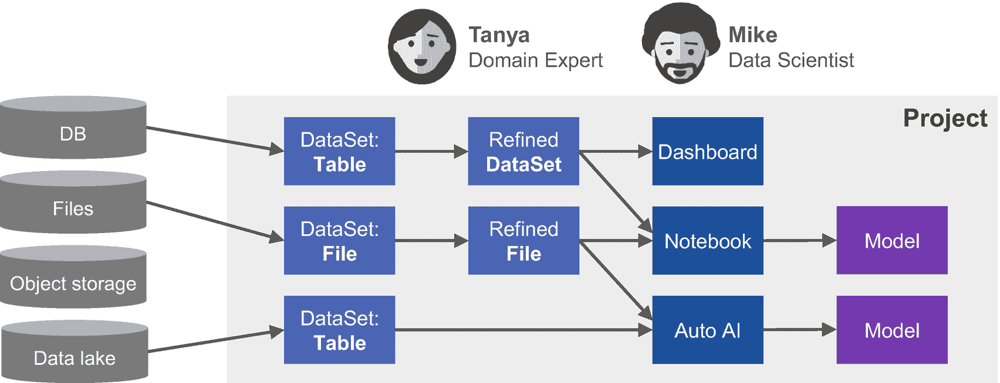

图 5-1

创建数据科学项目

在接下来的小节中，我们将更详细地描述这些不同的任务，并使用 IBM Watson Studio 可视化其中的一些步骤。

### 连接数据

项目成员可以通过连接连接到数据库、对象存储或其他数据源中的数据，并引用或复制相关数据的子集作为项目中的数据资产。如果原始数据包含不打算在项目中使用的敏感信息，将数据添加到项目中的人可以在将数据添加到项目中时省略某些列。

在这种情况下，数据管理员被添加到项目中，以使所需的数据在项目中可用。数据管理员选择允许数据科学家、数据工程师和其他角色用于项目的数据，并将其作为数据库表或 CSV 文件添加到项目中。可以提供来自各种数据源系统的数据。

目标是使与该特定业务解决方案相关的所有数据可用。这听起来像是一个相当琐碎的任务，它通常基于这样一个假设，即相关数据是简单可用且容易访问的。然而，为数据工程师和数据科学家提供相关数据可能是一项具有挑战性的工作。

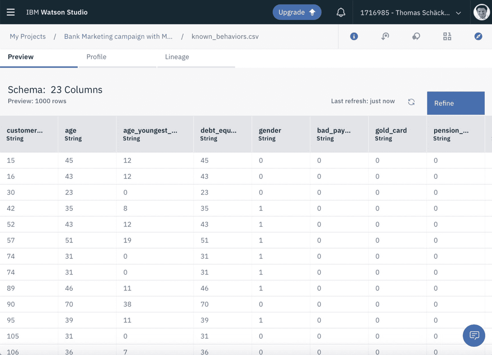

图 5-2

与项目相关的数据集

数据集包括来自银行客户记录的相关列，如图 [5-2](#Fig2) 所示，显示了项目中数据预览中的数据集。

### 提炼、可视化、分析数据

项目成员可以根据需要探索和提炼数据，以达到所需的数据质量和代表性数据分布水平。数据工程师通常带头准备可用数据，并将其转换为适合数据科学家进一步使用的格式。然而，数据探索、提炼和可视化通常是一项协作性很强的工作，数据科学家和数据工程师一起工作。业务领域专家，例如营销活动专家，需要提供指导来保证所需的业务结果。一些数据可能对预测未来没有用处，但仍应包括在内，以实现其他洞察，例如，分支机构代码和合并前/后记录的指示可以实现洞察，如这些维度如何与绩效相关联。

例如，可以在项目环境中使用 refinery 函数来完成数据细化。也可以通过使用 Python、R 或许多其他语言编码来精炼笔记本 <sup>[3](#Fn3)</sup> 中的数据。

它们可用于交互式可视化和分析数据，以更好地理解各种数据段的相关性和连贯性。总体目标是探索和提炼数据，以便为模型的创建和训练确定相关特征。

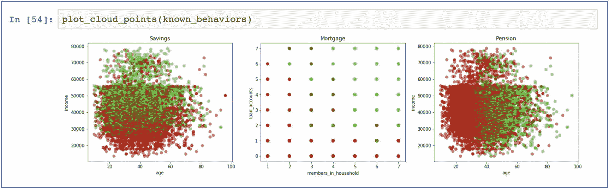

图 5-3

笔记本中的数据可视化

如图 [5-3](#Fig3) 所示，在本例中，数据科学家直接在笔记本中使用可视化工具来可视化客户前一年的购买数据。可以使用许多可视化图形，例如，发现数据列、KPI 或定义的度量之间的重要关联。

这使得数据科学家能够获得数据段的相关洞察力，然后在开发 ML 或 DL 模型时将这些数据段考虑在内。

以下是从图 [5-3](#Fig3) 的可视化中可以看到的一些见解:

*   **客户收入**:客户的收入越多，他们拥有储蓄账户的可能性就越大。正如我们在第 [1](01.html) 、*艾简介*中已经指出的，这个发现本身可能是不够的。换句话说，它应该与来自该特定客户的交易记录或其他客户档案信息的其他见解相关联。

*   **客户年龄**:客户年龄越大，越有可能拥有养老金账户。这一发现在统计学上可能是正确的，并且可以很好地用于 ML 模型的开发；然而，它需要与特定客户的其他见解相关联。例如，一个特定的客户可能已经有一个养老金账户。

*   **相关性发现** : <sup>[4](#Fn4)</sup> 客户家庭的居住人数、客户持有的贷款账户数与客户购买抵押贷款账户的可能性之间存在相关性，如图 [5-3](#Fig3) 中抵押贷款图表的右上角和左下角所示。

前面的例子也很好地强调了应该考虑可能的偏差。例如，洞察可能偏向于某些人口统计指标(例如，年龄、性别、婚姻状况等。)，这可能反映也可能不反映现实。

### 创建和训练预测模型

一旦数据处于正确的状态并得到很好的理解，数据科学家就可以使用集成工具创建和训练预测性的机器学习模型，例如，使用 Auto AI、Python 笔记本或 SPSS flows。

我们提供了这些集成工具的更多细节，让您更好地了解它们的功能。

#### 汽车人工智能

Auto AI 通过提供数据集并让 Auto AI为一组候选管线执行模型选择、特征工程、超参数优化等，提供了一种创建一组候选模型管线的简单方法。然后，数据科学家可以探索结果模型的各种指标，挑选他们最喜欢的模型，并将它们保存到项目中。

可以通过比较 ROC 和 PR 曲线下的面积来评估所得模型的准确性和精确度。这允许对所有模型进行一致的比较，并选择最佳模型来使用。

Auto AI 是一个很好的例子，说明如何开始人工智能和 ML 项目，而不一定是数据科学主题专家，也不一定精通数学和统计方法。它隐藏了一些通常与数据科学任务相关的复杂性。

图 [5-4](#Fig4) 是自动人工智能流水线生成的概要，包括算法选择、超参数优化、特征工程任务等各个步骤。

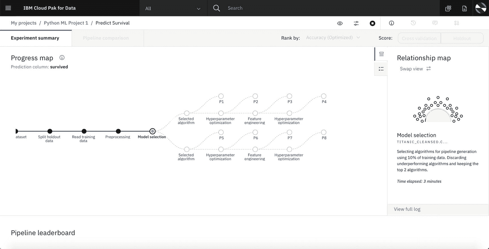

图 5-4

自动人工智能实验流水线生成

这些步骤中的一些可以迭代执行，以增加模型的准确度和精确度。当 Auto AI 执行这些步骤时，它会向用户显示进度。当使用更大的数据集时，用户也可以退出，稍后再回到他们的实验中。

图 [5-5](#Fig5) 显示了所有选择的算法、基于这些算法创建的候选训练管道以及自动 AI 实验结束后这些管道使用的特征转换器的概述。除了选择最符合您需要的模型并保存它之外，您还可以选择模型管线并将其保存为 Python 笔记本。

这允许您进一步改进和定制各种任务(例如，数据准备、特征工程、超参数设置)，并进一步优化您的 ML 模型的准确度和精度。

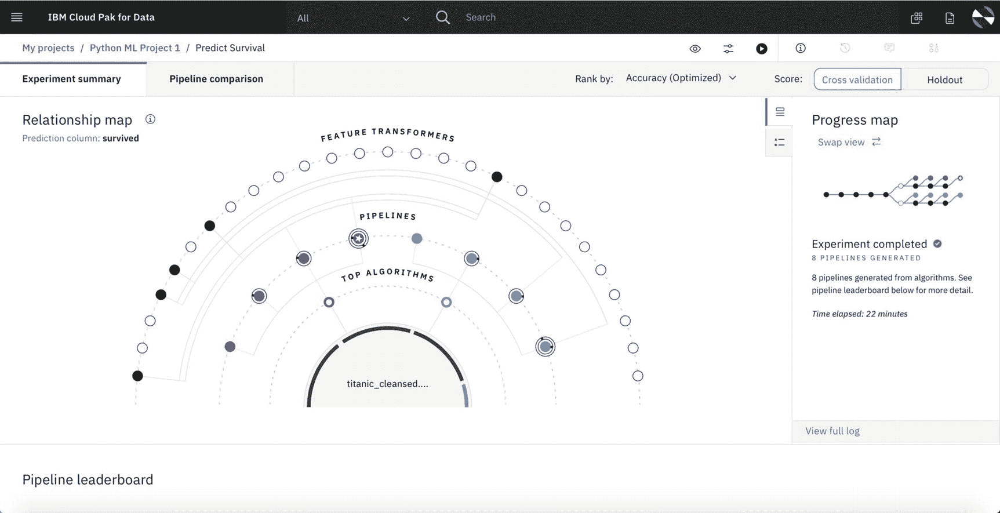

图 5-5

汽车人工智能实验总结

你也可以选择与自动人工智能交互，在自动人工智能过程中指定你自己的偏好。以下是一些例子:

*   数据准备和高级数据提炼任务

*   特征工程，包括特征转换

*   自动人工智能流水线优化

*   超参数优化(HPO) <sup>[6](#Fn6)</sup>

*   可解释性、去偏见和公平

*   人工智能生命周期管理，用于监控部署后的性能

#### SPSS 流程

SPSS 流允许多个角色——包括没有编码技能的业务领域专家——通过在可视化编辑器中定义模型训练流，并运行这些流来创建、训练和保存模型到项目中，从而创建和训练模型。

图 [5-6](#Fig6) 是一个示例 SPSS 流程图，无需编程技能即可组装。

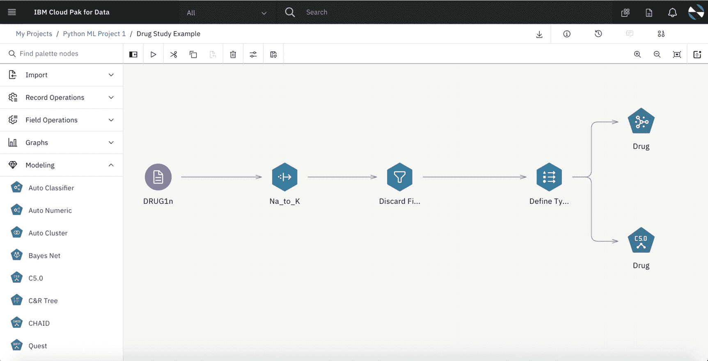

图 5-6

样本 SPSS 流

SPSS <sup>[7](#Fn7)</sup> 是编程技能有限或没有编程技能的人物角色的替代选择。

#### 笔记本电脑

正如我们之前提到的，数据科学家也可以使用笔记本来使用 Python 或许多其他语言(如 R 或 Scala)训练模型，然后可以使用项目 API 从笔记本中的代码将训练好的模型保存到项目中。笔记本需要编程技能；但是，它们允许最大的灵活性，需要被视为任何数据科学家的最新技术。

据我们观察，Python 是数据科学家中最流行的编程语言。总的来说，Python 也是一种非常流行的编程语言。这导致了大量可以从 Python 代码中使用的现成库，包括大量强大的数据科学、ML、DL、DO 和可视化库，这些库使数据科学家具有很高的生产力。

图 [5-7](#Fig7) 是在 JupyterLab 用户界面中打开 Jupyter 笔记本的项目中工作时拍摄的快照。它展示了在笔记本文档中显示代码单元和结果输出的典型组合，这实现了有文化的编程。笔记本是自我记录的；运行后，它包含代码和产生的见解，以及解释这一切的内联文本。正如你在图 [5-7](#Fig7) 中所看到的，JupyterLab 可以集成一个 Git 存储库用于代码管理，在这个例子中是与项目相关联的 Git 存储库。

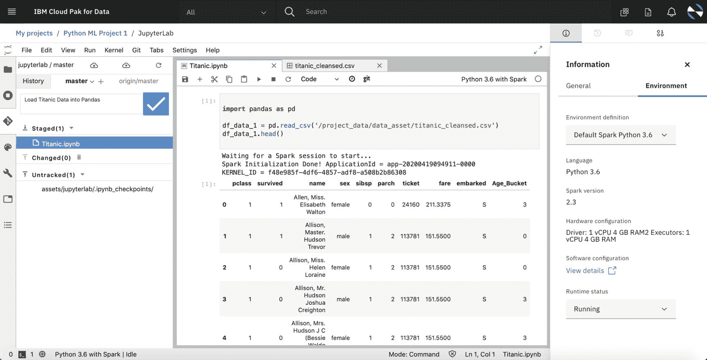

图 5-7

带 Python 的 Jupyter 笔记本

为了运行代码单元，笔记本需要一个底层运行时环境，在这种情况下是 Python + Spark 环境，允许 Python 代码的单节点执行以及利用 Apache Spark 框架的 Python 代码的并行执行。

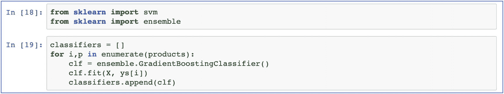

图 5-8

Python 笔记本来训练模型

IBM 的 Alain Chabrier <sup>[8](#Fn8)</sup> 创造了一个很好的例子来说明 ML 和 DO 的结合，他是 DO 领域的思想领袖和专家，也是将 DO 与 ML 智能结合的专家。作为他在这个领域工作的一部分，他用一个银行场景作为例子创建了一个笔记本，我们在这一章中包括了其中的摘录。若要预测客户对产品的兴趣，第一步是使用去年的客户购买数据和客户档案数据来训练模型。

从图 [5-8](#Fig8) 中可以看出， *scikit-learn svm* 和 *ensemble* 被导入到笔记本中使用，并且使用梯度提升分类器作为底层的 ML 算法。梯度推进算法是一种非常流行的回归和分类问题的算法。随后，他们使用该模型来预测哪些客户在未来一年最有可能购买哪种特定产品。

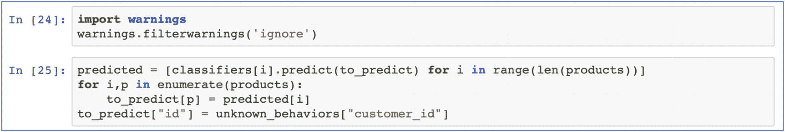

图 5-9

使用模型进行评分

正如您在图 [5-9](#Fig9) 中看到的，我们将每种产品(储蓄、抵押贷款和养老金)与所选择的客户特征联系起来，如年龄、收入、家庭成员数量和账户数量。

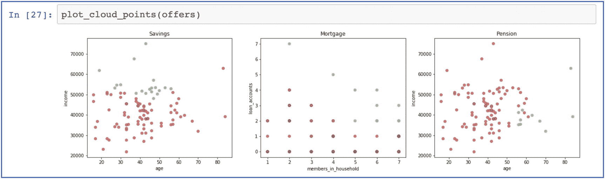

图 5-10

预测报价的可视化

对于提供什么的预测可以以与之前显示过去一年的数据相同的方式可视化。正如您在图 [5-10](#Fig10) 中所看到的，我们收到了一个预测结果，该结果对个别产品提出了以下建议:

*   **储蓄**:年收入超过 50，000 美元的客户更有可能需要一个储蓄账户。

*   **房贷**:一个家庭的成员数和贷款账户数是有相关性的。拥有五个以上成员和至少两个贷款账户的家庭更有可能需要抵押贷款。

*   **养老金**:年龄超过 56 岁且收入不超过 42 美元的客户更有可能需要养老金产品。

这个例子是一个例证；对于现实场景，还需要考虑额外的产品和客户特征。

### 部署 ML 模型

模型可以从一个项目提升到一个*空间*，在这里授权用户可以创建*模型部署*来为模型提供在线或批量评分。

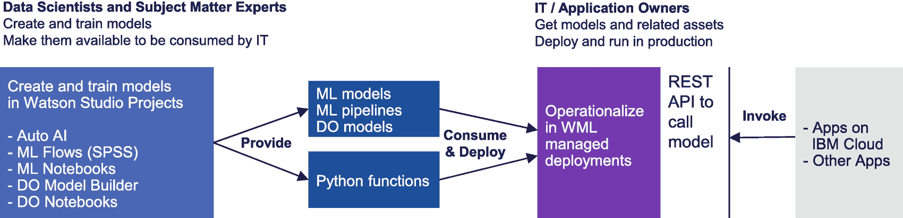

图 5-11

部署 ML 模型

这使得可以通过公共 REST APIs 访问预测性的 ML 或 DL 模型。应用程序或业务流程可以通过这些 REST APIs 调用模型来获得预测。图 [5-11](#Fig11) 描述了 ML 或 DL 模型的部署。一旦模型被部署，具有模型输入数据和模型预测输出的有效载荷输入和输出日志可以被记录在数据库表中，其可以被连续地监控和分析以确保公平性。这允许自动检测模型评分中的不良表现、漂移或偏差，并在需要时采取纠正措施。

主题专家创建、培训和验证模型，并使它们可在 IT 和业务环境中运行。人工智能工件可以是 ML 或 DL 模型和管道、DO 模型以及组合模型的 Python 函数。IT 和应用程序需要集成这些人工智能构件，通过 REST APIs 调用这些人工智能构件进行评分。

### 创建 DO 模型

如图 [5-12](#Fig12) 所示，为了从预测进展到最佳行动，团队需要将 ML 与 DO 相结合，以便来自 ML 模型的预测加上其他输入数据可以输入到规定的 DO 模型中，从而最终确定基于该输入的最佳行动。


图 5-12

创建 DO 模型

熟悉优化的优化专家或数据科学家使用来自项目的数据和由预测性 ML 或 DL 模型创建的预测，在笔记本或 DO 模型构建器中创建并测试 DO 模型，以求解最优决策和最终行动。IBM Watson Studio 中的 DO 利用先进的 docplex 引擎 <sup>[9](#Fn9)</sup> 来解决优化问题。

在本例中，由于熟悉 Python，数据科学团队选择创建一个 Python 笔记本，然后在笔记本中用 Python 代码定义并测试 DO 模型。虽然 docplex Python 库已经预装在 IBM Watson Studio 的 Python 环境中，但它也可以使用`!pip install docplex`轻松添加到其他地方的任何 Python 笔记本中，为您提供最大的灵活性。然后，可以在 Python 笔记本单元格中使用以下代码创建 DO 模型:

```
from docplex.mp.model import Model
mdl = Model(name="marketing_campaign")

```

在这一步之后，需要定义决策变量，然后定义需要考虑的约束。在这个例子中，以下约束是相关的:

*   每位顾客只提供一种产品。

*   计算预算并设定一个最高限额。

*   计算要提供的数量。

*   确保每个渠道至少有 10%的报价。

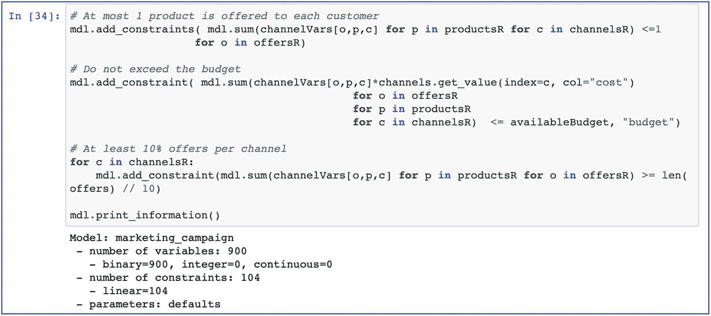

图 5-13

定义 DO 模型的约束

使用`mdl.add_constraint()`为模型定义这些约束，如图 [5-13](#Fig13) 所示。

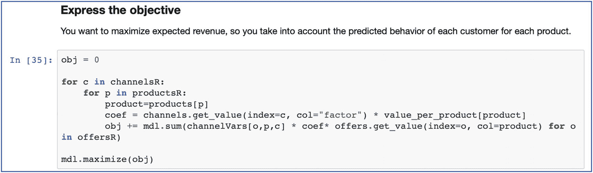

图 5-14

定义目标

然后定义目标，在这种情况下使用`mdl.maximize()`使收入最大化，如图 [5-14](#Fig14) 所示。

最后运行 docplex 引擎 <sup>[10](#Fn10)</sup> 使用`mdl.solve()`求解模型，如图 [5-15](#Fig15) 所示。

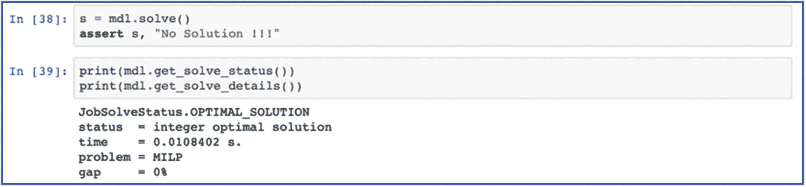

图 5-15

运行 Docplex 引擎

求解模型的输出是一个数据框架，其中包含通过哪个渠道向哪个客户提供什么的详细优化决策。

### 部署 DO 模型

像预测 ML 模型一样，可以部署说明性 DO 模型来解决优化问题。这使得 DO 模型可以通过 Watson ML public REST APIs 进行访问，以供应用程序或业务流程访问。随后，使用相关数据和 ML 预测作为输入，docplex 引擎将解决问题并生成最佳行动。

这代表了在流程或业务应用程序的非常具体的上下文中的整体解决方案。

通过将 ML 和 DO 模型与同一个 Watson ML 服务结合部署，应用程序或流程可以轻松调用 ML 模型来基于相关数据生成预测，然后调用带有数据预测的 DO 模型来确定要采取的最佳行动。

在该示例中，预测和优化的决策被保存到由 ML 和 DO 模型的批量评分部署产生的数据库表中。

## 将 ML 和 DO 模型投入生产

正如我们在第一章中所观察到的，为了将模型部署到生产环境中，通常需要将它们添加并部署到完全独立的生产部署系统中。

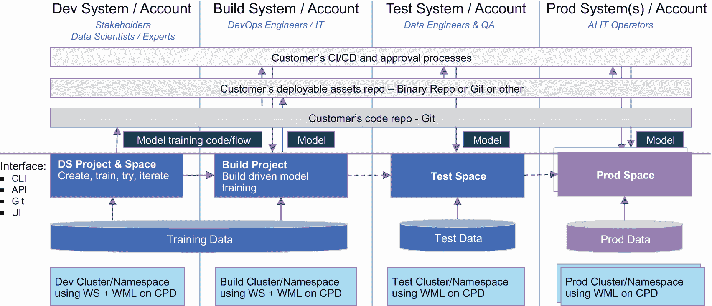

图 5-16

异构开发和生产环境

为了通过 Watson Studio 实现这一点，例如，可以安装一个 OpenShift 集群和 IBM Cloud Pak，用于 Watson Studio 和 Watson Machine Learning 的数据，作为数据科学家的工作环境，并安装其他集群和 Watson Machine Learning，用于构建、测试和生产环境，如图 [5-16](#Fig16) 所示。

数据科学家可以将他们的工作结果提交到 Git 存储库，或者将资产导出为 ZIP 文件，以便使 ML 和 DO 模型资产可用于 CI/CD <sup>[11](#Fn11)</sup> 管道，该管道通常由单独的 it 团队创建和操作。然后，CI/CD 管道可以将资产传播到构建、测试和最终的生产环境，以建立一个定义良好的流程，在可重复的培训和测试之后将 ML 和 DO 模型资产投入生产。

### 在应用程序和流程中嵌入人工智能

在为生产使用部署了 ML 和 DO 模型之后，业务流程和应用程序现在可以使用这些模型来进行预测和确定最佳决策，以推动最佳的自动化或人工智能增强行动。

在我们的示例中，银行的营销流程可以从数据库表中获得最终的优化决策，该数据库表包含关于通过哪个渠道向哪个客户提供什么的最优决策集，以便在可用预算和产品可用性以及其他约束条件内实现最优结果。

## 关键要点

我们总结了本章的一些要点，总结在表 [5-1](#Tab1) 中。

表 5-1

关键要点

   
| 

#

 | 

关键外卖

 | 

高级描述

 |
| --- | --- | --- |
| one | 从数据到预测往往是不够的 | 预测本身通常是不可行的；关键是从预测到最佳决策，以便为最佳行动提供信息 |
| Two | 营销活动的幼稚方法 | 例如，训练一个模型来预测哪些客户可能会购买什么产品，但在实践中可能无法向所有潜在买家推销 |
| three | 营销活动的更聪明方法:考虑约束 | 考虑各种约束，如预算、产品可用性、邮寄限制等，并朝着明确的目标进行优化 |
| four | 优化问题自动求解的决策优化 | 借助决策优化，数据科学家或优化专家可以定义一个*优化问题*，该问题由一组需要遵守的约束、要优化的目标以及解决问题时要考虑的数据组成 |
| five | IBM Watson Studio 是 ML + DO 结合环境的一个例子 | Watson Studio 允许创建项目、添加成员、连接和添加数据、构建机器学习模型和决策优化模型，以及一起部署 ML 和 DO 模型以供应用程序和流程使用 |
| six | 决策优化模型可以通过 UI 或 Python 创建 | DO designer 允许可视化定义模型；或者，可以使用 Python 在 Jupyter 中定义和求解模型吗 |
| seven | 使用带有 CI/CD 的 DevOps 将 ML 和 DO 模型投入生产 | 确保所有相关的工件都在可信的代码和资产存储库(例如 Git)中进行管理，并且可以通过自动化 CI/CD 管道以可复制的方式部署到测试和生产系统 |
| eight | 实现模型部署的 HA 和 DR | 将模型部署到至少两个独立的站点，实现请求的负载平衡，并在一个站点无法为关键业务应用程序和流程提供服务时进行故障转移 |

## 参考

1.  IBM， *IBM 沃森工作室*，[`www.ibm.com/cloud/watson-studio`](http://www.ibm.com/cloud/watson-studio)(2020 年 4 月 27 日访问)。

2.  Galea，A. *使用 Python 和 Jupyter 开始数据科学:使用强大的工具从数据中释放可操作的洞察力*。ISBN-13: 978-1789532029，Packt Publishing，2018。

3.  Python 数据分析:使用 Pandas、NumPy 和 Matplotlib。第二版。版本。ISBN-13: 978-1484239124，Apress，2018。

4.  核心数据分析:总结、关联和可视化。2019 版。ISBN-13: 978-3030002701，施普林格，2019。

5.  马莱卡，s，王，D. IBM。人工智能。 *AutoAI:人类和机器更好地在一起*、[`https://developer.ibm.com/technologies/artificial-intelligence/articles/autoai-humans-and-machines-better-together/`](https://developer.ibm.com/technologies/artificial-intelligence/articles/autoai-humans-and-machines-better-together/)(2020 年 4 月 27 日访问)。

6.  迈向数据科学。*可用超参数优化技术*、[、`https://towardsdatascience.com/available-hyperparameter-optimization-techniques-dc60fb836264`、](https://towardsdatascience.com/available-hyperparameter-optimization-techniques-dc60fb836264)(2020 年 4 月 27 日访问)。

7.  IBM。 *IBM SPSS 软件*，[`www.ibm.com/analytics/spss-statistics-software`](http://www.ibm.com/analytics/spss-statistics-software)(2020 年 4 月 27 日访问)。

8.  Chabrier，A. *数据科学体验的决策优化:为什么？*[`https://developer.ibm.com/docloud/blog/2018/05/07/do4dsx-why/`](https://developer.ibm.com/docloud/blog/2018/05/07/do4dsx-why/)(2020 年 4 月 27 日访问)。

9.  IBM，*《IBM 针对 Python 的决策优化 CPLEX 建模*，[`https://pypi.org/project/docplex/`](https://pypi.org/project/docplex/)》(2020 年 4 月 20 日访问)。

<aside aria-label="Footnotes" class="FootnoteSection" epub:type="footnotes">Footnotes [1](#Fn1_source)

有关 IBM Watson Studio 的更多信息，请参见[1]。

  [2](#Fn2_source)

对于这个例子，我们使用 IBM Watson Studio 然而，也可以使用来自各种不同供应商的类似工具。

  [3](#Fn3_source)

有关面向数据科学家的笔记本电脑的更多信息，请参见[2]和[3]。

  [4](#Fn4_source)

相关性发现是 ML 的一个基本方面；有关关联发现及其在 ML 中的适用性的更多信息，请参见[4]。

  [5](#Fn5_source)

关于自动人工智能的更多信息见[5]。

  [6](#Fn6_source)

有关超参数优化的更多信息，请参见[6]。

  [7](#Fn7_source)

有关 SPSS 的更多信息，请参见[7]。

  [8](#Fn8_source)

参见 Alain Chabrier 关于 DO 的更多信息。

  [9](#Fn9_source)

有关 docplex 引擎的更多信息，请参见[9]。

  [10](#Fn10_source)

更多关于如何在笔记本中使用 docplex 的信息可以在这里找到: [`https://github.com/IBMDecisionOptimization/docplex-examples`](https://github.com/IBMDecisionOptimization/docplex-examples) 。

  [11](#Fn11_source)

CI/CD 代表持续集成和持续交付。

 </aside>