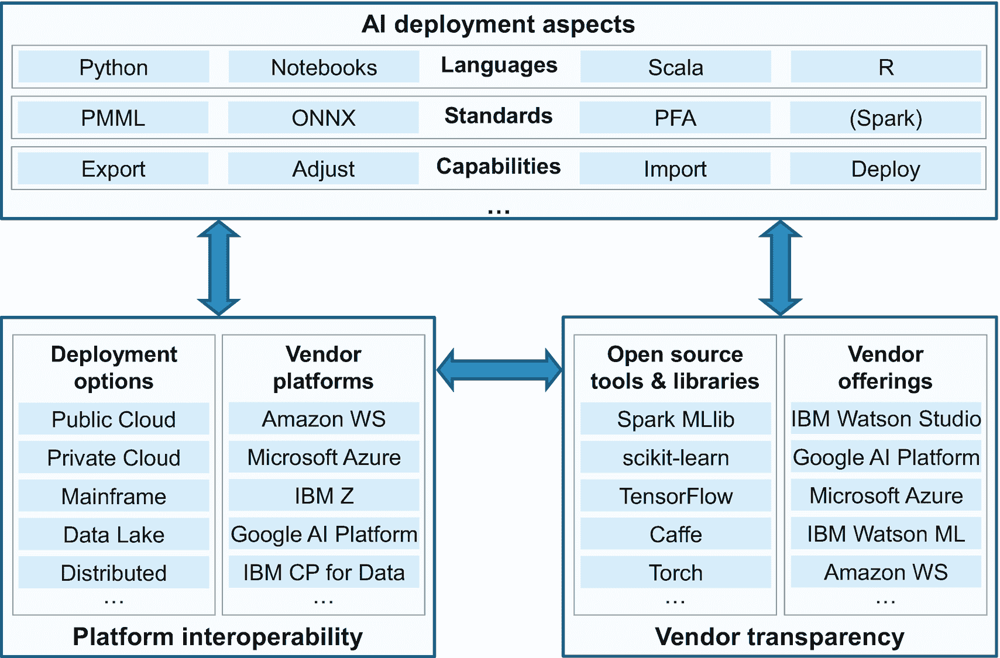
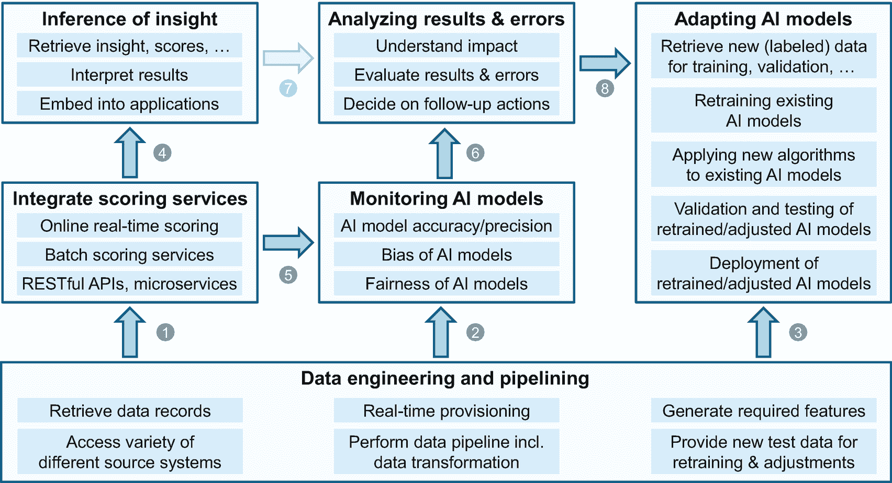
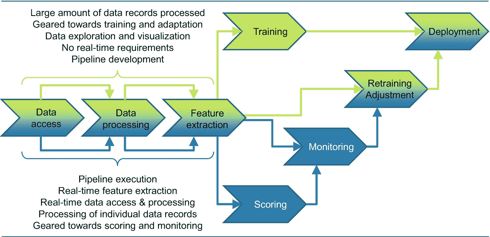
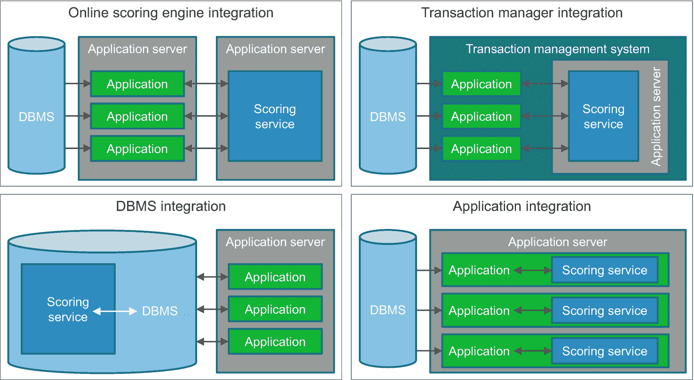
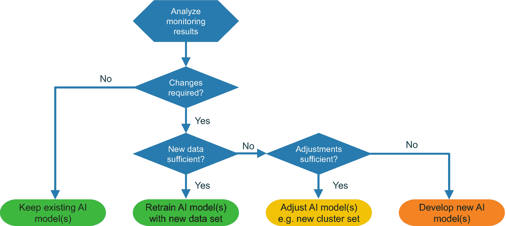

# 六、人工智能的操作化

开发人工智能解决方案，包括 ML/DL 模型的训练和部署，仍然是一项重要的、通常是 IT 资源密集型的任务。将人工智能产品(如 ML/DL 模型和数据工程模块)集成到现有的企业 IT 基础设施和应用程序环境中是一个额外的挑战。人工智能的产品化或可操作化以及基于人工智能的分析洞察对消费应用的推断将在本章中进一步探讨，其中我们将重点关注人工智能在企业环境中的产品化和可操作化。此外，我们揭示了运营人工智能 [1](#Fn1) 的关键挑战，并描述了人工智能解决方案高效和可持续产品化的基本目标，特别是 ML 和 DL 模型和数据工程工件。

## 介绍

虽然 AI 和 ML 一点都不新鲜，但洞察驱动的组织如何通过软件和应用程序将 ML 和 DL 嵌入到他们的业务流程和用例中的程度差异很大。特别是，对大多数组织来说，操作 ML 模型和确保实时评分仍然是一个巨大的挑战。它与模型部署、模型流水线和评分、审计和监控所需的效率相关。

一个特别的方面是在交易应用程序中操作预测模型，而没有显著的开销，在交互点实现实时洞察。实时交易评分或超低延迟评分是许多使用案例的关键要求，例如欺诈保护、情境营销优惠、网络安全等。

AI 部署需要优化，以便在企业环境中高效地操作 ML 和 DL，这需要信心、健壮性和足够的性能。为了交付基本的模型版本控制、审计和监控，以及高可用性、高性能和低延迟，对于企业就绪的 ML 和 DL 解决方案至关重要。版本控制允许部署不同的模型版本，包括使用不同的评分服务对不同的版本进行评分——如果需要的话。模型监控和再培训以及模型调整确保了模型在其生命周期中的企业相关性。为了确保模型的准确性和精确性，模型的再训练应该通过 RESTful APIs 来实现。

另一个相当重要的方面是 ML 和 DL 模型自动化(我们称之为 ML 和 DL 即服务)。为了实现 AI 操作化 [2](#Fn2) ，供应商提供的产品和工具应支持数据工程和流水线能力，包括读取和提供评分引擎所需的数据；例如，将数据转换成熊猫或火花数据帧；删除或添加一些列；对列执行一些变换或计算；和标准化数据。此外，例如，供应商的产品和工具应该为 ML 和 DL 模型的评分提供各种选项。例如，选项可以基于基于内存的在线评分引擎部署，或者为具有传统大型机基础架构的企业提供 CICS 集成在线评分服务。今天的企业可能使用几种 ML 和 DL 模型类型，如 Apache Spark 模型、scikit-learn 模型和 PMML 或 ONNX 模型，它们也需要不同的评分引擎。

必要的数据工程任务(包括数据访问、数据管道和为模型评分做准备的转换任务)需要优化的 IT 基础架构和企业就绪性，而大多数企业至今仍在为此苦苦挣扎。

## 人工智能可操作化的挑战

人工智能的可操作化和产品化面临许多挑战。以下是我们用来对这些人工智能操作化挑战进行分类的关键领域或领域 [3](#Fn3) 。以下六个领域各不相同，但仍相互关联。

1.  **数据工程**:作为评分服务的输入，需要数据工程和管道化，包括准备、转换和管道化新的数据记录、传感器设备输入和其他可以被 ML 和 DL 模型消费和处理的特征。这是一个巨大的挑战，因为源数据可能必须以超低延迟从异构系统和应用程序环境中组装。某些级别的数据流水线可以集成在所谓的 AI 流水线模型中。

2.  **基础设施透明性** : ML 和 DL 模型可以在一个特定的 IT 平台(例如，基于 Hadoop 的数据湖)上开发、训练和验证，使用一组特定的 AI 开源或供应商产品，而部署和操作需要在具有其他产品和工具的不同平台(例如，传统的大型机系统)上完成，这需要 IT 基础设施透明性以及开源工具和供应商产品的互操作性。

3.  **模型评分**:在线评分服务必须*集成*到现有的交易或应用程序环境中，这需要灵活性和高性能，例如，可以通过微服务和 RESTful APIs 或通过将评分服务直接集成到数据库管理系统(DBMS)或现有的交易管理系统中来提供。例如，可以在 CICS 区域中配置 IBM Watson ML for z/OS 评分服务。 [4](#Fn4)

4.  **洞察力推理**:在对 ML/DL 模型评分后，需要进行分析洞察力的推理。模型的结果，例如，分类模型的分数或者无监督聚类模型的一组聚类，需要被注入到相应的应用中。这需要 ML/DL 模型结果的清晰性和可解释性。

5.  **模型监控**:一旦部署和运行，就需要 ML/DL 模型监控来检测、理解和度量，例如，偏离那些模型的原始准确度和精确度 [5](#Fn5) 的偏差和偏离。根据用例及应用程序的需求，这需要连续地或至少周期性地进行。

6.  **模型自适应**:源自 ML/DL 模型监控的洞察力可以建议调整 AI 应用或某些模型，或者导致用新标记的训练和验证数据重新训练现有模型，或者甚至模型调整，这意味着可能开发一组具有更高准确度和精确度的新样本模型。

我们已经在图 [4-2](https://doi.org/10.1007/978-1-4842-6206-1_4Fig#2) *人工智能信息架构概览图*中引用了其中一些领域，在第 [4 章](04.html)、*人工智能信息架构*中在图 [4-2](https://doi.org/10.1007/978-1-4842-6206-1_4Fig#2) 中，部署和运营被归类并描述为一组核心 abb。此外，人工智能信息架构的核心 abb 环境中的 ML 工作流与其中一些领域相关。实现人工智能的最大挑战之一与所需的数据工程和流水线任务有关。这是由人工智能开发(包括训练、验证和测试)和人工智能操作环境之间经常存在的鸿沟造成的，其中这两种环境的环境和约束可能有很大不同。

例如，在人工智能开发过程中，来自不同源系统的数据可能被合并、转换和流水线化；可以应用各种特征工程技术来最终为特定的 ML 或 DL 模型定义最合适的特征。然而，这些流水线和特征工程任务可能导致复杂的流水线和数据转换模块，消耗大量的时间来构建，通常是几天。在这些 ML/DL 模型和数据工程工件的操作化过程中，这些相同的特征必须作为在线评分服务的输入实时提供。这需要完全不同的技术集成和转换能力，这通常会给几乎所有企业带来无法预见的巨大数据工程和管道挑战。

表 [6-1](#Tab1) 列出了 AI 运营化和产品化的挑战，与相应的领域相关联。 [6](#Fn6) 不用说，这个列表还需要进一步定制和细化。

表 6-1

人工智能投入运行面临的挑战

   
| 

#

 | 

挑战

 | 

领域

 |
| --- | --- | --- |
| one | 确保 ML/DL 模型在整个生命周期中的准确性和精确性 | 模型监控、模型调整 |
| Two | 为数据工程任务提供所需源数据记录的实时访问和数据供应 | 数据工程 |
| three | 为应用程序和交易提供实时(低延迟)评分服务 | 模型评分、洞察力推理 |
| four | 理解已部署的 ML/DL 模型的偏见、公平性等等 | 模型监控 |
| five | 用新的数据集重新训练模型，以提高模型的相关性、准确性和精确度 | 模型调整 |
| six | 消除或减少人工智能模型中的偏差、过度拟合、不公平等，例如，通过超参数优化或应用新的人工智能算法 | 模型调整 |
| seven | 利用不同的平台进行人工智能模型开发和部署，例如，公共云和内部部署 | 基础设施透明度 |
| eight | 利用不同供应商的产品和开源工具进行人工智能模型开发，而不是部署和运营 | 基础设施透明度 |
| nine | 选择不同的 ML/DL 算法来适应变化的用例特征或新的可用数据 | 模型调整 |
| Ten | 集成并利用开源工具和能力来实现 ML/DL 模型的操作化(和开发) | 基础设施透明度 |
| Eleven | 应用所需的流水线和数据工程任务，为基于较差源数据质量的评分做准备 | 数据工程 |
| Twelve | 为所有流水线作业提供所需的可扩展性和性能(例如，低延迟、实时) | 数据工程 |
| Thirteen | 举例来说，解释和说明评分的结果，以便在应用程序中充分利用洞察力 | 洞察力推理 |

## 人工智能操作化的一般方面

在本节中，我们将讨论人工智能操作化的以下三个一般方面的关系和一致性:

1.  部署方面

2.  平台互操作性

3.  供应商透明度

我们在讨论中包括 AI 模型部署方面，因为这涉及到跨各种平台的 AI 工件的必要且通常繁琐的交换，使用各种开源工具和库，以及不同的供应商产品。正如我们在本章开始时提到的，这需要高级部署功能，其中各种任务，如人工智能模型开发，包括培训、验证、测试以及部署和版本控制，可以使用不同平台上安装和配置的不同工具和产品来执行。

图 6-1

人工智能操作化的一般方面

图 [6-1](#Fig1) 说明了这三个方面的关系或连贯性。在分别探讨这三个人工智能可操作性方面之前，我们想指出这三个方面相互影响的特征。人工智能部署方面的变化，在使用不同的编程语言和标准以及使用所需的部署功能方面，例如，使用不同的人工智能环境和框架导出和导入人工智能模型，是由当今企业的现实驱动的，这需要平台互操作性和供应商透明性。

在与 IBM 客户的多次接触中，我们注意到不同企业组织使用了许多不同的开源工具、库、框架和供应商产品。这通常会导致异构的影子 IT 环境，妨碍无缝的供应商互换性和透明性，从而无法实现跨组织的共存。此外，不同的部署选项和供应商平台规定了供应商平台和部署互操作性的需求。如图 [6-1](#Fig1) 所示，厂商透明性和平台互操作性相互依赖，相互影响。

在接下来的部分中，我们将详细介绍部署方面、平台互操作性和供应商透明性。推荐的最佳实践是，在启动任何人工智能工作之前，认真考虑人工智能操作化的这三个一般方面及其相互依赖性。

### 部署方面

正如你所看到的，人工智能部署 [7](#Fn7) 可以通过使用各种编程语言、人工智能模型相关的标准和许多功能来表征。我们将人工智能部署特性限制在那些与平台互操作性和供应商透明性的相互关系相关的特性上。有相当多或多或少流行的人工智能相关编程语言，例如 Python(最突出的一种)、Scala、R，以及用于笔记本的其他语言，如 Python、Ruby、Perl、F#和 C#。

存在几个与 AI 模型相关的标准 [8](#Fn8) ，其中预测模型标记语言(PMML)、开放神经网络交换(ONNX)和可移植分析格式(PFA)是一些比较突出的例子。虽然 Spark 不是一个标准，但它仍然受到数据科学家的欢迎，并提供了事实上的标准化，特别是对于 Spark ML 模型交换和可移植性。

许多人工智能语言和标准的适用性和选择取决于个人组织、数据科学家和数据工程师的用例、技能和偏好。一些人工智能模型可以使用特定的标准进行转换或集成。有些 AI 模型也可以转化成其他标准。例如，Python scikit-learn 模型可以通过 PMML 投入生产。

在平台互操作性和供应商透明性的背景下部署 AI 需要几个能力，例如从一个特定的供应商平台或供应商产品中导出 AI 模型，并将它们导入到另一个产品中，该产品可以安装在不同的平台上，即使需要对 AI 模型进行一些调整。例如，IBM Watson Studio 可能已经被用作 IBM Cloud Pak for Data 的一部分，它可以被部署在私有云平台上以执行 AI 模型开发，包括训练、验证和测试，而实时评分的部署和操作化将在 IBM Z 大型机环境上执行。

这种跨平台的互操作性对于企业适应用例现实和组织偏好以及优化 IT 资源消耗至关重要。

### 平台互操作性

鉴于目前存在各种不同的部署选项和供应商平台，企业常常难以做出正确的选择。云部署可以以公共、私有、混合或多云(混合和多个供应商)的方式进行。如今的企业通常会在不同的组织间进行多云部署。

基于 Apache Hadoop 平台的数据湖部署和基于 Linux 的分布式平台丰富了可能性。近年来，传统的 IBM Z 大型机系统仍然代表着最大企业的 IT 主干，它们已经被现代化，并大大丰富了一系列与 ML 和分析相关的功能 [9](#Fn9) 。

正如你在第 [4](04.html) 、“*人工智能信息架构*中所看到的，有相当多的供应商平台，如 AWS、MS Azure、Google AI Platform 和 IBM Cloud Pak for Data，它们提供——除其他功能外——人工智能相关的服务。这些供应商平台和部署选项需要彼此互操作；它们至少需要共存并提供有意义的集成选项，以实现角色和职责的协作、人工智能工件的交换以及人工智能相关任务的有意义的划分。

### 供应商透明度

正如我们在开始时提到的，有丰富的供应商产品和开源工具、库和框架可供选择。供应商产品 [10](#Fn10) ，例如 IBM Watson Studio、谷歌人工智能平台、微软 Azure、IBM Watson ML 和亚马逊 WS，只是几个例子。

人工智能开源工具、库和框架的列表 [11](#Fn11) 也是无穷无尽和令人困惑的。Apache SparkML、scikit-learn、TensorFlow、Caffe、Torch、OpenNN、Theano 和 Keras 只是其中比较突出的几个。大多数供应商通过将许多开源包集成到他们的产品中来提供丰富的选择和灵活性，从而使组织能够在其特定用例需求的上下文中选择正确的库和框架。然而，在集成不同供应商产品方面的供应商透明性仍然是一个挑战，例如，在不同的工具和产品之间分割 AI 工作流任务，以及在不同的供应商产品之间部署和操作 AI 工件。

在开展任何人工智能工作之前，组织应该仔细评估供应商提供的集成开源工具、库和框架，以及不同供应商提供的集成能力。为了避免被束缚或锁定在特定的供应商产品上，应该检查透明度和开放性。因此，厂商的透明性和开放性伴随着平台互操作性和人工智能部署方面，如图 [6-1](#Fig1) 所示。

## 关键人工智能操作化领域

正如我们已经看到的，开发人工智能模型、工件和任务，包括训练、验证和测试，涉及相当多的挑战。然而，实施人工智能并将人工智能工件和解决方案集成到现有的应用程序和 IT 环境中，需要企业准备就绪和强大而全面的人工智能信息架构。企业就绪解决了对可靠性、安全性、连续可用性、敏捷性和灵活性、变更管理和生命周期管理等的需求，以将人工智能解决方案投入可持续的生产环境。正如我们在第[4](04.html)“*人工智能信息架构*中所讨论的，有许多 abb 应该共同提供一个全面的基础设施来开发和运营人工智能。

在我们讨论了一些一般方面之后，这一部分讨论了以下六个关键的人工智能操作化领域:

1.  数据工程和流水线

2.  集成评分服务

3.  洞察力推理

4.  人工智能模型的监控

5.  分析结果和错误

6.  适应人工智能模型

图 [6-2](#Fig2) ( *关键 AI 操作化领域)*说明了这六个领域或目标的关系或一致性。

图 6-2

关键人工智能操作化领域

在单独和更详细地探索这六个关键的人工智能操作化领域之前，我们想指出这些领域彼此之间的影响特征。

### 影响特征

在实施人工智能的背景下，*数据工程和流水线*领域发挥着基础性作用。这是由数据工程和流水线需要提供给以下三个领域的关键服务造成的:*综合评分服务*、*监控 AI 模型*、以及*适配 AI 模型* [12](#Fn12) 。

一些数据工程和流水线服务，例如访问各种不同的源系统来检索所需的数据记录，在前面提到的三个领域中非常相似。执行数据流水线，包括数据转换任务，主要涉及两个领域*综合评分服务*和*监控 AI 模型*。实时功能供应主要用于实现集成评分服务，尤其是在线交易评分。然而，它也可以用来实时监控人工智能模型的精确度和准确性或偏差和公平性。为再训练和调整提供新的测试数据是领域*适应 AI 模型*所需要的。通过应用新的 ML 算法，生成所需特征的服务可以具有不同的特征，这取决于是否必须提供特征来对已经部署的 AI 模型进行评分，或者是否需要进行特征工程来执行 AI 模型调整。

正如你在图 [6-2](#Fig2) 和前面的讨论中所看到的，*数据工程和流水线*领域为人工智能的运作提供了关键的基础服务。将评分服务集成到应用程序或交易中，例如，通过 RESTful APIs、微服务或集成到交易管理系统中，以实现洞察力推理 [13](#Fn13) 。

需要检索评分服务的结果，将其嵌入到应用程序中，并转化为可操作的见解。结果需要在业务领域的上下文中进行解释。

人工智能模型的监控旨在了解人工智能模型准确性和精确度随时间推移可能发生的变化，并了解人工智能模型的偏差和公平性。监控 AI 模型依赖评分服务提供输入，但也需要一些数据工程和流水线服务 [14](#Fn14) 。监控服务作为*分析结果和错误域*的输入，在这里需要评估结果和错误，并且需要了解可能的调整的影响(例如，工作和成本、预期的改进和业务相关性)，以便决定与业务相关的后续行动。这甚至可能需要来自洞察力域15T11】的*推理的一些输入。*

一旦分析了结果和错误，*调整 AI 模型*是 AI 操作化领域，其中 AI 模型可以用新标记的数据重新训练，或者它们可以通过例如应用新的 ML 模型 [16](#Fn16) 来调整。在某些情况下，甚至可能会开发一组新的人工智能模型，这意味着人工智能工作流程的重要部分需要再次执行。在任何情况下，修改人工智能模型都需要来自*数据工程和流水线*领域的服务，例如，为人工智能模型的再训练和调整提供新的标记数据。如果新的最大似然算法必须用于人工智能模型调整，那么数据管道，包括数据转换、特征工程等等，也是需要的。

这六个人工智能操作化领域可以被视为一组相互交织的三个人工智能操作化工作流。第一个工作流只是推动洞察力的推理，第二个工作流是监控人工智能模型以了解业务影响，第三个工作流是通过调整选择的人工智能模型对这种业务影响做出反应。

在我们详细阐述了关系和一致性之后，我们将继续深入探讨这六个关键目标。

### 数据工程和流水线

人工智能模型和解决方案开发所需的数据处理和特征工程具有一系列特定的挑战:需要在要解决的业务问题的背景下理解源数据，需要验证数据的相关性，以及需要探索和可视化数据。此外，必须对数据进行处理，并为需要训练(潜在处理大量数据)、评估和选择的 AI 模型进行标记。然而，与人工智能操作化相比，人工智能开发期间的时间关键方面、性能特征和数据量显著不同。为了进一步探索这一点，让我们仔细看看人工智能数据工程和流水线工作流程和任务集，如图 [6-3](#Fig3) 所示。

图 [6-3](#Fig3) 的左侧说明了数据访问、数据处理和特征提取任务。这些任务在性质上非常相似，无论产出是面向培训和适应还是操作化，包括评分和监测。需要访问和转换数据(例如，转换为 Spark 数据帧、JSON 格式或简单的 CSV 文件)，需要删除列，需要合并来自不同源系统的数据，并且需要执行数据转换和规范化任务。然而，背景是不同的，任务甚至可能必须在不同的平台上执行:人工智能模型的训练和再训练的数据处理不需要实时或超低延迟特性，例如，在线交易评分就是这种情况。

图 6-3

人工智能数据工程和流水线工作流

在开发 AI 模型时，所有数据处理步骤都可以使用可用的数据工程和数据科学家平台方便地执行，没有时间关键的方面。到了评分(以及监控)的时候，同样的数据转换和管道任务需要被操作化(产品化)并实时执行；这通常会导致巨大的问题。从异构源系统提供所需数据以供进一步实时处理和评分的这些时间敏感方面是一个挑战，在数据工程和管道模块的开发过程中，这一点经常被忽视或忽略。即使一些管道是所谓的人工智能管道模型的组成部分，在将数据馈送到人工智能管道模型进行评分之前，一些数据工程任务仍然存在。

一些数据处理任务，例如数据探索和数据可视化，是 AI 模型开发阶段所特有的；然而，对于人工智能的可操作性，数据不再需要探索，它需要实时处理，并且需要实时提取特征，以便以超低延迟的方式为人工智能模型的评分提供输入。

图 [6-3](#Fig3) 使用不同的颜色描绘了整个数据处理工作流程的这些具体特征:绿色(上半部分)用于人工智能开发，蓝色(下半部分)用于人工智能操作化环境。

建议在人工智能数据工程和流水线周期的开发过程中，预测这些工件的可操作性方面；人工智能操作化方面 [17](#Fn17) 必须从任何人工智能努力的一开始就考虑进去。

### 综合评分服务

一旦人工智能模型已经过培训、验证和部署，它们就可以被集成评分服务利用，这是人工智能可操作的关键领域之一。正如我们在本章开始时提到的，有各种各样的 ML 和 DL 模型类型和交换格式，例如 Apache Spark 模型、scikit-learn 模型和 PMML 或 ONNX 模型，它们也需要不同的评分引擎。除了不同的评分引擎之外，评分服务本身也可以通过不同的方式集成到 IT 基础架构中或由 AI 应用程序请求。

例如，人工智能模型可以批量或实时评分；集成可以通过 RESTful APIs 在事务或应用中完成，或者集成到数据库管理系统(DBMS)中，例如，通过将 Spark 或 scikit-learn 评分引擎集成到 DBMS 中。应用程序集成和请求评分服务的特定选项取决于用例场景的特征和特定需求(例如，性能)。

如图 [6-3](#Fig3) ( *AI 数据工程和流水线工作流程)*所示，AI 模型的评分需要执行数据访问、数据处理和特征提取任务。换句话说，在人工智能模型的实际评分之前，至少一些数据工程和流水线任务被假定已经被执行。如上所述，一些开源包和供应商产品允许开发 ML 管道模型，这可以包括在对模型评分之前的一组转换步骤。例如，使用 Apache Spark MLlib 库，您可以开发包含 transformer 的 ML 管道 [18](#Fn18) ，它可以是 ML 模型，也可以是将 Spark DataFrame 数据集转换为另一个数据集的算法，例如，通过添加几个列。根据用例的需求和底层的源数据系统，可能需要执行额外的数据工程和流水线任务。

人工智能模型本质上可以以批处理或实时方式评分。批量评分需要处理一组源数据记录，并提取相应的特征，以批量(批量)方式提供给人工智能模型评分。这样，所需的数据工程和流水线任务也以批量方式执行。批量评分可以生成数百万个分数，由应用程序进行解释，例如，确定下周将启动的营销活动的目标客户名单。

以下列表描述了关于实施*实时*综合评分服务的一些选项:

1.  **在线评分引擎集成**:评分服务集成在专用(独立)应用服务器上。例如，应用程序可以通过 RESTful API 评分调用在线请求评分服务。或者，甚至相同的应用服务器可以用于应用和评分服务。集成在专用(独立)应用服务器上的评分服务可产生最佳性能。实现主要取决于性能要求和可用资源。

2.  **事务管理器集成**:如果与现有的事务管理系统相结合，存在高吞吐量和每秒大量事务的性能需求，那么应该将评分服务集成到事务管理系统中。然后，在交易管理器控制下运行的应用程序可以通过接口模块请求评分服务。 [19](#Fn19)

3.  **DBMS 集成**:对于用例，AI 模型的评分可以与事件或应用程序启动的数据记录更新相联系，评分引擎和服务甚至可以集成到 DBMS 系统中。这尤其有意义，如果数据转换(例如，聚合、过滤、连接等。)是生成 AI 模型评分的特征所必需的。数据库触发器可用于请求评分服务。

4.  **应用程序集成**:特定的隐私要求和数据敏感性方面甚至可能建议将评分引擎和服务直接集成到应用程序中。

图 [6-4](#Fig4) 从概念层面描述了这四个实时综合评分场景。

图 6-4

实时综合评分服务

有许多额外的选项和变化来实时集成评分服务，如事件处理和基于发布/订阅的实现，我们不会在本书中讨论。

### 洞察力推理

通过对洞察力的推断，我们指的是转换人工智能模型执行结果的过程(例如，分数、聚类等)。)转化为可操作的洞察力。这需要检索 AI 模型执行的结果并将其嵌入到应用程序中，在给定的业务或用例环境中解释结果(例如分数)，并经常实时(或以超低延迟)决定后续行动。因此，洞察力的推理旨在理解可以从人工智能模型执行的结果中得出的含义和结论，这与业务问题密切相关，并且必须最大程度地集成到业务应用程序中。

以下是一些关键的能力，使推理的洞察力 [20](#Fn20) 。根据业务环境或用例场景，这些功能可能必须实时应用。

*   **可解释性**:给定特定的业务或用例环境，ML/DL 模型的结果必须是容易验证和可解释的，即可以理解的。

*   **可信度**:结果应该是可靠的，消费者和应用程序应该信任这些结果，而不需要进一步审查或质疑这些结果的适用性。

*   可消费性(consumeability):人工智能模型执行的结果需要是可消费的，这意味着容易嵌入到消费业务应用程序中。

*   **责任**:根据基于人工智能的决策的业务环境和法律含义，应用程序可能必须考虑责任要求。

### 人工智能模型监控

人工智能模型是在特定的商业环境中开发的。然而，业务和用例的特征或度量可能会随着时间而改变。数据本身也可能随着时间而漂移。这些不断变化的环境可能会导致人工智能应用程序的业务相关性降低，以及人工智能模型的准确性和精确度下降。此外，人工智能模型可能不会产生最初预期的结果；它们可能只在生命周期的后期表现出某些异常，不太公平，并表现出强烈的不良偏见。为了理解这种下降并采取适当的行动，需要不断地计算和监控相应的 AI 模型度量。

在第 [4](04.html) 、“ *AI 信息架构*”章节中，我们已经强调了模型监控是一个重要的组成部分，尤其是作为 ML 工作流的一部分，以及作为与部署和操作化相关的 abb 之一。在本节中，我们将详细说明应该监控的各个领域以及原因。然而，范围仅限于对人工智能模型结果的监控，而不是更广泛的范围，例如，与整个生命周期相关的人工智能资产的可追溯性和可审计性。 [21](#Fn21)

下面的列表描述了人工智能模型监控的一些关键措施。特定用例场景的业务需求和特定需求决定了这些度量的全部或子集的适用性。此外，对于一些用例场景，离线模型监控可能就足够了；然而，对于时间敏感的用例，其中环境和特征可能经常漂移，可能需要在线 AI 模型监控。

1.  **AI 模型** **性能**:ML 和 DL 模型性能的监控主要是测量 AI 回归和分类模型的受试者工作特征(ROC)和精确召回(PR)曲线下的面积。ROC 曲线(衡量 AI 模型的准确性)和 PR 曲线(衡量 AI 模型的精确度)下的下降区域可以表明 AI 模型准确性和精确度的恶化，这——取决于用例——意味着业务度量的恶化，例如亏损、客户满意度下降等等。甚至 ROC 和 PR 曲线的形状——意味着相应度量的平衡——也可能会产生商业影响。例如，对于信用卡欺诈模型，PR 曲线显示较高的召回数(真阳性率)和较低的精确度数(真阳性与预测阳性的比率)，这表明较少的假阴性，意味着较少的欺诈案件未被发现。如果 PR 曲线向更高的精确度和更低的召回数量摆动，这表明更少的假阳性，例如，意味着更少的信用卡被保留-尽管 PR 曲线下的面积在两种情况下是相同的。对 AI 模型性能的监控需要额外的措施，这些措施取决于特定用例场景的需求和特征。例如，作为人工智能应用(例如，医疗诊断和治疗、自动驾驶汽车)一部分的决策和行动基础的人工智能模型评分或结果可能必须进行整体监控。也就是说，对于 AI 模型性能，监控需要增强到决策优化级别，这甚至可能会考虑到人为干预。例如，对于自动驾驶汽车，人工智能建模需要是自主的 [22](#Fn22) ，并且可以根据个人驾驶行为和个人驾驶员偏好——甚至文化背景——进行调整。

2.  **人工智能模型的偏见和公平****:人工智能模型可能不会产生预期的结果，因为它显示出太多的偏见和缺乏公平。需要对人工智能模型结果进行监控，以了解有偏见的结果，即人工智能模型显示与特定功能或功能子集相关的有利或不利结果。此外，该监视可以导致对调整后的 AI 模型的影响的进一步分析和可视化，其中调整后的 AI 模型具有调整后的特征权重以减轻偏差。对于回归或分类模型，一定程度的偏差可能是理想的结果。例如，如果用于训练、验证和测试的应用的标签数据集的业务问题仅仅是建议对某个性别(例如，女性)或年龄组(例如，30≤年龄≤39)或颜色(例如，蓝色)的偏爱，那么对这些特征的偏见是完全正常的，甚至是期望的。然而，随着时间的推移，环境和新数据可能会发生变化，这可能会导致不利的偏差。需要检测这种偏差并采取行动。供应商已经在提供检测偏差的产品，包括根本原因分析。 [23](#Fn23)**

***   人工智能模型的可解释结果:人工智能模型的结果和人工智能应用程序的决策需要是可解释的，甚至是可视化的，这意味着用商业术语向商业用户解释和可视化模型决策。关键业务指标或 KPI(例如，欺诈案件数量、损失金额、保留的信用卡数量、因错误保留信用卡而投诉的客户数量)需要与人工智能模型的指标(例如，准确度或精确度指标、ROC 和 PR 曲线的形状)相关联，以便人工智能模型性能数据的监控可以放入有意义的业务环境中并采取行动。特别是对于具有自主性的人工智能，这意味着持续的学习自动化，其中有限甚至没有人工干预的自主过程非常普遍，人工智能模型和应用程序的可解释性正在达到一个新的维度。 [24](#Fn24)

     **

 **在今天的企业中，人工智能模型监控仍然是以一种相当初级的方式完成的，通过开源工具和供应商提供的支持来实现自动化是有限的。尽管可以实现对技术人工智能模型性能指标的测量和监控，例如 ROC 和 PR 曲线下的面积，但人工智能模型结果与业务相关 KPI 的相关性是一个相当新兴的领域，仍有许多工作要做。 [25](#Fn25)

### 分析结果和错误

对于那些人工智能模型性能恶化、偏差和不公平，或者检测到额外的不良事件的情况，必须对其进行分析，并理解其含义。一些结果和错误可能不会对业务产生如此重大的影响，尤其是在与可能的后续活动的预期工作进行比较时。正如您所想象的，这些活动需要根据您的用例场景的细节来定制。在某些情况下，人工智能应用程序本身及其基于某些衡量标准(例如，带有概率数字的分数)的决策可能需要调整，而不一定是人工智能模型。

以下是这个人工智能操作化领域的关键任务的简短列表:

*   **评估结果和错误**:需要对监测结果、事件和现象进行评估。

*   **了解影响**:在确定任何可能的后续行动之前，需要了解它们对业务的影响。

*   **决定后续行动**:根据努力程度，某些后续行动，如模型再培训，可能是可取的。

图 6-5

后续活动的决策流程

图 [6-5](#Fig5) 是关于可能的跟进活动的简单决策流程。正如你在图 [6-5](#Fig5) 中所看到的，很可能存在现有的人工智能模型不应该被改变的情况。可能必须改为调整 AI 应用程序，例如，通过调整应用程序需要对其采取行动的分数的概率数字水平。在其他情况下，使用新的标记数据集对现有模型进行重新训练就足够了。在数据记录的漂移不是人工智能模型恶化的原因的情况下，调整模型甚至开发新的模型可能是明智的。

我们现在在下一节简要讨论三种可能的人工智能模型适应选项。

### 人工智能模型适应

一旦决定调整现有的人工智能模型，基本上有三个有意义的选项，正如我们在前面的部分中看到的:(1)用新的标记训练、验证和测试数据重新训练现有的人工智能模型；(2)调整 AI 模型，这意味着可能进一步优化超参数，或者例如在分类模型的情况下，调整聚类的数量；以及(3)通过评估一组新的 ML/DL 算法来开发新的 AI 模型。

1.  **重新训练现有的人工智能模型**:如果底层商业模型或数据记录有适度的变化，则存在更直接的情况，这可以通过使用新的标记数据集重新训练现有的人工智能模型来简单地解决。在这种情况下，所涉及的努力应该是合理的。这项工作包括为训练、验证和测试提供新的标记数据集；以及重新训练的人工智能模型的部署。

2.  **调整现有的人工智能模型**:在这些情况下，如果监控结果显示对业务有更重大的影响，而这种影响无法通过简单地重新训练现有的人工智能模型来解决，则必须对决策树模型的集群数量或层级和节点数量进行调整(以增加信息增益)并进一步优化超参数。这些调整可能已经意味着数据科学家和工程师需要付出更大的开发努力。

3.  **开发新的人工智能模型**:如果业务情况和用例环境的变化如此严重，以至于如前所述对现有人工智能应用程序和人工智能模型进行超参数优化或调整可能没有前途，那么开发一套新的人工智能模型可能是明智的。当然，这等同于更全面的开发工作，包括 AI 工作流的所有步骤，涉及所有角色和利益相关者，如业务用户、数据科学家和工程师。

## 关键要点

我们总结了本章的一些要点，如表 [6-2](#Tab2) 所示。

表 6-2

关键要点

   
| 

#

 | 

关键外卖

 | 

高级描述

 |
| --- | --- | --- |
| one | 实施人工智能是一个巨大的挑战 | 它尤其与人工智能模型部署、实时模型流水线和评分、审计和监控所需的效率相关 |
| Two | 对平台互操作性和供应商透明性的需求 | 灵活的人工智能产品化和运营需要平台互操作性(包括部署选项和供应商平台)和供应商透明度(包括开源和供应商产品) |
| three | 人工智能操作化领域相互影响 | 这六个领域是:数据工程和流水线，集成评分服务，洞察力推理，监控人工智能模型，分析结果和错误，以及适应人工智能模型 |
| four | 人工智能数据工程工作流程的差异 | 人工智能数据工程和流水线工作流程在开发和运营阶段有重要区别 |
| five | 有许多集成评分服务选项 | 有四个关键的评分服务选项:在线评分引擎、事务管理器、DBMS 和应用程序集成 |
| six | 洞察推理需要一些能力 | 我们已经确定了四种能力:可解释性、可信赖性、可消费性和可问责性 |
| seven | 人工智能模型需要被监控 | 确保人工智能模型的性能(准确性和精确性)，检测偏差并确保公平性，以及生成可解释的结果 |
| eight | AI 模型监控结果需要分析 | 对于所有事件，需要了解对业务的影响，并且必须执行可能的后续活动 |
| nine | 人工智能模型可能需要调整 | 适应可能意味着用新的标记数据集重新训练现有的人工智能模型，调整现有的人工智能模型，例如，通过超参数优化，或者开发一组新的人工智能模型 |

## 参考

1.  Jyoti，R. *使用人工智能优化的基础设施加速和实施人工智能部署*。IDC。IDC 技术聚焦，2018，[`www.ibm.com/downloads/cas/ZYGVAOAL`](http://www.ibm.com/downloads/cas/ZYGVAOAL)(2020 年 3 月 1 日访问)。

2.  瓦尔希，k .福布斯。*运行人工智能*，2020 年，[`www.forbes.com/sites/cognitiveworld/2020/01/26/operationalizing-ai/#49ef691c33df`](http://www.forbes.com/sites/cognitiveworld/2020/01/26/operationalizing-ai/%252349ef691c33df)(2020 年 3 月 2 日访问)。

3.  IBM。IBM 知识中心，*在 CICS 地区为 z/OS 评分服务配置 WML*，2020，[`www.ibm.com/support/knowledgecenter/SS9PF4_2.1.0.2/src/tpc/mlz_configurescoringservicecics.html`](http://www.ibm.com/support/knowledgecenter/SS9PF4_2.1.0.2/src/tpc/mlz_configurescoringservicecics.html)(2020 年 3 月 2 日访问)。

4.  Blokdyk，G. *部署人工智能——完整指南*。ISBN-13: 978-0655810681，5starcooks，2019。

5.  Levitan，s .，Claude，L. *预测模型的部署、存储和共享的开放标准。PMML / PFA / ONNX 在行动*。会议:应用机器学习日 2019，DOI:10.13140/rg . 2 . 2 . 31518 . 89920，2019，[`www.researchgate.net/publication/334611859_Open_standards_for_deployment_storage_and_sharing_of_predictive_models_PMML_PFA_ONNX_in_action`](http://www.researchgate.net/publication/334611859_Open_standards_for_deployment_storage_and_sharing_of_predictive_models_PMML_PFA_ONNX_in_action)(2020 年 3 月 6 日访问)。

6.  IBM。*IBM Z 上的数据与 AI——交互点的洞察*、[`www.ibm.com/in-en/analytics/data-and-ai-on-ibm-z`](http://www.ibm.com/in-en/analytics/data-and-ai-on-ibm-z)(2020 年 3 月 6 日访问)。

7.  黛比·a·爱德华卡。*你需要知道的 12 大人工智能工具&框架*2019、[`www.edureka.co/blog/top-12-artificial-intelligence-tools/`](http://www.edureka.co/blog/top-12-artificial-intelligence-tools/)(2020 年 3 月 7 日访问)。

8.  IBM 公司。*用 PFA* ， [`https://events19.linuxfoundation.org/wp-content/uploads/2017/12/Productionizing-ML-Pipelines-with-the-Portable-Format-for-Analytics-Nick-Pentreath-IBM.pdf`](https://events19.linuxfoundation.org/wp-content/uploads/2017/12/Productionizing-ML-Pipelines-with-the-Portable-Format-for-Analytics-Nick-Pentreath-IBM.pdf) 生产机器学习流水线(2020 年 3 月 10 日访问)。

9.  阿帕奇火花。 *MLlib 主向导。ML 管道*、[、`https://spark.apache.org/docs/latest/ml-pipeline.html#dataframe`、](https://spark.apache.org/docs/latest/ml-pipeline.html%2523dataframe)(2020 年 3 月 11 日访问)。

10.  IBM。IBM 知识中心，*在 CICS 地区为 z/OS 评分服务配置 WML*，[`www.ibm.com/support/knowledgecenter/SS9PF4_2.1.0/src/tpc/mlz_configservicesincics.html`](http://www.ibm.com/support/knowledgecenter/SS9PF4_2.1.0/src/tpc/mlz_configservicesincics.html)(2020 年 3 月 12 日访问)。

11.  IBM。IBM Watson OpenScale 。[`www.ibm.com/cloud/watson-openscale/`](http://www.ibm.com/cloud/watson-openscale/)(2020 年 3 月 14 日访问)。

<aside aria-label="Footnotes" class="FootnoteSection" epub:type="footnotes">Footnotes [1](#Fn1_source)

有关 AI 部署的可操作性的更多信息，请参见[1]。

  [2](#Fn2_source)

本书中使用的人工智能操作化范围的子集通常被称为*推理*或*推理*。

  [3](#Fn3_source)

关于人工智能可操作化的要求和挑战的更多信息，参见[2]。

  [4](#Fn4_source)

有关在 CICS 区域中为 z/OS 评分服务配置 IBM Watson ML 的更多信息，请参见[2]。

  [5](#Fn5_source)

请参见第[章第 4](04.html) 、“ *AI 信息架构*”，其中我们已经在 ML 工作流的上下文中描述了 ML 模型的准确性和精确度。

  [6](#Fn6_source)

这一系列挑战没有特定的顺序。

  [7](#Fn7_source)

见[4]关于部署人工智能的更多信息，特别是关于开发记分卡和执行全面的自我评估。

  [8](#Fn8_source)

有关 PMML、ONNX 和 PFA 的更多信息，请参见[5]。

  [9](#Fn9_source)

关于 IBM Z 上的数据和 AI 的更多信息，参见[6]。

  [10](#Fn10_source)

参见第[章第 4](04.html) 、“*人工智能信息架构*”，这里我们已经描述了一些厂商的产品。

  [11](#Fn11_source)

参见[7]对最著名的 AI 开源工具、库和框架的简要描述。

  [12](#Fn12_source)

这与图 [6-2](#Fig2) 、*中的数字 1、2、3 相关，关键 AI 操作化域*。

  [13](#Fn13_source)

这与图 [6-2 中的数字 4](#Fig2)、*关键 AI 操作化域*有关。

  [14](#Fn14_source)

这与图 [6-2](#Fig2) 、*中的数字 2 和 5 有关，关键 AI 操作化域*。

  [15](#Fn15_source)

这与图 [6-2](#Fig2) 、*中的数字 6 和 7 有关，关键 AI 操作化域*。

  [16](#Fn16_source)

这与图 [6-2](#Fig2) 、*中的数字 3 和 8 有关，关键 AI 操作化域*。

  [17](#Fn17_source)

参见[8]中带有 PFA 的 ML 管道人工智能操作示例。

  [18](#Fn18_source)

有关 Apache Spark ML 管道的更多信息，请参见[9]。

  [19](#Fn19_source)

参见[10]中集成在线评分服务的示例。

  [20](#Fn20_source)

我们想再次指出，术语*推理*经常用于本书中使用的人工智能操作化范围的子集。

  [21](#Fn21_source)

请参考第[章第 8](08.html) 、【艾与治理】

  [22](#Fn22_source)

参见第 [13 章](13.html)，“*人工智能的局限性*”，在这里我们详细阐述了自主 ML 和 DL。

  [23](#Fn23_source)

有关偏差的更多信息，请参见第 [13 章](13.html)、*人工智能的局限性、*。

  [24](#Fn24_source)

参见第 [13 章](13.html)，“ I 的*限制”，在那里我们详细阐述了决策的可解释性。*

  [25](#Fn25_source)

参见[11]中根据业务 KPI 衡量人工智能结果的示例。

 </aside>**