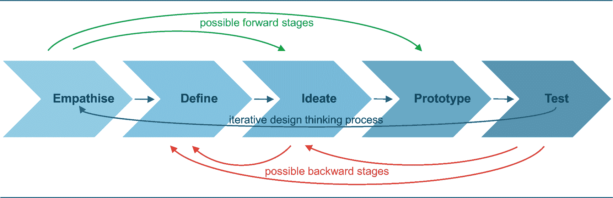
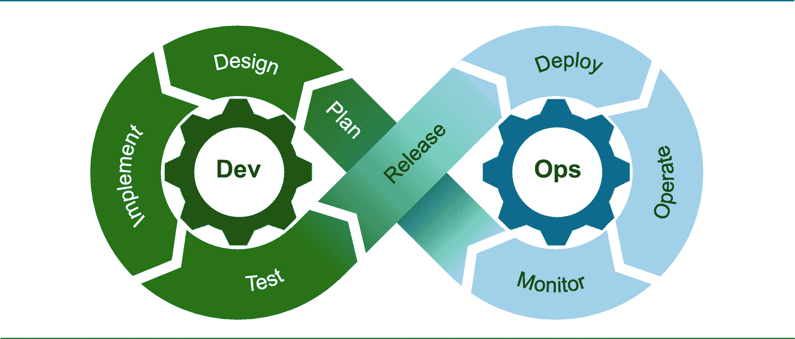
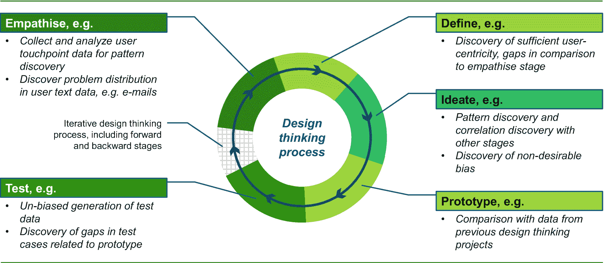
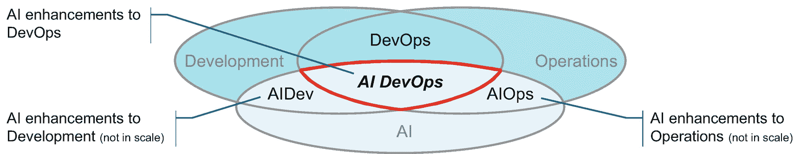
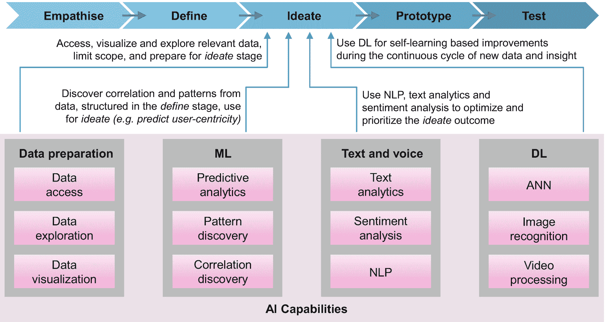
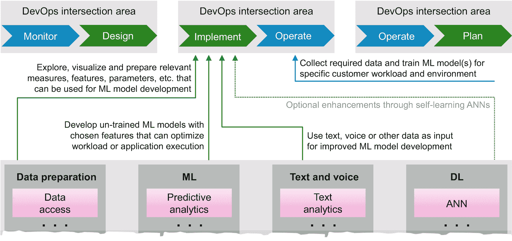

# 7.人工智能背景下的设计思维与开发

设计思维和开发运维是长期存在的概念，被大多数领先的组织很好地建立和利用。然而，仍然缺乏对这些概念的人工智能的可持续采用。但我们采用人工智能进行设计思维和开发究竟意味着什么，我们到底有什么可能性？设计思维和 DevOps 方法当然可以应用于开发 AI 系统和设备，产品和工具，或者应用程序。这大概是一个比较明显的想法。但是人工智能和它的兄弟姐妹能被利用并融入设计思维和 DevOps 概念吗——以及如何利用？这样做的前提条件、挑战和好处是什么？一个明显的先决条件是，在将 AI 和 ML 引入这些概念之前，首先建立一个良好的设计思维和 DevOps 基础设施和文化。

本章试图回答前面的问题。我们首先回顾了设计思维和 DevOps 的关键概念，并在人工智能的背景下为设计思维和 DevOps 提供了一些想法。我们进一步描述了人工智能设计思维和人工智能开发的关键方面，重点是通过注入人工智能技术和数据科学方法来丰富设计思维和开发。

## 介绍

如上所述，设计思维和 DevOps 已经融入了大多数领先的企业文化。设计思维方法更是如此；然而，DevOps 似乎被人为地应用于所有的应用程序、中间件产品、工具和解决方案，不管它是否必不可少和有意义。例如，DevOps 对于合约系统是必不可少的，在这种系统中，用户体验需要不断调整和改进，但对于记录系统甚至洞察系统来说，意义就不大了，在这种系统中，过于频繁地调用新产品或工具特性和功能可能会导致繁琐的集成工作，从而给操作人员带来相当混乱的体验。

当谈到人工智能技术和数据科学方法论时，我们需要通过将设计思维和 DevOps 方法应用于人工智能以及将人工智能应用于这些方法来理解影响的双向性质。

一方面，具有 ML 和数据科学方法论的 AI 技术可以并且应该被设计思维和 DevOps 方法所利用，以便丰富和改进这些概念。例如，AI 和 ML 可用于引入设计的预测质量(例如，预测新的或现有用户群的接受水平)或发现用户数据中的模式，从而导致定性和定量的设计评估。DevOps 的 AI 可以有助于自治系统或 DevOps 中的资源优化。

另一方面，设计方法和 devo PS——假设这些概念已经很好地建立——可以应用于人工智能解决方案和设备的设计、开发、测试、部署和运营。例如，人工智能方法可以用在设计思维过程中，为设计师提供更相关和以用户为中心的洞察力，或者在设计思维阶段发现相关性。对于 DevOps，AI 可以发现系统中断的模式和根本原因，从而从运营部门向开发团队提供更快、更有针对性的反馈。

## 重新审视设计思维和 DevOps

本节回顾了设计思维和开发运维的传统方面，提供了设计思维和开发运维概念、流程、方法和优势的定义和高层次概述。

### 传统设计思维

设计思维不是一个全新的概念；它已经存在几十年了。最初，它用于新产品开发，甚至不限于科学、工程或编程。跨学科的特点和以用户为中心的设计在 20 世纪 20 年代已经是建筑和工业设计的新兴主题。设计思维有着悠久的历史，并且在商业和工业、建筑和工程以及科学(包括计算机科学)中有着广泛的应用，但是并没有一个单一的被普遍接受的定义。出于我们讨论的目的，设计思维 [1](#Fn1) 是一种以人为中心的设计方法，由培养创造性和创新性的开箱即用思维来解决复杂问题的过程和方法组成。

设计思维的核心概念是快速原型和快速交互式用户反馈，它基于以下原则:

*   **以用户为中心**:在设计和系统开发周期中，关注最终用户或客户的需求，确保提高可用性，推动高用户接受度和愉悦的用户体验，实现用户聚合思维。

*   **多学科**:协作跨越不同的学科和角色(例如，企业家、设计、工程和编程、营销、心理学、律师),包含不同的视角，确保一种全面和普遍的方法。

*   **民主化参与**:环境(如房间、设施等。)和方法授权并鼓励*所有参与者*的团队以平等的欣赏和非评判的态度做出贡献——培养创造性和丰富的思维能力。

设计思维还有许多其他原则，例如为中间用户结果定义更小规模、有意义和可实现的目标，与赞助用户合作接收和整合反馈，以及建立敏捷和精益的设计思维流程，在新出现的问题的背景下不断改进解决方案。

图 7-1

设计思维过程

过去已经出现了几个不同阶段的设计思维过程。其中一个最初的提议是在 1969 年提出的。 [2](#Fn2) 它由以下七个阶段(步骤或阶段)组成:定义➤研究➤ ideate ➤原型➤选择➤实现➤学。另一个过程只包括三个阶段和相应的子阶段: [3](#Fn3) 灵感(理解、观察、观点)➤构思(构思、原型、测试)➤实施(讲故事、试点、商业模式)。我们正在使用如图 [7-1](#Fig1) 所示的五阶段设计思维流程。这五个阶段如下:

1.  **感同身受**:对要解决的问题有深入的了解，并与最终用户或客户感同身受。

2.  **定义**:组织围绕问题收集的信息，并运用你的洞察力和理解力。

3.  **构思**:开发关于解决方案及其功能的创新想法和设计点。

4.  **原型**:创建第一个解决方案作为原型，将有限的功能和特性作为测试的输入。

5.  **测试**:对原型进行测试和验证，并结合赞助商用户测试的反馈。

需要注意的是，这些阶段不一定必须严格按顺序执行:这些阶段可以跳过(在图 [7-1](#Fig1) 中描述为前向阶段)或并行执行。向后阶段也是可能的，特别是将测试结果或赞助用户反馈合并到定义或构思阶段。

### 传统 DevOps

DevOps [4](#Fn4) 旨在吸收和融合敏捷开发和运营，以加速新产品交付到运营环境中。它由方法、实践(或原则)、流程、工具和服务组成，使开发和运营团队能够更高效地协作，实现无缝和更频繁部署的目标。

正如我们在本章介绍中提到的，开发运维不应被误解为对 IT 运营的频繁中断。例如，迁移到较新的产品版本可能是一个复杂而耗时的过程，涉及到要满足的无数假设和先决条件。记录和洞察系统通常集成在一个相当复杂的 IT 基础架构中，即使在今天，在开发运维流程、工具和服务方面也存在巨大差距，无法保证良好的运维体验。因此，我们认为 DevOps 的适用性更多地与雇佣系统相关。

当我们在 AI 和 AI for IT operations (AIOps)的上下文中阐述 DevOps 时，我们会回到这个特定的方面。

图 7-2

DevOps 生命周期

图 [7-2](#Fig2) 说明了开发与运营的过程交错，导致开发运维生命周期，该生命周期需要由人员和系统来执行，并且应该由方法、原则、过程和工具来支撑，从而为图 [7-2](#Fig2) 所示的所有阶段提供无缝集成和所需的自动化。

DevOps 的核心概念基于以下原则:

*   **持续集成**:实现精益、敏捷、可靠的软件开发、交付、部署和运营流程以及相互一致的工具。

*   **强化协作**:培养开发和运营团队协作，以打破孤立的组织思维，转向整体系统方法。

*   **持续改进**:鼓励整个组织内的持续学习和持续反馈，以基于最佳实践和工具实施改进。

DevOps 的成功因素和失败原因有很多，也应该考虑在内。Gartner[5](#Fn5)*预测，到 2022 年，75%的开发运维计划将因组织学习和变革方面的问题而无法达到预期*

### 设计思维和开发的好处

在将焦点再次转向 AI 之前，我们简要列出传统设计思维和 DevOps 的好处。由于一些优势是由两个概念 [6](#Fn6) 驱动的，我们在一个表格 [7-1](#Tab1) 中总结了这一点:

表 7-1

设计思维和开发的好处

   
| 

#

 | 

利益

 | 

概念

 |
| --- | --- | --- |
| one | 鼓励跨学科方法，加速创造和创新 | 设计思维 |
| Two | 关注问题的解决，而不是技术可行性 | 设计思维 |
| three | 更快的代码和问题修复交付 | DevOps |
| four | 提高软件和应用质量 | DevOps |
| five | 改善通常孤立的组织之间的协作，加快上市速度 | DevOps 与设计思维 |
| six | 增强所有团队成员的参与 | 设计思维 |
| seven | 改善了以用户为中心和用户体验 | 设计思维 |
| eight | 优化和更高效地响应市场和用户需求 | DevOps 与设计思维 |
| nine | 迭代方法支持持续的学习、知识以及产品和运营改进 | DevOps 与设计思维 |
| Ten | 通过更小的组件降低复杂性 | DevOps |

## 人工智能背景下的设计思维

我们考虑的是 AI 的设计思维还是 AI 的设计思维？显然，设计思维方法应该被应用到人工智能解决方案和设备的设计和开发中。这自然会确保人工智能变得更加以人和用户为中心。然而，这一部分致力于人工智能技术和数据科学方法论对设计思维本身日益增长的影响。也就是说，我们关注的是在 AI 的影响下，设计思维是如何变化的，有哪些可能改进的地方？

### 人工智能对设计思维的影响

以下想法的范围同样适用于将人工智能融入的设计思维方法应用于解决挑战性问题，以及设计和开发新产品、工具或服务。

有大量的终端用户和客户接触点数据可用，例如，在线浏览和 cookies 数据、电子邮件线程和投诉记录、应用程序问题报告、历史购买数据和客户档案信息、位置数据等。特别是迭代设计思维过程的*移情*、*定义*和*构思*阶段，如图 [7-3](#Fig3) 所示，将基于人工智能从这些数据中获得的洞察力接收更精确和更深入的输入。例如，数据科学家可以使用这些重要的消费者和最终用户接触点数据来开发 ML 和 DL 模型，了解客户决策，预测客户行为，并发现产品或服务使用与投诉记录或应用问题报告的相关性。这种分析洞察力变得越来越相关，以改善和实现高度以用户为中心的设计思想的愿望，最终提供更好的用户体验。

图 7-3

注入人工智能的设计思维

与设计思维过程的*构思*甚至*原型*阶段相关的数据和信息可以被分析并用于预测质量、相关性、依赖性以及想法和设计点的其他设计指标(KPI)。ML 和 DL 模型的数据科学家方法为设计师和整个跨学科团队提供了更相关和更有针对性的见解，因此增加了信心并加速了各种设计思维过程阶段。

设计思维可以从分析来自过去项目的所有过程阶段的数据中受益，以从不同阶段的数据中发现异常、模式和相关性，从而基于来自当前过程阶段的新数据来预测项目执行。例如，可以用数据科学方法分析来自*移情*、*定义、*和*构思*阶段的数据，以发现不明显的相关性，例如在*构思*阶段指定的某些想法或设计点对来自*移情*或*定义*阶段的特定输入数据或结构的偏差。

人工智能也可以用来发现*测试*阶段的差距或模式，因为它与原型代码相关。甚至可以通过人工智能优化测试数据生成，以确保充分覆盖定义的场景。

### 设计思维的挑战

正如我们在前面的章节中所看到的，在采用人工智能的过程中有许多深远的挑战。表 [7-2](#Tab2) 严格关注那些与采用人工智能进行设计思维相关的挑战。

表 7-2

设计思维的挑战

   
| 

#

 | 

挑战

 | 

描述

 |
| --- | --- | --- |
| one | 设计思维方法到位 | 注入人工智能需要组织内部现有的、合理的、成熟的设计思维方法——然而，情况可能并不总是如此 |
| Two | 人工智能的复杂性 | 人工智能可能被视为过于复杂，无法在设计思维方法中采用 |
| three | 技能和知识差距 | 团队成员没有足够的人工智能和数据科学技能和知识 |
| four | 缺乏人工智能工具 | 设计思维工具可能仍然缺乏足够的人工智能能力 |
| five | 充足的学习数据 | ML 模型需要足够的数据用于学习(训练)和验证，这可能是一个挑战 |
| six | 团队内部的怀疑态度 | 多学科团队可能还没有接受人工智能作为改进设计思维的工具 |

## 人工智能背景下的 DevOps

类似于“*人工智能背景下的设计思维*”一节中的开篇问题，我们也需要在这里问一问，我们是在考虑 DevOps for AI 还是 AI for DevOps。当然，DevOps 可以而且将会应用于与 AI 解决方案和设备相关的开发和运营的交错周期。但是，在本节中，我们将重点讨论由于 AI 的应用而需要对 DevOps 堆栈进行的调整和增强。换句话说，DevOps 需要做哪些改变，例如，将人工智能工件(如 ML 和 DL 模型)考虑在内，以及哪些有意义和可取的 DevOps 增强功能可以利用人工智能和数据科学方法？

图 7-4

AI DevOps 与 AIOps 和 AIDev 的关系

在我们阐述 AI 对 DevOps 的影响之前，我们想澄清一下术语 AIOps 和 AIDev，因为它们在图 [7-4](#Fig4) 中有所描述。AIOps 是人工智能对操作流程的适应。因此，您应该将 AIOps 视为对传统操作的增强，例如 IT 操作(有时称为 ITOps)。同样适用于 AIDev，是 AI 对传统开发流程的改编。因此，AIDev 是通过应用人工智能方法和技术来增强开发。devo PS——正如我们之前看到的——是开发和运营之间的敏捷关系。AI for DevOps——我们称之为 AI DevOps——可以被视为通过将 AI 方法和技术适应于传统 devo PS 领域而对 devo PS 的增强。因此，AI DevOps 与 AIOps 和 AIDev 在这些领域有交集，在这些领域，为运营和开发注入 AI 与 DevOps 的目的相关。图 [7-4](#Fig4) 是 AI DevOps 与 AIOps 和 AIDev 之间关系的高层次描述。

### AI 对 DevOps 的影响

DevOps 和更广泛的 IT 运营领域(ITOps)是应用 AI 的理想领域；但是，我们“只”关注 DevOps。人工智能给 DevOps 带来了新的挑战。例如，ML 和 DL 模型需要对开发运维产生影响的新部署和运营能力。 [8](#Fn8) AI DevOps 自然可以被利用来分别改善开发和运营端。例如，在开发方面，人工智能可以用于分割和改进测试用例的自动化。在操作方面，人工智能可用于一个或多个软件子系统(如数据库或事务管理系统)的基线确定和异常检测。

然而，人工智能增强开发运维的最佳点是瞄准开发和运营的交叉点，目标是进一步优化开发运维周期，如图 [7-2](#Fig2) 所示。例如，来自操作环境的日志数据可以用于开发 ML 模型，以发现应用故障和子系统配置之间的相关性，开发团队可以使用这些数据来优化他们的应用功能或建议改进的子系统配置，以限制未来的应用故障。另一方面，来自开发团队的性能测试数据可以使用数据科学家方法进行分析，以推荐部署选项来支持运营团队优化新应用程序版本的部署和运营。

持续的开发、部署、集成和运营需要 AI 来加速和自动化 DevOps 周期。以下(不完整)列表包含一些额外的 AI 应用机会，以改善和加速 DevOps 周期: [9](#Fn9)

1.  **异常检测**:ML 可以检测到异常的应用程序行为，并及时反馈给开发人员，以提供自动修复来缩短影响窗口。

2.  **性能问题**:通过与性能相关的 KPI 的相关性来预测性能瓶颈，可以提醒开发人员优化软件以实现更高效的资源消耗。

3.  **建议优化**:使用 AI，开发可以为不同类型的工作负载建议优化的部署和配置以及足够的参数设置。

4.  **测试优化**:持续测试和基于人工智能的测试用例选择可以减少和简化测试，加速开发、交付和部署。

5.  **模块识别**:开发和运营的历史数据可用于在不良系统或应用行为或错误的情况下确定相关软件模块。

6.  **跨越孤岛**:跨不同 IT 基础设施组件(例如，内存利用率)和用户数量的相关性发现有助于开发在资源消耗方面优化产品。

还有其他前瞻性的想法，例如，使用人工智能将自然语言编写的功能规范翻译成可执行的代码段，或者使用人工智能将不受欢迎的操作行为自动转换成用于开发的*功能特性请求*。

### 开发运维面临的挑战

尽管 DevOps 的 AI 应用机会令人信服，但您可能会面临一些挑战，如表 [7-3](#Tab3) 中所列。考虑到开发和运营团队经常被企业边界分开，这些挑战变得更加巨大。

表 7-3

开发运维面临的挑战

   
| 

#

 | 

挑战

 | 

描述

 |
| --- | --- | --- |
| one | 声音 DevOps 方法到位 | 注入人工智能需要在您的组织和相应的客户组织中已经实施和接受的现有开发运维方法 |
| Two | 人工智能工具还不够成熟 | AI DevOps 需要开发和运营端可用的工具；它们需要集成并适应 DevOps 周期 |
| three | 人工智能设计思维可能会减缓这一过程 | 可能有一种看法认为，人工智能的设计思维可能会大大减慢这一过程——至少在最初是这样。人工智能设计思维可能确实需要在工具、学习和调整现有设计思维过程方面的额外投资 |
| four | 充足的学习数据 | 与设计思维类似，AI DevOps 的 ML 模型需要足够的数据用于学习(训练)和验证，这可能是一个挑战 |
| five | 技能和知识差距 | 团队成员没有足够的人工智能和数据科学技能和知识 |
| six | 人工智能复杂度太高 | 怀疑可能很重要，只是因为人工智能的复杂性，团队对采用人工智能的犹豫必须得到解决 |
| seven | 所需数据不可用 | 为了让人工智能成为 DevOps 的必要组成部分，必须收集、转换和探索来自分散的、通常孤立的系统的大量数据，这需要相应的工具和跨组织共享数据的意愿 |

## 人工智能设计思维的关键方面

这部分致力于人工智能设计思维的关键方面和价值。我们的目的是开发一个简单的人工智能设计思维框架或模型，将最明显的人工智能特征映射到设计思维过程，如图 [7-1](#Fig1) 所示。对人工智能设计思想的价值的简短讨论结束了这一部分。

### 人工智能设计思维模型

正如我们在表 [7-3](#Tab3) 、*devo PS 的挑战*中所述，可能会有这样的看法，即人工智能在设计思维过程中很难，因为这样做需要时间。实现一个人工智能设计思维模型可能确实需要投资，以进一步改善关于快速开发、原型、测试和改进的设计思维的特征。我们的人工智能设计思维模型 [10](#Fn10) 仅限于人工智能特征映射练习，故意忽略了模型的其他方面，例如带有组件交互图的架构概览图、全面的数据流描述等等。尽管如此，这种在设计思维过程的背景下描述关键人工智能能力的狭隘观点有助于您获得对人工智能设计思维的更结构化的理解，并使您能够欣赏人工智能可以带来的价值。

首先，我们需要就对我们的练习有意义的关键人工智能特性达成一致。为了将这些特性限制在可管理的范围内，某种程度的抽象是必不可少的。我们将我们的讨论限制在以下人工智能能力上。

*   **数据准备**:数据访问、探索和可视化

*   **ML** :预测分析、模式和关联发现

*   **文本和语音**:具有文本分析、情感分析和自然语言处理功能

*   **DL** :带人工神经网络，图像识别，视频处理

毫无疑问，除了 NLP(如推理)、规则管理、规划和调度之外，还有许多额外的人工智能能力，如机器人和认知领域，我们故意忽略了这些。为了完整起见，图像识别和视频处理列在 DL 下。

正如你在图 [7-5](#Fig5) 中看到的，我们已经在四组中描绘了关键的人工智能能力，并且已经将这些能力示例性地映射到设计思维过程的*构思*阶段。我们简要地提供了关于将 AI 映射到其余四个阶段的其他想法。

*移情*阶段将特别关注大量最终用户或客户接触点数据。毫无疑问，确保以用户为中心是移情阶段的重要目标。因此，数据探索和可视化对于理解数据记录的相关性和限制后续处理步骤的数据量是必不可少的。数据科学技术可用于发现数据中的模式、执行聚类、了解优先级以及检测可作为后续阶段输入的相关性。

由于大多数数据可能是非结构化的，因此也可以引入文本分析。

图 7-5

人工智能设计思维模型

来自*移情*阶段的洞察力使数据结构化成为*定义*阶段的一部分。预测分析可用于进一步了解相关措施和可能设计点的预测。换句话说，ML 模型的预测分析增加了推动所需的以用户为中心的信心，并支持对 *ideate* 阶段的输入进行优先排序。

*原型*阶段可以受益于相关性发现，以将前面阶段的结果映射到原型的所需功能。这可以通过将当前项目范围与类似的先前项目相关联来增强。甚至带有人工神经网络的 DL 也可以在未来发挥作用，增加自我学习，以改进和增加原型定义和范围的目标。

*测试*阶段提供了许多注入人工智能的机会:通过将测试结果与在*移情*和*定义*阶段收集和构建的数据、指标和洞察力进行比较，通过关联算法验证以用户为中心，通过聚类和映射到所需的测试覆盖范围来减少测试用例的数量，发现功能和特性的应用程序或系统使用模式，或者参数设置和其他能够更深入地理解产品使用以影响迭代构思阶段的措施。

为了让你实现这个人工智能设计思维模型，你需要建立一个循序渐进的方法，坚持你的特定 DevOps 成熟度水平，并考虑到具体的项目范围和目标。例如，大多数组织可能通过关注数据准备任务和基于 ML 的模式和相关性发现来开始 AI 设计思维模型。其他模型组件，如预测分析、文本和语音以及 DL 方面，可能会作为后续步骤跟进。

### 人工智能设计思维价值

设计思维的价值被业界广泛认可；然而，人工智能设计思维的价值是在原则上看到的，但仍需要在实地得到证明。 [11](#Fn11) 正如我们所见，设计思维过程的所有五个阶段都可以从各种 AI 能力中获益，尤其是从数据准备和 ML 能力中获益。可以获得关于各个过程阶段的相关性和相互依赖性的更深入的见解。预测分析可提高替代设计理念和测试案例的选择性。

更具前瞻性的想法，例如使用图像识别来分析架构概述图，或者使用 DL 和 ann 来改进具有自学能力的组件交互图，都被故意排除在讨论之外。

## AI DevOps 的关键方面

在本节中，我们将描述 AI DevOps 的关键方面和价值。与上一节类似，我们开发了一个简单的 AI DevOps 模型，将最引人注目的 AI 功能映射到 DevOps 生命周期，如图 [7-2](#Fig2) 所示。为了保持一致，我们采用了我们在上一节中列出的相同的 AI 功能(数据准备、ML、文本和语音以及 DL)。对 AI DevOps 的价值的简短讨论结束了这一部分。

### AI DevOps 模型

正如我们在本章前面已经指出的，我们的主要兴趣是开发和运营的交叉，而不是单个的领域。换句话说，我们打算详细说明人工智能如何改进开发阶段，并为一些或所有运营阶段带来好处，反之亦然。目标是通过 AI 简化、加速和自动化 DevOps 生命周期。类似于人工智能设计思维模型，我们将我们的讨论限制在一个示例性的映射练习，从而忽略了更全面的框架或模型的其他方面。

着手这项工作意味着我们要找出最相关的 DevOps 交叉领域，并将前面部分的 AI 能力映射到这些领域。下面的列表(虽然不完整)给出了我们关注的交集区域。在这样做的时候，我们省略了一些中间阶段:

*   **操作和计划**:操作应用程序、系统和网络允许操作人员和用户向计划团队提供反馈。要收集的数据(例如，配置和参数设置、功能使用、操作模式)可以被探索、分析和聚集，并用作 ML 建模的输入，以预测用户感知的改善。

*   **监控和设计**:监控应用程序和系统行为，以确定在设计阶段要解决的优先改进领域。要收集的相关数据是日志(例如，应用程序、系统、错误、数据库日志)、网络利用率、内存和 CPU 利用率等。

*   **实现和操作**:可以实现优化和简化操作的人工智能工件，例如 ML 模型。例如，可以开发未训练的 ML 模型，其使用客户特定的数据(例如，应用使用、SQL 查询执行)进行训练，以加速工作负载执行并优化应用和系统行为。

正如您从前面的例子中看到的，所需的数据和数据流起着重要的作用。这些数据或者需要由运营部门收集(例如，日志或资源利用数据)并由开发部门分析和使用，或者需要由开发部门准备(例如，未经培训的 ML 模型)并由运营部门利用和集成。

图 7-6

AI DevOps 模型

如图 [7-6](#Fig6) 所示，AI DevOps 模型是一个简化的抽象，它示例性地描述了 AI 能力到*工具-操作* DevOps 交叉区域的映射。并不是所有的人工智能能力都必须被用于任何一个交叉区域；将 AI 应用到 DevOps(以及设计思维)的艺术是定义有意义和相关的切入点，为组织提供价值，然后随着时间的推移而增长。例如，DL 和 ann 可以在以后的阶段实现。

对于供应商来说，挑战在于通过工具、RESTful APIs 和 GUI 隐藏人工智能的感知复杂性，这允许运营人员轻松部署和集成人工智能 DevOps 增强功能。

### AI DevOps 值

DevOps 的价值被众多龙头企业广泛认可；然而，在相应的工具和流程的支持下，真正全面地帮助弥合供应商和客户之间的差距的广泛实施仍在进行中。人工智能融合的 DevOps 是一个新兴领域，其价值更多地被观察和注意到，而不是完全物化和体验。这种情况很可能会持续一段时间。正如我们之前指出的，AI DevOps 是一个有待确定切入点的旅程。

加速 DevOps 生命周期，实现开发和运营团队之间更富有成效的握手，以及提高决策的准确性和速度，显然是 AI for DevOps (AI DevOps)的首要价值。检测操作问题的已知问题特征和模式甚至可以触发应用程序或系统环境的自动调整，而无需操作人员或最终用户的手动干预。将 DL 与 ann 结合使用有可能在更大的 IT 基础设施中实现自学能力，从而适应特定的客户操作环境并从中学习。

对客户操作环境的深刻理解是开发组织的一个明显的先决条件，例如，开发 ML 或 DL 模型，这些模型可以通过使用特定客户操作数据的操作来训练和持续改进。

## 关键要点

我们以设计思维和开发工作的一些关键要点来结束本章，如表 [7-4](#Tab4) 中所总结的。

表 7-4

关键要点

   
| 

#

 | 

关键外卖

 | 

高级描述

 |
| --- | --- | --- |
| one | 设计思维和开发工作到位 | 在注入人工智能之前，一个健全和成熟的设计思想和开发运维方法应该在你的组织中就位 |
| Two | 人工智能设计思维价值 | 设计思维是一种多学科的方法，最重要的是以用户为中心和民主化参与；人工智能将改进这些原则，使设计思维更加相关、准确和可预测 |
| three | AI DevOps 值 | DevOps 是关于开发与运营的过程交错；AI DevOps 加速了 DevOps，提高了决策的准确性和快速性 |
| four | 人工智能内窥镜 | AI DevOps 可以看做是 DevOps 和 AI 的交集；是用 AI 增强 DevOps |
| five | AIOps 和 AIDev 范围 | AIOps 着眼于注入人工智能的运营，而不是专注于开发；AIDev 着眼于注入人工智能的开发，而不是专注于运营 |
| six | 确定相关的切入点 | 人工智能设计思维和人工智能开发是一个旅程，需要有意义和可消费的切入点 |
| seven | 数据可用性 | 人工智能设计思维和人工智能开发需要数据访问、共享和准备，以获得相关的洞察力，从而显著增强这两个领域 |

## 参考

1.  Meinel，c .，Leifer，L. *设计思维研究:展望未来:超越解决方案固定的设计思维*。ISBN-13: 978-3319970813，施普林格，2018。

2.  让设计思维发挥作用:大型组织如何拥抱混乱的机构来解决棘手的问题。ISBN-13: 978-3030196080，施普林格，2019。

3.  西蒙，H.A. *人工科学*。ISBN-13: 978-0262691918，麻省理工学院出版社，1996 年。

4.  炒作创新博客:设计思维介绍。[`https://blog.hypeinnovation.com/an-introduction-to-design-thinking-for-innovation-managers`](https://blog.hypeinnovation.com/an-introduction-to-design-thinking-for-innovation-managers)(2019 年 9 月 27 日访问)。

5.  Kim，g .，Willis，j .，Debois，p .，Humble，j .*《devo PS 手册:如何在技术组织中创造世界级的敏捷性、可靠性和安全性》*。SBN-13: 978-1942788003，IT 革命出版社，2016。

6.  Forsgren 博士，f .，Humble，j .，Kim，G. *Accelerate:精益软件和 Devops 的科学:构建和扩展高绩效技术组织*。ISBN-13: 978-1942788331，IT 革命出版社，2018。

7.  高德纳:开发成功的秘密。[`www.gartner.com/smarterwithgartner/the-secret-to-devops-success/`](http://www.gartner.com/smarterwithgartner/the-secret-to-devops-success/)(2019 年 9 月 28 日访问)。

8.  IBM。加快企业应用程序生命周期的开发运维。[`www.ibm.com/cloud/garage/architectures/devOpsArchitecture/0_1`](http://www.ibm.com/cloud/garage/architectures/devOpsArchitecture/0_1)(2019 年 9 月 30 日访问)。

9.  IBM。*为什么要将设计思维应用于人工智能？*[`www.ibm.com/design/thinking/page/badges/ai`](http://www.ibm.com/design/thinking/page/badges/ai)(2019 年 9 月 30 日访问)。

10.  IBM。 *IBM Watson 白皮书。让人工智能发挥作用。*[`www.ibm.com/downloads/cas/JXRGQBVL`](http://www.ibm.com/downloads/cas/JXRGQBVL)(2019 年 9 月 30 日访问)。

11.  沃尔克·特·埃马。*优化开发运维、IT 运营和业务的人工智能和机器学习*。[`https://bluemedora.com/wp-content/uploads/2018/10/EMA-BlueMedora-Top3-AI-2018-DecisionGuide-chapter-1.pdf`](https://bluemedora.com/wp-content/uploads/2018/10/EMA-BlueMedora-Top3-AI-2018-DecisionGuide-chapter-1.pdf)(2019 年 9 月 30 日访问)。

12.  人-信息交互的可视化设计:基于模式的框架(可视化综合讲座)。ISBN-13: 978-1627057479，摩根&克莱普出版社，2016 年。

13.  戴尔技术公司。设计思维:面向未来的 AI 。[`https://infocus.dellemc.com/william_schmarzo/design-thinking-future-proof-yourself-from-ai/`](https://infocus.dellemc.com/william_schmarzo/design-thinking-future-proof-yourself-from-ai/)(2019 年 10 月 4 日访问)。

<aside aria-label="Footnotes" class="FootnoteSection" epub:type="footnotes">Footnotes [1](#Fn1_source)

有关设计思维的更多信息，请参见[1]和[2]。

  [2](#Fn2_source)

参见[3]了解更多关于司马贺原创设计思维过程的信息。

  [3](#Fn3_source)

关于这个设计思维过程的更多信息，见[4]。

  [4](#Fn4_source)

有关 DevOps 的更多信息，请参见[5]和[6]。

  [5](#Fn5_source)

有关 Gartner 的更多信息，请参见[7]。

  [6](#Fn6_source)

参见[8]了解更多关于设计思维和 DevOps 的交互和共存的信息。

  [7](#Fn7_source)

有关将设计思维应用于人工智能的更多信息，请参见[9]。

  [8](#Fn8_source)

请回忆一下第[章第 6](06.html) 、*人工智能的可操作化*中的关键信息

  [9](#Fn9_source)

有关在 DevOps 环境中使用 AI 的更多信息，请参见[10]和[11]。

  [10](#Fn10_source)

有关设计相关模型和框架的更多信息，请参见[12]。

  [11](#Fn11_source)

关于人工智能设计思维的价值和力量的更多信息，请参见[13]。

 </aside>