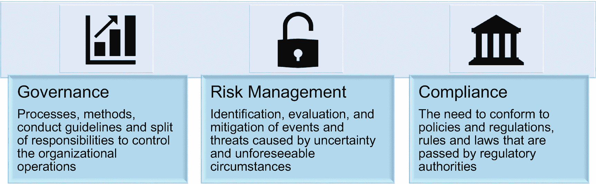
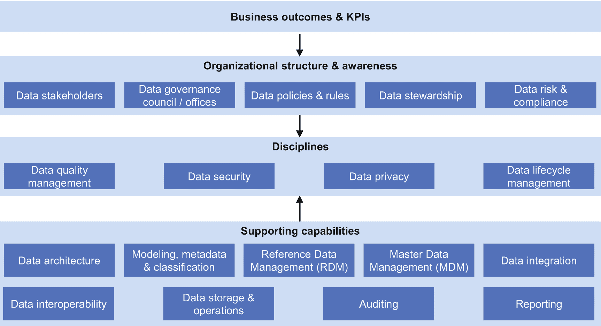
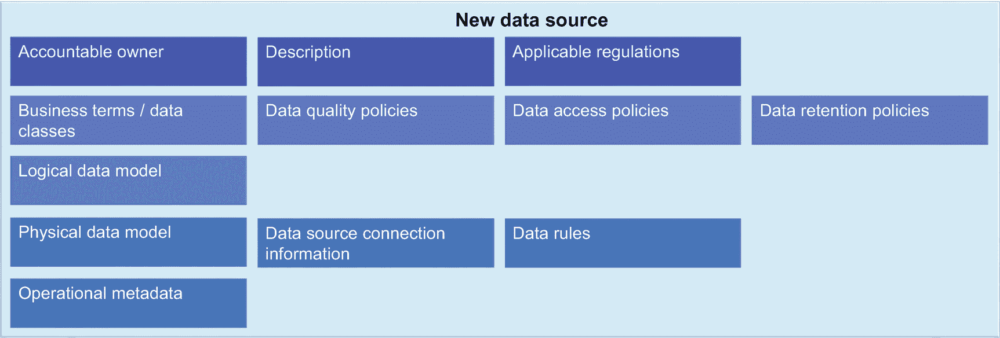
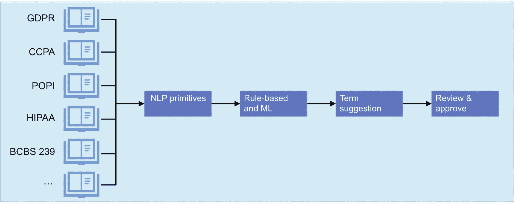
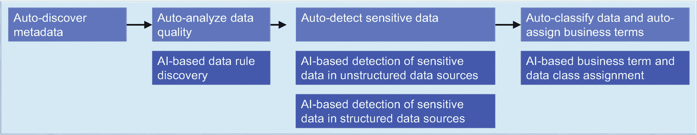
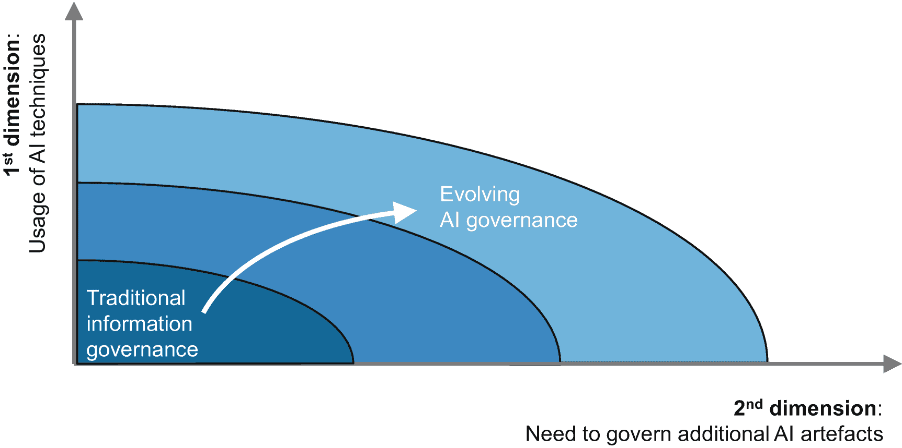
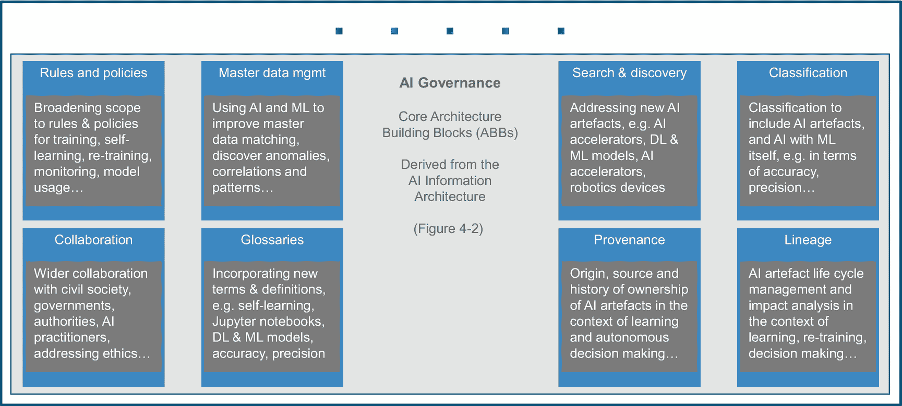
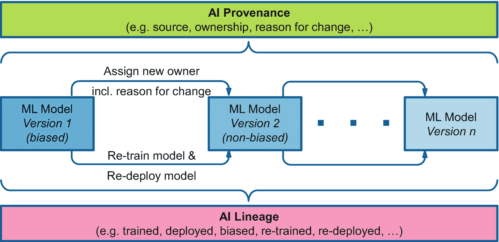

# 8.人工智能和治理

虽然人工智能已经在大量用例中得到广泛利用，但我们将看到它在所有行业中变得越来越普遍，并影响我们的社会。对业务流程的预测性和 ML 驱动的洞察力的推断可以以大量的自主决策为特征，这可能被一些用户认为是不可理解或难以理解的。由于基于人工智能的决策应该是有意义的和人类可以理解的，人工智能带来了一个新的治理维度，旨在确保透明度、信任和问责制，并考虑到可解释性、公平性和可跟踪性。

人工智能背景下的治理需要超越传统的现有数据和信息治理范围。一个例子是前面列出的*公平性*，这是人工智能治理的一个方面，它与 ML 和 DL 模型相关，是传统的以数据为中心的场景中不存在的新人工智能工件。

本章介绍了数据治理，并展示了如何嵌入人工智能功能以使数据治理更高效、更准确。在这种背景下，我们将人工智能应用于数据治理。第二个甚至更重要的维度是如何治理人工智能，这引出了人工智能治理的话题。我们将探索技术方面，并检查人工智能治理的各个方面，包括现有的数据和信息治理需要扩展、授权和升级到什么程度，以满足人工智能的需求。我们讨论了人工智能治理的具体挑战，推动人工智能治理需求的关键法规，以及可信人工智能治理的伦理方面。

我们探索人工智能治理的一些关键方面和技术能力，既不全面也不声称完整。我们将解释人工智能治理的以下关键方面:

*   规则和策略:我们展示了人工智能相关的方法和活动需要哪些规则和策略的增强。

*   术语表:术语表的内容，如术语，需要扩展和增加，以涵盖所有人工智能相关的方面和定义。

*   **搜索和发现** : ML 模型的开发成本很高。为了促进重用，模型可搜索和可发现的需求变得至关重要。这同样适用于许多其他人工智能工件。

*   **分类**:需要调整分类和分类法，以涵盖和合并人工智能资产。

*   **出处和血统**:对于对人工智能的信任，必须了解从模型的起源开始的整个生命周期，比如它是在哪些数据上训练的，谁训练了模型，模型的版本历史，以及人工智能工件的所有其他方面。出处和血统是这里需要的关键能力。

本章的主要目标之一是找出驱动人工智能治理需求的具体和新颖的挑战，以及构成人工智能治理的特征。

本章将介绍一些与 AI 治理相关的供应商产品和原则，比如 IBM 信息治理目录、IBM Watson 知识目录和 IBM Watson OpenScale。本章将通过几个示例用例及关键要点来总结。

## 治理范围

在我们深入研究 AI 治理之前，我们想详细说明治理的一般范围以及它与风险和法规遵从性的关系。在此过程中，我们对治理进行了简短的回顾，尤其是在数据和信息治理方面。

### 治理——简短回顾

近年来，治理已经发展成一种更全面的方法，它还解决了风险和法规遵从性的需要。治理、风险和法规遵从性(GRC)致力于管理所有组织和企业级别的技术和业务风险，管理持续的法规并跟上法规和技术变化的速度，这意味着要对不断增加的新的一般法规和特定于行业的法规做出充分的反应并加快考虑。

当我们在本章中讨论*治理*时，我们实际上指的是更广泛的 GRC 范围。

图 [8-1](#Fig1) 是对这三个术语 [1](#Fn1) 的描绘。

图 8-1

治理、风险和法规遵从性(GRC)

以下是这些术语的高级描述:

*   **治理**:治理 [2](#Fn2) 这个术语通常与公司治理联系在一起，甚至局限于公司治理，公司治理描述了在所有组织中控制企业运营的过程、方法、行为准则以及权利和责任的划分。在其漫长的历史中，公司治理经历了重大的发展，例如，数据和信息治理。技术的快速发展及其对社会的影响给公司治理带来了新的挑战。特别是，通过以自主决策为特征的人工智能或由数据科学家驱动和领导的人工智能实现的有趣的用例场景，如自动驾驶汽车、具有语音和人脸识别功能的认知处理、用于临床判断或诊断的图像识别，将再次对治理提出新的挑战，以将道德和法律方面以及整个社会纳入其中。我们将在“*AI*环境中的治理”一节中详细阐述这一点

*   **风险**:与风险相关的事件有许多不同的类别，例如由于内部或外部因素导致的计划事件实现预期结果的不确定性，或者金融市场的不确定性，或者网络风险、项目风险、IT 意外中断和运营风险，甚至自然灾害，等等。风险管理是对不确定性和不可预见的情况所导致的事件和威胁的识别、评估和缓解。尽管人工智能和机器学习及其预测分析和认知能力将促进各行各业的重大进步，但它可能会引发新的风险和担忧，这些风险和担忧与错误或有偏见的决策、安全和网络风险，甚至不可预测的负面结果有关。另一方面，应用人工智能和机器学习也可以加速和提高风险识别、理解和缓解的准确性。

*   **法规遵从性**:法规遵从性解决了遵守政策和法规、规则，甚至是由监管机构或政府通过的法律的需要。它需要建立方法和流程来实现运营透明、保护关键数据(例如，个人健康相关数据)以及遵守通常特定于行业的业务标准。一些例子是欧盟通用数据保护条例(GDPR) [3](#Fn3) 以保证对个人数据所有者的更多控制，并给予他们选择退出的权利，1996 年健康保险便携性和责任法案(HIPAA) [4](#Fn4) 以使医疗保健信息流现代化并保护重要的患者数据，或萨班斯-奥克斯利法案(SOX) [5](#Fn5) 以保护公众免受公司和其他企业的欺诈或错误做法

GRC 支持关于所有相关方面的整体、集成和企业范围的视图，例如流程、方法、战略性企业和组织目标、相关技术以及组织内外关键利益相关者的角色和职责。

### 数据和信息治理

数据治理 [6](#Fn6) 在早期，对于数据专业人员来说是一个麻烦的话题，他们必须说服业务和 IT 领导，为什么它是企业的一项关键能力，值得投资。幸运的是，对于许多国家的数据专业人员来说，到 2020 年，这个问题基本上消失了。如今，数据治理通常有三个主要驱动因素:流程效率、法规遵从性和改善的客户体验。通过围绕数据管理制定标准，简化了业务和 IT 流程，降低了成本。世界各地层出不穷的法规迫使企业按照这些法规来管理信息资产，这是数据治理的另一个动机。的例子 [7](#Fn7) 的规定包括:

*   欧洲通用数据保护法规(GDPR)

*   美国加州消费者隐私法(CCPA)

*   南非《个人信息保护法》( POPI)

*   巴塞尔银行监管委员会标准 239 (BCBS 标准 239)

*   保险偿付能力 II

*   金融市场中的 MiFID II

*   美国健康保险流通与责任法案(HIPAA)

行业领先的企业通常使用数据治理来推动旨在增强客户体验的数据管理改进。数据治理是 GRC 的一个关键组成部分，可确保 GRC 和组织业务环境中使用的相关数据符合所需的数据质量服务级别，并且可靠、完整和一致。

我们只介绍几个数据治理的关键概念来为我们的讨论做准备 [8](#Fn8) 。数据治理计划由三部分组成:人员(及其组织)、过程和技术。图 [8-2](#Fig2) 展示了数据治理的概念性概述。数据治理 [9](#Fn9) 的定义以及所包含的规程和功能各不相同，这超出了本文的介绍范围，无法进行比较和分析。图 [8-2](#Fig2) 从我们的角度显示了主要部件。让我们从数据治理的业务成果开始。

图 8-2

数据治理概述

要成功运行数据治理计划，必须设置定义明确的关键性能指标(KPI ),阐明业务目标和控制机制，以衡量实现这些目标的进度。每个 KPI 还需要负责任的所有者。设定目标并试图衡量实现目标的进展需要定义良好的过程。如果这些过程尽可能利用技术实现自动化，效率就会提高。以下是数据治理在流程效率、合规性和改善客户体验方面取得的一些有益业务成果的示例:

*   *清晰透明地传达数据治理的目标*通过标准化的数据管理实践和流程来简化。具有明确定义的角色、决策权、责任和控制机制的数据治理委员会或数据治理办公室促进了这些标准化数据管理实践的定义和执行，并与业务和 IT 部门合作以正确实施它们。

*   *标准化、一致和统一的数据管理实践*是企业范围内以数据为中心的计划(如 MDM、数据湖等)的先决条件。

*   *通过关于如何定义、更改和实施影响数据的流程的明确规则，组织、业务和技术层面的 IT 运营的敏捷性和可伸缩性*显著提高。随着数据量的加速增长，管理数据的规模变得越来越重要。

*   *管理数据的治理方法*允许重用数据流程和信息资产，避免重复和冗余。随着数据治理计划在组织中逐渐成熟，越来越多的冗余数据孤岛和不一致的数据流程被识别出来，并可以进行整合，从而降低 IT 成本和运营风险(需要保护的系统越来越少)。

*   *业务决策者从他们可以信任的数据中获益*,因为这些数据以正确的(经认证的)数据质量进行管理，并且他们通过数据谱系了解其来源。在任何时候，业务决策者还可以查看围绕他们正在使用的信息资产的整个数据流程文档，从而全面了解他们正在使用的数据的各个方面。

*   *有效的数据治理计划建立数据隐私政策并标准化工具集*以识别与影响数据隐私的法规相关的信息资产。此外，还实施了一致的流程和工具，以满足 GDPR 等数据隐私法规对同意管理、数据主体访问权限(例如，查看权、被遗忘权等)的要求。).这种通过数据治理实现的标准化降低了合规性的 IT 成本，并降低了违规罚款方面的财务风险。

*   *GDPR 等许多法规要求使用适当的安全控制措施管理某些数据资产*，如个人身份信息。静态和动态数据安全以及访问控制的通用标准简化了此类所需控制的实施并降低了成本。

*   *某些法规和法律还规定了影响数据生命周期管理的数据保留时间*。通过数据治理设定标准是有益的，原因有很多。首先，从法规角度来看，它确保数据在得到允许之前不会被删除，从而降低了不遵从法规的风险。第二，通过建立一次删除数据的做法，不再有业务或法规上的保留要求，这降低了存储成本，也降低了风险，因为它不能再受到损害。

*   *与获得新客户或赢回失去的客户相比，留住客户更容易*。另一个甚至更重要的好处是，集成的而不是复制的客户记录避免了因多次向客户发送营销材料而激怒客户。企业已经使用数据治理计划来分析和改进客户与企业交互的业务流程中的数据实践。例如，如果跨多个系统的重复客户记录导致同一客户多次获得相同的营销材料，该客户可能会感到恼火，并在未来的其他地方做生意。

由于每个公司都实施适合其企业的特定范围的数据治理，因此其他业务优势和成果也是可能的。

数据治理计划的实施需要组织结构和人员围绕数据治理计划建立意识，并从日常角度推动它。从组织的角度来看，不同的术语被用来描述数据治理组织结构，如数据治理委员会、数据治理办公室、首席数据办公室等。在我们的经验中，名称没有负责推动整个企业数据治理的组织单位重要。在本章中，我们使用术语数据治理办公室。数据治理办公室内的典型角色或作为与数据治理办公室相关的关键利益相关方的典型角色如下(此列表不完整):

*   **数据涉众**:负责业务流程的业务主管，业务流程包含需要治理的数据实体。例如，销售、营销、供应商、人力资源等部门的管理人员，因为他们的许多业务流程都涉及到受监管的数据，如个人数据。

*   首席数据官 (CDO):首席数据官通常是拥有强大商业背景的高管。CDO 负责定义支持和增强关键业务计划的数据策略。这通常包括整个企业的数据架构、人工智能采用和数据治理的策略。

*   **数据保护官员** (DPO):根据《GDPR 条例》第 37 条，如果企业处理欧盟公民的数据并满足某些关键标准，这是企业必须具备的角色。DPO 担任高级安全领导职务，监督必要的数据保护措施的实施，以符合 GDPR 要求。他们是公司与 GDPR 监管机构的联系人。《GPDR 法案》第 39 条概述了 DPO 的责任，包括对员工进行 GDPR 合规性教育和培训、执行审计以确保合规性，以及维护所有数据处理活动的完整记录，包括此类处理活动的目的。

*   首席信息安全官(CISO):CISO 的角色必须在 IT 安全和商业等学科之间架起一座桥梁。对业务目标有了很好的理解后，CISO 必须定义信息安全策略，以达到适当的数据安全级别，同时又不限制现代业务流程的灵活性。主要领域包括网络风险和情报管理、安全运营、防止数据丢失和欺诈、身份和访问管理(IAM)以及对董事会负责的整个 it 安全的审计流程。

*   首席合规官(CCO):首席合规官必须确保公司在开展业务时完全遵守所有国家和国际法律、法规、专业标准、公认的商业惯例和内部标准。

*   **数据管家**:数据管家(或数据管家团队)负责一个或多个数据领域(例如，员工数据、客户数据等。).数据管理员确保数据域的所有属性都用业务术语进行了很好的定义和描述，以简明地捕捉语义。数据管理员围绕数据域管理元数据、策略和规则，并管理所拥有的数据域中数据质量问题的日常解决方案。

*   **企业信息架构师** / **信息架构师**:企业信息架构 [10](#Fn10) 是企业架构 [11](#Fn11) 内的一门学科。企业信息架构师或信息架构师负责定义支持业务架构的数据架构。数据架构涵盖了所有架构方面，从元数据管理、参考数据管理、MDM、事务性数据处理，当然还有所有分析系统的端到端考虑事项。

一些角色将永远是数据治理办公室的一部分，例如数据管家，或者经常是 it 的一部分，例如 DPO，而其他角色为数据治理办公室提供关键需求。数据保护领域的 CISO 角色就是一个例子。

正如您已经注意到的，数据治理是一个广泛的主题，因此数据治理办公室将数据治理的实施分为四个核心领域:

*   **数据质量管理**:数据质量管理是在给定的业务场景中用于管理数据质量的一组过程和工具。它可以在许多不同的方面进行衡量，如完整性、格式和域遵从性、标准化、对可信来源的验证(例如，邮政地址验证)等。数据质量策略阐明了业务需求，数据质量规则定义了与数据质量策略相对应的技术规范。数据质量分析和监控工具用于评估数据资产是否符合数据质量策略。如果发现数据质量异常，就会为数据管理员创建任务。借助现代数据治理工具，数据管理员可以执行一致且可重复的数据补救流程，从而解决数据质量问题。

*   **数据安全**:数据安全 [12](#Fn12) 解决了保护数据免受外部或内部攻击者的未授权访问的所有方面。数据安全涵盖的主题包括身份认证标准和单点登录(SSO)、静态和动态数据加密、用于开发和测试目的的敏感数据的数据屏蔽标准、安全数据擦除的流程和工具、IT 中使用的所有应用程序的安全工程标准，以及记录所有系统访问和数据更改的监控工具的部署。

*   **数据隐私**:数据隐私涉及个人正确处理和存储个人信息的权利，意味着个人信息在收集的业务流程中得到严格使用和适当保护。GDPR 和其他隐私法规要求，否则必须由个人对额外和明确定义的使用给予同意，从而触发对同意管理功能的需求。此类隐私法规还授予个人数据主体访问权，如查看权或被遗忘权。数据安全和数据隐私是不一样的:为了处理数据隐私的某些方面，您需要数据安全能够通过加密来保护个人信息。但是，您可以在不部署数据隐私功能(如同意管理)的情况下实现数据安全性。

*   **数据生命周期管理**:数据生命周期管理考虑数据从最初创建到最终擦除的生命周期。根据法规的保留要求，企业必须将某些数据资产保留一定的年限。相反的情况也存在:一旦业务关系结束，就必须删除数据。随着数据量的不断增长，能够删除不再需要的数据是控制存储成本的一项关键需求。任何保存时间超过需要的数据也是一种负担，因为攻击者可以破坏它。因此，作为数据治理计划的一部分，应定义适当的数据保留策略，并实施流程来管理符合保留策略的数据资产。数据生命周期管理的另一个方面是数据访问的频率。与较慢但较便宜的存储相比，快速存储要贵得多。通常，如果数据越来越旧，访问频率就会越来越低。当数据可以(并且应该)从较快的存储系统转移到较慢的存储系统时，可以定义策略，从而优化存储成本。这是一种在数据仓库中控制存储成本的常用技术，它使用跨具有不同存储速度的系统运行的 SQL 联邦。

为了支持这四个主要领域，有许多使能能力，如您之前在图 [8-2](#Fig2) 中看到的。这些功能通常由专门的技术支持，为特定的功能领域提供优化的功能。我们对每一项进行了简短的总结:

*   **数据架构**:您的企业中的企业信息架构师或信息架构师(或者如果您的企业很大，可能是他们的团队)定义支持业务架构的数据架构。由于您的业务对事务和分析系统有各种不同的需求，数据架构不是一个单一的系统。数据架构致力于提供可扩展且经济高效的系统，尽可能避免数据冗余。定义良好的数据架构可以预见未来业务需求所需的变化，并在需要时允许快速变化。来自 Software AG、LeanIX 和 Sparx 系统的工具 [13](#Fn13) 或者像 ArchiMate 这样的开源工具有助于相关架构工件的建模。

*   **建模、元数据** [14](#Fn14) **、分类**:数据建模工具用于对企业业务所需的描述数据实体结构及其相互关系的逻辑和物理数据模型的元数据结构进行建模。逻辑和物理数据模型只是技术元数据的两个例子，其他技术元数据工件用于描述业务报告、数据转换作业等的结构。元数据管理工具，现在被称为数据治理目录，不仅用于管理技术元数据；它们还用于管理业务元数据，如业务术语、各种策略(如数据质量和数据隐私策略、保留或数据访问策略)以及数据规则。本体用于为定义逻辑数据模型中属性的语义的业务术语和数据类提供分类法。在发现新数据源时应用的语义分类算法将发现的源数据属性映射到现有的数据类和业务术语。另一种类型的元数据是操作元数据，它有许多不同的类型，在运行数据质量报告时处理操作统计数据，或者处理与目录中的信息资产相关联的标记和用户注释，指示特定信息资产对于特定任务是否有用。数据治理目录的另一组关键功能是业务沿袭和数据沿袭功能，用于理解数据的继承和关系。

*   **参考数据管理(RDM)** : [15](#Fn15) 该功能解决了企业管理参考数据的需求。参考数据示例包括医疗保健中的疾病代码列表、国家代码列表或不同许可账户类型列表。参考数据不一致是一个严重的数据质量问题。例如，如果为 DWH 提供数据的各种事务处理系统使用不同的国家/地区代码，则很难在企业 DWH 中按国家/地区正确报告收入。 [16](#Fn16) 一致地管理参考数据是公司开始实施专用 RDM 解决方案的原因。近年来，有一种趋势是 RDM 功能成为数据治理目录的一部分 [17](#Fn17) 。

*   **MDM** :这种能力提供了高效的主数据管理功能，我们将在本章后面以及第 [9](09.html) 、*将 AI 应用于主数据管理*章节中进行介绍。

*   **数据集成**:有几种不同的数据集成技术，它们是提取-转换-加载(ETL)、数据复制、数据虚拟化、数据流和实时 API。ETL 基本上是大量数据的批处理，通常用于从源到新系统的初始加载，或者批量输入到 DWH 或数据湖。作为批处理复合体的一部分，经常应用数据清理和数据转换例程。数据复制是将数据更改从一个系统移动到一个或多个其他系统的近乎实时的能力。用例包括向需要更多实时数据输入的分析系统提供涓滴流，或者保持备用系统与主系统同步进行恢复。数据虚拟化(以前称为数据联合)基本上对应用程序开发人员隐藏了多个数据源的复杂性，甚至可能有不同的 SQL 方言 [18](#Fn18) 。使用数据虚拟化，多个数据源对应用程序开发人员来说就像一个数据源，他们可以专注于应用程序功能，而数据虚拟化层在多个数据源的背后处理 SQL 查询的执行。与 ETL 和数据复制相比，数据虚拟化的优势之一是不需要创建数据副本，从而节省了存储成本。数据流是可能内置分析的实时数据移动，这在实时创建大量数据的物联网(IoT)场景中尤其有效。数据流可用于实时分析数据流中是否存在有价值的数据元素，这些数据元素应被持久化或进一步处理，而许多其他数据元素会被立即丢弃(甚至永远不会写入磁盘)。实时 API 提供事务性的、可伸缩的、高性能的数据访问，这是移动或在线渠道等参与式应用系统经常需要的。数据集成功能应该公开描述数据结构的所有元数据，如果适用的话，还应该公开数据治理目录基础设施中的所有转换，从而实现完整的数据沿袭。

*   **数据互操作性**:数据互操作性 [19](#Fn19) 越来越重要，因为越来越多的企业认识到价值生态系统的有益影响，在价值生态系统中，公司通过合作伙伴关系相互协作，为客户提供创新的解决方案。另一个驱动因素是采用混合云战略，其中一部分 IT 功能位于企业数据中心，另一部分由一家或多家公共云供应商提供。这两个驱动因素都带来了数据互操作性挑战——以前只存在于企业数据中心的系统之间——甚至更加引人注目。随着这种关注的增加，公司作为其数据治理计划的一部分，建立了数据互操作性的标准。这些标准触发了系统之间的契约，这些系统以这样一种方式创建和交换数据，即交换数据的语义含义和范围被很好地定义。

*   **数据存储和运营**:每 GB 的存储价格越来越便宜，随着云对象存储在公共云上可用，企业甚至有望获得或多或少的无限存储容量。尽管数据存储不再是一个大问题，但近年来数据量的爆炸式增长，以及对不久的将来的预测，确实抵消了存储价格的下降。将数据放在云对象存储或公共云上的其他持久服务中很便宜，但一旦你打算将数据取出来，将其移回自己的数据中心或另一家供应商的云，许多云供应商的出口 [20](#Fn20) 费用非常昂贵。一些数据经常被访问，而其他数据很少被访问(例如，数据备份)或仅在审计或法规遵从性案例需要时保留。因此，以具有成本意识的方式优化不同类型存储系统上的数据放置，根据使用模式提供不同的速度和吞吐量，是需要考虑的另一个方面。从运营角度来看，确保数据从磁盘中安全擦除，以避免在存储系统被替换后使用专业工具进行恢复，是避免因丢弃旧存储系统而导致意外数据泄露的另一个重要方面。

*   **审计**:数据治理计划需要在所有关键系统上部署适当的审计功能，以便进行审计跟踪(谁访问和修改了数据，什么时候)。最先进的审计工具 [21](#Fn21) 能够检测用户不寻常的数据访问模式，并可以实时终止访问，防止潜在的数据泄露。例如，一个异常的数据访问模式可能是数据库管理员请求读取数据库中客户数据表的所有条目。这可能表明一个心怀不满的数据库管理员想要在离开公司之前创建一份客户数据的副本。

*   **报告**:如前所述，数据治理需要交付与 KPI 相关的商业价值。如果没有报告，最好是完全自动化的报告，就无法判断数据治理计划的有效性和进度。因此，适当的报告功能是成功的数据治理计划的重要组成部分。

当今的企业拥有大量的数据资产。实现涵盖企业拥有的每个数据资产的每个属性的数据治理计划通常是不切实际的，也是不可能的。数据治理计划的目标是治理数据环境中为企业提供价值的相关方面。例如，一家医药配送公司每天从配送中心向药店和医院运送成千上万个包裹，该公司有一个令人信服的业务案例，不仅要标准化客户记录上的邮政地址，还要对照邮政字典进行实际验证。

如果包裹被送回配送中心，平均需要 10 分钟的时间来更正地址，在包裹上贴上新标签，然后再次运送包裹。如果你总结一下人工和第二批货物的成本，乘以每天几百到几千箱(由于地址上的低数据质量)，你可以很容易地看到这加起来是一笔很大的成本。因此，存在一个有效的业务案例，即尽可能有效地以最高的数据质量标准来管理地址信息的数据质量，从而显著降低运营成本并增加净利润。以此为例，好的数据治理计划不是试图煮沸海洋；他们更愿意将预算和精力集中在最相关的业务成果上。

### 将人工智能融入数据治理

鉴于属于数据治理的主题范围广泛，正如您在上一节中看到的那样，本节将重点关注在数据治理的两个领域中使用人工智能。首先，我们展示了人工智能是如何应用于元数据和数据质量管理的。其次，我们探索人工智能在数据安全中的应用。

#### 人工智能在元数据和数据质量管理中的应用

数据量的爆炸式增长不仅是对存储成本的挑战；这也导致了越来越多的数据源，这些数据源需要被编入数据治理目录。类似于图书馆中的目录，其中每本书都有描述该书的参考以及可以在哪里找到它，每个数据源都需要数据治理目录中的一个条目。无法找到或有效管理未注册的数据源。图 [8-3](#Fig3) 显示了数据治理目录中的数据源条目应该具有的一些相关区域。

不幸的是，相当多的数据湖计划失败了，因为它们不受治理，这意味着许多源每天都被加载，而没有在数据治理目录中实现每个加载源的清单描述。一段时间后，这些不受控制的数据湖计划缺少关于哪些特定数据源被加载到数据湖中以及在哪里可以找到它们的必要知识。数据科学家没有关于可用数据源、包含哪些信息、数据质量水平、使用许可等方面的权威记录。通常，元数据知识的这种模糊性最终要求数据湖计划从头开始。然而，只有当管理数据湖的方法变得更加智能时，重启才有意义，这意味着元数据管理的方法必须融入人工智能。

图 8-3

数据治理目录中的概念性数据资产卡

假设您有一个像关系数据库一样的数据源，它有 50 个数据表，平均有 20 个属性，总共有 1000 个属性。假设您是数据管理员，负责将所有技术元数据(如逻辑和物理数据模型)导入到数据治理目录中，手动分配适用的业务术语和数据类、适用的法规、相关策略等，并在数据治理目录中完成该数据源的完整描述。

为了能够正确分配业务术语、数据类和相关的数据质量策略，您还需要执行数据概要分析和语义分类任务。如果需要经常这样做，显然会涉及大量的人力，导致不可接受的昂贵努力。近年来，采用数据湖作为分析环境的基础来开发和训练人工智能模型已经找到了许多采用者。

然而，手动的、不可扩展的元数据管理并不是将人工智能引入元数据管理的唯一驱动力。前面的场景假设已经在数据治理目录中定义了业务术语。随着法规数量的快速增长，仅仅在数据治理目录中包含相关业务术语已经变成了一项难以管理的劳动密集型工作。因此，另一个问题是与基于 AI 的规则相关的业务术语的智能提议。

暗数据基本上是企业中任何不受治理的数据源，这导致了许多业务问题。例如，如果不需要暗数据，那么它会产生成本而没有收益。如果暗数据是敏感的，并且内部或外部攻击者访问了它，它可能会在声誉和财务风险方面造成重大损失。根据许多隐私法规，暗数据中的个人身份信息(PII)存在问题，可能会导致不符合法规的问题。虽然许多数据治理计划通过将大部分结构化数据源清点到数据治理目录中，在减少企业中结构化数据源的暗数据量方面取得了显著进展，但非结构化数据方面实际上仍然一无所知。私有云和公共云环境中的非结构化数据源示例有内容管理系统、电子邮件系统、Microsoft Sharepoint、Box 等。这有几个根本原因。

首先，数据治理目录供应商在其元数据管理工具中不支持非结构化源已经有很长时间了，这种情况在最近几年才有所改善。其次，数据剖析和语义分类算法一度只关注结构化数据源。第三，与结构化数据源相比，在非结构化数据源中识别 PII 要复杂得多。

如果您在关系数据库中有一列，并且该列中的大多数值似乎是姓氏，那么不难得出结论，该列在语义上很可能是数据类*姓氏、*的实例，并且适当的业务术语应该与该列相关联。在自由格式的非结构化文档中，值 *Washington* 可以是姓氏、城市名或州名。

在非结构化数据源中，决定哪个语义概念适用是一个更复杂的问题。尽管有这些障碍，GDPR 和 CCPA 正在推动公司删除或保护并妥善管理个人数据。对于数 TB 或数 Pb 的非结构化数据，公司不知道从哪里或如何开始，并且在这样的卷上索引非结构化数据的传统方法需要几个月或几年才能完成。公司还将大量非结构化数据放入公共云中。在公共云上索引大型数据源的 API 调用成本非常高。因此，需要适当的统计采样技术与人工智能融合的能力相结合，用于元数据发现和非结构化数据源的分类。

在学术研究 [22](#Fn22) 中，使用诸如数据剖析和数据质量监控等技术的数据质量管理是一个被充分研究的领域。如今，商业和开源软件工具中有许多有用的数据质量功能。然而，由于数量和规模的快速增长，以及数据源种类的不断扩大，数据质量管理正在触及其极限(与传统的元数据管理方法现在不足的原因非常相似)。例如，您的数据分析工具可能有一个数据规则，通过检查值是否符合 XXX-XX-XXXX 格式(其中 X 表示 0 到 9 之间的数字)来发现特定列是否是美国社会保险号，有效模式符合某些规则。

随着数据源种类的增加，您选择的数据分析工具拥有开箱即用的数据质量所需的所有数据规则的可能性正在降低。因此，问题出现了，如果你能使用人工智能发现基于 ML 的新数据规则，并向用户推荐它们。与非结构化数据的发现问题类似，今天非常大的数据量迫使越来越多的人采用适当的统计采样技术来进行数据分析和监控，以保持此类任务的运行时间是可接受的(这假设在 Apache Spark 等平台上已经有了可弹性水平伸缩的数据分析和监控实现)。

发现数据分析的数据质量问题是第一步。之后，您通常需要补救和纠正数据质量问题，这是数据管理员需要手动解决的另一个任务来源。手动修复数据质量问题也达到了仅仅使用手动方法不再足够的程度。我们将在第 [9](09.html) 、`Applying AI to master data management`章研究人工智能技术用于识别和纠正数据质量问题的例子一个更好的方法，而不是使用人工智能来纠正数据质量问题，是利用人工智能来防止数据输入的数据质量问题。 [23](#Fn23)

在我们了解了元数据和数据质量管理中的一些限制之后，让我们探索一些已经融入数据治理目录和数据质量管理技术的人工智能功能。我们探索的第一个人工智能功能是利用人工智能来提取和提出新法规的新业务术语，作为数据治理目录的候选项。

图 [8-4](#Fig4) 显示了这一新功能的概念流程。让我们仔细看看这个流程的四个阶段。

图 8-4

使用人工智能从法规中建议新的业务术语

1.  用于句子边界识别、标记化、词条化、词性、依存句法分析和扩展的浅层语义句法分析的 NLP 原语用于处理监管输入文本。

2.  基于规则和 ML 技术是下一个处理步骤。使用位于 NLP 原语之上的注释查询语言(AQL)的基于规则的提取引擎可以提取 ML 模型的相关特征。使用 ML 算法的实体提取，如条件随机场或 ann，使用最大熵或 ann 的关系提取，以及许多其他技术可以应用于此步骤。

3.  可以导出一个或多个新业务术语的术语建议。

4.  *审查和批准*允许数据管理员审查提议的业务术语，有选择地进行更正，然后决定每个业务术语是作为数据治理目录中的业务术语表中的新术语获得批准，还是被拒绝。

现在看一下图 [8-5](#Fig5) ，它显示了一个新数据源到数据治理目录的人工智能注册过程。

图 8-5

在数据治理目录中注入人工智能的新数据源注册

以前冗长费时的一系列手动步骤现在已经自动化，主要是审查，必要时只进行手动纠正步骤:

1.  一旦建立了源连接，就会自动发现所有元数据并将其纳入数据治理目录。

2.  所有发现的数据属性都会自动触发数据质量评估。对于所发现的模式分布表明值遵循基于 AI 的某个符合支配性模式的属性，预测新的数据规则并将其建议给数据管理员(如果在数据规则库中没有找到匹配的数据规则)。还向数据管理员提供了符合该规则的值的百分比。如果数据管理员同意所建议的规则是准确的，则该数据规则被添加到数据规则库中。

3.  鉴于结构化、半结构化和非结构化数据源的差异，需要应用定制的技术来确定数据源是否包含 PII。用于准确性和推理的随机森林分类器、使用聚类技术的预测性采样以及使用 ann 的实体提取仅仅是 AI 能力的几个例子，这些 AI 能力可以在该步骤中应用以确定数据源是否包含 PII [24](#Fn24) 。在这一步骤中，利用这种人工智能能力，数据管理员可以得到一个评估结果，判断被扫描的源是否包含 PII。数据管理员可以查看评估结果，并通过检查预测置信度或查看相关条目(如有必要)来决定结果是否准确。如果 PII 检测结果是错误的，数据管理员可以更正评估。

4.  下一步，表示语义概念和业务术语的数据类被分配给基于人工智能的数据源中发现的属性。属性元数据、前面步骤的分析结果以及数据值都被视为输入。例如，如果基于语义分类的列被检测为包含表示城市的值，则表示语义概念*城市*的数据类将被分配给该列，包括业务术语*城市*，该术语用业务元数据描述什么是*城市*，以及如何和为什么使用该属性。同样，数据管理员可以检查提议的分配是否准确，并批准或覆盖它们。对于基于人工智能的数据类和业务术语分配，数据治理目录需要提供一组不同的人工智能技术来有效地处理以下情况:
    1.  在没有标记数据可用的情况下，可以应用无监督学习技术。这种情况适用于属性已经分配了业务术语的数据资产。

    2.  不同的应用程序包(例如 SAP、Salesforce 等。)或者不同的定制应用程序可能使用非常不同的命名约定。因此，即使基于人工智能的术语赋值查看描述属性的元数据以及实际属性值，在一个实例中工作的模型可能在另一个实例中不工作。在这种情况下，需要对基于人工智能的术语分配应用具有适当相似性度量的基于实例的学习方法。

    3.  术语表可能有成千上万个术语。因此，即使有标记的数据，这也可能很快变成多类、多标签的分类问题，每个类可能只有 5-50 个实例。为了克服这一挑战，可以使用像最近邻或将问题转化为二分类问题这样的技术。

对于该过程中的步骤 2-4，可以应用主动学习能力来持续改进基于人工智能的能力的结果。这种融合人工智能的自动化流程的价值主张非常重要。例如，在步骤 4 中，如果没有基于人工智能的数据类和术语分配建议，数据管理员将需要在目录中搜索适当的数据类和术语，然后才能建立它们与属性之间的关系。输入关键字来搜索数据类或术语、查看结果列表、选择适用的条目，然后创建与相关属性的关系是非常耗时的。有了人工智能功能，在大多数情况下，数据管理员只需点击一下鼠标就可以批准建议，从而节省了大量时间和人力成本。虽然在这个主题上还有很多要讨论的，但我们希望通过这篇介绍，您能够基本理解为什么将人工智能技术应用于元数据和数据质量管理是非常有价值的。现在让我们转到另一个数据治理领域，这是近年来人工智能能力的融合，下一节是数据安全。

#### 人工智能在数据安全中的应用

数据安全是数据治理的一个重要方面。2019 年数据泄露成本报告 [25](#Fn25) 表明，美国数据泄露的全球平均成本为 390 万美元，平均每例成本为 819 万美元。成本通常分为直接成本(违反法规的罚款、结算等。)和间接成本(声誉损害等。).如果数据泄露成本高昂，那么下一个明显的问题就是数据安全问题增加的迹象。根据 IBM X-Force Threat Intelligence Index 2020，[26](#Fn26)2020 年及以后的趋势显示，与安全相关的事件预计将会增长。因此，潜在的数据泄露问题不会很快消失。数据泄露的最大来源(大约 50%)是外部攻击者。迫切需要安全专业人员来帮助预防事故，或者在事故发生时，尽快识别和补救事故。但是，企业为其 it 员工雇佣安全专业人员有多容易呢？根据 ISACA 关于 2020 年网络安全状况的报告， [27](#Fn27) 在其调查中，57%的企业表示有安全职位空缺，其中 30%的空缺时间超过 3 个月，29%的空缺时间超过 6 个月，直到找到合适的候选人。

表 8-1

注入人工智能的安全区域

<colgroup><col class="tcol1 align-left"> <col class="tcol2 align-left"></colgroup> 
| 

安全区域

 | 

人工智能的关键价值点

 |
| --- | --- |
| 数据保护/安全性 | 改进数据保护检测和防止非法数据访问 |
| 安全操作中心 | 确定警报的优先级，根据 MITRE 分类对指标进行分类，收集相关信息，并自动为安全分析师推荐最佳操作 |
| 数字身份和欺诈检测 | 在人工智能的帮助下，识别和防止对数字身份的攻击或欺诈 |
| 端点管理 | 利用人工智能更有效地保护您的终端免受攻击 |
| 用户行为 | 利用人工智能检测指示潜在威胁的用户行为异常，并对其采取行动 |
| 智能事件响应 | 使用人工智能进行智能决策，选择和组织正确的事件响应 |

这一背景提出了三个关键问题。首先，攻击者会利用人工智能进行更复杂的攻击吗？是的，他们有。例如，人工神经网络被用来改进密码破解程序。第二，AI 模型或它们被训练的数据是否是潜在攻击的目标？答案是肯定的，因为攻击者窃取 AI 模型，并通过使用模型反转攻击试图窃取可能包含 PII 数据的训练数据来潜在地暴露隐私。第三，AI 可以用来保护你特别是安全和数据安全威胁吗？同样，答案是肯定的，表 [8-1](#Tab1) 向你展示了今天人工智能解决方案可用的一些相关领域。表格 [8-1](#Tab1) 的想法是向你展示在安全方面，特别是数据安全方面，新颖的基于人工智能的解决方案可能能够有效地T5】28帮助你。

软件供应商 [29](#Fn29) 今天已经为上述领域提供了产品。作为数据治理计划的一部分，特别是与数据安全相关的部分，您应该研究如何适当地保护您的数据资产，这可能需要在安全领域使用几种人工智能软件功能。

有了对数据治理的基本了解，我们现在可以看看如何利用数据治理空间的功能来治理人工智能的影响。我们还将展示数据治理领域需要哪些额外的能力来扩展它，以便它也可以有效地用于 AI 领域。

## 人工智能背景下的治理

人工智能背景下的治理可以非常普遍和广泛，远远超出纯技术方面，这只是一种正确的手段；从根本上来说，治理是组织应该坚持的政策、标准和法规遵从性方面。

在本节中，我们将展示人工智能治理面临的挑战，以及人工智能和机器学习将如何影响传统信息治理。此外，我们简要阐述了一些驱动可信人工智能的人工智能治理的法规。

### 超越传统的信息治理

在本节中，我们将详细阐述信息治理和人工智能的相互干扰和影响。在人工智能的影响下，信息治理需要变得更广泛，包括新的人工智能相关的工件以及人工智能相关的挑战，治理范围内的扩展。正如我们在前面章节中看到的，这给 AI 治理的应用和制定带来了挑战。另一方面，通过简单地利用人工智能和机器学习算法和技术，人工智能增加了对信息治理的数据质量维度的信心，例如，通过增加数据匹配任务的可信度和准确性，正如您将在第 [9](09.html) 、*章将人工智能应用于数据治理和 MDM* 中看到的那样

人工智能代表了推进某些信息治理方面的重大机遇。例如，人工智能加快了洞察力，减少了行动的范围；在执行了相应的操作之后，它还减少了实现影响和恢复或保持变更的时间。此外，人工智能有助于快速回答问题，而不是人类试图阅读整个数据库。

图 8-6

信息治理和人工智能的相互作用

图 [8-6](#Fig6) 展示了传统信息治理向人工智能治理发展的二维特征:

*   **第一维度**:通过利用人工智能和人工智能技术实现信息治理的增长。在这个维度上，AI 和 ML 构成了对信息治理的改进。正如本章前面所展示的，ML 可以显著减少源代码分析和分类中的人工劳动量。另一个例子是应用 ML 方法来识别操作风险模式。

*   **第二个维度**:由治理额外的 AI 和 ML 工件、场景、术语和定义、规则和策略的需求驱动的信息治理的增长。

在不使情况变得过于复杂的情况下，我们甚至可以添加第三个维度来考虑不断发展的组织向人工智能攀登，提供新的机遇和新的挑战，这些需要由人工智能治理框架来解决和应对。在“*人工智能治理的关键方面*”一节中进一步解释了这种不断发展的人工智能治理范围，在该节中，我们将重点关注人工智能治理的概念和技术方面。

### 人工智能治理面临的挑战

有几个不同但仍然相关的领域或维度在人工智能治理的挑战方面发挥着核心作用。这些领域自然会相互影响。

以下列表描述了一些示例域 [30](#Fn30) ，我们用它们来描述 AI 治理的挑战:

*   **技术领域**:这包括人工智能系统和工具、DL 和 ML 模型和算法、人工智能应用、专门的人工智能引擎和加速器、包括机器人系统在内的人工智能解决方案以及其他人工智能技术。

*   **伦理和社会领域**:这涉及伦理原则、指导方针和普遍接受的人类和社会价值观，人工智能需要遵守这些原则、指导方针和价值观，以便获得更大的信心 [31](#Fn31) 并保持以人为本、可解释和对个人公平，以及增加个人和整个社会的接受度。

*   **政治和法律领域**:监管机构和国家政府 [32](#Fn32) 将创建一系列法律法规、政策和规章，这些法律法规、政策和规章由技术驱动，并由道德和社会原则指导(甚至可能受到限制)。

人工智能和机器学习已经开始影响 GRC，超过了以前的任何技术进步，例如云计算或大数据及其社交媒体交互。人工智能治理的目标是建立一个框架或模型，解决道德和社会、政治和法律以及技术方面的问题，以确保以以人为本和安全的方式使用人工智能。

表 [8-2](#Tab2) 仅列出了其中的几个挑战(并未声称其完整性),并将它们与我们之前讨论过的领域联系起来。这些领域可以调整和进一步完善。例如，技术领域可以划分为机器人系统、应用组件、DL 和 ML 模型等。根据组织关注的特定 AI 范围，必须添加额外的域，或者必须调整现有的域。

表 8-2

人工智能治理面临的挑战

<colgroup><col class="tcol1 align-left"> <col class="tcol2 align-left"> <col class="tcol3 align-left"></colgroup> 
| 

#

 | 

挑战

 | 

领域

 |
| --- | --- | --- |
| one | 人工智能算法和方法、自主决策过程、人工智能工具和应用缺乏透明度或透明度不足 | 技术 |
|  2 | 不正确的决策导致错误的危及生命的医疗诊断和治疗、交通事故等 | 合法的 |
| three | 缺少标准和原则，指导和限制人工智能的应用范围和部署 | 政治和法律 |
| four | 违反平等机会或对人们的性别或年龄产生不利影响的不正确决定 | 道德和社会 |
| five | 对人工智能系统、解决方案、应用程序等缺乏信任——类似于对数据缺乏信任 | 政治和社会 |
| six | 在危及生命的情况下，人工智能机器人系统、加速器或人工智能应用的故障 | 技术和法律 |
| seven | 扩大信息治理的问题，以包括人工智能特定的工件，例如，DL 和 ML 模型，在自动驾驶汽车事故的情况下谁该受到责备，等等 | 技术和法律 |
| eight | 学习方面(例如，DL 模型)将包含在 AI 治理的范围内 | 技术和伦理 |
| nine | 调整起源(所有权)和数据血统以适应人工智能工件，例如，DL 和 ML 模型 | 技术 |
| Ten | 人工智能系统和应用程序的自我学习带来了额外的安全风险 | 技术和社会 |

对于其中的一些挑战，分配给一个或几个领域是相当模糊的，有些挑战甚至涉及所有领域。

### 推动人工智能治理的法规

除了人工智能对组织的影响，法规也是人工智能治理的关键驱动因素之一。在这一节中，我们给出一个非常简短——尽管相当不完整——的人工智能治理相关法规的概述。在大多数国家，存在研究、探索性努力和拟议的监管声明。在本节中，我们仅提供一些计划的简要概述，并不声称其完整性。

2018 年，25 个欧洲国家签署了关于 AI [33](#Fn33) 的合作宣言，这导致了 2020 年 2 月的欧盟法规，补充了一些欧盟成员国的国家倡议。除了确保欧洲在人工智能领域的竞争力，目标还包括解决 T4 的社会、经济、道德和法律问题。

德国政府于 2018 年通过了一项人工智能战略 [34](#Fn34) ，该战略追求“*保障负责任地开发和使用有益于社会的人工智能，并在广泛的社会对话和积极的政治措施的背景下，在道德、法律、文化和制度方面将人工智能融入社会*。”2017 年，德国联邦交通和数字基础设施部发布了一份关于自动化和互联驾驶的报告， [35](#Fn35) ，其中包括自动化和互联车辆交通的道德规则。2017 年，美国证券交易委员会(SEC)发布了针对投资者和金融服务业的机器人顾问信息和指导 [36](#Fn36) 。2020 年，新加坡联邦政府发布了人工智能治理框架[37](#Fn37)“*为私人组织提供详细且易于实施的指导，说明如何在使用人工智能解决方案时解决道德和治理问题*

## 人工智能治理的关键方面

在这一节中，我们详细阐述了信息治理的技术方面，这些方面需要调整和扩展以包含 AI 方面。为了做到这一点，我们将以第[章第 4](04.html) 、“*人工智能信息架构*”中人工智能信息架构的信息治理和信息目录层的核心架构构建块(abb)为基础。我们将集中讨论 abb**的以下子集:**规则和政策、词汇表、搜索和发现、分类以及出处和血统。这里不描述与主数据管理和协作相关的 abb。

图 [8-7](#Fig7) 描绘了 AI 信息架构的 AI 治理层。对于完整的人工智能信息架构，包括来自其他层的 abb，你应该重温第 [4 章](04.html)、*人工智能信息架构*

图 8-7

人工智能治理

在接下来的部分中，重点是当您必须在人工智能驱动的组织和基于人工智能的世界中实现信息治理时，它将如何变化。然而，我们也简要强调了使用人工智能改善信息治理的优势。

### 规则和政策

随着人工智能的所有分支和认知方面，包括监督和非监督学习，强化学习，以及 DL 和 ML 算法的相应应用，将使用新的基于人工智能的方法，并执行新的活动。一些例子是对 ML 模型的培训和定期再培训，或者 DL 模型的自学方面，这使得 AI 解决方案、应用和机器人设备能够随着时间的推移以自主的方式改变和调整。

新的人工智能产品，如 DL 和 ML 模型、功能、数据资产、笔记本和 RESTful APIs，必须在人工智能应用程序中使用和部署，并以受监管的方式使用。监控 ML 模型所需的准确度和精确度水平，以确保持续的业务相关性，这构成了一组新的任务，也需要进行治理。

这些方法和活动中的一些需要通过规则和策略来治理和管理，提倡使用一个 *AI 保护*代理。这些规则和政策可由纯技术方面驱动，例如，确保 ML 模型的持续准确性和精确性。业务方面，例如不同用户使用人工智能工件的许可，包括角色和职责的管理，可能必须考虑在内。伦理问题和可能规定使用模式和使用场景限制的各种法规也可能发挥作用。规则和政策在很大程度上受人工智能的影响，并由技术、业务和更广泛的 GRC 责任驱动。

人工智能的方法和技术也可以用来改进规则和策略的管理、实现和治理。例如，ML 算法可用于发现各种规则和策略的有用相关性，以简化管理方面。尽管传统的业务规则管理系统在今天的组织中的作用越来越小，但是集成它们仍然可以增加规则和策略构建块的效率和相关性——至少目前是这样。

### 词汇表

人工智能带来了一系列新的商业和 IT 相关的术语和定义。结合这些新的术语和定义，例如，自学、Jupyter 或 Zeppelin 笔记本、DL 和 ML 模型、培训和再培训以及特定于人工智能的 KPI[38](#Fn38)来衡量模型的业务相关性，如准确度和精确度、ROC 或 PR 曲线以及准确度漂移(仅举几例)需要显著增强现有的业务和 IT 术语表功能。其中一些术语可能已经在现有的企业术语表中被了解和定义；但是，它们可能需要进行调整，并且可能在稍微不同的环境中使用。无论您使用何种技术来管理组织中使用的术语，都需要一个集中的目录或字典，以便术语在整个组织中表示相同的意思，或者如果它表示不同的意思，那么它应该被适当地结合、合并和引用。

术语和定义的业务元数据、IT 和操作元数据(处理所有人工智能资产和工件)也必须进行调整，以指定人工智能技术资产，实现对规则和策略的理解和使用，并实现附加的人工智能治理功能，如起源和血统。

此外，在人工智能驱动的组织中，各种角色和职责之间的协调需要重新调整。例如，一些技术人工智能术语，如 ROC 或 PR 曲线或精度漂移，需要被业务理解、测量、监控，甚至调整。一个 AI 词汇表 [39](#Fn39) 需要方便这些需求。

### 搜索和发现

搜索和发现是传统信息治理范围内众所周知的能力，需要针对 AI 治理进行调整。这不仅是由解决新的人工智能工件的需求驱动的，例如，人工智能加速器，DL 和 ML 模型，或机器人设备。新的人工智能解决方案以及 DL 和 ML 模型开发模式也推动了所需的调整。数据科学家需要为 DL 和 ML 模型或工件的开发、培训、验证和调整(再培训)搜索和发现相关的和有代表性的数据资产。在很大程度上，这是一个探索性的任务，其中上下文搜索和发现与视觉探索和后续的数据准备任务相辅相成。

另一个例子是需要在数十甚至数百个备选模型中搜索和发现最合适的 DL 或 ML 模型，这些模型可以使用不同的超参数、核、算法和 ML 方法来开发、优化和训练。这种特殊的能力可以通过人工智能开发或人工智能治理工具来实现。IBM 在 IBM Watson Studio 中提供了自动 AI 图形工具 [40](#Fn40) 来解决预测建模问题。

### 分类

信息和数据分类 [41](#Fn41) 是 GRC 由来已久、众所周知且不可或缺的方面。人工智能治理需要人工智能资产和人工智能知识资本的新分类维度(例如，DL 和 ML 模型、人工智能方法、人工智能解决方案等)。).人工智能治理环境中的分类直接建议应用 ML 算法来改进现有资产以及新人工智能工件的分类需求，如本章前面所见。当然，这需要足够多的候选人来使 ML 技术适用于这样的任务。根据数据，将 ML 算法应用于资产分类可能会提高准确性和业务相关性，以及自动发现新的有意义的聚类或类别以改进分类。有许多类型的分类，例如，基于内容、基于上下文、基于使用、基于安全、基于位置、基于质量或基于敏感度。

另一个角度是看如何从数据治理空间扩展分类，以对人工智能产品进行分类并提供正确的分类法，这是人工智能治理所需的新功能。要使分类适应人工智能，不仅需要覆盖人工智能产品本身，还需要应用其他类型的分类，例如，与监督与非监督模型、回归模型类型以及 DL 和 ML 模型的准确性和精确度相关的分类。

在这种情况下，分类超越了一个人工智能工件作为一个 *ML 模型*的简单分配；这意味着考虑例如回归类型(线性、逐步、多项式)、所使用的训练和验证方法、所使用的修剪策略、用于减少可能相关的组件或维度(预测器、特征)的大集合的方法、准确度或精度以及它们在 ML 模型的生命周期中的变化，等等。

### 出处和血统

亲缘性很强，甚至在出处和血统上有些重叠。在某种程度上，这些术语代表了同一枚硬币的两面。起源主要关注人工智能工件的起源、来源和所有权历史，特别是在学习、自我改进的 DL 模型、ML 模型的自动化再训练和自主决策的背景下。一个例子是 ML 模型的所有权，包括被允许使用或改变模型的创建组织或个人。

Lineage 更关心 AI 工件的生命周期管理方面，包括针对那些工件执行的活动以及在学习、再培训和决策制定的上下文中的影响分析。一个例子是用新数据对 ML 模型进行再训练，包括为什么需要再训练或再训练有意义，什么新的标记数据集被用于再训练，模型何时被重新部署，等等。

另一个例子是根据 ML 模型来理解有偏差的结果，以显示与特定特征或一组特征 [42](#Fn42) 相关的有利或不利的结果(偏差),并分析和可视化例如调整特征权重以减轻偏差的影响。在第 [4 章](04.html)、*人工智能信息架构*中，出处和血统已经作为关键 abb 在我们的人工智能信息架构中被引用 s

图 8-8

AI 来源和血统

s

图 [8-8](#Fig8) 是 AI 起源和血统共存的示例性说明。它还说明了在 ML 模型的生命周期中这些 abb 的共存和各自的作用。

## 映射到示例供应商产品

有相当多的供应商产品、产品和原则可以为 AI 治理提供附加值。在本节中，我们将介绍一些关键产品和原则。然而，我们没有提供一个全面的综述，而是专注于特定于 AI 的治理方面的相关性。为了让感兴趣的读者获得更深入的理解，我们提供了相应文档的链接。

可以想象，下面的列表远非完整:

1.  *亚马逊:使用亚马逊 SageMaker 的亚马逊网络服务*

2.  微软:微软人工智能原则、微软机器人框架和 Azure 认知服务

3.  IBM 的产品 : Watson 知识目录、Watson OpenScale 和带有 Watson 的 OpenPages

### 亚马逊网络服务

近年来，亚马逊已经做出了重大改进，用人工智能和 ML 功能丰富了他们的亚马逊网络服务(AWS)。这包括人工智能治理增强，主要通过亚马逊 SageMaker [43](#Fn43) 平台交付。Amazon SageMaker 是一个完全托管的 ML 服务，数据科学家和开发人员可以使用它来构建和训练 ML 模型，然后将它们直接部署到生产就绪的托管环境中，用于 AWS 公共云中的预测或分析应用程序。

Amazon SageMaker 具有丰富的功能。下面的列表包括这些特性，从更广泛的意义上来说，它们与 ML 生命周期管理和 AI 治理需求相关:

*   **亚马逊 SageMaker 模型监控器**:监控和分析生产中的 ML 模型(端点)，检测数据漂移和模型质量的偏差。这是一种检测模型中概念漂移的服务，并在部署的 ML 模型的性能和准确性开始偏离原始训练模型时提醒开发人员。

*   **Amazon SageMaker 调试器**:作为 SageMaker Studio 的一部分，在整个训练过程中检查训练参数和数据。自动检测并提醒用户常见的错误，如参数值变得过大或过小。

Amazon 已经向 ML 模型可解释性迈出了第一步，它通过 SageMaker Studio 中 SageMaker 调试器的指标可视化进行进一步解释。SageMaker 调试器还可以生成可能在 ML 模型训练阶段出现的警告和补救建议。使用 SageMaker Debugger，您可以解释模型是如何工作的，这代表了 ML 模型可解释性的早期步骤。

### 微软人工智能原则

微软在将人工智能集成到他们的一些产品和服务中处于领先地位。例如，这在微软的产品中显而易见，如 Skype、Cortana、Bing 或 Office 365。这涉及嵌入式聊天机器人、翻译服务和其他可供数百万最终用户使用的人工智能服务。微软不仅利用人工智能技术来增强他们自己的产品组合；他们还向开发者提供人工智能技术，让他们开发自己的人工智能产品。

人工智能治理是将人工智能服务注入产品的重要组成部分。通过仔细观察以下微软人工智能原则 [44](#Fn44) ，这一点变得显而易见:

1.  公平:人工智能系统应该公平地对待所有人。

2.  **可靠性和安全性**:人工智能系统应该安全可靠地运行。

3.  **隐私和安全**:人工智能系统应该是安全的，并且尊重隐私。

4.  **包容性**:人工智能系统应该赋予每个人权力，让人们参与进来。

5.  透明性:人工智能系统应该是可以理解的。

6.  问责制:人工智能系统应该有算法问责制。

这些微软人工智能原则可以映射到人工智能治理的关键方面，我们前面已经描述过了。

作为开发负责任的对话式人工智能的补充指南，微软提供了一些工具，如微软机器人框架 [45](#Fn45) ，这是一个用于构建企业级对话式人工智能体验的综合框架。Azure Bot 服务不仅能让你构建智能的企业级机器人，还能将其与其他 Azure 认知服务集成。

### IBM 产品

IBM Watson Knowledge Catalog[46](#Fn46)注入了治理，并实现了查找、访问和准备数据的自助服务，本质上使他们能够使用 DL 和 ML 进行人工智能。它由策略管理组成，支持对数据、知识资产及其关系的访问、监管、分类和共享。凭借信息治理、数据质量和主动策略管理，它可以帮助您的组织保护和治理敏感数据、跟踪数据血统，并大规模管理 AI。

Watson 知识目录可以与 IBM InfoSphere 信息治理目录集成或自动同步，从而简单地使用信息治理目录的现有资产。用户可以创建全面的业务和 IT 术语表，帮助弥合 LoB 和 IT 组织之间的沟通鸿沟。术语表资产是术语、类别以及治理政策和规则。除了术语表，您还可以管理关于信息资产的元数据。沃森知识目录是 IBM [47](#Fn47) 更大的统一治理和集成(UGI)组合的一部分。

IBM Watson OpenScale 它提供了关于人工智能模型的性能和准确性的见解，并确保透明，可解释和公平的结果，没有偏见。Watson OpenScale 弥合了数据科学家和应用程序开发团队与 IT 团队之间的差距，前者必须为业务部门提供注入人工智能的应用程序，后者必须部署和运营模型和评分应用程序。

以下是一些关键特性的列表。这些功能解决了本章中确定的一些最重要的人工智能治理方面:

*   **以可理解的商业术语生成可信且可解释的人工智能结果**，以便业务用户可以解释人工智能模型如何做出预测。Watson OpenScale 包括特征加权(以权重表示的特征重要性)，以了解最重要和最不重要的特征，并根据在预测中起关键作用的前 K 个特征进行解释。

*   **通过持续监控 AI 如何做出预测来确保 AI 模型的公平性**。您可以选择一个人工智能模型的特征来监控部署的模型对有利或不利(有偏见)结果的倾向。例如，输出可以指示模型偏向于特征的特定值或范围(例如，性别=女性，年龄> 45)。

*   **通过人工智能资产整个生命周期的评分模块或应用程序实现人工智能预测的可追溯性和可审计性**，从最初的设计、培训、验证和部署开始，直至运营、监控、再培训和生命周期结束。例如，对于一个给定的 ML 模型，它允许识别要分配的团队和所有权、用于培训的数据以及产生的结果。

*   **测量模型准确性**了解生产过程中模型的质量和业务相关性。Watson OpenScale 使用标记数据测量 ROC 或 PR 曲线下的面积，但也检测准确性和数据一致性下降的无标记数据漂移。

IBM OpenPages with Watson[49](#Fn49)提供了一个由各种产品组成的认知驱动的 GRC 组合。它提供了一套核心服务和功能组件，可解决运营风险、法规遵从性、It 风险和安全性、内部审计、供应商风险管理和财务控制管理等问题。

## 关键要点

我们总结了本章的一些要点，总结在表 [8-3](#Tab3) 中。正如我们所见，人工智能不仅对治理产生了深远的影响；信息治理和人工智能之间存在相互干扰:需要治理新的人工智能工件，但人工智能治理本身将从人工智能中受益。本章中指出的人工智能治理的关键方面需要根据您的特定关注点和需求为您的企业量身定制。

表 8-3

关键要点

<colgroup><col class="tcol1 align-left"> <col class="tcol2 align-left"> <col class="tcol3 align-left"></colgroup> 
| 

#

 | 

关键外卖

 | 

高级描述

 |
| --- | --- | --- |
| one | 有必要治理人工智能工件 | 人工智能工件，如 DL 和 ML 模型、人工智能解决方案、机器人设备和其他驱动人工智能治理的调整范围 |
| Two | 人工智能治理本身将受益于人工智能 | 利用人工智能和人工智能算法和方法，例如，提高数据匹配任务的可信度和准确性 |
| three | 新法规推动人工智能治理 | 这些是主要由伦理、文化和法律问题驱动的本地和全球努力和建议 |
| four | 有许多重要的人工智能挑战 | 这些挑战可以归属于以下一个或几个领域:技术、伦理和社会、或政治和法律 |
| five | 元数据管理作为数据治理目录工具的一部分，必须注入人工智能才能有效 | 使用人工智能从快速增长的法规和非结构化来源中创建新的业务术语，可以加速术语表的创作，并减少数据管理员的人工劳动。将人工智能融入术语分配中，将新的数据源作为受治理的数据资产来管理，这是另一个关键的加速器，可以保持数据管理员的工作负载可管理 |
| six | 作为数据治理工具的一部分，数据质量管理必须融入人工智能 | 使用 AI 来学习新的数据规则，可以自动发现新的数据质量规则。使用人工智能来建议数据质量问题的修复，可以加速甚至自动化某些数据质量问题的解决，从而减少手动解决的劳动时间 |
| seven | 使用人工智能发现结构化和非结构化数据中的 PII 是您遵守许多隐私法规的关键一步 | 许多隐私法规要求对 PII 进行适当的管理。例如，不遵守 GDPR 协议会带来巨大的财务风险。作为第一步，必须识别 PII 数据，这对于非结构化源来说尤其具有挑战性。随着公共云上的数据越来越多，使用 API 进行索引的强力发现是不切实际的。因此，基于人工智能的 PII 发现不仅必须能够处理需要连接器的各种不同的数据格式和系统，还必须与有效的采样方法相结合 |
| eight | 数据安全中的人工智能是对正确的安全事件进行优先排序和响应的关键能力 | 在安全运营中心(SOC ),安全专业人员被大量涌入的细粒度安全相关信息所淹没。人工智能有助于将安全专业人员的注意力集中到数据安全的真实和重要威胁上，以便他们能够对保护您的数据安全至关重要的事件做出响应 |

## 参考

1.  Weinstein，S. *法律风险管理、治理和合规*。ISBN-13: 978-1909416512，环球法律与商业有限公司，2016。

2.  通用数据保护规定(*GDPR):*[`https://eur-lex.europa.eu/eli/reg/2016/679/oj`](https://eur-lex.europa.eu/eli/reg/2016/679/oj)*(2020 年 5 月开始实施)。*

3.  健康保险流通与责任法案。[`www.hhs.gov/hipaa/index.html`](http://www.hhs.gov/hipaa/index.html)(2019 年 8 月 23 日访问)。

4.  萨班斯-奥克斯利法案 (SOX)。[`www.sec.gov/news/studies/2009/sox-404_study.htm`](http://www.sec.gov/news/studies/2009/sox-404_study.htm)(2019 年 8 月 23 日访问)。

5.  森，哈基什。*数据治理:观点和实践*。ISBN-13: 978-1634624787，工艺出版物，2019。

6.  通用数据保护规定(*GDPR):*[`https://eur-lex.europa.eu/eli/reg/2016/679/oj`](https://eur-lex.europa.eu/eli/reg/2016/679/oj)*(2020 年 5 月开始实施)。*

7.  *加州消费者隐私法案(CCPA):*[`https://oag.ca.gov/privacy/ccpa`](https://oag.ca.gov/privacy/ccpa)*(2020 年 5 月开始实施)。*

8.  *巴塞尔银行监管委员会标准 239 (BCBS 239):有效风险数据汇总和风险报告的原则。*[`www.bis.org/publ/bcbs239.htm`](http://www.bis.org/publ/bcbs239.htm)*(2020 年 5 月访问)。*

9.  *偿付能力 II:*[`https://eur-lex.europa.eu/legal-content/EN/ALL/?uri=celex%3A32009L0138`](https://eur-lex.europa.eu/legal-content/EN/ALL/%253Furi%253Dcelex%25253A32009L0138)*(2020 年 5 月接入)。*

10.  *MiFID II:*[`https://eur-lex.europa.eu/legal-content/EN/ALL/?uri=celex%3A32014L0065`](https://eur-lex.europa.eu/legal-content/EN/ALL/%253Furi%253Dcelex%25253A32014L0065)*(2020 年 5 月访问)。*

11.  *《个人信息保护法》(POPI):*[`www.justice.gov.za/inforeg/docs/InfoRegSA-POPIA-act2013-004.pdf`](http://www.justice.gov.za/inforeg/docs/InfoRegSA-POPIA-act2013-004.pdf)*(2020 年 5 月开始实施)。*

12.  John Ladley:数据治理:如何设计、部署和维持有效的数据治理计划。ISBN-13: 978-0124158290，摩根·考夫曼，2012。

13.  David Plotkin:数据管理。有效数据管理和数据治理的可行指南。ISBN-13: 978-0124103894，摩根·考夫曼，2013。

14.  Harkish Sen:数据治理:观点和实践。ISBN-10: 1634624785，Technics Publications，2018。

15.  Sunil Soares:首席数据官数据治理手册。ISBN-13: 978-1583474174，MC 出版社，2015。

16.  Sunil Soares:大数据治理:一项新兴的要务。ISBN-13: 978-1583473771，MC PR LLC，2012。

17.  Neera Bhansali:数据治理。从信息资产创造价值。ISBN-13: 978-1439879139，奥尔巴赫出版公司，2013 年。

18.  Rupa Mahanti:数据质量:维度、测量、策略、管理和治理。ASIN: B07QMNT6HM，亚马逊媒体。

19.  *达马国际:*[`https://dama.org/content/what-data-governance`](https://dama.org/content/what-data-governance)*(2020 年 5 月接入)。*

20.  *数据治理研究所:*[`www.datagovernance.com/adg_data_governance_definition/`](http://www.datagovernance.com/adg_data_governance_definition/)*(2020 年 5 月访问)。*

21.  *英联邦企业信息架构:*[`www.vita.virginia.gov/media/vitavirginiagov/it-governance/ea/pdf/Commonwealth_EIA_Strategy_FINAL.pdf`](https://www.vita.virginia.gov/media/vitavirginiagov/it-governance/ea/pdf/Commonwealth_EIA_Strategy_FINAL.pdf)*(2020 年 5 月访问)。*

22.  Mario Godinez，Eberhard Hechler，Klaus Koenig，Steve Lockwood，Martin Oberhofer，Michael Schroeck:企业信息架构的艺术。释放商业洞察力的基于系统的方法。ISBN-13: 978-0137035717，IBM 出版社，2010 年。

23.  *开放组架构框架(TOGAF):*[`www.opengroup.org/togaf`](https://www.opengroup.org/togaf)*(2020 年 5 月访问)。*

24.  ISO/IEC 27000:[`www.iso.org/standard/73906.html`](https://www.iso.org/standard/73906.html)*(2020 年 5 月访问)。*

25.  ISO/IEC 27001:[`www.iso.org/standard/54534.html`](http://www.iso.org/standard/54534.html)*(2020 年 5 月访问)。*

26.  ISO/IEC 27002:[`www.iso.org/standard/54533.html`](https://www.iso.org/standard/54533.html)*(2020 年 5 月访问)。*

27.  *软件 AG-alfa bet:*[`www.softwareag.com/be/products/aris_alfabet/eam/default.html`](http://www.softwareag.com/be/products/aris_alfabet/eam/default.html)*(2020 年 5 月访问)。*

28.  *LeanIX 企业架构套件:*[`www.leanix.net/en/`](http://www.leanix.net/en/)*(2020 年 5 月访问)。*

29.  *星火系统-企业架构师:*[`https://sparxsystems.com`](https://sparxsystems.com)*(2020 年 5 月访问)。*

30.  *归档:*[`www.archimatetool.com`](http://www.archimatetool.com)*(2020 年 5 月访问)。*

31.  Lowell Fryman，W.H. Inmon，Bonnie O'Neill:商业元数据:获取企业知识。ASIN: B003VWBXYG，摩根·考夫曼，2010 年。

32.  秦剑，马西娅雷曾:元数据。ISBN-13: 978-1783300525，Facet Publishing，2016。

33.  Geradus Blokdyk:参考数据管理。简明扼要的参考。ISBN-13: 978-0655320333，5STARCooks，2018。

34.  *约翰·鲍尔温、陈惠仁、托马斯·邓恩、迈克·格拉斯特、沙巴尔·侯赛因、丹·曼德尔斯坦、埃里克·奥尼尔、苏珊·潘迪特、拉尔夫·塔姆林、徐凤莲:使用 IBM InfoSphere 主数据管理参考数据管理中心管理参考数据的实用指南。IBM 红皮书，奥莱利，2013 年。*[`www.oreilly.com/library/view/a-practical-guide/0738438022/`](http://www.oreilly.com/library/view/a-practical-guide/0738438022/)*(2020 年 5 月访问)。*

35.  马尔科姆·齐索姆:管理企业数据库中的参考数据。ISBN-13: 978-1558606975，摩根·考夫曼，2000 年。

36.  *Ivan Milman、Martin Oberhofer、Sushain Pandit、Zhou:大数据和商业智能的原则性参考数据管理。国际组织集体智慧杂志。2017.* [`https://doi.org/10.4018/IJOCI.2017010104`](https://doi.org/10.4018/IJOCI.2017010104) *。*

37.  *colli bra–数据目录:*[`www.collibra.com/data-catalog`](http://www.collibra.com/data-catalog)*(2020 年 5 月访问)。*

38.  *IBM–沃森知识目录:*[`www.ibm.com/cloud/watson-knowledge-catalog`](http://www.ibm.com/cloud/watson-knowledge-catalog)*(2020 年 5 月访问)。*

39.  *数据互操作标准联盟:*[`https://datainteroperability.org`](https://datainteroperability.org)*(2020 年 5 月接入)。*

40.  *Amir Efrati，Kevin McLaughlin: AWS 客户为移动数据积累了巨额账单。*[`www.theinformation.com/articles/aws-customers-rack-up-hefty-bills-for-moving-data`](http://www.theinformation.com/articles/aws-customers-rack-up-hefty-bills-for-moving-data)*(2020 年 5 月访问)。*

41.  *IBM guardi um:*[`www.ibm.com/products/ibm-guardium-data-protection/resources`](http://www.ibm.com/products/ibm-guardium-data-protection/resources)*(2020 年 5 月访问)。*

42.  亚历山大·博雷克，马丁·奥博霍夫，阿吉特·库玛尔·库马尔·帕利卡德，菲利普·马克·伍达尔:数据质量评估和改进方法的分类。摘自:ICIQ 2011-第十六届**国际信息质量会议论文集，2011 年，第 189-203 页。**

**   *博世 2018 年 CDQ 良好实践奖:*[`www.cc-cdq.ch/sites/default/files/cdq_award/CDQ%20Good%20Practice%20Award%202018_Robert%20Bosch.pdf`](http://www.cc-cdq.ch/sites/default/files/cdq_award/CDQ%2520Good%2520Practice%2520Award%25202018_Robert%2520Bosch.pdf)*(2020 年 5 月访问)。*

     *   *Arianna Dorschel:机器学习中的数据隐私。*[`https://luminovo.ai/blog/data-privacy-in-machine-learning`](https://luminovo.ai/blog/data-privacy-in-machine-learning)*(2020 年 5 月访问)。*

     *   *2019 数据泄露成本报告:*[`https://databreachcalculator.mybluemix.net/`](https://databreachcalculator.mybluemix.net/)*(2020 年 5 月访问)。*

     *   *IBM X-Force 威胁情报指数 2020:*[`www.ibm.com/security/data-breach/threat-intelligence`](http://www.ibm.com/security/data-breach/threat-intelligence)*(2020 年 5 月访问)。*

     *   *ISACA——2020 年网络安全状况:*[`www.isaca.org/bookstore/bookstore-wht_papers-digital/whpsc201`](http://www.isaca.org/bookstore/bookstore-wht_papers-digital/whpsc201)*(2020 年 5 月访问)。*

     *   莉莉·海伊·纽曼:人工智能可以帮助网络安全——如果它能战胜炒作的话。[`www.wired.com/story/ai-machine-learning-cybersecurity/`](http://www.wired.com/story/ai-machine-learning-cybersecurity/)*(2020 年 5 月访问)。*

     *   毕马威。*毕马威人工智能控制-对您的人工智能技术表现建立更大的信心*。[`https://home.kpmg/xx/en/home/insights/2018/12/kpmg-artificial-intelligence-in-control.html`](https://home.kpmg/xx/en/home/insights/2018/12/kpmg-artificial-intelligence-in-control.html)(2019 年 9 月 6 日访问)。

     *   欧洲委员会。*欧盟成员国签署人工智能合作*。[`https://ec.europa.eu/digital-single-market/en/news/eu-member-states-sign-cooperate-artificial-intelligence`](https://ec.europa.eu/digital-single-market/en/news/eu-member-states-sign-cooperate-artificial-intelligence)(2019 年 8 月 28 日访问)。

     *   欧洲委员会:*关于人工智能——欧洲追求卓越和信任的方法。*[`https://ec.europa.eu/info/sites/info/files/commission-white-paper-artificial-intelligence-feb2020_en.pdf`](https://ec.europa.eu/info/sites/info/files/commission-white-paper-artificial-intelligence-feb2020_en.pdf)(2020 年 4 月访问)。

     *   德国联邦经济事务和能源部。*联邦政府采用人工智能战略*。[`www.bmwi.de/Redaktion/EN/Pressemitteilungen/2018/20181116-federal-government-adopts-artificial-intelligence-strategy.html`](http://www.bmwi.de/Redaktion/EN/Pressemitteilungen/2018/20181116-federal-government-adopts-artificial-intelligence-strategy.html)(2019 年 8 月 28 日访问)。

     *   *德国联邦交通和数字基础设施部-道德委员会。自动化和互联驾驶*。[`www.bmvi.de/SharedDocs/EN/publications/report-ethics-commission.pdf?__blob=publicationFile`](http://www.bmvi.de/SharedDocs/EN/publications/report-ethics-commission.pdf%253F__blob%253DpublicationFile)(2019 年 8 月 28 日访问)。

     *   美国证券交易委员会(SEC)。投资管理司。指导更新-机器人顾问。[`www.sec.gov/investment/im-guidance-2017-02.pdf`](http://www.sec.gov/investment/im-guidance-2017-02.pdf)(2019 年 8 月 28 日访问)。

     *   新加坡个人资料保护委员会。*模型人工智能治理框架*。[`www.pdpc.gov.sg/Help-and-Resources/2020/01/Model-AI-Governance-Framework`](http://www.pdpc.gov.sg/Help-and-Resources/2020/01/Model-AI-Governance-Framework)(2020 年 7 月 8 日访问)。

     *   统计学习导论:在 R 中的应用。 ISBN-13: 978-1461471370，施普林格，2013。

     *   IBM。*奥拓概述*。[`https://dataplatform.cloud.ibm.com/docs/content/wsj/analyze-data/autoai-overview.html`](https://dataplatform.cloud.ibm.com/docs/content/wsj/analyze-data/autoai-overview.html)(2019 年 9 月 6 日访问)。

     *   亚马逊。*亚马逊 SageMaker 开发者指南*。[`https://docs.aws.amazon.com/sagemaker/latest/dg/whatis.html`](https://docs.aws.amazon.com/sagemaker/latest/dg/whatis.html)(2019 年 12 月 5 日访问)。

     *   微软。*微软人工智能原理*。[`www.microsoft.com/en-us/ai/our-approach-to-ai`](http://www.microsoft.com/en-us/ai/our-approach-to-ai)(2019 年 12 月 1 日访问)。

     *   微软。*计算出的未来。人工智能及其在社会中的作用*。[`https://3er1viui9wo30pkxh1v2nh4w-wpengine.netdna-ssl.com/wp-content/uploads/2018/02/The-Future-Computed_2.8.18.pdf`](https://3er1viui9wo30pkxh1v2nh4w-wpengine.netdna-ssl.com/wp-content/uploads/2018/02/The-Future-Computed_2.8.18.pdf)(2019 年 12 月 3 日访问)。

     *   微软。*微软 Bot 框架*。[`https://dev.botframework.com/`](https://dev.botframework.com/)(2019 年 12 月 3 日访问)。

     *   IBM。 *IBM 统一治理和集成*。[`www.ibm.com/ae-en/analytics/unified-governance-integration`](http://www.ibm.com/ae-en/analytics/unified-governance-integration)(2019 年 8 月 31 日访问)。

     *   IBM。IBM Watson OpenScale 。[`www.ibm.com/cloud/watson-openscale/`](https://www.ibm.com/cloud/watson-openscale/)(2019 年 8 月 31 日访问)。

     *   IBM。IBM OpenPages with Watson 。[`www.ibm.com/downloads/cas/QQMA8EOW`](https://www.ibm.com/downloads/cas/QQMA8EOW)(2019 年 8 月 31 日访问)。

     *

 *<aside aria-label="Footnotes" class="FootnoteSection" epub:type="footnotes">Footnotes [1](#Fn1_source)

有关 GRC 的更多信息，请参见[1]。

  [2](#Fn2_source)

治理对不同的人可能意味着不同的东西；然而，考虑到本书的范围，我们坚持从企业的角度来看。

  [3](#Fn3_source)

GDPR 涉及几个重要领域，如数据处理活动的合法基础和透明度、数据安全性、问责制和治理以及隐私权。参见[2]了解有关欧盟通用数据保护法规(GDPR)的更多信息。

  [4](#Fn4_source)

参见[3]了解更多关于健康保险流通和责任法案(HIPAA)的信息。

  [5](#Fn5_source)

有关萨班斯-奥克斯利法案(SOX)的更多信息，请参见[4]。

  [6](#Fn6_source)

有关数据治理的更多信息，请参见[5]。

  [7](#Fn7_source)

这些法规的详细信息可在以下参考文献中找到:[6]、[7]、[8]、[9]、[10]和[11]。

  [8](#Fn8_source)

如果您想深入了解数据治理，这些书提供了关于数据治理的许多重要方面的精彩内容:[12]、[13]、[14]、[15]、[16]、[17]和[18]。

  [9](#Fn9_source)

DAMA International 是一个非营利、独立于供应商的全球技术和商业专业人员协会，致力于推进信息和数据管理的概念和实践。数据治理研究所也是一个厂商中立的研究所，但只专注于数据治理的主题。两者都有数据治理的定义，但它们并不相同。你可以在他们的网站上找到更多信息，分别在这里[19]和这里[20]。

  [10](#Fn10_source)

以下资料提供了关于企业架构和企业信息架构主题的全面报道:[21]、[22]和[23]。

  [11](#Fn11_source)

第[章第 4](04.html) 、“*人工智能信息架构”、*提供了更多关于信息架构如何为人工智能扩展并适合企业架构领域的上下文。

  [12](#Fn12_source)

ISO 标准 27000、27001 和 27002 是数据安全的相关标准。你可以在这里找到它们:[24]、[25]和[26]。云服务提供商经常被问到他们的云服务是否符合这些标准。

  [13](#Fn13_source)

您可以在这里了解关于这些工具的更多信息:[27]、[28]、[29]和[30]。

  [14](#Fn14_source)

管理业务元数据在这本书[31]中有很好的描述，并且这里讨论了具有更广阔视角的元数据管理[32]。

  [15](#Fn15_source)

如果您想更深入地了解参考数据管理，我们推荐以下资源:[33]、[34]和[35]。

  [16](#Fn16_source)

大数据和商业智能解决方案对参考数据管理的需求在此处的一篇研究论文中进行了深入讨论[36]。

  [17](#Fn17_source)

来自 Collibra 的数据治理目录解决方案和来自 IBM 的 Watson 知识目录就是这种趋势的例子。你可以在这里找到更多关于他们的信息。

  [18](#Fn18_source)

像 Microsoft、Oracle、SAP 或 IBM 这样的数据库供应商在其 SQL 实现方面都有一些特定于供应商的细微差别。

  [19](#Fn19_source)

数据互操作性标准协会专注于这个特定的主题。您可以在他们网站上了解更多关于互操作性的信息。

  [20](#Fn20_source)

你可以在这里读到更多的相关内容。

  [21](#Fn21_source)

IBM Guardium 就是这样一个具有这种能力的工具；更多信息见[41]。

  [22](#Fn22_source)

这篇学术研究论文全面概述了数据质量评估方法，您可以在这里找到它[42]。

  [23](#Fn23_source)

博世在 2018 年获得了 CDQ 良好实践奖，因为它在数据输入方面使用了人工智能，防止了某个数据领域的数据质量问题。你可以在这里找到更多的细节。

  [24](#Fn24_source)

使用机器学习本身就给数据隐私带来了风险，因为经过训练的模型可能容易受到去匿名化攻击，这可能会泄露 PII。你可以在这里了解更多。

  [25](#Fn25_source)

见[45]报告，其中载有关于成本和其他各方面的更多细节。

  [26](#Fn26_source)

此报告可在此处找到[46]，它提供了许多关于各种攻击类别的有用细节，内部威胁与外部威胁的分类等等。

  [27](#Fn27_source)

包含引用细节的报告可在此处找到[47]。

  [28](#Fn28_source)

人工智能并没有解决 IT 领域的所有问题，尤其是数据安全。有许多批评的声音，如[48]表明您需要仔细评估软件供应商提供的功能，以了解他们在哪些方面提供了可靠的附加值，以及您在哪些方面仍然需要依靠您的安全团队的专业知识。

  [29](#Fn29_source)

例如，IBM 提供了 IBM Guardium、IBM QRadar Advisor with Watson、IBM QRadar User Behavior Analytics、IBM Resilient、IBM Trusteer 和 IBM MaaS360 with Watson，以解决所有这些具有人工智能功能的领域。

  [30](#Fn30_source)

其他领域与行业部门、地理差异以及人工智能和治理方面的人类专业知识有关，由于本书篇幅有限，我们不会详细阐述。

  [31](#Fn31_source)

参见【KPMG 控制框架中的 *AI。*

  [32](#Fn32_source)

我们在“*法规驱动人工智能治理*”一节中提供了几个例子

  [33](#Fn33_source)

请参见[50]了解更多有关欧盟委员会人工智能合作宣言的信息，2020 年 2 月发布的人工智能法规位于此处[51]。

  [34](#Fn34_source)

见[52]关于德国联邦政府采用人工智能战略的更多信息。

  [35](#Fn35_source)

有关德国联邦运输和数字基础设施部关于自动驾驶和互联驾驶的报告的更多信息，请参见[53]。

  [36](#Fn36_source)

参见[54]有关 SEC 公布的机器人顾问的更多信息。

  [37](#Fn37_source)

有关模型人工智能治理框架的更多信息，请参见[55]。

  [38](#Fn38_source)

关于最重要的 AI、DL 和 ML 术语的解释，参见[56]。

  [39](#Fn39_source)

我们互换使用术语表、字典和目录。

  [40](#Fn40_source)

关于 IBM Watson Studio 中的 Auto AI 图形工具的更多信息，请参见[57]。

  [41](#Fn41_source)

在这种情况下，我们将分类称为数据的分类。

  [42](#Fn42_source)

请注意，偏见并不总是一个不利的结果；在具有各种附加属性的较大数据集可用的情况下，更好地进行概括也可能是有用的。

  [43](#Fn43_source)

见[58]关于亚马逊 SageMaker 的更多信息。

  [44](#Fn44_source)

有关微软人工智能原则的更多信息，请参见[59]和[60]。

  [45](#Fn45_source)

有关微软 Bot 框架的更多信息，请参见[61]。

  [46](#Fn46_source)

有关 IBM Watson 知识目录的更多信息，请参见[38]。

  [47](#Fn47_source)

有关 IBM 统一治理和集成的更多信息，请参见[62]。

  [48](#Fn48_source)

有关 IBM Watson OpenScale 的更多信息，请参见[63]。

  [49](#Fn49_source)

关于 IBM OpenPages with Watson 的更多信息，请参见[64]。

 </aside>*