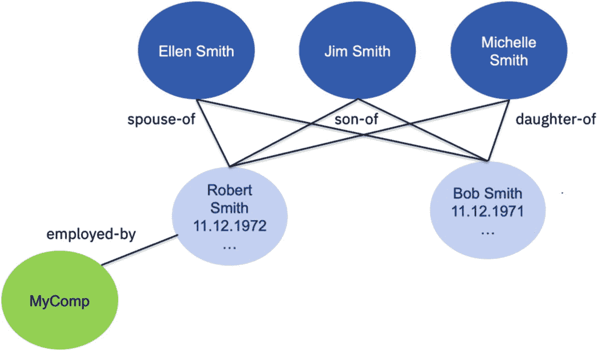

# 九、人工智能在主数据管理中的应用

我们在第[章第 8](08.html) 、“*人工智能和治理*”中介绍了数据治理和人工智能功能的使用，使数据治理更加智能。许多企业使用的一个相关功能是主数据管理(MDM)。根据行业的不同，垂直客户、个人、组织、产品、供应商、患者、员工、公民和资产是主数据实体的典型示例。MDM 用于提供可信的主数据 360 度视图，有助于许多关键运营流程，如客户服务、交叉销售和追加销售、多渠道架构中的一致客户体验或简化的新产品介绍。

MDM 的 360°视图对于许多分析应用也至关重要。它本质上是企业 DWH 中用于报告的可信维度数据，或者是专注于客户洞察的数据科学项目的必需来源，这些领域包括下一个最佳报价、下一个最佳行动、客户细分、流失分析或主题以及情感检测。

如果客户决定采用 MDM，这不是一个一次性的项目。MDM 决策意味着建立一个项目，通过向企业推广 MDM 来推动持续的业务改进。MDM 计划的一个关键成功因素是有效的数据治理计划。要使 360°视图值得信赖，它必须具备适当的数据质量、数据沿袭和访问控制，这些也是数据治理的各个方面。许多主数据类型也受到监管，例如，患者数据受 HIPAA 法规管辖，个人数据受许多隐私法规的影响，如 GDPR、CCPA 等。简而言之，MDM 和数据治理项目交叉有许多令人信服的原因。

在这一章中，我们将介绍 MDM 的关键方面，随后的一节将展示 AI 融合的数据治理功能如何用于当今的 MDM 解决方案，以及 MDM 本身的哪些领域已经被 AI 所融合。作为本章的第三个主要方面，我们解释了如何利用 MDM 来操作基于人工智能的客户洞察，从而有效地引入数字孪生的新兴概念。

在下面的章节中，我们简要地 [1](#Fn1) 介绍主数据管理(MDM)的关键概念。

## 主数据管理简介

自 2000 年左右以来，MDM 就被数据管理专业人士所熟知，根据分析公司的预测，未来 2-3 年内，软件和服务的 MDM 市场总额预计将增长到 70-80 亿美元。许多软件供应商，如 Informatica、Tibco、IBM、SAP、Riversand、Semarchy 等，都为 MDM 提供了成熟的软件解决方案。越来越多的 MDM 产品在 Kubernetes 平台上成为面向私有云消费的容器化解决方案，或者在公共云上成为软件即服务(SaaS)解决方案。鉴于 MDM 市场的成熟度，图 [9-1](#Fig1) 为您提供了当今 MDM 软件解决方案最常见功能的总结。

图 9-1

主数据管理功能

MDM 软件解决方案的用户体验(UX)通常具有配置和管理 MDM 软件的功能。配置功能通常允许创建和定制所使用的 MDM 数据模型。例如，管理选项允许为用户设置访问权限，或者打开(如果需要)用于记录所有数据更改和服务请求的审计跟踪的功能。实体维护和层级 UX 功能允许搜索、读取、创建、更新和删除主数据记录和实体(实体也称为黄金记录；它们是应用于主数据记录的匹配结果)。

维护组织层次结构、销售地区层次结构、信用风险层次结构或产品类别层次结构只是 UX 中使用层次结构管理功能的几个例子。创作新产品和维护产品目录是需要专用 UX 组件的另一个功能领域。管理 MDM 系统数据质量的数据管理员需要全面的任务管理和数据质量补救流程，这些流程可在数据管理员 UX 中访问。

UX 功能为所有需要的功能消耗了丰富的 API 层。然而，渠道应用(如在线和移动渠道、CRM 系统、呼叫中心等)使用的实时 CRUD(创建、读取、更新、删除的缩写)和搜索 API 承担了工作负载，这些系统的 85–90%的工作负载是读取请求，10–15%是写入请求。如果写操作请求修改主数据，通知管理会通知订阅的应用。批量处理的导入和导出 API 用于将主数据初始批量加载到 MDM 系统、增量批处理(例如，来自 Dun & Bradstreet 的每月第三方提要)或批量导出到企业 DWH 或 ds 环境。

匹配引擎用于检测记录是否重复；它以批量、增量批处理和实时模式提供这些功能。我们将在下一节更详细地探讨匹配问题。当匹配引擎确定两个或更多记录是否重复时，结果可能是不匹配、自动匹配或文书决定，这意味着找到了一些相似性，但不足以进行自动匹配解析。在这种情况下，当需要任务和工作流管理时，会为数据管理员创建一个任务。支持数据质量管理的任务和工作流组件提供了人工工作流补救已识别的数据质量问题所需的所有方面。ML 组件是添加到 MDM 系统的最新组件。在下一节中，我们将探讨如何使用 ML 组件为 MDM 注入 AI。有些任务，如初始加载、批量交叉匹配或大型导出，需要作业管理功能来调度这些长时间运行的任务；查看他们的状态和结果。

基于图形的主数据关系探索(基于图形数据库引擎)、存储数据的持久性和支持易用文本搜索功能的文本搜索后端也是 MDM 系统中的常见组件。

鉴于主数据被认为是任何企业最有价值的数据资产之一，并且许多主数据领域(如个人或患者)都受到法规的影响，因此还需要广泛的安全特性。所需的典型安全功能包括静态主数据加密、支持加密通信(例如 SSL)和可选的消息加密、记录和属性级别的细粒度数据访问控制，以及所有数据更改和读取服务请求的完整审计功能。

### 数字孪生和客户数据平台

与 MDM 相邻的一个新兴趋势是 digital twin 和客户数据平台(CDP)概念的兴起，这是一个仅次于 MDM 的新软件领域，目前处于 Gartner 炒作周期中，其技术正处于膨胀预期的顶峰。与 MDM 相比，它是一个预计会快速增长的小型软件市场。CDP 解决方案的驱动力是数字孪生的概念，这在物联网领域很好理解，数字孪生的概念用于创建真实世界物理结构的数字表示。例子包括装配线或公用事业网络(煤气、电、水等。)，使用传感器对其进行全面检测。将数字双胞胎的概念应用于客户主数据，基本上是用更多属性扩展客户的 360°视图，以获得关于客户如何偏好购买、获得支持或收集产品信息的丰富视角，或者客户如何在社交平台上围绕购买的产品进行积极互动(或者如果不满意，对其进行负面评价)。

它要求将所有业务系统中的所有客户交互与客户档案联系起来，客户可以直接或间接地与企业进行交互。图 [9-2](#Fig2) 显示了传统 MDM 数据模型范围的概念视图，以及 digital twin 概念所需的扩展。

图 9-2

利用数字孪生属性扩展 MDM 360 客户视图

请注意，这个观点不是“非黑即白”的。例如，以前 MDM 系统中肯定管理过一些参与偏好或隐私偏好。这里的关键点是，这些偏好的深度显著增加了。客户通过参与系统参与的所有互动接触点的全面链接是另一个领域，它在今天变得越来越重要。这并不意味着您会将来自呼叫中心的语音记录推送到 MDM 系统中，但是您需要知道客户打过电话、打电话的原因、结果、您的员工中谁与客户谈过话等等。这种总结互动信息必须与客户档案相联系，使其成为一个数字双档案。

许多公司已经投资人工智能来推动客户洞察。然而，如果没有一个在接触点将这些客户洞察付诸实施的战略，这些洞察就没有多大用处。在本章的最后一节，我们将展示如何解决这个问题。

在此之前，让我们比较一下 CDP 和 MDM 平台的优缺点，如图 [9-3](#Fig3) 所示。

图 9-3

CDP 和 MDM 比较

CDP 供应商众多，这里仅举几个例子:Blueconic、Segment、CrossEngage、QuanticMind、Scal-e、CustomerLabs CDP、Sprinklr Platform、InsideView 和 Exponea。CDP 供应商通常向营销部门的主要领导销售产品，这些领导对他们在客户细分和激活方面的优势特别感兴趣。此外，能够通过大量开箱即用的连接器(例如，Segment 有超过 300 个开箱即用的连接器)查看来自所有参与系统的客户的所有交互对营销人员很有吸引力。

MDM 解决方案的购买者通常是企业的 IT 部门，他们必须从整体上解决企业的主数据问题。因此，出色的数据治理、匹配和重复数据删除以及管理能力是必不可少的要求，也是许多 MDM 软件供应商的主要优势。

为了避免中断，MDM 供应商开始改进他们的 MDM 软件解决方案，以更好地服务于数字孪生需求，方法是增加灵活性，以更少的工作量添加相关的数字孪生属性到他们的 MDM 解决方案中。他们现在还允许将摘要交互记录包含到 MDM 系统中。另一个角度是改善与人工智能生态系统的集成，我们将在本章的最后一节讨论。

## 将人工智能融入主数据管理

MDM 解决方案的核心是它们匹配和消除主数据重复的能力，以及它们的数据管理能力。今天已知的是确定性和模糊概率匹配技术。确定性技术是简单的事情，比如属性的精确字符串比较。然而，主数据通常是在部署 MDM 系统之前创建的。创建这些记录的应用没有经过优化，因此没有适当的数据质量控制。

因此，源数据通常以不同的数据质量水平到达 MDM，并且存在许多数据质量问题。图 [9-4](#Fig4) 展示了两个示例记录中数据质量问题的冰山一角。在第四列中，我们列出了一些必需的模糊相似性技术来评估显示的两个记录是否匹配。在最后一栏中，我们展示了属性的权重。权重可以被分配给单个属性(例如，出生日期、性别)或一组属性(例如，姓名属性或地址属性)。如果两个或多个记录相同，则并非所有属性对决策都同样重要。

图 9-4

匹配模糊源数据所需的匹配技术

例如,“性别”列通常只有少量不同的值。因此，在该属性中找到值的匹配意义不大，并且对比较记录的总体评估的权重贡献很小。像 SSN 这样的其他属性也非常重要。在本例中，SSN 的编辑距离等于 2(如果比较这些值，则为两个输入错误)。为属性配置加权模式时，可以分配负值或正值。例如，为了指示模糊相似性何时被认为相距太远，该属性实际上应该具有负值，这意味着它对保持记录分开的潜在决策有更大的贡献。在所示的示例中，编辑距离为 2 或更大时会配置负权重，编辑距离为 0 时会提供较大的正权重，编辑距离为 1 时仍会有一些正权重。

虽然基于各种模糊比较技术，在姓名和地址属性中发现了一些相似性，但是与更相似的值相比，它们贡献了较少的正权重。影响权重的另一个方面是匹配的概率。考虑一个德国数据集。姓*成*与姓*米勒*相比，姓*在德国数据集中非常少见，而对于*米勒*你可能有很多条目。这意味着，如果您根据姓氏比较记录，那么与匹配两个姓氏值为 *Cheng* 的记录相比，比较姓氏为 *Müller* 的记录的概率要高得多。因此，权重应用了一个比例因子。对于罕见值，权重会按比例增加，而对于常见值，权重会按比例减少，因为更有可能找到与频繁出现的值相似的记录。本例中的总分是 3，4 + 4，1 + 0，2 + 2，55，2 = 5。总分通常与两个阈值进行比较。如果总分低于下限，则为不匹配。如果总分高于阈值上限，则自动匹配，可配置的存活规则将自动创建一个实体记录，重复项链接到该实体记录。如果总分在下限和上限之间，这表明记录显示了一些相似性，但是数据管理员需要做出记录是否链接的最终决定。在这种情况下，将为数据管理员创建一个任务。*

匹配的另一个方面是按规模和性能进行匹配。如今，规模意味着在最大的客户实施中有数十亿条记录。这给匹配带来了多重挑战。首先，如何在非常大的数据集上运行批量匹配，这是 MDM 系统初始加载的一个要求？这个问题通过数据分区和并行执行来解决。第二，如果向 MDM 添加新记录，或者在需要再次匹配的地方更新现有记录，那么如何让这种工作具有以毫秒为单位的实时性能呢？显然，对一个新记录与 20 亿条记录的主数据集中的每一条记录进行强力比较在毫秒范围内是行不通的。此外，所有记录中只有一小部分有机会实际匹配。因此，找到潜在候选者的这个小子集，在那里执行匹配是有意义的，是一个有趣的问题。为了解决这个问题，使用了分桶技术，其本质上是对具有某些共性(例如，相同的姓氏、相同的邮政编码)的记录彼此靠近的数据进行聚类的技术。

候选列表是通过比较该记录的相关属性来确定的，这些属性必须与聚类模式相匹配，并且候选列表将只包含值对齐的记录。例如，如果要匹配的记录的姓氏是*穆勒*，邮政编码是 *70579* ，那么只有由*穆勒*、 *70759、*给出的分类中的记录才会出现在候选列表中进行匹配。在实践中，通常不同的属性组将用于聚类，您通常会尝试以这样的方式校准它们，即一个聚类中平均不超过 200–500 条记录。为了处理数据中的模糊性，您可以设置一个聚类，例如使用语音姓氏表示和相同的邮政编码，在这种情况下，*穆勒*的语音变体(如*穆勒*)也将位于同一个聚类中。

当您实现 MDM 时，通常会在项目计划中花费 4-6 周的时间，由技术 MDM 专家配置一个模糊概率匹配引擎，决定使用哪些属性、哪些权重应该应用于一个属性或一组属性、下限和上限的值应该是多少，等等。使用初始配置，所有数据都要进行匹配，业务用户要检查结果，以确保匹配结果满足业务需求，然后在结果还不够好的地方进行调整。每次迭代通常需要 2 周时间，在两到三次迭代之后，配置通常会满足业务用户的期望。不正确的匹配结果是有问题的。例如，如果有太多的假阴性，您可能会遗漏洗钱事件。如果您需要遵守反洗钱法规，这可能会产生不合规问题。如果你有假阳性，这可能意味着你正在合并实际上不同的两个人的银行账户。因此，尽可能根据您的数据校准 MDM 系统中的匹配引擎，以最大限度地减少假阴性和假阳性，这一点至关重要。

匹配的最后一个挑战是为您的数据管理团队创建的任务数量。让我们假设您将 2000 万条记录加载到 MDM 系统中。让我们进一步假设，作为初始批量匹配的结果，您将只有 1%的重复任务。这将为您的数据管理团队带来 200，000 项任务。如果您假设一个数据管理员每天处理 50 到 200 个任务，很明显，要么需要很长时间才能解决所有这些任务，要么您需要在您的工资单上有很多数据管理员，这是很昂贵的。

面对所有这些挑战，显而易见的问题是，人工智能如何帮助改善匹配和数据管理？我们将展示人工智能在三个用例中的应用:

1.  使用人工智能简化 MDM 配置

2.  在匹配引擎中使用人工智能功能

3.  使用人工智能功能显著减少数据管理员的工作

让我们从第一个用例开始，如图 [9-5](#Fig5) 所示。如前所述，最初加载几个数据源或者在后续部署阶段向 MDM 添加更多数据源是一个痛苦而繁琐的过程。这个任务实际上是 MDM 项目中的长杆，无论是通过额外的资源还是通过传统的基于 ETL 的方法，都不能大大缩短。因此，价值实现的时间并不理想。使用人工智能注入的能力，这变得非常容易。使用 MDM 系统的配置 UX 的数据工程师可以很容易地指向一个或多个源。还要注意，MDM 系统已经在数据治理目录中注册，并且为所有属性分配了数据类和业务术语。

图 9-5

使用人工智能简化 MDM 配置

通过来自数据治理目录的 REST APIs，配置 UX 使用我们之前在第 [8](08.html) 、*人工智能和治理*章节中介绍的所有人工智能功能，包括

*   元数据的自动发现

*   自动分析数据质量

*   自动检测敏感数据，如 PII

*   自动分类数据并自动分配业务术语

因此，在配置 UX 中，发现的源被自动映射到 MDM 系统的 MDM 数据模型。为了实现这一点，将源的数据分类结果与分配给 MDM 数据模型的数据类进行比较。在找到匹配的地方，该映射被建议为完美匹配，否则根据相似性提出建议。数据工程师需要检查提议的到 MDM 数据模型的映射，要么立即批准，要么根据需要进行调整。每个源都成为数据治理目录中的注册源，如图 [9-5](#Fig5) 所示，从每个源到 MDM 数据模型的映射也被推送到数据治理目录中。

这种级别的自动化消除了大量的手动步骤，以及在分离数据分析工具、数据治理目录工具、Microsoft Excel(通常用于源到 MDM 的映射)和 MDM 工具之间的许多 UX 切换。最后，基于人工智能，根据来自数据源的数据，提出一个或多个匹配算法。同样，数据工程师主要需要检查建议的算法，如果需要，可能会做一些小的调整。一旦完成该步骤，就可以将一个或多个建议的匹配算法部署到 MDM 系统中，并且可以触发初始批量匹配。

图 9-6

匹配引擎的人工智能调谐

完成这一步后，我们进入下一个用例。如前所述，在过去，调整同类最佳的概率匹配引擎是一项繁琐的任务。在人工智能的帮助下，这种情况正在发生显著变化，将我们带到了图 [9-6](#Fig6) 中所示的第二个用例。当匹配引擎执行匹配算法时，对于基于模糊匹配算子的每个属性，产生比较结果。现在，人工智能的使用允许我们自动提出一组初始权重来对比较结果进行评分，以及一组初始阈值来设定下限和上限，从而为非匹配、文书和自动匹配结果设定界限。基于初始批量匹配的权重和阈值，产生初始匹配结果。

例如，如果您将 4 亿条主数据记录加载到 MDM 系统中，那么在批量匹配过程中会为每条记录生成一个匹配结果。为了验证匹配配置是否满足业务需求，业务用户可以查看 500-1500 个相关示例(在人工智能的帮助下确定),作为样本对审查流程的一部分。相关意味着它们中的一些将接近两个阈值的每一侧，以向业务用户显示非匹配与文书和文书与自动匹配的代表性示例。其他例子可能代表类似结果的大集群。然后，业务用户可以决定是否同意每个样本对的匹配结果，基本上是通过这个标记过程创建一个真实集合。一旦所有的样本对被标记，AI 被再次用于重新校准权重和阈值。

您不需要重新运行匹配过程，这对于大型数据集的批量匹配来说是非常耗时的。使用调整后的权重和阈值，您可以使用属性值相似性评估的存储比较结果立即重新计算匹配结果。如果调整后的权重和阈值产生与前一次迭代相同的匹配结果，则调整过程结束。否则，业务用户需要检查和验证样本对的子集，其中调整的权重和阈值导致了匹配结果的变化。通过这一过程，匹配引擎的调整更快地完成，并且与没有 AI 的手动调整相比，匹配准确度得到提高。

正如本章前面在图 [9-1](#Fig1) 的上下文中所介绍的，许多 MDM 解决方案使用图形功能作为解决方案堆栈的一部分。虽然模糊概率匹配肯定是一种非常强大的技术来确定记录是否是彼此的副本，但它对基于主数据的图形表示的洞察力是盲目的。一个图基本上是一组顶点和连接这些顶点的边。主数据可以通过将记录建模为顶点，将记录之间的关系建模为图中的边来表示。现在看一下图 [9-7](#Fig7) 。模糊概率匹配将能够确定对于罗伯特·史密斯和鲍勃·史密斯的顶点，似乎存在一些相似性(例如，基于昵称解析，名字看起来相似，其中“鲍勃”是“罗伯特”的已知昵称，并且在出生日期上，由于打字错误，编辑距离为 1)。

然而，模糊概率匹配看不到的是两个顶点周围的关系网络。如图 [9-8](#Fig8) 所示的关系网络，其相似性与合理的局部范围进行比较，例如仅查看距离有限数量的边 [2](#Fn2) 的相邻顶点，除了与组织顶点“MyComp”的关系之外，几乎相同在这个例子中，为了决定表示 Robert 和 Bob Smith 的记录的两个顶点是否应该合并，它们周围的局部子图保存了该决定的关键信息。如您所见，两个顶点都与同一个妻子和同一个孩子有关系。这个关系信息是一个非常强的指示，表明由这两个顶点表示的这两个记录应该合并。

图 9-7

图表示例

根据这一观点，有两个问题:

1.  如何使用图形表示来改进匹配？

2.  在主数据是关键来源的情况下，图形上的哪些人工智能技术改进了主数据管理或推动了其他有用的分析见解？

回答第一个问题，已经研究了许多关于局部子图相似性度量的方法 [3](#Fn3) 。使用这些技术中的一种作为具有适当权重的附加特征向量，可以被添加来将模糊概率匹配与局部子图相似性度量相结合，以通过利用图结构来改善匹配结果。

对于第二个问题，一个例子是图形神经网络(GNN) [4](#Fn4) ，其已经被应用于诸如链接预测的用例，其基本上意味着找到在图形数据中没有明确声明的关系。例如，将 GNN 用于 MDM 系统内的链接预测允许发现隐藏的关系，这可能是检测欺诈或其他恶意活动的关键见解。例如，可以使用 PyTorch [5](#Fn5) 等开源 python 库来实现链接预测的 GNN。客户目前正在寻找 MDM 供应商的增强功能，将这种基于图形的人工智能技术引入他们的 MDM 软件解决方案。然而，如果将基于 GNN 的链接预测添加到 MDM 中，那么这种预测的可解释性需要同时存在。虽然基于人工智能的预测的可解释性对于一些最大似然技术来说更容易，但对于使用神经网络方法的预测来说往往更难。在写这篇文章的时候，研究正在积极地寻找基于 GNN 的链接预测的可解释性。我们预计在接下来的几年里，一旦可解释性问题得到解决，更多基于 GNN 的功能将会出现在商业 MDM 软件解决方案中。

下一个用例是注入人工智能的数据管理用例。 [6](#Fn6) 像 IBM MDM [7](#Fn7) 这样的 MDM 软件提供了人工智能功能，可以显著减少数据管理团队需要处理的文书任务量。

图 [9-8](#Fig8) 显示了 MDM 系统的概念性概述，其中包含关键组件。关键思想是在处理被称为 clericals 的重复可疑任务时，使用 ML 算法从数据管理员和他们的决策中学习。然后部署一个训练有素的人工智能模型，自动解决未来的大部分任务。使用 MDM 系统，数据管理团队需要处理一段时间的重复任务。这将为已处理的神职人员创建重复可疑任务的解决历史记录。根据所使用的 ML 算法以及是否应用了优化的训练方法，在训练开始之前需要处理不同数量的神职人员。

例如，使用 ML 算法随机森林，在训练的模型产生可靠的结果之前，大约 5000 个解决的文书任务是必要的。利用迭代训练，其中在每个训练周期中，使用聚类技术来选择数据管理员在随机森林模型被重新训练之前要解决的下一个文书任务，已解决的文书任务的数量可以从 5000 减少到 250 到 300 个任务。

图 9-8

基于人工智能的数据管理

这是由于在这种方法中随机森林算法的加速有益训练效果。通常，假设您的 MDM 解决方案具有开箱即用的内置功能，这种方法的工作方式如下:

1.  一旦处理了足够的文书任务，管理员用户就可以登录到配置和管理 UX。

2.  通过配置和管理 UX，管理用户可以训练和部署一个 ML 模型。通过这种完全集成的功能，UX 显示了训练模型的准确性。一旦满意，ML 模型就被部署为实时评分服务。

3.  训练 ML 模型所需的数据可以从被处理的神职人员的解析历史中获得，该解析历史存储在复制可疑任务区域的持久性中。

4.  通道或事务性应用从 MDM 系统调用 REST API 来创建或更新主数据记录。

5.  对于创建或更新操作，REST API 调用 MDM 匹配引擎，部署一个或多个算法，并且至少调用一个算法来执行匹配操作。

6.  在找到文书任务的情况下，匹配引擎调用实时文书任务评分服务。基于可配置的预测质量阈值，如果准确度高于所配置的阈值，则可以自动应用文书任务评分服务的推荐。在这种情况下，没有为数据管理员添加任务。如果准确度低于阈值，则不执行自动解析，而是为要处理的数据管理员添加一个任务。

7.  数据管理员可以登录数据管理员 UX。

8.  在数据管理 UX 中，数据管理员可以查看收件箱中的文书任务，并使用重复可疑流程工作流解决它们。一旦从任务列表中选取了任务，就再次对该任务评分，因为自从最初创建该任务以来，底层记录可能已经改变，并且数据管理员可以看到文书任务评分服务的建议。假设数据管理员同意，那么只需点击一下鼠标就可以应用所提出的建议。否则，数据管理员可以通过一步一步地遵循重复可疑流程来解决文书任务。

价值主张是巨大的。首先，为数据管理员创建的文书任务数量明显减少，这可能会减少 50%以上。此外，如果最大似然预测对于自动解决来说不够好，数据管理员可以看到所提出的建议，并根据自己的判断部分或整体地遵循解决方案。预测质量阈值最初被配置得非常高，直到数据管理员熟悉 MDM 系统中的 AI。人工智能解决案例的报告以及显示数据管理员随着时间的推移同意多少有疑问的建议的报告有助于更准确地设置预测质量阈值。最后，检测模型节约的功能提醒管理员需要进行潜在的再培训，从而为人工智能融入的数据管理能力完成人工智能功能集。

如果您的 MDM 软件没有这种现成的内置功能，您仍然可以通过运行 DS 项目来获得类似的好处，以确定哪种 ML 算法最适合您的 MDM 软件环境，并将实时评分服务定制集成到 API 层和数据管理 UX 中。

## 通过 MDM 实现客户洞察

如图 [9-9](#Fig9) 所示的 MDM 系统已经深入整合到运营 IT 结构中。根据行业的不同，MDM 向核心交易系统提供客户数据，例如，在银行业务中，向运行信用卡、支票和储蓄账户、抵押贷款和财富管理的系统提供客户数据。

此外，MDM 还向由直接和间接渠道组成的所有服务系统提供客户数据。例如，直接渠道是移动或在线渠道。MDM 还服务于间接渠道，如客户服务平台，例如呼叫中心、CDP 或营销自动化工具。

图 9-9

个性化的客户体验和可操作的客户洞察

许多数据科学项目都专注于推动可以在数据科学平台上获得的更深入的客户洞察。以下是一些客户洞察的例子:

*   客户细分

*   下一个最佳行动和下一个最佳报价

*   社交媒体渠道上的产品提及

*   主题和情感检测

*   流失指标

*   欺诈风险指标

面向客户洞察的数据科学项目有两个主要缺点。首先，数据科学家经常无法通过数据治理目录中的数据体验商店找到主数据，因为 MDM 系统和数据治理目录尚未集成，因此 MDM 系统是一个未注册的数据源。因此，数据科学家经常花费大量时间从数据质量不佳的来源中筛选出他们需要的主数据集，即使它可能位于筛选良好但不可发现的 MDM 系统中。

即使 MDM 系统是数据治理目录中的注册信息资产，它也可能缺乏自助式访问，无法让数据科学社区搜索、选择和导出主数据的相关子集到数据科学环境中。

图 9-10

通过 MDM 实现客户洞察

第二个问题是如何实现客户洞察。图 [9-10](#Fig10) 展示了如何通过将 MDM 系统集成到数据治理目录中并将其注册为受治理的数据资产来实现这一点。

鉴于 MDM 已经连接到许多需要客户数据的关键位置，将 MDM 中的 360°客户视图扩展到 MDM 中的数字孪生配置文件是有意义的，因为有两个关键的业务优势。它允许正确地与潜在客户或客户互动，因为在 MDM 中，您可以获得所有的互动偏好和总结互动。此外，客户洞察变得可操作 [8](#Fn8) 。例如，随着下一个最佳行动或下一个最佳报价出现在屏幕上，您的呼叫中心代理、数字销售代表或保险代理可以以最佳方式与客户互动。所有这些方面共同提供了真正个性化的客户体验。

现在以下是可能的:

1.  **步骤 1** :数据科学家使用数据体验商店搜索主数据，并在 MDM 系统中找到主数据。

2.  **步骤 2** :假设数据科学家拥有主数据的访问权限，数据科学家现在可以使用 MDM UX 来搜索和探索哪个主数据集最适合支持数据科学项目。例如，数据科学家可能需要一个特定的客户数据集，其中所有客户都在某个年龄范围内、在某个地区，并且都属于白银客户群。一旦确定了所需的数据集，数据科学家就使用 MDM 批量导出功能将其导出到持久性中，数据科学家在持久性中执行数据科学分析。

3.  **步骤 3** :使用数据科学工具，数据科学家训练一个新的人工智能模型。

4.  **步骤 4** :如果需要，数据科学家还会对客户数据进行批量评分，然后使用批量导入功能将数据导入回 MDM。

5.  **步骤 5** :将训练好的模型作为实时评分服务部署在合适的 AI 运行时上。可以通过易于使用的 REST API 端点来访问实时评分服务。

6.  **步骤 6** :实时评分服务可以集成到 MDM 服务层，这样，如果添加了新的客户记录或更新了现有记录，评分服务中的 ML 模型可以实时获得所需的洞察，这些洞察与 MDM 系统中的其他属性一起持久化。

7.  **步骤 7** :或者，使用连接层中的服务组合，MDM 服务和实时评分服务可以组合成单个服务，其结果与步骤 6 中概述的相同。

借助数据治理目录、MDM 系统和数据科学平台之间的深度集成，更高效的客户洞察项目以及可操作的客户洞察成为现实。

## 关键要点

像往常一样，我们用几个关键的要点来结束这一章。MDM 已经存在了 20 年，并在市场上被广泛采用了很多年。随着法规数量的快速增长以及数据在数量和种类方面的爆炸式增长，数据治理流程和工具必须融入人工智能以保持实用性，我们在本章中展示了这对 MDM 的好处。类似地，MDM 必须通过广泛采用 AI 来发展，以允许更快地集成新的资源，或者保持数据管理员的工作负载可管理。

表 [9-1](#Tab1) 总结了本章的一些关键见解。

表 9-1

关键要点

   
| 

#

 | 

关键外卖

 | 

高级描述

 |
| --- | --- | --- |
| one | AI 从根本上简化了同类最佳的概率模糊匹配引擎的配置 | 如果应用了基于人工智能的将新的源自动映射到 MDM 的技术，并且基于人工智能提出了匹配引擎的配置，则实现价值的时间要快得多。使用人工智能进行权重和阈值分配也提高了匹配结果的准确性 |
| Two | 人工智能将数据管理员在 MDM 系统中处理重复文书任务的工作量减少了 50%或更多 | 从文书任务的解决历史中学习，基于训练的 ML 模型的新文书任务的实时评分从根本上减少了数据管理员的工作。这是提高数据质量、业务成果和降低成本的重要一步。未解决的文书工作可能代表遗漏的 AML 案例，导致不合规问题和客户流失，因为同一个人仍然会收到多份营销材料 |
| three | 通过 MDM 将客户洞察付诸实施 | MDM 系统连接到许多参与系统和事务系统。通过将您的 DS 平台与 MDM 集成，您可以通过 MDM 操作您的人工智能衍生的客户见解，提供真正的个性化客户体验，并在客户与您的企业互动时使客户见解具有可操作性 |

## 参考

1.  Allen Dreibelbis，Eberhard Hechler，Ivan Milman，Martin Oberhofer，Paul van Run，Dan Wolfson: *企业主数据管理。管理核心信息的 SOA 方法。* ISBN-13: 978-0134857503，培生教育，2018。

2.  多域主数据管理:实践中的高级 MDM 和数据治理。 ISBN-13: 978-0128008355，摩根·考夫曼，2015。

3.  Eberhard Hechler，Ivan Milman，Martin Oberhofer，Scott Schumacher，Dan Wolfson: *超越大数据。使用社交 MDM 推动深入的客户洞察*。ASIN: B00OM1MBKA，IBM 出版社，2014 年。

4.  亚历克斯·贝尔松、拉里·杜博夫:*主数据管理和数据治理*。ISBN-13: 978-0071744584，麦格劳-希尔教育公司，2000 年。

5.  Emilio Ferrara，Palash Goyal: *图嵌入技术、应用和性能:综述。*2017[`https://arxiv.org/pdf/1705.02801.pdf`](https://arxiv.org/pdf/1705.02801.pdf)(2020 年 5 月访问)。

6.  文森佐·卡莱蒂:*结构模式识别中图形相似性的精确和不精确方法*。2016.[`https://hal.archives-ouvertes.fr/tel-01315389`](https://hal.archives-ouvertes.fr/tel-01315389)(2020 年 5 月访问)。

7.  、林、、闫俊驰、徐、查宏远、杨小康:*图匹配研究进展综述*。2016.[`www.researchgate.net/publication/303901965_A_Short_Survey_of_Recent_Advances_in_Graph_Matching`](http://www.researchgate.net/publication/303901965_A_Short_Survey_of_Recent_Advances_in_Graph_Matching)(2020 年 5 月访问)。

8.  谢尔盖·梅尔尼克，埃克托·加西亚-莫利纳，艾哈德·拉姆:*相似性泛滥:一种通用的图匹配算法及其在模式匹配中的应用。*在:IEEL。第 18 届国际数据工程会议。[斯里兰卡]，2002 年。[`http://ilpubs.stanford.edu:8090/730/1/2002-1.pdf`](http://ilpubs.stanford.edu:8090/730/1/2002-1.pdf)(*2020 年 5 月访问)。*

9.  Jegelka，Jure Leskovec，Hu，Keyulu Xu: *图神经网络有多强大？*载于:2019 年 ICLR 会议录，2019 年 5 月 6-9 日。[`https://arxiv.org/abs/1810.00826`](https://arxiv.org/abs/1810.00826)(2020 年 5 月访问)。

10.  py torch:[`https://pytorch.org/`](https://pytorch.org/)(2020 年 5 月访问)。

11.  拉斯·布雷默、玛利亚·奇卡洛娃、马丁·奥博霍夫:*机器学习应用于主数据管理系统中的文书任务管理问题*。载于:BTW 2019，第 419–431 页。

12.  IBM 主数据管理:[`www.ibm.com/products/ibm-infosphere-master-data-management`](https://www.ibm.com/products/ibm-infosphere-master-data-management)(2020 年 5 月访问)。

<aside aria-label="Footnotes" class="FootnoteSection" epub:type="footnotes">Footnotes [1](#Fn1_source)

如果您想学习 MDM，我们推荐一些书籍[1]、[2]、[3]和[4]。

  [2](#Fn2_source)

一级邻居是通过边连接到记录的所有顶点，比较这些记录的相似性。二级邻居是通过从被比较的顶点穿过至多两条边可以到达的所有节点，等等。因此，度为 n 的局部子图基本上是每个顶点周围的子图，我们只考虑在 n 步或更少步中到达的顶点和边。

  [3](#Fn3_source)

例如，如果你想了解更多关于这个主题的信息，请参见[5]、[6]、[7]和[8]。

  [4](#Fn4_source)

本研究论文[9]讨论了图形神经网络所能达到的界限。

  [5](#Fn5_source)

就是 PyTorch python 包里的 torch_geometric 包。有关更多详细信息，请参见[10]。

  [6](#Fn6_source)

关于这一主题的科学研究论文，详细介绍了各种应用的 ML 技术，包括它们的预测质量比较和性能考虑，可以在这里找到[11]。它表明随机森林和极端梯度提升相对于预测质量是可比较的，但是随机森林训练起来更快，并且训练需要更少的硬件资源。

  [7](#Fn7_source)

更多信息见[12]。

  [8](#Fn8_source)

请回顾第[章第 5](05.html) 、*从数据到预测再到最优行动*

 </aside>