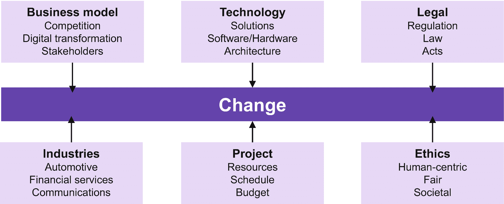
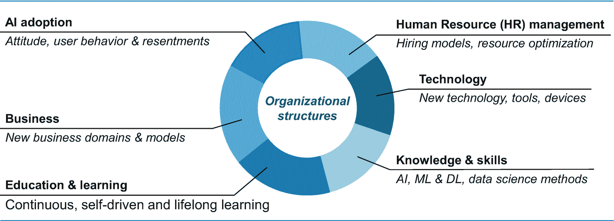
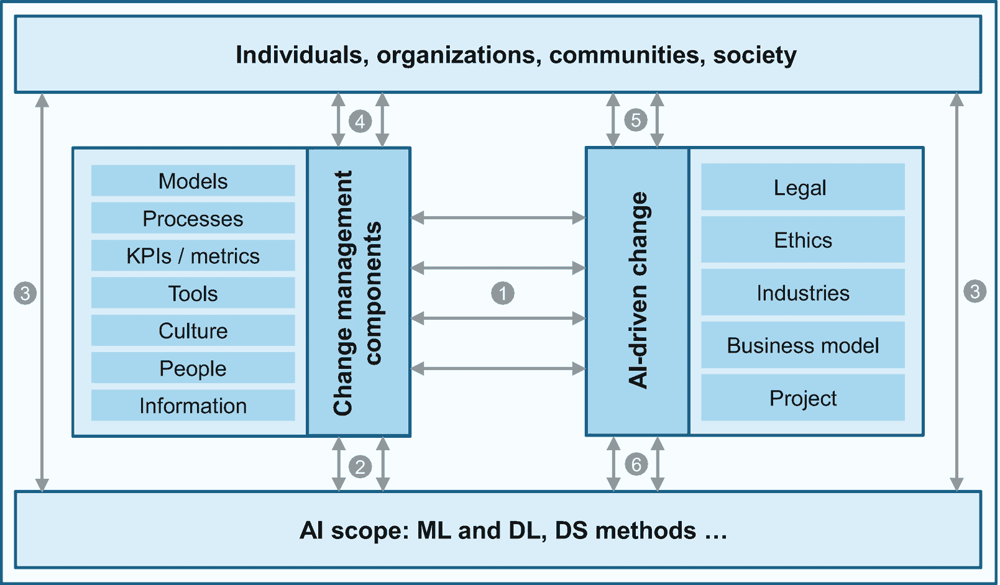
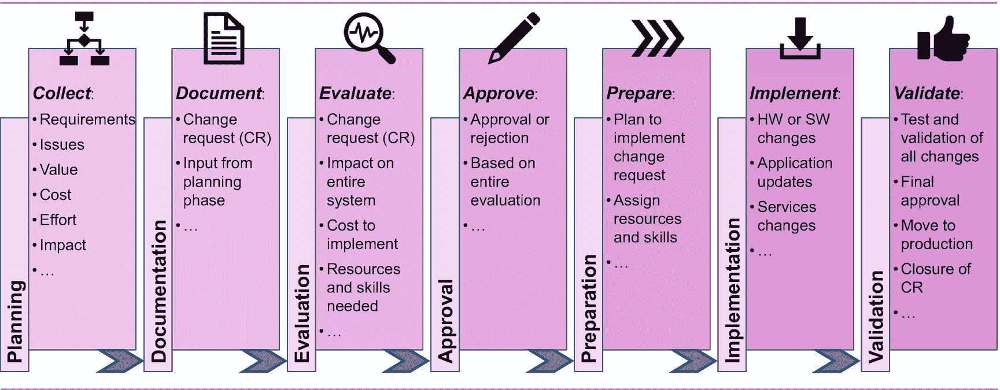

# 十、人工智能和变革管理

随着人工智能越来越多地被企业和整个社会所采用，现有的变革管理实践需要进行调整。变革通常被视为威胁，给组织和个人带来不确定性、情绪和风险。然而，变化伴随着新的商业和个人机会。人工智能有潜力加速和改善变革管理，使其更加准确和以人为本。

这一章揭示了人工智能环境下的变更管理，并介绍了人工智能变更管理的关键方面，如识别和分析情绪，以实现更有针对性的变更管理和优化的结果。我们还阐述了将人工智能纳入变革管理的挑战，并强调了数据和信息驱动方面的重要性，以拥抱人工智能，实现更深入的洞察驱动和普遍的变革管理方法。

## 介绍

人工智能将对企业如何运营、项目如何执行以及人们如何合作产生深远影响，例如，使用聊天机器人和机器人设备。一方面，人工智能技术为变更管理带来了巨大的机遇，因为人工智能可以用来改进和增强传统的变更管理方法和工具，例如，通过应用 ML 算法以更高的精度预测项目结果，或者发现可能导致项目变更的未知风险。

另一方面，变革管理正面临着适应人工智能的挑战，这意味着要记住人工智能对组织、项目和个人的影响，例如，人工智能和人工智能将加速组织结构、商业模式和流程以及人们工作和学习方式的变化。在调整您组织中的相关变更管理实践时，必须预测并考虑到这一点。人工智能对组织、项目和个人的这种影响需要现有的变革管理学科进行一定程度的调整，这是任何先前的技术影响都无法超越的。

在这一章中，我们关注人工智能驱动的变更管理改进，例如，利用人工智能和 ML 来优化 IT 变更管理或推进架构变更管理。这些是更技术性的话题。此外，我们还阐述了项目和人力资源(HR)相关的方面，如应用 ML 和 DL 方法将基于社交媒体的情绪分析洞察力注入到变更管理中，以及 AI 和 ML 对众所周知的和基本的项目管理规程的影响，包括在人力资源管理中使用 AI 和 ML 来简化关于资源分配的变更管理流程。

## 变更管理的范围

本节回顾了传统的变更管理，并提供了变更管理模型、流程和方法的定义和高级概述。

### 变更管理-范围和定义

变更管理通常被视为项目管理的一个规程。然而，以这种方式限制变更管理可能过于狭隘，因为变更不仅仅发生在项目执行的时候。特别是在人工智能的背景下处理变更管理，如果它被严格地限制在项目管理领域的话，是不符合期望的。

图 10-1

引起变化的原因

变更管理需要通过清楚地陈述业务目标来驱动。通常情况下，变革只是为了变革而变革。变更管理工具的可用性放大了这种趋势，尤其是在与客户数据相关的项目中，IT 供应商提供的工具经常误导组织在缺少或不清楚业务目标的情况下进行变更。

变化的原因更加普遍；变化本身正在加速，而且更加深刻，特别是如果由人工智能和人工智能以及新的商业场景驱动的话。作为项目相关变化的补充，我们需要考虑新的法律和道德方面，由行业特定场景(如自动驾驶汽车)和新技术(如人工智能和人工智能)以及新兴商业模式驱动的变化。图 [10-1](#Fig1) 说明了变革的一些关键原因，并为组织、个人和整个社会实现更充分的变革管理范围和定义提供了基础。图 [10-1](#Fig1) 中引用的行业只是一些例子。

在同时考虑这些变革驱动因素的情况下，我们建议将变革管理定义为一种应用知识、工具、流程、模型、技术和资源的有组织、有系统的方法，以实现变革。对于组织来说，这意味着根据变化来实现他们的业务目标和策略。对于个人来说，这意味着简单地接受和采用新的沟通方式(例如，通过聊天机器人)、通勤方式(例如，通过自动驾驶汽车)或学习方式(例如，通过个性化的推荐教育)。对社会而言，这意味着通过制定新的伦理和以人为中心的指导方针来适应变化。正如你所看到的，人工智能为我们看待变革管理的方式定下了基调。

### 传统变革管理

大多数(如果不是全部的话)变更管理的定义是面向公司、企业、组织和项目的。这里仅举两个例子:对于项目管理协会(PMI)， [1](#Fn1) 例如，*变更管理是对变更的知识、工具和资源的有组织、有系统的应用，为组织提供了实现其商业战略的关键过程*。人力资源管理协会(SHRM) [2](#Fn2) 将变革管理定义为管理变革计划的*原则和实践，以使其更有可能被接受并获得资源(财务、人力、物质等)。)来重塑组织及其人员*。

不仅变更管理的定义，变更管理的方法、模型和过程都围绕着组织和项目管理方面。 [3](#Fn3) 传统的变革管理理念不会失去其有效性；然而，我们需要为变革管理的方法开发新的想法，将人工智能驱动的深远影响考虑在内。过去，变革管理总是面临挑战，这些挑战与对变革的抵制和犹豫以及退回到众所周知的业务模式和方式的趋势有关。随着人工智能渗透到整个社会及其对企业和个人的影响，犹豫和怀疑，拒绝和恐惧，甚至知识和技能的差距都迫使创新思想的产生和传统变革管理的范式转变。

由于这一章的篇幅限制，而且变更管理只是这本书要讨论的一个特定主题，我们不可能详尽地概述一个人工智能变更管理框架。然而，本章追求的目标是至少介绍开发这样一个框架的关键思想和基石。

## 人工智能背景下的变革管理

在本节中，我们将继续讨论人工智能对变革管理的影响，并列出变革管理将面临的一些重要和关键的挑战。变革管理一直是并将继续是信息驱动的(包括数据)。因为人工智能，你可以获得新的见解，这与使变革管理更加精确和有针对性有关。

因此，在本节中，我们将讨论人工智能通过加速新见解的推理而促进的扩展，这些新见解可以被变更管理所利用。我们特别强调了人工智能对变革管理的影响，并提供了一个关于人工智能如何通过新的学习方式推动人力资源、技能和知识以及教育方面的组织结构变革的例子。

### 人工智能对变革管理的影响

为了更好地理解人工智能对变革管理的影响，我们确定了传统变革管理的关键要素或组成部分。这些元素或组成部分将被检查关于他们的需要的调整和由 AI 和它的兄弟姐妹开始的扩展。在采用这种方法时，我们应该认识到添加新组件的可能性甚至必要性。

关于变更管理模型和方法、框架和过程、工具以及其他方面的书籍几乎有数百种。在这一章中，我们需要有选择性和专注。因此，我们将我们的方法限制在以下传统变更管理的既定要素和组件:

1.  **变革管理模式和方法**:有许多变革管理模式和方法被描述。大多是面向组织和项目利益T3 5T5；其中一些复杂繁琐，缺乏组织变革方面的内容。人工智能呼吁增强模型和方法，以集体地包含个人和群体、消费者和用户，甚至整个社会。企业和组织需要将模型和方法扩展到项目、组织、团队和员工的直接边界之外，并适应远远超出其舒适区的领导角色。

2.  **变更管理流程**:变更管理流程包括一系列定义明确的活动或任务，这些活动或任务将变更从发生转变为成功实现既定目标。如果你回忆起图 [10-1](#Fig1) 中描述的变革原因，很明显，人工智能驱动的变革管理过程必须包括额外的步骤，特别是考虑法律方面、道德和人工智能技术本身。

3.  **变更管理 KPI 和指标**:考虑到 AI，可能需要调整相关的变更管理 KPI 和指标；可以而且应该增加更多。例如，AI 和 ML 可用于自动发现与项目基线的不利偏差，或检测来自社交媒体分析 [6](#Fn6) 的来自组织边界之外的批评情绪。

4.  **变更管理工具**:有相当多的与变更管理相关的工具，包括治理工具、文档管理和沟通工具、议题和问题管理工具，以及项目管理和时间安排工具——仅举几个例子。具有人工智能能力和数据科学方法的人工智能可以而且应该丰富这些工具，以提高精确度和准确性，产生更相关和更有针对性的洞察力，并预测和自动发现甚至建议预防措施。

5.  **变革管理文化**:通过真正拥抱人工智能和引领变革来适应变革管理文化，需要开放、敏捷和积极主动的态度。这影响了企业和组织文化，以及个人、社区和整个社会的文化背景。人工智能将影响变革管理文化。例如，可以使用 ML 和数据科学方法来理解情绪，并提出有针对性的定制行动。

6.  **人和人的方面**:人工智能已经对利益相关者、员工、个人和公民、社区和社会产生了强大的影响。变革管理是由人领导和推动的。人工智能可能会改变这种范式:人们可能会通过基于人工智能的咨询功能获得帮助；在某种程度上，他们甚至可能被坐在驾驶座上的人工智能驱动的变革管理工具所取代。

7.  **信息**(包括数据):变更管理是强烈的信息驱动的。从数据和信息中获得的见解推动了变革管理流程，包括建议的行动。人工智能强化了这一点，使洞察力更具预测性和相关性，并使调整的衍生行动更具针对性和定制化。

除了前面的例子之外，影响变更管理的其他 AI 相关方面可以从挑战中得到，我们将在下一节中描述。

### 变革管理的挑战

通过人工智能，变革管理面临着越来越多、越来越普遍的挑战；新的问题也出现了。表 [10-1](#Tab1) 列出了最重要的挑战。在某种程度上，这些大多来源于我们对变化的理解，如图 [10-1](#Fig1) 所示。

表 10-1

变革管理的挑战

   
| 

#

 | 

挑战

 | 

描述

 |
| --- | --- | --- |
| one | 挑战法律义务 | 法规只会增加和产生进一步的变化，并对变更管理产生影响，使其变得更加敏捷和灵敏 |
| Two | 知识和技能差距 | 对人工智能技术、场景、设备和工具的知识、技能和理解不足将使变革管理更加困难 |
| three | 高复杂性 | 例如，使用人工智能来改进变更管理工具需要一定程度的易用性和洞察力，这需要隐藏人工智能的复杂性 |
| four | 接受度不足 | 在变革管理过程中，需要关于沟通和信息活动的新想法，以解决个人、组织和社会的问题 |
| five | 社会的拒绝 | 社会的拒绝可能会导致目标设置的变化和调整，还会影响变革管理，使其提前考虑拒绝 |
| six | 伦理问题和不确定性 | 变革管理需要验证和检查道德问题、以人为本、公平和社会利益 |

关于伦理问题，实际上有两个相关的方面:一方面，变更管理需要执行前面描述的确认和检查；另一方面，注入 AI 和 ML 的变更管理工具需要遵守定义的道德准则，例如，它们需要是公平的和人类可以接受的。

应将这些挑战作为基础，以得出一套合适的成功标准。例如，对新人工智能技术的不充分接受或社会拒绝需要通过充分的信息活动和教育计划、引导与担忧者的对话以及仔细衡量的接受试验来解决。

### 推动组织结构的变革

组织结构已经受到人工智能的显著影响；这种影响只会变得更强，更可持续，因为组织正在向人工智能发展。组织需要变得更加敏捷 [7](#Fn7) ，更加灵活地适应和促进变革。这种灵活性和敏捷性与人工智能在改变态度、用户行为和经常发生的不满方面的采用有关。在组织内处理新的人工智能技术、工具、设备、机器人等等将导致组织调整。

图 10-2

对组织结构的影响

随着业务在人工智能的影响下发生变化，这意味着组织要发展新的业务领域和模式。人力资源管理将继续在工具和招聘模式以及资源重新分配和优化流程方面发生变化。例如，ML 和数据科学方法将越来越多地用于改善候选人评估和映射到可用的工作角色和职责。这需要人力资源专业人员的认知态度和仔细考虑，以保证公平、尊重和透明的决策。

过去，组织内部的教育项目已经发生了变化，主要是通过互联网和在线学习方法。然而，人工智能将再次使新的学习方式成为可能，例如，定制和推荐的学习，自动发现技能差距或某些领域的优势。组织变革的另一个方面是人工智能所需的知识和技能。虽然没有要求每个人都成为数据科学家和 AI 主题专家，但一个组织的大多数成员都需要熟悉 AI 和关键的数据科学家方法。

图 [10-2](#Fig2) 展示了组织结构的各种驱动变化。

## 人工智能变革管理的关键方面

变革管理应被视为*预测*和*领导*变革，这意味着主动识别变革机会，以提高组织或社区的运营效率，降低项目风险或技术采用失败的风险，捕捉和实现新的商业机会，并优化社会和公众的团结(例如，在通勤、沟通、生活方式方面)。

采用 AI 和 ML 来提高变更管理规程的效率有许多不同的方面。正如我们在上一节中所看到的，通过应用预测分析、关联算法和异常检测机制，可以显著改进用于促进变更管理的现有工具和方法，从而更精确地预测可能的预算超支，发现事件和风险之间的关联，并在项目周期的早期以更高的准确性检测项目异常，以降低影响程度。

在这一节中，我们提供了几个例子来说明人工智能为变革管理带来的丰富和机会。例如，AI 和 ML 可以被用来改进现有的 IT 和架构变更管理过程；人工智能的方法可以用来改善人力资源管理流程(正如我们在上一节中简要提到的)。

最后但同样重要的是，我们指出识别通过众多社交媒体渠道描绘的情绪的重要性及其与变革管理的相关性。

### 人工智能变革管理框架

正如你可以想象的那样，开发一个全面的人工智能变更管理框架 [8](#Fn8) 可能是一个具有挑战性和精心设计的任务，这是我们在本书的一小部分中甚至无法初步实现的。然而，我们打算至少在人工智能环境中为这样一个框架提供一些关键的想法和设计点。换句话说，我们的目标是描述在一个变更管理框架中需要改变什么以及在哪里发生改变*因为*是人工智能，所以我们描述了由人工智能及其兄弟引起的对现有变更管理框架的影响:人工智能引起的对变更管理框架的影响。

图 10-3

人工智能背景下的变革管理框架

这些想法可以为感兴趣的读者提供输入，帮助他们进一步完善人工智能变更管理框架。我们显然是在本章迄今为止所描述的人工智能驱动的变革、关键变革管理组件或要素、人工智能的影响等背景下进行的。

变革管理的相关性和依赖性是多方面的。图 [10-3](#Fig3) 描述了这些方面的相互干扰。图 [10-3](#Fig3) 描绘了四个领域:变更管理组件、人工智能驱动的变更、人工智能范围本身以及个人、组织、社区和社会。各个领域 [9](#Fn9) 之间存在相互依存关系，即双向依存关系。

以下是对这些相互依赖关系的简短描述:

1.  **变更管理组件和人工智能驱动的变更的相互干扰**:传统的变更管理组件必须进行调整，例如，根据新出现的法规和道德问题或行业特定需求进行调整。道德和法律方面可能有特别大的影响。反过来，变更管理显然会影响商业模式和项目。

2.  **变更管理组件和整个人工智能范围的相互依赖性**:正如我们已经看到的，人工智能将明显影响变更管理；然而，变更管理甚至可能影响未来的人工智能范围本身。

3.  **个人、组织、社区、社会与人工智能范围的关系**:个人、组织、社区、社会作为一个整体与所有其他领域存在相互干扰，显然甚至与人工智能本身也存在相互干扰。

4.  **个人、组织、社区和社会与变更管理组件的相互影响**:这些个人和社区将受到变更管理的影响，并且他们自身将影响变更管理组件。

5.  **人工智能驱动的变革与个人、组织、社区、社会的干扰**:人工智能驱动的变革会影响社区，反之，社区也会创造变革。

6.  **整个人工智能范围与人工智能驱动的变革的关系**:最后但同样重要的是，人工智能技术将创造大多数变革；然而，对商业模式和项目进行调整的需求(因为变更请求)可能会发现人工智能差距，从而引发新的创新人工智能能力的新想法。

这个提议的变更管理框架可能是直截了当的，甚至是简单的；然而，它为进一步的创新思想和改进提供了一个模型。

### 面向 IT 变革管理的人工智能

作为一个关于人工智能对变革管理的影响的具体例子，让我们仔细看看 IT 变革管理。有许多可用的 IT 变更管理方法和工具。一种方法是 ITIL [10](#Fn10) ，这是一套管理 IT 服务的最佳实践。IT 变革管理被视为 ITIL *服务转型*阶段的众多流程之一。最新的 ITIL 版本 4 [11](#Fn11) 考虑了新的计划和主题，如数字化转型、精益、敏捷和开发运维。还有其他框架，比如 COBIT[12](#Fn12)；然而，ITIL 包括了一个相当详细的信息技术变革管理的过程描述。

我们打算以图 [10-4](#Fig4) 中概述的典型 IT 变革管理流程的核心步骤为基础，勾勒出 AI 对 IT 变革管理的影响。变化的范围倾向于 ITIL 的最佳实践；变革的影响可能涉及任何 IT 方面，包括软件和硬件、应用和解决方案以及 IT 服务。

上面概述的 IT 变更管理流程是一个通用流程，可以根据具体的 IT 环境进行改进和调整。它还可以根据特定的组织需求进行调整，以实现更加敏捷的流程。人工智能对更大的 IT 服务管理(ITSM)领域的影响显然远远大于 IT 变革管理。然而，在本节中，我们将讨论严格限制在 it 变更管理领域。

人工智能对 IT 变革管理的影响将是相当大的；提供新的范例，其特点是数据洞察驱动的决策制定和与所有流程步骤相关的优化。AI 将把 IT 变更管理转变为 AIOps 的一个子领域，例如，通过自动化 IT 变更管理，推荐对 IT 前景、服务水平改进、新技术能力、架构构建块和产品的调整。它支持模式发现，将变更请求(CR)与以前的 CR 进行匹配，以过去的数据探索为基础，复制并学习过去的经验和可用数据。对于 IT 变更管理流程的评估、准备和实现步骤来说，这可能是一个重大改进。

图 10-4

IT 变更管理流程步骤

AI 支持对 CR 进行影响分析，以发现由特定请求引起的冲突或问题。用于 IT 变更管理的人工智能不仅可以发现问题，还可以开发策略和建议，以有效地响应请求。正如您在第 [8](08.html) 、 *AI 和治理*章节中所看到的，AI 可用于识别与 IT 变更管理相关的各种风险。此外，它还可以自主推荐适当的缓解策略，从而推进变更管理流程的评估步骤。

可以以更有针对性的方式执行评估和准备步骤，例如，通过选择所需的产品、供应品、工具和服务，包括通过 AI 支持的它们之间的依赖性和先决条件。在所有流程步骤中，基于人工智能驱动的对与 IT 环境相关的最佳实践和知识、指南和蓝图以及您组织中可用的过去经验记录的分析，可以更专业地解决问题和难题。

人工智能还可以用来优化劳动力，这意味着识别技能和主题专业知识以及管理 CR 所需的其他资源。已经在 IT 变革管理流程的第一步(规划、文档等)中。)，AI 可以用来智能分析项目相关的押品、邮件、文档、相关法规、最佳实践论文等等。基于人工智能的优化也可以应用于流程或工作流本身的优化，将 IT 变更管理变成一套精益和智能的流程。一般来说，变革管理(也适用于 IT)可以通过社交媒体分析、了解用户或公众的情绪并将其考虑在内来改进。我们将在下一节进一步探讨这一点。

这些只是人工智能如何影响和优化 IT 变革管理流程的一些具体想法。然而，这需要在相应的 IT 变更管理工具中进行调整。

### 社交媒体分析优化变革

变革管理将受到公众情绪的影响:人工智能应用的个人和用户、组织和社区，甚至公众本身都将通过论坛和社交媒体积极分享评论。这很可能与表 [10-1](#Tab1) 中列出的变更管理的整个挑战范围有关。这些意见和情绪、不满和担忧——尽管很可能被视为负面的——应该被视为变更管理流程的理想输入。

通过许多网站、论坛和渠道(如脸书、Twitter、LinkedIn、YouTube、SlideShare、Instagram、Reddit)，社交媒体提供了大量数据，用于倾听(监控和质量提升目标)、可视化和分析，以全面和普遍的方式了解意见和情绪、问题和难题以及接受或抵制。

社交媒体分析[13](#Fn13)——作为人工智能的子域——可以支持以下业务领域的理想调整(变化):

*   **竞争洞察力**:获得洞察力并将你的产品或服务与竞争对手的产品或服务进行比较，可以获得竞争优势。

*   **产品和服务优化**:了解缺陷和差距将推动变革，以优化产品、工具和服务。

*   **接受度改善:**情绪分析有助于发现关键的接受度相关问题，防止销售或组织内外的其他相关指标，例如道德问题。

*   **用户体验** **:** 收听和分析社交媒体可以洞察用户体验，例如使用聊天机器人、无人驾驶汽车、机器人设备等。

*   **改善组织结构:**社交媒体分析有助于发现差距(例如，知识、技能等。)，建议组织适应。

*   **IT 服务管理优化:**可以从社交媒体分析中得出所需的变更，以进一步优化 ITSM，例如，改进服务级别协议。

从前面的领域可以看出，社交媒体分析代表了一个实现变革本身甚至调整人工智能变革管理流程的机会。

## 关键要点

我们总结了本章的一些要点，总结在表 [10-2](#Tab2) 中。

表 10-2

关键要点

   
| 

#

 | 

关键外卖

 | 

高级描述

 |
| --- | --- | --- |
| one | 引起变化的许多原因 | 考虑引起变化的广泛原因:例如，伦理、法律方面、新的人工智能技术、新的商业模式等等 |
| Two | 了解挑战的全部范围 | 变革管理的挑战可能会转移；新的问题将会出现，例如，社会接受或拒绝、高度复杂性、知识和技能差距等等 |
| three | 组织结构的重大变化 | 组织结构将经历与人力资源(招聘模式等)相关的重大变化。)，知识和技能，教育和学习，等等 |
| four | 对人工智能变革管理框架的需求 | 人工智能变化管理框架将会更加广泛，并由多方面的相关性和依赖性决定 |
| five | IT 变革管理 | IT 变革管理流程步骤将经历由人工智能开发驱动的深刻增强 |
| six | 社交媒体分析 | 从基于人工智能的社交媒体分析中得出的情绪、评论和不满应该成为变革管理的有用输入 |

## 参考

1.  PMI。*综合变革管理*。[`www.pmi.org/learning/library/integrated-change-management-5954`](http://www.pmi.org/learning/library/integrated-change-management-5954)(2019 年 9 月 14 日访问)。

2.  SHRM。*SHRM 能力与知识体系*。[`www.shrm.org/certification/Documents/SHRM-BoCK-FINAL.pdf`](http://www.shrm.org/certification/Documents/SHRM-BoCK-FINAL.pdf)(2019 年 9 月 14 日访问)。

3.  科特，J.P. *领导变革*。ISBN-13: 978-1422186435，哈佛商业评论出版社，2012 年。

4.  变革管理的理论和实践。ISBN-13: 978-1352001235，红球出版社，2018。

5.  智能工作表。(众多的)变更管理模型和方法中，哪一个适合您的组织。[`www.smartsheet.com/which-numerous-change-management-models-and-methodologies-right-your-organization`](http://www.smartsheet.com/which-numerous-change-management-models-and-methodologies-right-your-organization)(2019 年 9 月 18 日访问)。

6.  PMI。*综合变革管理*。[`www.pmi.org/learning/library/integrated-change-management-5954`](http://www.pmi.org/learning/library/integrated-change-management-5954)(2019 年 9 月 19 日访问)。

7.  IBM。社交媒体分析——揭示社交媒体中的洞见，帮助您的业务。[`www.ibm.com/topics/social-media-analytics`](http://www.ibm.com/topics/social-media-analytics)(2019 年 9 月 21 日访问)。

8.  IBM。语气分析器-理解文本中的情感和交流风格。[`www.ibm.com/watson/services/tone-analyzer/`](http://www.ibm.com/watson/services/tone-analyzer/)(2019 年 9 月 23 日访问)。

9.  Kreutzer，R.T .，Neugebauer，T. *数字化商业领导力:数字化转型、商业模式创新、敏捷组织、变革管理(专业人士管理)*。ISBN-13: 978-3662565476，施普林格，2018。

10.  Franklin，M. *敏捷变更管理:成功变更规划和实现的实用框架*。ISBN-13: 978-0749470982，Kogan Page，2014。

11.  阿克斯洛斯。*ITIL 的最佳实践是什么？*[`www.axelos.com/best-practice-solutions/itil/what-is-itil`](http://www.axelos.com/best-practice-solutions/itil/what-is-itil)(2019 年 9 月 25 日访问)。

12.  亚历克索斯。 *ITIL 基金会-ITIL 第四版*。ISBN-13: 978-0113316076，文具办公有限公司，2019。

13.  伊萨卡。COBIT 4.1:IT 治理和控制框架。[`www.isaca.org/Knowledge-Center/COBIT/Pages/Overview.aspx`](http://www.isaca.org/Knowledge-Center/COBIT/Pages/Overview.aspx)(2019 年 9 月 27 日访问)。

14.  IBM。商业分析博客-了解沃森分析的社会媒体功能:会话集群和更多。[`www.ibm.com/blogs/business-analytics/watson-analytics-for-social-media-capabilities-conversation-clusters/`](http://www.ibm.com/blogs/business-analytics/watson-analytics-for-social-media-capabilities-conversation-clusters/)(2019 年 9 月 27 日访问)。

<aside aria-label="Footnotes" class="FootnoteSection" epub:type="footnotes">Footnotes [1](#Fn1_source)

有关变更管理的 PMI 定义的更多信息，请参见[1]。

  [2](#Fn2_source)

参见[2]关于变更管理的 SHRM 定义的更多信息。

  [3](#Fn3_source)

参见[3]对领导变革的综合论述。

  [4](#Fn4_source)

参见[4]关于变更管理的理论和实践的更多信息。

  [5](#Fn5_source)

参见[5]关于变更管理模型和方法的更多信息。

  [6](#Fn6_source)

有关社交媒体分析的更多信息，请参见[6]和[7]。

  [7](#Fn7_source)

有关敏捷组织的更多信息，请参见[8]。

  [8](#Fn8_source)

有关变更管理框架的更多信息，请参见[9]。

  [9](#Fn9_source)

下表中的数字对应于图 [10-3](#Fig3) 中的数字。

  [10](#Fn10_source)

参见[11]关于信息技术基础设施库(ITIL)的更多信息。

  [11](#Fn11_source)

参见[12]关于 ITIL 基金会第 4 版的更多信息。

  [12](#Fn12_source)

有关信息和相关技术控制目标(COBIT)的更多信息，请参见[13]。

  [13](#Fn13_source)

有关社交媒体分析功能的更多信息，请参见[14]。

 </aside>