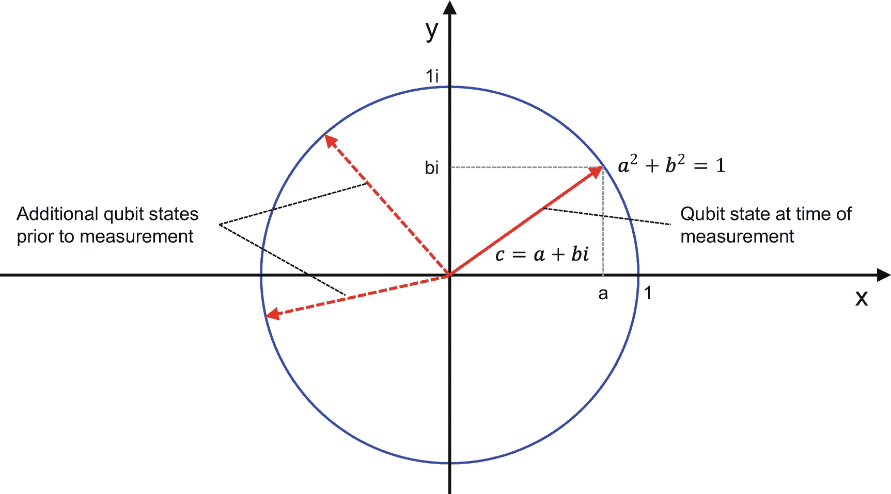
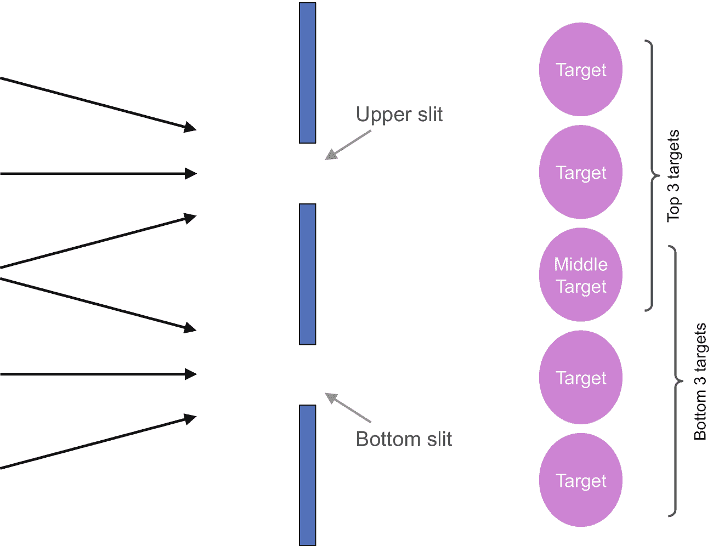
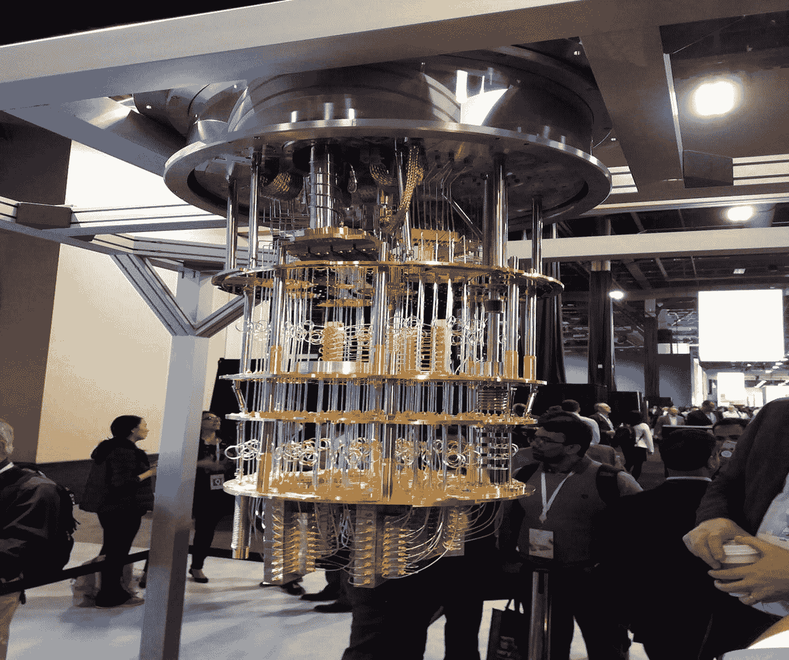
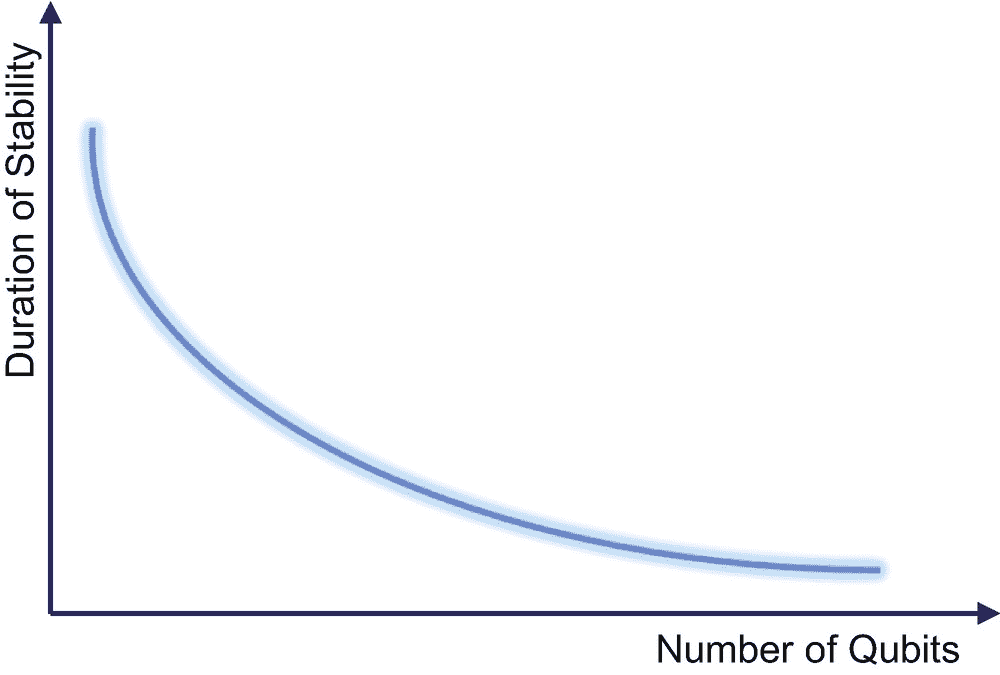
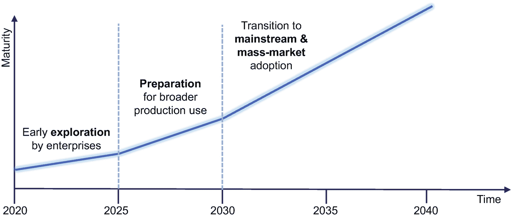
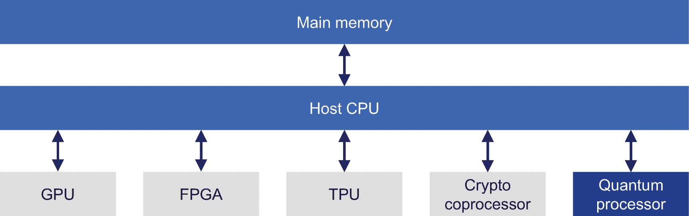

# 十二、人工智能和量子计算

理查德·p·费曼，诺贝尔物理学奖获得者，是量子力学和量子电动力学领域的物理学家思想领袖。1982 年发表了题为《用计算机模拟物理》的研究论文 [1](#Fn1) 。在这篇论文中，他提出了一个问题，即量子计算机是否可以被制造出来(他认为这是可能的)，或者经典计算机是否可以模拟真实量子系统的概率行为(他明确回答了“不”)。这篇研究论文引发了科学研究界的兴趣，他们开始认真探索是否可以实际建造量子计算机。

在这一章中，我们将探索现有处理架构和真正的量子计算机之间的区别。然后我们将看看肖尔的算法——一个量子计算机擅长的问题的典型例子——来帮助你理解哪些问题可以由量子计算机最好地解决。之后，我们看看人工智能和量子计算的现状。我们以对量子计算和人工智能领域如何在未来几年发展的展望来结束这一章。

## 什么是量子计算机？

如表 [12-1](#Tab1) 所示，目前有许多不同的处理器架构可用，如 ASIC、FPGA、GPU、TPU、POWER、ARM 等。这些处理器架构的优化遵循了几十年的摩尔定律，表明大约每 18 个月，计算机芯片的性能就会翻一番。

表 12-1

处理器架构

  
| 

架构

 | 

高级描述

 |
| --- | --- |
| 冯·诺依曼 | 这是当今许多台式机或笔记本电脑中使用的通用硬件架构。根据冯·诺依曼规则，在这样一个性能不佳的设备中，不能同时执行读取和数据操作。主要的好处是，您可以在上面运行各种各样的软件，但不一定针对性能进行优化 |
| 专用集成电路 | 专用集成电路(ASIC):这些芯片经过优化，嵌入逻辑来执行软件以解决特定问题，具有最佳硬件布局以实现最佳性能 |
| 现场可编程门阵列 （Field Programmable Gata Array 的缩写） | 现场可编程门阵列(FPGA):这基本上是冯诺依曼和 ASIC 架构之间的中间地带。它允许您重新配置硬件(因此“现场可编程”)，以在某种程度上优化性能，而名称的门阵列部分指的是该架构中存在的二维逻辑门阵列 |
| 国家政治保卫局。参见 OGPU | 图形处理单元(GPU): [2](#Fn2) 与 CPU 相反，这些芯片并没有针对延迟进行优化，也就是说尽可能快地完成一项任务——而是针对吞吐量。最初，他们的主要应用是为电脑游戏加速图形。如今，它们也用于高性能计算(HPC)领域 |
| TPU | 张量处理单元(TPU):这个架构最初是由谷歌开发的，用于加速谷歌的 [3](#Fn3) 机器学习框架，称为 TensorFlow |
| 力量 | 这种处理器架构最初是由 IBM [4](#Fn4) 创造的。POWER 是增强型 RISC 性能优化的缩写，也被日立等公司采用。自 2019 年起，open power FoundationT5 5T7】倡议由 LinuxFoundation 负责。IBM 有一个围绕 POWER 架构的服务器业务 |
| 手臂ˌ武器ˌ袖子ˌ装备 | 这种芯片架构由 ARM [6](#Fn6) 有限公司所有，缩写 ARM 随着时间的推移有不同的含义(例如，高级 RISC 机器)。这种架构的关键设计点是低能耗，同时仍能提供高性能。这使得它成为嵌入式计算的理想平台，今天的大多数智能手机和平板电脑都运行在 ARM 处理器上(iPhone，Android) |

然而，这一过程正在触及物理学的极限，因为晶体管的尺寸已经缩小到几个原子的规模，不能再缩小了。电子是否流过晶体管栅极基本上定义了状态是 0 还是 1。晶体管尺寸的任何进一步减小都将允许电子到达晶体管栅极的另一侧，同时通过一种称为量子隧道的物理效应关闭栅极，这种效应基本上使晶体管变得无用。尽管通过添加更多内核仍有可能提高计算机系统的性能，但减小晶体管尺寸的过程即将结束。

考虑到目前可用的所有这些不同种类的处理器架构，以及通过使晶体管变得更小来提高性能没有多大希望的观察结果，你可能会想，创建另一种我们称为基于量子架构的量子计算机有什么意义？

要回答量子计算机的架构有什么根本不同，我们需要更深入地挖掘传统计算机的功能。虽然上述处理器架构在某种程度上有所不同，但它们有一个共同的基础:它们使用位来管理一种状态，其中一位可以保持 0 或 1 的状态，其中物理级别上的 0 意味着电流不流经晶体管栅极，1 意味着电流正在流动。专门的门是建立在这个基本原理上的，例如，非门给出相反的结果，当且仅当两个输入端都有输入信号时，与门返回 1，等等。量子计算机中一个比特的对等物被称为**量子比特**(量子比特的简称)。

本质上，一个量子位是由实数 *a* 和虚数 *bi* 组成的复数 *c* = *a* + *bi* ，其中*a*2+*b*2= 1。一个量子比特可以存储 2 个传统比特的信息；2 个量子位可以存储 4 位传统信息；3 个量子位可以存储 8 比特= 1 字节的传统信息；30 量子位，可以存储 128 MB31 个量子位对应 256 MB 等等。换句话说，你添加到量子计算机中的每一个量子位都会使它能够处理的信息量翻倍，这代表着指数级增长。有了大约 45 个量子位，你将能够容纳今天最大的超级计算机所能容纳的信息。大约 50 个量子位，你将达到量子优势，即计算当今最大的超级计算机无法解决的问题的能力。

量子比特具有特殊的属性，被称为叠加态和 T2 纠缠态。让我们在接下来的两个小节中来看看它们。

### 叠加

与传统比特相反，量子比特基于叠加效应同时保存 0 和 1 的组合。这意味着一个量子位可以同时保持多种状态——0 和 1 的任意比例。注意，一个量子位不必处于 0 或 1 这两种状态中的任何一种。在测量之前，一个量子位(由复数 *a* + *bi* 表示)可以在半径为 1 的圆上具有任何值，如图 [12-1](#Fig1) 通过两个虚线箭头所示。这个量子位值可以被故意改变。在测量的时候，一个量子比特需要决定它的值是 0 还是 1(这就是和传统比特的相似之处)。例如，这个决定可以用一种非常直接的方式来完成，如下所示:如果*a*T8】2T12】0，量子位值肯定是 1，如果 *a* = 0，量子位值肯定是 0。

图 12-1

复数形式的量子位

在量子计算机中，量子位在测量时是处于状态 0 还是 1 取决于量子概率。量子概率与许多人通常认为的基于生活中经历的概率有很大不同。

例如，如果你扔一枚完美的硬币，硬币有 50%的概率落在两边。另外，每个结果的概率加起来是 1。如果你掷一个六面骰子，每个数字都有 1/6 的机会出现在最上面，如果你把结果相加，它们再次加起来是 1。在这种情况下，有一个特定的条件在起作用。如果我们假设你有概率 *a* 和概率 *b* ，那么以下条件总是成立: *a* + *b* ≥ *a* 。这是基于这些例子中的概率计算仅使用实数的事实。在量子计算和量子位的世界里，概率是基于复数计算的。如前所述，一个复数由*c*=*a*+*bi*给出，其中 *a* 和 *b* 为实数， *i* 为虚数单位。为了理解量子位值测量过程中的概率方面，考虑图 [12-2](#Fig2) 中显示双缝实验的例子。

图 12-2

双缝实验

首先，出于传统考虑，我们使用图 [12-2](#Fig2) 的设置。假设我们有一个完美的射手从不错过目标。有 50%的可能性枪手会从这些缝隙中的任何一个射出。双缝实验设置是这样的，通过上面的狭缝，射手可以从顶部击中三个目标，通过底部的狭缝，射手可以从底部击中三个目标。这意味着中间的目标可以通过两个狭缝被击中。如果我们计算任何一个目标被击中的概率，我们得到从顶部和底部的 2 个目标的 1/6 的概率和中间目标的 1/3 (1/6 + 1/6)。

现在让我们考虑同样的设置，但不使用符合物理学经典定律的子弹。相反，我们现在使用激光发射光子，这符合量子力学的定律。我们用复数再次做同样的计算。在这种情况下，我们想知道光子击中中间目标的概率。如果你计算这个，这需要使用复数，你会发现一个光子击中中间目标的概率为零。这是将击中中间目标的概率相加所需的计算 [7](#Fn7) 

这背后的现象叫做干扰。在这一节的开始，我们说过一个量子位在叠加时有所有可能的状态同时代表 0 和 1 的比例。这里，实际上我们的光子同时处于许多位置——叠加态。它同时穿过两个狭缝。另一方面，它可以自我抵消。这就是干扰。如果你把石头扔进水中，你可以观察到，有时波会叠加，有时由于干扰，波会相互抵消。对于两个给定的概率 *a* 和 *b* ，量子世界中的概率计算不符合 *a* + *b* ≥ *a* 的原因就在于干涉，因为它们现在都是复数。

在经典计算机中，如果你有 8 个字节，你可以在任何给定的时间点存储 256 个状态中的一个***。用 8 个量子位的量子计算机，可以同时存储 ***所有*** 256 个状态。换句话说，有了叠加态，量子计算机可以一次持有很多态。想象一下，如果你把量子计算机放入经典计算机的许多不同状态，但在给定的时间点。如果你能同时执行所有这些状态的操作，你就拥有了终极的并行处理，这是量子计算最大的承诺。***

### 纠缠

两个或更多的量子粒子可以相互纠缠。激光已经被用来制造纠缠态的量子粒子。量子粒子一旦纠缠在一起，就完美的联系在一起了。如果一组纠缠的量子粒子中的一个改变了状态，另一个也会立即改变。有趣的是，这适用于任意大的距离。纠缠的应用可以在量子通信和量子密码术中找到。在量子通信中，其思想是在两个通信方之间使用纠缠，这样，如果发送方和接收方之前已经处于纠缠状态，则接收方只能处理传输的量子位。如果中间有人试图窃听通信，窃听者不能对截获的量子位做任何事情，因为窃听者缺少第二个量子位来解码它。任何通过测量来理解量子位的尝试都会提醒发送者和接收者窃听者的存在，因为这将导致纠缠态的崩溃。

### 量子计算机

了解了叠加态和纠缠态之后，现在让我们来定义一下量子计算机的含义:量子计算机是基于量子力学效应的计算机系统。它使用具有叠加和纠缠特性的量子位，能够同时表示多个状态。在以某个基于量子的概率进行测量时，读取操作将产生 0 或 1 测量值。由于其量子力学核心，这是一种真正的新型计算机系统。

为了实际构建和实现一个量子位，目前有不同的物理方法 [8](#Fn8) 如

*   基于光子的量子计算系统正在利用激光束偏振的技术构建量子位。这种方法的一个优点是光子与周围环境的相互作用非常弱，这使得基于这种方法的量子位更加稳定。

*   离子阱量子计算系统利用悬浮在电磁场中的离子或带电原子粒子来实现量子比特。这些系统需要冷却到非常低的温度，通常接近 0 开尔文。

图 [12-3](#Fig3) 展示了一台量子计算机。量子计算芯片位于所示设备的最底部。众所周知，暖空气正在上升，因此将量子芯片放在设备的最低部分就是将它放在最冷的地方。

图 12-3

IBM Think 大会上展示的一台量子计算机 [9](#Fn9)

## 肖尔算法

为了说明量子计算机的潜力及其通过量子位叠加效应为计算带来的独特能力，我们想向您介绍 Shor 算法。Peter W. Shor [10](#Fn10) 的算法是在量子计算机上计算给定整数的质因数的多项式时间算法。上一句话的含义可能会影响到世界上很多人。为了理解这一点，我们在第一步提供一个相当简短的问题的数学背景介绍。第二步，我们展示这种数学在今天被大量使用的地方，以说明 Shor 的发现的巨大影响。

如果一个数只能被 1 和这个数本身整除，那么这个数被认为是素数。例如，7 是一个质数。它只能被 1 和它自己整除，不能休息。而 14 不是质数是因为 2∫7 = 14，也就是说它可以被其他数整除，没有余数。在这个例子中，2 和 7 都是质数，代表 14 的质因数。所以 14 分解成它的质因数是由 2 和 7 组成的。虽然这看起来对 14 个人来说是一个简单的任务，但是现在让我们来看看数字 2606663。它的质因数是 1249 和 2087。如果你需要尝试所有不同的质数组合来找出哪一对产生 2606663，你会觉得有许多可能性可以测试，因为你有许多不同的组合可以探索。

一个众所周知的数论定理指出，对于任何正自然数，存在唯一的因式分解，除了素数因子的顺序无关紧要(这意味着在前面的例子中，无论您写 14 = 2÷7 还是 14 = 7÷2)。这个定理有许多不同的名称，如算术基本定理或唯一因式分解定理。欧几里得知道它的基本部分，他是一位生活在公元前三世纪的希腊数学家，在他著名的*元素*中发表了它。十八世纪的德国数学家卡尔·弗里德里希·高斯在其著名的《T2 算术研究》中发表了一个更完整的版本。

计算机科学家在一个被称为复杂性理论的领域里，根据解决一个特定问题的最困难的实例需要多少时间和空间，将算法分为不同的复杂类别。现在，可以证明，测试一个给定的数是否是素数可以有效地完成，根据复杂性理论，这意味着在多项式时间内，这是一类具有最低时间和空间复杂性的问题。

所以让我们假设你有两个非常大的素数 *p* 1 和 *p* 2 。现在考虑一个数字*q*=*p*1∫*p*2。现在让我们假设你只有 *q* 并且你想知道 *q* 的因式分解是什么；换句话说，你想计算*p*T24】1 和*p*T28】2，使用因式分解算法。在经典计算机上，没有已知的因式分解算法能够有效地计算这一点，这意味着在多项式运行时间内。像数域筛、二次筛、椭圆曲线法 [12](#Fn12) 等已知的因式分解算法都不能在多项式时间内运行。这种观察是许多相关加密安全特性的基础。像 RSA [13](#Fn13) 这样的流行加密算法用来保护你的隐私(敏感数据、通信渠道等。)依赖于这样一个事实，即即使在当今最大的超级计算机上，因式分解在计算上也是一个困难且耗时的问题。如果你选择足够大的质数，破解你的加密密钥可能需要几千年甚至更长时间。

Peter Shor 的算法基本上表明，使用量子计算机，因式分解的相同问题变得容易解决，这实质上意味着在多项式时间内。Shor 算法的作用如下:

1.  **素数因式分解** : Shor 展示了如何将一般的素数因式分解问题化简为一个因式分解问题。

2.  因式分解:然后他展示了如何将因式分解问题简化为确定一个数的阶的问题。

3.  **确定一个数的阶**:在经典计算机上，这是一个目前还没有多项式算法的问题。

4.  **计算数的阶**:基于多项式时间的量子计算，可以计算出数的阶。

由于从 1 到 3 的归约步骤在运行时是多项式的，而 4 也是多项式运行时，Shor 的整个算法是多项式算法，其中步骤 4 仅在量子计算机上工作。当我们引入具有叠加特性的量子位时，我们说它可以同时容纳 0 和 1 的任意比例，这意味着许多不同的组合。因式分解问题在传统的计算机上很难解决，因为有太多不同的质数组合需要测试。

量子计算的一个优点是你需要在大量可能性中找到解决方案的问题。Shor 的算法基本上是利用量子位的叠加来加速计算。因此，如果量子计算机足够成熟(这是我们需要在本章后面讨论的问题)，Shor 的发现基本上消除了任何依赖于利用因式分解的加密算法来保护敏感数据和安全通信信道的安全性，这些信道每天都被企业和数百万人使用，无论他们是否意识到这一点。当肖尔发表他的研究论文时，由于这种威胁，它成了头条新闻。今天，密码学专家已经在研究抗量子计算的密码术能力。一个很有前途的技术似乎是格子密码术 [14](#Fn14) 。这个想法是有一个密码安全的方法，即使量子计算机在未来的某个时候成为主流，它也能让我们保护我们的数据。

## 今天的人工智能和量子计算

今天，许多 IT 公司都在量子计算上投入巨资，其中包括谷歌、阿里巴巴、微软和 IBM。例如，IBM、德国政府和弗劳恩霍夫研究所同意将量子计算引入一项联合计划，让公司和研究人员探索量子计算的可能性。2020 年 3 月 13 日， [15](#Fn15) 弗劳恩霍夫研究所和 IBM 宣布，IBM 正在位于德国 Ehningen(靠近斯图加特)的 IBM 工厂安装一台量子计算机，公司和研究人员可以通过 IBM 云访问这台计算机。IBM 将其量子计算机称为 IBM Q System One，并于 2019 年发布了首个基于 20 量子位的商用版本。2019 年底，IBM Q System One 的下一个主要版本已经有 53 个量子位。自 2016 年以来，IBM 通过 IBM 公共云提供对其系统 Q 的访问，并允许研究人员和公司从那时起远程探索量子计算机的可能性。为了开发量子计算机的算法，开源软件包 Qiskit [16](#Fn16) 中提供了丰富的工具。围绕 System Q 的生态系统在这一点上似乎是最强大的，世界各地的研究人员和开发人员下载了数十万次 Qiskit，探索量子计算的可能性。

量子计算竞赛的另一个领导者是谷歌。谷歌宣布，他们的量子计算团队在 2019 年发表的一篇研究论文 [17](#Fn17) 中证明了量子优势。量子优势是一个通过物理学家约翰·普雷斯基尔在 2012 年流行起来的术语，指的是量子计算机执行计算的速度比今天的任何超级计算机都快。在一台名为 *Sycamore* 的 53 量子位量子计算机上，来自谷歌的量子计算机科学家仅用 200 秒就完成了一次计算，而在当今最快的超级计算机上，这需要 10000 年。这篇论文发表后不久，一场关于计算是否真的需要 10000 年的激烈讨论就开始了。然而，这已经离题了。2019 年，谷歌和 IBM 都推出了由 50 个或更多量子位组成的量子计算机，证明量子计算确实有望解决当今传统计算机无法解决的问题。从人工智能的角度来看，有趣的问题是什么样的问题适合今天的量子计算。表 [12-2](#Tab2) 提供了人工智能相关用例的简要概述，其中量子计算被认为具有巨大的潜力。

表 12-2

量子计算的人工智能用例

   
| 

算法类型

 | 

用例

 | 

例子

 |
| --- | --- | --- |
| 最佳化 | 物流路线运维优化供应链优化 | 优化航班时刻表优化交付路线通过优化资源使用提高生产率 |
| 场景/假设模拟 | 市场预测风险预测 | 交易的资产价值评估经济系统中重大变量变化的经济影响 |
| 分子模拟 | 分子设计 | 为特定使用案例设计药物或材料优化现有化学品，例如电动车电池 |
| 机器学习/数据挖掘 | 模式发现预报分类 | 发现数据中的异常 |

表 [12-2](#Tab2) 中物流路径的例子来自于物流行业。如果你需要计划航班、火车、送货车等等的调度，你就是在处理一个有很多可能性的优化问题，难点在于找到最优解。例如，德尔塔正在探索量子计算，看看在优化问题上可以取得更好的结果。这个领域的一个关键算法是*量子近似优化算法*。 [18](#Fn18)

模拟分子的行为是表 [12-2](#Tab2) 的另一个用例，这是一个非常棘手和具有挑战性的问题。但是，没有精确的模拟，就无法发现新的药物和材料。对于汽车行业来说，电动汽车被认为是未来的战略要素。电动汽车的基本部件是电池。它可以储存的电量和充电速度对于提高电动汽车的市场接受度至关重要。戴姆勒与 IBM 合作使用 IBM 量子计算机，并于 2020 年 1 月在量子计算机上使用分子模拟发现了第一个有希望的结果 [19](#Fn19) 。对于材料科学，模拟更复杂的分子结构需要消耗大量能量的超级计算基础设施。量子计算的一个承诺是，这些模拟不仅可以在量子计算机上更快地完成(请记住，量子计算机可以保持和并行操作的状态数呈指数增长)，更重要的是电费也大大降低。可以由哈密顿算符表示的模拟(也称为*哈密顿模拟* [20](#Fn20) )可以由量子计算机有效地完成，这是 Seth Lloyd 在 1996 年证明的结果。这种类型的模拟是传统超级计算机无法高效完成的。因此，这种类型的人工智能应用是量子计算拥有巨大未来前景的一个领域。2014 年发现的变分量子本征解算器 [21](#Fn21) 是另一类在量子计算机上运行极其良好的模拟算法。

对于我们在本书中详细阐述的监督 DL 和 DL 技术，量子计算研究人员正在研究神经量子网络。[22](#Fn22)2018 年，Edward Farhi 和 Hartmud Neven [23](#Fn23) 展示了这些人工智能技术如何在使用神经量子网络的量子计算机上使用。

量子计算的另一个重要用例是量子互联网。量子互联网是连接量子计算机的互联网。量子计算机之间的通信线路可以使用电信光纤。然而，不能使用标准的光学开关，因为它们需要保存被转移的量子位的状态，以避免退相干，退相干负面影响量子位的量子状态，潜在地使其无用。对于长距离传输，需要量子中继器，因为普通中继器不起作用。量子互联网中使用的一个关键元素是量子位之间的纠缠。听起来像科幻小说的东西今天已经被探索过了。在荷兰，KPN 和 QuTech 于 2019 年 [24](#Fn24) 达成协议，将在荷兰建立一个连接多个城市的量子互联网。几年来，日本、中国和瑞士也在进行类似的努力。在量子互联网的许多潜在好处中，最突出的一个是它真正安全。正如前面纠缠一节中提到的，如果有人试图窃听量子通信，这是不会被检测到的，任何试图读取被拦截的量子位的尝试都会使它变得无用。

尽管有这些有趣的使用案例，并且在过去几十年中量子计算取得了巨大的进步，但是量子计算并不是当今的主流技术。它仍然需要克服几个非常重要的问题。第一个与一种叫做**量子退相干**的效应有关。基本上，量子计算机中使用的量子位对周围环境的影响非常敏感，必须尽可能地屏蔽。然而，它不能被完美地屏蔽。因此，量子位元的状态会随著时间而恶化。要对量子位进行操作(毕竟，你想用它们进行计算)或测量量子计算的结果，需要访问，因此屏蔽永远不可能是完美的。

如果你的量子计算需要多个量子比特，这个量子退相干的问题就变得更加严重。图 [12-4](#Fig4) 本质上说，当前量子计算机的设计者正在努力应对以下挑战:他们在量子计算中涉及的量子位越多，他们可以使用它们进行量子计算的时间就越短。这意味着您必须做出选择:您可以处理更大数量的数据，但只能在更短的时间内处理。另一种方法是使用更少的数据，增加计算时间。

图 12-4

量子计算问题

在经典计算机上，通过用位来处理错误，一位的状态可以被复制到另一位。根据 1982 年发现的*无克隆定理*，同样的方法不幸地不适用于量子计算机。因此，研究人员必须为量子计算找到不同的方法来处理量子纠错。一个有希望的想法是使用多个量子位作为单个逻辑量子位。如果一个量子位在物理层面上失败，这个量子位可以被属于同一逻辑量子位的其他量子位纠正。

量子计算的另一个问题是，每当你执行测量以获得结果时，量子位的状态就会被破坏，你需要再次初始化。

对于大数据类型的用例，还存在如何将大数据量加载到量子计算机中的挑战，更具体地说，是如何加载到量子随机存取存储器中的挑战(QRAM [25](#Fn25) )。不幸的是，QRAM 结构的设计和有效实现也不是一项简单的任务，并且仍然对量子计算机的硬件设计方面提出了挑战。

正如本章前面提到的，某些类型的量子计算机也需要冷却到略高于 0 开尔文的温度。如今，将基础设施冷却到如此低的温度是无法在办公室或家中安装的。

因此，尽管量子计算在过去几十年中取得了很大进步，但它目前仍处于起步阶段，还没有为主流消费和企业部署做好准备。

## 人工智能和量子计算的明天

为了结束这一章，我们想给你一个关于人工智能和量子计算前景的观点。如果你在网上搜索，你会发现有一些声音认为，为更广泛的商业开发建造量子计算机的障碍是徒劳的。虽然这些负面的声音确实存在，但也有大量的科学研究人员认为有可能取得一些有希望的实质性进展。在这一节中，我们将关注更积极的前景。如图 [12-5](#Fig5) 所示，根据来源不同，量子计算机的主流和企业采用预计需要 5-10 年时间。

在这个阶段，如图 [12-5](#Fig5) 所示，量子技术处于早期探索阶段。目前，量子计算机的产量很低。例如，在前面提到的弗劳恩霍夫研究所和 IBM 的公告中，提到 IBM 迄今为止已经建造了 15 台具有 20 个或更多量子位的量子计算机，这些量子计算机可以通过 IBM 公共云访问，供公司和研究人员探索量子计算。

在硬件方面，在量子计算可以过渡到主流技术之前，许多严峻的挑战需要在未来几年内解决。例如，为了进一步增加量子计算机中量子位的数量，需要减轻退相干的问题，以便计算可以运行更长的时间。

在软件方面，需要创建可以用作高效平台的软件，以便为量子计算机开发软件。从软件的角度来看，我们需要增强整个堆栈:这包括操作系统和系统管理软件组件以及运行时环境，研究人员和开发人员可以在这些环境上有效地构建商业软件解决方案。 [27](#Fn27)

由于这些挑战，预计只有在 2030 年左右，量子计算的过渡才会变得无处不在。

图 12-5

量子计算成为主流技术的展望

虽然量子计算最有希望为组合人工智能问题提供显著的性能改善，但目前尚不清楚量子计算机是否会取代所有传统的计算系统。类似于今天的台式机或服务器计算机，它们具有 CPU 和其他芯片，如用于图形处理加速的 GPU，或用于硬件加速加密功能的加密协处理器，量子计算的未来可能在混合硬件架构中，如图 [12-6](#Fig6) 所示。

量子芯片将只是更广泛的系统架构中特定工作负载的另一个加速器，为特定类型的人工智能用例提供专门的加速。对于这种混合架构，仍然需要解决的问题是新量子芯片和系统其他部分之间的通信和数据传输。

图 12-6

具有量子处理器的混合系统架构

虽然现在肯定地说量子计算是否会被大规模市场采用还为时过早，但对于人工智能应用来说，量子计算作为一种新的计算平台，拥有一个有待探索的光明未来。

## 关键要点

像往常一样，我们总结了本章的几个要点，总结在表 [12-3](#Tab3) 中。正如你所看到的，使用量子位的量子芯片是一种全新的计算模式，而不仅仅是另一种芯片架构。对于某些类型的组合人工智能问题，量子计算有望比今天已知的所有传统计算系统快得多。在这一点上，量子计算处于早期阶段，大规模市场准备可能需要 5-10 年。

表 12-3

关键要点

   
| 

#

 | 

关键外卖

 | 

高级描述

 |
| --- | --- | --- |
| one | 量子比特、叠加和纠缠 | 量子计算机的量子位相当于传统计算机系统中的一个比特。量子计算机的特殊能力是量子比特的叠加和纠缠特性 |
| Two | 短路算法 | Peter W. Shor 表明，利用量子计算机，因式分解问题可以在多项式时间内有效地解决。对于所有依赖于因式分解问题的加密系统来说，这是一个主要威胁，因为因式分解问题在传统的计算机系统上计算起来非常困难。这个例子说明了量子计算解决非常困难的组合人工智能问题的能力 |
| three | 量子计算的一些主要用例是分子模拟和优化 | 组合人工智能问题是量子计算的最佳选择。这些问题存在于许多行业，如制药、汽车、银行、保险、物流等等 |
| four | 量子计算正处于早期阶段 | 由于退相干等问题，预计量子计算距离大规模市场就绪和企业开发还有 5-10 年的时间。也就是说，您现在应该探索量子计算，以确定它对您的企业有重大价值的用例 |

## 参考

1.  理查德·p·费曼:*用计算机模拟物理*。国际理论物理杂志，第 21 期，第 467-488 页，1982 年。

2.  纽约大学:*图形处理单元(GPU)介绍。*[`https://nyu-cds.github.io/python-gpu/01-introduction/`](https://nyu-cds.github.io/python-gpu/01-introduction/)(2020 年 4 月访问)。

3.  谷歌张量处理单元:[`https://cloud.google.com/tpu/docs/system-architecture`](https://cloud.google.com/tpu/docs/system-architecture)(2020 年 4 月访问)。

4.  IBM 动力系统:[`www.ibm.com/it-infrastructure/power/power9`](http://www.ibm.com/it-infrastructure/power/power9)(2020 年 4 月访问)。

5.  OpenPower 基金会:[`https://openpowerfoundation.org`](https://openpowerfoundation.org)(2020 年 4 月访问)

6.  ARM 公司:[`www.arm.com/why-arm/architecture`](http://www.arm.com/why-arm/architecture)(2020 年 4 月访问)。

7.  诺森·s·亚诺夫斯基:*量子计算介绍*。[`https://arxiv.org/abs/0708.0261`](https://arxiv.org/abs/0708.0261)(2020 年 4 月访问)。

8.  哈米德·礼萨·博哈萨尼，法里德·赫伊里，阿米尔·马苏德·拉赫马尼:*量子计算机架构介绍。*[`www.researchgate.net/publication/337144719_An_Introduction_to_Quantum_Computers_Architecture`](http://www.researchgate.net/publication/337144719_An_Introduction_to_Quantum_Computers_Architecture)(2020 年 4 月访问)。

9.  量子计算机上素数分解和离散对数的多项式时间算法。见:SIAM 计算杂志，1997 年第 26 期，第 1484–1509 页。

10.  D.P. Bovet 和 P. Crescenzi: *复杂性理论简介*。新泽西州恩格尔伍德克利夫斯出版社，1994 年。

11.  布鲁斯·施奈尔:*应用密码学。第二版第三版，约翰·威利父子公司，1996 年。*

12.  A.伦斯特拉和小伦斯特拉编辑。:*数学讲义 1554:数域筛的发展。施普林格出版社，1993 年。*

13.  C.性能:*二次筛因子分解算法。*密码学进展:EUROCRYPT 84 会议录，Springer 出版社，1985 年，第 169-182 页。

14.  *H* .W .小伦斯特拉:*椭圆曲线与数论算法。86-19 号报告，阿姆斯特丹大学数学研究所，1986 年。*

15.  马修·道瑟:*基于格的密码学介绍*。[`www.youtube.com/watch?v=37Ri1jpl5p8`](http://www.youtube.com/watch%253Fv%253D37Ri1jpl5p8)(2020 年 4 月访问)。

16.  弗劳恩霍夫研究所:[`www.fraunhofer.de/de/presse/presseinformationen/2020/maerz/fraunhofer-und-ibm-bringen-quantenrechner-fuer-industrie-und-forschung-nach-deutschland.html`](http://www.fraunhofer.de/de/presse/presseinformationen/2020/maerz/fraunhofer-und-ibm-bringen-quantenrechner-fuer-industrie-und-forschung-nach-deutschland.html)(2020 年 4 月访问)。

17.  qiskit:[`https://qiskit.org`](https://qiskit.org)(2020 年 4 月访问)。

18.  Frank Arute，Kunal Arya，Ryan Babbush，Dave Bacon，Joseph C. Bardin，John M. Martinis 等人:*利用可编程超导处理器实现量子优势*。《自然》2019 年 10 月第 574 卷第 505–510 页[doi](https://de.wikipedia.org/wiki/Digital_Object_Identifier):[https://doi . org/10 . 1038/s 41586-019-1666-5](https://doi.org/10.1038/s41586-019-1666-5)/

19.  爱德华·法希:*一种量子近似优化算法*。[`www.youtube.com/watch?v=J8y0VhnISi8`](http://www.youtube.com/watch%253Fv%253DJ8y0VhnISi8)(2020 年 4 月访问)。

20.  珍妮特·加西亚: *IBM 和戴姆勒利用量子计算机开发下一代电池。*[`www.ibm.com/blogs/research/2020/01/next-gen-lithium-sulfur-batteries/`](http://www.ibm.com/blogs/research/2020/01/next-gen-lithium-sulfur-batteries/)(2020 年 4 月访问)。

21.  艾萨克·庄，刘光浩:*量子信号处理的最优哈密顿量模拟。*[`www.youtube.com/watch?v=Cv9juBFHIVs`](http://www.youtube.com/watch%253Fv%253DCv9juBFHIVs)(2020 年 4 月访问)。

22.  Ryan Babbush，Alan Aspuru-Guzik Jarrod McClean，Jonathan Romero: *变分混合量子经典算法理论。*[`https://arxiv.org/abs/1509.04279`](https://arxiv.org/abs/1509.04279)(2020 年 4 月访问)。

23.  迈克尔·尼尔森:*神经网络和深度学习*。[`http://neuralnetworksanddeeplearning.com`](http://neuralnetworksanddeeplearning.com)(2020 年 4 月访问)。

24.  艾萨克·庄，迈克尔·尼尔森:*量子计算与量子信息。剑桥信息与自然科学系列。剑桥大学出版社，ISBN-13: 978-0521635035，2000。*

25.  F.Petruccione，M. Schuld，I. Sinayskiy: *量子机器学习介绍*。[`https://arxiv.org/abs/1409.3097`](https://arxiv.org/abs/1409.3097)(2020 年 4 月访问)。

26.  Edward Farhi，Hartmut Neven: *在近期处理器上使用量子神经网络进行分类。*[`https://arxiv.org/abs/1802.06002`](https://arxiv.org/abs/1802.06002)(2020 年 4 月访问)。

27.  KPN 和 QuTech 联手让量子互联网成为现实。[`www.overons.kpn/en/news/2019/kpn-and-qutech-join-forces-to-make-quantum-internet-a-reality`](http://www.overons.kpn/en/news/2019/kpn-and-qutech-join-forces-to-make-quantum-internet-a-reality)(2020 年 4 月访问)。

28.  Vittorio Giovannetti，Seth Lloyd，Lorenzo Maccone: *量子随机存取存储器。*[`https://arxiv.org/abs/0708.1879`](https://arxiv.org/abs/0708.1879)(2020 年 4 月访问)。

29.  一、Ashraf: K. Bertels，T. Hubregsten，A .克洛尔，A.A. Mouedenne，A. Sarkar，A. Yadav: *量子计算机架构。走向全栈量子加速器。*[`https://arxiv.org/pdf/1903.09575.pdf`](https://arxiv.org/pdf/1903.09575.pdf)(2020 年 4 月访问)。

30.  Seth Lloyd: *量子计算的未来。*[`www.youtube.com/watch?v=5xW49CzjhgI`](http://www.youtube.com/watch%253Fv%253D5xW49CzjhgI)(2020 年 4 月访问)。

<aside aria-label="Footnotes" class="FootnoteSection" epub:type="footnotes">Footnotes [1](#Fn1_source)

你可以在这里找到理查德·费曼的论文。

  [2](#Fn2_source)

CPU 和 GPU 之间的快速介绍可以在这里找到[2]。

  [3](#Fn3_source)

关于 Google TPUs 的介绍可以在这里找到[3]。

  [4](#Fn4_source)

更多细节见参考文献[4]。

  [5](#Fn5_source)

OpenPower 基金会的主页可以在这里找到[5]。

  [6](#Fn6_source)

你可以在这里找到更多关于 ARM 公司和 ARM 架构的信息[6]。

  [7](#Fn7_source)

如果你真的有兴趣获得计算这个的基础知识，我们推荐你阅读诺森·亚诺夫斯基的《量子计算导论》。前面的公式来自诺松·亚诺夫斯基关于这个问题的精彩介绍。仅用一点点基本的图形概念和矩阵计算，本文介绍了量子计算的基础，包括最基本的量子算法之一，Deutsch 算法。用双缝实验来说明有趣的叠加角是受这篇文章的启发。你可以在这里找到这篇论文。

  [8](#Fn8_source)

如果你想得到一个概述，这篇研究论文将是一个很好的起点[8]。

  [9](#Fn9_source)

作者之一在 2019 年 2 月的 IBM Think 大会上拍摄的图片。

  [10](#Fn10_source)

你可以在这里找到 Peter W. Shor 的研究论文。

  [11](#Fn11_source)

在这里可以找到关于这个主题的很好的介绍[10]。

  [12](#Fn12_source)

关于密码学的话题，Bruce Schneier 的*应用密码学*是必读书。它还包含一个关于因式分解问题和使用它的加密算法的精彩部分。对于这里提到的方法，分别参见参考文献[11]、[12]、[13]和[14]。

  [13](#Fn13_source)

这种公钥加密算法是以其发明者罗恩·里维斯特、阿迪·萨莫尔和伦纳德·阿德曼的名字命名的。

  [14](#Fn14_source)

Matthew Dozer 制作了一个很好的视频，介绍了基于格的加密技术以及如何使用它，你可以在这里找到它[15]。

  [15](#Fn15_source)

你可以在这里找到弗劳恩霍夫研究所的新闻公告。

  [16](#Fn16_source)

你可以在这里下载 qi skit[17]。

  [17](#Fn17_source)

你可以在这里找到谷歌科学家的研究论文[18]。

  [18](#Fn18_source)

你可以观看这个 YouTube 视频来获得关于这个话题的介绍[19]。

  [19](#Fn19_source)

你可以在这里阅读更多相关内容[20]。

  [20](#Fn20_source)

观看这段 YouTube 视频，了解关于这个主题的介绍[21]。

  [21](#Fn21_source)

本文为您提供了关于变分量子本征解算法的更多细节[22]。

  [22](#Fn22_source)

尼尔森写了两本关于深度学习和量子计算的书，这两本书是关于这两个主题的优秀介绍[23]和[24]。关于量子机器学习很好的介绍是[25]。

  [23](#Fn23_source)

你可以在这里找到他们的论文[26]。

  [24](#Fn24_source)

KPN 和 QuTech 的公告位于此处[27]。

  [25](#Fn25_source)

关于 QRAM 的更多细节可以在本文中找到[28]。

  [26](#Fn26_source)

在这段 YouTube 视频中，你可以找到赛斯·劳埃德[29]的视角。

  [27](#Fn27_source)

在 2019 年的这篇研究文章中可以找到关于量子计算必要的硬件和软件增强的非常好的概述[30]。

 </aside>