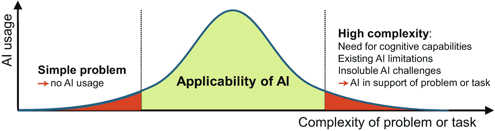
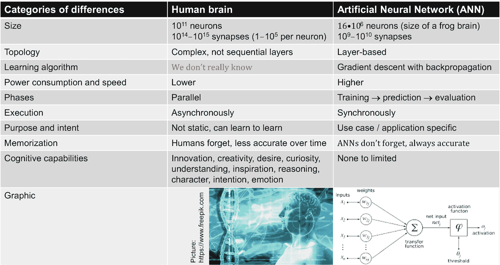
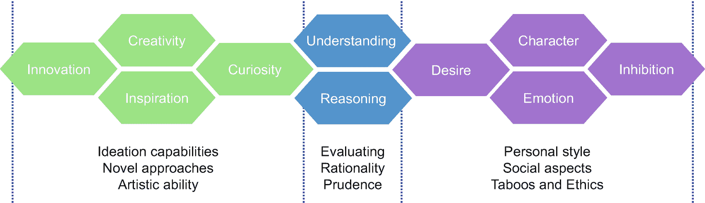

# 13.人工智能的局限性

人工智能的前景及其令人惊叹的应用范围似乎是无限的。因此，详细阐述人工智能的局限性可能会被我们的一些读者理解为反方向的旋转。人工智能与加速创新、洞察力和决策有如此多的联系，以至于我们认为它的机会是不可估量的。然而，即使对人工智能来说，也有限制和挑战，正如我们在本章中所了解的那样。

一个简单、直接的业务问题可能需要分析和洞察力来做出适当的决策；然而，将 AI 与 ML 或 DL 模型一起使用可能是不合适的，没有意义的，并且在没有提供新见解的情况下增加了不必要的复杂性。在某些情况下，现实和环境可能非常容易改变，在学习和部署 ML 模型之前，它可能已经毫无意义。正如我们在第 [8](08.html) 、 *AI 和治理、*章中所看到的，对于风险管理和合规性，可能还会有一些法律原因或合规性法规阻止或至少限制特定场景的 AI 应用。

## 介绍

在这一章中，我们重点关注当前人工智能的限制和挑战，这些限制和挑战要么阻止我们使用人工智能(例如，如果在一般化学习中需要多任务能力)，要么至少限制人工智能的适用性(例如，因为过于昂贵的数据标签和注释工作)。自主学习，即自我导向的学习，控制自己的学习行为以适应新的环境，并将学习与偏好、意见、观点和其他因素相结合，是人类可能希望保持控制的另一个领域。

我们还讨论了无法解决的挑战，如 ML 和 DL 模型的理解和推理缺失。我们处理人工智能的*限制的方式与应用和场景相关，在这些应用和场景中，我们遇到了人工智能和人工智能当前的限制和无法解决的挑战。尤其是无法解决的挑战可能会真正导致我们不使用人工智能——即使在遥远的未来。在这种背景下，我们也和大家分享一些 AI 的研究课题，比如*学会学习*(元学习)，最终会提高 AI 的适用范围。*

人工智能的局限性与理解和比较人工智能和人工智能与人脑有很大关系， [1](#Fn1) 尤其是在其认知和学习能力的背景下。在许多情况下，人类是至关重要的，可能永远不会被人工智能完全取代——即使在遥远的未来也不会。在我们关于人工智能的*限制的讨论中，我们打算让你对*敏感如何正确使用人工智能*以及何时使用*哪些*人工智能功能以及何时最好不使用。*

图 13-1

何时不使用人工智能

如图 [13-1](#Fig1) 所示，为了理解人工智能的*局限性，结合人类大脑的卓越和无与伦比的能力(特别是认知能力)、人工智能当前的技术差距或不足以及无法解决的人工智能挑战进行了讨论。有许多场景，需要人类的独特能力及其认知能力和广义学习技能，或者打击人工智能的局限性，例如企业家直觉、创造力和新颖的创新方法，理解和解释决策，以及对情况或环境的推理，等等。*

AI 的适用性很大，如图 [13-1](#Fig1) 中间区域所示。左边是相对简单的问题，可能明显不会从人工智能的使用中受益，而右边是高度复杂的问题和任务，例如，可能需要认知能力，或者当前人工智能的限制和不可解决的人工智能挑战可能会阻止人工智能的充分使用，或者允许人工智能“仅”支持人类。

## 人工智能和人脑

了解人工智能当前的局限性和人工智能面临的一些无法解决的挑战，建议将人脑与人工神经网络进行基本比较，人工神经网络是一种模拟生物神经网络结构和功能的计算模型。 [2](#Fn2) 图 [13-2](#Fig2) 包含了基本类别，我们用这些类别来讨论人脑与 ANN 的关键差异。

图 13-2

人脑和人工神经网络(ANN)

人类大脑大约由 10 个 11 个神经元和 10 个 14 个到 10 个 15 个突触组成(每个神经元有 1 到 10 个 5 个突触)，而最大的人工神经网络大约有 1610 个 6 个神经元和 10 个 9 个到 10 个 10 个突触，大约相当于一只青蛙的大脑大小。这种比较本身就说明了人类大脑的优越性——至少在今天是如此。此外，人类大脑的拓扑结构是复杂的，*充满了在多达 11 个维度中运行的多维几何结构，* [4](#Fn4) 没有像 ANN 那样结构化为连续的层。

我们的大脑是如何工作的有待研究。 [5](#Fn5) 关于这一点可能知道的不多；然而，我们学习的方式在很大程度上仍然是未知的。它是否可以被描述为一组算法，包括 DL 模型的最复杂的反向传播算法，是值得怀疑的。人工神经网络的学习主要通过各种反向传播算法来实现。我们从 ML 和 DL 模型中了解到的学习阶段，包括训练、验证、测试、预测、再训练等等，都是由人类以不同的方式完成的。人工神经网络本质上具有同步执行模式，而人脑以大规模异步、并行方式工作。例如，大脑的视觉识别是异步工作的；物体的颜色、形状和运动方向是异步处理和组合的。

人工神经网络的目的或目标是特定于应用或场景的。任何人工神经网络都有明确的目的。我们还没有人工神经网络灵活的多任务学习能力；没有一个人工神经网络能学会为一组任意的不同环境或目标学习。但是人脑可以；它适应性强。为了让人类生存下去，人类的大脑提出了创新的想法，甚至改变了它的环境和社会文化规范。安妮永远不会忘记任何事情； [6](#Fn6) 他们在他们所学的知识体系中总是准确的。人类会忘记，他们不太准确，这在某些情况下可能是一种优势。

普适人工智能需要包括认知能力，如创新和创造力，欲望和好奇心，理解和推理。此外，它应该包括受到某种事物的启发或发展一种性格(一种独特的、个性化的行为，以特定的观点和抑制为基础，植根于文化背景中)的能力，由一种意图驱动，最后但并非最不重要的是，它应该发展和应对情绪，而不仅仅是从社交媒体数据中理解情绪。需要这些认知能力的情况无疑向我们暗示了人工智能当前的局限性或 T2 如何使用人工智能来支持人类的决策。

## 当前人工智能的局限性

人工智能并不包含无限的能力；有一些明显的限制引起了怀疑和研究。本节专门讨论以下 AI 限制，这使我们能够回答何时不使用 AI *而不使用*，或者何时 AI 更多地是一种伴随方法的问题:

*   标签和注释

*   自主 ML 和 DL

*   多任务学习

*   决策的可解释性

让我们简单看一下 AI 的这四个局限。我们为感兴趣的读者提供了链接，以便更深入地研究这些领域。

### 标签和注释

标记数据是 ML 和 DL 的基本任务。用作训练 ML 或 DL 模型的输入的未标记的*原始*数据需要用额外的标签来标记，我们可以将其视为元数据。例如，添加分类信息(例如，欺诈或非欺诈、流失或非流失、接受或不接受营销提议)将*原始*数据转换为*标记的*数据，该数据用作 ML 分类模型的学习(训练)步骤的输入。注释是标记数据(如图像、视频、音频、文本等)的过程，以使数据可用于主要训练 DL 模型。

标签和注释的需求和挑战因行业而异。例如，许多不同的技术和使用场景，如汽车、摩托车、交通灯周围的边框，以及更多作为自动驾驶视频或图像注释的一部分，或者安全监控摄像头的人脸检测和识别，都有一个共同的特点:它们可能需要大量的人力资源和非常专业的工具和服务，并占用大量时间。

数据标记确实也是一个关键的研究领域。 [7](#Fn7) 问题通常通过应用其他技术来解决，例如在有限甚至零输入的情况下的强化学习和深度学习。然而，这些技术本质上是基于试错法，不可能用于某些场景，如自动驾驶或复杂医疗数据的模式识别，这些数据可用于推荐药物。

### 自主 ML 和 DL

训练人工神经网络的最大挑战之一是获得足够大的数据集进行训练，并进行非常耗时和消耗资源的学习过程，通常需要人工干预。自主 ML 和 DL 希望通过持续的学习自动化来简化这一过程，其中具有有限或甚至没有人工干预的自治过程能够改进和适应人工神经网络。这是一个新兴的研究领域，有潜力发展人工神经网络方法，甚至可以应付新的情况和场景。

今天，存在增加训练的 ANN 的灵活性的方法，以适应例如 ANN 的深度和结构，或者甚至在没有初始网络结构的情况下通过自构建网络结构从零开始开发 ANN *。* [8](#Fn8) 类似的目标也存在于强化学习(RL)中，其中一个代理根据它收到的奖励来学习改进它的行为。自主 RL 的挑战包括学习如何从数据或图像流中选择相关信息，其中语义、相关性或意义最初没有提供给代理。系统也可能被置于*不可恢复的状态，从该状态不能进行进一步的学习，* [9](#Fn9) 这需要创新的方法来为随后的学习周期重置系统。自主学习包括零输入学习。AlphaGo Zero

尽管这些都是有希望的成果和研究领域，但在现实世界中的应用，如自动驾驶汽车、工业机器人、放射或癌症诊断、外科机器人、靶向治疗和许多其他应用，都有些有限。在这些情况下，在将人工神经网络或其他模型应用于现场之前，需要对其进行学习。

### 多任务学习

在人工智能中，学习通常是针对一个特定的任务或问题，用一个 KPI 或措施。然而，在现实世界中，学习应该是多方面的。例如，这可能意味着不仅要通过监控摄像头识别人脸，还要解释情绪和情感方面的面部表情。理解讲话应该辅之以识别说话者的音调、口音或性别。为相关但不同的任务训练一个 DL 模型，这被称为多任务学习，是 DL 的一个新兴领域， [11](#Fn11) 其中学习的普遍性应该克服仅限于一个用例或任务的限制。

人类大脑在几乎所有情况下都进行多任务学习，无论我们是在博物馆看图片，还是在演讲时听另一个人说话，还是在开车。举例来说，作为一名汽车司机，当我们接近十字路口时，我们不仅要识别交通标志、绿灯或我们前面的汽车；我们可能会观察并解读另一辆正在靠近十字路口的汽车驾驶员的面部表情，或者预测一辆正在靠近的汽车是否能够正确地停在十字路口的可能性，或者在人行道上的小孩不应该过马路的可能性，或者我们前面的骑自行车的人是一位老人，等等。大多数司机已经学会考虑这些情况，这可能会导致决定进一步降低速度，准备刹车，甚至尽管有通行权也要让路。

这些例子以一种惊人的方式说明了当前人工智能的*局限性要求我们确定*何时*和*如何*使用*哪些*人工智能能力，以及我们可以在多大程度上依赖人工智能来支持人类决策。认识到人工智能的局限性决定了人工智能对某些问题和场景的适用性。*

### 决策的可解释性

缺乏可解释性对于人工智能系统来说根本不是一个新问题。随着人工神经网络或人工智能系统的复杂程度的增加，解释一个人工智能系统，随着其独立存在的增加，为什么以及如何诱导一个特定的决策变得越来越重要。让人工智能衍生的决策对人类来说是可理解的、可解释的和可信任的，这是至关重要的。我们已经在第 8 章、*人工智能和治理*中谈到了这些话题

基于人工智能的决策背后的基本原理需要对人类透明。例如，IBM Research 开发了一个全面的战略，该战略"*解决了信任的多个维度，以实现激发信心的人工智能解决方案*、" [12](#Fn12) ，包括一个人工智能可解释性 360 开源工具包，用于检测、理解和减轻不必要的算法偏差。

## 无法解决的挑战

对你来说，很明显，人类的大脑是人工智能无法超越的。当然，也有 AI 明显占优的领域；然而，人类的大脑闪耀着它的认知能力，它对新环境的适应性，以及它能处理怪异和古怪的情况。尽管人工智能取得了惊人的进步和令人信服的研究结果，但正如我们所确信的那样，仍然存在一些无法解决的人工智能挑战，我们将在本节详细阐述这些挑战。

### 认知能力

正如我们在“ *AI 和人类大脑*”一节中所指出的，认知能力当然是人类大脑的一个关键区别点，并且一直是一个令人着迷的问题。在我们的讨论中，我们专注于那些可能永远不会被人工智能获得的能力，而不会留下明显的和主要的差距。

图 13-3

认知能力

如图 [13-3](#Fig3) 所示，我们将人类的认知能力分为三组。人类——至少是大多数人——受好奇心和灵感的驱使。我们不仅意识到并执行他人给我们的指示；我们发展自己的想法，并寻找新的方法。创新和创造力是人类的同义词。最强大的安甚至*能提出正确的问题*导致爱因斯坦的广义或狭义相对论的发展吗？民主这个概念有没有可能是 AI 发明的，安有没有可能发明一种全新风格的音乐，不是照搬别人做过的，也不是照搬某个作曲家的风格，而是创造出一种全新的东西？这是我们人类闪光的地方——并将永远如此；AI 可以成为一个有用的伴侣，而不是更多。

需要谨慎地评估和执行决策。决策过程的合理性往往和决策本身一样重要。理解和推理是对简单决定的补充。在给定的上下文和环境中仔细检查决策的意义和合理性是人工智能系统正在努力解决的问题。同样，AI 可以在无数场景和任务中支持你，但理解和推理最终还是留给你。

每个人都是独一无二的；我们在解决问题的过程中发展出一种特殊的性格和个人风格。我们有欲望，发展情感；我们的决策、活动和商业实践深深植根于社会和文化规范中，其中禁忌和道德方面暗示着界限，甚至常常是对某些事情的抑制。

这些认知能力使我们以丰富多彩和有趣的方式相互联系在一起工作和打交道。需要宽容、考虑他人的意见和态度、情感和幽默，以及克制和妥协的能力；这些是许多情况下都需要的认知行为技能，在这些情况下，人工智能肯定不会坐在驾驶座上——也可能永远不会。

不是从数据和环境中学习，而是学习*如何改变*环境似乎是人类智能的一个层次，是 AI 无法超越的。

### 奇怪的情况

也不能足够准确地预测所有现实生活中的情况，也不可能确定对这些情况的适当的、人类等效的反应。我们以自动驾驶为例来说明这一点。

想象一下无人驾驶汽车可能不得不应对的情况——尽管这种情况很少发生——一辆卡车或一辆自行车逆向行驶，一辆救护车非法转弯，儿童在汽车有绿灯时过马路，或者公共汽车司机发出手势警告正在靠近的汽车前方有危险情况。

即使自动驾驶系统能够检测到这些情况，它们也可能无法像人类驾驶员学会的那样做出充分的反应。 [13](#Fn13) 自动驾驶系统及其雷达设备、摄像头和传感器可以检测其他汽车和自行车、交通标志和街道上的物体；然而，预测其他道路使用者、行人甚至动物的行为，并处理意外情况，对于任何人工智能系统来说都可能永远无法令人满意。

### 学习的一般化

可能阻碍你的人工智能努力的一个特殊方面是人工智能和人工神经网络对全新环境的适应性缺失。学习的一般化，允许适应和学习任意一组不同的学科和场景，在今天是完全不可能的。

这个方面甚至远远超出了多任务或自主学习的概念，我们在本章前面已经讨论过了。一般来说，ML 和 DL 模型仍然适用于一组给定的初始场景或问题。一旦经过训练，这些模型就会获得令人着迷的性能；然而，潜在的模型——即使是人工神经网络——将很难适用于另一个具有不同的未训练数据集的场景或领域。

AI 研究在广义学习 [14](#Fn14) 方面取得了很大进展。这听起来可能很奇怪，但人工神经网络泛化学习的一个重要方面是能够忘记过去的经历，例如，僵局或灾难性事件。

尽管结果很有希望，但这些方法的成熟和对现实生活中业务问题的适用性仍然是遥远的未来。

## 其他研究主题

正如你所想象的，有相当多的额外的人工智能研究主题，可以很容易地填满一本书。下表 [13-1](#Tab1) 包含了一些研究领域的非常简短的描述，进一步说明了当今 AI 能力的局限性。虽然你可能不需要深入细节，但我们的读者应该知道这些领域，以了解人工智能的*局限性和*如何正确使用* *人工智能*。*

表 13-1

人工智能研究领域

<colgroup><col class="tcol1 align-left"> <col class="tcol2 align-left"> <col class="tcol3 align-left"></colgroup> 
| 

#

 | 

研究领域

 | 

描述

 |
| --- | --- | --- |
| one | 超参数优化(HPO) | 学习是通过算法完成的。通过 HPO 来优化和调整学习算法，例如，ANN 层的数量、决策树的数量及其深度、学习速率等等。人工智能研究关注自动化和加速 HPO 方法，以消除或至少帮助手动调谐 |
| Two | 反向传播算法 | 本质上，反向传播算法用于通过调整权重来学习和改进人工神经网络。存在加速这些算法的研究努力(例如，通过片上加速)。此外，研究正集中于替代方法，超越具有反向传播的监督 DL(例如，自动编码器、对抗网络、使用进化算法的神经进化等)。) |
| three | 学会学习 | 人类可以学会如何学习，以便接近并最终解决未来未知的问题。在人工智能中，这是通过尝试开发元学习方法和自动设计 ML 和 DL 模型来解决的。这超出了学习的一般化，需要灵活性、常识、人类的学习方法，甚至人类已经发展了数百万年的人类本能 |

还有额外的人工智能研究领域， [15](#Fn15) 未在表中列出，与对抗网络相关， [16](#Fn16) RL，对话系统，人工智能的专用硬件，以及语音，仅举几例。

## 关键要点

我们总结了本章的一些要点，总结在表 [13-2](#Tab2) 中。

表 13-2

关键要点

<colgroup><col class="tcol1 align-left"> <col class="tcol2 align-left"> <col class="tcol3 align-left"></colgroup> 
| 

#

 | 

关键外卖

 | 

高级描述

 |
| --- | --- | --- |
| one | 人脑与人工神经网络相比 | 人脑和人工神经网络在大小、拓扑结构、能力、学习方法等方面有着重要的区别 |
| Two | 目前有人工智能的限制 | 人工智能有许多局限性，如标记和注释、自主人工智能、多任务学习和决策的可解释性 |
| three | 人工神经网络没有关键的认知能力 | 认知能力(创造力、灵感、好奇心、情感、理解、推理、欲望等。)是人工神经网络的一个关键区别 |
| four | 有一些无法解决的人工智能挑战 | 人工智能面临着许多无法解决的挑战，例如认知能力、应对怪异情况和概括学习 |
| five | 人工智能研究主题 | 有相当多的人工智能研究课题致力于自动化和加速 ML 和 DL 模型的学习和开发 |
| six | 学会学习 | 人类可以学习如何学会处理和解决未来未知的问题和挑战；AI 仍在为此苦苦挣扎 |

## 参考

1.  大脑与计算机:世纪挑战。ISBN-13: 978-9813145542，世界科学，2016。

2.  神经信息理论的原理:计算神经科学和代谢效率(教程介绍)。ISBN-13: 978-0993367922，塞伯特出版社，2018。

3.  斯通，J.V. *人工智能引擎:深度学习数学教程介绍*。ISBN-13: 978-0956372819，塞伯特出版社，2019。

4.  PHYS.ORG。埃因霍温理工大学。*新的 AI 方法增加了人工神经网络的能力*，2018，[`https://phys.org/news/2018-06-ai-method-power-artificial-neural.html`](https://phys.org/news/2018-06-ai-method-power-artificial-neural.html)(2019 年 10 月 18 日访问)。

5.  迪恩美国科学警报。*人脑可以创建多达 11 个维度的结构*，2018，[`www.sciencealert.com/science-discovers-human-brain-works-up-to-11-dimensions`](http://www.sciencealert.com/science-discovers-human-brain-works-up-to-11-dimensions)(2019 年 10 月 18 日访问)。

6.  振荡的大脑:我们的大脑是如何工作的。ISBN-13: 978-1489705815，LifeRich 出版社，2016。

7.  Carneiro，g . et al .*用于医疗应用的深度学习和数据标记*(计算机科学讲义，Band 10008)。ISBN-13: 978-3319469751，施普林格，2016。

8.  卡尔斯鲁厄理工学院。*自动驾驶训练数据*、[`www.kit.edu/downloads/pi/PI_2019_048_Training%20Data%20for%20Autonomous%20Driving.pdf`](http://www.kit.edu/downloads/pi/PI_2019_048_Training%2520Data%2520for%2520Autonomous%2520Driving.pdf)(2019 . 10 . 20 访问)。

9.  Ashfahani，a .，Pratama，M. *自主深度学习:动态环境的持续学习方法*，[`https://arxiv.org/pdf/1810.07348.pdf`](https://arxiv.org/pdf/1810.07348.pdf)(2019 年 10 月 21 日访问)。

10.  Eysenbach，b .、Gu，s .、Ibarz，j .、Levin，S. *不留痕迹:安全自主强化学习的学习重置*、[`https://openreview.net/pdf?id=S1vuO-bCW`](https://openreview.net/pdf%253Fid%253DS1vuO-bCW)(2019 年 10 月 22 日访问)。

11.  西尔弗博士，哈萨比斯博士 *DeepMind。研究博客帖子。AlphaGo Zero:从零开始*、[`https://deepmind.com/blog/article/alphago-zero-starting-scratch`](https://deepmind.com/blog/article/alphago-zero-starting-scratch)(2019 年 10 月 22 日访问)。

12.  Ruder，S. *深度神经网络多任务学习概述*、[`http://ruder.io/multi-task/`](http://ruder.io/multi-task/)(2019 年 10 月 22 日访问)。

13.  IBM。*信任人工智能——IBM Research 正在构建和启用人们可以信任的人工智能解决方案*、[`www.research.ibm.com/artificial-intelligence/trusted-ai/`](https://www.research.ibm.com/artificial-intelligence/trusted-ai/)(2019 年 10 月 23 日访问)。

14.  纽约时报。*尽管有厚望，但自动驾驶汽车是‘未来之路’*、[`www.nytimes.com/2019/07/17/business/self-driving-autonomous-cars.html`](https://www.nytimes.com/2019/07/17/business/self-driving-autonomous-cars.html)(2019 年 10 月 25 日访问)。

15.  Doumas，L.A.A .，Puebla，g .，Martin，A.E .通过谓词学习在机器中实现类人泛化，[`https://arxiv.org/ftp/arxiv/papers/1806/1806.01709.pdf`](https://arxiv.org/ftp/arxiv/papers/1806/1806.01709.pdf)(2019 年 10 月 26 日访问)。

16.  IBM。艾研究，[`www.research.ibm.com/artificial-intelligence/`](https://www.research.ibm.com/artificial-intelligence/)(2019 年 10 月 27 日访问)。

<aside aria-label="Footnotes" class="FootnoteSection" epub:type="footnotes">Footnotes [1](#Fn1_source)

关于将人脑与计算机和人工智能进行比较的更多信息，请参见[1]。

  [2](#Fn2_source)

有关神经设计、神经信息论和 DL 的数学背景的更多信息，请参见[2]和[3]。

  [3](#Fn3_source)

关于比较生物学和人工神经网络的更多信息，参见[4]。

  [4](#Fn4_source)

关于人脑结构的更多信息见[5]。

  [5](#Fn5_source)

关于我们大脑如何工作的更多信息见[6]。

  [6](#Fn6_source)

请参阅“人工神经网络遗忘的新方法”的附加研究主题部分。

  [7](#Fn7_source)

有关医疗应用数据标签的更多信息，请参见[7]和[8]。

  [8](#Fn8_source)

有关自治 DL 的更多信息，请参见[9]。

  [9](#Fn9_source)

有关自主 RL 的更多信息，请参见[10]。

  [10](#Fn10_source)

有关 AlphaGo 和 AlphaGo Zero 的更多信息，请参见[11]。

  [11](#Fn11_source)

关于多任务学习的更多信息见[12]。

  [12](#Fn12_source)

参见[13]关于 IBM Research 使人工智能解决方案激发信心的策略的更多信息。

  [13](#Fn13_source)

参见[14]了解更多关于奇怪情况下自动驾驶汽车的挑战。

  [14](#Fn14_source)

参见[15]关于学习的类人概括的更多信息。

  [15](#Fn15_source)

更多人工智能研究领域见[16]。

  [16](#Fn16_source)

对立网络是人工神经网络结构，其中两个人工神经网络相互竞争和合作，以提高最终人工神经网络的整体准确性。

 </aside>