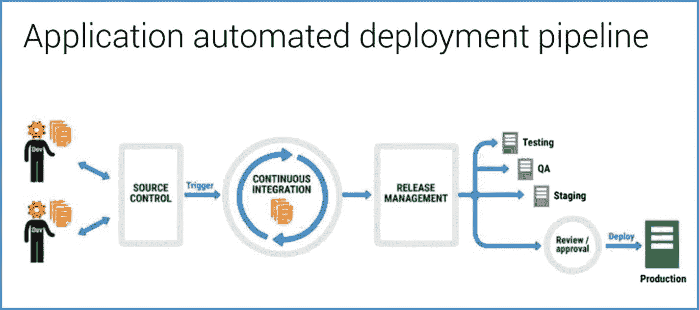
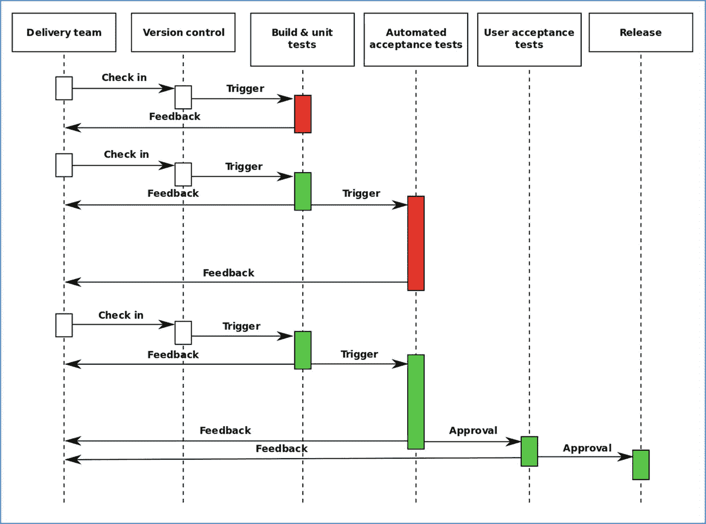

# 一、面向 Azure 的 DevOps

DevOps 完全是为了自动化应用部署流程。它解决了与手动应用部署相关的缺点。应用部署过程包含几个步骤，从编写代码到将创建的版本部署到目标环境，即 Microsoft Azure Cloud。本章讨论开发运维的需求、开发运维功能、应用部署流程和开发运维工具。

## DevOps 的需求

传统上，软件开发生命周期保证了承担特定任务的独立团队，即开发团队和运营团队。开发人员负责编写代码，将源代码签入源代码控制，测试代码，对代码进行 QA，并为部署做准备。运营/生产团队负责将代码部署到服务器，然后与客户协调并向开发人员提供反馈。这种孤立的工作大多是手动过程，只有少量孤立的应用/软件部署工作。这种手动过程有几个缺点，其中一些如下:

*   不同团队之间的沟通差距会导致怨恨和责备，这反过来会延迟修复错误。
*   整个过程花了很长时间才完成。
*   最终产品不符合所有要求的标准。
*   出于安全原因，某些工具无法在生产服务器上实现。
*   沟通障碍降低了性能，增加了效率低下。

为了解决这些缺点，出现了对自动化的推动，导致了 DevOps 的发展。DevOps 是两个术语和两个团队的组合，即开发人员和运营人员。顾名思义，它在应用开发和部署过程中集成了这两个团队(开发人员和运营/生产)的功能。

## 描述 DevOps 的功能

DevOps 的基本功能如下:

*   自动化应用部署的整个过程。因此，整个过程简单明了。
*   允许多个开发人员同时在源代码库中签入和签出代码。
*   提供一个持续集成(CI)服务器，它从源存储库中汇集代码，并通过自动运行和传递单元测试和功能测试来准备构建。
*   自动化测试、集成、部署和监控任务。
*   自动化工作流和基础架构。
*   通过持续测量应用性能来提高工作效率和协作。
*   允许整个软件开发过程的快速和可靠的构建、测试和发布操作。

## DevOps 应用部署流程

整个应用部署过程如图 [1-1](#Fig1) 所示。

图 1-1

The application deployment process

现在让我们回顾一下应用部署流程中的各个步骤:

1.  开发人员编写代码。
2.  代码被签入到源代码管理/源代码存储库中。
3.  代码签入触发持续集成(CI)服务器来生成构建。自动化单元测试可以在构建过程中完成。代码覆盖率和代码分析也可以在这个步骤中执行。如果存在构建错误、单元测试失败，或者违反了代码覆盖率和代码分析规则，就会生成一个报告，并自动发送给开发人员进行更正。
4.  然后，成功的构建被发送发布。这就是发布管理过程进入画面的地方，借此执行测试、QA 和阶段化操作。进行了几种类型的测试，其中一些是:
    *   模块测试
    *   子系统测试
    *   系统测试
    *   验收测试 
5.  In the QA phase, the following types of tests are performed:
    *   回归测试
    *   功能测试
    *   特性试验Once the code passes all of the tests, a release version of the software, also called the “golden image,” is prepared. If any of the preceding tests fail, a report about the bug is generated for the team of developers who checked in the code. The development team must first fix the bug and check in the code again. The code goes through the same process of generating the build and release until the code passes all tests. Figure [1-2](#Fig2) shows the release management process.

    

    图 1-2

    Release management process  
6.  流程的最后一步是将创建的版本部署到目标环境—Microsoft Azure Cloud([`https://azure.microsoft.com`](https://azure.microsoft.com))。一旦部署完成，对 Azure 中目标环境的用户来说，代码中的所有更改都是有效的。

## 了解 DevOps 工具

有几个 DevOps 工具可以帮助您开发一个有效的自动化环境。您还可以使用单独的工具在 DevOps 中执行特定的操作。基于广义功能的工具列表如下。请注意，为了演示 DevOps 原则，我们选择了一组工具作为示例。

*   构建自动化工具:这些工具自动化了创建软件构建、编译源代码和打包代码的过程。一些构建自动化工具有:
    *   Apache Ant ( [`https://ant.apache.org/bindownload.cgi`](https://ant.apache.org/bindownload.cgi)
    *   Apache Maven ( [`https://maven.apache.org/download.cgi`](https://maven.apache.org/download.cgi)
    *   开机( [`http://boot-clj.com/`](http://boot-clj.com/) )
    *   度( [`https://gradle.org/`](https://gradle.org/)
    *   咕哝( [`https://gruntjs.com/`](https://gruntjs.com/) `)`
    *   MSBuild ( [`https://www.microsoft.com/en-in/download/details.aspx?id=48159`](https://www.microsoft.com/en-in/download/details.aspx%3Fid%3D48159)
    *   Waf ( [`https://waf.io/`](https://waf.io/) )
*   持续集成工具:当代码变更被登记到中央存储库时，这些工具自动创建构建并运行测试。一些 CI 工具包括:
    *   竹子( [`https://www.atlassian.com/software/bamboo/download`](https://www.atlassian.com/software/bamboo/download) )
    *   建筑机器人( [`https://buildbot.net/`](https://buildbot.net/)
    *   Hudson ( [`http://hudson-ci.org/`](http://hudson-ci.org/)
    *   TeamCity ( [`https://www.jetbrains.com/teamcity/download/`](https://www.jetbrains.com/teamcity/download/) )。我们将在本书中重点介绍这个工具。
*   测试工具:这些工具使测试过程自动化。这些工具帮助组织在指定的时间框架内实现配置和交付管理需求。一些常用的测试工具有:
    *   硒( [`http://www.seleniumhq.org/`](http://www.seleniumhq.org/)
    *   Watir ( [`http://watir.com/`](http://watir.com/)
    *   Wapt ( [`https://www.loadtestingtool.com/`](https://www.loadtestingtool.com/)
    *   阿帕奇 JMeter ( [`http://jmeter.apache.org/download_jmeter.cgi`](http://jmeter.apache.org/download_jmeter.cgi) )
    *   QTest ( [`https://www.qasymphony.com/qtest-trial-qascom/`](https://www.qasymphony.com/qtest-trial-qascom/)
*   版本控制系统:这是一个配置管理系统，负责文档、代码、文件等的所有变更。一些常用的版本控制系统有:
    *   颠覆( [`https://subversion.apache.org/`](https://subversion.apache.org/)
    *   team Foundation Server(TFS)([`https://www.visualstudio.com/tfs/`](https://www.visualstudio.com/tfs/))。我们将在本书中重点介绍这个工具。
    *   去吧( [`https://git-scm.com/`](https://git-scm.com/)
    *   水银( [`https://www.mercurial-scm.org/`](https://www.mercurial-scm.org/) )
    *   穿孔( [`https://www.perforce.com/`](https://www.perforce.com/) )
*   代码评审工具:这些工具帮助组织提高代码质量。一些代码评审工具是:
    *   坩埚( [`https://www.atlassian.com/software/crucible`](https://www.atlassian.com/software/crucible) )
    *   gerri ty([`https://www.gerritcodereview.com/`](https://www.gerritcodereview.com/)
    *   GitHub ( [`https://github.com/`](https://github.com/)
    *   比特巴克服务器( [`https://www.atlassian.com/software/bitbucket/server`](https://www.atlassian.com/software/bitbucket/server)
*   持续交付/发布管理工具:这些工具自动化了构建和测试代码变更的过程，以便发布到产品中。这些工具包括:
    *   XL 发布( [`https://xebialabs.com/products/xl-release/`](https://xebialabs.com/products/xl-release/) )
    *   电流量( [`http://electric-cloud.com/products/electricflow/`](http://electric-cloud.com/products/electricflow/)
    *   瑟琳娜发布( [`https://www.microfocus.com/serena/`](https://www.microfocus.com/serena/) )
    *   章鱼部署( [`https://octopus.com/downloads`](https://octopus.com/downloads) )。我们将在本书中重点介绍这个工具。
*   一体化平台:这些工具结合了前面列出的工具的功能。一些一体化平台包括:
    *   制作图( [`http://www.productionmap.com/`](http://www.productionmap.com/)
    *   詹金斯( [`https://jenkins.io/`](https://jenkins.io/) )
    *   微软 Visual Studio 团队服务(VSTS) ( [`https://www.visualstudio.com/team-services/`](https://www.visualstudio.com/team-services/) )。我们将在本书中重点介绍这个工具。
    *   AWS 代码管道()

有了对基本原理的基本理解，你就可以向前迈进，更深入地探究细节了。我们首先讨论独立工具，然后讨论一体化集成平台。

## 摘要

本章讨论了开发运维相对于手动应用部署流程的重要性。DevOps 在应用开发和部署过程中集成了两个团队(开发人员和运营/生产)的功能。本章介绍了 DevOps 的基本功能。讨论了应用部署的整个过程。在本章的结尾，提供了一个 DevOps 工具列表。