# 2.通过 TeamCity 和 Octopus Deploy 部署

如前一章所述，DevOps 中的应用程序部署需要持续集成(CI)工具和持续交付(CD)工具/发布管理软件来自动化整个流程。目前，市场上有几种可用的工具。本章讨论了三个同类最佳的工具——作为 CI 工具的 TeamCity、作为发布管理工具的 Octopus Deploy 和在 Azure web 应用程序上部署软件包的 CD 软件。由于不同的供应商提供这些同类最佳的工具，将它们集成到一个解决方案中会有一些复杂性。

## 微软公共云 Azure 简介

在我们深入研究 DevOps 工具之前，让我们回顾一下部署环境。提醒一下，我们关注的是微软 Azure。但是，请确保本章中的信息可以应用于其他公共云解决方案。

Azure 有能力托管应用程序。这些应用程序可以很容易地与 Azure 平台上的其他应用程序和服务进一步集成。Azure 的集成特性为客户提供了增强的业务灵活性和效率。他们帮助用户将源代码部署到多个 Azure 网站。

## 理解团队精神

TeamCity 是一个面向开发者的 CI 服务器，由 JetBrains 提供支持。它提供了几个相关的功能:

*   支持不同的平台/工具/语言
*   自动化构建和部署流程
*   提高团队的质量和标准
*   作为工件和 NuGet 存储库工作
*   提供报告和统计功能

Definition

根据 Martin Fowler 的说法，“持续集成是一种软件开发实践，在这种实践中，开发人员一天数次将代码变更提交到共享存储库中。每次提交后都会进行自动构建，以确保新的更改能够很好地集成到现有的代码库中，并尽早发现问题。”

### 团队精神的基本概念

以下是团队城市的基本概念:

*   项目:指一组构建配置。
*   生成配置:是指定义生成过程的设置(VCS 根、生成步骤和生成触发器)的集合。
*   VCS 根:指一组版本控制设置(源路径、用户名、密码等。)允许 TeamCity 与版本控制系统进行交互，以管理构建的修改和源代码。
*   构建步骤:指由服务器执行的任务。它由构建运行程序表示。
*   构建运行器:集成了不同的工具，包括构建工具(Ant、Gradle、MSBuild、PowerShell 等。)，一个测试框架(JUnit，NUnit 等)。)，以及一个代码分析引擎。它描述了构建工作流。
*   构建代理:指负责执行构建过程的应用程序。它帮助开发人员获得更快的反馈，因为不同的测试可以在构建代理支持的不同平台上同时运行。
*   TeamCity server:指的是服务器应用程序，它管理所有的构建代理，管理构建代理的构建序列，并传达结果。
*   版本:指程序/应用程序版本。
*   构建触发器:指的是当特定事件发生时自动启动新构建的规则。
*   构建队列:是指一系列已被触发但尚未开始的构建。这些构建在可用时被分配给各自的代理。
*   构建工件:指的是一组文件(安装程序、WAR 文件、报告、日志文件等。)由构建过程生成。

### 在 TeamCity 中配置生成

在本节中，我们将在 TeamCity 中为 PowerShell 脚本配置参数。这将使 TeamCity 能够执行 PowerShell 脚本。对于这个场景，我们创建了一个名为`[string]App.Ps1`的 PowerShell 脚本。

构建配置使用面向步骤的方法，这将在下面几节中概述。

#### 步骤 1:创建项目

要在 TeamCity 中配置一个构建，首先要创建一个项目。此任务有几个选项，如下所示:

*   用手
*   指向存储库 URL
*   指向 GitHub.com 的一个仓库
*   指向一个比特桶云存储库

执行以下步骤创建标准项目:

1.  单击管理区域右上角的管理链接。
2.  单击“创建项目”按钮旁边的向下箭头按钮。出现一个下拉列表。
3.  从下拉列表中选择手动选项，手动创建项目。单击“手动”选项后，将出现“创建新项目”页面。
4.  在名称文本框中输入所需的项目名称。
5.  在项目 ID 文本框中输入所需的项目 ID。
6.  在描述文本框中输入所需的项目描述。
7.  单击“创建”按钮创建项目。

现在，项目已经创建。

#### 步骤 2:创建构建配置

构建配置描述了获取和构建项目源代码的过程。一旦创建了项目，TeamCity 就会提示您创建构建配置。创建构建配置的替代方法如下:

*   用手
*   指向存储库 URL
*   指向 GitHub.com 的一个仓库
*   指向一个比特桶云存储库

执行以下步骤来手动创建构建配置:

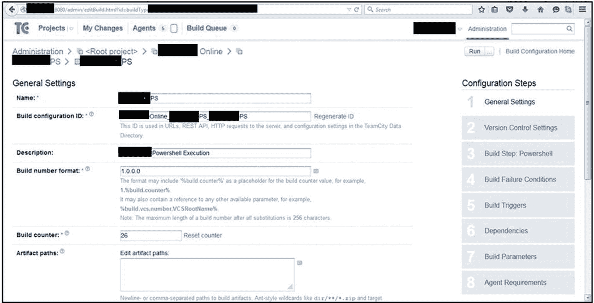

图 2-1

General Settings page

1.  单击“创建构建配置”按钮旁边的向下箭头按钮。出现一个下拉列表。
2.  从下拉列表中选择手动选项，以手动创建构建配置。
3.  在“名称”文本框中指定生成配置的名称。
4.  在“生成配置 ID”文本框中指定生成配置 ID。
5.  在描述文本框中指定所需的描述。
6.  单击保存按钮。图 [2-1](#Fig1) 显示了通用设置页面。

#### 步骤 3:配置版本控制设置

在这一步，我们提供与 VCS 根相关的设置。VCS 根描述了到版本控制系统的连接，并且有几个设置与它相关联。这些设置允许 VCS 与团队城市进行通信。它们定义了监视变更和为构建指定源代码的方式。执行以下步骤来配置版本控制设置:

1.  选择版本控制设置选项卡。
2.  单击附加 VCS 根按钮。将出现“新 VCS 根”页面。
3.  从 VCS 类型下拉列表中选择所需的 VCS 类型。我们选择了颠覆。
4.  在 VCS 根名称文本框中指定唯一的 VCS 根名称。
5.  在 VCS 根 ID 文本框中指定唯一的 VCS 根 ID。根据所选的 VCS 类型，连接设置会出现在页面上。在我们的例子中，会出现 SVN 连接设置部分。
6.  在 URL 文本框中指定存储库 URL。
7.  要允许 TeamCity 与源存储库通信，请分别在用户名和密码文本框中指定用户名和密码。
8.  单击“测试连接”按钮来测试连接。这验证了 TeamCity 可以与存储库进行通信。出现一个测试连接消息框，显示`Connection Successful`消息。如果连接失败，请检查指定的 URL 和凭据。
9.  Click the Create button. Figure [2-2](#Fig2) shows the settings for the New VCS Root page.

    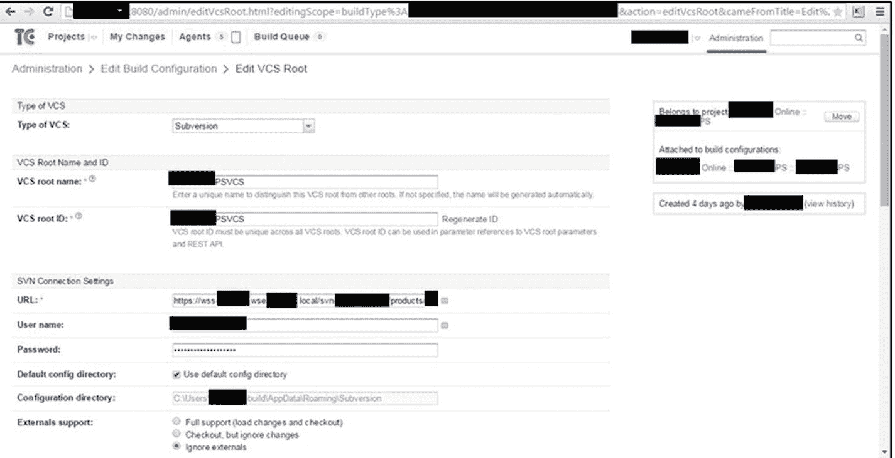

    图 2-2

    Settings for the New VCS Root page  

#### 步骤 4:配置构建步骤

一旦创建了 VCS 根，我们就可以配置构建步骤了。执行以下步骤来添加构建步骤:

1.  选择“构建步骤”选项卡。
2.  单击“添加构建步骤”按钮。将出现“构建步骤”页面。
3.  从“流道类型”下拉列表中选择 PowerShell 选项。注意在这个例子中，我们使用名为`[string]App.ps1`的 PowerShell 脚本文件。这个文件编译源代码。
4.  在步骤名称文本框中指定所需的步骤名称。
5.  从执行步骤下拉列表中选择所需的步骤执行策略。
6.  从脚本下拉列表中选择文件选项。
7.  Specify the path to the PowerShell script in the Script File box. This field contains the physical path mapped to the `[string]App.ps1` script, which is located on the build agent, as shown in Figure [2-3](#Fig3).

    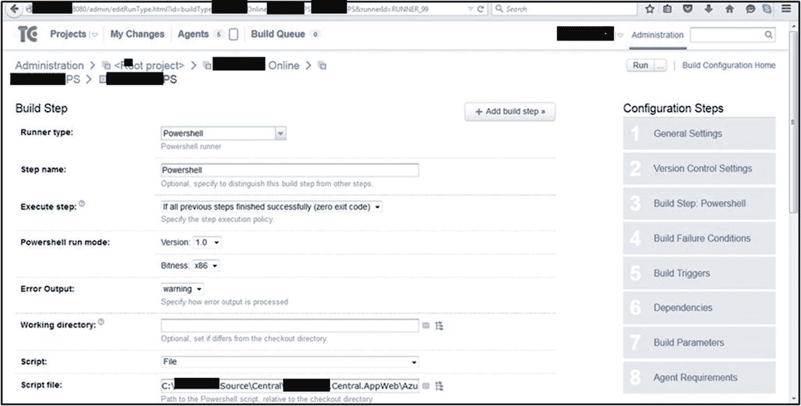

    图 2-3

    Creating a build step  
8.  在脚本执行模式选项中指定 PowerShell 脚本执行模式。
9.  在脚本参数部分输入脚本参数。我们输入了五个参数，它们将在 TeamCity 执行期间传递给`[string]App.ps1`脚本。

Arguments Passed to the Powershell Script

所有的参数都应该根据它们的相对路径来解释。传递给 PowerShell 脚本的所有参数的描述如下:

*   `..\Workflow`:允许 PowerShell 脚本访问`Workflow`文件夹的内容。
*   `..\Central`:允许 PowerShell 脚本访问`Central`文件夹的内容。
*   `..\Server`:允许 PowerShell 脚本访问`Server`文件夹的内容。
*   `Nuget.exe`:允许 PowerShell 脚本加载`Nuget.exe`文件，该文件位于构建代理上。
*   `v. Targetfolder`:指定编译后的代码所在的构建代理上的文件夹的路径。

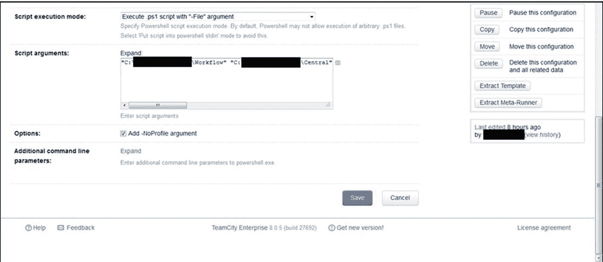

图 2-4

Saving the build step

1.  点击保存按钮，如图 [2-4](#Fig4) 所示。

在 TeamCity 中创建了一个成功的 build，可通过 PowerShell 脚本`[string]App.ps1`执行，如图 [2-5](#Fig5) 所示。

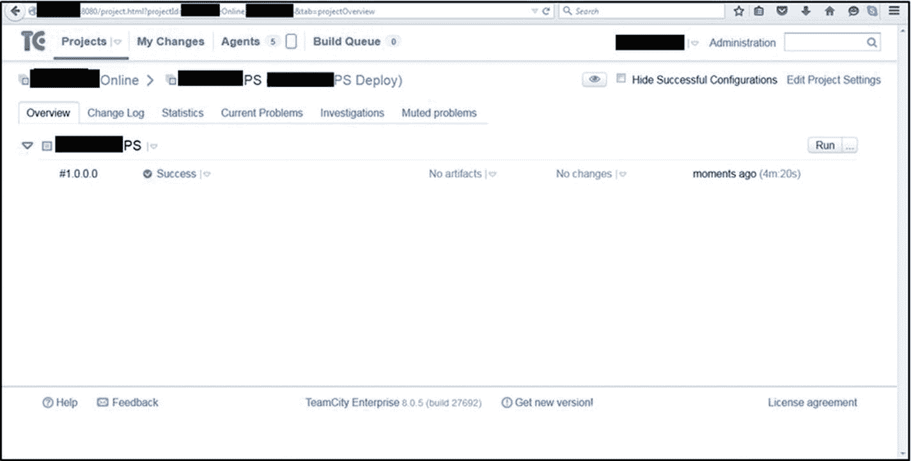

图 2-5

Successful build message

## 创建包

一旦 TeamCity 创建了一个成功的构建，可能需要对 PowerShell 脚本(`[string]App.ps1`)进行更改。例如，我们可能需要修改`NugetExePath`来接受一个新的参数，如图 [2-6](#Fig6) 所示。

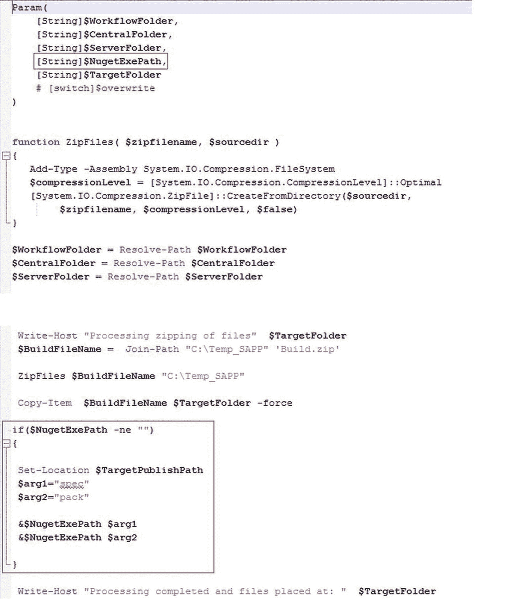

图 2-6

Making changes to NugetExePath

对 PowerShell 脚本所做的更改会在目标文件夹中创建一个包。

图 [2-7](#Fig7) 显示了创建的 NuGet 包。

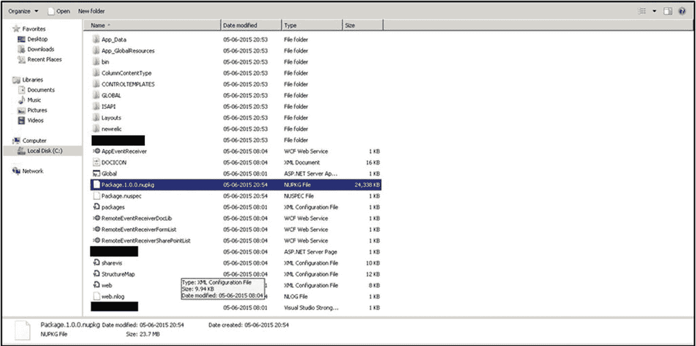

图 2-7

The NuGet package

将这个 NuGet 包从构建代理复制到它将被导入到 Octopus 服务器用于部署的地方，如图 [2-8](#Fig8) 所示。

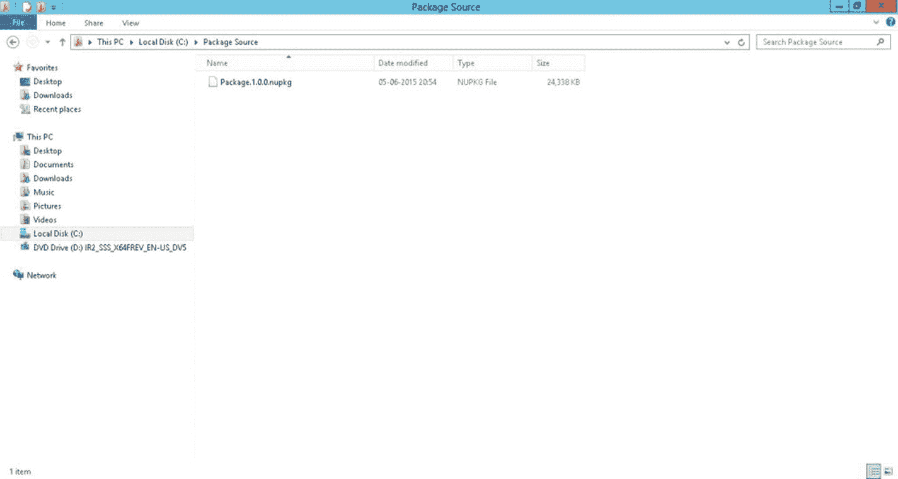

图 2-8

NuGet package ready for deployment

## 使用 Octopus 部署

Octopus Deploy 是一个部署服务器(或发布管理软件)，可以自动将不同的应用程序部署到不同的环境中。它使这个过程变得毫不费力。

Octopus Deploy 自动部署:

*   ASP.NET 网络应用
*   Java 应用程序
*   数据库更新
*   NodeJS 应用程序
*   自定义脚本

Octopus Deploy 支持以下环境:

*   发展
*   试验
*   生产

Octopus Deploy 提供一致的部署流程，以支持团队成员的部署需求；Octopus 用户可以定义部署软件的过程。Octopus 用户可以为不同的应用程序指定不同的环境，并可以为不同的团队成员设置部署到不同环境的权限。例如，一个团队成员可以被授权部署到一个测试环境，同时也被限制到生产部署。

Note

Octopus Deploy 的最新 MSI 可以在 [`https://octopus.com/downloads`](https://octopus.com/downloads) 下载。

### 创建项目

Octopus Deploy 允许用户创建项目。在 Octopus Deploy 中，项目是一组可交付的组件，包括网站和数据库脚本。Octopus Deploy 中创建了一个项目，用于管理不同环境中的多个软件项目。例如，如果有六个开发人员在同一个业务项目上工作，我们需要在 Octopus Deploy 中创建一个项目。

执行以下步骤创建项目:

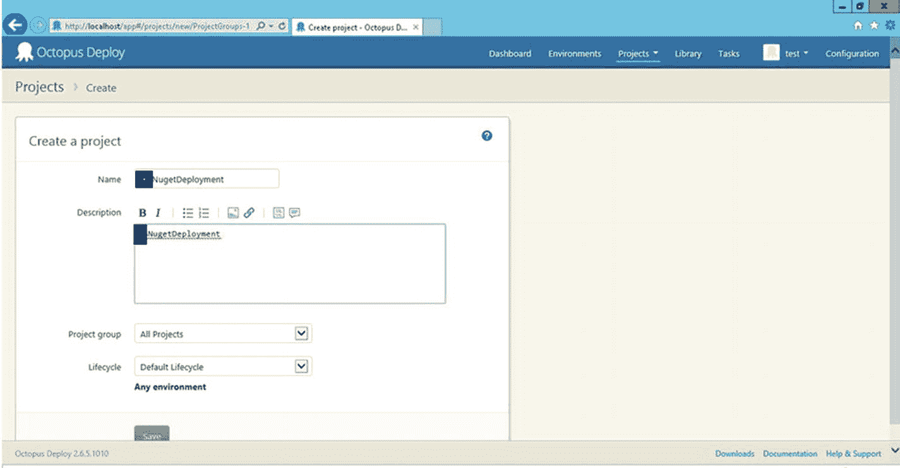

图 2-9

Steps to create a project

1.  导航到项目区域。
2.  单击添加项目按钮。将打开“创建项目”页面。
3.  在名称文本框中为项目指定一个相关名称。
4.  在描述文本区域中指定项目的相关描述。
5.  从项目组下拉列表中选择所需选项。
6.  从“生命周期”下拉列表中选择所需的生命周期。
7.  点击保存按钮，如图 [2-9](#Fig9) 所示。

Note

生命周期用于在环境之间自动复制部署。

### 创造环境

环境是软件同时部署到的一组机器。Octopus 部署中的常见环境是测试、验收、试运行和生产。换句话说，环境可以定义为一组部署目标(Windows 服务器、Linux 服务器、Microsoft Azure 等)。).对于当前场景，我们正在创建两个环境，以便我们可以部署到两个网站。每个环境代表一个租户。

执行以下步骤来创建环境:

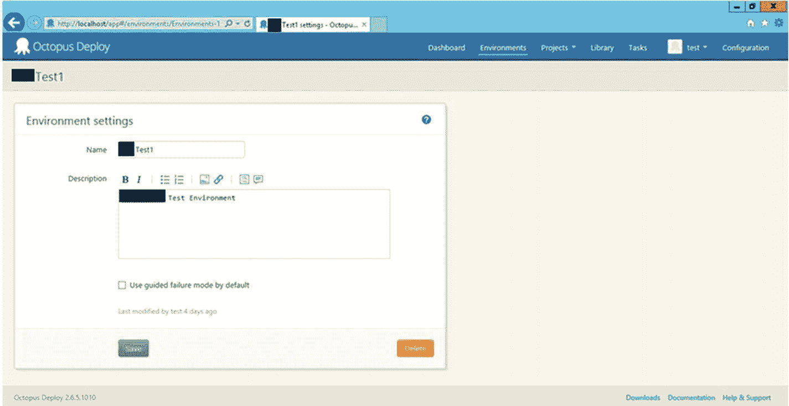

图 2-10

Steps to create an environment

1.  导航到环境区域。
2.  单击“添加环境”按钮添加环境。将打开“环境设置”页面。
3.  在名称文本框中输入环境的相关名称。在这种情况下，我们输入`Test1`。
4.  在描述文本框中输入环境的相关描述。
5.  点击保存按钮，如图 [2-10](#Fig10) 所示。

同样，创建另一个名为`Test2`的环境，如图 [2-11](#Fig11) 所示。

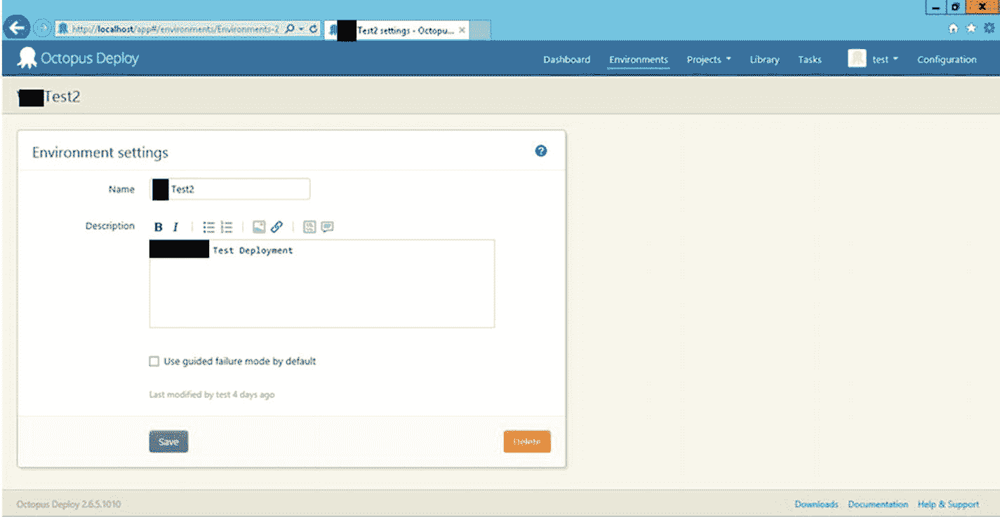

图 2-11

Steps to create another environment

### 上传 NuGet 包到 Octopus Deploy

我们现在可以在 Octopus Deploy 上上传 NuGet 包，这个包是我们之前在 TeamCity 中使用 PowerShell 脚本创建的。

执行以下步骤上传 NuGet 包:

1.  在 Octopus 部署界面中导航到库，然后导航到包。
2.  Click the Upload Package button, as shown in Figure [2-12](#Fig12).

    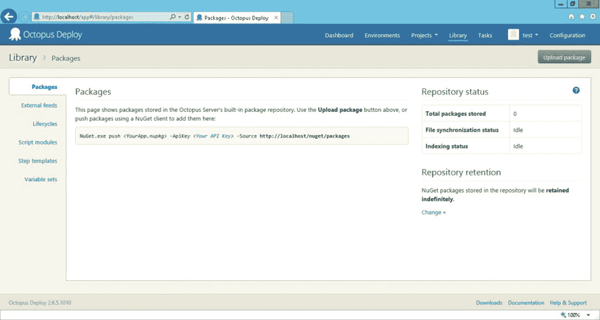

    图 2-12

    Clicking the Upload Package button The Upload a NuGet Package page appears.  
3.  单击 NUPKG 文件选项旁边的浏览按钮。出现“选择要上传的文件”对话框。
4.  导航到包的位置。如前所述，我们将包复制到了`Package Source`文件夹中。
5.  选择包。
6.  Click the Open button, as shown in Figure [2-13](#Fig13).

    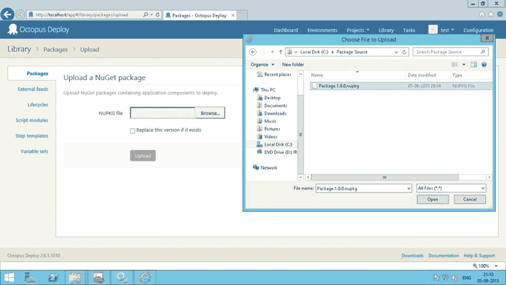

    图 2-13

    Uploading a NuGet package The name of the selected package file with its complete path appears in the NUPKG File box.  
7.  点击上传按钮。

单击上传按钮后，包文件开始上传。

### 创建部署流程的步骤

如前所述，Octopus Deploy 允许用户轻松地为他们的项目定义部署过程。用户可以使用模板向部署流程添加步骤，包括内置步骤模板、自定义步骤模板和社区贡献的步骤模板。

用户还可以选择“添加步骤”按钮来显示模板列表，然后选择所需的步骤。内置步骤可用于处理常见的部署场景。

在当前场景中，我们为部署流程创建了以下两个步骤:

*   NugetDeploy:这一步将 NuGet 包部署到一台或多台运行触手部署代理的机器上。
*   web Deploy-Publish Website(ms Deploy):创建这个步骤是为了通过跨机器运行 PowerShell 脚本将 NuGet 包部署到 Azure 网站。

执行以下步骤来添加 NugetDeploy 步骤:

1.  选择“流程”选项卡。
2.  单击添加步骤按钮。选择步骤类型弹出窗口显示内置步骤模板列表。
3.  选择所需的内置步骤模板。在这种情况下，我们选择了部署一个 NuGet 包选项。将显示“步骤详细信息”页面。
4.  在步骤名称文本框中输入步骤的名称。在本例中，我们输入了 NugetDeploy。
5.  在“机器角色”文本框中指定目标机器。在本例中，我们选择了 WebRole。
6.  从 NuGet feed 下拉列表中选择所需的包 Feed。
7.  Click the Add button. Figure [2-14](#Fig14) shows the details of the NugetDeploy step.

    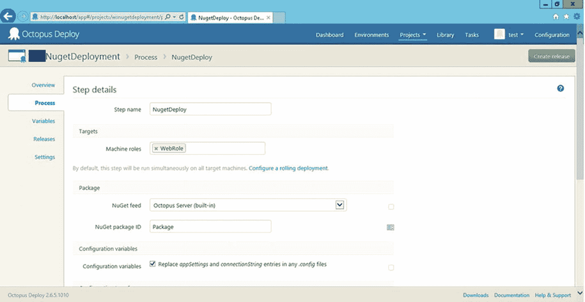

    图 2-14

    The NugetDeploy step  

在图 [2-14](#Fig14) 中，我们看到 NuGet 包 ID 字段包含了之前上传的 NuGet 包的名称。

同样，我们可以使用名为`Web Deploy-Publish Website (MSDeploy)`的自定义步骤模板添加一个步骤，如图 [2-15](#Fig15) 所示。

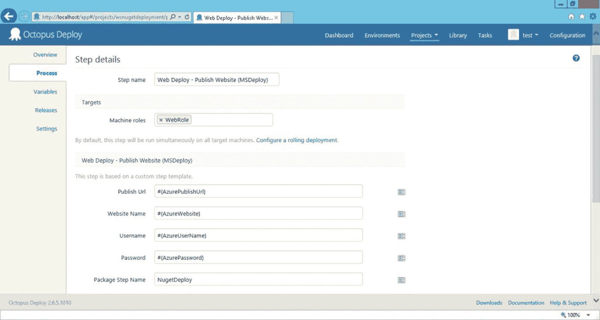

图 2-15

Adding a step

我们可以通过选择已创建项目的过程页签来查看已创建的步骤，如图 [2-16](#Fig16) 所示。

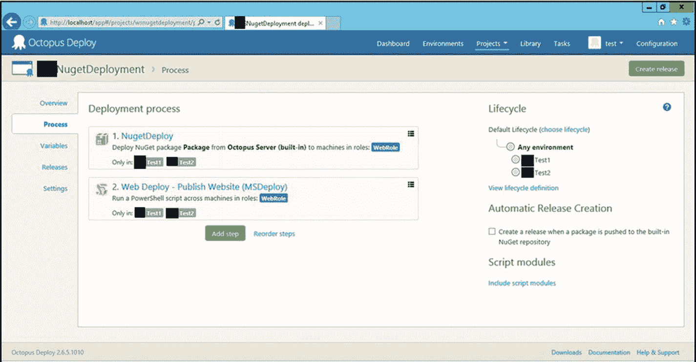

图 2-16

Displaying the created steps

### 使用变量

需要变量来消除硬编码配置值的需要，以便轻松支持不同的环境。将包部署到 Azure 网站时需要它们。由于 NuGet 包在两个站点之间共享，我们使用了`OctopusBypassDeploymentMutex`变量来避免 NuGet 包的资源锁定，如图 [2-17](#Fig17) 所示。

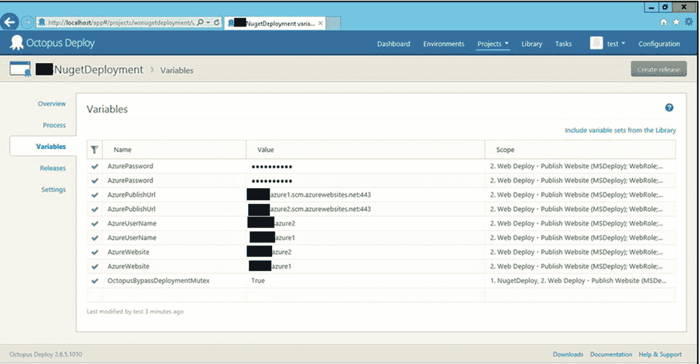

图 2-17

The OctopusBypassDeploymentMutex variable

### 创建和部署版本

一个发布包含了项目和包的所有细节，因此它可以根据需要部署到不同的环境中。执行以下步骤来创建版本:

1.  导航到概述页面，该页面显示项目的所有详细信息。
2.  点击“创建发行”按钮。将出现“创建”页面。
3.  在版本文本框中输入所需的发布版本。
4.  从包列中选择所需的包。
5.  在发行说明文本区域输入所需的发行说明。
6.  Click the Save button. Figure [2-18](#Fig18) shows the process of creating a release.

    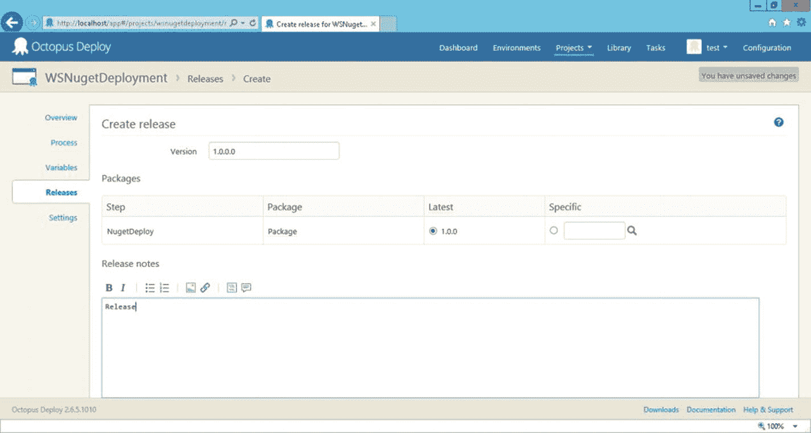

    图 2-18

    Creating a release Note In the current scenario, we are creating a release to deploy the NuGet package to multiple Azure websites. A release is created with the specified version. The Deploy page opens. Here, we can select the desired environment to which we want to deploy the created release. We can also click the Change button to change the environment.  
7.  Click the Deploy Now button to deploy the created release, as shown in Figure [2-19](#Fig19).

    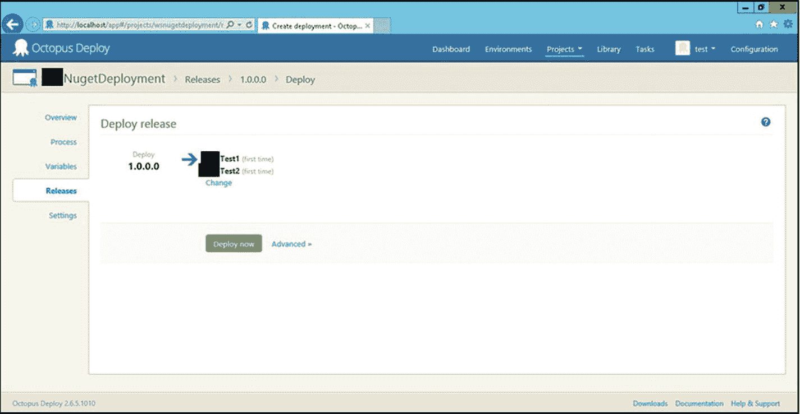

    图 2-19

    Deploying a release  

该版本成功部署到两个 Azure 网站，如图 [2-20](#Fig20) 所示。

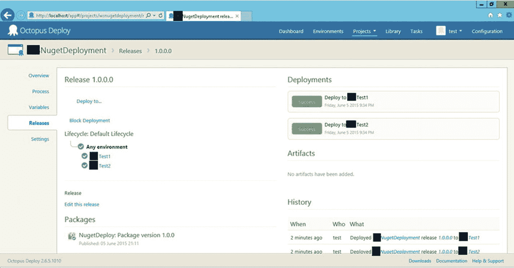

图 2-20

Deployment result

我们现在可以导航到 Azure 门户，在那里我们看到已经为 NuGet 包的多个部署创建了两个 Azure 网站，如图 [2-21](#Fig21) 所示。

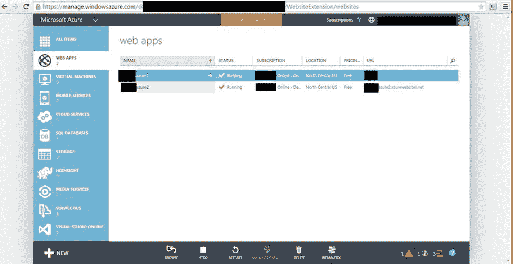

图 2-21

Displaying the created websites on Azure

## 摘要

在本章中，我们讨论了名为 TeamCity 的 CI 工具和名为 Octopus Deploy 的发布管理软件或 CD 工具。TeamCity 使用 MSBuild 构建源代码。最初，我们通过创建一个新项目并提供 SVN 路径将最新的代码提取到构建代理上来配置 TeamCity。然后，我们为 PowerShell 脚本文件配置源代码并设置参数。已修改目标路径设置以创建 NuGet 包。这个包从构建代理复制到 Octopus Deploy 可以获取它的位置。

在 Octopus Deploy 中，我们创建了一个项目和两个环境来测试多个部署场景。然后，我们上传了这个包。我们还创建了两个步骤—NugetDeploy 和 Web Deploy 发布网站(MSDeploy)。前者用于将上传的 NuGet 包部署到触手机器上，而后者用于将 NuGet 包的内容从触手机器部署到 Azure 网站上。

我们还为这两种环境配置了变量和凭证。最后，我们为项目创建了一个版本，它可以部署到不同的环境中。该版本允许我们将 NuGet 包的内容并行部署到 Azure 网站上。最终，我们执行了发布，发现 NuGet 包的内容部署成功。