# 3.通过 VSTS 部署

在上一章中，我们讨论了使用同类最佳的独立 DevOps 工具将应用程序部署到 Azure 的过程:TeamCity 作为 CI 工具，Octopus Deploy 作为 CD 工具。示例解决方案的挑战在于，有单独的工具用于部署应用程序。在这一章中，我们回顾一个 DevOps 平台，一个被称为微软 Visual Studio Team Services (VSTS)的无所不包的端到端解决方案； [`www.visualstudio.com/team-services/`见](http://www.visualstudio.com/team-services/)。

VSTS 是一个协作解决方案，负责整个软件部署生命周期，从创建包到部署应用程序。它的主要优势之一是与 Azure 的紧密集成。本章介绍了使用 VSTS 将应用程序部署到 Azure 的整个过程。

## 了解 VSTS

Visual Studio Team Services (VSTS)是一个应用程序生命周期管理(ALM)系统，它管理软件开发生命周期的整个过程。在早期版本中，它被称为 Visual Studio Online (VSO)。

### VSTS 的特色

VSTS 的一些特点如下:

*   提供集成软件开发。
*   支持源代码控制系统，包括 Git 和 Team Foundation 版本控制(TFVC)。
*   支持多种功能，可用于跟踪产品功能、缺陷和其他问题。
*   支持几种用于计划目的的敏捷方法。
*   自动化构建、测试和发布过程，以快速发布软件。
*   支持在由数千人组成的大规模扩展团队中使用。
*   提供可靠且可扩展的服务，每周 7 天、每天 24 小时可用，并有 99.9%的服务许可协议(SLA)作为后盾。
*   允许用户定制诸如源代码控制、工作跟踪、构建和发布以及测试等元素。，根据业务需求。
*   允许用户向 Visual Studio Marketplace、服务挂钩、REST APIs 和 Visual Studio SDKs 添加更多功能。

### VSTS 的优势

VSTS 是 Microsoft 为升级 Team Foundation Server (TFS)而推出的产品。因此，它也被称为云版的 TFS。VSTS 的一些优势如下:

*   最多五个用户免费。
*   运营和维护成本低于 TFS，因为它是一个基于云的解决方案，而 TFS 是一个内部解决方案。
*   鼓励更多利益相关方参与进来，因为他们可以随时随地登录平台。
*   允许开发人员在任何地方编写和提交代码。
*   支持轻松的团队间交流，因为它支持 Git 源代码控制系统，该系统提供了跨平台的功能。
*   组织开发现代 DevOps 环境的理想平台。

### 在 VSTS 创建账户

使用 VSTS 的主要任务之一是创建一个帐户来托管项目。执行以下步骤在 VSTS 创建帐户:

1.  导航到链接 [`https://www.visualstudio.com/team-services/`](https://www.visualstudio.com/team-services/) 。
2.  Click the Get Started for Free button, as shown in Figure [3-1](#Fig1).

    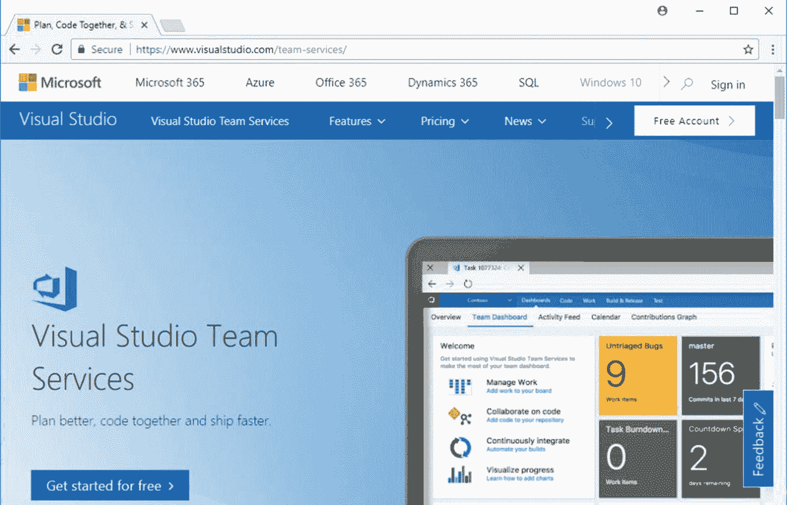

    图 3-1

    Launching Visual Studio Team Services The Sign Into Your Account page appears.  
3.  在电子邮件或电话文本框中输入所需的 Microsoft 电子邮件地址。
4.  Click the Next button, as shown in Figure [3-2](#Fig2).

    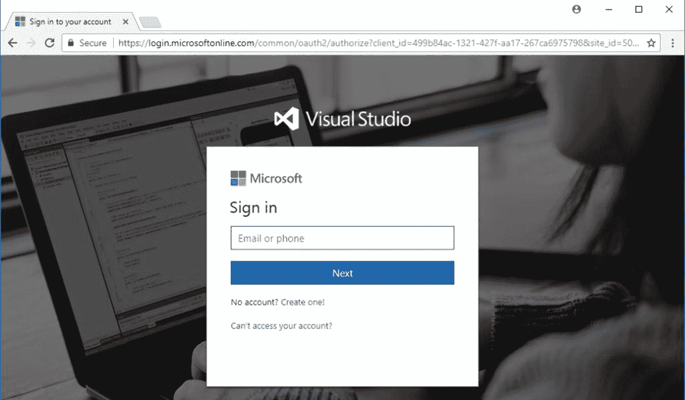

    图 3-2

    Sign in page – user name Note You can use your Microsoft credentials to sign in to Visual Studio Team Services.  
5.  在密码字段中输入所需的密码。
6.  Click the Sign In button, as shown in Figure [3-3](#Fig3) .

    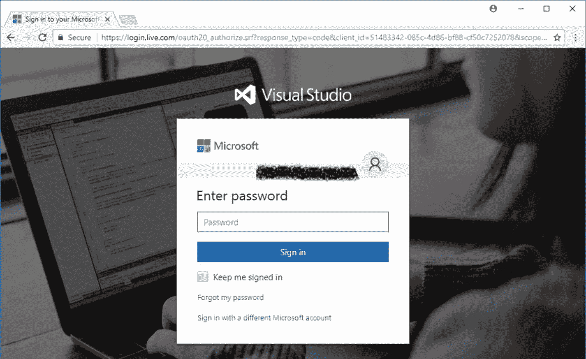

    图 3-3

    Sign in with a Microsoft account password The Account Creation page appears.  
7.  在标签上“主持我的项目”旁边的文本框中输入所需的帐户名称。这使您能够指定主机位置(美国、印度等。)的项目。
8.  使用选项选择管理代码下方所需的单选按钮。这为 Git 管理代码指定了存储库。
9.  Click the Continue button, as shown in Figure [3-4](#Fig4).

    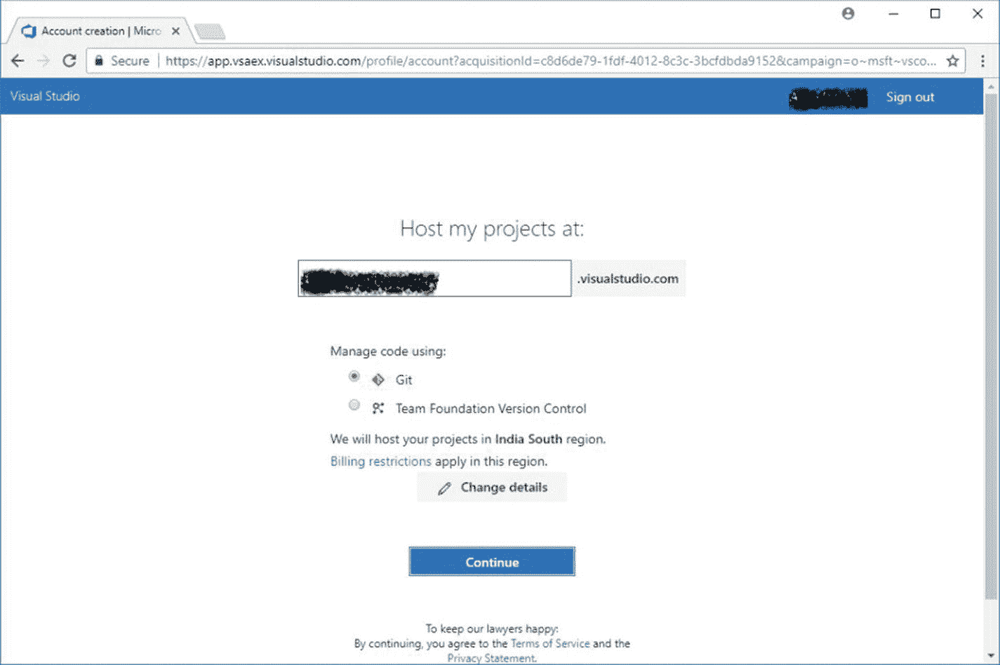

    图 3-4

    Account for hosting project  

点击继续按钮后，创建账户的过程开始，如图 [3-5](#Fig5) 所示。

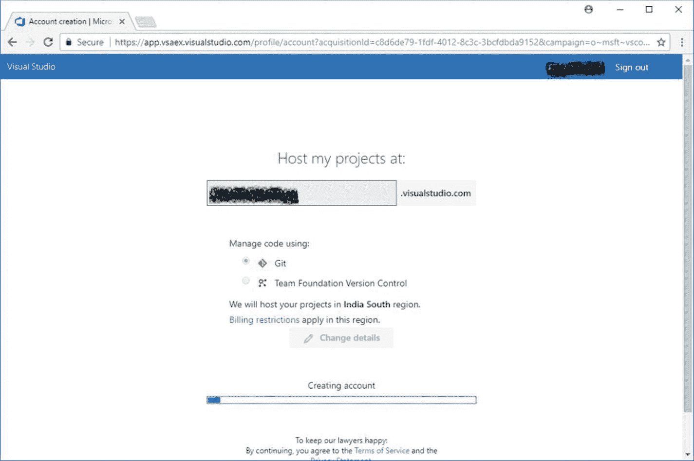

图 3-5

Process of creating an account

该帐户是用指定的名称创建的。

### 创建项目

我们在 VSTS 创建一个帐户后，第一页，创建新项目，要求用户创建一个新项目。执行以下步骤创建项目:

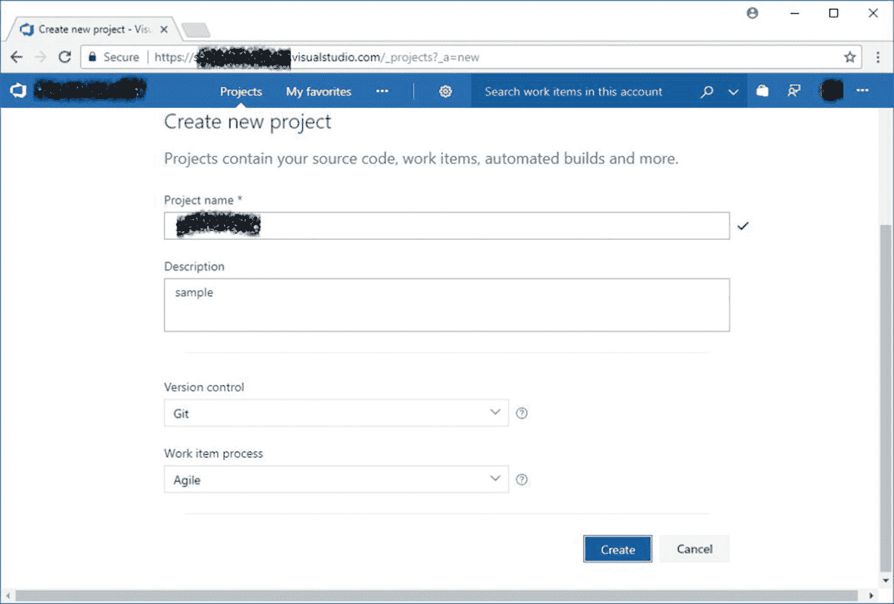

图 3-6

Steps to create a project

1.  在项目名称文本框中输入所需的项目名称。
2.  在描述文本区域中输入所需的项目描述。
3.  从版本控制下拉列表中选择所需的版本控制。在本例中，我们选择了 Git。
4.  从“工作项目流程”下拉列表中选择所需的工作项目流程。在这种情况下，我们选择了 Agile。
5.  点击创建按钮创建项目，如图 [3-6](#Fig6) 所示。

使用特定设置创建项目，并打开项目概述页面，如图 [3-7](#Fig7) 所示。

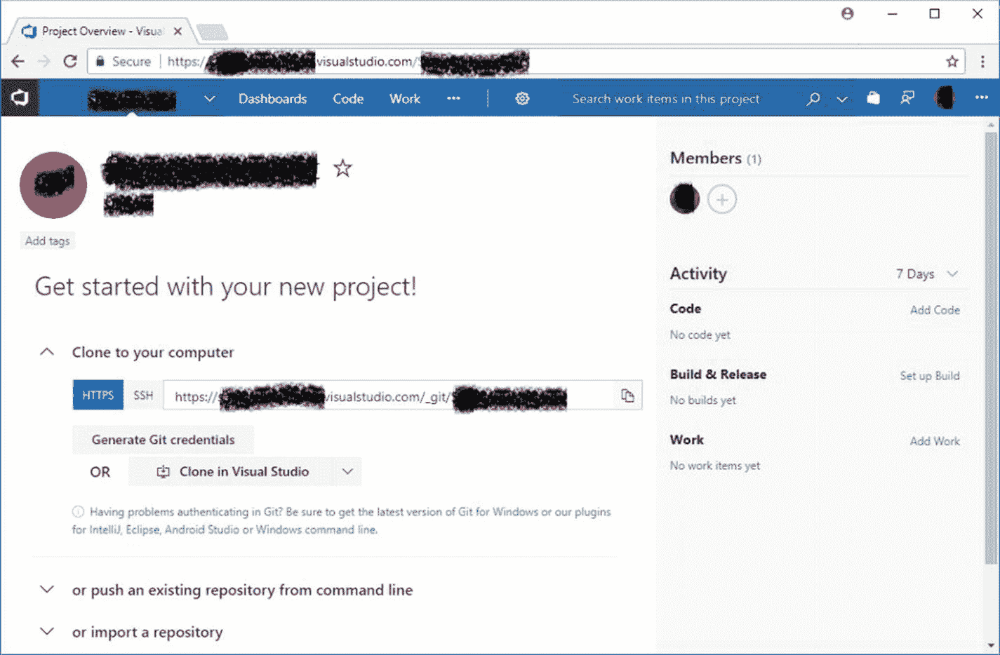

图 3-7

The Project Overview page

### 添加代码

一旦我们完成了创建项目的过程，就会出现项目概述页面，其中显示了有关已创建项目的信息。这里，我们需要向项目添加代码。我们有不同的选项来添加代码，如下所示:

*   克隆到您的计算机
*   从命令行推送现有的存储库
*   导入存储库

执行以下步骤将代码添加到项目中:

1.  选择代码选项卡。
2.  Click the Clone in Visual Studio button, as shown in Figure [3-8](#Fig8).

    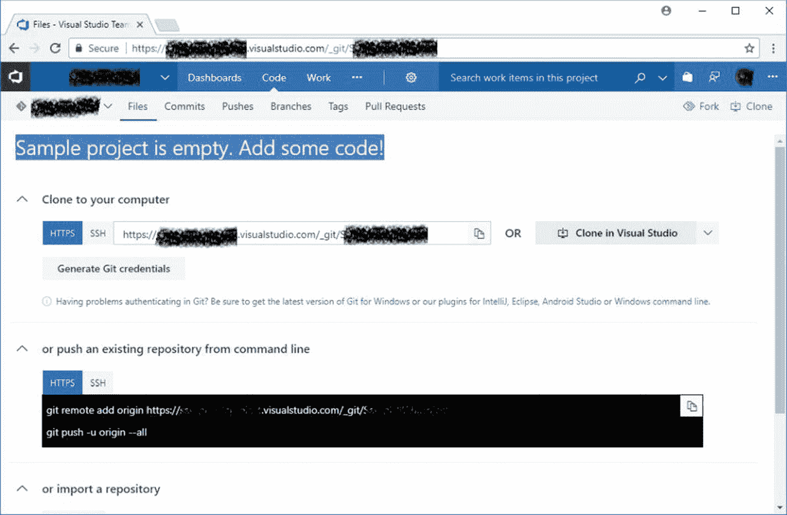

    图 3-8

    Adding code in Visual Studio A message box appears requesting confirmation.  
3.  Click the Open Microsoft Visua…ndler Selector button to open Visual Studio, as shown in Figure [3-9](#Fig9).

    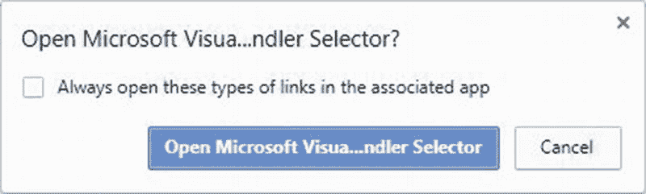

    图 3-9

    Launching Microsoft Visual Studio Selector The Microsoft Visual Studio window opens with the Visual Studio Team Services dialog box. In this dialog box, we see the remote and local paths.  
4.  Click the Connect button to connect Visual Studio with Visual Studio Team Services, as shown in Figure [3-10](#Fig10).

    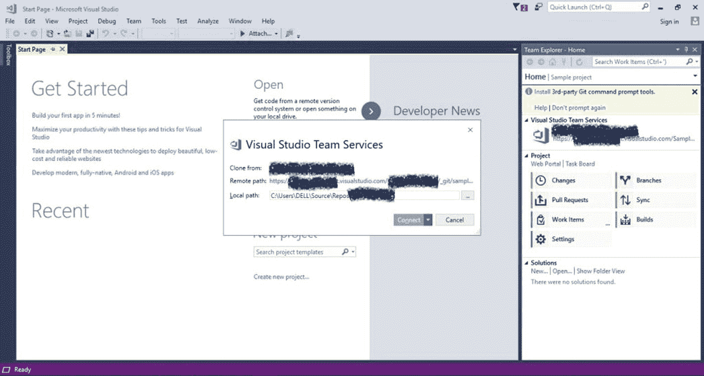

    图 3-10

    Connecting Visual Studio to Visual Studio Team Services  

单击连接后，克隆和连接过程就完成了。

#### 添加新解决方案

这里，我们需要添加一个新的解决方案，这可以通过执行以下步骤来完成:

1.  单击 Team Explorer 面板中 Solutions 部分下的 New 链接。将出现“新建项目”窗口。
2.  从左窗格中选择所需的选项。在本例中，我们选择了 Web。相关模板根据选择显示在中间窗格中。
3.  在中间窗格中选择所需的模板。在这种情况下，我们选择了 ASP.NET Web 应用程序(。NET 框架)。
4.  在名称文本框中输入所选模板的所需名称。在这种情况下，我们进入了 WebApp。
5.  在位置文本框中为模板指定所需的位置。
6.  选中“为解决方案创建目录”复选框。
7.  选中“创建新的 Git 存储库”复选框。
8.  Click the OK button, as shown in Figure [3-11](#Fig11).

    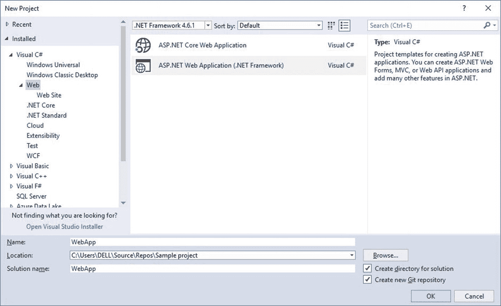

    图 3-11

    Creating a new project The New ASP.NET Web Application – WebApp window appears.  
9.  选择 MVC 选项来创建 MVC 应用程序。
10.  Click the OK button, as shown in Figure [3-12](#Fig12).

    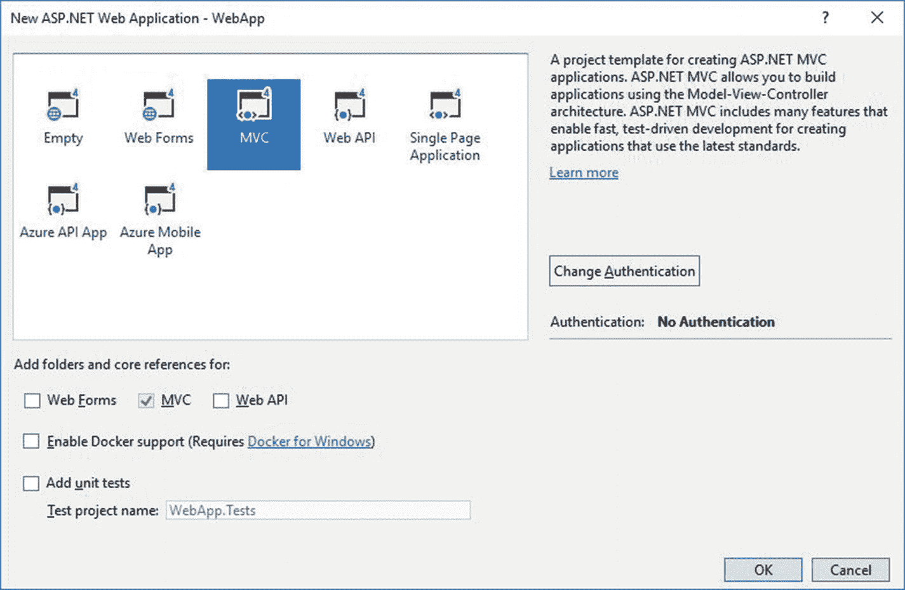

    图 3-12

    The New ASP.NET Web Application – WebApp window  

出现 Microsoft Visual Studio 进度栏，显示项目的状态。完成后，项目被创建并添加到解决方案部分。

#### 提交更改

一旦进行了所需的更改，我们就可以提交它们。执行以下步骤提交更改:

1.  Click the Changes button under the Project section in the Team Explorer panel, as shown in Figure [3-13](#Fig13).

    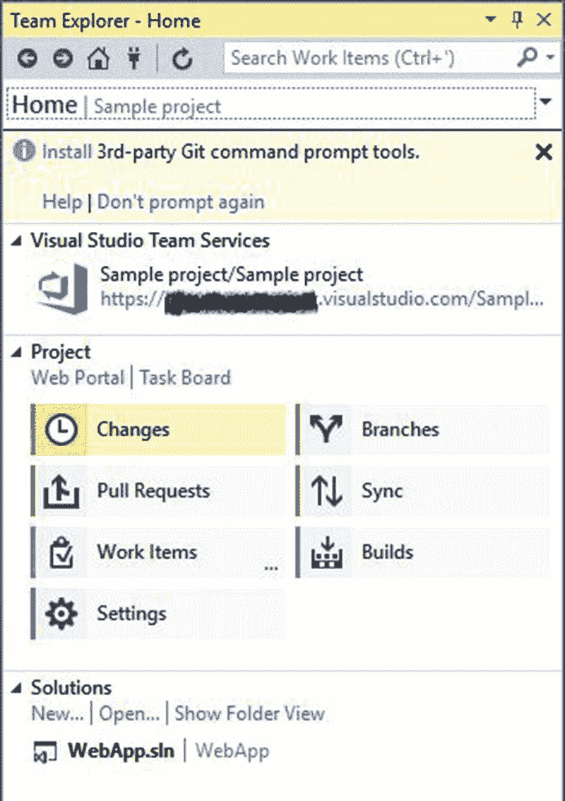

    图 3-13

    Steps to commit changes The changes made to the project are displayed in the Changes section.  
2.  在输入提交消息文本框中输入所需的提交消息。
3.  Click the Commit All button, as shown in Figure [3-14](#Fig14).

    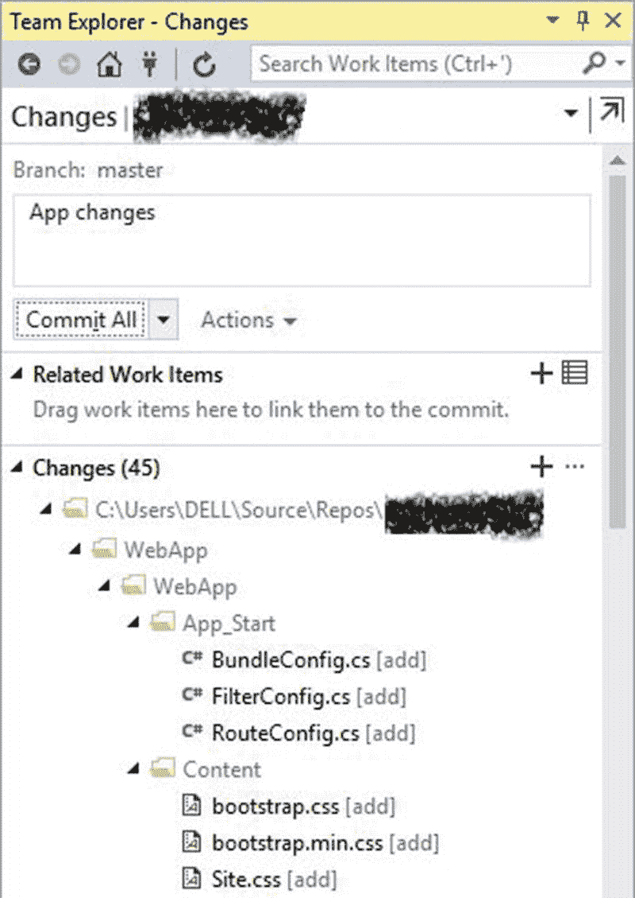

    图 3-14

    Steps to commit changes A commit is created locally.  
4.  Click the Sync link to share the changes with the server, as shown in Figure [3-15](#Fig15).

    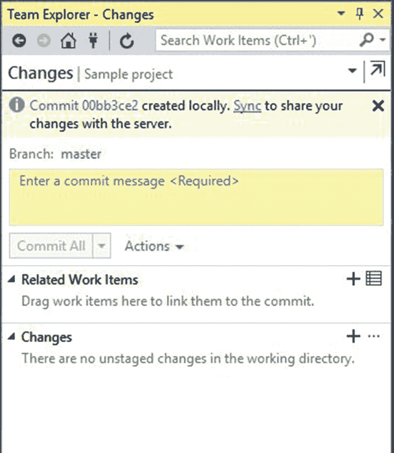

    图 3-15

    Sharing the changes with the server The Synchronization page appears in the Team Explorer panel.  
5.  Click the Push link under the Outgoing Commits section, as shown in Figure [3-16](#Fig16).

    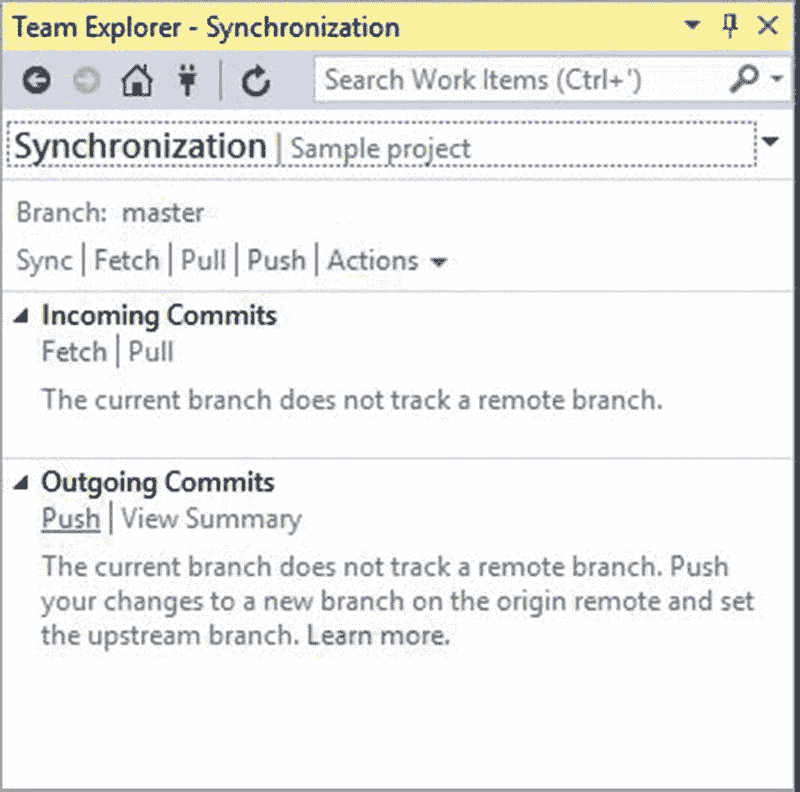

    图 3-16

    The Push link enables synchronization  

同步成功，如图 [3-17](#Fig17) 所示。

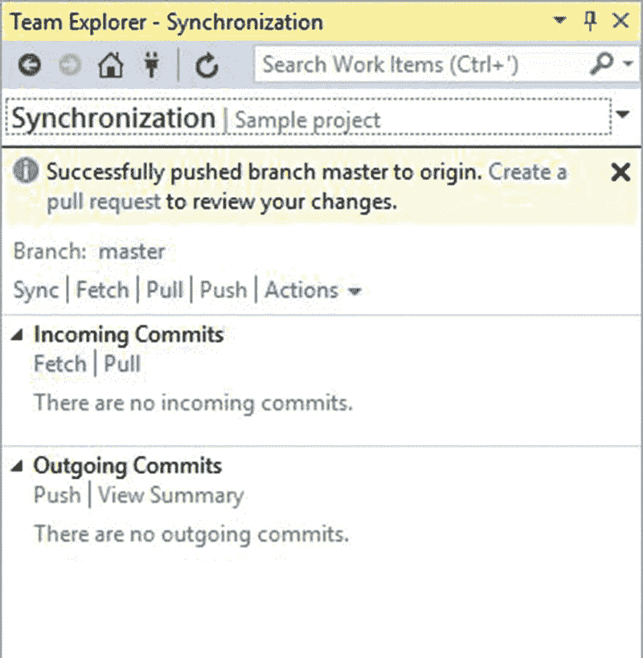

图 3-17

Successful synchronization

此时，代码被添加到服务器中。

接下来，验证 VSTS 的存储库。为此，导航到前面创建的项目的代码部分。出现一个与 Visual Studio 中创建的项目同名的文件夹，如图 [3-18](#Fig18) 所示。

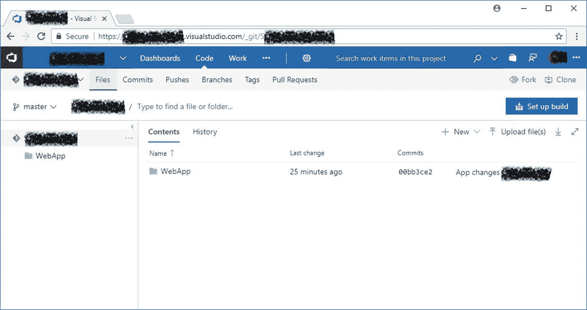

图 3-18

The repository

### 创建一个版本

一旦源代码控制库可用，我们就可以设置(或创建)一个构建。执行以下步骤创建一个版本:

1.  将鼠标悬停在“构建和发布”选项卡上。将出现选项列表。
2.  Click the Builds option, as shown in Figure [3-19](#Fig19).

    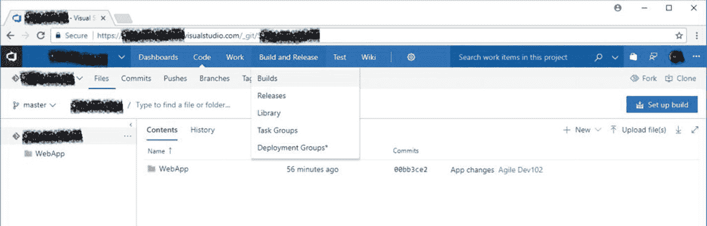

    图 3-19

    The Builds option The My Definitions page appears.  
3.  Click the New button to create a new build definition, as shown in Figure [3-20](#Fig20).

    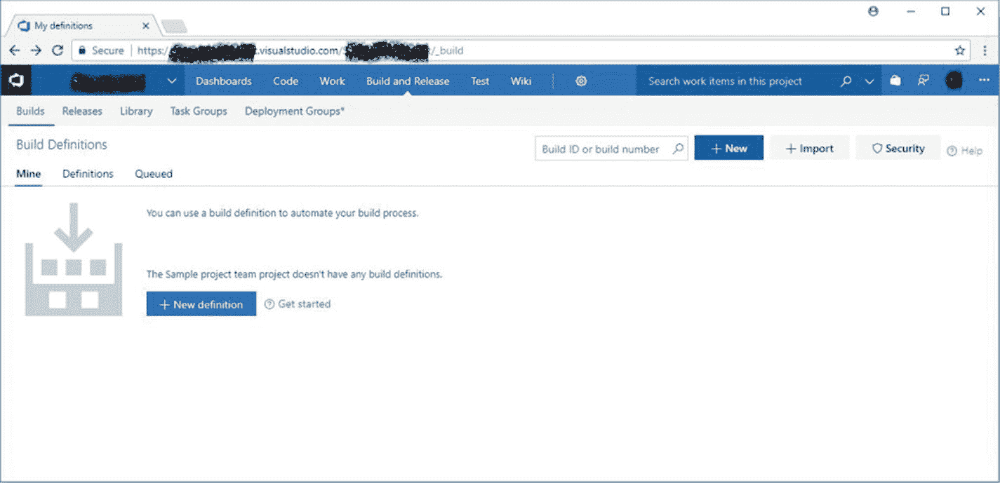

    图 3-20

    Creating a new build definition The Select Build Definition Template page appears.  
4.  从选择模板列表中选择所需的模板。
5.  Click the Apply button, as shown in Figure [3-21](#Fig21).

    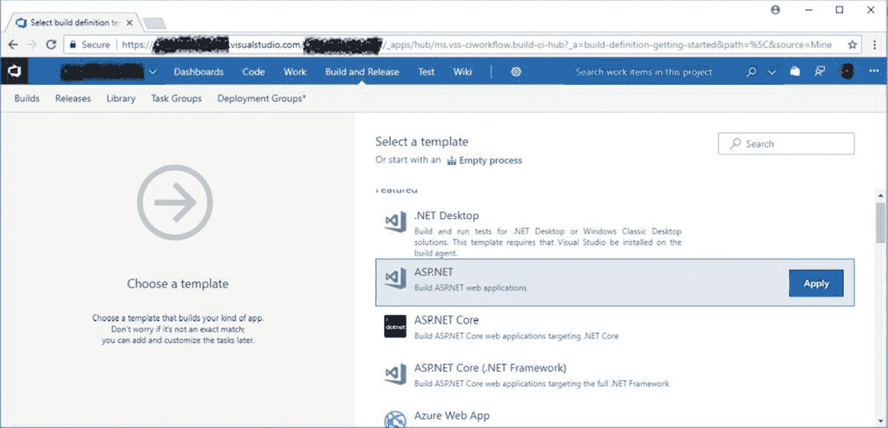

    图 3-21

    Selecting a template The Sample Project-ASP.NET page appears.  
6.  在名称文本框中输入所需的模板名称。
7.  从 Azure 队列下拉列表中选择所需选项。
8.  在“参数”部分指定所需的参数。
9.  单击保存并排队按钮。出现一个下拉列表。
10.  Select the Save option from the drop-down list, as shown in Figure [3-22](#Fig22).

    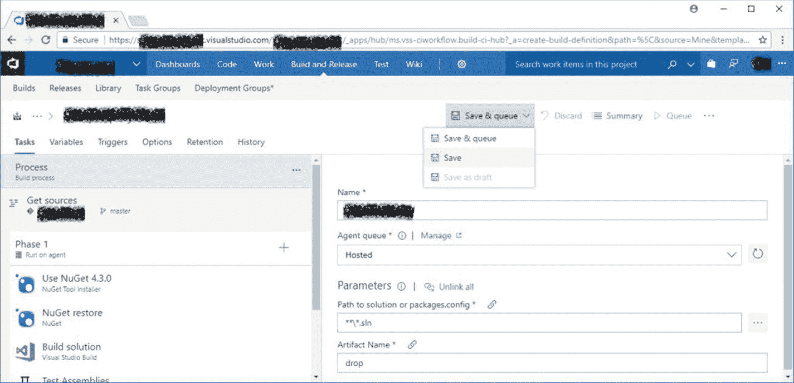

    图 3-22

    Tasks tab of the Sample Project-ASP.NET page The Save Build Definition dialog box appears.  
11.  选择要保存构建定义的文件夹。在本例中，我们选择了父文件夹。
12.  在注释文本区域输入所需的注释。
13.  Click the Save button to save the build definition, as shown in Figure [3-23](#Fig23).

    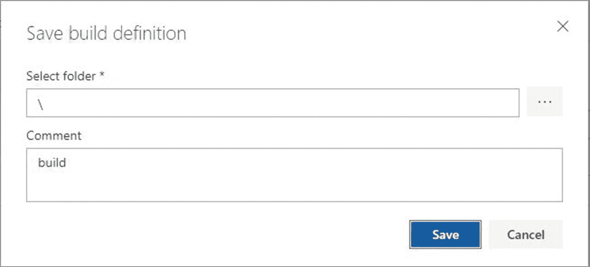

    图 3-23

    The Save Build Definition dialog box  
14.  Select the Variables tab to view the associated variables, as shown in Figure [3-24](#Fig24).

    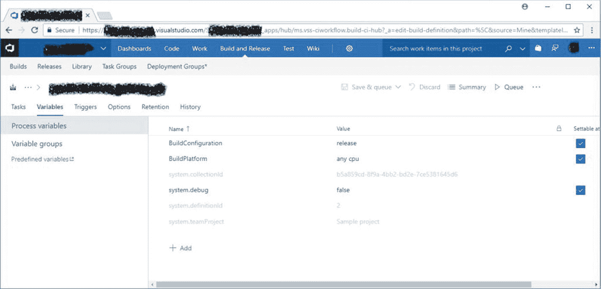

    图 3-24

    The Variables tab  
15.  选择触发器选项卡以设置触发器。相关选项出现在右窗格中。
16.  选择启用持续集成复选框以启用持续集成。
17.  选择“在构建过程中进行批更改”复选框，以在构建过程中接受批更改。
18.  Specify branch filters under the Branch Filters section, as shown in Figure [3-25](#Fig25).

    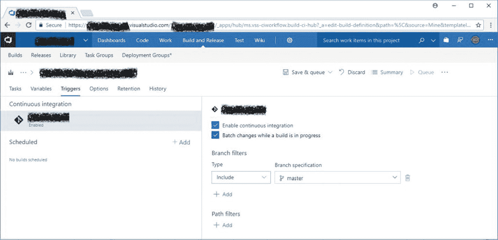

    图 3-25

    Setting triggers  
19.  选择选项选项卡。出现相关设置。
20.  在“生成属性”部分下指定所需的常规生成定义设置。
21.  在“生成作业”部分指定所需的生成作业授权和超时设置。
22.  单击保存并排队按钮。出现一个下拉列表。
23.  Select the Save & Queue option to save and queue the settings, as shown in Figure [3-26](#Fig26).

    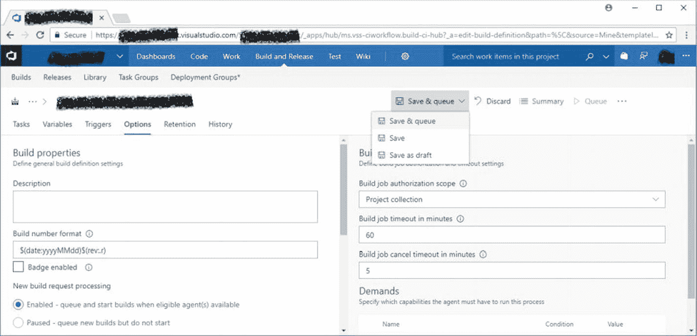

    图 3-26

    Save and queue the build The Save Build Definition and Queue dialog box appear.  
24.  View the settings and make the changes as per the requirements, as shown in Figure [3-27](#Fig27).

    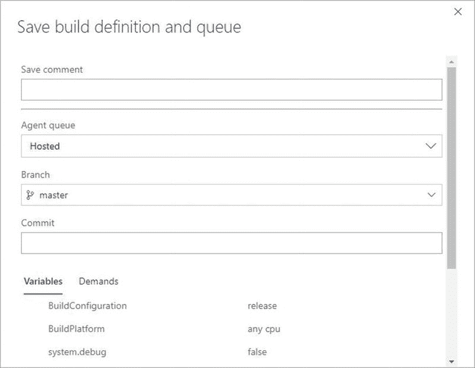

    图 3-27

    The Save Build Definition and Queue dialog box  
25.  单击“保存”按钮创建一个构建。内部版本号为的内部版本正在排队。
26.  Click the build number, as shown in Figure [3-28](#Fig28).

    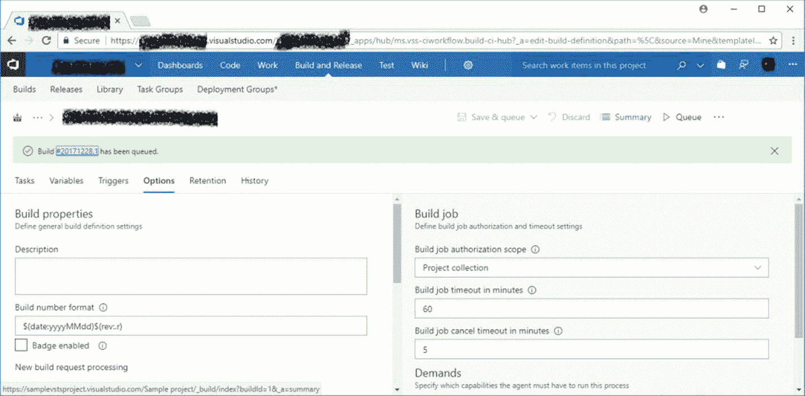

    图 3-28

    Clicking the build number  

一个成功的构建被创建，如图 [3-29](#Fig29) 所示。

图 3-29

Creation of a successful build

点击版本号查看版本摘要，如图 [3-30](#Fig30) 所示。

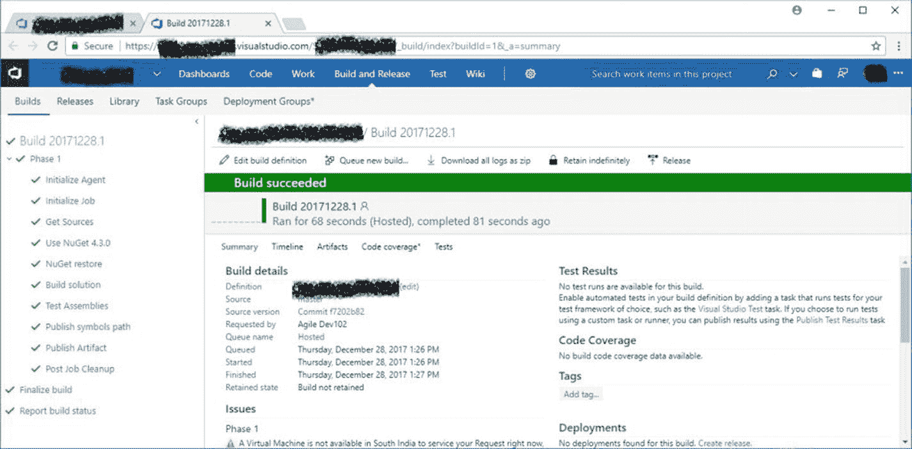

图 3-30

Build summary

### 创建发布定义

发布定义描述了一个应用程序的端到端发布过程，这样它就可以被部署到不同的环境中。执行以下步骤来创建发布定义:

1.  选择“发行”标签。
2.  单击“新建定义”按钮。出现“选择模板”对话框。
3.  从“选择模板”对话框中选择发布所需的模板。
4.  Click the Apply button, as shown in Figure [3-31](#Fig31).

    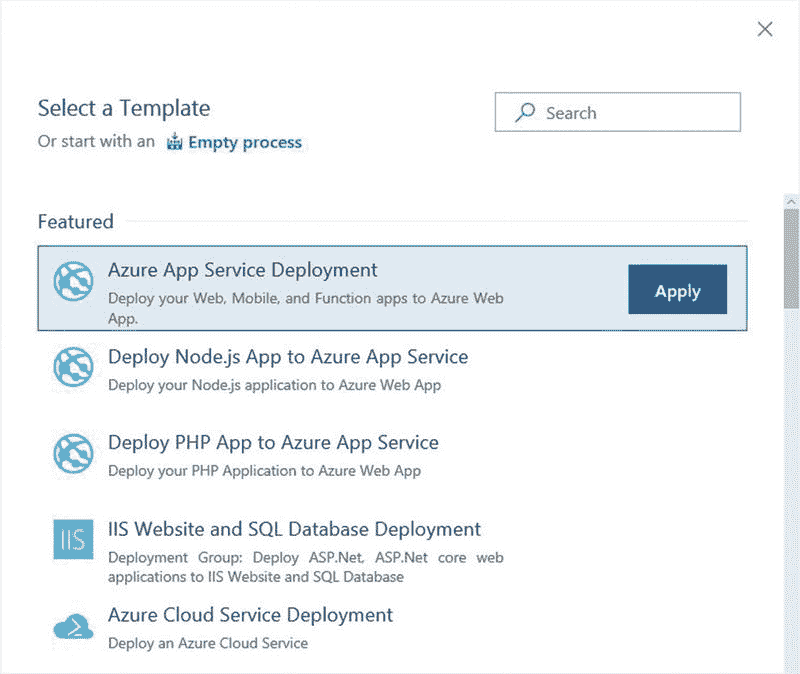

    图 3-31

    Selecting a template The Environment dialog box appears.  
5.  在环境名称文本框中输入所需的环境名称。
6.  单击环境对话框中的关闭图标将其关闭。
7.  选择任务选项卡。出现一个下拉列表。
8.  选择之前创建的环境。
9.  从 Azure 订阅下拉列表中选择 Azure 订阅。注意，我们需要在 Azure 上有一个资源组来部署我们的应用程序。
10.  从应用程序类型下拉列表中选择应用程序的类型。
11.  从应用服务名称下拉列表中选择应用服务名称。
12.  Click the Save button to save all the settings, as shown in Figure [3-32](#Fig32).

    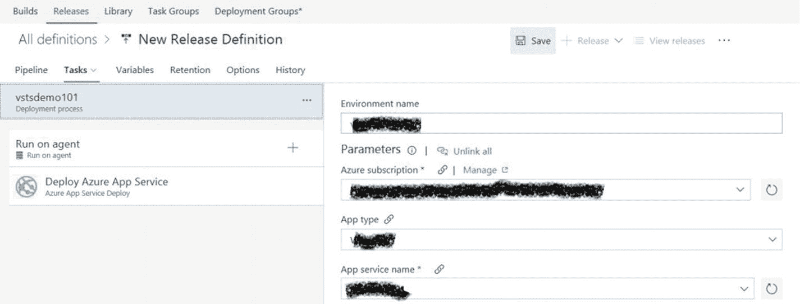

    图 3-32

    Setting the task’s properties The Save dialog box appears.  
13.  从文件夹下拉列表中选择所需的文件夹。
14.  在注释文本框中指定所需的注释。
15.  Click the OK button, as shown in Figure [3-33](#Fig33).

    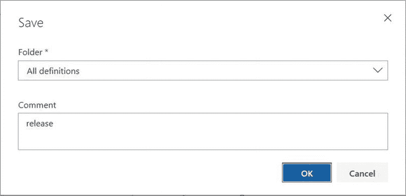

    图 3-33

    The Save dialog box  

发布定义已创建。

### 添加工件

工件是应用程序的实际可部署组件。在 VSTS，可以部署由工件源产生的工件(或者存储在工件库中的工件)。在创建发布定义的时候，我们需要将正确的工件源链接到发布定义。执行以下步骤来添加工件:

1.  单击工件部分中的添加按钮。将出现“添加工件”对话框。
2.  在源类型部分选择源类型。
3.  从项目下拉列表中选择所需的项目类型。
4.  从“源”(生成定义)下拉列表中选择先前创建的生成定义。
5.  从默认版本下拉列表中选择默认版本。
6.  单击关闭图标关闭对话框。

创建的工件被添加。

### 创建版本

一个发布管理在发布定义期间定义的所有工件。它是一个完整的包，包含用于执行发布定义中所有操作的环境、任务步骤、变量和发布策略的快照。执行以下步骤来创建版本:

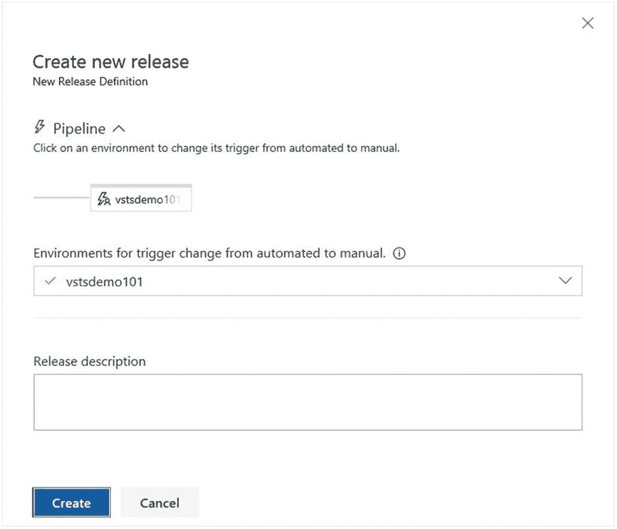

图 3-34

The Create New Release dialog box

1.  单击“释放”按钮。出现一个下拉列表。
2.  单击创建发布选项。将显示“创建新版本”对话框。
3.  从触发从自动到手动更改的环境下拉列表中选择环境。
4.  在描述文本框中输入所需的版本描述。
5.  点击创建按钮，如图 [3-34](#Fig34) 所示。

创建一个发布。

### 部署版本

一旦发布成功创建，我们就可以将它部署到在 Azure 上创建的资源组。执行以下步骤来部署该版本:

1.  选择“发放”标签。将显示创建的版本。
2.  点击省略号图标。出现一个上下文菜单。
3.  从上下文菜单中选择“打开”选项。将显示所选版本的摘要页面。
4.  单击部署按钮。出现一个下拉列表。
5.  从下拉列表中选择所需选项。将出现“将发布部署到环境”对话框。
6.  单击“部署”按钮来部署发行版。

发布部署成功，如图 [3-35](#Fig35) 所示。

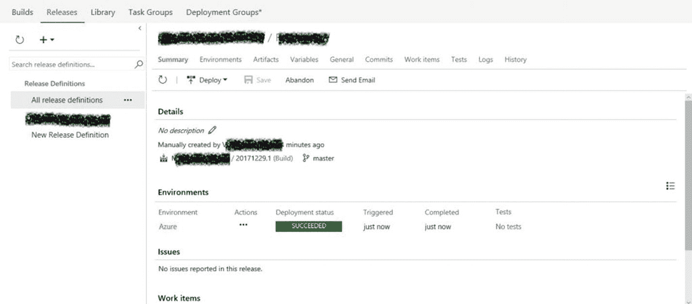

图 3-35

Deploying a release

### 查看已部署的版本

一旦该版本部署到 Azure，我们就可以在 web 浏览器中查看它。执行以下步骤来查看版本:

1.  打开 Azure 门户。
2.  单击左窗格中的资源组选项。资源组列表出现在右窗格中。
3.  单击我们链接到环境的资源组。选定的资源组将打开，并显示所描述的设置。
4.  单击我们在资源组中创建的项目。在这种情况下，我们创建了一个应用服务。所选的应用服务将打开。
5.  单击浏览按钮在 web 浏览器中查看服务。

web 浏览器窗口打开，显示部署结果，如图 [3-36](#Fig36) 所示。

图 3-36

Window showing the deployed release

## 摘要

VSTS 是一个全面的 CI-CD 解决方案，这意味着它管理整个软件开发生命周期。它支持不同的源代码控制系统、工作项和敏捷方法，这使它成为组织的完美选择。自动化构建、测试和发布过程的功能加速了软件发布过程。VSTS 是一个基于云的环境，这使得它每周 7 天、每天 24 小时可用，而没有管理 DevOps 软件部署的开销。