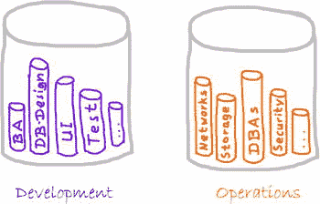
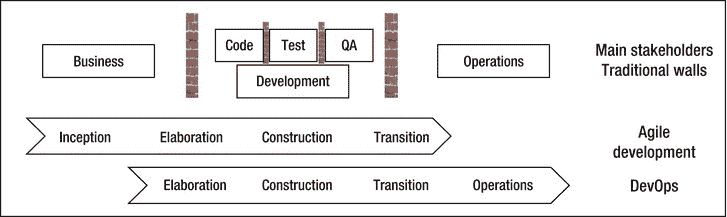
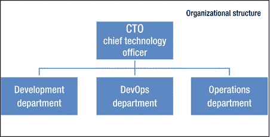
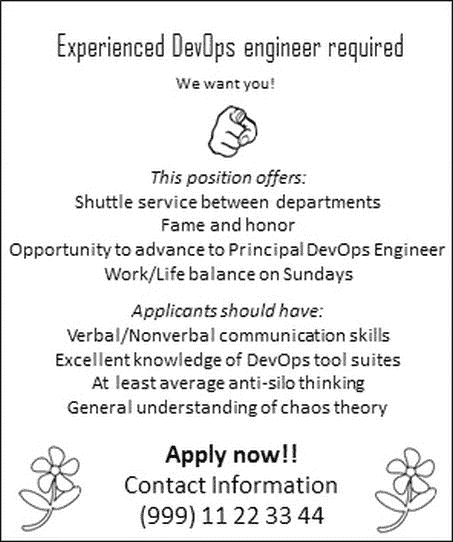
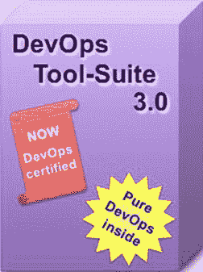

# 一、面向开发人员的 DevOps

混淆了开发还是运维？简单的规则:如果你因为网站的成功而受到表扬，你就是开发者；如果你在网站瘫痪时受到责备，那你就是 Ops。

——奉献波拉特

欢迎来到*面向开发者的 DevOps】。这本书讨论了优化软件开发和运维之间协作的方法、过程和工具，以及将敏捷方法引入流线型软件交付过程的所有部分。*

本章提供了所有必要的信息，以帮助您理解什么是 DevOps，以及如何基于这种理解在这一领域继续工作。本章将解释开发和运维之间存在的自然冲突，以及 DevOps 可以帮助解决这些冲突的地方。它将解释影响 DevOps 的历史和运动，以及构成 DevOps 的观点和活动。除了探索 DevOps 背后的核心概念，我们还将探索什么是 devo PS*而不是*。

然而现在，我们将首先给出 DevOps 的定义。

DevOps 的定义

DevOps 的一些孤立的方面多年来已经广为人知，而其他方面则是新的。然而，不存在包含 DevOps 所有方面的统一术语。术语 *DevOps* 如今被广泛使用，许多不同类型的内容都与之相关联。

当你阅读这些章节时，请记住 DevOps 有许多不同的定义，本书给出了一个特定的定义，它从开发者的角度来看待 DevOps。这本书将展示 DevOps 实际上是众所周知的、先进的实践和新的、创新的方法的结合，以应对项目生命周期软件交付和操作中的常见挑战。

 **注**这本书主要面向开发者。请注意，术语*开发人员*不仅仅指测试人员、程序员和质量保证专家。相反，“一个团队方法”(我将在本书中介绍)还包括来自运维部门的专家，他们开发例如脚本或“作为代码的基础设施”

术语 DevOps 是开发(代表软件开发人员，包括程序员、测试人员和质量保证人员)和操作(代表将软件投入生产并管理生产基础设施的专家，包括系统管理员、数据库管理员和网络技术人员)的混合。DevOps 描述了简化软件交付过程的实践，强调通过从生产到开发的反馈流和改进周期时间(即，从开始到交付的时间；关于此过程的更多信息，请参见第三章。DevOps 不仅能让你更快地交付软件，还能帮助你生产出更高质量的软件，更符合个人需求和基本条件。

DevOps 包含许多活动和方面，例如以下 [2](#Fn2) :

*   *文化*:流程和工具之上的人。软件是由人制造的，也是为人服务的。
*   自动化:自动化对于开发人员获得快速反馈至关重要。
*   *测量* : DevOps 找到测量的具体路径。质量和共享(或至少是一致的)激励至关重要。
*   共享:创造一种人们共享想法、流程和工具的文化。

DEVOPS 这个术语是什么意思？

DevOps 这个术语是开发和运维的混合体。

DevOps 这个术语不是一夜之间出现的。相反，许多运动和人物影响了 DevOps 的发展，我们将在接下来探讨。

影响和起源

Patrick Debois 在 2009 年组织比利时 DevOpsDays 会议时创造了 DevOps 一词。这是一系列相关会议中的第一次，这些会议致力于帮助传播这一术语的概念。许多过去的运动、早期采用者和影响帮助创造了 DevOps，并将 DevOps 转变为一个公认的术语:

*   Patrick Debois 主持了一场名为“敏捷运维和基础设施:你有多敏捷？” [4](#Fn4) 在 2008 年的敏捷大会上发表了一篇同名论文。 [5](#Fn5)
*   Marcel Wegermann 发表了一份名为“敏捷系统管理”的电子邮件列表 [6](#Fn6)
*   在圣荷西举行的 Velocity 2009 大会上，John Allspaw 发表了一篇名为“每天部署 10 次以上:开发和运维合作” [7](#Fn7) 的演讲。
*   史蒂文·布兰克出版了一本名为*顿悟的四个步骤*的书。[88T7】](#Fn8)
*   *Eric Ries* 发表*精益创业*[T5】9](#Fn9)等人都写过关于“精益创业”的场景。
*   *451 集团*于 2010 年 9 月发布了第一份关于 DevOps 的分析师报告(题为《DevOps 的崛起》 [10](#Fn10) )。

给工具或方法贴上与“DevOps”一致的标签，而不考虑具体内容或不试图定义 DevOps，往往会导致随意的流行词。因此，有人可能会问，DevOps 运动的动机是什么？为了更好地理解这个动机，我们现在将检查开发和操作之间的潜在冲突。

冲突中的发展和行动

传统的组织按照工作类型划分他们的团队(这经常导致所谓的筒仓)。某些开发部门专门编写代码。许多公司也有专门的软件测试部门。因为将软件投入生产并在那里维护它通常需要软件开发以外的技能，所以创建了运维部门。划分工作区域似乎也有利于管理层。除了专业团队之外，每个部门都有自己的经理，负责满足特定部门的个人需求。

每个部门根据分工确定自己的目标。开发部门可以通过其创建新功能的速度来衡量，而运维部门可以通过服务器正常运行时间和应用程序响应时间来判断。不幸的是，如果度量是稳定的和不变的，那么运维被认为是成功的，而只有当许多事情发生变化时，开发才会受到称赞。因为冲突已经融入到这个系统中，密集的合作是不可能的。

开发团队致力于变革，而运维团队致力于稳定(变革和稳定的定义将在第 2 章中讨论)。开发和操作之间的冲突是由相互冲突的动机、过程和工具的组合引起的。结果，孤立的筒仓逐渐形成(见[图 1-1](#Fig2) )。

[图 1-1](#_Fig2) 。*开发和运维是两个截然不同的部门。通常，这些部门像筒仓一样运作，因为它们彼此独立 [11](#Fn11)*

简而言之，开发和运维之间的冲突如下:

*   *对变更的需求*:开发产生变更(例如，新特性、错误修复和基于变更请求的工作)。他们希望将他们的更改推广到生产中。
*   *害怕变更*:软件交付后，运维部门希望避免对软件进行变更，以确保生产系统的稳定状态。

然而，软件工程和过程改进有很长的历史。“敏捷”方法呢？敏捷方法解决了那些痛点了吗？

开发和运维团队都将自我优化。开发和运维团队不是优化整个流程，而是改进他们各自的流程以满足各自的目标。开发人员主要关注加速新特性的创建，例如，采用敏捷方法。敏捷运动将程序员、测试人员和业务代表聚集在一起。相反，运维团队是通过应用诸如信息技术基础设施库(ITIL)、 [12](#Fn12) 等将变更等同于风险的实践来维护稳定性和提高绩效的独立团体。

单个部门越专业化，公司及其项目的结果就越糟糕。开发部门不断创造新的特性、变化或错误修复，并把它们扔给运维部门。反过来，作战部完善其许多防御机制，以防止变化。

这两个群体之间的冲突只能通过调整这两个群体的不同目标来弥合。要做到这一点，敏捷方法也必须应用到运维中。我们将在下一节探讨这个概念。

拓宽敏捷的使用范围

项目通常经历以下几个阶段:

*   *Inception* :在此期间，系统的远景被开发，项目范围被定义，商业案例被证明是合理的。
*   *精化*:在此期间，需求被收集和定义，风险因素被识别，系统架构被初始化。
*   *构建*:在此期间，软件被构建、编程和测试。
*   *过渡*:在此区间内，软件交付给用户。
*   *运维*:在此期间，软件对用户可用，由运维团队维护。

 **注意**这些间隔适用于所有类型的过程模型，包括传统的、分阶段的和现代的，基于增量(小的功能单元)或迭代(可能导致增量的小项目)。

敏捷软件开发有助于将不同的项目角色集合在一起，包括程序员、测试人员和质量保证(QA)人员。这些不同的专家组成了跨职能开发团队。这种“一个团队的方法”让他们比敏捷运动进入市场之前更加紧密地团结在一起。敏捷软件开发现在是主流。敏捷方法的原则集中在定义、构建和构造软件上(见[图 1-2](#Fig3) )。

[图 1-2](#_Fig3) 。*敏捷软件开发跨越了从初始到产品化的过程。DevOps 跨越了从细化到运维的流程，通常包括人力资源和财务等部门*

 **注意**将 DevOps 扩展到财务和人力资源(HR)等部门是有意义的，因为 DevOps 对这些部门有影响力。例如，新同事(被人力资源部门聘用)需要具备软技能(如沟通技能)来按照 DevOps 方法工作。另一个例子是财务部门或审计员，他们必须转换和收集其度量标准和度量方法以适应 DevOps。

敏捷工作通常在从开发到运维的产品化阶段结束。DevOps 涵盖了软件交付(即，将软件交付到生产环境并提供给最终用户的精益实践)。DevOps 提供模式来促进项目涉众之间的协作，并使用过程和工具来简化软件交付过程并减少总的周期时间。

接下来，我们考察 DevOps 的可能观点。

DevOps 的观点

成功的 DevOps 的基础是信任的文化和友谊的感觉。一切都始于人们如何看待彼此。也就是说，公司有“我们对他们”的文化还是“我们”的文化？因此，DevOps 以“共享”的概念为中心:共享想法、问题、过程、工具和目标。

DEVOPS 是什么？

DevOps 是一种混合模式，旨在改善开发和运维之间的协作。DevOps 处理共享的目标和激励，以及共享的流程和工具。由于不同群体之间的自然冲突，共同的目标和激励可能并不总是可以实现的。然而，它们至少应该彼此对齐。

DevOps 尊重这样一个事实，即公司和项目有特定的文化，人比过程更重要，而过程又比工具更重要。DevOps 接受开发和运维之间不可避免的冲突。

DevOps 运动旨在改善开发人员和运维团队之间的沟通，以解决关键问题，如对变更和风险部署的担忧。理想情况下，DevOps 原则需要工具的支持才能完全实现，并提供所需的自动化。工作流中每个部分的工具都在他们自己的筒仓中发展，并得到他们自己的目标团队的支持。DevOps 心态要求从开发开始到生产部署和维护结束的无缝、高度集成的流程。为了以整体的方式帮助自动化和集成所有必要的交付步骤，DevOps 方法还需要轻量级的工具变更。开发和操作之间的协作早在软件部署之前就开始了，并在此后很长一段时间内持续进行。

有了 DevOps，交付过程的所有利益相关者紧密合作，并分享相同的目标。在软件交付过程中不存在孤立的筒仓。相反，利益相关者密切合作。DevOps 可以从以下重叠的角度进行检查:

*   *度量和测量视图*:这个方面处理质量和测试，强调共享激励。
*   *流程视图*:该方面包括一致性和流程，以获得快速反馈并建立整体流程。
*   *技术观点*:这个方面讨论了通过自动化的快速反馈，特别是自动发布，通过例子的规范，以及作为代码的基础设施。

如果你认为这个列表涵盖了需要更详细讨论的广泛领域，你绝对是正确的。这本书的章节与这些观点一致，我们将详细探讨每一个观点。

在讨论了 DevOps 的定义之后，我们现在将解释 DevOps 不是什么。

DevOps 不是什么

DevOps 这个词有点过了。为了理解 DevOps 概念的范围，讨论什么是 DevOps 是有帮助的。DevOps 不是一个营销(buzz)术语。尽管 DevOps 的某些方面并不新颖，但它是一个旨在改进交付流程的新的强大运动。DevOps 方法接受软件交付中的日常挑战，并提供解决它们的步骤。DevOps 不允许开发人员在生产系统上工作。它不是一个向开发者开放生产相关方面的免费“过程”。例如，DevOps 没有授予开发人员在生产系统上工作的权限。相反，DevOps 是关于纪律、惯例和对所有人都透明的已定义的过程。

角色和结构

DevOps 不是新部门(见[图 1-3](#Fig4) )。每次试图建立一个 DevOps 类型的部门都会导致奇怪的结构。有些人认为“NoOps”是未来，在那里开发者负责软件生产的所有相关方面。当然，这样的场景是不可能的；开发人员和运维工程师有不同的优先级和技能。同样，反过来也不对:DevOps 并不意味着运维的专家接管所有的开发任务。

[图 1-3](#_Fig4) 。 *DevOps 不是一个新部门。如果您看到显示 DevOps 项目的组织结构，请让决策者看这本书*

“随着时间的推移，职责可以也确实会发生变化，随着职责的变化，工作描述也会发生变化。但无论你如何分割，同样的工作需要完成，其中一项工作是运维，另一项是开发。因此，DevOps 也不是取代当前开发人员和运维专家的新角色。DevOps 描述了协作、过程和工具的模式；这不是一个新的职称(见[图 1-4](#Fig5) )。一旦你理解了 DevOps 的概念，你就会明白雇佣一个“devo PS”的想法是多么奇怪。

[图 1-4](#_Fig5) 。 *DevOps 并不是一份新工作。如果你看到招聘 DevOps 专家的招聘广告，请将广告作者指向这本书*

有些人可能会做出如下声明:“DevOps 是一个食谱目录:实现它们，你就完成了。”这种说法是错误的，因为通过实施 DevOps，您将专注于找到适合您个人情况的最佳解决方案。没有放之四海而皆准的解决方案，也没有“照章办事”的方法可以解决您的所有问题。

其他人会声称“随着云解决方案越来越受欢迎，DevOps 将失去重要性；平台即服务(PaaS)解决方案将使 DevOps 变得没有必要。”这个异议很有趣，但事实是云解决方案引入了另一个抽象层次，并没有取代操作。云不需要做 DevOps。

将现有结构和角色与 DevOps 保持一致是一个过程。有很多书关注的是达成跨团队工作协议的策略 [15](#Fn15) 或者如何引入新的想法和改变。 [16](#Fn16)

DevOps 和工具套件

有些人更喜欢考虑工具，而不是人和过程。没有尊重他人和理解过程，这些人只是引入工具。如果在项目中使用工具有问题，会发生什么？有些人可能会建议你“只是引入新的工具。”对于 DevOps，同样的问题出现了。如果不理解这种方法背后的思想，不尝试改进协作，不以具体的方式共享过程，任何采用 DevOps 方法的尝试都会失败。将单个工具贴上 DevOps 工具的标签是可以接受的，但是请不要把 DevOps 看成是一个淘汰运维人员的新工具，或者是一个工具套件(见[图 1-5](#Fig6))；相反，这是一种让现有员工腾出时间专注于更困难的问题，从而带来更多商业价值的方法。

[图 1-5](#_Fig6) 。 *DevOps 不是一个工具套件。如果您看到一个标有“DevOps”套件的工具套件，请供应商阅读本书 [17](#Fn17)*

DevOps 可以将子过程集合在一起，形成一个全面的交付过程，使软件能够以高速度和高质量交付。但是，DevOps 不一定会引入新的工具。特定的新工具可以用来实现给定的过程。然而，在大多数涉及 DevOps 的情况下，预先存在的工具被编排和集成以供开发和运维团队使用。例如，版本控制系统不仅可以用来存储代码和构建脚本和测试，还可以用来创建基础结构行为。筒仓解决方案的时代已经过去了，在筒仓解决方案中，工具仅用于特定的项目角色！

 **注意**工具供应商可能会将其工具标记为 DevOps 工具。对这样的标签不能全信。工具可以在开发和运维团队之间共享，可以命名为“DevOps 工具”但是，人和流程比工具更重要。

本书的结构

本书分为以下四个部分:

*   *第一部分基础知识*:本章包含在本部分中，提供有关 DevOps 基础知识的信息。这里我们讨论 DevOps 的定义，并阐述从传统软件工程到 DevOps 的路径。我们将讨论 DevOps 的积木。第一部分包含基础知识，它提供了对以下部分的理解和基础知识。
*   *第二部分度量和测量视图*:这一部分深入探讨了共享和协调目标和激励的方法。您将了解到质量和测试是 DevOps 的重要方面。
*   *第三部分流程视图*:该部分专门针对与流程相关的 DevOps 方面。我们将讨论实现连接开发和运维的整体方法的实践。
*   *第四部分技术视图*:这最后一部分将检查构成 DevOps 的技术组件。您将学习自动化发布过程的基础知识和工具，以获得快速反馈。这里包括的其他主要方面是基础设施，例如代码和规范。

各个部分的领域可能略有重叠，但它们通常专注于 DevOps 的重要部分。各部分的顺序表明，DevOps 最重要的方面是人员、激励和目标，其次是流程，然后是技术部分。这本书的分类允许你浏览不同的部分和章节，也可以从头到尾阅读。

结论

DevOps 是一个解决软件开发和操作之间自然冲突的运动。冲突源于不同的目标和动机。DevOps 改善了开发和运维部门之间的协作，并以整体方式简化了完整的交付流程。三个视角(度量和测量视图、过程视图和技术视图)将帮助我们检查 DevOps 的成分。

在第一部分的剩余章节中，我们将继续塑造 DevOps 的定义。在[第 2 章](02.html)中，我会进一步详细解释什么是 DevOps。我们将讨论从专门的编码、测试、QA 和操作团队到跨越所有不同类型的人的整体方法的漫长旅程。在[第 3 章](03.html)中，你将了解到 DevOps 的积木，它们是即将到来的部分的基础:度量和测量视图、过程视图和技术视图。这些观点将在本书的其余部分详细讨论。

在搭建好舞台并讨论了 DevOps 的核心概念之后，我们现在准备进入第 2 章的[，它将解释从传统软件工程到 DevOps 的转变。](02.html)

[1](#_Fn1)【http://twitter.com/devops_borat/status/52857016670105600】T4。

[2](#_Fn2) 又称 CAMS。参见约翰·威利斯[http://www . ops code . com/blog/2010/07/16/what-devo PS-means-to-me](http://www.opscode.com/blog/2010/07/16/what-devops-means-to-me)。

[3](#_Fn3)【http://www.devopsdays.org/events/2009-ghent/】T4。

[4](#_Fn4)【http://submissions2008.agilealliance.org/node/424/】T4。

[T1】5T3](#_Fn5)[http://www . Jedi . be/presentations/IEEE-Agile-infra structure . pdf](http://www.jedi.be/presentations/IEEE-Agile-Infrastructure.pdf)。

[6【groups.google.com/group/agile-system-administration.】T3](#_Fn6)

[7](#_Fn7)[http://www . slide share . net/jallspaw/10-deployed-per-day-dev-and-ops-cooperation-at-Fick r](http://www.slideshare.net/jallspaw/10-deploys-per-day-dev-and-ops-cooperation-at-flickr)。

[8](#_Fn8)Cafepress.com，2005 年。

[9](#_Fn9) 皇冠商务，2011。

[10](#_Fn10)【https://www.451research.com/report-long?icid=1304】T4。

[11](#_Fn11)

[【12】](#_Fn12)[【http://www . itil-ofacissitist . com】](http://www.itil-officialsite.com)。

[13](#_Fn13) 参见[http://blogs . Forrester . com/Mike _ gualtieri/11.02-07-I _ dont _ want _ devo PS _ I _ want _ noops](http://blogs.forrester.com/mike_gualtieri/11.02-07-i_dont_want_devops_i_want_noops)。

[14](#_Fn14) 参见【http://radar.oreilly.com/2012/06/what-is-devops.html】的

[15](#_Fn15) 参见戴安娜·拉森和安斯利·尼尔斯、*升空，启动敏捷团队&项目* (Onyx Neon，2012)。

[16](#_Fn16) 参见玛丽·林恩·曼恩斯和琳达·瑞星，*无畏的变革，引入新观念的模式*(艾迪森-卫斯理，2005)。

[17](#_Fn17)