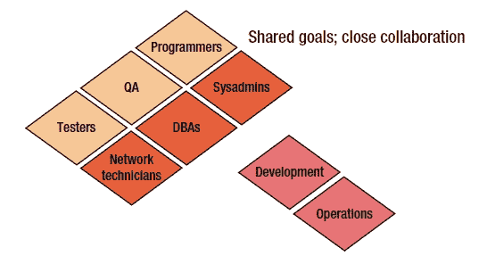
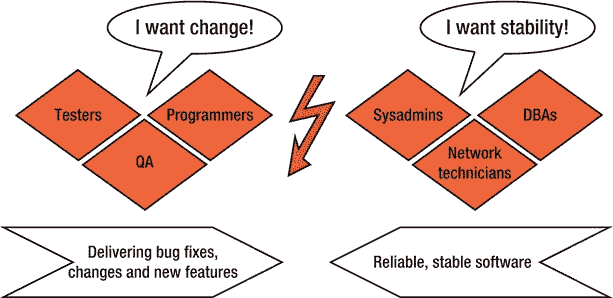

# 二、DevOps 简介

敏捷就是快速失败。如果你在公司取得了成功，那你就错了。

——奉献波拉特

在这一章中，我将介绍 DevOps 的概念。我还将总结传统项目在哪些方面受到了影响，敏捷在过去几年中做了什么来改善这种情况，以及在今天的许多项目中仍然缺少什么。有了敏捷，测试人员和程序员变成了开发人员，有了 DevOps，开发人员和运维变成了 DevOps。我将展示开发人员和操作人员之间的自然冲突经常导致“指责游戏”，这可以通过使用 DevOps 方法来解决。DevOps 带来了“一个团队”的方法，其中程序员、测试人员和系统管理员都参与了解决方案的开发。

我们将从简单描述软件工程中的传统方法及其主要属性开始我们的 DevOps 之旅。

传统项目设置

软件应用程序由功能组成，在许多情况下，新的功能经常会被不断引入。只有产品附带的特性才能增加价值，形成并改进“解决方案”解决方案不仅仅是一组功能；解决方案是一个应用程序，它增加了用户(使用应用程序的人)和客户(有钱的人)的价值。

新开发的特性只有在这些新特性不仅在开发人员的工作空间或测试机器中可用，而且在生产环境中也可用的情况下才会增加价值。生产环境包括服务器的硬件配置、中央处理器(CPU)、内存量、主轴、连接环境的网络基础设施、操作系统的配置和中间件(例如，消息传递系统应用程序以及支持该应用程序的 web 服务器和数据库服务器)。

对于软件来说，这是一个到达目的地的漫长旅程:生产系统。在传统的项目设置中，软件通常是指定的，然后分阶段编程，而不是迭代或增量。在编程期间，规范经常被证明是不充分的、错误的或不一致的。客户提交了一批变更请求，这些请求必须被跟踪，并与原始规范及其实现一起提交。

测试人员和 QA 尽最大努力检测他们下游活动中的错误，这从软件被创建时就开始了。测试人员经常因为所有出现的软件错误而受到指责。

票务系统充满了条目。有些人甚至会发现大量的票是有帮助的，因为它们证明好的测试已经发现了许多错误，或者可以作为新功能的停车场。很少有运维商认识到大量的门票是一种浪费，因为维护门票系统可能已经是一个昂贵的噩梦，而停放的门票绝不是已交付功能的替代品。

一些决策者认为，可以通过向项目中添加测试人员和 QA 来在事后注入质量。评估软件质量的度量被收集并转发给团队。在某些情况下，象牙塔里的人(或者更糟糕的是，开发团队)用奇怪的审计或学术标准在事实之后判断开发的产品。

在许多项目中，有一个起点和一个确定的终点，人们在项目中工作，资金受到限制，要交付的功能被指定。术语*项目*传统上以这种方式定义。为了开发和交付软件，项目领导定义并引入项目角色，这些角色根据整个过程的不同方面而被专门化。所有这些都是为了组织工作和提高结果。在许多情况下，项目都成功地完成了。该方法的无数变体和所有这些方法的比较(包括或不包括敏捷方法)超出了本书的范围。但是，这里需要理解的重要一点是，即使在成功的项目中，某些属性也可能会发生变化，包括:

*   *英雄崇拜* :团队算什么，个人才是王道。例如，考虑一个未能充分记录他或她的工作并交付低质量软件的程序员。糟糕的软件需要新的调整和错误修复，这只能由英雄创造者来执行，因为他或她没有记录或与团队共享他或她的知识、决策和项目经验。
*   *强调片名* :团队中的每个人都扮演一个角色，有着花里胡哨的描述。头衔才是王道！一个人只是开发人员，另一个人是高级开发人员。一个人晋升到高管、负责人或公司内任何职位背后的过程是什么？通常，首要因素是这个人在公司的任职时间，而头衔并没有说明这个人的技术技能或软技能，比如他或她的合作和沟通能力。
*   *影子职责* :虽然角色描述中列出了明确的职责，但人们都尽量避免履行职责。或者，他们从事其他不属于他们职责的活动，仅仅是为了保护他们的地盘，确保他们的影响力，或者放纵他们的“宠物项目”。结果，您在描述的过程(具有角色和职责)和过程在项目中存在的方式之间有一个差距(或者误解)。
*   *喜欢计划胜过计划* :一切都是计划好的，但计划的活动很少执行。计划(即调整原始计划)是一种罕见的活动。例如，一旦计划以甘特图的形式存在(由 Henry Gantt 开发的图表，用于指定项目的开始和完成日期；此图表用于计划和控制工作并记录进度)，图表成为项目的主导媒介和目标。在这种情况下，目标不再是以快速有效的方式向客户交付增加价值的软件。这往往会导致美丽但孤立的城堡。

开发和运维

在传统环境中，术语*开发*描述团队中的程序员。测试人员和 QA 通常是专门的项目角色，他们的活动在程序员完成工作后开始。*运维* 包含数据库管理员、系统管理员、网络管理员以及其他类型的设置和维护服务器和系统的管理员。运维团队基本上伴随并负责交付过程中的“最后一英里”。在经典的方法中，他们并不总是参与程序员、测试员和 QA 的工作，但是他们获得了他们工作的最终结果。

前面列出的属性通常会导致不同的组织和文化障碍，包括:

*   *分队* :运气好的话，你会有分队；如果你运气不好，你将成为一些松散耦合的工作组的一员。换句话说，分开的团队会培养他们的立场，追求个人的兴趣和目标。不幸的是，一个伟大团队的集合并不能取代一个追求统一和共享项目目标的团队。
*   *没有共同语言* :专业团队和项目角色更喜欢使用对他们来说最舒服的语言。不是使用整个项目都理解的共享语言，或者(甚至更好)用户和客户也理解的语言，而是使用许多小的、高度专业化的术语。于是，误会就产生了。高度专业化的语言也往往技术性太强，无法作为客户沟通的准确工具。
*   *恐惧* :别人做的事情是不好的，别人的任何可能影响自己工作类型或活动的活动都会遭到怀疑。认为共同的目标和知识有风险会导致各方的恐惧，尤其是害怕失去权力、影响力和声誉。历史和习惯也有它们的作用。人们不想放弃旧习惯，除非他们有充分的理由接受新的做事方式。

 **注**我曾经在一个项目中工作过，四个开发人员坐在一个房间的一张桌子旁开发同一个软件。这些人都把他们的同事称为他们的“团队”，这意味着四个团队坐在那张桌子上，而不是一个。

在最坏的情况下，瀑布般的场景，程序员编写应用程序，然后由测试人员进行测试。QA 随后执行下游质量保证。不同组之间的墙(以组织或过程边界的形式)阻止了紧密的协作。在经历了多年的痛苦之后，敏捷概念进入了市场，帮助消除了这些障碍。

敏捷项目设置

敏捷运动解决了次优协作和不同目标的痛苦。“一个团队”方法通过将不同的团体聚集在一起形成一个共享相同目标(例如，成功的软件开发)的团队来促进沟通和协作。术语*开发者* 有不同的含义，因为程序员和测试员都开发软件。程序员和测试人员无缝地一起工作，组成了被称为开发人员的工作组。

许多项目通过允许一组程序员和测试人员紧密合作并进行整个 QA 来获得最佳结果。团队中的每个人都执行 QA，并对质量负责。如图 2-1 所示，一个团队的方法导致了团队开发，然而操作端仍然本质上与软件开发相隔离。

[图 2-1](#_Fig1) 。*敏捷软件开发将程序员、测试人员和 QA 人员聚集在一起，组成开发团队。运维组及其各个子区域仍然与开发部门隔离*

在 Agile 项目设置中，角色和职责会发生变化。角色模糊，每个团队成员都戴着不同的帽子。程序员拿工资是为了执行写代码以外的任务，测试人员做的不仅仅是测试。测试人员也帮助程序员创建更好的代码。

因此，我们改变了方法，如下所示:

*   *质量* :测试人员不单独对质量负责；相反，整个团队一起工作来保持质量。
*   *开发*:程序员不单独编码；相反，每个人都帮助他们理解编码什么。
*   *项目角色*:跨职能团队成立，角色与活动分离。

如果你将工作定义为需要一起完成的活动，你就打破了角色界限，允许团队成员在多个领域增加价值。例如，您可以让程序员进行探索性测试。类似地，如果 QA 领导发现了可修复的 bug，您可以允许他们处理应用程序代码。

敏捷中的开发和运维

在敏捷方法中，开发由程序员、测试人员和 QA 组成。运维通常充当筒仓(或者被视为筒仓，这取决于视角)。

敏捷方法声称会产生更快乐的参与者。然而，运维部门仍然被一些人认为是机房里一群高度专业化的服务器技术人员。

与开发人员不同，运维团队的任务是接收来自开发团队的交付成果，并使软件在生产机器上可用，以便用户可以使用软件。同时，操作团队经常会收到非功能性的需求(比如应用程序可用性的目标值)。交付的软件(由开发团队交付)可能与这些非功能性需求相冲突。

许多不同的活动对运维都很重要。例如，操作组负责部署新的软件版本，管理生产系统的稳定性和可用性，包括服务器、网络和其他环境方面。

稳定性的定义

稳定性通常被定义为保持处理事务的弹性系统，即使瞬时脉冲(对系统的快速冲击)、持续压力(在一段时间内对系统施加的力)或组件故障破坏了正常处理(参见 Michael Nygard，*发布它！，*《务实的程序员》，2007 年，第 25 页)。

因此，运维负责软件在生产中的可用性，其成功通常通过计算服务器正常运行时间、软件可用性、安全性、容量(包括可扩展性、寿命、吞吐量和负载)以及响应时间的指标来衡量。这些度量标准(详见第 4 章[中的度量标准)通常被定义为质量需求(通常是非功能性需求)，作为服务水平协议(SLA)签署。它们表达了用户的期望，即软件的所有特性都是完全可用的。](04.html)

考虑相反的情况。如果软件在生产中不可用，这种缺失可以被监控系统检测到，或者(甚至更糟)被用户自己检测到。运维团队因此被直接归咎于宕机，其声誉也随之下降。责任和来自外部用户的直接认知的混合导致操作集中于维护稳定的生产环境及其软件。生产环境的每一个变化都是有风险的，并且是干扰的潜在原因。

开发团队的主要任务是满足客户的需求，测试解决方案，并快速连续地提供软件更新(见[图 2-2](#Fig2) )。开发人员已经实现和测试的新特性为客户增加了潜在的价值。一方面，开发团队想要改变。另一方面，运维团队主要对可靠和稳定的软件感兴趣。开发团队转发的每个变更都可能危及现有的可靠性和稳定性。

[图 2-2](#_Fig2) 。*开发人员(测试人员、程序员、QA)想要改变。运维人员(系统管理员、网络技术人员、数据库管理员)需要稳定性。这种错位导致冲突*

让我们总结一下主要发现。敏捷主要是通过引入整个团队方法来改进经典方法，在这种方法中，开发人员、测试人员和 QA 人员组成一个团队，与业务密切合作。统一的团队作为一个专家单元工作，他们同时执行一般的职责，并分担生产高质量软件的责任。但是，运维不是该团队的一部分。目标和任务的错位经常会导致责备游戏，我们接下来会讨论这一点。

指责游戏:开发与运维

软件交付过程对参与者有什么影响，为什么会导致冲突？为了更好地理解这个问题，我们必须检查关键人物的日常动机。随着更多功能的完成，开发者的声誉会提高。吞吐量和良好的速度被开发人员认为是优秀性能的反映。在许多情况下，从开发人员的角度来看，测试机器上可用的新特性与部署在可供用户使用的生产系统上的特性没有什么区别。

程序员、测试人员、数据库管理员和系统管理员每天都面临挑战。这些问题包括有风险的或错误的软件部署，不必要的缓慢交付过程，以及由于墙造成的次优协作和通信。这些问题通常会导致整体经济放缓，导致公司落后于竞争对手，从而处于不利地位。

部署期间的冲突

开发和运维团队之间的冲突通常源于时间压力。通常，必须快速部署新的软件版本。另一个需要运维团队快速做出反应的场景是当系统停机时，快速恢复系统成为重中之重。这种情况经常导致一场指责游戏，双方都指责对方造成了问题。

常见的情况包括:

1.  开发人员将一个新版本传递给操作人员，但是后者无法让它在生产系统上运行。
2.  运维团队联系开发团队的成员，让他们解决问题；前者描述了在将版本投入生产时遇到的错误。
3.  作为回应，开发阻止了交流，并且没有提供任何帮助。
4.  开发声称(正确地)软件版本在测试环境中运行没有任何问题。因此，开发部门认为运维团队没有将发布版本投入使用是错误的。双方的相互指责可能会导致愤怒的电话、充满敌意的电子邮件，甚至升级会议。
5.  将问题上报给老板和他或她的老板后，两名工程师再次被指派调查故障。
6.  通过同时调查测试和生产环境，他们发现这两个环境在一些小细节上有所不同，比如技术用户或集群模式。双方都不知道这种差异。

通过一起发现错误并手动调整系统，团队可以成功地将新的软件版本部署到生产中。当然，指责游戏会持续到后来，因为每一方都认为将差异标记为问题或相应调整系统是另一方的任务。

部署后的冲突

当一个新版本上线时，指责游戏也经常出现。这里有一个场景:

1.  使用新功能的用户比公司预期的要多得多。
2.  响应时间会变慢，直到软件完全停止响应。用户很恐慌，因为这是最坏的情况。
3.  将问题升级导致相互指责:开发人员声称这是数据库组的错，数据库团队归咎于网络组，其他人推测服务器组应对停机负责。
4.  在经历了强烈的情感折磨后，公司开始进行客观的检查，找出问题的根源。然而，此时，用户已经被新的应用程序吓跑了。因此，该公司在销售和声誉方面遭受重大损失。

关于性能的冲突

责备游戏也可能发生在以下场景中:

1.  生产系统中突然出现性能问题。
2.  在相互指责之后，开发人员发现了应用程序中的一个问题。他们工作了很长时间，最终提供了一个补丁来修复这个问题。
3.  尽管如此，运维团队仍然对性能问题感到恼火，并想起了过去类似的例子，其中每个后续补丁都进一步降低了软件的稳定性。因此，运维团队对应用补丁持怀疑态度。
4.  由于这些问题，团队成员建议自己编写软件。这个建议反过来加剧了团队之间的紧张情绪。运维团队希望在测试环境中应用补丁，以确保它不会影响应用程序的整体稳定性，并确保它实际上修复了性能瓶颈。
5.  不幸的是，测试环境并不完全反映生产环境，也没有测试场景或测试数据可以在测试机器上模拟完全相同的问题。几天几周过去了，补丁仍然没有应用到生产中。所有那些花在解决方案上的长时间都白费了。
6.  管理和业务部门增加了解决问题的压力，开发和运维团队继续他们的冲突，所有人都感到沮丧，生产机器上的性能问题没有得到解决。

不幸的是，这些恐怖故事很常见(虽然不一定是规律)。你经历过这些类型的场景吗？你是否得出这样的结论:回想起来，从一开始就一起解决问题会更好(也更快)？

项目生活很艰难，开发和运维之间可能会出现许多冲突。然而，缩小这些问题的范围是可能的。运维和开发之间大多数冲突的核心问题是运维部门经常被认为是一个瓶颈。我们将在下一节中解决这个问题。

运维成为瓶颈

许多团队和项目关注于责备游戏和交付软件的日常负担。当开发开始在开发软件时采用更敏捷的过程时，开发和操作之间的冲突恶化了。像 Scrum (一个支持迭代和增量敏捷软件开发的管理框架)这样的过程建议整体的方法，将业务人员和开发集合在一起，每两到四周发布一次增量。在过去的几年中，这些迭代模型已经成为主流，但是很多时候，当软件发布进入生产阶段时，公司已经停止向 Scrum 过程添加人员和活动。

 **注**请注意，本书主要针对开发者。注意这样一个事实，即*开发人员*不仅仅包括测试人员、程序员和质量保证专家；相反，一个团队的方法(正如本书所介绍的)还包括来自操作的专家，他们开发例如脚本或“基础设施即代码”来为用户提供解决方案。

敏捷过程的优势，包括 Scrum 和看板(一种强调准时交付的软件交付方法，见[第 6 章](06.html))，经常因为在运维前建立的协作、过程和工具的障碍而失效。因此，软件经常发布，但只是在测试环境中。因此，软件很少进入生产阶段，生产阶段将一个新版本转化为一个解决方案，并为最终用户和客户提供价值。换句话说，并不是所有的发布都是生产出来的，通常在开发团队对发布进行编码和测试之后，才部署到生产环境中。总之，周期时间(即从创意开始到交付给用户的时间)仍然太长。开发中软件发布的高频率和对运维的激励(及其影响)导致了公司中许多人认为的运维瓶颈。

开发人员希望操作人员将他们的变更带到生产环境中，但是操作人员可能不愿意接受触发过快的发布日程表(通常是因为负面的体验，例如不稳定的应用程序；信任往往必须一小步一小步地重新赢得。结果，开发人员可能通过使用敏捷框架(比如 Scrum)在很短的周期内完成了功能，但是运维人员可能不希望或者不能够接受这些细粒度部分的所有变更。运维部提供了一些发布槽，在那里新的(或改变的)功能可以被传递到生产中(见[图 2-3](#Fig3) )。可以想象，这些对软件发布的不同观点并不完全一致。

[图 2-3](#_Fig3) 。*开发团队的观点与运维团队的观点严重不一致，前者希望给用户带来频繁的变化，后者则为软件投入生产提供专门的机会 [2](#Fn2)*

然而，从开发团队的角度来看，发布槽的等待时间并不是唯一的问题。另一个问题是这个发布时段是有时间限制的，这意味着新的软件版本必须在具体的时间间隔内(例如，在一天之内)“上线”。如果在这么短的时间间隔内出现问题，并不总是有可能找到解决方案，在最坏的情况下，操作团队回滚到软件的旧版本，开发部门被赋予一些额外的任务，他们必须考虑在未来的某个时间进行下一次机会(即下一个发布槽)。开发人员会责怪操作人员不能或不愿意将软件投入使用。运维部门会责怪开发团队成员，因为他们没有能力开发生产就绪的软件。

这些不匹配的根本原因可以归结为不同的目标和这些团队之间的次优协作。潜在的原因也受水平对齐的影响，这将在下一节中讨论。

横向优化

水平优化方法意味着可用的基础设施组件 [3](#Fn3) 数量有限，因此在选择完美的架构时，选项集也较少。在这里，操作具有更高的优先级，并且通过例如负载平衡技术、减少不同系统拓扑的数量或者团队成员的必要技能来发现和应用可能的协同作用。横向优化方法侧重于利用架构组件，如图[图 2-4](#Fig4) 所示。

[图 2-4](#_Fig4) 。*敏捷软件开发跨越了从初始到产品化的过程。DevOps 跨越了从精化到运维的过程 [4](#Fn4)*

运维部首选水平优化方法。通过这种方法，运维部门可以优化其基础架构组件的利用率以及服务管理。在公司中，运维通常是信息技术(IT)服务管理工作的一部分。我们接下来会讨论这个概念。

运维和 ITSM

运维可以整合到 IT 服务管理(ITSM) (见[图 2-5](#Fig5) )。ITSM 涉及组织对其流程的管理及其向用户提供的 IT 服务。对于大多数公司来说，他们对 ITSM 的看法始于并止于服务台，但它实际上包含的远不止公司的服务。相反，为了支持跨运维和业务部门的服务，ITSM 需要在资源提供方面加强协作。

[图 2-5](#_Fig5) 。 *DevOps 将软件开发与运维联系起来。两者都是基于商业。软件开发受敏捷方法的影响，而运维受服务管理的影响 [5](#Fn5)*

尽管运维与业务有一定的一致性，但它通常主要受服务管理和基础架构管理优化的驱动。借助 DevOps，除了开发之外，敏捷方法还应用于运维。我们将在下一节讨论 DevOps 的范围。

DevOps 来救援

在过去的几年里，许多人致力于将敏捷方法应用到运维中。这些方法旨在消除发展和业务之间的隔阂，解决这两个部门之间的结构性冲突。通过分享经验和可能的解决方案，该运动形成了现在所谓的 DevOps。运动形成的过程以及讨论和提供解决上面总结的痛点的方法类似于敏捷运动几年前开始工作的方式。从另一个角度来看，DevOps 旨在将敏捷扩展到运维领域。

DEVOPS 一个团队方法:开发和运维

使用 DevOps 方法，开发人员角色由程序员、测试人员、QA 和运维专家组成。他们都开发软件，并帮助把它带给用户。

对开发和运维的任务和观点的比较表明，两个团队有不同的目标和动机，这些差异导致了冲突。开发团队努力追求变化(例如，新特性和错误修复)，而运维团队努力追求稳定。通常，这些团队正是因为这些任务而获得报酬的:如果软件交付，开发获得奖金，而如果生产系统稳定，运维获得奖励。因此，开发部门希望新提供功能的高流量，而运维部门则希望避免将任何新版本投入生产。

两个团队都遵循各自的目标，专注于各自的任务，履行自己的义务，以获得管理层的积极关注和出色工作的可见性。为了实现各自的目标，开发和运维通常使用自己的流程和工具。过程和工具的集合被局部优化(对于每个组)以获得最佳的局部结果。

尽管从孤立的角度来看，这些方法很棒，但是软件的总流量减少了，并且整个项目(或公司)的目标受阻。结果，孤岛被构建，冲突每天都在发生，人们相互对抗而不是相互合作来提供可能的最佳解决方案。 [6](#Fn6)

DevOps 的本质

DevOps 运动的一个核心理念是可以总结众所周知的和新的方法、流程和工具。虽然这种多样性可能会导致对 DevOps 的组成部分有不同的看法，但许多不同的方面也可能包含在 DevOps 标签下。这一特性极大地有利于交流，因为来自不同学科的专家可以联系到 DevOps，并在 DevOps 标签下将他们的个人经验和技能汇集在一起。通过分组，这些专家可以更容易地参与讨论，并相互分享他们的知识和经验。像 DevOps 这样的术语引起了管理层对 DevOps 概念的关注，以及开发和运维需要协作以找到协同效应并发展竞争优势的事实。

在下面，我将从共享的价值观和目标开始解释 DevOps 的本质。

价值观和目标

与敏捷运动类似，DevOps 非常关注人际关系方面。DevOps 就是要把乐趣放回去！然而，协作是什么意思呢？合作和信任有许多先决条件，包括:

*   互相尊重。
*   对共同目标的承诺。
*   集体所有制。
*   共同的价值观。

提高协作的关键是团队间激励的一致性以及共享流程和工具的应用。一致激励的主要属性包括对整个项目或公司质量的共同定义以及对它的承诺。与定义的质量属性一致，可见性和透明度有助于促进协作。激励机制必须将开发和运维团队视为一个团队。也就是说，他们应该因为开发了许多稳定且已发布的变更而获得奖励。

如上所述，这种结构可以结束两个群体之间的裂痕，这两个群体经常以相互冲突的方式获得回报。奖励一些人的创新和另一些人的稳定必然会产生冲突。奖励每个人的稳定创新可以促进合作。作为先决条件，团队是跨职能的。该团队包括程序员、测试人员、QA 和运维人员。因此，个人专家与他人分享他们的技能和经验，这导致一种团队方法，其中个人至少对他人的领域有基本的了解(见[图 2-6](#Fig6) )。

[图 2-6](#_Fig6) 。 *DevOps 带领团队将分享技能和经验的专家聚集在一起。所有的专家至少对其他人的业务科目有一个基本的了解 [7](#Fn7)*

DevOps 是关于团队合作和协作解决问题的方法。如果一项服务停止运行，每个人都必须知道应该遵循什么程序来诊断问题并让系统重新启动和运行。此外，执行这些任务所需的所有角色和技能都必须可用，并且能够很好地协同工作。在这方面，培训和有效合作至关重要。

由于对团队成员的要求不断变化，DevOps 将在中央公司中获得更大的重要性，例如人力关系，该公司必须雇用思想开放并愿意在团队中合作的人。

处理

定义软件如何开发和交付的过程比工具更重要。在开发了适合您的个人需求和基本条件的过程之后，您可以选择最适合您的过程的工具。在处理不同部门之间的交互时，流程甚至更加重要。必须定义交付工件的移交。那是不是意味着我们必须把开发和运维合并到一个部门？不。在开发和运维的界面中安装跨学科专家更重要。

在本书的后面，我们将讨论描述如何完成以下任务的模式:

*   将责任与工件(可交付成果)联系起来，而不是与角色联系起来(后者是传统的方法)。
*   建立和简化一个整体的过程，在开发将软件移交给操作的同时保持速度。
*   包括全面的端到端交付流程中的开发和运维。
*   包括敏捷框架和流程中的操作，比如 Scrum 和看板。

开发和运维共享相同的过程，两个团队都专注于以高频率和高质量向用户交付应用程序变更。统一流程强调周期时间，更倾向于垂直优化方法。根据这种方法，每个应用程序都是在对这个具体应用程序来说完美的架构上创建和执行的(见[图 2-7](#Fig7) )。基础设施的各个组件的布局是为了满足特定应用的要求。跨越单个应用程序边界的优化很少或者根本不会发生。因此，管理应用程序时的协同作用并不具有高优先级。

[图 2-7](#_Fig7) 。*垂直优化与单个解决方案保持一致，关注每个应用的理想架构 [8](#Fn8)*

传统上，垂直优化方法是开发团队的首选。在 DevOps 中，开发和运维都更喜欢生产中可行的解决方案，并对垂直优化持开放态度。

工具

过程比工具更重要，但是工具仍然很重要，尤其是对于交付过程中的自动化活动。工具箱中的工具越多，就越能决定哪种工具最适合某项任务。

简化 DevOps 严重依赖于端到端自动化。考虑构建中的所有步骤。这些步骤包括准备构建系统；将基线应用于源代码控制系统；进行构建；运行技术、功能和验收测试；包装；以及部署和准备工件。所有这些都通过适当的工具实现了自动化。代码和脚本存储在版本控制系统中。DevOps 的代码和脚本包括以下内容:

*   构建应用程序的代码和脚本。
*   对应用程序进行单元测试的代码和脚本。
*   应用程序验收测试的代码和脚本。
*   部署应用程序的代码和脚本。
*   用于为不同的目标环境配置应用程序的代码和脚本配置选项。
*   用于编程目标环境的属性和“行为”的代码和脚本。

最后一点很有意思。使用像 Puppet 或 Chef(我们将在后面讨论)这样的工具，特定领域语言(DSL)可以用来描述环境的属性(例如，技术用户、权限和已安装的包)。代码和脚本存储在版本控制系统中，例如 Git(分布式版本控制系统)或 Subversion(集中式版本控制系统)。这种方法有很多好处，包括:

*   通过使用 DSL 抽象出机器的描述，同时享受脚本语言的全部功能(在 Puppet 和 Chef 中，你可以用 Ruby 语言(一种动态的、通用的面向对象编程语言)描述行为，参见[http://www.ruby-lang.org/en/](http://www.ruby-lang.org/en/))。
*   目标行为的声明性描述(例如，系统必须是什么)。因此，运行脚本将总是导致相同的最终结果。
*   版本控制中的代码管理。通过使用版本控制系统作为主要媒介，您不需要手动调整机器(这是不可重复的)。
*   通过使用版本控制系统和环境的自动供应来同步环境。持续集成服务器，比如 Jenkins，只需监听版本控制系统中的路径来检测变更。然后，配置管理工具(例如，Puppet)确保相应的机器应用版本控制中描述的行为。
*   使用诸如 Jenkins(见[第 8 章](08.html))和 Puppet and vagger(见[第 9 章](09.html))等工具，可以自动管理完整的设置，包括虚拟化。
*   分享剧本(如木偶清单)。包括开发和运维在内的跨职能团队可以开发这一功能。

共享版本控制系统中的脚本使得所有各方，尤其是开发和操作人员，能够使用这些脚本来建立他们各自的环境:测试环境(由开发人员使用)和生产环境(由操作人员管理)。

自动化是 DevOps 的重要支柱(有关自动化的更多信息，请参见[第 3 章](03.html)和[第 8 章](08.html))。自动化是使用解决方案来减少对人工工作的需求。自动化可以确保软件每次都以相同的方式构建，团队可以看到对软件所做的每一个更改，并且软件每天都以相同的方式进行测试和评审，这样就不会遗漏任何缺陷，也不会因为人为错误而引入任何缺陷。

在软件开发项目中，高水平的自动化是快速交付最佳质量以及尽早和经常从涉众那里获得反馈的先决条件。DevOps 的自动化方面有助于使部分过程对整个团队透明，也有助于以相同的方式将软件部署到不同的目标环境。你能最好地改进你测量的东西；为了有效地测量，你需要一个以可重复的方式交付结果的过程。

DevOps 解决的问题与敏捷开发解决的问题类似，但前者侧重于打破开发人员和运维人员之间的壁垒。挑战在于向开发和运维团队传达 DevOps 的优势。这两个群体可能都不愿意开始实施向 DevOps 的转变，因为他们的一天已经充满了活动。那么，他们为什么要关心别人的工作呢？为什么运维部门要使用不熟悉的工具并调整他们的日常工作，而他们自制的、孤立的解决方案多年来一直运行良好？

由于这种阻力，上层管理人员提供的激励和承诺非常重要。仅有激励是不够的:统一的过程和工具链也很重要。如果看不到具体的好处，上层管理人员还会质疑实施 DevOps 是否明智，从而进行抵制。更好的现金流和上市时间很难衡量。管理层提出的问题解决了软件工程的核心问题，却忽略了症状:公司如何在短时间内获得最大收益？如何使需求稳定并快速交付给客户？这些结果和愿景应该用开发和运维部门共享的指标来衡量。现有的指标可以被进一步使用，或者被准确表达业务价值的指标所替代。端到端指标的一个例子是周期时间，我们将在第 3 章中详细讨论。

结论

在本章中，我们经历了从经典项目设置到 DevOps 方法的漫长旅程。过去，敏捷方法成功地解决了程序员、测试人员、QA 和客户之间的常见障碍，但是冲突仍然存在。我们已经确定了开发和运维之间的冲突,这些冲突经常导致孤岛和次优解决方案。开发和运维之间的指责游戏经常发生，这表明了由不同的目标、流程和工具产生的冲突。

将敏捷方法扩展到运维可以产生一个团队方法，这也包括敏捷中的运维。开发和运维都受益于敏捷方法。开发和运维携手合作，共享目标、流程和工具。

DevOps 可以作为软件工程许多不同方面的标签。在讨论 DevOps 时，将 DevOps 分成三个方面是有帮助的:共享的目标、过程和工具。这些观点的结合构成了 DevOps 的精髓。

在下一章，我们将探索 DevOps 的积木。我们将发现周期时间是一个对所有利益相关者都有意义的关键指标。

[1](#_Fn1)【http://twitter.com/devops_borat/status/116916346222157824】T4。

[2](#_Fn2)

[3](#_Fn3) 运维团队也可能受到限制，因为项目可能会争夺运维团队专家的时间。

[4](#_Fn4)

[5](#_Fn5) 我感谢 Udo Pracht 对这个数字的构思。

[6](#_Fn6) 乔布斯常说，“真正的艺术家的船。”

[7](#_Fn7)

[8](#_Fn8) 我感谢 Udo Pracht 对这个数字的构思。