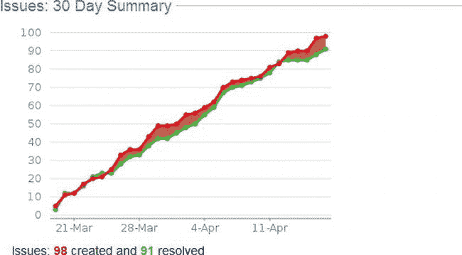

# 三、DevOps 的积木

为了估计项目持续时间，我们将摄氏温度应用于华氏温度公式。C 是内部估计，F 是我们告诉 PM 的:C × 9/5 + 32 = F 天。

——奉献波拉特

在本章中，我们将研究 DevOps 的积木。我们将讨论指标，您将了解到周期时间对于开发和运维都是最重要的指标。我们还将讨论如何改进和加速软件交付。让我们从测量和度量开始。

测量和指标

软件工程的一个重要方面是衡量你在做什么。迟早，你将不得不决定在你的软件工程过程中使用哪些度量标准。你必须考虑哪个指标足够有意义来帮助所有参与者，以及开发和交付 过程。

传统项目强调度量是跟踪进展、识别当前状态和安排日期的重要工具。敏捷项目设置试图找到不同的方法来创建度量，但是当试图将操作连接到开发时，经常会发现自己走进了死胡同。传统项目和敏捷项目都经常强调度量的重要性，因为只有度量才能提高。让我们简单看看传统项目是如何理解度量和指标的。

度量标准的传统用法

经典的度量标准通常由数字驱动:它们试图将高度复杂的依赖关系总结和聚合成单一的数字。计数会导致一种错觉，以为我们可以理解某件事，因为我们可以量化它。您是否遇到过只提供一个数字来说明项目状态的 PowerPoint 幻灯片(例如，成本效益、产能利用率 [2](#Fn2_3) 或满足目标范围，全部以百分比表示)？数字暗示了控制的错觉。然而，数字很容易误导人。更糟糕的是，数数经常会导致不正当的动机。即使管理者不是基于过程度量来评估人，计算事情也会影响行为。

 **注意**在经典项目中，广泛的测量和度量经常被用来“通过数字来管理”

经典的度量标准，比如静态代码分析或者测试覆盖，可能会持续吸引整个团队的注意力，却没有同等程度的回报。伪造度量或者使过程服从度量而不是改进过程本身(例如，添加空的测试体或者注释掉损坏的测试来优化测试覆盖度量)是非常容易的。

使用“功能点”来确定功能的保守方法也可能产生误导。您可以通过使用“功能点”来度量功能来度量软件开发的产出，但是您不能从中获得真正的价值或任何生产力。

传统的度量标准经常被滥用来比较团队或个人。破坏任何过程度量有用性的最好方法是用它来判断人。例如，如果一个管理者使用速度或者缺陷的数量来比较团队，这个管理者将会有一个严重的问题。

 **注意**速度是一个为团队提供“进度”信息的度量。例如，速度可以是一个团队在一个时间间隔内可以执行的用户故事的数量，其中包括测试和交付是很重要的。因此，一个简短的形式可以表示为“运行测试功能”(RTF) 。 [3](#Fn3_3) 

度量的敏捷方法

敏捷开发方法需要一种训练有素的方法来确保客户反馈、持续测试和迭代开发实际上导致工作的、有价值的软件的频繁交付。

软件应用程序由功能组成，在许多情况下，新的功能会不断地被创造出来。只有那些增加价值、形成和改进“解决方案”的功能一个解决方案不仅仅是一组功能；解决方案是为用户(使用应用程序的人)或客户(有钱的人)增加价值并使其受益的应用程序。

敏捷经常讨论价值而不是具体的度量标准，并指出软件必须交付给客户才有价值。指定(但未实现)和实现(但未发布)的软件通常被认为是浪费，因为时间和金钱被投入到指定和构建软件中，却没有获得任何回报。结果，没有提供任何东西来帮助用户更有效地工作或提高公司相对于市场上其他公司的竞争优势。

敏捷开发团队通常将度量视为一次性的指针,而不是连续的度量。指针使软件内部质量的当前状态可见。然后由团队决定何时调整代码库或者是否要这样做。这些指针提供了一些值得研究的指标，但它们没有提供做出关键决策所需的背景和理解。

完成的定义

另一个众所周知且常用的方法是定义 Done (DoD) 。在工作开始之前，已完成的工作的定义被指定，并且团队致力于这个定义。国防部经常声明，直到测试完成，或者软件以规定的质量交付给目标系统，或者对交付的软件进行监控，开发工作才算完成。通过使用 DoD，整个团队对任务完成的时间有相同的理解。此外，国防部需要新的功能来增加系统的价值，并在系统交付给用户后增加用户的价值。

破碎的敏捷指标

尽管意图是好的，但是在敏捷团队中，度量标准经常被打破。以下是一些不符合标准的示例:

*   *测试通过/失败比率*:敏捷团队停止生产线并立即修复一个中断的测试。因此，测试通过/失败比率是没有用的，因为团队停止并直接修复回归。然而，该度量对于检测基本缺陷是有用的。例如，如果测试覆盖率低于 20 %,很明显技术债务已经累积。

 **注**技术债务是一个比喻，用来描述次优软件的最终后果。债务是在任务被认为完成之前需要完成的开放工作。

*   *产生或解决的缺陷数量*:您能从产生的缺陷或解决的故障单数量中提取出什么信息？这些数字并没有帮助项目向前发展，而是经常导致相互指责，争论什么是错误，什么不是特性。正如[图 3-1](#Fig1) 所示，拥有关于新的和关闭的票证的信息或者票证数量的历史记录并不能提供关于应用程序本身或者一个新特性将会返回多少价值的信息。

[图 3-1](#_Fig1) 。*票务系统经常会显示一些关于已创建和已解决的票务的数据和曲线。这些信息当然很有趣，但并不像最初看起来那样有意义。*

*   *持续部署*:部署过程，至少在理论上，持续构建、打包和部署启动并运行的软件。然而，构建工作经常中断，打包的应用程序经常无法部署到目标系统。显然，应用程序对目标环境的期望与该环境的当前状态之间存在差距，部署脚本有问题，或者根本没有描述该过程。显然，所有这些问题都不理想。

发布和部署

版本是您提供给用户的特定软件版本。一个发布是通过提升一个特定的候选发布来创建的。候选版本不仅仅是软件的任意版本。一个发布候选已经满足了特定的需求(例如，所有的测试都成功运行)。如果您将软件的一个发行版(或者甚至一个候选发行版或者一个版本)安装到一个特定的环境中，就会发生部署。

一些有趣的组合也可能进化。例如，如果一个传统的管理者试图在一个敏捷团队中建立个人速度的概念，这个管理者肯定需要一些指导。对个人目标的含义视而不见是危险的，比如更好的个人速度。人们不互相帮助，因为他们知道如果他们花时间帮助别人，他们自己的个人生产力会下降。或者，如果同事在接受另一位同事的帮助后表现得更好，他们也不会提供帮助。

其他指标不能反映个人的目标；相反，它们反映了团体的目标。通常会衡量严重事件和解决这些事件所需的响应时间。可以想象，这些方法通常是正交的:软件开发关注软件的内部质量或外部质量(简而言之，就是交付的功能总和)，而操作关注应用程序甚至整个服务器的运行时属性。因此，我们需要不同的度量方法来简化开发和运维。不过，我们先来讨论一下软件方面的变化。

限定变更

敏捷团队通常不区分错误、增强或变更请求。他们使用一个叫做变化的通用单位来跟踪进度。变更似乎是开发和运维的有效单位，因为运维团队主要考虑生产系统的变更。使用变更作为开发和操作的共享术语，可以更容易地将生产问题流回工作积压(理想情况下由两个组共享)。

思考一个改变会引出后续问题。产生了多少变化并传递到运维中？在特定的情况下，我们有什么类型的改变，改变多久应用一次？

一旦对系统进行了更改，就可能导致问题。注意到问题并确定其根本原因需要大量时间。在进一步调查之后，您必须决定是回滚到旧版本来修复问题，还是通过应用修复程序或至少一个解决方法(即，在将来的某个时间点修复问题；参见[图 3-2](#Fig2) 。

[图 3-2](#_Fig2) 。*将不同的变更类型简化为简单的变更，可以作为开发和运维之间合作的基础。变更发生后，可能会导致问题。问题被发现、识别并解决。*

MTTR 和 MTTD

运维部门通常使用术语平均修复/解决时间(MTTR) ，指的是解决系统或网络问题(在技术人员收到故障单后)以及在事件发生后恢复正常运维所需的时间，以及平均检测时间(MTTD) ，描述的是生产中事件的发生与运维团队检测到事件之间的差异，运维团队随后会启动特定的操作以将事件恢复到原始状态。有保证的 MTTR 通常被定义为服务级别协议(SLA)的一部分。有关 MTTR 和 MTTD 的更多信息，请参见 John Allspaw、Jesse Robbins、O'Reilly 于 2010 年出版的《网络运维:保持数据准时》,第 82-87 页。

为什么不把系统的所有变化，包括软件、中间件和基础设施的变化，都看作是变化呢？这样做可以提高开发和运维之间的共识。必须提高信心，使变更不被视为停机，而是视为正常过程(见[表 3-1](#Tab1) )。

[表 3-1。软件工程中出现的变化类型](#_Tab1)

| 层 | 例子 |
| --- | --- |
| 应用代码 | Java 代码、部署描述符、构建脚本 |
| 中间件 | Apache、MySQL、PHP、配置文件 |
| 基础设施 | 操作系统、服务器、交换机、路由器 |

假设一个“变更”可以作为一个共享的度量单位，那么现在让我们来探讨一下周期时间对这个过程有什么贡献。

改善功能流程

DevOps 本质上是通过对开发和运维都有意义的整体方法来获得快速反馈和降低发布风险。实现这种方法的一个主要步骤是改进特性从开始到可用性的流程。这个过程可以细化到在不改变产能或需求的情况下减少批量(一个变更包的大小或新版本发布前完成的工作量)变得很重要。为此，我在这里定义了一些关键术语。

周期时间

周期时间是完成一个操作、功能或过程周期所需的时间。处理客户订单所需的周期时间可能从客户打电话开始，到订单发货结束。在软件工程中，周期时间描述了从开发过程开始到产生收入开始所需的时间。整个过程包括许多不同的步骤。工序中所有子流程的累计周期时间决定了您何时可以向客户承诺已交付的功能。只有当您将“完成”定义为特性已经开发、测试并交付给客户，然后客户可以开始使用它们时，周期时间才有意义。

Donald G. Reinertsen 在他的书 [4](#Fn4_3) 中讨论了这个概念，他将周期时间分解为三部分:模糊前端(FFE)、、开发周期和批量时间。FFE 开始于最早的时间点，在这个时间点上人们可以开始在项目上工作。通常使用提交书面项目建议书表格的日期。

FFE 的结束标志着一个收费号码的开通，开始收取开发的费用。这种行为通常意味着公司正在认真地追求产品。这个信号标志着我们称之为开发周期的开始。开发周期随着产品的第一次创收出货而结束。如果所有的项目目标都已完成，最后一个阶段，即时间-产量阶段，就结束了。目标通常包括实现目标质量目标和交付足够的数量来满足需求。在这些目标实现之前，开发团队的工作不会结束，因为经济机会仍然存在。如果你在产品一出货就宣布胜利，那么很可能没有足够的注意力放在剩余的工程上，这些工程必须被执行来完成产品的生产优化。坚持在运输第一台设备之前进行所有这些优化通常是一个糟糕的经济选择，尽管这是一个常见的错误。

在其他情况下，以不同的方式定义周期时间可能是有用的，但是关键点是就可测量的起点和可测量的终点达成一致。

理解周期时间支持跨越不同部门和项目角色的软件工程的整体方法是很重要的。周期时间可以作为开发和运维共享的关键指标。还有其他术语在使用中，你将在接下来学习。

提前期、生产节拍和生产量

除周期时间外，还可以使用术语*提前期* 。例如，交付周期可以指从向系统输入请求到完成订单之间的时间量。交付周期通常包括排队时间和工作订单准备时间。因此，在产品开发中，我会在衡量交付周期时包括 FFE 和开发周期。

*生产节拍* 主要是一个制造术语，指的是流程的节奏。我不经常使用这个术语，因为我更喜欢指过程的节奏，比如每 24 小时发布一次代码。通常，制造指的是一个流程的单一生产节拍，例如每五分钟生产一辆汽车。如果生产节拍改变了这种定时，这种改变会传播到所有子流程。我更喜欢使用 cadence，因为我可以将它指定为每周部署的 cadence 和每天测试的 cadence。

有些人可能会以不同的方式使用术语。例如，术语*吞吐量* 既指产量，也指产出率。因此，在您的项目中建立一个术语表以确保对关键术语的共同理解是很有帮助的。

改善和加速交付

周期时间如何有助于减少批量？如果我们减少批量，我们可以更频繁地部署，因为减少批量可以缩短周期时间。在一个发布工程团队花了一个周末的时间在数据中心部署过去三个月的工作之后，任何人都不希望很快再次部署。如果一项任务是痛苦的，解决的办法是更经常地做它，并把痛苦提前。正如[图 3-3](#Fig3) 所示，选择小版本而不是大版本最终会交付相同数量的功能，但是更多的功能会更快地交付，软件会更快地回报价值。

[图 3-3](#_Fig3) 。*通过使用大版本，您将拥有大批量，并且功能将延迟发布。通过使用小版本，您将使用合适的批量大小，并且功能将更快可用。*

频繁地部署到生产环境将有助于保持事情的简单性，并使个人的改变更有针对性。部署的风险降低了，因为您练习了部署的过程。通过提前解决问题，您可以更早地发现流程和工具链中的问题，并能够相应地进行优化。因此，部署本身也只会在不同的部署之间以较小的批量发生变化。

频繁部署到生产环境的另一大优势是，修复事故的过程也将得到优化。

更频繁地部署意味着部署之间的变化很小，这反过来有助于了解生产事故的根本原因，并使生产系统再次恢复运行。发现你的错误变得容易多了，因为改变的数量少了很多。一旦发现错误，可以更快地修复错误，这使得完全回滚变得不必要。

频繁部署不仅会减少回滚到软件的过去版本的需要，而且即使您必须回滚，您也只需要回滚一小部分更改，这在技术上比回滚包含几个月或几年全部工作的版本要容易得多。回滚不仅是一个技术问题；但是从业务角度(例如，客户满意度或营销活动)来看，回滚单个功能比回滚包含数百个功能的完整版本更容易管理。

如果您的部署管道确实高效，签入向前滚动的更改(例如，代码中的 bug 修复)通常会比繁琐的回滚更快。总是应用更改来创建软件的新版本(意味着总是前滚)有一个直接的好处，就是您的部署过程更集中、更简单，因为您不需要设置和维护通常很复杂的回滚过程。

因此，增加变更频率和减少各自的变更大小(见[图 3-4](#Fig4) )可以产生许多优势。

[图 3-4](#_Fig4) 。*变化经常发生，但每次变化的金额较小，因此风险更小，更方便，更快上市。*

自动发布

存在许多降低风险的实践，例如持续集成和自动测试。在更高的层次上，这些实践可以被总结为发布的方法。有功能发布(将工作项目分配和跟踪到目标发布)和技术发布，它们形成基线(“已知良好”状态)，一组一致的和版本化的配置项目。自动发布是自动创建发布(或者至少是发布候选)的实践。自动发布的一个关键目标是降低发布软件的风险。一个有效的自动发布策略可以降低任何单独发布的风险。在下文中，我们将探索一些使自动发布有效的一般思想。

将构建、测试(见第 4 章和第 10 章)和发布(见第 8 章)软件中的常见任务自动化，有助于提高效率，并建立可由工具链实现的可重复过程。我们甚至可以自动化虚拟机和中间件(参见第 9 章)以及应用程序代码的供应和部署。这种自动化确保了可重复性。在我的书*敏捷 ALM* ， [5](#Fn5_3) 中，我陈述了“自动化集成、构建、打包和部署步骤将促进快速迭代开发”以及“自动化最容易出错、最重复和最耗时的活动是必不可少的。”

自动化的陷阱

你应该 100%自动化一切吗？在接下来的部分中，我举例说明了自动化常见任务时感兴趣的四个方面。这些方面并不明显，但是忽略它们的相关性会产生难看的结果。

边际成本定律

在大多数情况下，你不应该自动化一切，虽然有些人争取完全自动化。完全自动化通常是不可能的，从商业角度来看也没有意义。考虑边际成本定律。开发中的软件需要维护，并且不断地对增强进行编码。(自动化)系统本身也是如此。如果在运行的(自动化)系统中，由于出现了新的需求或者正在实现的变化，某些东西必须改变(在这两种情况下，自动化系统和应用程序本身可能导致自动化系统中的变化)，这些活动将花费时间和金钱。运行自动化系统需要钱。明显的例子包括测试和构建脚本。

动词/名词错误

此外，项目活动经常与有意义和无状态的可交付成果混淆在一起(例如，“动词/名词错误”)。让我们再次考虑测试规程。测试是一项活动(也就是说，它不是一个名词)。将测试理解为一个名词是次优的，并且可能导致对无意义的工件类型(例如，测试用例)的关注，而不是对应用程序进行具体有效的测试。因此，你很可能不希望仅仅为了一大堆测试用例而 100%自动化你的测试。此外，测试的关键部分根本不能自动化(例如，用户界面的探索性测试)。这个限制也适用于其他学科。

自动化的悖论

另一个应该考虑的方面是“自动化的悖论”自动化的悖论 [6](#Fn6_3) 说“自动化系统越高效，运行自动化系统所需的人类贡献就越重要。人类较少参与高度自动化的系统，但他们的参与变得更加关键。”如果自动化系统出现错误，整个系统通常完全不可用，直到错误被识别(第一次质询)并修复(第二次质询)。发现错误是一项艰巨的任务，对于一个不是底层自动化步骤专家的工程师新手来说是无法完成的。即使你有信心声称某个问题并不存在，因为系统目前正在运行，但总有一些情况(除了好天气情况)会在这个运行的系统中引发故障或错误。监控和操作(运行中的)系统需要很强的技能和经验。此外，维护和进一步开发系统需要很强的技能和经验，因为需求会发生变化，并且将来会提出新的需求。

自动化的讽刺

最后一个方面是“自动化的讽刺”“工厂越可靠，操作员实施直接干预的机会就越少，需要操作员干预的剩余任务的要求就越困难。” [7](#Fn7_3)

根据 Ashwin Parameswaran 的说法，通过自动化程度高的“自动驾驶仪”运行大多数场景会导致缺乏技能的新手操作员在系统出现故障时无法修复系统。在他的文章“人们对计算机的监控很差”中，他声称“因为失败不可避免地被视为人类失败的证据，系统自动化程度更高，系统内置了更多的安全措施和冗余。如果出现小错误，这种增加的自动化加剧了反馈的缺失。潜在错误的积累再次增加，故障变得更加灾难性。” [8](#Fn8_3)

作为高度自动化系统中事故的一个可能后果(例如参见关于三里岛事故 [9](#Fn9_3) 的报告)，你可能会声称只有错误情况本身提供了一个你可以从中学习以改进和做得更好的情况。但是一旦事件发生，再做相应的调整可能就来不及了。解决这个问题的一个有趣的方法是在自动化系统中引入预定的断点，以便将自动化等级降低到低于技术上可能的水平。如果人类操作员的日常工作的一部分是解决不太关键的问题，那么同样的人将更好地准备解决非常罕见的关键问题。通过这种方法，操作员不仅可以更好地理解整个自动化系统，还可以更好地理解其中的单个模块和方面。这导致操作员成为他或她应该成为的人:专家，而不是计算机的监视器(使用 Nagios 这样的工具进行监视)。

自动化良好实践

总之，不要仅仅因为你想自动化而自动化。如果您的自动化活动是由技术而不是业务考虑驱动的，那就不好了。这些活动必须产生具体的利益。自动化本身并不是一门学科。执行自动化以获得快速反馈。想想“动词”和“边际成本”高效的自动化让人类变得更重要，而不是更不重要。永远要意识到自动化的后果，包括边际成本定律和自动化悖论。

增量和迭代地应用发布

任何相当成熟的组织都会有由几个相互关联的组件或服务组成的生产系统，这些组件之间存在依赖关系。例如，我的应用程序可能依赖于一些静态内容、一个数据库和其他系统提供的一些服务。

增量和迭代

“迭代是一个小项目，它可能导致软件的增量。迭代从知道什么是想要的开始，代码被精炼以得到想要的结果。增量是功能的一个小单位。增量可以让你更好地理解你需要什么，一点一点地组装软件”(Hüttermann， *Agile ALM* ，第 37 页)。

在一个大版本中升级所有这些组件是推出新功能的最高风险方式。相反，我会尽可能在并行配置中独立部署组件。例如，如果您需要推出新的静态内容，不要覆盖旧的内容。相反，应该将内容部署在新目录中，以便在部署需要它的新版本的应用程序之前，可以通过不同的统一资源标识符访问它。

增量地、迭代地应用发布有助于简化您的过程，并自动发布软件。让我们看看监视是 DevOps 的另一个重要部分。

彻底实施监控

自动发布应伴有监控。监控是连续收集和存储关于应用程序、中间件和基础设施状态的数据，并使整个团队都能看到这种状态的活动。

监控用于检测(甚至预防)生产事故，并最大限度地减少 MTTR 和 MTTD。监控可以应用于许多不同的领域，通常侧重于可用性(例如网络、进程、端口)和容量(例如按时间间隔划分的内存使用情况)。

您不应该认为监控是一个孤立的下行任务。相反，使用 DevOps，您应该同时开发软件应用程序和监控解决方案。通过将监控的开发(意味着设置监控并持续扩展解决方案)与整个解决方案的开发(实现功能性和非功能性需求，构建应用程序、中间件、基础设施)结合起来，您将能够持续改进监控，尽早发现监控中的差距，并确保监控始终与具体的需求相结合。在软件应用程序新特性的定义中增加监控通常是个好主意。Patrick Debois 甚至建议“监控驱动的开发”,包括在实现一个特性之前创建一个监控检查。[10T3】](#Fn10_3)

监控可以作为跟踪开发过程和成熟度的中心工具。监测通常与烟雾测试相结合。冒烟测试旨在确保部署成功，尤其是测试生产环境的配置设置(如数据库连接参数)是否正确。冒烟测试确保您的应用程序在部署后基本上处于运行状态。例如，他们可以使用自动化脚本来启动应用程序，并检查主页面是否正在生成预期的内容，或者图形用户界面(GUI)上的基本导航步骤是否可以完成。此外，冒烟测试检查您的应用程序所依赖的任何服务(例如，数据库、消息总线和第三方系统)是否启动并运行。与监控类似，冒烟测试支持快速反馈，并且其结果应该对整个团队可见。

DevOps 培养可见性并强调测试。应用程序应该在开发过程中进行彻底的测试。但是一旦应用程序被部署到生产中，测试就不应该停止。相反，应该有监控解决方案来检查应用程序和部署应用程序的基础设施。获得关于生产系统行为的快速反馈将相应地调整流程。如果没有有效的监控，自动发布可能会导致在黑暗中尝试，在这种情况下，您在不知道(在限定和测量的意义上)结果的情况下连续发布。

像 Nagios 、Collectd 、Ganglia 或 Munin 这样的工具应该是您了解生产系统状态的日常伴侣。像 Pingdom 、New Relic 或 Datadog 这样的服务甚至提供“监控即服务”，这意味着基于云的监控解决方案。 [11](#Fn11_3)

既然我已经介绍了自动发布的各个方面，那么让我们来看看如何通过分离部署和发布来执行自动发布的更多细节。

解耦部署和发布

让我们看看一些关于如何分离部署和发布的关键机制，这对实现 DevOps 有很大的帮助。分离部署和发布改进并加速了交付，这是 DevOps 的一个构建块。

抽象分支

抽象分支对你的系统进行大规模的改变。通过抽象进行分支的策略最初是由 Paul Hammant 提出的。 [12](#Fn12_3) 在他的博客文章中， [13](#Fn13_3) Jez 谦逊的详述了这一策略并提供了具体的使用案例。Jez Humble 表示，实施该战略的主要步骤包括:

1.  对需要改变的系统部分进行抽象。
2.  重构系统的其余部分以使用抽象层。
3.  继续编码；抽象层根据需要委托给旧的或新的代码。
4.  移除旧的实现。
5.  重复步骤 3 和 4。同时运送您的系统。
6.  一旦旧的实现被完全替换，就移除抽象层。

特征切换

特性切换的概念是将完整的代码交付给产品，但使用数据驱动的开关来决定在运行时哪个特性是可用的。为了启用数据驱动的交换机，通常使用配置文件。有了特性切换，团队可以在相同的开发主线上进行开发(不需要使用分支),并将完整的代码发布到产品中。

为了说明这种策略，Martin Fowler 介绍了一个 web 应用程序的例子，在该应用程序中，您使用 Java server page (JSP)标记来包围不应该提供的任何用户界面部分。 [14](#Fn14_3)

特性切换有助于在负载下适度降低服务质量。这种将系统恢复到基线状态的能力不仅在部署出错时至关重要，而且是灾难恢复策略的一部分。ITIL 引入的概念之一是补救，定义为“在失败的变更或发布后恢复到已知状态” [十五](#Fn15_3)

 **注** ITIL，信息技术基础设施库，是一套 IT 服务管理实践，侧重于使 IT 服务与业务需求保持一致。

特性切换的优点也是一个缺点:虽然在产品中淡出了特性，但是产品代码确实包含了与特定版本不相关的部分。这种不相关的代码可能会影响其他代码部分，甚至引发错误。此外，淡出用户界面上的特征可能是容易的，但是淡出应用程序后端的相应功能可能是不可能的。

暗发射

暗启动是在向所有用户发布功能之前将功能的第一个版本部署到生产环境中的策略。术语*黑暗发射*是由脸书的创造者创造的。 [16](#Fn16_3) 黑暗启动将软件新版本的部署与其中的特性发布分离开来。您可以持续部署软件的新版本，而不管哪些用户可以使用哪些功能。

由于生产中的第一个版本只对最终用户的子集可用，所以在向所有用户发布之前，您可以更容易地找到任何错误。

暗启动提供了一种低风险的补救方法。如果某个功能的早期版本出现问题，可能只有少数用户会遇到该问题。此外，您可以通过关闭该功能(例如，通过功能切换)或通过更改路由器设置来解决事件，而无需完全的重量级回滚。暗启动可以与蓝绿色部署相结合，我们将在接下来发现这一点。

蓝绿色部署

迭代和增量发布软件的另一种模式是蓝绿色部署。这个策略的核心是我们将应用程序的新版本与旧版本并行部署。要来回切换到新版本或回滚到旧版本，我们只需更改负载平衡器或路由器设置。

蓝绿色部署确保您有两个尽可能相似的生产环境。在任一时刻，它们中的一个(例如，绿色环境)是活动的。在将软件的新版本投入生产时，您在蓝色环境中进行最后的测试步骤。一旦软件按预期在蓝色环境中工作，配置完成，冒烟测试成功运行，我们就切换路由器，将所有传入请求重定向到蓝色环境。之后，绿色环境不再生产，可以用来准备下一个版本。

运行服务器集群时可以应用的蓝绿色部署的变体是“金丝雀发布”。这里，您不是一次性将整个集群升级到最新版本，而是增量部署。新版本首先进入生产系统的一个子集，只有特定的用户或封闭的用户组(例如，雇员)被路由到该子集。如果这个部署成功了，这个版本可以被部署到更多的用户，或者最终部署到所有可用的用户。蓝绿色部署、特性切换和金丝雀发布是经常与 A/B 测试相结合的方法。通过 A/B 测试，对两个版本的软件进行比较。为了确定哪个版本更好，同时对两个版本进行实验，稍微改变一个版本或另一个版本。

结论

在这一章中，我们讨论了传统的和敏捷的度量方法。我们讨论了如何使用变更作为关键指标来促进开发和运维之间的共同理解。变更是一个通用术语，可以应用于软件、中间件和基础设施中的所有变更。

处理变更直接导致周期时间和批量大小。减少周期时间和批量大小对于快速、低风险地交付功能至关重要。

自动化是 DevOps 的关键部分。自动化用于获得快速反馈。有不同的方法来优化交付，但是在追求高度自动化时，也必须考虑缺陷。

这本书的第一部分随着本章的结束而结束。您已经了解了 DevOps 的基础知识，我们将在本书的剩余部分进一步详细描述。

[1](#_Fn1_3)【http://twitter.com/devops_borat/status/111854984852811776】T4。

John Allspaw 在他的书*能力规划的艺术* (O'Reilly，2008)中讨论了测量能力的不同方法。

[3T3【http://xprogramming.com/xpmag/jatRtsMetric】见](#_Fn3_3)。

[4](#_Fn4_3) 参见*用一半的时间开发产品* (Wiley，1997)和*产品开发流程的原则:第二代精益产品开发* (Celeritas，2009)。

[5](#_Fn5_3) 胡特尔曼，*敏捷 ALM:轻量级工具和敏捷战略*(纽约谢尔特岛:曼宁，2011)，第 71 页。

[6](#_Fn6_3)【http://book.personalmba.com/paradox-of-automation/】。

[7](#_Fn7_3) 乔什·考夫曼，【http://www.bainbrdg.demon.co.uk/Papers/Ironies.html】T4。

[8](#_Fn8_3) 参见[http://www . macro resilience . com/2011/12/29/people-make-poor-monitors-for-computers/](http://www.macroresilience.com/2011/12/29/people-make-poor-monitors-for-computers/)。

[9](#_Fn9_3)【http://en.wikipedia.org/wiki/Three_Mile_Island_accident】T4。

[10](#_Fn10_3) 见[http://www . slide share . net/Jedi 4 ever/using-monitoring-and-metrics-to-learn-in-development](http://www.slideshare.net/jedi4ever/using-monitoring-and-metrics-to-learn-in-development)。

[11【http://www.nagios.org】](#_Fn11_3)[；](http://www.nagios.org;)[http://collectd.org；](http://collectd.org;)[http://ganglia . info；](http://ganglia.info;)[http://munin-monitoring.org；](http://munin-monitoring.org;)[http://www.pingdom.co；](http://www.pingdom.co;)[http://newrelic.co；](http://newrelic.co;)[http://www.datadoghq.com](http://www.datadoghq.com)。

[T112](#_Fn12_3)参见[http://paulhammant.com/blog/branch_by_abstraction.html](http://paulhammant.com/blog/branch_by_abstraction.html)。

[13](#_Fn13_3) 见[http://continuous delivery . com/2011/05/make-large-scale-changes-incrementally-with-branch-by-abstraction/](http://continuousdelivery.com/2011/05/make-large-scale-changes-incrementally-with-branch-by-abstraction/)。

[14T3【http://martinfowler.com/bliki/FeatureToggle.html】见](#_Fn14_3)。

[15](#_Fn15_3) 见[下的词汇表 http://www . itil-official site . com/international activities/itilglosaries _ 2 . aspx](http://www.itil-officialsite.com/InternationalActivities/ITILGlossaries_2.aspx)。

[16T3【http://www.facebook.com/note.php?note_id=14218138919】见](#_Fn16_3)。