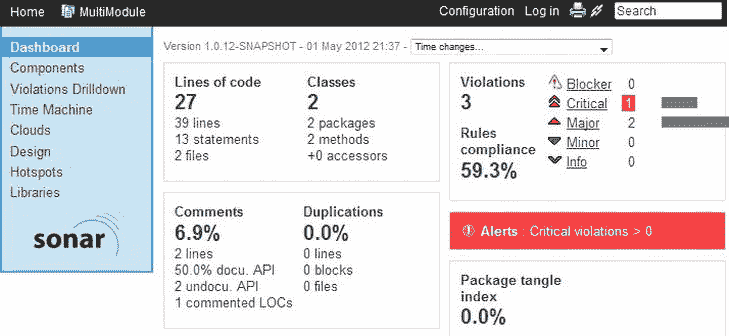

# 四、质量和测试

除非你需要将它投入生产，否则它就是一场游戏。

——奉献波拉特

每个人都在讨论质量，都想提高质量。然而，不定义质量有一个奇妙的效果，那就是允许质量决定一切，包括额外津贴，比如每张桌子上满满一壶咖啡。通过使用测试作为测量质量的工具，许多项目已经经历了极好的结果。本章将讨论质量和测试，并展示它们与 DevOps 的本质关联。

什么是质量？

质量的定义对于给定的上下文是唯一的。Gerald M. Weinberg 说“质量就是符合某人的要求。” [<sup>2</sup>](#Fn2_4) 通常，交付产品的发起人(客户)向团队支付提供软件的费用。事实上，顾客有权提供他或她对质量的个人定义，并决定他或她想花钱买什么。然而，质量究竟是什么？为了将质量带入生活，本章将介绍一些可能的质量属性。让我们从最明显、最传统的属性开始，总结一下人们认为质量可以具备的属性。质量可能具有以下特征:

*   单元测试的扩展测试覆盖范围；覆盖面越大越好。
*   bug 追踪器中的少量条目。
*   bug 追踪器中的少量条目具有特定的条目优先级。
*   最小化偶然复杂性，这种复杂性不是要解决的任务所固有的(而固有复杂性对于解决特定任务是必不可少的)。
*   符合使用 Checkstyle、 [<sup>3</sup>](#Fn3_4) 、 [<sup>4</sup>](#Fn4_4) 或 FindBugs 度量的定义的度量。 [<sup>5</sup>](#Fn5_4)
*   符合系统运行时质量，包括功能、性能、安全性、可用性、弹性、可用性和互操作性。
*   符合系统非运行时质量，包括可修改性、可移植性、可重用性和可测试性。
*   优秀的软件稳定性和容量。
*   全队随时免费咖啡。

此外，还有更微妙的质量属性，例如:

*   良好的业务质量，包括成本、进度、适销性和对组织的适当性。
*   良好的整体周期时间，如第 3 章中所述。

定义:能力和复原力

对于给定的工作负载，系统在保持每个事务的可接受响应时间的同时可以维持的最大吞吐量是其容量 (Michael T. Nygard，*发布它！【T2《务实的程序员》，2007 年，第 152 页)。*

弹性是一个系统在变化和干扰之前、之中或之后调整其功能的内在能力，以便它能够在预期和意外条件下维持所需的操作。(Hollnagel 等人，*实践中的弹性工程*，阿什盖特出版社，2011 年，第三十六页)

正如这几个例子所示，质量可以有许多不同的含义。现在让我们将质量属性分为主导属性和支持属性。

主导和支持属性

有趣的是，那些声称质量的所有方面都很重要的人——比如良好的测试覆盖率或应用程序的稳定性——是正确的。然而，我刚刚提供的列表中的第一个例子是支持属性，最后一个例子，我以一种略带挑衅的方式标记为“微妙的”，是主要的(即必要的)属性，即业务质量和周期时间。支持属性在特定的上下文中也是有帮助的，尽管像“bug tracker 中的条目数”这样的属性没有意义，并且可以很容易地操作，正如在第 3 章中所讨论的。对于 DevOps 方法，我们更感兴趣的是对开发和运维都有意义的全面、客观、可衡量的价值。开发和运维可以整合这些领先的质量属性并与之保持一致。这些属性是更好的合作和共同目标的载体。

可测量的属性

对于所有可能的质量属性来说，有一点显然是正确的:要知道某个特定的质量是否已经达到(或没有达到)，必须对其进行度量。一旦有了测量值，就可以对其进行基准测试，并尝试提高它。

“系统思维”理论的支持者将会抗议，因为他们认为系统由无数的相互依赖组成，这就产生了处理混乱和复杂性的需要。在混沌理论的场景中，多回路、非线性反馈系统会产生混沌行为。 [<sup>6</sup>](#Fn6_4) 然而，放弃持续改进的奋斗，明确处理质量是混乱的第一步。我们在 DevOps 中还看到质量属性相互影响。例如，如果应用程序不稳定，其成本和可销售性也会受到影响。

上下文的可靠性

除了质量属性的相互依赖性之外，质量很大程度上依赖于环境。我举一个例子:应用的稳定性是基于各种因素的，比如用户用应用做什么，有多少用户执行这个功能。决策直接影响质量，支持一种质量的决策通常会影响另一种质量。质量必须放在环境中，通常情况下，最好的解决方案是一个折衷方案，是对不同的质量属性进行优先排序。专门的团队(比如开发和操作)可能对质量属性有其他的优先权，或者可能不想处理来自其他团队的属性。因此，为了获得最佳的整体解决方案，团队必须以整体的方式定义质量，跨越所有的项目角色和阶段。领先属性是全面定义质量的最佳候选，因为它们具有整体宏观焦点，而不是微观焦点。

再说一次，我不打算让任何支持属性看起来很小。他们的支持角色可以提供关于软件的重要见解。软件必须服从它们各自的质量目标值，这是必要条件，但匹配这些值并不是充分条件。让我举两个例子:

*   尽管 Checkstyle、PMD、FindBugs 和 Sonar(作为您的持续构建的一部分运行)可以检测设计和代码缺陷，但代码可能不是一个好的发布候选(可能是因为它没有实现所有的功能需求)。然而，如果您的持续构建中的审计检测到任何设计和代码缺陷，那么该应用程序就不是发布候选。
*   尽管应用程序通过了所有的测试，但它可能不是一个好的发布候选(可能是因为其他的质量属性没有满足)。如果一个测试失败了，这个应用程序就不是发布候选。

 **注**声纳([http://www.sonarsource.org/](http://www.sonarsource.org/))是一种连续检查的工具。它可以检查用许多不同语言编写的应用程序，包括 Java、Cobol、PHP 和 C++。对于 Java，Sonar 确实集成了检查 Java 应用程序质量的工具，包括 Checkstyle([http://checkstyle.sourceforge.net/](http://checkstyle.sourceforge.net/))、PMD([http://pmd.sourceforge.net](http://pmd.sourceforge.net))和 FindBugs([http://findbugs.sourceforge.net/](http://findbugs.sourceforge.net/))。也有许多检查基础设施的工具。对于基础设施的样式检查(检查木偶清单是否符合样式指南)，可以使用木偶皮棉，参见[https://github.com/rodjek/puppet-lint](https://github.com/rodjek/puppet-lint)。

质量的关键方面

现在让我们总结一下关于质量的关键发现。在定义质量时，必须执行以下任务:

*   定义在你的环境中什么是质量。
*   根据将质量放入上下文的场景来描述质量。
*   区分支持性和领先性质量属性。
*   理解属性之间的依赖关系。
*   强调对成功至关重要的属性。
*   将质量构建到您的过程中，跨越软件工程的所有活动，包括开发和操作。

最终，质量归结于软件在生产中的行为和周期时间。

 **注**别忘了:在你的申请中注入质量，事后，是行不通的！

虽然主观的质量评估可能有用，但是客观的质量测量应该是首选。因此，区分质量的必要条件和充分条件，并承认质量是一个整体目标，必须在团队间共享。

既然我们知道什么是质量，我们现在可以讨论如何提高质量。

提高质量的模式

定义质量是一个很好的开始。但是我们想不断提高质量。在这一节中，我将向您展示一些提高质量的模式。

让我们列出一些提高所有团队质量的模式。我们将从区分内部质量和外部质量开始。

内部和外部质量

要理解和衡量质量，必须区分内在质量和外在质量。*内部质量* 是设计和代码的质量。 [<sup>7</sup>](#Fn7_4) 内部质量可以通过应用良好的设计 [<sup>8</sup>](#Fn8_4) 和编码 [<sup>9</sup>](#Fn9_4) 实践以及可持续的开发和交付过程来提高。*外部质量* 由您在使用应用程序时看到的内容来衡量。即使外在质量很棒(所有功能都有)，内在质量也可能很差(糟糕的代码和不可维护的代码)。在内部质量差的情况下，外部质量最终也会受到影响，因为应用程序会产生越来越多的错误。此外，由于技术债务的增加，开发时间也会增加。

使用场景来描述质量

将质量构建到流程中的一个好方法是根据如下场景描述质量属性:如果十个用户发起注销操作，注销组件将在正常情况下以平均一秒的延迟处理请求。这个场景允许团队对系统进行可量化的论证。在 DevOps 中，重要的是识别连接并看到对整个系统的影响。场景对于管理给定的复杂结构及其与其他结构的连接非常有用。例如，如果开发人员更改了应用程序的客户端-服务器连接的核心部分，这必须在目标系统上进行彻底的测试，不仅由开发人员，而且由操作人员进行测试。尽管开发桌面可能(希望)在许多方面与生产系统相似，但不会完全相同，尤其是在进程和线程领域，它们基本上受客户机-服务器连接变化的影响。场景描述包括刺激源(例如，用户)、实际刺激(例如，启动的事务)、受影响的工件(例如，注销组件)、其存在的环境(例如，正常操作)、动作的效果(例如，处理的事务)、以及响应度量(例如，在一秒内)。只有在确定了相关需求并提出了组成部分的概念后，才可能编写如此详细的陈述。在[Table 4–1 中显示了一个更详细的应用可用性场景示例。](#Tab1) [<sup>10</sup>](#Fn10_4)

[表 4–1](#_Tab1)。可用性场景

| 场景项目 | 可能的值 |
| --- | --- |
| 来源 | 系统内部；系统外部 |
| 刺激 | 故障:遗漏、崩溃、时机、响应 |
| 假象 | 系统的处理器、通信信道、持久存储、进程 |
| 环境 | 正常操作；降级模式(即更少的功能，后备解决方案) |
| 反应 | 系统应检测事件并执行以下一项或多项操作:记录事件；通知相关方，包括用户和其他系统；根据定义的规则禁用导致故障或失败的事件源；在预先指定的时间间隔内不可用，时间间隔取决于系统的关键程度；继续以正常或降级模式运行 |
| 响应措施 | 系统必须可用的时间间隔；可用时间；系统可以处于降级模式的时间间隔；修复时间 |

既然我们理解了质量场景，让我们来发现质量是一个固有的部分。

质量是一个固有的部分

软件工程的质量在任何时候都是重要的，从最开始直到应用程序运行并在产品中维护。质量不能事后注入到应用程序中。例如，如果一个应用程序不是为高性能而设计和开发的，它就很难在生产中作为高性能应用程序运行。此外，仅仅在局部范围内进行改进是不够的，或者通过微调单个软件单元来期望任何大的质量改进也是不够的。正如 W. Edwards Deming 在他的书《走出危机》(麻省理工学院出版社，2010 年)中所说，“任何实质性的改进都必须来自对系统的行动”(第 7 页)，“质量不是来自检查，而是来自生产过程的改进”(第 29 页)。戴明提出了 14 点全面改进的方法(第 23 页)，包括将质量放在产品的首位，持续不断地改进生产和服务系统，进行在职培训，消除恐惧，消除目标管理，打破部门间的壁垒。

质量保证和使质量可见

QA 由整个团队执行，包括开发和运维。只有当您能够控制应用程序时，您才能确保该应用程序的质量。如果你没有权限更改应用程序，你就不能保证它的质量。你当然可以对它进行评估，并将结果报告给其他人。但是，只有当您可以改变解决方案(及其部分应用程序、中间件和基础设施)，从而将开发和运维结合在一起时，才能实现真正的整体 QA。

使用 DevOps，质量是方法的固有部分。QA 不是一个明确的下游活动，而是由整个团队(尤其是开发和运维团队)随时完成。在我们之前的高性能应用程序示例中，DevOps 建议开发和运维部门紧密合作，共同开发高性能应用程序并将其投入生产。

通过应用“持续集成”[<sup>11</sup>](#Fn11_4)(简而言之，团队中的共享协议，即当团队从代码库中获得最新的代码时，它将总是成功地构建并通过所有测试，前提是团队每隔几个小时签入他们的代码 [<sup>12</sup>](#Fn12_4) )和“持续交付” [<sup>13</sup>](#Fn13_4) (简而言之，通过交付管道从开发中持续地阶段化软件一个重要的观察结果是，我们越接近生产(运维)，质量就越有动力。这样做的主要原因是，它通常不是您希望投入生产的软件。你生产的是具有实际质量的*真正的*软件。在愿望和现实之间，或者换句话说，在开发中的软件的概念和版本的结果和在真实的生产机器上运行的相同软件的结果之间，可能有很大的差异。生产中的部署和运行结束了*对完成*的定义。将软件投入生产是当你看到你已经准确地完成工作的时候。从这两个角度来看，在生产中运行的软件是无可替代的，可以获得商业价值并获得关于质量的有意义的(技术)洞察力。

退化:故障和失效

久而久之，如果不重视软件的质量，软件就有可能退化。例如，如果太多的版本被推向生产，应用程序具有次优的内部质量，并且更多即将到来的需求应该在软件中实现，就会发生退化。其他更糟糕的场景包括没有经过测试的自动化，以及在软件容易出错时将其打包并部署到生产环境中；监控不到位；或者非功能性需求没有被相应地实现(例如，因为没有足够早地咨询操作团队)。高速发布，加上高比例的技术债务，导致退化，这是有后果的。特别是，过程开始时的质量退化会对整个过程产生负面影响，并产生自我强化的结果(即质量退化可能会导致更多的质量退化)。因此，您必须从流程的一开始就关注所有的质量属性。这一点可能是显而易见的，但许多团队未能坚持这一原则。将质量注入软件的事后分析是行不通的。

将质量视为固有部分将减少故障的数量和影响。根据 Weinberg 的说法，“错误是程序中的缺陷，当在特定条件下执行时，会导致失败。”他进一步将失败定义为“程序运行的外部结果与需求的背离。” [<sup>14</sup>](#Fn14_4) 显然，内在质量会通过早期识别、隔离和解决缺陷并保持内在质量来减少故障数量。但是 DevOps 方法也减少了故障的影响，即失败。这是通过将您的工作与 DevOps 的“积木”结合起来实现的，devo PS 在第 3 章中有介绍。

因为质量属性必须从一开始就被关注，所以您必须解决处理质量的挑战，这是传统上检测到的，或者对于交付链的后续步骤中的项目角色是重要的。例如，尽管应用程序的稳定性对于操作来说可能是至关重要的，但是这种稳定性必须在之前的开发阶段就构建到应用程序中。质量属性必须从一开始就是软件开发和交付过程的固有部分。质量属性可以从一开始就通过将工作与项目角色而不是工件联系起来来实现。开发和运维对世界和他们周围的项目角色有不同的看法。每个部门都会做正确的事情，但是他们的自身利益不一定符合整个公司的最佳利益。

测试自动化组合

在软件交付过程中，你应该尽可能早地发现缺陷和错误。自动化测试为软件的状态和质量提供了快速和持续的反馈。自动化测试提供了一个安全网，可以在不破坏现有特性的情况下，添加新特性和合并错误修复。整个团队负责测试自动化(包括开发和操作)。

重要的是要明白，尽管使用自动化测试是至关重要的，但并非所有的测试都可以自动化，例如可用性测试、探索性测试或一次性测试 [<sup>15</sup>](#Fn15_4) 。

测试自动化组合包括单元测试、服务测试和 UI 测试，参见测试自动化金字塔 [<sup>16</sup>](#Fn16_4) ( [图 4–1](#Fig1))。尽管您应该使用所有这三类测试，但是您的测试策略的基础应该由单元测试构成，这一点我们将在接下来探讨。


[图 4–1](#_Fig1)。*测试金字塔:基础是单元测试的广泛基础。服务测试基于单元测试。用户界面(UI)测试是金字塔的顶端。*

单元测试

自动化测试的基础应该是彻底的单元测试覆盖。

单元测试将测试单个单元，通常在一个类中。不依赖于其他资源(例如，数据库)、其他子系统或其他组件(包括类的集合)。xUnit 工具家族是单元测试代码事实上的标准。您可以在开发人员工作区和构建服务器上的中央集成环境中运行单元测试。集成测试连接不同的单元，并且经常访问数据库和其他(远程)系统。这些服务测试运行的时间比单元测试长，应该只在生成服务器上触发。在金字塔的顶端，用户界面(UI)测试触发图形控件并驱动 UI。它们也可以通过使用足够的驱动程序来实现自动化。探索性测试是应该由人来执行的 UI 测试的一个例子。

测试配置管理仍然不常见，尽管它有很大的潜力。有许多方法可以在操作中测试声明性系统，以验证系统的行为。一种将基础设施的行为表达为代码的强大方法是 Cucumber-puppet。 [<sup>17</sup>](#Fn17_4) Cucumber 是一个应用 BDD 的框架，Cucumber-puppet 和 rspec-puppet [<sup>18</sup>](#Fn18_4) 允许你测试 puppet 清单。

测试驱动开发这样的实践建议首先编写测试，在小的迭代中编写功能和测试代码，同时进行重构以改进代码设计。广泛的单元测试选择对于快速的反馈周期和提高代码的质量，尤其是它的设计，是必不可少的。方法可以在单元测试期间模拟(“模仿”)其他组件和子系统。

服务测试

服务和组件层包括不同的单元。这些集成测试连接多个组件，并在不接触 UI 的情况下测试整个系统。白盒测试类似于单元测试和服务或组件测试。也就是说，他们测试特定的测试是如何通过的。驱动集成测试的一个强大工具是 Arquillian 。Arquillian 的任务是提供一个测试工具，将测试逻辑从容器生命周期和部署细节中分离出来，这样团队就可以轻松地设置集成测试。 [<sup>20</sup>](#Fn20_4) 那些测试是从它们运行的环境中抽象出来的。因为 Arquillian 既可以在容器内部执行测试用例，也可以阻止测试类，所以它可以充当已部署代码的远程客户端。

用户界面测试

UI 测试本质上是测试应用程序、中间件和基础设施。UI 测试也很重要，但是它只包含了整个测试策略的一小部分。UI 测试是黑盒测试:它们回答某些问题(例如，“什么是特定的任务？”)并由此测试应用程序是否执行其定义的行为。用户界面及其控件、控件顺序和布局可能会随着时间的推移而发生显著变化。此外，UI 测试必须以类似于维护业务代码的方式来维护。为了减少工作量和减少假阳性，测试应该简单和可靠。因为 UI 测试很脆弱，编写起来很昂贵，而且很耗时，所以您应该将测试从 UI 中分离出来。例如，不要测试单击 submit 按钮是否会在数据库中创建一个新条目。相反，引入一个完整的单元测试库，并将服务测试(即那些通过单击 UI 上的按钮来调用的服务)设置在最上面。在 UI 测试中，您应该将 UI 测试从上下文中分离出来。例如，要标识 UI 上的控件，应该使用相对路径，例如 XPath 表达式或 HTML 的“name”属性。

为 UI 测试找到一个大的价值-努力比率的测试覆盖率。例如，在应用程序的新版本被部署到目标环境之后，设置自动运行的冒烟测试可能就足够了。正如在第 3 章中所讨论的，冒烟测试给了应用程序一个快速的镜头，开始检查应用程序是否可用，以及用户是否可以导航通过快乐的路径(主要场景)。您可能只希望测试重要用例的相关子集，而不是测试 UI 上的所有用例。然而，您可以在 UI 上测试所有用例，这样做可能是给定上下文的最佳解决方案。

UI 测试通常连接外部子系统，包括网络服务、数据库、文件系统访问等等。因此，UI 测试测试最重要的事情:应用程序如何工作。詹姆斯·惠特克(James Whittaker)、杰森·阿邦(Jason Arbon)和杰夫·卡罗洛(Jeff Carollo)区分不同的测试规模，介绍了小型、中型和大型测试 [<sup>21</sup>](#Fn21_4) 。UI 测试是具有广泛范围的大型测试(意味着当测试失败时，原因可能很难找到)。大型测试通常会使设置测试数据变得困难和耗时。

使用 web UI 测试的一个强有力的例子是 Selenium 2 (WebDriver)的使用。 [<sup>22</sup>](#Fn22_4) Selenium 有不同的运行模式，您可以在驾驶真实的互联网浏览器测试您的应用程序和模拟浏览器之间进行选择。前者在真实条件下验证应用程序的行为，而后者允许 UI 测试以快速的反馈周期运行。UI 测试通常被认为是最终用户验收测试。良好的接受应该是数据驱动的，并以可执行规范的形式用一种无处不在的语言编写。这种方法通常被称为“实例规范”，我们将在第 10 章的[中讨论。](10.html)

测试策略中的错误

测试策略中的一个常见错误是没有从金字塔的基础开始测试。例如，一个常见的反模式跳过单元测试甚至服务测试，只设置和运行 UI 测试 [<sup>23</sup>](#Fn23_4) 。使用 UI 测试来测试软件及其所有部分(应用程序、中间件、基础设施)的想法很吸引人。但是也要考虑缺点。由于过分强调自动 UI 测试，出现了以下问题:

*   获得反馈需要太多的时间，尤其是修复 bug。
*   隔离 bug 变得更加困难。
*   整个应用程序的内在质量会受到影响，因为单元没有被测试覆盖。
*   设计受到影响，因为测试有助于改进软件的设计。

 **注**有时区分测试和检查是恰当的。迈克·伯顿将检查的范围限制在观察和决策规则，这些规则可以在没有智慧的情况下执行——没有大脑参与的人类。如果什么事情需要人类的智慧，那就是测试，而不是检查(见[http://www . develop sense . com/2009/09/elements-of-testing-and-checking . html](http://www.developsense.com/2009/09/elements-of-testing-and-checking.html))。

另一个常见的错误是将测试范围扩大到应用程序代码。UI 测试的一个优点是，它们跨所有架构层和边界使用代码，比如应用程序、中间件和基础设施。但是您应该如何进行单元测试和服务测试呢？不要仅仅将它们应用于应用程序本身。相反，单元测试基础设施(例如，通过 rspec-puppet)或通过不断发展的监控的基础设施服务。

验收标准

当使用像 Scrum 这样的敏捷过程框架时，将好的验收标准包含到你的产品待办事项中是很重要的。验收标准定义了需要完成的内容，这样故事就可以被标记为完成。好的验收标准定义了你什么时候完成(“完成的定义”)。根据 Ken Schwaber 和 Jeff Sutherland 的说法，“backlog 是产品中可能需要的所有东西的有序列表，并且是对产品进行任何更改的需求的单一来源。” [<sup>25</sup>](#Fn25_4) 关于如何处理积压工作的一般建议，参见米奇·莱西的《Scrum 领域指南*(Addison-Wesley，2012)第 29 章。更多验收测试将在第 10 章中讨论。*

 *测试方面是你的待办事项中至关重要的部分。你应该总是通过定义一个测试用例来确保可测试的故事。在为您的 backlog 评估用户故事时，您也应该评估测试工作。

注入质量门

检查质量是否准确的方法有很多。使用 Scrum，策略包括 done 的定义以及与 done 的定义的一致性，或者迭代完成后迭代结果的展示。虽然 QA 应该由整个团队在开发过程中的任何时候完成，但是拥有质量关口是有价值的。质量关是交付过程中的一个里程碑，在这里检查特殊的质量要求。如果满足了需求，软件可以进一步进入生产阶段，直到它投入生产并可供用户使用。最理想的情况是，质量关可以自动关闭，以最大限度地提高流量，并最大限度地减少繁琐的手动操作。但是，有不同的语境。一些项目通过不引入质量关获得了好的结果。这些结果表明，任何类型的质量关都是潜在的瓶颈，会阻碍向客户交付特性。

质量关的典型使用案例包括:

*   如果签入的代码导致测试失败，则连续构建会失败。
*   如果新代码的测试覆盖率不能满足覆盖率目标，那么连续构建就会失败。
*   如果 Checkstyle、PMD 或 FindBugs 检测到设计或代码流有严重的“错误”，那么连续构建就会失败
*   如果 Sonar 发出“警报”，自动 QA 构建就会失败。
*   如果自动验收测试失败，QA 构建就会失败。
*   如果应用程序仍然依赖于仍在开发中的组件(因此还没有在特定版本中发布)，那么发布版本就会失败。
*   如果 BDD 测试无法检查基础设施的行为，那么生产的推广就会失败。
*   如果对基础设施代码的签入引发了构建错误，任何进一步的部署都将停止。
*   如果项目的咖啡仓库用完了，软件开发就停止了。

现在让我们更深入地看看质量关的一个具体例子。

质量关的示例

现在让我们更仔细地检查一下质量关是什么样子的。考虑以下开源工具的基础设施。我们有以下内容:

*   基于 Maven 的构建。 [<sup>26</sup>](#Fn26_4)
*   基于 Jenkins 的持续集成基础架构。
*   名为 Sonar 的连续检查工具。

在 Sonar 中，我们配置了 build-breaker 插件 [<sup>27</sup>](#Fn27_4) 和一个验证编码规则的概要文件。一个编码规则通过将这样的 bug 定义为具有“严重”严重性的 bug 来检查“空 catch 块”。在 Sonar 中，我们还配置了一个“警报”,如果严重违规的数量大于 0，就会激活该警报。如果发出警报，基础构建将会失败。

 **注意**詹金斯([http://jenkins-ci.org/](http://jenkins-ci.org/))是一个持续集成服务器，可以构建和部署你的应用。对于 Java 来说，有很多构建工具可以编译、测试、打包和部署你的应用，包括 Maven([http://maven.apache.org/](http://maven.apache.org/))、Gradle([http://www.gradle.org/](http://www.gradle.org/))和 Ant([http://ant.apache.org/](http://ant.apache.org/))。

在工作区中，开发的代码有一个空的 catch 块(参见[清单 4–1](#list1))。

***[清单 4-1。](#_list1)*** *带有空 catch 块的 Java try 子句。*

```
try {
if (integer1 == integer2) {
          System.out.println("..");
    }
} catch (Throwable t) {}
```

在代码被检入版本控制之后，比如 Subversion 或 Git，我们的持续集成引擎(Jenkins)检测到变更并开始持续构建(当我们讨论自动发布时，我们将在第 8 章中更详细地探索策略和工具链)。在对这些类进行编译和单元测试之后，用 Sonar 对代码进行验证。

 **注**颠覆(【http://subversion.apache.org/】)和([【http://git-scm.com/】](http://git-scm.com/))是版本控制系统。有关更多信息，请参考相应的文档。

声纳检测质量门(定义为“警报”)是否失败。结果，由于空捕捉块，声纳失败的詹金斯建立。[清单 4–2](#list2)显示了 Jenkins 控制台日志中的相关示例错误代码。

***[清单 4-2。](#_list2)*** *带有空 catch 块的 Java try 子句。*

```
[ERROR] Critical violations  >  0
[INFO] ------------------------------------------------------------------------
[INFO] Reactor Summary:
[INFO]
[INFO] RocketScience ..................................... FAILURE [45.599s]
[INFO] moduleA ........................................... SUCCESS [3.650s]
[INFO] moduleB ........................................... SUCCESS [2.714s]
[INFO] ------------------------------------------------------------------------
[INFO] BUILD FAILURE
[INFO] ------------------------------------------------------------------------
[INFO] Total time: 46.285s
[INFO] Finished at: Sun Jan 01 16:04:45 CET 2012
[INFO] Final Memory: 14M/44M
[INFO] ------------------------------------------------------------------------
[ERROR] Failed to execute goal org.codehaus.mojo:sonar-maven-plugin:2.0:sonar (default-cli) on project multi-module: Cannot execute Sonar: Alert thresholds have been hit (1 times). -  >  [Help 1]
```

导航到 Sonar web UI，我们将更详细地检查违规和不合格质量关的数量。在我们的示例中，严重警报的数量为 1，如[Figure 4–2 所示。](#Fig2)



[图 4–2](#_Fig2)。*声纳仪表板显示不同的指标，包括“警报”我们已经将系统配置为如果严重违规的数量大于 0* ，构建就会失败。

如您所见，Maven、Jenkins 和 Sonar 的工具链足够灵活，可以设置强大的质量关卡。如果没有达到定义的质量标准，构建服务器 Jenkins 可能会使构建失败。如果通过了质量关，就可以在升级软件的过程中触发进一步的下游作业，直到软件投入生产。质量门的这些用途不仅限于用 Java 编写的功能性代码，更确切地说，质量门也可以作为代码和验收测试用于基础设施。你也可以设置你的构建服务器来监听你的基础设施的变化(见第九章第一节)或者你的规范(见第十章第三节 T2)。因此，这种方法是一种高级策略，旨在将开发与运维联系起来。

结论

在这一章中，我们讨论了质量。我们区分了质量的主导属性和支持属性。所有的属性都是有帮助的和重要的，但是顾客最终决定他或她的优先权以及他或她想要为哪些属性付费。 [<sup>28</sup>](#Fn28_4) DevOps 偏好整体的、领先的质量属性，尤其是周期时间。您了解了衡量和改进质量的不同策略。质量应该是流程的固有部分。您应该总是考虑测试自动化组合和质量关口。

[<sup>1</sup>](#_Fn1_4)【http://twitter.com/devops_borat/status/192271992253190144】T4。

[<sup>2</sup>](#_Fn2_4) *质量软件管理*，第 1 卷(多塞特出版社，1992)，第 5 页。

[<sup>3</sup>](#_Fn3_4)【http://checkstyle.sourceforge.net】T4。

[<sup>4</sup>](#_Fn4_4)【http://pmd.sourceforge.net】T4。

[<sup>5</sup>](#_Fn5_4)【http://findbugs.sourceforge.net】T4。

[<sup>6</sup>](#_Fn6_4) 欲了解更多详情，请咨询贾姆希德·加拉杰达吉，*系统思维:管理混乱和复杂性*(摩根·考夫曼，2011)。

[<sup>7</sup>](#_Fn7_4) 提醒:如果我们谈论“代码”，我们指的是组成解决方案的所有类型的代码，包括应用程序代码、基础设施代码和自动化脚本。

[<sup>8</sup>](#_Fn8_4) 参见 Erich Gamma 等人的*设计模式* (Addison-Wesley，1994)。

[<sup>9</sup>](#_Fn9_4) 参见罗伯特·c·马丁，*《清洁守则》*(普伦蒂斯霍尔，2008)。

[<sup>10</sup>](#_Fn10_4) 参见 Len Bass，Paul Clements，和 Rick Kazman，*软件架构实践* (Addison-Wesley，2003)，第 81 页。

[<sup>11</sup>](#_Fn11_4) 参见保罗·m·杜瓦尔等人，*(艾迪森-卫斯理，2007)。*

 *[<sup>12</sup>](#_Fn12_4) 参见雷切尔·戴维斯、利兹·赛特笠、*敏捷教练*(实用主义书架，2009)。

[<sup>13</sup>](#_Fn13_4) 参见杰兹谦逊、大卫·法利、*连续交付*(艾迪森-卫斯理，2011)。

[<sup>14</sup>](#_Fn14_4) *【质量软件管理】*，第 2 卷(多塞特出版社，1993)，第 237 页。

[<sup>15</sup>](#_Fn15_4) 更多信息，参见丽莎·克里斯平和珍妮特·格雷戈里，*敏捷测试*(艾迪森-卫斯理，2009)，第 285 页。

[<sup>16</sup>](#_Fn16_4) 参见迈克·科恩，*用敏捷取得成功*(艾迪森-卫斯理，2010)，第 312 页。

[<sup>17</sup>](#_Fn17_4)【https://github.com/nistude/cucumber-puppet】T4。

[<sup>【18】</sup>](#_Fn18_4)[【https://github . com/rodjek/rspec 瞳孔】](https://github.com/rodjek/rspec-puppet)

[<sup>19</sup>](#_Fn19_4) 详见肯特·贝克、*(Addison-Wesley，2003)。*

 *[<sup>20</sup>](#_Fn20_4)【http://www.jboss.org/arquillian】T4。

[<sup>21</sup>](#_Fn21_4) 参见*谷歌如何测试软件* (Addison-Wesley，2012)，第 46 页。

[<sup>22</sup>](#_Fn22_4)【http://seleniumhq.org】。

[<sup>23</sup>](#_Fn23_4) 有些项目甚至不运行 UI 测试。如果你没有运行单元、服务或者 UI 测试作为你的自动构建过程的一部分，那么你就有一个严重的问题。

[<sup>24</sup>](#_Fn24_4) Scrum 是一个抽象的管理框架，免费的 Scrum 初级读本可以在 http://scrumfoundation.com/library[下载](http://scrumfoundation.com/library)。

[<sup>25</sup>](#_Fn25_4) 参见他们的*软件中的 30 天* (Wiley，2012)，第 129 页。

[<sup>26</sup>](#_Fn26_4) 这些都是例子。您还可以通过集成 Gradle、Hudson 和 Sonar 来开发有效的解决方案。

[<sup>27</sup>](#_Fn27_4) 关于插件的文档可以在【http://docs.codehaus.org/display/SONAR/Build】+断路器[找到。](http://docs.codehaus.org/display/SONAR/Build)

[<sup>28</sup>](#_Fn28_4) 质量要花钱。质量差会花更多的钱。***