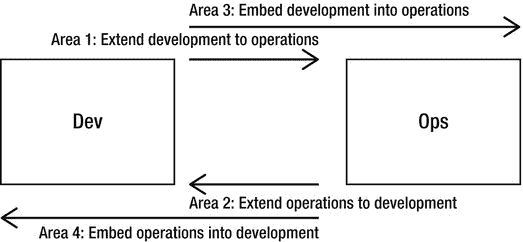
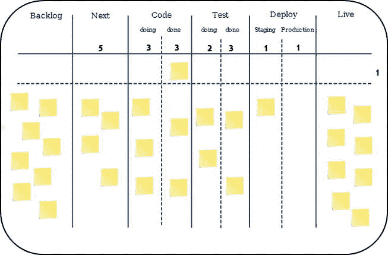
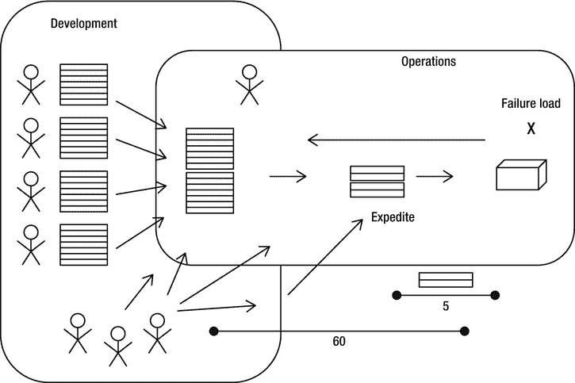
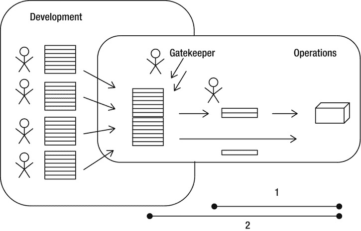

# 六、获得快速反馈

当你发现大多数高级开发者都是机器人时，你会感到震惊。

——奉献波拉特

在这一章中，我将介绍 DevOps 区域矩阵，包括四个不同的区域，以介绍和分类 DevOps:将开发扩展到运维，将运维扩展到开发，将开发嵌入运维，将运维嵌入开发。对于每个领域，我将提供进一步的细节和例子。您还将了解到看板，一种增量改变底层过程的方法，在应用 DevOps 时会很有用。最后，我将提供一个具体的用例，将 DevOps 矩阵的所有四个领域结合在一起，并将它们与看板结合起来。现在开始讨论 DevOps 面积矩阵。

DevOps 面积矩阵

Patrick Debois 建议将 DevOps 划分为四个不同的重叠区域，如下[【2】](#Fn2)([图 6-1](#Fig1) ):

[**图 6-1**](#_Fig1) 。*包含四个不同区域的区域矩阵显示了如何集成开发和运维。*

*   *区域 1:将开发扩展到运维* 。在这个领域，开发和运维部门在任何与将项目成果交付给生产相关的事情上进行协作。
*   *区域 2:将运维扩展到开发* 。这个领域的重点是协作，即从运维到开发(项目)的信息流。
*   *领域 3:将开发嵌入运维* 。该领域重点关注开发部门对最初位于生产环境中(或由运维部门负责)的项目的参与。
*   *领域 4:将运维嵌入开发* 。这最后一个领域以整体的方式处理操作部门在开发过程中的参与。

为了促进知识交流和快速反馈，每个领域都强调双向互动(即从开发到运维，反之亦然)。实际上，有些领域是重叠的。

区分区域有助于将 DevOps 引入到组织和项目中，并形成共同的理解。所有四个领域都涵盖了在第 1 章中介绍的三个基本视图(度量和测量视图、过程视图和技术视图)，尽管过程视图是最主要的，也是本章的重点。

DevOps 区域矩阵的方法说明了开发和运维部门经常使用他们自己的内部流程和微优化解决方案的事实。开发通常被组织为“项目”的一部分，其目标是在给定的时间内(根据定义的里程碑)，用可用的人力以定义的质量交付定义的内容(范围)。运维团队的项目和活动应该相互协调。

在介绍 DevOps 时，您不必同时涵盖所有领域。在每个领域采取行动将会改善开发和运维之间的协作。

基于这些方面，您可以为 DevOps 定义模式。有关 DevOps 模式的更多信息，Patrick DeBois 等人的书是一个很好的资源。 [3](#Fn3)

现在让我们更详细地探讨这四个方面。对于所有领域，我将提供一个表格，列出一个公共反模式、一个实践和这个实践的目标。我将为每个领域提供的示例性实践解决了示例性反模式。让我们从探索 1 区开始。

将开发扩展到运维

将开发扩展到运维包括以更全面的方式解释软件开发的行动，通过尽早应用与生产相关的项目，并且经常作为开发过程的一部分(与运维部门进行持续和彻底的合作)。该领域的典型实践使用流程和工具来提供基础设施([表 6-1](#Tab1) )。

[**表 6-1**](#_Tab1) 。*领域 1 涵盖将发展延伸至运维的行动。这一领域的典型实践是使用 Puppet 之类的解决方案从版本化代码中提供环境。*

| "环境是手动配置的，并且与软件版本松散耦合." |  |
| --- | --- |
| **区域 1:将开发扩展到运维** |  |
| 领域 2:将业务扩展到发展 |  |
| 领域 3:将开发嵌入到运维中 |  |
| 领域 4:将运维嵌入开发 |  |
| **练习** | 使用 Puppet 之类的工具从版本化代码中提供环境。 |  |
| **目标** | 通过自动化实现快速反馈。 |  |
| 代码和工具的重用。 |  |
|  |  |
|  | 交付流程和供应的可靠性。 |  |
|  |  |  |

第 9 章更详细地讨论了将基础设施的目标行为表达为代码的想法(例如，哪个包必须安装在特定的机器上，或者哪个技术用户必须可用)。这个基础设施代码可以像管理应用程序代码一样进行管理(例如，通过将代码置于版本控制中，并在代码上应用持续集成，以及其他实践)。

这种方法的目标是避免手动配置环境。相反，借助 DevOps，可以自动调配环境。基础设施工件也是软件发布的一部分，因此必须放在基线上(参见第 8 章)。作为一个软件版本，它们应该被放在版本控制中。这样做不仅通过自动化和代码及工具的重用促进了快速反馈，而且提高了交付过程的可靠性。

用于将开发扩展到生产的另一个常见机制是将开发过程扩展到操作。这种机制的一个例子是使用看板来跟踪开发和运维工作。我们将在本章后面的用例中探索这个概念。

现在让我们讨论将操作扩展到项目的第二个方面。

将运维扩展到开发

第二个领域包括将业务扩展到发展的行动。这个区域类似于区域 1，但是在这里，收敛从操作开始。在这个领域，一旦应用程序被部署到目标系统，开发人员通常对应用程序的行为没有任何洞察力。

[表 6-2](#_Tab2) 。领域 2 包括将业务扩展到发展的行动。典型的实践与开发共享监控和生产度量。

| "开发人员不了解产品中应用程序的运行时行为." |
| --- |
| 领域 1:将开发扩展到运维 |
| **区域 2:将运维扩展至开发** |
| 领域 3:将开发嵌入到运维中 |
| 领域 4:将运维嵌入开发 |
| **练习** | 向开发部门提供监控和日志文件。 |
| **目标** | 共享关于生产状态的信息。 |
| 促进发展。 |
| 支持开发人员跟踪生产事故。 |

Operations 拥有关于运行时行为的信息。实际上，运维部门被大量信息淹没，并将这些信息作为监控计划的一部分进行汇总。然而，如果没有将信息流回开发，开发学习和改进的机会就错过了。

使用 DevOps，监控被提供给开发并与开发集成，如第 3 章中的[所述。监视的一部分是提供度量，日志文件通常被认为是提供关于生产中的应用程序的度量。因此，作为这个领域的一部分，日志文件经常被转移到一个共享文件系统，开发人员可以在那里检查过去的文件。如果开发人员必须修复在运行系统中检测到的错误，这个功能就特别重要。允许开发人员在生产中](03.html)扫描日志文件，这是一个不切实际的(用他们专用的帐户和协议访问远程系统)并且是最被禁止的解决方案。将日志文件连续流式传输到开发中是非常实用的。

下一个领域包括将开发嵌入到运维中的行动。

将开发嵌入到运维中

第三个领域针对将开发嵌入运维的行动([表 6-3](#Tab3) )。这个领域通过将开发(不仅是团队，还有它的活动和目标)嵌入到运维中来塑造跨越开发和运维的过程。

[表 6-3](#_Tab3) 。领域 3 包括将业务扩展到发展的行动。典型的实践与开发共享监控和生产度量。

| "开发提供了新的特性，减少了对非功能需求的关注." |
| --- |
| 领域 1:将开发扩展到运维 |
| 领域 2:将业务扩展到发展 |
| **领域 3:将开发嵌入到运维中** |
| 领域 4:将运维嵌入开发 |
| **练习** | 将稳定和能力作为发展目标。 |
| **目标** | 目标一致，共享激励。 |

如果开发忽略了非功能性需求，因为它的主要目标是交付新的特性，那么整个解决方案将是次优的。将非功能性需求(例如，稳定性和容量)设定为开发团队的目标将会弥合开发和操作之间的差距。

第 7 章详细讨论了非功能需求。

现在让我们讨论最后一个领域，它涵盖了将操作嵌入到开发中的操作。

将运维嵌入开发

第四个也是最后一个领域讨论了将操作嵌入到开发中的行为。在这里，运维团队是开发团队的一部分。两个团队紧密合作，尽可能提供最佳解决方案。运维团队就开发中的解决方案进行咨询并给出反馈。目标是使开发团队能够快速获得关于可行性的反馈，并尽早和经常地在团队间分享知识([表 6-4](#Tab4) )。

[**表 6-4**](#_Tab4) 。*领域 4 涵盖将运维嵌入发展的行动。典型的例子包括将运维团队添加到开发中，以提供关于可行性的反馈。*

| “当第一次将软件交付生产时，人们发现需要更大的机器来托管软件。” |
| --- |
| 领域 1:将开发扩展到运维 |
| 领域 2:将业务扩展到发展 |
| 领域 3:将开发嵌入到运维中 |
| **领域 4:将运维嵌入到开发中** |
| **练习** | 运维部门对正在开发的应用程序的设计提供早期和经常性的反馈。 |
| **目标** | 开发获得关于可行性的反馈。 |
| 分享知识。 |

这个领域的一个常见实践在开发过程中形成了非功能性需求。事后实现非功能性需求几乎是不可能的，或者成本太高(例如，在软件被设计、编码并交付生产之后)。想想美国国家航空和宇宙航行局航天飞机的发展。托马乔写道，“在 20 世纪 70 年代末，美国宇航局意识到，随着从开发到运维的过渡，需要更强大的计算机。” [4](#Fn4) 这种类型的缩放软件相当糟糕，尤其是当它的必要性被发现得太晚的时候。

现在你已经了解了 DevOps 矩阵的四个方面，我将简要介绍看板。正如我们将看到的，看板是实施DevOps的绝佳选择，有助于解决DevOps矩阵的所有四个方面。

从看板开始

看板方法没有规定一组特定的角色或流程步骤。没有看板软件开发过程或看板项目管理方法这样的东西。看板方法从您拥有的角色和流程开始，并刺激对您的系统进行持续的、渐进的和进化的改变。

组织(或团队)必须同意，持续的、渐进的和进化的变更是进行系统改进并使其坚持下去的方法。彻底的变革可能看起来更有效，但更多的时候，他们失败是因为组织中的阻力和恐惧。看板方法鼓励对你当前的系统进行持续的、渐进的和进化的改变。

当前的组织可能有一些可以接受并值得保留的元素。我们还必须努力驱除恐惧，以促进未来的变革。通过同意尊重当前的角色、职责和职称，我们消除了最初的恐惧。这样做应该能使我们的看板计划获得更广泛的支持。也许展示看板来反对一种替代的、更全面的方法，这种方法会导致头衔、角色、责任的变化，也许彻底消除某些职位会帮助个人实现利益。

看板简介

看板方法提出了一种推出增量和演进变更的方法。看板并没有规定具体的使用方法。

看板受约束理论(TOC) 的影响。[5](#Fn5)TOC 的底子成语比喻一条链条没有比它最弱的一环更强的了。这个习语被移植到管理和软件工程中。整个链条中最薄弱的环节会导致失败或对结果产生不利影响。看板的其他重要影响包括 Kaizen，字面意思是“持续改进” [6](#Fn6)

在看板中，工位接收来自需求的“拉动”。因此，供给是根据实际需求确定的，而不是根据一些理论上的、预测的、非现实的、甚至是学术上的目标需求。

看板系统被用作需求信号，该信号会立即在供应链中传播。该信号可用于确保供应链中的中间库存得到更好的管理。看板是实现我在[第 3 章](03.html)中介绍的积木的一种方法，特别是使用小批量来提高周期时间和质量。

现在让我们通过介绍看板的五个核心属性来进一步描述看板。

五大核心属性

在他的书*看板:你的技术业务的成功进化变化*(蓝洞出版社，2010 年)中，大卫·安德森确定了在看板方法的每个成功实施中观察到的五个核心属性:

*   *Visualize the Workflow*: The workflow of knowledge work is inherently invisible. Visualizing the flow of work and making it visible are core to understanding how work proceeds. Without understanding the workflow, making the right changes is harder. A common way to visualize the workflow is to use a card wall with cards and columns. The columns on the card wall represent the different states or steps in the workflow. (This is presented in the next section and [Figure 6-2](#Fig2).)

    

    [**图 6-2**](#_Fig2) 。*一个带有紧急任务快速通道的看板示例(通道中的一张票处于州代码/完成状态)；设置 WIP 限制。 [11](#Fn11)*

*   *限制在制品*:限制在制品(WIP，通常也称为在制品) 暗示在部分或全部工作流程上实施拉式系统。拉动式系统将成为你的系统持续、渐进和进化变化的主要刺激之一。拉动式系统可以作为看板系统来实现。关键要素是工作流中每个状态下的 WIP 都是有限的，并且如果在本地 WIP 限制内有可用能力，则新工作被“拉入”到新的信息发现活动中。
*   *管理流程*:工作流中每个状态的工作流程应该被监控、测量和报告。通过积极地管理流程，人们可以评估对系统的连续的、增量的和演进的变更对系统有正面的还是负面的影响。
*   *明确流程策略* :在流程的机制明确之前，通常很难或者不可能讨论如何改进它。没有对事物如何工作和工作实际上是如何完成的明确理解，任何对问题的讨论都倾向于情绪化、轶事化和主观化。有了明确的理解，就有可能对问题进行更加理性、实证和客观的讨论。这种讨论更有可能促成对改进建议的共识。流程是一套管理行为的策略。这些政策在管理层的控制之下。
*   *协同改进**:看板方法鼓励持续的、渐进的、持续的变革。如果团队对工作、工作流、过程和风险的理论有共同的理解，他们就更有可能对问题有共同的理解，并提出一致同意的改进措施。*

 *接下来，我们将把你所学到的东西结合起来，为 DevOps 建立一个看板的例子。

DevOps 看板示例

看板是用来实现看板方法的工具。看板板利用磁铁、芯片、彩色垫圈或便利贴作为通过看板系统拉动的工作项目(“信号”)。或者，可以使用软件工具。 [7](#Fn7) 每个单独的工作项目从定义的开始状态移动到结束状态，这些状态被分组到垂直通道。典型的通道(可能的状态)包括 backlog、ready、coding、testing、QA、deploy、done 或 live。卡片可以依赖于其他卡片。 [8](#Fn8) 看板示例如图[图 6-2](#Fig2) 所示。

在这个例子中，我们在左边有 backlog 区域，它由开放的任务和四个垂直通道组成:下一步，编码，测试和部署，随后是在生产中运行的工作项。代码列和测试列都被分为“正在进行”和“完成”两种状态。部署(由运维部门执行)有“准备”和“生产”两种状态。看板卡(即，票证、任务)从左到右，从待办事项到完成(活动状态)流经这些状态。因此，看板会在每个功能流经工作流程时对其进行跟踪，工作流程中的每个步骤都有一列。"所有看板系统的设计都是为了限制在制品，因为在制品越多，流程越慢." [9](#Fn9)

除了垂直通道之外，在我们的例子中，我们有两个水平通道(通常称为“泳道”)用于两种主要类型的服务:*标准服务等级*和*快速服务等级*。每一类服务都有自己的一套政策，包括如何确定项目的优先级，以及如何通过看板系统拉动项目。 [10](#Fn10) WIP 值被设置为一次可以在特定列(特定行)中的最大卡片数量。快速通道的 WIP 为 1(参见第 1 行的数字 1，这是快速通道，在图 6-2 的[活动栏的右侧),使团队能够将紧急物品投入生产。快速通道](#Fig2)是为必须快速上线的高度紧急的项目保留的，从而解决了时间限制和时间目标。如果出现了另一个紧急项目，并且已经达到了规定的 WIP 限制，那么显然不是所有的事情都可以同时完成，当前优先级最高的项目(此时正在快速通道中工作)应该完成，以便向客户交付价值。

如果有空闲容量，开发人员会将卡从积压中取出。“进行中”和“完成中”的 WIP 限制为三个尽管 QA 测试是由整个团队执行的，但是额外的下游测试是在开发将状态设置为“完成”之后执行的此外，对于测试，设置 WIP。在成功通过测试阶段后，票证被流式传输到“部署”这里的第一个阶段是产品化，可能包括将特性引入测试环境，然后是生产。在工作项目成功地进入生产阶段之后，票证被置于“活动”状态，这表示票证已经完成。

在制品应该受到限制，因为过多的在制品会减少周期时间，导致排队(瓶颈)，进而导致延迟和多任务处理。多任务处理 有减少实际工作时间和增加上下文切换时间的负面影响。 [11](#Fn12)

示例使用案例

现在让我们将 DevOps 区域矩阵的所有四个区域(包括看板)放在一起，并通过一个用例使它们更加具体。首先，我将举例说明一个我标记为“无政府主义”的具体设置，以表明这是一种相当混乱的方法。然后，我将展示如何做得更好。

无政府主义的方法

示例用例基于由不同组件团队组成的开发团队(即，拥有不同软件工件集合的团队)。每个组件团队都维护着自己的管理变更(如新特性或错误修复；参见[图 6-3](#Fig3) 。积压工作中的一些项目表达了操作请求。开发团队的工作被组织成一个项目。另一方面，运维由一个人组成，他维护基础设施，负责软件交付，处理来自开发的请求，并处理测试和生产机器上发生的事件。

[**图 6-3**](#_Fig3) 。*开发和运维工作不尽人意。许多特殊事件发生。故障负荷高，周期时间短。*

操作维护工作项目的积压。在规划会议时，团队之间相互同步，并优先处理积压的操作项目。随后，运维部门处理这些任务。然而，工作不断被源于系统维护(日常业务)的新的临时事件以及在上次正式规划会议后重新确定优先级的临时工作项目所中断。WIP 限制没有被严格使用；在示例中，操作同时处理四个项目。同时处理五六项任务是正常现象，而不是例外。一个快速服务类已经存在，但是快速通道和标准通道之间的界限很窄，再加上不断的优先级调整，使得流程变成了一个名不副实的流程。

优先级非常不稳定。操作的新任务由来自开发的许多不同的人传达，包括经理、测试人员和开发人员。从开发的积压到生产的变更平均需要 60 天的时间。加速服务类提供了一条通道，允许在平均五天内将变更投入生产。

新项目是通过系统推出的，而不是拉出来的。上游团队试图推动项目通过快速通道，以便更快完成。

在运维中，无政府主义方法的关键难点包括:

*   大量并行工作正在进行中，并伴随着密集的上下文切换。
*   大量“外部”任务一直打断计划任务。
*   由于大量临时事件和重新计划，缺乏可靠的计划。
*   减少了产生内部生成的任务的时间(从操作的角度来看),这些任务是保证质量所必需的。
*   责备游戏已经就绪；没有人站出来解决问题；相反，其他人受到了指责。
*   这个过程是一个推动系统，而不是拉动系统。

这些问题导致了以下结果:

*   对行动失去尊重和信任。
*   交付质量下降。
*   关注问题而非解决方案的病态文化。 [12](#Fn13)
*   项目的不透明状态(交付特性的外部质量与高失败负载的内部质量)。
*   缺少文档。如果因为时间不够而不得不跳过某些东西，那就是质量、文档或者两者都有。
*   许多票排队等候，总周期时间很长。

问题的核心是一个侵略性的时间表(频繁的优先次序，甚至在加速车道上；目标时间写在加速卡上)以及操作中的高故障负载，其中焦点在生产中的事故和项目工作的活动之间永久转移。环境切换带来了类似救火的工作体验。失败负载是按照给定的(过于激进的)里程碑以过快的方式提供质量差的工作的结果。高故障负载反过来导致更多的未来工作要做。随着时间的推移，这种技术债务增加了，引发了更多的日常事件，从而减少了开发新功能的时间。通常，没有达到 DoD 的定义；提供的解决方案是半生不熟的，并在后来被进一步更改，部分没有正式的底层更改请求。

改进的方法

经过一些讨论和反复，我们提出了一个改进的解决方案(见[图 6-4](#Fig4) )。新方法实施前的步骤包括:

[**图 6-4**](#_Fig4) 。*改进的方法引入了一个看门人来过滤和区分工作项目的优先级。标准分类的 WIP 限制为 2，快速通道的 WIP 限制为 1。*

*   我们评估了可用的数据并确定了难点。
*   我们定义了控制的起点和终点(例如，可视化过程的起点和终点)。
*   我们分析了价值流(即，我们确定了流程中的不同步骤，以及一件物品通过这些步骤需要多长时间)。

价值流图

价值流是从客户下订单到收取现金的时间线图。缩短时间表以消除无附加值的浪费。“价值流图是从时钟开始到停止所发生的重大事件的时间表。精益的目标是通过消除无附加值的浪费来缩短开发时间。”

[14](#Fn14)

与初始方法相比，主要变化如下:

*   进行中的工作量减少了。
*   更加强调合作规划(与业务一起发展)和远见，通过不断调整优先次序来减少临时活动。
*   每个团队正在进行的工作都与设定的能力相一致。
*   与上游团队的接口和交互更加集成和同步。
*   传入的临时事件由确定优先级的把关者过滤(即，事件是必须立即解决还是可以放入待办事项中)。
*   团队专注于沿着价值流建立信任。
*   团队被授权(开发和操作)。开发能够在没有咨询操作的情况下进行(以最小化特别请求)。例如，他们被允许提供日志文件并监控它们的开发(与 Jenkins 和 Nagios 一起)。
*   优先事项变得稳定。
*   任务在看板上是可见的，开发和运维都使用它。
*   在会议上，开发和运维一起讨论未来的变化，尤其是非功能性需求。
*   自动化程度提高了，包括使用 Puppet，以允许更快的反馈和更可靠和有效的过程。

引入看门人极大地缩短了周期时间。事故的优先级不是由运维部门本身确定的，而是由看门人确定的，看门人还促进各方之间的协作和沟通。

传入的临时事件由看门人过滤，看门人决定优先级(即，事件是必须立即处理还是可以放入待办事项中)。看门人捕捉所有的特别请求，并对它们进行适当的分类。小型和高优先级任务(如服务器停机)通过添加到快速通道中立即得到解决。更大的任务被写成了待办事项的卡片。拥有网关守护设备的优势包括:

*   把关者充当了信息辐射器的角色，改善了开发和运维之间的沟通和知识共享。
*   把关者为运维部门腾出时间来处理当前任务，包括计划内和临时事件。
*   看门人极大地减少了操作中的上下文切换。

除了把关者，我们还强调质量和过程问题的可见性。我们通过减少正在进行的工作数量，极大地减少了失败负载，并引入了一部分松弛时间来实现持续改进。

 **注意** DevOps 敏捷范式的根源在于关注解决方案，而不是问题。

我们决定让解决方案尽可能简单。因此，我们强调了主要的服务类，同时加快了常规流程(通过解决痛点)以及周期时间。因此，交通从快速车道转移到主车道(在快速车道成为默认车道之前)。如果你在快速通道上有很多票，你可能会有计划赤字。

运维部门能够平均在两天内完成常规请求的工作。WIP 被设置为 2。加速问题被容量为 1 的通道所覆盖。如此低的数量进一步阻碍了车队使用快速通道，而看门人很好地监控了这种使用。一旦有了必要的空闲容量，运维部门就会拉出新的工作项。

总的工作方法大致保持不变，但对系统和流程的细微修改带来了巨大的改进。需要对系统进行全面的改变来改善；一个人甚至一个团队都无法达到类似的整体改进水平。

总之，改进方法的关键促成因素是绘制价值流图，分析流程和瓶颈，建立严格的 WIP 限制，实施拉动式系统，以及引入用于改进和进一步调整的松弛时间。

结论

本章讨论了 DevOps 矩阵的四个方面。这些领域有助于引入 DevOps，形成流程和协作，并对行动进行分类。您了解了看板支持增量变更，使工作可见，并促进了拉动式系统以改善周期时间。

请记住上下文很重要。在你的具体环境中，看板看起来与另一个项目的看板有很大的不同，但是你在本章中看到的是看板的用途和它的组成部分。最后，我们检查了一个用例，它显示了从原始过程方法到改进方法的改进。

在下一章，我们将继续从过程的角度讨论 DevOps。你将了解项目中可能的功能失调行为，包括概念缺陷和道德风险，以及如何解决它们。

[1](#_Fn1)【http://twitter.com/devops_borat/status/208370331830849538】T4。

[2](#_Fn2) 该列表来源于原文；见[http://Jedi . be/blog/2012/05/12/coding-devo PS-area-practices/](http://jedi.be/blog/2012/05/12/codifying-devops-area-practices/)。我的方法是基于但不同于原来的。

[3](#_Fn3)【http://itrevolution.com/books/the-devops-cookbook】T4。

[4](#_Fn4) 见詹姆斯·e·托迈科，*太空飞行中的计算机:美国宇航局的经验*，[第 4 章](04.html):“航天飞机航空电子系统中的计算机”(亚马逊数字服务公司，1988)。

[5T3】见【http://en.wikipedia.org/wiki/Theory_of_Constraints】的](#_Fn5)。

[6](#_Fn6) 参见今井正明，*改善:日本竞争成功的关键*(麦格劳-希尔/欧文，1986)，关于精益运动，参见玛丽·波彭迪克和汤姆·波彭迪克，*精益软件开发*(艾迪森-韦斯利，2003)，*实施精益软件开发*(艾迪森-韦斯利，2006)，以及*领先精益软件开发*(艾迪森-韦斯利

在 http://leankitkanban.com/发现了一种用于电子化创建和管理看板的工具。

[8](#_Fn8) 参见 Dominica DeGrandis，《IT 运维中看板系统的应急模式》，[http://www . slide share . net/DDE grandis/lssc 12 emergentpatternsinit](http://www.slideshare.net/ddegrandis/lssc12emergentpatternsinit)。

[9](#_Fn9) 参见玛丽和汤姆·波彭迪克，*领导精益软件开发* (Addison-Wesley，2010)，第 123 页。

[10](#_Fn10) 关于通用服务等级定义和看板的更多信息，参见大卫·j·安德森，*《看板——你的技术业务的成功进化变革*(蓝洞出版社，2010)。

[11](#_Fn11) 感谢 Alexander Schwartz 提供 DevOps 看板的草稿。

[12](#_Fn12) 参见 http://www.slideshare.net/mgaewsj/kanban-violet-pill【看板-紫药丸】盖太诺【马赞蒂】。

[13](#_Fn13) 参见保罗·哈蒙德、[第 10 章](10.html)，《开发和运维协作与合作》，载于约翰·奥尔斯鲍和杰西·罗宾斯、*Web Operations:Keeping the Data on Time*(奥赖利，2010)，第 154 页。

[14](#_Fn14) 参见玛丽和汤姆·波彭迪克，*实施精益软件开发* (Addison-Wesley，2007)，第 83 页。*