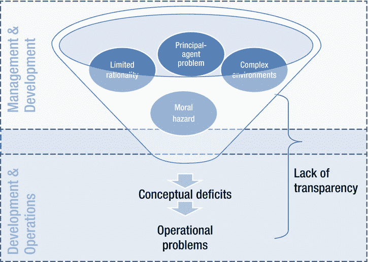
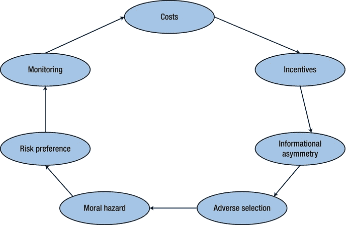
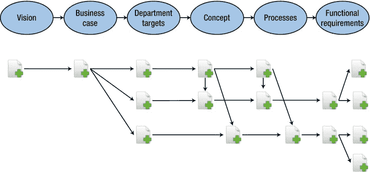

# 七、统一的整体方法

如果你花更多的时间开会而不是写代码，你只能称自己为高级程序员。

——奉献波拉特

本章将讨论软件工程的统一和整体的方法。我们将从概念的讨论开始，特别是非功能性需求。然后，我们将更详细地讨论开发和运维之间协作的主要危险之一。这被称为*概念赤字*，它会导致业务需求、项目结果和运维预期之间的差异。

有了 DevOps，开发和运维确实解放了自己，接受了管理的责任，特别是规划和协调。本章提供了一些关于管理及其对开发和运维的依赖方面的背景阐述。

本章阐述了项目中概念缺陷和道德风险出现的根源。我们将会看到，我们需要一个整体的、统一的方法来创建可追踪的工件，跨越所有的角色，尤其是开发和操作。

现在让我们更详细地讨论概念，尤其是非功能性需求。

概念入门

概念是实现额外商业价值的计划。一个概念应该对谁应该做什么以及如何获得承诺的商业价值的问题给出详细的答案。这个概念由必须以一致和完整的方式定义的过程和工作流组成。根据这个定义，清晰明确的理解就形成了，这是自动化过程的先决条件。如果另一方(开发或运维)能够理解概念，并且能够确认概念的可行性，那么这个概念就是足够详细的。为了定义概念，需要创建工件，比如需求文档。运维部门对非功能需求特别感兴趣，这是我们接下来要讨论的。

非功能需求

对于需求类型的分组，Leffingwell 使用 FURPS 缩写，代表功能性、可用性、可靠性、性能和可支持性 [2](#Fn00072) :

*   *功能。*系统为用户做什么。
*   *可用性。*用户让系统这么做有多容易。
*   *可靠性。*系统的可靠性。可靠性包括*可用性*(例如，系统必须在指定的时间百分比内可供操作使用)和 *MTTR* (参见[第 3 章](03.html))
*   *性能。*多久一次，或多少次，它能做什么。性能包括*容量*(例如，系统可以容纳的事务数量)和*可伸缩性*(例如，系统可以扩展以容纳更多交互的能力)
*   *保障性。*对我们来说，维护和扩展这样做的系统是多么容易。保障性通常也称为可维护性。

FURPS 的 URPS 部分用于组织非功能需求。非功能需求对于操作来说是特别重要的，因为它们指定了软件的运行时行为。

非功能性需求通常通过使用用户语音形式来定义，例如“作为一个消费者，我希望在任何消息到达后不到一分钟内得到通知，以便我可以迅速采取适当的行动”，而不是传统的表达方式，例如“所有消息应在不到一分钟内显示” [3](#Fn00073) 。用户语音表单也被*用例*使用。[表 7-1](#Tab00071) 显示了一个如何描述用例的典型模板，包括谁(参与者)与系统做什么(交互)，为了什么目的(目标)，不涉及系统内部。非功能需求也包括在内，还有它们的接受标准。验收标准确定是否满足要求。

[表 7-1](#_Tab00071) 。定义非功能需求 [4](#Fn00074) 的示例模板

| 项目 | 描述 |
| --- | --- |
| 用例 | 引用此用例的唯一标识符。 |
| 演员 | 此用例中涉及的参与者列表。 |
| 假设 | 用例成功终止必须满足的条件。 |
| 步伐 | 实现目标所必需的参与者之间的交互。 |
| 变化 | 主用例场景之外的其他场景。 |
| 无功能的 | 用例必须满足的非功能需求列表。非功能需求以下列形式列出: <keyword>: <requirement>: <acceptancecriteria>关键词包括但不限于性能、可靠性、容错和优先级。验收标准是可测量的和客观的。</acceptancecriteria></requirement></keyword> |
| 问题 | 有待解决的问题清单。 |

在 Gojko Adzic 看来，非功能性需求和功能性需求之间只有一线之隔。他指出，许多通常被称为非功能性的特性隐含着功能性。根据 Gojko 的经验，“当他们说非功能性时，大多数人想到的是跨领域的功能性需求(例如，安全性)，或者不是离散的，但是可以在滑动尺度上测量的功能性需求(例如，性能)。” [5](#Fn00075) 例如，如果你决定实现一个缓存(因为一个特定性能目标的非功能性需求)，那么派生的功能性需求(缓存本身)的处理就变得等同于其他功能性需求的处理。

许多非功能需求可以被认为是对系统行为的约束。根据迈克·科恩的说法，表 7-2 显示了一些典型的样本约束。 [6](#Fn00076)

[表 7-2](#_Tab00072) 。为各种常见的非功能需求编写的示例约束

| 面积 | 样本约束 |
| --- | --- |
| 表演 | 80%的数据库搜索会在不到两秒的时间内将结果返回到屏幕上。 |
| 轻便 | 该系统不得使用任何难以移植到 Linux 的技术。 |
| 容量 | 该数据库将能够在指定的硬件上存储 2000 万个成员，同时仍然满足性能目标。 |
| 可维护性 | 所有组件都必须有自动化单元测试。自动化单元测试必须至少每 24 小时运行一次。 |

与项目成员共享所有需求(以及描述这些需求的工件)是很重要的，这使得所有成员能够以协作的方式与他们一起工作。需求经常被描述为呈现在 Word 文档中(共享在文件服务器上或者版本控制系统中，比如 Subversion ),或者作为工具的条目，比如吉拉或者 Rational DOORS。 [7](#Fn00077)

既然你已经学习了概念，特别是需求，让我们来讨论概念缺陷。

概念缺陷

不完整的、错误的或未实现的非功能性需求会导致各种各样的概念缺陷。如果在这个层面上有概念上的缺陷，开发和操作之间的误解就可能发生。从技术角度来看，可能会出现问题，例如影响进程、操作周期或计算的竞争条件。此外，由于不适当的多用户解决方案导致的不一致性可能会对数据池产生不太可能的一致性影响。

在过去的几十年中，提高 IT 项目的成功和质量的尝试导致了新的管理方法，例如向敏捷开发的转变。然而，仍然有项目成功好坏参半的原因。在第 2 章中，您了解了开发和运维之间的冲突。更详细地说，从流程的角度来看，冲突的其余原因有两个:

1.  理性的链条通常排除其他团队或角色(如运维或管理)。这可能导致概念不充分(即概念没有被很好地理解或定义)。缺陷包括错误的期望、不可行的需求和不可实现的规范。在运维阶段开始之前及之后，此类赤字可能不会被发现。
2.  团队或角色之间的权力关系可以为行为模式(例如，道德风险)奠定基础，这种行为模式可以阻碍 IT 部门交付有价值的解决方案的努力。

图 7-1 显示了道德风险和有限理性等因素是如何引发概念缺陷的。概念缺陷的问题将在过程的后期变得明显，并经常导致操作问题。

[图 7-1](#_Fig00071) 。*概念缺陷的因素。由此产生的运维问题是由 IT 管理层的弱势地位和一种被称为“道德风险”的行为模式引发的，这破坏了从需求到软件解决方案的良好过渡*

现在让我们来讨论概念缺陷的起源。

概念缺陷的起源

概念缺陷可能是偶然或故意出现的。偶然发生的赤字可能是有限理性或复杂动态环境的结果。如果赤字是故意造成的，委托代理问题可能是原因，或者我们可以说是一种*道德风险*，它被定义为个人和集体理性之间存在差异的情况所表明的行为模式。现在让我们从探索有限理性开始。

有限理性

有限理性原则是指综合弗洛伊德的心理结构 [8](#Fn00078) 和维尔弗雷多·帕累托 [9](#Fn00079) 的帕累托原则而形成的几种沟通模式的中心假设。第一个理论假设人类心灵的无意识部分，这反过来导致每个思想的无意识部分。第二种理论将这种关系量化为 80/20 规则，这在流行的冰山模型中有所说明。如图 7-2 所示，弗洛伊德将心灵分成三部分:

[图 7-2](#_Fig00072) 。*冰山模型描绘了弗洛伊德的精神实例，展示了人类思维的意识和无意识部分之间的 20/80 关系。它在沟通理论中占有核心地位，因为它阐明了个人沟通策略的需求*

*   水线代表了有意识的可及知识和相关的无意识活动之间的界限。
*   自我是在超我的内在理想和更深层次的个人动机的背景下协调外部和内部需求的执行实例。
*   超我是由我们的教育和经历形成的。内在化的理想很少相互嵌套，因为自我中的思想通常只与我们生活中的一些重要情况有关。

试图打破有限理性的挑战是恢复应用知识并以不偏不倚的方式进行讨论，不管结果是否仍然符合当前的所有需求。

管理层通常没有考虑全局，只看到与周围环境相关的实际需求。因此，为了打破有限理性，管理层必须关注日常工作之外的问题，并将它们整合在一起，直到所有行为者都在大局上保持一致。

就有限理性而言，最后一个方面是，管理层有时会在执行时学习一个新的业务方面。出现这种情况是因为一些管理层成员对他们所做的事情不熟悉，或者公司本身正在开始一项全新的业务。

复杂和动态的环境

并非所有常用程序的个别步骤和决策都被有意识地执行，也并非所有人都清楚这些程序的所有原因。企业流程通常很复杂。因此，变化对复杂的、只有部分意识的过程的影响是无法完全预测的。一个生动的利益相关者环境放大了这一方面，因为给定例程的变更进行得更加频繁。因此，源自复杂和动态项目环境的概念缺陷也可以用下面几个典型的陈述来描述。

*   管理层并不总是意识到其行动和愿望的所有依赖性。这个方面主要解决一种情况，即管理人员没有意识到特性请求的所有相关方面。这个问题往往会导致概念不完整。
*   *管理层并不总是被告知*。这个方面和第一个方面类似。一个解决方案不断发展，一个完整的部门可能在没有管理层参与的情况下就某个问题得出自己的结论。这个部门的想法可能与管理层的想法相反。
*   *管理层并不总是以正确的方式组织和连接*。这种混乱会将个人问题扩散到组织的其他部分。

管理层对 DevOps 的认识和承诺是必要的。但是你也必须考虑到，当你搬到 DevOps 时，你可能不得不处理一些人的病理活动。将敏捷开发扩展到运维可能会导致这样的情况，来自开发和运维的权力较小的人(例如，新雇用的同事，名声较差的同事)可能会仅仅因为任何基本的动机(例如，嫉妒:颠覆性地行动，以削弱和破坏当前的组织结构 [10](#Fn000710) )而成为 DevOps 运动的支持者。

另一个令人感兴趣的方面是委托代理问题，这将在下面讨论。

委托人-代理人问题

委托代理问题也影响概念缺陷。委托代理问题(有时也称为代理困境)描述了在信息不完全和不对称的条件下(例如，如果运维比开发拥有更多或更少的信息)可能演变的挑战。如果委托人(例如，公司或部门的老板)雇用代理人(例如，外部服务提供商)并希望他或她追求委托人的利益，就会出现这种情况。

通常，“隐藏的行动”和“隐藏的信息”是事后出现的(即，在代理人执行其工作时或之后)。隐蔽行动意味着代理人有机会在完成委托人任务的同时自由行动，而委托人不能完全跟踪代理人的活动。如果委托人可以跟踪代理人的活动，但由于委托人缺乏专业知识而无法评估他或她的质量，则隐藏信息存在。这两种情况都会导致一种有问题的状态，在这种状态下，委托人无法评估结果以确定它是因为代理人的合格努力还是(在何种程度上)因为它是由环境引起的。通过执行以下操作，可以尽早解决这些影响:

*   发信号(例如，代理主动传达他或她的技能和经验)。
*   筛选(例如，委托人测试可能的药剂)。
*   考察代理人的声誉。
*   提供激励(对代理的正确激励)。
*   建立委托人和代理人之间的信任。
*   审视公司文化。
*   委托人和代理人之间有共同的价值观和目标。

在这些场景中，诸如道德风险这样的缺陷可能会发展，我们将在接下来讨论。

道德风险

道德风险 [11](#Fn000711) 出现在个体理性不符合集体理性的情况下。因为团队和角色(例如，开发、运维或管理)在争取更大权力时可能会导致概念上的不合理，所以其概念和要求可能不是最适合业务需求的。结合对快速和容易理解但很少给 IT 报告的不平衡需求，管理和开发/运维之间的阴谋可能是个人理性的。因此，双方都可能经历道德风险。道德风险是作为一个循环的一部分而产生的，当任何变化被应用到系统时(例如，新的商业想法或新的功能或非功能需求；参见[图 7-3](#Fig00073) 。这个循环说明了道德行为模式的出现，这导致了更高的成本和对新变化的需求。如果我们想象犯道德风险的人为了他们自己的利益使用公司资源，道德风险的成本就变得很明显。公司本身有责任创造新的道德风险的机会，通过创造新的准则或忽视监管漏洞，这两者都可以被公司成员所利用。这种机会对员工产生了不利的激励，他们通常不会分享他们的有用知识来从这些差距中获益。

[图 7-3](#_Fig00073) 。*道德风险循环表明道德风险的发展和后果。这一循环始于系统的任何变化，它开启了机会和激励，并解决了委托人和代理人之间信息不对称的基本前提*

道德风险

如果人们利用他们的知识来获得个人利益，以获得更多的权力或收入，就会发生道德风险。

因为道德风险的存在会转化为公司更多的成本，所以最小化这个问题的最好方法是减少公司条件下的激励。透明度是道德风险的最佳疗法。大多数公司都意识到了这种危险，并有意将其最小化。因此，C 级管理层(通常由最高级别的高管组成)是解决这些问题的最后一个地方，因为战略想法需要运维的有效性和效率。

道德风险玩家知道如何掩盖他们的踪迹。因此，这些公司的一个目标是减少发现和追踪问题的可能性。这通常是通过找到好的托辞和借口来实现的。指向这种行为的一个指标是不愿意使用任何种类的客观统计，包括数据历史化或用于技术和功能错误记录的中央日志文件。如果透明性存在，开发和运维可以很容易地追踪任何问题或误解的原因，因此不会因为钻研可信的解释而蒙受声誉损失。分析问题根本原因的一个好方法是“五个为什么”方法，这是由 Taiichi Ohno 提出的一种技术。 [12](#Fn000712)

开发和管理之间的合作通常是稳定和有利可图的联盟，因为开发的替代方案要么是概述每个概念缺陷，要么可能因为突然被称为抱怨者而失去声誉(在整体文化不开放和不尊重的情况下)。此外，完成项目中的所有工作所消耗的额外时间可能会导致与之前的期望相冲突，从而使开发变得令人扫兴，甚至使管理层名誉扫地。因此，对所有各方来说，利用环境并使自己的生活变得轻松是个体理性的。如果这种行为被确立，回到正常的、建设性的工作就不容易了。开发无法解释为什么没有管理的支持，类似的工作会突然花费更长的时间。反过来，管理层无法证明增加同等工作的成本是合理的。然而，即使双方都试图结束他们无意义的行为，其他的期望可能会迫使行为者继续犯道德风险。

统一方法的属性

统一的方法使开发和运维能够协作创建概念。统一的方法最大限度地减少概念缺陷，并尽早发现这些缺陷的第一阶段。通过应用下面章节中概述的属性,可以更好地创建概念，并且可以检测参与者的病理行为。

培养可追溯性

创建概念工件的一个重要方面是，它是逐步发生的，并且可以与其他人共享，但有一个时间延迟(即，创建和提供给其他人之间的时间)。因为所有的概念步骤都是前一步骤的固化，所有这些方面都是对创造一个好的和可行的总体概念的挑战。因此，概念创造是一个复杂的、分布式的、迭代的过程，在概念创造过程中的各个层面都可能出现缺陷。

为了更好地理解，项目团队需要可追溯性。从想法到具体的需求，到软件的实现和操作，将这些步骤排列成单个阶段并加以说明，并检查它们之间的转换，这就变得很基本了。例如，可以通过建立价值流图来获得这种理解，如[第 6 章](06.html)所述。

软件解决方案是一系列决策的产物，因此这些决策应该被记录在它们被做出的地方(“设计基本原理”)。可追溯性的先决条件是需求被很好地记录。“敏感点”方法通常用于记录需求。 [13](#Fn000713) *实践中的软件架构* [14](#Fn000714) 是一本很棒的书，从架构师的角度提供了关于如何处理非功能性需求的进一步见解。 [15](#Fn000715) 在[第 4 章](04.html)中你学到了场景可以用来描述质量属性。表 4-1 中的例子摘自《实践中的软件架构》一书。培养可追溯性的另一个可能的方法是基于任务的开发，它将工作项链接到其他工作项。阿利斯泰尔·考克伯恩更喜欢将非功能需求与用例联系起来。 [17](#Fn000717) 关联文档可以写成电子表格或者简单表格的形式。

[图 7-4](#Fig00074) 说明了不同的工件是如何逻辑地联系在一起的(例如，通过一个唯一的标识符，所以通过使用代码中的注释，一个需求的标识符被包含在软件代码中)并且彼此相关以促进可追溯性。业务案例触发功能性和非功能性需求，这反过来产生代码和基础设施(关于如何指定基础设施的细节，参见[第 9 章](09.html))。它们都提供概念上的反馈并提高质量。链接工件有助于追踪和避免概念缺陷。链接工件集合的图形表示看起来类似于马赛克。马赛克的类比强调了从一个步骤到下一个步骤，从过程的开始(一个业务案例)到结束(将软件投入生产以向客户交付有价值的解决方案)，以软件的完整图片(规范、代码)结束(类似于组成完整窗口的小马赛克的集合)。

[图 7-4](#_Fig00074) 。*链接的概念工件提供反馈，促进可追溯性，并提高质量。概念工件，包括业务案例、功能性和非功能性需求、代码和基础设施规范，是密切相关的，并且在逻辑上有联系*

现在让我们探索一下检查过的非功能需求是如何帮助驱动一个统一的方法的。

检查非功能需求

应该检查非功能性需求。先决条件是软件必须是可测试的。 [18](#Fn000718) 测试非功能性需求有许多不同的方法，没有灵丹妙药。

从开发过程的开始就关注非功能性需求是很重要的。在大多数情况下，不可能(或者非常昂贵)在事后实现非功能需求，即在软件已经实现之后。这就是 DevOps 及其开发和运维之间的密切协作如此重要的原因。

满足非功能需求的代码通常是干净、简单和可测试的。如果软件是可测试的，你可以为功能性和非功能性需求编写测试。例如，Lisa Crispin 和 Janet Gregory 介绍了如何应用测试驱动开发来检查非功能需求的用例。詹姆斯·惠特克等人描述了谷歌如何将负载测试作为持续集成解决方案的一部分。 [20](#Fn000720) 其他例子展示了如何测试基础设施(参见[第 9 章](09.html)或泰勒·克罗伊的博客文章 [21](#Fn000721) )并使用监控来管理、发展和检查非功能需求(参见[第 3 章](03.html))。在第 10 章中，我们将通过一个全面的例子来展示如何将验收测试写成可执行的规范。书籍连续交付 [22](#Fn000722) 并发布！包含了一些关于检查非功能需求的好建议。

检查非功能性需求的另一种方法是将(非功能性)需求与制定和记录设计决策的工件联系起来。一个典型的例子是将需求(及其唯一的标识符)逻辑地链接到架构文档或软件模块。

调整目标

有时，管理层与公司的整体目标不一致，这可能导致颠覆性的部门行为或由隐藏议程驱动的个人活动。不幸的是，管理层定义了需求，因此可能会掩盖很多问题，因为管理层也只向 C 级汇报。此外，如果有怀疑，这个问题往往被宣布为仅仅是一个技术问题，直到无可否认地被证明是其他部门的概念缺陷。相反，IT 部门通常在管理层中所占的比例最小，因此通常担心因过于频繁地提供证据而蒙受声誉损失。这个问题之所以存在，是因为效果和概念缺陷之间的因果关系不容易向 C 级管理层解释，也不能快速检索。因此，由于进行了太多的争论而没有给出直接和可理解的答案，IT 部门经常很快陷入复杂的局面。有关如何与目标保持一致的更多信息，请参见[第 5 章](05.html)。

创建概念，尤其是编写需求，是开发和运维团队需要达成一致的一个重要领域。编写需求文档是为了指导开发解决方案的未来行动。“如果选择、强加和假设不能被所有相关的人理解和接受，那么大部分需求工作将会被否定。因此，在从需求阶段进入流程的其余部分之前，所有各方都必须理解并接受他们的责任。否则，交付产品时，客户会感到失望。为了确保理解和接受，你必须努力将每一个选择、强加和假设转化为明确的、有文件证明的协议。” [24](#Fn000724)

结论

本章提供了关于概念的背景阐述，尤其是非功能性需求，以及概念缺陷。概念缺陷可能有不同的来源。它们可能来自有限理性、复杂动态的环境、委托代理问题，或者来自道德风险。你已经知道了最小化概念缺陷并尽早发现它们的重要性。因此，可追溯性、一致的目标和检查非常重要。本章关闭了 DevOps 的流程视图。下一部分将讨论 DevOps 的技术观点。

[1](#_Fn00071)【http://twitter.com/devops_borat/status/192276908879261696】T4。

[2](#_Fn00072) 参见莱芬威尔院长，*敏捷软件需求* (Addison-Wesley，2011)，第 17 章。

[3](#_Fn00073) 参见莱芬威尔院长，*敏捷软件需求* (Addison-Wesley，2011)，第 342 页。

[4](#_Fn00074) 欲了解更多信息，请访问德里克·科尔曼的网站【http://www.bredemeyer.com/papers.htm T4】以及可在[http://www.bredemeyer.com/pdf_files/UseCase_Template.PDF](http://www.bredemeyer.com/pdf_files/UseCase_Template.PDF)下下载的用例模板。

[5](#_Fn00075) 参见戈杰科·阿季奇，*举例说明*(曼宁，2011)，页 108。

[6](#_Fn00076) 参见麦克·科恩，*用户故事应用*(艾迪森-卫斯理，2004)，页 178。

[7](#_Fn00077)【http://subversion.apache.org】[【http://www.atlassian.com/jira】](http://www.atlassian.com/jira)[http://www-01.ibm.com/software/awdtools/doors](http://www-01.ibm.com/software/awdtools/doors)。

[8](#_Fn00078) 参见弗洛伊德的结构模型，【http://en.wikipedia.org/wiki/Id】[，_ 自我，_ 和 _ 超我。](http://en.wikipedia.org/wiki/Id)

[9](#_Fn00079) 参见维尔弗雷多·帕累托、*《政治经济学手册》* (A.M .凯利，1969)。

[10](#_Fn000710) 参见尼依格罗酒店的《马基雅弗利》，*的《君主论》，* trans。哈维·c·曼斯菲尔德(芝加哥大学出版社，1998 年)，[第三章](03.html)。

[11](#_Fn000711) 参见阿拉德·e·登贝和莱斯利·I·博登，《道德风险:一个道德问题》，*新解* 10，3(2000):257–279([http://baywood.metapress.com/link.asp?id=1gu8eqn802j62rxk](http://baywood.metapress.com/link.asp?id=1gu8eqn802j62rxk))。

[12](#_Fn000712) 参见大野泰一，*丰田生产体系:超越大规模生产*(生产力出版社，1988)，第 17 页。

[13](#_Fn000713) 见[http://www . scribd . com/doc/49571808/14/Sensitivity-and-trade-Points](http://www.scribd.com/doc/49571808/14/Sensitivity-and-Tradeoff-Points)。

[14](#_Fn000714) Len Bass 等人，*实践中的软件架构* (Addison-Wesley，2009)。

[15](#_Fn000715) 感谢 Michael Stal 博士和 Stefan Tilkov 教授提供的反馈。

[16](#_Fn000716) 参见迈克尔·胡特曼、*敏捷 ALM* (曼宁，2011)、[第四章](04.html)。

[17](#_Fn000717) 参见阿利斯泰尔·考克伯恩，*【撰写有效用例】* (Addison-Wesley，2001)，页 14 和 161。

Frank Buschmann 等人将可测试性描述为软件架构的非功能属性。参见他们的*面向模式的软件架构*，第 1 卷(Wiley，1996)，第 408 页。

[19](#_Fn000719) 参见 Lisa Crispin 和 Janet Gregory，*敏捷测试* (Addison-Wesley，2009)，页 104。

[20](#_Fn000720) 参见 James Whittaker 等人，*谷歌如何测试软件* (Addison-Wesley，2012)，页 197。

[21](#_Fn000721) 见[http://unethicalblogger . com/2012/06/10/outside-in-to-ops . html](http://unethicalblogger.com/2012/06/10/outside-in-to-ops.html)。

[第 22 章](#_Fn000722) 参见 Jez Humble 和 David Farley，*连续交货* (Addison-Wesley，2011)，[第 9 章](09.html)。

[23](#_Fn000723) 参见迈克尔·t·尼加德，*发布吧！*(实用主义书架，2007)。

[24](#_Fn000724) 参见唐纳德·c·高斯和杰拉尔德·m·温伯格，*探索需求:设计前的质量*(多塞特书屋，1998)，页 274。