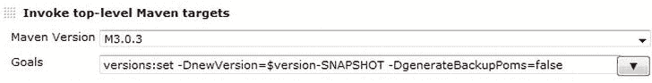

# 八、自动发布

调查显示，年轻的 devops 仍然相信牙仙，圣诞老人和文件。

——奉献波拉特

在前面的章节中，您了解了自动化作为减少周期时间和促进开发与运维之间协作的工具的重要性。在第 3 章中，您了解到自动发布是 DevOps 的一个积木，它是一个分离部署和发布的强大策略。

自动发布降低了发布软件的风险，确保了可重复性，最重要的是，有助于获得快速反馈。自动化容易出错、重复且耗时的活动至关重要。

在这一章中，我们将讨论自动发布的先决条件，并探索一些关于如何实现自动发布的具体例子和模式。我将通过讨论通用标准和良好实践 [<sup>2</sup>](#Fn00082) 或具体的轻量级工具来说明这些例子。首先，我们需要讨论自动发布的先决条件。

自动发布的先决条件

从技术角度来看 ，发布意味着整合团队的工作，并编译、链接、打包和部署软件到环境中(通常也称为目标系统)。发布的基本部分是管理基础设施，在基础设施中安装正确的版本，并根据特定的环境配置应用程序。发布是使最终用户可以使用变更的过程。部署可以导致发布，但这不是强制性的(见[第 3 章](03.html))。展示、部署和发布经常被用作描述这个产品化阶段活动的同义词(参见[第 1 章](01.html))。从功能的角度来看，发布意味着向用户提供一个版本的软件来实现客户的需求。一个版本的内容作为一个单独的实体进行测试和部署。

环境和基础设施

根据 Humble 和 Farley 的说法，“环境是您的应用程序工作所需的所有资源及其配置”(*连续交付* [Addison-Wesley，2011]，第 277 页)，以及硬件配置(包括 CPU、内存和主轴)和操作系统和中间件的配置(包括消息传递系统和 web 服务器)。术语基础设施概括了您组织中的所有环境以及支持服务，如防火墙和监控系统。

应该将技术和功能观点结合起来。例如，你应该总是能够确定哪些需求是在哪个软件版本中实现的。向目标系统发布软件总是软件本身、基础设施和人员的同步点。通常，“完成”被认为是这样的:软件已经被成功地部署和配置到目标系统，以便用户可以使用它。在自动发布下，发布过程的主要部分由脚本和工具链执行。在这个过程中，整个团队从自动化中获益，在最佳条件下，简单地按下一个特定的按钮，将自动创建的发布候选人提升到发布状态(参见[图 8-1](#Fig00081) )。 [<sup>3</sup>](#Fn00083)


[图 8-1](#_Fig00081) 。*在自动发布过程中，过程的主要部分是自动完成的。通常，由领域专家来决定哪个发布候选被提升到发布状态(例如，通过按下特定的按钮)。*

通常，这种描述是理想化的和过于简化的(例如，由于探索性测试和在软件投入生产之前需要签署文档)。然而，在所有情况下，人类活动都集中在只能由人类执行的任务上。为了获得快速反馈和跨部门持续同步，脚本和工具链支持或完全执行重复性任务。

整体自动发布流程的先决条件包括:

*   在协作的工作环境中促进团队承诺。
*   使用由轻量级工具组成的高度集成的工具链(例如，詹金斯、 [<sup>4</sup>](#Fn00084) 声纳、Maven 和许多其他工具)，这些工具链可以根据需要进行选择和协调，并符合特定要求。个人的 [<sup>5</sup>](#Fn00085) 需求应该是决定选择一个工具而不是另一个的基础。
*   将配置项(包括源代码、数据库脚本、中间件、基础设施、配置文件，如 Java 属性文件和构建/部署脚本)置于版本控制中。
*   尽可能使用声明性格式来建立自动化和发布过程(参见第 9 章中的例子)。
*   明确声明并隔离应用程序、中间件和基础设施的依赖关系。
*   应用持续集成，持续同步同事的工作，并特别注意遵守以下几点:
    *   如果构建在那个特定的时间被破坏，不要签入(即，提交对版本控制的更改)；相反，应该立即修复构建。
    *   当您可以签入代码时，塑造流程(包括 done 的定义)(例如，代码应该编译并且测试应该成功运行)。
    *   修复中断的测试；不要注释掉它们，删除它们(除非它们是不必要的)或者从构建中移除它们。
    *   集成所有的工件类型，包括源(参见本章后面的模式目录)、数据库脚本(参见本章后面的模式目录)和基础设施脚本(参见第 9 章)。
*   区分版本控制系统(比如 Subversion 和 Git)，在那里你保存你的源代码，组件库(比如 Artifactory 和 Nexus )和包库(比如 YUM ，在那里你保存你的软件二进制文件(见本章后面的模式目录)。
*   构建一次二进制文件，并通过配置将它们部署到目标系统(即，运行时配置数据不以静态方式打包到二进制文件中；而是在部署时或启动时配置应用程序)。
*   冒烟测试部署以确保部署进展顺利(参见第 3 章[)。](03.html)
*   保持开发和运维环境的相似性(由于成本和收益以及特定环境中不同的非功能性需求，保持它们的相似性是不现实的)。
*   定义一个过程(也用于修补和合并产品版本中的变更)。
*   通过自动化处理重复性和耗时的任务。尽可能地尝试自动化，但要记住自动化的成本和“悖论”(见第三章)。
*   确保交付的软件完全由构建服务器构建，既不是手动构建，也不是打补丁或在开发人员的桌面上构建(以确保可再现性)。

在学习了自动发布的先决条件之后，您现在已经准备好使用适当的工具来深入研究自动发布的具体模式了。

使用适当工具的模式

有许多不同的方法、过程和工具来实现自动发布。在下面，我将提供进一步的指导和具体的例子来展示你如何实现你的自动发布过程。这些概念独立于任何特定的平台或语言。为了使概念更清楚，我还将包括具体工具的例子。注意，本章没有提到的特定领域的其他工具不一定比我在这里提到的工具差。然而，我提到的这些工具都是最先进的工具，是很好的例子，并且可以广泛获得。让我们从交付管道的概念开始。

使用输送管道

交付管道(也称为构建管道或分阶段构建)包含一组交付软件的步骤及其相互依赖关系。这些步骤可能包括以下内容:

*   编译软件。
*   运行单元测试。
*   运行审计或指标。
*   打包和链接软件。
*   使用软件版本的所有部分(例如，数据库和基础设施元素)部署应用程序。
*   创建系统备份。
*   配置应用程序(在部署或运行时)。
*   迁移和准备数据。
*   冒烟测试应用程序或部署。
*   自动验收测试(验证解决方案是否在做正确的事情，参见第 10 章[)。](10.html)
*   手动测试(最重要的是，探索性测试)，强调个体测试人员的个人经验和责任(例如，在测试边界值方面)，以帮助同时完成测试设计和测试执行。
*   促进支持发布候选人的申请(批准)。
*   创建虚拟机、网络、负载平衡器、监控代理和其他基础设施元素(参见第 9 章)。
*   监控生产中的应用。

管道，尤其是交付管道，是交付软件过程的隐喻。它表示软件变更在开始时是流程(管道)的输入，并通过整个流程自动传输到管道的末端，即生产系统。

 **注**交付管道通常也被称为分阶段构建或构建管道。

从更技术性的角度来看，管道是一种将构建任务分组并使它们相互关联的方式。换句话说，管道是一种通过一系列质量关来编排构建过程的方式，在特定的阶段有自动或手动的批准过程。因此，这些管道简化了软件向产品的交付过程。 [<sup>6</sup>](#Fn00086)

所有代码变更(包括基础设施代码，见[第 9 章](09.html))进入生产管道。管道从开发团队到生产中的最终发布促进软件和阶段工件。您应该特别注意将所有的工件类型链接到一致的版本，并且您应该意识到“管道”不是一个“发射并忘记”的管道。相反，开发和运维是连接和集成的，来自用户的反馈是流回的，在大多数情况下，解决方案(希望)更像是一个集成的生命周期，类似于管道，管道的两端相互连接。

示例管道

管道的一部分可能看起来像图 8-2 中所示的图表。在这个例子中，连续构建(其从版本控制系统中的变更的签入开始)测试并将您新生产的二进制工件的开发版本部署到组件储存库(例如，Nexus)和目标环境(例如，将 web 应用部署到 web 容器)。作为一个例子，考虑一个基于 Maven 的构建系统，其中您想要与您的同事共享您的工件的新开发版本(在 Maven 中，这些是所谓的快照版本)。之后，代码由例如声纳检查。


[图 8-2](#_Fig00082) 。*经历不同构建步骤的管道，集成了开发和运维。基本部分是质量关口(继续下一步)和基线(标记版本)。*

在验证代码满足需求(即通过了质量关)之后，您将在版本控制中冻结这个特定的版本(通常称为标记或标注)。换句话说，创建一个基线来表达一个发布候选，它是软件的一个特定版本，以供以后重用。稍后，会创建一个发布版本。一个发布版本提升一个现有的候选发布版本，它将有资格用于生产。在我们的例子中，发布构建是手工启动的。它准备发布工件(例如，在 Maven 中，通过删除版本元素中的快照)并将这些工件部署到组件存储库中。在发布进入生产阶段之前，非功能需求(NFR)被再次明确测试。当然，这个过程只是整个管道的一小部分。实际上，您将有不同的后续步骤，还包括将软件部署到其他目标系统。

定义管道的方式取决于您的个人需求。让我们考虑另一个例子，这个例子本质上是基于我们之前的例子，但是它在版本创建之后，在对 NFR 执行测试和准备生产之前创建基线(见[图 8-3](#Fig00083) )。


[图 8-3](#_Fig00083) 。*一个不同的例子，在发布工件被创建之后，在最后创建基线。这个例子不比图 8-2 中的例子更好或更差；就是不一样。*

要建立和优化管道，可以使用价值流。更多信息见第 6 章。

使用基线

Alexis Leon 写道，“基线是一个规范或产品，它已经过评审并达成一致，是进一步开发的基础。” [<sup>7</sup>](#Fn00087) 使用跨不同工件类型的软件的一致版本的基线(即，包括所有不同类型的文件)。基线创建后可以再次使用。后续工作可以与基线相关联(例如，新的变更请求或增量数据库脚本)。基线通常是版本控制系统中的一个标记(有时称为标签)，我们将在接下来讨论。

创建基线

从技术角度来看，创建基线可能非常容易。例如，考虑使用 Subversion 作为版本控制系统，Jenkins 作为构建服务器。您已经配置了 Jenkins 构建作业来签出源代码并构建它们。因此，Jenkins 构建作业有一个包含签出源代码的工作区。在执行其他工作之后，Jenkins 构建作业可以简单地触发(例如，作为 shell 命令):

```
svn cp –m "rel". https://svn.kenai.com/svn/alm∼agilealm/scm/tags/$TAG
```

其中$TAG 是用于表示具体标签的变量。然后，Jenkins 会将 Jenkins 工作区的当前状态标记(或复制)到中央 Subversion 存储库中的一个新标记中。 [<sup>8</sup>](#Fn00088) 可以看到，给 Jenkins 添加一个 Subversion(或者 Git、CVS、ClearCase)命令就离开了 Jenkins 的领域，而我们使用的是命令各自的版本控制工具。例如，我们也可以触发类似于:

```
svn cp –m "Promote"
https://svn.kenai.com/svn/alm∼agilealm/scm/tags/$RC
https://svn.kenai.com/svn/alm∼agilealm/scm/operations/$RC
```

将 Subversion 存储库中的现有标签复制到新标签中(例如，将发布候选升级到发布状态或将基线移交给操作)。

 **注意**不要将变更提交回基线。基线一旦创建，就不会随时间而改变。根据上下文，您可能想要复制基线，更改副本，并根据结果创建新基线，但是原始基线始终保持不变。

但是，并不总是需要在构建作业中嵌入和调用脚本。通常，使用构建服务器提供的现成内容就足够了。[图 8-4](#Fig00084) 显示了我们如何使用 Jenkins 构建作业本身的标记功能在当前构建作业成功完成后创建标记的示例。


[图 8-4](#_Fig00084) 。*一个不同的例子，在发布工件被创建之后，在最后创建基线。这个例子并不比前面解释的标签脚本例子更好或更差；就是不一样。*

在本例中，我们将再次对构建作业进行参数化，以便它可以使用相关参数动态创建标签。在这种情况下，我们的标记名由 Jenkins 构建作业的名称和这个特定构建的唯一数字构建标识符组成。

拾取基线

一旦创建了一个基线，您就可以在任何时候再次选择它，以便可重复地检索被标记的状态，并在基线上应用进一步的工作(例如，升级版本或者只是检索这个特定版本的配置参数)。反过来，在已定义的基线上执行的额外工作也是自动化的，但是决定采用哪个基线的触发器是参数化的。

使用 Jenkins，检查基线就像创建基线一样简单。例如，您可以配置一个参数化的构建作业，它需要一个字符串(您必须输入一个到相关基线的开关)或者提供一个现有 Subversion 标签的列表。[图 8-5](#Fig00085) 显示了后者的一个例子，在用户选择了一个特定的标签后，Jenkins 将其变量 RC(代表发布候选)传递给构建作业中的下一步。将 Jenkins 配置为基于最新的基线对列表进行排序，将导致用户首先看到最近创建的基线。


[图 8-5](#_Fig00085) 。*配置一个参数化的 Jenkins 构建作业，它将在定义的路径下提供一个现有 Subversion 标签的组合框。具体的一个(在我们的例子中，由变量 RC 表示)在 Jenkins 构建作业中是可用的，以便进一步处理。*

然后，我们可以将基线与进一步的处理结合起来。在一个典型的例子中，您将 Jenkins 配置为在对其应用进一步的操作之前检查该基线。为此，我们只需定义检出 Subversion 存储库的 URL，包括我们在上一步中引入的参数(我们的开关名为“RC”)(见[图 8-6](#Fig00086) )。


[图 8-6](#_Fig00086) 。*配置 Jenkins 在运行时检查用户定义的基线。*

如果 Jenkins 构建随后被触发，用户必须执行输入(除非 Jenkins 被配置为从上游作业自动注入参数)。这在[图 8-7](#Fig00087) 中显示。


[图 8-7](#_Fig00087) 。*用户必须在开始构建作业时执行输入。用户必须从组合框中选择一个标记。*

在一个对基线执行进一步操作的简单用例中，可以用构建工具 Gradle [<sup>9</sup>](#Fn00089) 打包源代码(参见[清单 8-1](#list1) )。

***[清单 8-1。](#_list1)*** 装箱代码从基线开始

```
apply plugin: 'java'
import java.io.BufferedReader;
import java.io.FileNotFoundException;
import java.io.FileReader;
import java.io.IOException;
task zip(type: Zip) {
      BufferedReader bufferedReader  =  null;
      bufferedReader  =  new BufferedReader(new FileReader('version'));
      String version;
      version  =  bufferedReader.readLine();
      from('component') {
             include '**/*'
             into('software-'  +  version  +  '/component')
      }
      baseName  =  'software-'  +  version;
}
```

在本例中，名为“version”的文件位于根路径中。该文件包含应用程序的版本号(在构建时注入)。版本号将是包名的一部分(即 Zip 文件格式的文件名)。

在讨论了基线之后，我们现在可以讨论共享版本号，这是集成开发和运维的另一种方式。

共享版本号

您是否经历过版本号动物园，在那里开发人员、运维人员和企业都使用他们自己的版本号来表示完全相同的软件版本？使用 DevOps，找到跨部门版本的共享名称是至关重要的。正如已经讨论过的，协作共享一个版本控制系统(比如 Subversion)将会促进开发和操作之间的协作。那么为什么不使用和共享来自版本控制系统的版本号呢？在我们的例子中，当使用 Subversion 时，Subversion 修订号可以作为交流的媒介，甚至版本号也可以这样做。这种方法有许多优点:

*   Subversion 修订号是唯一的(对于一个 Subversion 存储库)。
*   Subversion 修订号由 Subversion 本身自动递增。因此，不需要自己的容易出错的脚本。
*   Subversion 修订版号是稳定的。例如，使用 Jenkins 构建作业名是不稳定的，因为它很容易被重命名。詹金斯工作编号不稳定，因为它不是唯一的。

现在让我们探索如何从 Subversion 访问修订号。

访问修订号

从 Jenkins 获取修订号很难吗？不，绝对不是。在一个简单的场景中，我们可以使用 Jenkins 的 postbuild Groovy 插件。在这个插件的帮助下，我们可以编写一个 Groovy 代码，作为 Jenkins 构建的一部分来执行。如清单 8-2 所示，我们用前面提到的变量 RC 来访问基线。

***[清单 8-2。](#_list2)*** 根据定义的基线访问和传播修订号

```
ver = manager.build.buildVariables.get("RC")
manager.createSummary("gear2.gif").appendText(ver, false)
if(manager.build.result.isBetterOrEqualTo(hudson.model.Result.UNSTABLE)) {
       def cmd = "svn loghttps://svn.kenai.com/svn/alm∼agilealm/scm/tags/DevOps_CI/$ver-v --stop-on-copy –limit 1"
       def txt = cmd.execute().text
       def strippedTxt = (txt =∼ /--/).replaceAll("")
       def rev = strippedTxt.tokenize('|')[0].trim()
       manager.addShortText(rev)
}
```

然后，我们将基线显示为 Jenkins 构建结果页面的一部分(通过 manager.createSummary 过程)。之后，我们定义一个本地 Subversion 命令。该命令根据基线从 Subversion 获取日志信息。我们简单地获取第一个日志条目，并提取修订号。'-r 1:HEAD' 颠倒日志的顺序，从最老到最新返回条目。标志- stop-on-copy 和- limit 1 精确地传递该标签上最旧的日志条目(这是复制操作本身)，而不管该标签在创建后是否已被更改(因此根据定义成为一个分支)。

在我们获取了修订号之后，现在让我们将它传递给系统并使它可见。

传递修订号

解析之后，变量 rev 将包含属于现有标签的 Subversion 修订号。我们可以用修订号做很多事情，包括将修订号添加到工件的名称中，或者将一个简短的文本添加到 Jenkins 构建信息中。如图 8-8 所示，被参数化并在基线上运行的具体任务也标有修订号。


[图 8-8](#_Fig00088) 。*在 Jenkins 中，构建作业历史被标上了 Subversion 修订号。*

适当地传播和共享版本是必不可少的。然而，从技术上标记工件的过程可能有点棘手，如下一节所示。

自动版本化

自动设置版本号通常是自动发布过程中的一个难点。您应该遵循的第一个建议是应用这些工具提供的功能。让我们考虑一个基于 Maven 的小例子，Maven 是 Java 项目的主要构建工具。构建工具以其依赖性管理(即，在构建期间定义和自动解决依赖性的能力)和区分快照开发版本(在版本元素中包含快照令牌)和发布工件(在没有快照的版本元素中仅包含普通版本)的能力而闻名。使用 Maven，您必须将所谓的坐标 分配给一个项目(这会产生一个二进制)。一个简单的例子如下所示:

```
<groupId  >  com.huettermann</groupId>
<artifactId  >  devops</artifactId>
<version  >  1.0.13-SNAPSHOT</version>
<name  >  DevOps</name>
```

在一个特定的时刻，您会想要升级开发版本(在我们的小例子中，是 1.0.13-SNAPSHOT )到发布版本(将是 1.0.13)。存在全面的解决方案，如 Maven release 插件或 Jenkins/Artifactory[<sup>11</sup>](#Fn000811)staging facility，但在特殊情况下，它们可能不是实现您的个人需求的最佳解决方案。在这种情况下，您可能更喜欢轻量级方法，这是我们接下来要探讨的。

参数化 Maven 的版本插件

要用 Maven 发布工件，您可以简单地使用 Maven 版本的插件。 [<sup>12</sup>](#Fn000812) 它的目标(名为“set”)设置当前项目的版本，同时更新子模块的所有版本。因此，所使用的命令是一个必须在 Maven 项目上执行的简单版本:set–DnewVersion =1 . 0 . 0(带有适当的参数)。在这个例子中，它将 Maven 版本设置为 1.0.0。

然而，如果您的 Maven POM 的[<sup>13</sup>](#Fn000813)*version*元素是您存储版本号的唯一位置(相比于将它单独存储在中央位置；清单 8-1 中显示了一个例子。例如，要将版本 1.0.0-快照发布到版本 1 . 0 . 0，您需要知道要寻找哪个当前版本(除非您编写另一个智能解决方案来剥离快照令牌)。让我们编写自己的 easy Maven 插件，它看起来类似于[清单 8-3](#list3) 中所示的插件。

***[清单 8-3。](#_list3)*** 一个简单的 Maven 插件，它获取当前版本(这是一个快照版本)，剥离快照令牌，并将新版本作为一个属性返回，可以通过进一步的构建步骤对其进行评估。

```
package com.huettermann;
import org.apache.maven.plugin.AbstractMojo;
import org.apache.maven.plugin.MojoExecutionException;
import org.apache.maven.project.MavenProject;
/**
 * @goal release
 * @phase process-sources
 */
public class ReleaseMojo extends AbstractMojo {
 /**
  * @parameter expression  =  "${project}"
  * @readonly
  */
 Private MavenProject project;
 public void execute() throws MojoExecutionException {
 String version  =  project.getVersion();
 String release  =  version;
 if (version.indexOf("-SNAPSHOT")  >  -1) {
 	release  =  version.substring(0, version.indexOf("-SNAPSHOT"));
 	getLog().info("SNAPSHOT found: " + release);
 }
 project.getProperties().setProperty("newVersion", release);
 }
}
```

Maven 插件需要一个 POM，它还定义了插件 [<sup>14</sup>](#Fn000814) 的坐标(也就是稍后在流程中使用插件的标识符)。在我们的例子中，坐标是:

```
<groupId  >  com.huettermann</groupId>
<artifactId  >  release</artifactId>
<version  >  1.0-SNAPSHOT</version>
```

我们可以通过使用这些坐标值的串联来调用插件，并将定义的入口点添加到插件中(这就是我们用清单 8-3 中的@goal 注释定义的)。调用的结果字符串如下所示:

```
com.huettermann:release:1.0-SNAPSHOT:release
```

我们通过将调用添加到 Jenkins 中来利用我们的插件，在构建期间调用它，这将在接下来进行探讨。

构建时调用

Maven 插件扫描当前 Maven 项目的版本，并去掉-SNAPSHOT 后缀以获得发布版本。然后，新版本被设置为可由进一步的构建步骤访问的属性。[图 8-9](#Fig00089) 显示了在我们的詹金斯构建 [<sup>15</sup>](#Fn000815) 中嵌入这个插件作为构建步骤的结果。


[图 8-9](#_Fig00089) 。*调用返回新版本号的 Maven 插件。反过来，返回的版本号是 versions:set 调用的输入。*

属性 newVersion 由 Maven 插件设置，其名称映射到 Maven 版本的输入参数:set goal。

如果你已经有了版本号(例如，版本号通过一个字符串参数被注入到一个参数化的构建中)，那么调用 Maven 目标就更容易了(参见[图 8.10](#Fig000810) )。这一次，我们添加了参数–DgenerateBackupPoms，并将其设置为 false 以禁止创建备份文件。



[图 8-10](#_Fig000810) 。*调用版本:set，其中新版本在构建时已经可用。*

进一步的方法

这个解决方案也可以在构建一个版本之后简单地设置新的开发版本，并且项目的代码必须与新的开发版本保持一致。

还有许多其他可能的解决方案。例如，您可以启动一个 shell 脚本作为 Jenkins 构建的一部分，相应地替换 Jenkins 工作区中的版本号。

在准备好新版本(即更改代码)之后，您可以签入更改。这也可以通过 Jenkins 中的 shell 命令来实现:

```
svn commit -m "new development version"
```

在讨论了许多处理基线的技巧和诀窍之后，我们现在来看看用 RPM (RedHat Package Manager)来形成发布容器。

使用转速为的发布容器

当建立一个整体的软件交付过程时，使用所用平台的本地标准和工具可能是一个非常好的主意。在下面的例子中，我将说明如何使用 RPMs 作为软件的容器，以及如何在安装期间配置已安装(或更新)的应用程序。

拓扑概述

作为持续构建的一部分，构建服务器(如 Jenkins)从版本控制系统中检查源代码并构建脚本(见[图 8-11](#Fig000811) )。


[图 8-11](#_Fig000811) 。*一个使用 rpm 作为软件容器的基于 Linux 的目标系统的开发或交付过程的例子。软件是在安装过程中配置的。*

构建服务器构建软件并将生成的二进制文件部署到组件存储库(也称为二进制存储库)。一个特定的发布版本集合了所有相关的软件元素并打包成一个 RPM 文件。

 **注**rpm 提供了一个强大的机制来形成发布容器。不使用发布容器，并不总是清楚哪些成分或变更是发布的一部分，并且，在实践中，寻找丢失的部分通常是一种类似于大海捞针的活动。为了将基础设施元素放入发布容器，也可以使用 Puppet 之类的工具，RPMs 和 Puppet 经常结合使用。Puppet 还可以用于将 rpm 分发到目标机器。我们将在[第九章](09.html)中讨论木偶。

RPM 文件是一个发布容器，包含软件的所有相关方面，包括目标系统上新标准软件包的特定版本或产生的工件(例如，标准 Java 部署单元，如企业档案[EAR ])。RPM 是一个免费的软件包管理器，它包含软件包格式本身(文件扩展名为。rpm)和所有必要的软件工具来创建和管理软件 RPM 包。用于创建 RPM 的逻辑核心是一个“spec”文件，即 RPM 的规范。

RPM 规格文件和配置

规范文件包含软件包名称、版本以及构建、安装和清理软件包的步骤。RPM 文件的一个例子可以看起来像清单 8-4 中的[所示。](#list4)

***[清单 8-4。](#_list4)*** 包含一个 EAR 文件作为分发源的示例 RPM。百分号标记等级库文件中的不同部分。安装后部分包括对安装后配置脚本的引用。

```
%define name myname
%define release 1
%define version 1.0.0
Summary: A wonderful program.
Name: %{name}
Version: %{version}
Release: %{release}
Source0: SOURCES/%{name}.ear
%prep
%build
%files
.. %{name}.ear
%install
%post
/../configure.sh
```

RPM 包是通过使用 rpmbuild 工具从一个规范文件创建的。 [<sup>16</sup>](#Fn000816)

在我们的示例中，发布构建(由构建服务器触发)将 RPM 文件复制到 YUM 软件存储库中。YUM [<sup>17</sup>](#Fn000817) 是一个免费的软件包管理器，可以在基于 RPM 的系统上安装、更新和删除软件包。作为 YUM 服务的一部分，它自动管理依赖关系，并作为一种方便的方法来管理和分发各个 rpm。YUM 实现为本地文件目录。

如果基于 RPM 的软件安装在基于 Linux 的目标环境中，它会扫描所有已配置的软件存储库，以检索所需版本的 RPM，将其下载到目标环境中，然后进行安装。辅助工具如亚斯特 [<sup>18</sup>](#Fn000818) 对于安装和配置软件很有用。在我们的场景中，RPM 分发与环境无关的工件。也就是说，RPM 可以在所有环境中重用，并且不包含特定于具体目标环境的配置信息。作为 RPM 的一部分，安装后脚本可以在安装过程中被捆绑和调用。安装后脚本可以包含对 web 服务的调用(“配置器”)，例如，通过调用 wget。配置器作为一个门面来标准化和重用包，并相应地专门化。

wget 包含要安装的应用程序和版本以及具体的目标环境等参数。配置器联系配置池(保存特定于环境的所有配置数据),并返回所需的正确配置数据。在我们的例子中，配置池是版本控制系统，但是其他实现选项也是可能的，比如二进制管理器或数据库(比如配置管理数据库[CMDB])。唯一的先决条件是配置数据是软件的一个版本部分(分别是它的基线),并且可以重复检索。

特定于环境的配置数据被返回给调用者(例如，作为 Zip 文件)，并作为安装或其配置的一部分被放置在目标系统上。这种方法对于开发人员在他们的桌面上使用也非常有用。例如，使用 Maven 概要文件也可以配置一个轻量级的本地安装。在目标环境上安装软件的最终推送或者由构建服务器触发手动执行，或者由适当的工具(例如，Puppet 参见[第九章](09.html)。

应用基于任务的开发

不幸的是，开发和运维经常使用不同的流程和工具，这导致了孤岛。在本节中，我们将介绍如何使流程与任务和共享工具保持一致，例如:

*   负责事故管理的 JIRA (一个 bug 跟踪者和计划者，见[http://atlassian.com/jira](http://atlassian.com/jira))。
*   Artifactory(一个二进制管理器，见[http://www.jfrog.com/products.php](http://www.jfrog.com/products.php))用于开发和运维之间的工件交换。

工作项目(问题、缺陷、事件)应该用缺陷跟踪工具来管理，比如 JIRA。DevOps 意味着开发和运维都使用相同的票证系统来跟踪和同步他们的工作。然而，工具只是一个方面。流程呢？DevOps可以通过使用跨团队共享的公共工作单元来实现。一个可能的解决方案是使用“任务”

任务分布在工件类型、项目阶段和工具中。任务可以是以下任何一种:细粒度的、可度量的工作单元；一个改变；生产中的一个事件，或者从一个更大的范围，比如一个用例，切片；或者仅仅是生产中的一个事故。在基于任务的方法中，任务是所有参与者的交互单元，尤其是开发人员和操作人员。任务可以作为实现 DevOps 的完美交换工具。

先决条件 **和上下文**

在第 7 章中，你学习了基于任务开发的基础知识，这是一种维护概念完整性的方法。基于任务的开发包括将工作项(问题、缺陷)链接到一组特定的变更(比如一个原子变更集)，以完成工作项中描述的工作。例如，如果你正在修复一个在 JIRA 被列为缺陷 55 的缺陷，基于任务的开发要求你将确切的变更集合链接到 JIRA 的缺陷 55。然后，使用的工具使关于任务及其变更集的信息可用。有关基于任务开发的更多信息，请参见“敏捷 ALM”[<sup>第 4 章</sup>](#Fn000819)第 19 章 。

每次版本控制的签入都会导致潜在的发布。然而，签入将发布与功能性工作(例如，用户故事被完全实现，并且错误跟踪器中的相应标签被关闭)而不是技术性工作(例如，开发人员签入版本控制，但是签入并不导致完整和一致的特性)联系起来。将发布与功能工作(而不是单次提交)结合起来的另一个原因是您通常处理生产事件的方式。通常需要多次提交来定位(例如，添加额外的日志记录)和修复 bug。换句话说，代码变更可能导致发布，并可能重新开始整个过程。

Artifactory 示例

Artifactory 是一个二进制管理器，可以智能地与您的构建服务器集成。Artifactory 的特性包括以下 [<sup>20</sup>](#Fn000820) :

*   它是一个跨所有工件类型(包括 Java、C++和其他)进行工件交换和供应的工具。
*   它提供了对供应 rpm 的支持，因此它可以作为一个成熟的 YUM 存储库。 [<sup>21</sup>](#Fn000821)
*   它提供了对自动依赖项生成和发布的支持，不仅仅限于标准构建工具(例如 Maven 和 Gradle)，还支持通用构建(例如部署动态链接库[DLL]文件)。
*   它提供了与构建服务器的紧密集成，比如 Jenkins、TeamCity 和 Bamboo。
*   它通过从构建服务器内部触发，将已经发布的软件版本提升到其他逻辑存储库(无需重新构建软件)。
*   它提供了构建到它们产生的工件的完全可追溯性。
*   它提供基于角色的访问控制；工具都是大家用的，具体操作权限不同。
*   它提供了关于在特定构建中处理了哪些任务的信息(基于任务的开发)。
*   它支持从构建机器到数据中心的复制。 [<sup>22</sup>](#Fn000822)

作为构建服务器中 Artifactory 集成的一部分，JIRA 票证信息现在从您的构建服务器(例如 Jenkins)传输到 Artifactory。一旦您在系统上安装了 Jenkins 和 Artifactory Pro，并且安装了 Jenkins 的 JIRA 插件和 Jenkins Artifactory 插件，您就可以开始运行了。

示例构建#41 由连续构建触发，并引用两张 JIRA 票证(参见[图 8-12](#Fig000812) )。


[图 8-12](#_Fig000812) 。 *Artifactory 显示了团队在特定构建(在我们的案例#41 中)的上下文中处理了哪些标签(在我们的案例中是两个)。*

之后，我们开始一个发布构建(发布 Maven 工件)和一个升级构建(将生产的工件升级到一个不同的阶段存储库)。这个版本是#42(很方便，它似乎是所有问题的答案)，发布历史记录在 Artifactory 的发布历史记录面板中。

现在让我们来看看自动发布的最终模式。我们将发现如何自动处理数据库更改。

使用数据库更新脚本

使用 DevOps，数据库元素也应该自动发布。区分数据库*扩展脚本* 和*收缩脚本是一个好主意。* [<sup>23</sup>](#Fn000823) 扩展脚本是可以应用的数据库更改，而不会破坏数据库与应用程序现有版本的向后兼容性(例如，添加新表或新列等元素)。在升级相应的应用程序之前，这些脚本可以随时运行。收缩脚本迁移数据库并打破向后兼容性(例如，移除结构或清理)。这一过程方便地将数据库迁移与应用程序部署分离开来。

自动发布

自动发布数据库的一个更高级的挑战是将当前版本的数据库(即当前的一组结构元素，如表和列，以及它们的数据)链接起来，或者换句话说，将当前状态的数据库与构成完整发布的其余部分的当前版本链接起来。通过将数据库元素置于版本控制中，您可以创建标记，并将所有配置项添加到已定义的基线中。

自动部署数据库更改导致需要一个支持增量应用数据库更改同时保留当前结构和内容的过程。有许多更新现有数据库的方法，所有这些方法都有以下共同的活动:

1.  将所有数据库元素(和所有变更集)置于版本控制之下。
2.  创建 SQL(结构化查询语言)脚本，必须应用这些脚本才能前滚到数据库的下一个版本和回滚到数据库的前一个版本。这些脚本被分组到单个变更集中。
3.  为每个变更集创建一个文件，以保存各自的变更集。变更集向前(或向后)移动数据库。变更集是基于基线来应用的。因此，变更集的具体内容可能与先前的变更集相矛盾。
4.  创建基线，在其中冻结应用程序的所有配置项，包括数据库元素。
5.  Retrieve the baseline for deployment:

    a.在完全安装的情况下，再次应用所有可用的数据库元素和变更集。

    b.在增量安装的情况下，检查特定数据库的当前状态(版本),并对其应用所有新的更改集(以前没有应用过的)。

如何以及在哪里存储现有的数据库状态？一种方法是使用保存数据库模式版本的数据库表列。此外，您可以为必须应用于前滚和后滚的 SQL 脚本创建列。Shell 脚本现在可以使用数据库中保存的信息进行前滚或后滚。

处理变更集的示例

让我们来看一个简单的例子，它说明了如何处理变更集并将其应用到数据库中的常见概念。首先，我们需要一个包含数据库变更集的文件夹。该文件夹也受版本控制。对于变更集，以下规则适用:

*   每个变更集可以由多个 SQL 语句组成。
*   每个变更集都存储在一个单独的文件中。
*   通过唯一地命名文件来唯一地命名每个变更集。

为了更清楚起见，变更集的示例可以是:

```
ALTER TABLE cars RENAME TO bikes;
```

我们将变更集存储在文件 changeset47.sql 中，因为在此之前我们已经创建了 46 个变更集。另一个示例变更集可以是:

```
ALTER TABLE bikes ADD color varchar2(50);
```

并且我们将它存储在文件 changeset93.sql 中。在团队开始变更集之前，就文件的命名模式达成一致是很重要的。所有变更集文件都具有相同的名称，除了编号(是名称的一部分)随每个变更集而增加。

我们的部署过程从版本控制中挑选一个基线。数据库更改集放在一个工作目录中。我们现在可以启动一个 shell 脚本，看起来像清单 8-5 中给出的那样。

***[清单 8-5。](#_list5)*** 一个 Shell 脚本遍历所有的变更集，并应用尚未安装的变更集

```
flag  =  0
if [ -f lastRun.txt ]; then
       pastRun =`cat lastRun.txt`
else pastRun =0
fi
next =`expr $pastRun + 1`
startWithScript =ch$next.sql
for x in `ls *.sql`; do
      if [ "$startWithScript" == $x ]; then
            flag =1
      fi
      if [ "$flag" == 1 ]; then
            echo $x | egrep "[0-9]{1,}" -o > lastRun.txt
            #execute the file here with your database client
      fi
done
```

如果以前没有创建版本文件，该脚本将创建名为 lastRun.txt 的版本文件。该脚本将当前版本号存储在变量 pastRun 中，并构造下一个变更集文件必须匹配的名称模式。剩下的就是更简单的通用 shell 脚本了。我们将遍历按名称排序的变更集目录。如果我们已经找到了下一个变更集(根据我们之前计算的文件匹配器)，我们将应用这个以及所有进一步可用的变更集。我们从文件名中去掉版本号，并将其存储在文件 lastRun.txt 中。在所有变更集的每一次循环中，这个文件都将被替换，并且总是包含当前处理的变更集的编号。作为循环的一部分，我们需要执行变更集。所有变更集文件都是有效的 SQL 脚本，因此我们只需要使用各自的数据库客户端并应用文件。就是这样。

 **注**请记住，本节的例子是简化的。例如，将数据库版本存储在平面文件中是一种实用的方法。在许多情况下，您会将版本信息存储在数据库本身的专用表中。此外，您可能会添加日志记录以及*提交*和*回滚*例程。

为了简化这个例子，我们将所有这些文件、变更集和版本号文件(也就是 lastrun.txt 的值)放在一个文件夹中。实际上，您应该将版本号放在服务器上的另一个位置。类似地，访问限制、事务处理和进一步增加代码(比如连接到数据库或为数据库客户机设置路径)也不是这个例子的一部分。

向后滚动可以基于一个 shell 脚本，该脚本按照相反的顺序遍历目录，例如:

```
for x in `ls *.sql | sort -r`; do
      #do processing here
done
```

像 Liquibase 和 Flyway [<sup>24</sup>](#Fn000824) 这样的工具都是基于本节介绍的概念。

结论

本章探讨了自动发布。我描述了自动发布的意图和先决条件，并提供了一些关于如何自动发布的具体例子。请记住，自动化流程中的一些步骤通常仍然是手动执行的。一个典型的例子是决定哪个发布候选被提升到发布状态的过程。自动化不是为了它自己而执行的。相反，自动化应该交付关于所有不同涉众的快速反馈，并使涉众和软件同步。下一章以代码的形式介绍基础设施，强调您的自动发布过程应该包括您的发布的所有不同的工件。也就是说，这个过程不仅应该包括软件本身，还应该包括基础设施信息。

[<sup>1</sup>](#_Fn00081)【http://twitter.com/devops_borat/status/192315498443190272】T4。

使用“标准”和“最佳实践”时要小心标准和最佳实践通常是上下文敏感的，并且依赖于个人需求。

[<sup>3</sup>](#_Fn00083)

[<sup>4</sup>](#_Fn00084) 参见约翰·费格森·斯马特、*詹金斯:权威指南*(奥莱利，2011)。

[<sup>5</sup>](#_Fn00085) 工具需求的典型示例包括基于角色的访问系统的存在、现有工具的集成选项、许可证模型，以及根据具体情况的更多内容。

[<sup>6</sup>](#_Fn00086) 参见 Jez Humble 和 David Farley，*(Addison-Wesley，2011)，第 5 章。*

 *[<sup>7</sup>](#_Fn00087) 参见亚历克西斯·莱昂，*软件配置管理指南* (Artech House，2000)，第 354 页。

[<sup>8</sup>](#_Fn00088) 对于 Subversion 来说，标签只是存储库路径的简单拷贝。这意味着，如果您在 Subversion 存储库中标记了一个区域，您就将这个区域复制到 Subversion 存储库中的另一个位置。

[<sup>9</sup>T3【http://www.gradle.org】见](#_Fn00089)。

[<sup>10</sup>](#_Fn000810) 参见 https://wiki.jenkins-ci.org/display/JENKINS/Groovy[+post build+Plugin。](https://wiki.jenkins-ci.org/display/JENKINS/Groovy)

[<sup>11</sup>](#_Fn000811) 见 http://maven.apache.org/plugins/maven-release-plugin/或[https://wiki.jenkins-ci.org/display/JENKINS/Jenkins+Artifactory+Plugin+-+Release+Management](https://wiki.jenkins-ci.org/display/JENKINS/Jenkins)。

[<sup>12</sup>T3【http://mojo.codehaus.org/versions-maven-plugin/】见](#_Fn000812)。

[<sup>13</sup>](#_Fn000813) 用 Maven，构建信息存储在项目对象模型(POM)中。关于 Maven，尤其是 POMs 的更多信息，请参见 www.sonatype.com/book/[的免费在线书籍。](http://www.sonatype.com/book/)

[<sup>14</sup>](#_Fn000814) 关于 Maven 插件的更多信息，请参见[http://Maven . Apache . org/guides/plugin/guide-Java-plugin-development . html](http://maven.apache.org/guides/plugin/guide-java-plugin-development.html)。

[<sup>15</sup>](#_Fn000815) 添加其他步骤也会有所帮助，例如添加检查快照依赖关系在发布期间是否仍在使用。这些检查可以用 maven-enforcer-plugin 来执行，参见 http://maven.apache.org/plugins/maven-enforcer-plugin。

[<sup>16</sup>](#_Fn000816) 关于转速的更多信息，参见 http://www.rpm.org[。](http://www.rpm.org)

[<sup>【17】</sup>](#_Fn000817)[【http://fedora project . org/wiki/yum](http://fedoraproject.org/wiki/Yum)。

[<sup>18</sup>](#_Fn000818) YaST(又一个设置工具)是一个基于 RPM 的设置和配置工具，参见 http://en.opensuse.org/Portal:YaST[。](http://en.opensuse.org/Portal:YaST)

[<sup>【19】</sup>](#_Fn000819)【迈克尔·侯特曼】*敏捷 ALM* ，(曼宁，2011 年)。

[<sup>20</sup>](#_Fn000820) 感谢 Yoav Landman 给我的反馈。

[<sup>21</sup>](#_Fn000821) 见[http://wiki . jfrog . org/confluence/display/RTF/YUM+Repositories。](http://wiki.jfrog.org/confluence/display/RTF/YUM)

[<sup>22</sup>](#_Fn000822) 见[http://wiki . jfrog . org/confluence/display/RTF/Repository+Replication。](http://wiki.jfrog.org/confluence/display/RTF/Repository)

[<sup>23</sup>](#_Fn000823) 见[http://exor tech . com/blog/2009/02/01/weekly-release-blog-11-zero-down-database-deployment/](http://exortech.com/blog/2009/02/01/weekly-release-blog-11-zero-downtime-database-deployment/)。

24 号[](#_Fn000824)和飞航[http://code.google.com/p/flyway](http://code.google.com/p/flyway)。*