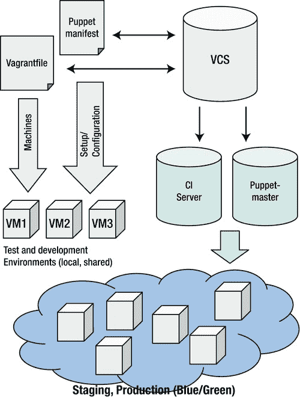
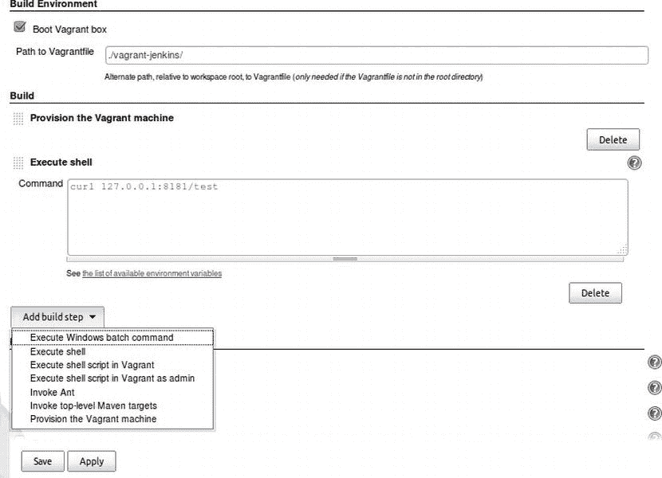
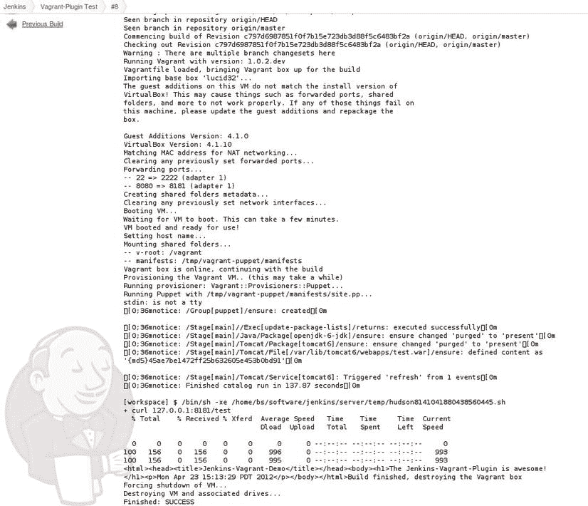

# 九、基础设施作为代码

犯错是人之常情。将错误自动传播到所有服务器是#devops。

——奉献波拉特

近年来，持续集成、测试驱动开发、构建/部署自动化等学科已经兴起。所有这些都是为了使软件产品生命周期中尽可能多的部分自动化。然而，主要的焦点通常是软件本身，而运行软件的基础设施通常仍然是“艺术作品”

从传统意义上来说，基础设施概括了操作系统、服务器、交换机和路由器等项目(见第三章)。根据其他定义 ，基础设施包括一个组织的所有环境以及支持服务，如防火墙和监控服务(见[第 8 章](08.html))。如今，将术语*基础设施作为代码*使用的情况非常普遍。在这种情况下，基础设施通常被认为包括解决方案的每个部分，而不是开发的软件应用程序本身(尽管有时甚至包括软件)。从这个意义上来说，基础设施意味着包括中间件(比如带有配置文件的 web 服务器、作为操作系统一部分的软件包、crontabs、技术用户等等)。

在软件投入生产之前，基础设施就已经建立并随着时间的推移而改变。如果你幸运的话，基础设施有很好的文档记录，但是如果需要的话，从零开始重建基础设施往往不是一件容易的事情。

“Perl 是为自动化系统管理而设计的编程语言。前沿系统管理员很快就意识到，手工配置和不可复制的咒语不是经营他们的商店的好方法。” [<sup>2</sup>](#Fn2)

作为代码的基础设施最近变得流行，强调需要以处理代码开发的相同方式来处理基础设施的设置:选择正确的语言或工具来完成工作，并开始开发适合您需求的解决方案，使其成为可执行的规范，可以有效地重复应用于目标系统。

本章介绍了用于管理虚拟化开发环境的工具流浪者、[、 <sup>3</sup> 、](#Fn3)，以及用于管理基础设施项目的工具 Puppet、[、 <sup>4</sup> 、](#Fn4)，这些项目通常也称为配置。之后，我们将探索一个真实世界的使用，它是基于构建服务器 Jenkins 的开发是如何被 vagger 和 Puppet 简化的。

从基础设施作为代码开始

甚至在敏捷软件开发 和 DevOps 运动 兴起之前，基础设施的设置和维护就已经自动化了。但是经常会有手工制作的、照本宣科的解决方案，除了原作者之外，其他人很难读懂。近年来，配置管理领域的一些工具开始流行起来，以应对这些挑战。这些工具有助于开发人员和运维人员协同工作，并在基础设施层面实现更高的透明度。毕竟，在当今日益复杂和分布式 IT 系统的世界中，开发人员越来越需要了解运维方面的事情，反之亦然。基础设施即代码范式及其相关工具有助于实现这一目标。

在我们进入更多细节之前，有两个关键问题需要解决:

*   我为什么要采用基础设施作为代码？
*   我应该怎么做？(可以用哪些工具？)

为了回答这些问题，让我们首先考虑一下开发一个典型的 web 应用程序时基础设施建立的过程。

传统基础设施处理

在第一阶段，由于架构尚未确定，开发人员将尝试组件，最终完成设置的初稿。现在，每个开发人员都已经建立了自己的本地开发环境，所有组件都在机器上运行。在这一点上，甚至可能没有一个共享的环境来持续地部署软件。这将是下一步。根据组织的结构，这可能已经是不允许开发人员完全访问目标机器 的界限了，他们必须为运维团队提供某种关于如何启动的帮助。QA、试运行和生产环境也可能发生同样的情况。事实上，如果没有新的组件被添加到基础设施中，至少组件的配置可能会不断地改变。

每次开发人员在他们的本地或测试环境中进行尝试时，他们会将基础设施的变化报告给操作人员，然后操作人员会调整其他环境。如果你在一家初创公司或年轻的小公司工作，你可能会说这是胡说八道。但不幸的是，在大型企业中，这往往是一个严酷的现实，很明显，有很多潜在的错误和误解。没有文档和在 Office 文档中记录基础结构这两个选项都不是最理想的。

此外，如果团队中增加了新的开发人员，也会出现同样的问题。如果设置没有完整的文档记录，或者有人试图编写一个脚本来至少完成部分设置，或者有文档记录但已经过时，新的开发人员可能会努力让一切顺利运行，并且发现错误可能是大海捞针。没有一个集中的、版本化的基础设施版本可以被认为是始终可运行的。

如何做得更好

现在，让我们想想什么对所有相关人员更好。假设新开发人员不必手动设置或部分借助于一些脚本(更不用说脚本可能不适合开发人员的操作系统，或者开发人员已经有其他东西在他或她的机器上运行，这可能会干扰项目设置)，而是可以让他们编写可执行的规范，根据需要利用虚拟化来动态创建和破坏他们的测试环境。

让新的开发人员加入进来，只需要让他们从版本控制库中检查出规范，执行它，并使用与他们的同事相同的环境。如果团队决定对基础设施的更改已经达到了稳定的水平，那么可以使用规范来更新任何共享环境 (例如，用于验收或集成测试)，并且可以将规范传递给操作团队，操作团队可以将规范重新用于试运行和生产环境。听起来很棒，不是吗？

在过去的几年里，出现了许多工具来解决这些问题。有些工具在 DevOps 和 infrastructure as code 等术语出现之前就已经存在了，但是这些运动有助于进一步推广这些工具的使用，并促进了整个社区的发展。

在这一章中，我将介绍两个工具:流浪者 和傀儡 。流浪者允许你基于简单的文本描述，轻松构建轻量级和可移植的虚拟环境。Puppet 是一个配置管理工具，它使用声明性语法来描述目标环境的期望状态，并允许执行该描述来在目标机器上创建该状态。结合起来，这可以导致一个目标拓扑 y ，类似于图 9-1 中所示。



[图 9-1](#_Fig1) 。*基础设施的一个示例拓扑结构是由存储在版本控制系统中的流浪者和傀儡工件组成的代码，通过持续集成(CI)服务器持续构建。*

在解决方案的中间，使用了 vagger 来设置测试和开发环境 (作为虚拟机)。Puppet 用于提供基础设施。

流浪者和傀儡的配置文件 都在一个版本控制系统中版本化，具有其所有的好处，包括变更控制和在整个团队中共享变更。持续集成(CI)服务器(如 Jenkins)会监听版本控制中的变化，并自动将新版本传播到目标环境进行测试。听起来像魔术？是的，但是不要让它吓到你。我们将在本章中更详细地研究这一点。现在，让我们从测试环境开始。

用流浪者测试环境

流浪者允许你以一种简单的方式建立虚拟环境 ，基于所谓的流浪者文件中的文本规范。从头开始创建虚拟环境只需要这个文件。

虚拟环境

术语*虚拟环境*描述了一种交付独立于物理机器的计算资源的方式。虚拟环境可以运行虚拟桌面、服务器或其他虚拟设备。虚拟环境的优势在于，它可以更高效地利用物理资源，同时避免成本高昂的过度配置。

流浪者基于 Ruby [<sup>5</sup>](#Fn5) 并使用 Oracle VirtualBox[<sup>6</sup>](#Fn6)来运行虚拟机，所以在继续安装之前你需要这些。最简单的方法是通过 RubyGems 安装 vagger:

```
> sudo gem install vagrant
```

如果一切顺利，您应该会看到类似如下的输出:

```
Fetching: vagrant-1.0.2.gem (100%)
Successfully installed vagrant-1.0.2
1 gem installed
Installing ri documentation for vagrant-1.0.2\.  .  .
Installing RDoc documentation for vagrant-1.0.2\.  .  .
```

现在你可以开始建立你的第一个流浪环境了:

```
> mkdir -p vagrant/test
> cd vagrant/test
> vagrant box add lucid32 http://files.vagrantup.com/lucid32.box
> vagrant init lucid32
```

Add 命令会从给定的位置下载一个 的流民基盒。在给定的别名下将它添加到系统中，并将其存储在$ HOME/. vagger 中。基本框是 vagger 创建虚拟环境的初始构建块。为了使这里的生活简单，我们坚持使用流浪者队提供的 Ubuntu 10.4 盒子 。第二个命令在当前目录中创建一个流浪者文件。这个初始的流浪者文件 包含了许多关于几个可用选项的文档，所以值得一看。第一行应该类似于清单 9-1 中所示的内容。

***[清单 9-1](#_list1) 。**最初的流浪档案*

#每个流浪的虚拟环境都需要一个箱子来建造

config.vm.box = "lucid32 "

#将出现“config.vm.box”框的 url

#如果用户系统中不存在，则获取。

# config . VM . box _ URL = " http://domain . com/path/to/above . box "

目标

唯一未注释的选项是用来构建环境的基础框的名称。这是我们刚刚添加到系统中的 Ubuntu 盒子。您可以看到，还可以添加一个 URL 来指定可以从哪里下载基本框。特别是如果你认为你会在一个团队中使用流浪者，这是一个重要的选择，使你的流浪者文件可移植。如果在他或她的系统中没有基本盒的人使用了这个文件，那么这个文件将会被下载。

一个流浪的盒子

一个“盒子”是用来创建一个有流浪者的虚拟环境的基础图像。它是一个可移植的文件，可以由任何平台上的其他人使用，以便调出一个运行的虚拟环境。

对于第一步，这就是所需要的。虽然你的虚拟 Ubuntu 盒子现在，你已经可以通过输入:

```
> vagrant up
```

这将产生类似于清单 9-2 中[所示的输出](#list2) 。

***[清单 9-2](#_list2) 。**启动流浪者*后的输出示例

[默认]导入基本框' lucid32 '。。。

[默认]此虚拟机上的来宾添加项与

安装 VirtualBox 版本！这可能会导致以下情况

转发端口、共享文件夹等无法正常工作。

如果这些在这台机器上失败了，请更新

客人添加并重新包装箱子。

来宾添加版本:4.1.0

VirtualBox 版本:4.1.10

[默认]匹配 NAT 网络的 MAC 地址。。。

[默认]清除任何以前设置的转发端口。。。

[默认]转发端口。。。

[默认值] - 22 => 2222(适配器 1)

[默认]创建共享文件夹元数据。。。

[默认]清除任何以前设置的网络接口。。。

[默认]启动虚拟机。。。

[默认]等待虚拟机启动。这可能需要几分钟时间。

[默认]虚拟机已启动并准备就绪！

[默认]装载共享文件夹。。。

[默认值]-v-root:/vagger

可以看到，vagger 首先导入并选中 base 框(暂时忽略警告)，设置端口转发和共享文件夹，然后引导虚拟机。包含 travel 文件的文件夹作为共享文件夹挂载到虚拟机 的/travel 下。

恭喜你，你已经成功创建了你的第一个流浪虚拟环境！现在你可能想登录它，做一些有趣的事情。正如我们在[清单 9-2](#list2) 的日志输出中看到的，vagger 创建了一个从来宾(虚拟机，简称 VM)端口 22 转发到主机(您的机器)端口 2222 的端口，因此这是一个使用 vagger 的默认帐户登录的选项(每个 vagger 框都有一个密码为 vagger 的用户 vagger)。登录到任何游民暂居箱的更标准方式是键入:

```
> vagrant ssh

```

在命令行中，您将会登录。

在默认设置下，除了默认的端口转发之外，您的机器对外界不可见。然而，要将其用作测试系统，您需要更多的组件。实现这一点的一个方法是定义自己的端口转发。让我们假设我们想要在机器上设置一个 web 服务器,并通过主机端口 8001 使它可用。在流浪者档案中会是这样的:

```
Vagrant::Config.run do |config|
config.vm.box = "lucid32"
config.vm.forward_port 80, 8001
end
```

要使您的配置中的这一更改可见，请重新加载 您的流浪环境:

```
> vagrant reload
```

这将关闭并重启 具有新配置的机器。现在，登录你的机器，安装 Apache，你将能够在 [http://localhost:8001](http://localhost:8001) 看到 web 服务器的默认页面。

```
> vagrant shh
lucid32> sudo apt-get update
lucid32> sudo apt-get install apache2
lucid32> nano /var/www/index.html
```

最后，如果您不再需要您的环境，您可以停止、暂停或销毁 它:

```
> vagrant halt|suspend|destroy
```

暂停和挂起会保留虚拟机的状态(即底层 VirtualBox 虚拟机不会被删除)。如果您销毁了一个盒子，您所做的所有更改都将丢失。

纯主机网络、多虚拟机环境

您可能已经想到，为测试系统上的每个组件设置端口转发并不真正有效，您是对的。除此之外，我们最初的目标之一是创建类似生产的环境，以便尽早消除配置错误。说到类似生产，相信所有的服务都只在一台主机上运行是不现实的，所以用一个浮动文件处理几个虚拟机也是不错的。幸运的是，vagger 以纯主机网络和多虚拟机环境的形式解决了所有这些问题。

顾名思义，多虚拟机环境 允许您用一个浮动文件处理多个机器。如果您在 vacant 中定义了多个机器，那么您需要将机器的名称添加到 vacant 命令中，以便让它知道引导、销毁、ssh 进入哪个机器，等等。大多数命令没有名字就可以工作，然后将应用于当前的流浪者文件中定义的所有盒子。

另一个功能是仅主机联网 ，使您能够为虚拟机分配静态 IP 地址，这些地址只能从主机访问。只要您没有为机器配置单独的网络掩码，它们也可以互相看到。

清单 9-3 显示了这两个特性的一个例子。

***[清单 9-3](#_list3) 。**纯主机网络、多虚拟机环境的示例*

vagger::config . run do | config |

config.vm.box = "lucid32 "

config . VM . box _ URL = " http://files . vango up . com/lucid 32 . box "

config . VM . define:web do | web | web

web.vm.network :hostonly，" 33.33.33.11 "

目标

config.vm.define :db do |db|

db.vm.network :hostonly，" 33.33.33.12 "

目标

目标

运行 Up 命令会创建两个虚拟机。您可以通过以下方式登录:

```
> vagrant ssh web|db
```

在指定的 IP 地址下，可以从您的计算机访问这两个虚拟机。

使用 Puppet 进行供应

现在我们已经介绍了基础知识，我们终于可以进入主题了:将基础设施的设置作为代码来处理。到目前为止，我们只创建了一些轻量级虚拟机。这很方便，但最终，我们希望创造出配有软件和配置的机器。

由于 vagger 还提供了一种配置供应的机制，我们将坚持使用它来介绍下一个工具 Puppet。如前所述，Puppet 是一个基于 Ruby 的配置管理工具。它允许您创建所谓的清单 ，其中包括对相关系统的描述。

流浪者还允许您使用其他供应工具，如厨师， [<sup>7</sup>](#Fn7) 或用外壳脚本做供应，但我们在这里将集中于木偶。

让我们回到上面使用的小型 Apache web 服务器 的例子，检查我们的 VM 是否启动并运行，并在 Puppet 的帮助下重建它。首先，我们需要告诉流浪者它应该使用 Puppet 进行供应，以及在哪里可以找到 Puppet 清单，如[清单 9-4](#list4) 所示:

***[清单 9-4](#_list4) 。**在流浪者中配置木偶*

vagger::config . run do | config |

config.vm.box = "lucid32 "

config . VM . box _ URL = " http://files . vango up . com/lucid 32 . box "

config.vm.network :hostonly，" 33.33.33.10 "

config . VM . provision:puppet do | puppet

puppet . manifests _ path = " manifests "

puppet . manifest _ file = " web server . PP "

目标

我们告诉 vagger 在 manifests 文件夹中查找 Puppet manifests，并在那里使用文件 webserver.pp。在我们仔细研究这个清单的内容之前，让我们快速地看一下 Puppet 是如何工作的。Puppet 使用特定于领域的语言以资源的形式描述系统。资源几乎可以是任何东西，从普通文件到软件包、服务，甚至是命令执行。然后，可以将这些资源分组到类、模块和节点定义中。请访问优秀的在线 Puppet 文档以了解更多信息。

这是一个傀儡资源 的样子:

```
<resource type> { "resource-name":
 attribute_name => attribute_value,
 .  .  .
}
```

它由某种资源类型(例如文件、组)、名称和一系列键值对形式的属性组成。记住这些基础知识，让我们看看我们的 web 服务器 清单，如[清单 9-5](#list5) 所示:

***[清单 9-5](#_list5) 。**傀儡清单配置网络服务器*

#修复 lucid32 框中丢失的木偶组

群组{“傀儡”:

确保= >存在，

}

#更新过期的软件包列表

exec { "刷新-软件包":

command = > "/usr/bin/apt-get update "，

before => Package["apache2"]，

}

包{ "apache2 ":

确保= >已安装，

}

服务{ "apache2 ":

确保= >运行中，

require => Package["apache2"]，

}

file { "/var/www/index.html ":

确保= >文件、

# 内容= >【流浪儿与傀儡岩！

“,

require => Service["apache2"]，

}

第一个资源声明名为 puppet 的组应该出现在所讨论的系统上。如果不是这样，Puppet 将继续创建该组。可以在许多 Puppet 资源上找到确保参数，以指定资源的期望状态。下一个资源是一个命令执行来刷新 Ubuntu 包 库列表。接下来的两个资源告诉 Puppet 操作系统的底层包管理器应该安装‘Apache 2’包 ，如果它还没有安装的话，并且相关的服务应该正在运行。最后，最后一个资源改变了默认 Apache 索引页面的内容。

您可能会注意到，一些资源像以前一样有参数，并且需要所谓的元参数 。它们表示 Puppet 的资源之间的依赖关系，因为它本身没有保证其资源的执行顺序。包和服务之间的依赖是典型的，因为显然包需要在 Puppet 检查相关服务是否启动和运行之前安装。

如果您现在启动这个虚拟机，您将会看到更多的输出,而不是在没有配置的情况下运行 vanguard，并且在一切完成后，您可以转到[http://33.33.33.10](http://33.33.33.10)并查看修改后的索引页面。

使用 vagger 进行持续集成

在阅读以上内容时，您可能已经考虑过将这些工具集成到您的持续集成设置中，以便动态地创建测试环境。如果你使用流行的 Jenkins CI 服务器，已经有一个插件，由泰勒·克罗伊编写。它向 Jenkins 添加了新的构建步骤，以便在构建作业期间运行和提供流浪盒。只需使用 Jenkins 插件管理页面安装插件，然后创建一个新的作业并进行配置，如图[图 9-2](#Fig2) 所示。



[图 9-2](#_Fig2) 。*配置的流浪汉为詹金斯建造的T5】*

您可以看到，我们已经勾选了该框，告诉 Jenkins 在作业过程中运行 vagger，并告诉它在哪里可以找到 vagger 文件。然后，在构建本身中，执行了 page 的供应步骤(这里不是在引导机器时)，最后，我们使用 cURL，一个用于传输数据的命令行工具(参见 [http://curl.haxx.se](http://curl.haxx.se) )，来检查 web 服务器是否启动并运行，以及是否为我们的演示索引页面提供服务。

如果您运行该作业，并转到 Jenkins 中的控制台输出，您可以看到执行了所有上述步骤，如图 9-3 所示。



[图 9-3](#_Fig3) 。*詹金斯建立工作输出*

在一个真实的场景中，您可能会在这个构建中混合几个项目:一个包含您的基础设施规范和浮动文件，您想要测试的应用程序，可能是另一个包含某种部署自动化的项目(例如，使用 Maven 和 cargo-plug-in)，最后是某种针对虚拟环境执行的验收或集成测试项目。

使用这种类型的设置，可以及早发现所有环境的配置差异，并在它们导致问题之前将其消除。

在撰写本文时，针对 Jenkins 的 travel 插件仍处于早期开发阶段。在测试中，纯主机网络在其开发的早期阶段并不可靠，但尽管如此，该插件已经非常有助于向开发人员和系统管理员提供更快的反馈。此外，由于它是开源的，只要去 GitHub [<sup>8</sup>](#Fn8) 并开始贡献如果你发现任何错误。

补充工具

关于流浪汉还有什么好说的？到目前为止，我们只使用了 Ubuntu base box，它可以从 vagger 网站获得，但是很可能您想要使用其他操作系统来建立您自己的环境。关于如何用 VirtualBox 构建你自己的盒子并打包以备后用的文档可以在流浪者的主页上找到。另一个选择是查看 http://vagger box . es，这是一个网站，列出了由流浪者社区成员建立并发布供下载的盒子(即不同操作系统的模板)。

第三个选择是使用开源工具 Veewee 、[、 <sup>9</sup> 、](#Fn9)，这使得为流浪者建造新的基础盒子更加容易。从 1.0 版本开始，vagger 也提供了编写插件的支持，那里会有什么样的演变还有待观察。查看流浪者页面了解更多信息(见[http://vagrantup.com/](http://vagrantup.com/))。还有一个互联网中继聊天频道和一个谷歌群的链接，在那里你会发现志同道合的人愿意提供帮助。

您可以用一个简单的文本编辑器编辑 Puppet 清单和模块，但是为了拥有自动完成和其他不错的特性，您可能更喜欢使用 Geppetto 、 [<sup>10</sup>](#Fn10) ，这是基于 Eclipse 构建的。您可以使用 puppet-lint 检查 Puppet 清单是否符合样式指南。 [<sup>11</sup>](#Fn11) 另一个有用的工具是 guard-puppet， [<sup>12</sup>](#Fn12) 它有助于自动重新应用傀儡配置。

像黄瓜木偶 [<sup>13</sup>](#Fn13) 和木偶木偶木偶 [<sup>14</sup>](#Fn14) 这样的工具有助于测试你的清单。他们让您为您的清单编写 Cucumber 和 RSpec 测试 ，以确保它们都符合您的清单策略。使用 puppet-rspec，测试遵循以下结构:

```
require 'spec_helper'
describe '<name of the thing being tested>' do
  # Your tests go in here
end
```

所有这些整洁的工具都有助于将测试驱动开发的实践(TDD)[<sup>15</sup>](#Fn15)应用到 Puppet 清单中，并将 Puppet 清单添加到您的持续集成和持续交付系统中。

使用 Puppet 进行供应

我们看到了使用 Puppet 和 vacator 一起管理虚拟环境的好处。这对于开发团队来说已经很有用了，也可以根据需要用来建立和拆除 QA 环境。但是 Puppet 还有更多功能，它的实际角色是管理各种类型的环境，无论是开发环境还是生产环境。让我们看看如何设置一个傀儡服务器，它将所有受管节点的配置存储在一个中央位置，并根据需要分发它们。

建立一个傀儡主人

要开始，我们首先需要在本地系统上安装 Puppet，它将是我们的傀儡主人。这是在服务器模式下运行 Puppet 并监听 Puppet 代理从那里获取配置的主机。在 Ubuntu 中，安装非常简单:

```
> sudo apt-get install puppet
```

这将在您的本地机器上安装 Puppet，并将配置文件放入/etc/puppet 。为了使例子简单，我们启用了新的傀儡客户机的自动签名，以避免在傀儡主人和客户机之间签名和交换证书。在生产环境中，您不应该这样做。要启用自动签名，将 autosign.conf 文件放入/etc/puppet 中，包含以下内容:

```
*.example.com
```

这将自动签署来自具有匹配主机名(例如，web01.example.com)的客户端的所有证书请求，并且在主设备和客户端可以相互通信之前，消除进行证书交换的额外步骤。现在，重新启动木偶大师，使我们的变化可见:

```
> sudo /etc/init.d/puppetmaster restart
```

建立一个傀儡客户端

现在我们准备设置一个充当傀儡客户机 的主机。同样，我们使用 vacator 来建立一个主机。新建一个流浪者文件，内容如[清单 9-6](#list6) 所示:

***[清单 9-6](#_list6) 。**配置一个傀儡客户端*

vagger::config . run do | config |

config.vm.box = "lucid32 "

config . VM . box _ URL = " http://files . vango up . com/lucid 32 . box "

config.vm.network :hostonly，" 33.33.33.33 "

config . VM . host _ name = " node 01 . example . com "

目标

启动这个盒子，宋承宪进入其中。为了最终使它能够连接到您的傀儡主机，我们必须在/etc/hosts 中添加一个带有傀儡主机的 IP 地址和主机名的条目。此外，我们需要向系统添加一个组“木偶”，这是 lucid32 框 中所缺少的。现在您的虚拟主机可以运行傀儡代理了。通常情况下，代理会定期在后台执行守护程序，向主服务器请求最新配置。为了说明幕后发生了什么，我们将在这里手动运行。

```
> puppet agent --test --server <puppetmaster hostname>
```

这应该会产生类似于[清单 9-7](#list7) 的输出:

***[清单 9-7](#_list7) 。**测试傀儡代理的输出*

简介:为 node01.example.com 创建一个新的 SSL 密钥

警告:在此 SSL 会话中将不会验证对等证书

信息:缓存 ca 的证书

警告:在此 SSL 会话中将不会验证对等证书

信息:为创建新的 SSL 证书请求

node01.example.com

信息:证书请求指纹(md5):

1f:7d:07:3e:fc:0e:8f:67:18:a16:DC:8d:来源:E7:4A:2E

警告:在此 SSL 会话中将不会验证对等证书

信息:node01.example.com 的缓存证书

信息:缓存 ca 的证书撤销列表

错误:无法从远程服务器检索目录:上的错误 400

服务器:找不到默认节点或名称

节点上的 node01.example.com，node01.example，node01 '

node01.example.com

警告:未对失败的目录使用高速缓存

错误:无法检索目录；跳过跑步

您会看到代理和主服务器交换证书，并且主服务器尝试为请求节点查找目录。因为我们还没有配置任何东西，所以代理没有收到任何信息并中止运行。如果代理将被守护化并在后台运行，它将在配置的时间间隔内轮询主服务器，询问是否有新的或更改的目录可用。如果是这种情况，目录将在客户机上执行。

现在，让我们写一个简单的节点定义 。在你的本地机器上，转到/etc/puppet/manifest，为节点 创建一个文件夹。然后编辑文件/etc/puppet/manifests/site.pp 并添加这一行:

```
import 'nodes/*'
```

这告诉 Puppet 导入节点文件夹中的所有文件，这是我们放置节点定义的地方。使用[清单 9-8](#list8) 中给出的内容创建一个文件 nodes/node01.pp:

***[清单 9-8](#_list8) 。**创建节点，用木偶*

节点“node 01 . example . com”{

文件{ "/tmp/test.txt ":

确保= >文件、

content = >“管用！”,

}

}

如果您在代理主机上重新运行 Puppet，您将看到 Puppet master 向在那里执行的客户机交付了一个目录。在这个简单的例子中，我们将在执行后看到文件 test.txt。

在了解了 After 和 Puppet 的特性和优点之后，我们现在准备了解一个现实世界的项目，Jenkins CI 构建服务器，是如何在其 DevOps 方法中运行这些工具的。

用例:使用 Puppet 的开源基础设施

你有没有从某个 ASF(Apache Software Foundation)项目下载过. jar 文件，下载过 Debian。来自 kernel.org 的 iso，或者只是在维基百科上读一篇文章？你有没有停下来想一想这些碎片是如何从一个地方到你这里的？谁运行这些机器，建立这些网络，当所有这些都中断时，谁接收这些页面？

功能性基础设施是蓬勃发展的开源生态系统中经常被忽视但却是必要的组成部分。在上面的例子中，可能有一些人的兼职或全职工作是关心和维护这些系统。

这些都是很大很重要的项目，那么我们其他人呢？

需要，从詹金斯的**观点看**

对于像詹金斯([http://jenkins-ci.org](http://jenkins-ci.org))这样的项目来说，基础设施需求已经变得足够大，以至于它不再适合一个“铁匠铺”或者可以舒适地托管在某个社区成员的 Linode 实例上。詹金斯在多个地方拥有多台机器，比如 OSU OSL([http://osuosl.org](http://osuosl.org))甚至在亚马逊的 EC2。

最初，Jenkins 用的是老式的方法，也就是说错误的方法:手工制造一台又一台机器，调整配置，直到产品在机器上运行。这种情况一直持续到一个(非常)昂贵的错误配置导致一台机器无意中提供了超过预期的许多 TB 的数据，Jenkins 只是在有人收到超额账单后才注意到并纠正了这个昂贵的错误。

在这个“事件”之后，Jenkins 开始将 Puppet 整合到他们的管理工具包中，以满足一些关键的目标。基础设施应该是:

*   可测试的(当然是在生产之外)
*   可审计的
*   透明

不幸的是，将现有的手工制作的基础设施迁移给 Puppet 管理是一个漫长而乏味的过程。想象一下，在飞行中途重建一个喷气发动机，同时试图保持稳定的高度；那很难。

詹金斯怎么了

从一开始，詹金斯的木偶作品就已经嫁给了流浪汉。vagger 将与 Puppet 巧妙地集成在一起，允许用户毫不费力地调出一个基于 Linux 的虚拟机，并为其提供 Puppet。让我们更详细地了解不同的方面。

奔跑的木偶

Puppet 可以以两种方式运行:客户机-服务器架构和“独立模式”，前者是更常见的用例。客户端-服务器模式有它的好处，例如能够立即推动变化，或者从所有节点收集所谓的事实，但对于 Jenkins 来说，使用的是独立模式。

Jenkins 想引入一种方法来消除额外的服务依赖；位于多个位置意味着客户机-服务器模型有两种选择:在一个位置引入单点故障，或者在每个位置部署一个傀儡主机。

还有一个简单的问题；由于通过利用这种独立模式，vagger 与 Puppet 进行了集成，Jenkins 以一种与生产环境更加一致的方式在本地有效地测试了它们的清单。

权衡

正如你所料，放弃客户机-服务器模式意味着 Jenkins 不得不自己复制一些功能。例如，由于 Jenkins 不能将更新推送到机器上，Jenkins 有一个从 Git 自动更新每台机器的模块。这个模块，如清单 9-9 中的[所示，管理定期从 Git 库获取更新，并运行每台机器的根](#list9) [<sup>16</sup>](#Fn16) 清单:

***[清单 9-9](#_list9) 。**管理 Git 拉取请求并运行根清单*

类别自动更新{

包含自动更新::安装程序

Class[" auto update::setup "]--> Class[" auto update "]

克朗

“拉动木偶更新”:

command = > "(CD/root/infra-puppet & & sh run . sh)"，

user => root，

分钟=> 15，

确保= >存在；

#最好在某个时候清理这些

“清理旧的木偶日志”:

command = > " RM-f/root/infra-puppet/puppet。*.日志”，

user => root，

小时=> 4，

分钟=> 30，

weekday => '* '，

确保= >存在；

} }

类自动更新::安装{

执行

"setup_git_repo" ：

cwd => "/root "，

creates => "/root/infra-puppet "，

command = > " git clone git://github . com/jenkinsci/infra-puppet . git "，

require => Package["git-core"]，

#如果是新机器，我们可能已经有了

除非=> "test -d /root/infra-puppet/。git”，

path => ["/usr/bin "，"/usr/local/bin"]，

}

}

还因为 Jenkins 没有使用客户端-服务器模块，这意味着 Jenkins 不能利用 Puppet 模块依赖管理中的一些最新发展(示例用法:[http://Puppet labs . com/blog/using-Puppet-modules-to-install-and-manage-WordPress](http://puppetlabs.com/blog/using-puppet-modules-to-install-and-manage-wordpress))。采用的方法是使用 Git 子模块来管理对要重用的其他模块的依赖性，例如:

*   puppetlabs-stdlib :许多 puppetlabs 模块的公共依赖
*   puppet labs-防火墙:用于管理 iptables 规则
*   puppetlabs-ntp :用于自动设置 ntp、crons 等等
*   puppet-sshd :用于管理 sshd \ _ configs 并保持守护进程运行
*   puppet-concat :用于管理或连接不支持 conf.d/ style 目录的服务的配置
*   puppet-postgres:设置 PostgreSQL 权限、数据库等等

有了傀儡-模块-工具， [<sup>17</sup>](#Fn17) 傀儡可以在傀儡锻炉(见【http://forge.puppetlabs.com】T4)上创建、安装和搜索模块，在那里可以找到和分享傀儡模块。从 puppet 版本 2.7.12 开始，puppet-module-tool 已经被移到了核心中。

大多数 Puppet 模块都发布到 Puppet Forge，但是它们的源代码通常位于 Github 上，这使得它们很容易作为子模块添加，例如:

```
> cd project-root
> git submodule add git://github.com/puppetlabs/puppetlabs-firewall.git modules/firewall
> git commit -m "Add the firewall module to manage iptables"
```

在它被添加到树中之后，在特定的机器上使用它就足够容易了(注意:防火墙模块添加了一些资源，一些模块可能需要一个“include”才能正确使用)，如[清单 9-10](#list10) 所示:

***[清单 9-10](#_list10) 。**通过添加防火墙设置扩展我们的配置*

防火墙{

000 接受所有 icmp 请求' :

这就是为什么，

action = >“接受”；

001 接受入站 ssh 请求' :

因此= >

port => 22，

action = >“接受”；

#等等，等等

}

子模块方法可能是一把双刃剑，如果你不小心，它会伤到你。一方面，在添加子模块时，您已经获得了某种程度的内置版本冻结。但是如果子模块更新得太频繁，或者处于不断的迭代中，那么您将仅仅为了更新子模块引用而提交超项目。

无论使用客户机-服务器还是独立的方法，重用 Puppet Forge 中的现有模块都是一个好的决定，可以帮助快速启动项目，让您专注于您的特定需求，而不是重新发明轮子。

真相来源

与客户机-服务器模型相比，这种独立设置的另一个主要区别是 Puppet 管理的机器的“真实来源”。在传统的客户机-服务器体系结构中，傀儡师是老板，老板说什么，就去做什么。在 Jenkins 设置中，GitHub 是我们唯一的真相来源。这意味着无论我们存储库中“主”分支的状态如何，那都是机器的状态(相差 15 分钟)。

这种方法的第二个主要好处是 Jenkins 可以通过 GitHub pull 请求轻松地接受对基础设施的贡献。您可以提交一个 pull 请求(理论上),在 Jenkins 基础设施上添加一个全新的服务，并且它可以在没有“核心”团队允许您访问硬件本身的情况下被审查和合并。

用流浪者测试

詹金斯从我们的木偶设置中获得的很多灵活性并不仅仅来自木偶，而是木偶和流浪者的结合。很难想象还有比这更方便的方式，在不到 40 分钟的时间里建立一个完整的 BIND9 名称服务器 [<sup>18</sup>](#Fn18) 。

Jenkins 需要一个域名服务器，而且很快就需要一个。幸运的是，它已经建立了一个现有的 Puppet 基础设施，所以添加名称服务器并不需要太多工作。

先做最重要的事情；Jenkins 创建了一个分支来完成这项工作，然后设置了一些文件夹(为了保护无辜，更改了一些路径):

***[清单 9-11](#_list11) 。**将 BIND9 添加到我们的配置中*

> git checkout -b 构建名称服务器-快速

> mkdir -p 模块/绑定/清单模块/绑定/文件

> vim 模块/bind/manifest/init . PP

在大约 10 分钟查找包名之后，他们定义了一组基本的资源来组成一个简单的基于 BIND9 的名称服务器，如清单 9-11 所示:

#现在跳过类声明

包{

绑定' :

确保= >存在，#确保软件包安装在 Ubuntu 上

name = > ' bind9

}

服务{

“绑定”:

确保= >正在运行，#确保在启动时启动并运行它

require => Package['bind']，

name = > ' bind9

}

#打开我们的防火墙(由 puppetlabs-firewall 提供),允许

#基于 TCP 和 UDP 的 DNS 流量

防火墙{

“900 接受 tcp DNS 查询”:

这就是为什么“=”，

port => 53，

action = >“接受”；

“901 接受 udp DNS 查询”:

这就是为什么，

port => 53，

action = >“接受”；

}

如果你以前安装过 BIND，你会知道安装和运行并不是最难的部分。这是令人困惑的，变化无常的配置文件，真的很难得到正确的。使用“流浪者”,我们将进入一个紧密的绑定-挫折-迭代循环:

```
> vagrant up # also provisions when the VM is online
> vagrant ssh # Log into our VM
# Check to make sure that everything looks right, oh wait, no it doesn't,
# why are you doing that BIND? Why! Argh! You're so stupid! Don't act like
# that or I'll shut you down, that's it!
> vagrant destroy # I'll show BIND who's boss!
> vim init.pp # Okay, where'd we go wrong.
```

就你的情况而言，你可能不会像詹金斯那样频繁地使用流浪毁灭命令，但是很难长时间不把石板擦干净(就像“毁灭”命令所做的那样),并且仅仅用你的纯傀儡清单重新开始。

在“快速构建一个名称服务器”项目的第 35 分钟左右，Jenkins 启动并运行了一些东西，并从一台本地机器上运行 dig(1)来对抗运行在 travag VM 中的名称服务器，在将代码发送到 GitHub 之前进行最后的检查，以确保一切都完全正常:

```
> git commit modules/bind -m "Long and descriptive commit message should go here"
> git push origin
```

15 分钟内，适当的机器上线，成为经过全面测试、代码审查、可复制且功能正常的名称服务器。

完整的圆

不幸的是，Jenkins 项目的目标不是构建一个教科书式的基础设施，而是构建一个能够工作并保持工作的基础设施，因此 Jenkins 可以专注于构建一个一流的 CI 服务器(Puppet Labs 使用的服务器，我们可以在此添加:[http://jenkins.puppetlabs.com](http://jenkins.puppetlabs.com))。我们可以每天回去，弄清楚事情是如何以及为什么是这样的，这些都在 Git 存储库中。

多亏了 Puppet，加上少量的流浪者，许多事情不需要太多的手动就可以“工作”,这就是 Jenkins 能够在没有大规模投资的情况下拥有大型基础设施的原因。

接下来去哪里找？

Puppet 可以和奥革阿斯 [<sup>19</sup>](#Fn19) 一起使用，让你不需要使用模板就可以修改现有文件。

如果您开始在许多主机上使用 Puppet，那么您可能希望更仔细地查看 Puppet 仪表板，这是一个 web 应用程序，允许您监视所有 Puppet 管理的节点的状态。

您可能想看看 PuppetDB， [<sup>20</sup>](#Fn20) ，这是一个傀儡数据仓库，用于管理、存储和检索所有平台生成的数据 。

还有许多由社区创建的现有木偶模块，您可以在 Puppet Forge 中找到，这是一个可重用木偶模块的存储库。

所有提到的工具都在它们的网页上提供了大量的文档，并且有邮件列表、Google groups、Internet relay 聊天频道，甚至全部都有。查看他们的网站以获取更多信息。

如果你想寻找更多关于木偶的文献，有两本新书可供选择:詹姆斯·特恩布尔(James Turnbull)和杰弗里·麦丘恩(Jeffrey McCune)的 *Pro Puppet* 和约翰·阿伦德尔(John Arundel)的*木偶 2.7 食谱*(Packt Publishing，2011)。前者很好地全面介绍了 Puppet，还涵盖了高级主题和许多最佳实践。后者包含了很多小而易重复使用的食谱来解决你日常的木偶问题。

可供选择的事物

在《流浪者和木偶》中，我们研究了两个可以帮助你开发、测试和操作的工具。然而，这些工具的选择完全是基于我的个人偏好，并且有许多其他的配置管理框架，另外两个大的开源工具是 CFEngine[<sup>21</sup>](#Fn21)和 Chef 。

CFEngine 是这些开源工具中最古老的，其最初的努力可以追溯到 1993 年。《木偶》和《厨师》的最初版本分别是 2005 年和 2009 年。由于它的年龄，CFEngine 可能是最广泛的，然而，近年来，Chef 和 Puppet 都获得了一个强大的社区，并被许多初创公司和年轻公司使用。也有很多工具从这两个发展而来，解决像集成驱动电子或测试驱动开发这样的主题，这可能使这两个更值得考虑。花点时间看看他们，看看你更喜欢哪一个。

也有商业的和许多不太为人所知的框架和工具可用。查看维基百科或者你经常去的开发论坛来获得更多的提示。

结论

我们只是触及了本章中提到的工具所提供的可能性的表面。还有很多东西有待发现，我希望这激起了您对使用这些或类似工具的好奇心。

随着配置管理和基础设施成为通用的代码范例，开发和操作的协作不再仅仅是一种可能，而是几乎是必要的。毕竟，每个开发人员都需要知道他或她在系统管理中的份额，每个系统管理员都必须了解架构师和开发人员为运行他们的应用程序而选择的组件。这里描述的工具可以极大地改善这两个群体之间的知识共享，并有助于使 DevOps 运动更加成功。

现在让我们进入本书讨论验收测试的最后一章。

[<sup>1</sup>](#_Fn1)【http://twitter.com/#!/devops_borat/status/41587168870797312】T4。

[<sup>2</sup>](#_Fn2) 参见麦克·洛基德斯，*什么是 DevOps？*(奥赖利，2012 年)[http://radar.oreilly.com/2012/06/what-is-devops.html](http://radar.oreilly.com/2012/06/what-is-devops.html)。

[<sup>3</sup>](#_Fn3)【http://vagrantup.com】T4。

[<sup>4</sup>](#_Fn4)【http://puppetlabs.com】T4。

[<sup>5</sup>](#_Fn5)【http://www.ruby-lang.org/en】T4。

[<sup>6</sup>](#_Fn6)【https://www.virtualbox.org】。

[<sup>7</sup>](#_Fn7)【http://www.opscode.com/chef】T4。

[<sup>8</sup>](#_Fn8)【https://github.com/】。

[](#_Fn9)[【https://github . com/Jedi 4ever/vee】](https://github.com/jedi4ever/veewee)。

<sup>10</sup>[https://github . com/cloudsmith/Geppetto](https://github.com/cloudsmith/geppetto)。

[<sup>【11】</sup>](#_Fn11)[【https://github . com/rodjek/pup pet-lint】](https://github.com/rodjek/puppet-lint)。

[<sup>12</sup>](#_Fn12)【http://rubygems.org/gems/guard-puppet】T4。

[<sup>13</sup>](#_Fn13)【http://projects.puppetlabs.com/projects/cucumber-puppet】T4。

[<sup>【14】</sup>](#_Fn14)[【https://github . com/rodjek/rspec 瞳孔】](https://github.com/rodjek/rspec-puppet)。

[<sup>15</sup>](#_Fn15)[http://www . Jedi . be/blog/2011/12/13/test driven-infra structure-with-vaggle-puppet-guard/](http://www.jedi.be/blog/2011/12/13/testdriven-infrastructure-with-vagrant-puppet-guard/)。

[<sup>16</sup>](#_Fn16) 根据目前 Jenkins 如何在【http://jenkins-ci.org】的[托管自己的生产系统的解决方案，使用 root 用户。通常，不使用根用户，而是创建并使用专用用户被认为是一种好的做法。](http://jenkins-ci.org)

[<sup>17</sup>](#_Fn17)【https://github.com/puppetlabs/puppet-module-tool】T4。

[<sup>18</sup>](#_Fn18) BIND 代表伯克利互联网域名，是域名系统(DNS)协议的一种实现。更多关于 BIND 及其版本 9 的信息可以在 http://www.bind9.net[找到。](http://www.bind9.net)

[<sup>19</sup>](#_Fn19)【http://augeas.net】T4。

[<sup>docs.puppetlabs.com/puppetdb.</sup>20](#_Fn20)

[<sup>21</sup>](#_Fn21)【http://cfengine.com】T4。