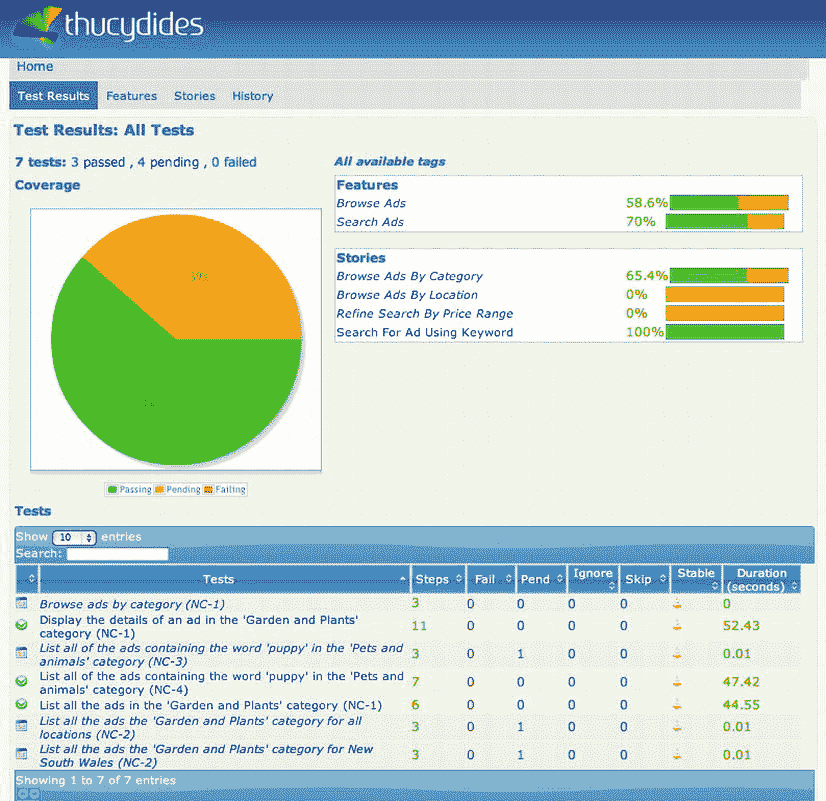

# 十、验收测试

48%开发人员正在自动化他们的测试。12%在测试他们的自动化。3%的人两者都做。

——奉献波拉特

DevOps 的一个基本原则是，任何成功通过自动化检查的构建都有可能被交付到产品中。检查可以明确地验证任何新的或更新的代码是否破坏了任何现有的特性。换句话说，它们防止回归失败。正是由于这个原因，自动化测试在 DevOps 过程中扮演着如此重要的角色。

然而，自动化测试不仅仅是在构建服务器上运行一组单元测试。仅仅有一套自动化测试是不够的:如果您打算将产品自动交付到生产中，每个团队成员还必须确信这些测试的质量，也就是说，测试是否真正捕捉到了客户对产品的期望，以及测试是否有任何信息表达能力来帮助开发人员开发解决方案。

在这一章中，我们将使用免费工具修昔底德来讨论验收测试。 [<sup>2</sup>](#Fn00102) 我们将会看到，通过提供开发软件的可执行规范，验收测试是促进开发和运维之间协作的一个好选择。工具修昔底德是实现这些测试的绝佳选择。

验收测试入门

当一个测试人员将她手工测试活动的一部分委托给一套自动化测试时，她可能会担心当整个团队参与创建可执行的验收测试时会失去一些控制。将验收测试理解为进行测试的好方法通常是一个困难的过程。开发人员(包括测试人员)作为一个团队合作，以可执行测试的形式来捕捉客户的需求，一旦他们通过了测试，团队就将它们转化为回归检查。

验收测试的一个主要好处是透明性。产品负责人应该能够准确地知道在一个特定的版本中交付了哪些特性，包括哪些有效(哪些无效)。业务分析师应该能够准确地看到故事是如何实现的。运维团队想要确切地知道哪些特性将被交付到产品中，因为他们将被期望支持这些特性。需要一个媒介来促进所有涉众之间的交流，这个媒介可以是验收测试，我们将在下面讨论。

作为交流工具的验收测试

这种对沟通的关注是自动化验收测试的典型特征，尤其是验收测试驱动的开发。事实上，自动化验收测试不仅是关于执行测试，也是关于发布和交流测试结果。

验收测试驱动的开发

验收测试驱动开发(ATDD) 是测试驱动开发(TDD)的一种高级形式，其中自动化验收标准——与用户合作定义——驱动并关注开发过程。这有助于确保每个人都了解哪些功能正在开发中。这一章通过例子讲述了 ATDD 的基本知识。

事实上，在开始开发工作之前指定验收测试的想法并不新鲜。在 20 世纪 80 年代，软件开发的 V 模型提出了在项目开始时编写的规范和项目结束时执行的验收测试之间的紧密耦合。然而，直到最近几年，软件工具和实践才出现，使得从一开始就自动化这些验收标准变得可行。

有许多方法可以传达您的验收测试的结果，并且最佳解决方案显然会因团队和项目的不同而不同。在这一章中，我们将看一个这样的解决方案。Thucydides 是一个开源库，旨在使编写和报告自动化验收和回归测试更加容易。它提供了一些特性，可以帮助您组织和构建您的接受标准，将它们与用户故事或者他们测试的特性联系起来。执行测试时，Thucydides 会生成详细的报告，包括总体测试结果的高级视图以及详细的分步文档，描述应用程序如何实现它应该提供的功能。

现在让我们通过定义验收标准来开始与修昔底德的验收测试的往返旅程。

定义您的接受标准

一般来说，ATDD 和自动化验收测试背后的一个关键概念是通过实例进行规范的思想。 [<sup>3</sup>](#Fn00103) 举例说明是指使用相对具体的例子来说明一个系统应该如何工作，而不是用非常笼统的术语来表达更正式的书面说明。

让我们看一个例子。假设我们正在做一个在线发布分类广告的网站(见[图 10-1](#Fig00101) )。在许多项目中，需求被表达为简单的用户故事，如下所示:


[图 10-1](#_Fig00101) 。*一个在线分类广告网站*

*   作为买家，为了找到最好的交易，我希望看到某个特定类别的所有可用广告。
*   作为买家，为了更快地找到我感兴趣的商品，我希望能够在描述或标题中列出所有带有特定关键字的广告。
*   作为买家，为了找到一件我买得起的商品，我希望能够按价格范围过滤特定类别的广告。
*   为了降低邮费，作为买家，我希望能够只列出特定地区的广告。

为了澄清这些要求，我们将为每一个要求商定一个验收标准列表。在第一遍中，我们会列出一组关键的例子来说明和阐明每个故事。例如，作为我们列表的一部分，我们可能会想到以下一些内容:

*   作为买家，为了找到最好的交易，我希望看到某个特定类别的所有可用广告。
*   作为买家，为了更快地找到我感兴趣的商品，我希望能够在描述或标题中列出所有带有特定关键字的广告。
*   列出“家居和花园”类别中的所有广告。
*   在“宠物和动物”类别中列出所有包含“小狗”一词的广告。
*   列出所有租金在 400 美元到 500 美元之间的房产。
*   列出新南威尔士所有待售的房产。

这些是具体的例子，有助于更清楚地描述需求。这些例子也引发了关于需求的细节和范围的讨论。例如，我们可能会发现，当限制在给定类别的广告时，按关键字搜索会更有用。因此，我们提供的例子(“在‘宠物和动物’类别中列出所有包含‘小狗’一词的广告”)说明了这个想法。

详述示例

一旦我们定义了我们的接受标准，我们就将这些例子精炼成一个更加结构化的形式，这将使得下一阶段的自动化更加容易。一种常见的方法是使用“given-when-then”结构 来阐述示例。这将焦点放在行动和预期结果上。例如，根据上面的例子，我们可能会得出以下结论:

假设莎莉想给她的儿子买一只小狗

*当她在“宠物和动物”类别中寻找包含单词“小狗”的广告时*

然后，她应该获得一份与小狗相关的广告清单。

或者

*假设乔想在他的预算内租一套公寓*

*当他在“房产”类别中寻找价格在 400 美元到 500 美元之间的“出租”广告时*

然后，他应该获得一个仅包含该价格范围内的“出租”广告的列表。

请注意，这些需求关注于每个特性的商业价值，而没有深入研究这些特性将如何实际实现的细节，或者就此而言，如何测试。重点是期望什么样的业务成果，而不是如何获得它。

验收标准自动化

一旦我们正式确定了我们的验收标准，我们就可以自动化它们。这包括将验收标准作为自动化测试来实现，它可以作为自动化构建过程的一部分来运行。当然，当我们第一次运行测试时，它会失败，因为有问题的特性还没有实现。

在使用修昔底德时，我们通常会使用行为驱动开发(BDD )工具，例如 easyb [<sup>4</sup>](#Fn00104) 或 JBehave [<sup>5</sup>](#Fn00105) 来实现这一目的。正如 Dan North 所说，“行为驱动开发(BDD) 的立场是，只要需求足够具体，每个人都知道正在发生什么，你就可以简单有效地将需求的想法转化为实现的、测试的、生产就绪的代码”，并且“BDD 使用一个故事作为功能的基本单位，因此也是交付的基本单位。接受标准是故事的内在组成部分。” [<sup>6</sup>](#Fn00106) 虽然不是必不可少的，但是专门的 BDD 工具使得使用非开发人员容易理解的语言和结构来表达自动化验收标准变得更加容易和自然。

在本章的其余部分，我们将使用 easyb 来说明修昔底德的 ATDD 原理。类似的方法也可以用于其他 BDD 工具，比如 JBehave。

在 easyb 中，一个简单的自动化场景如下所示:

```
scenario "List all of the ads containing the word 'puppy' in the 'Pets and animals' category", {
       given "Sally wants to buy a puppy for her son"
       when "she looks for ads in the 'Pets and Animals' category containing the word 'puppy'"
       then "she should see a list of ads related to puppies."
}
```

为了将这个故事整合到修昔底德中，我们将添加一些更多的细节，包括这个接受标准与哪个特征相关。我们通过在场景中添加一些额外的行来做到这一点，如[清单 10-1](#list1) 所示:

***[清单 10-1。](#_list1)*** *将故事融入修昔底德*

```
using "thucydides"
thucydides.tests.feature "Search ads"
scenario "List all of the ads containing the word 'puppy' in the 'Pets and animals' category", {
       given "Sally wants to buy a puppy for her son"
       when "she looks for ads in the 'Pets and Animals' category containing the word 'puppy'"
       then "she should see a list of ads related to puppies."
}
```

以类似的方式，我们将阐述并自动化我们打算实现的其他验收标准。这通常发生在一个迭代或 sprint 的开始，并且给出了一个清晰的图像，哪些特性将在当前的 sprint 中被实现，以及每个特性必须满足哪些验收标准。

在修昔底德的著作中，验收标准通常被组织成任意的分组,比如特性、行为或者任何其他对产品所有者有意义的划分。这使得更容易获得一个项目的更高层次的视图，以及准备交付什么。

一旦自动化，验收标准就从单纯的文本文档变成了可执行的规范。我们可以在自动化构建过程中运行它们，并生成类似于图 10-2 中的报告，它给出了验收标准状态的高级概述。这些报告还使深入特定特性或功能区域变得容易，以便获得关于该特性就绪状态的更详细视图。在我们的例子中，一些测试仍然悬而未决。这是很重要的一点，它取决于何时编写测试。场景首先被写成“待定”这些只是高层次的概述，在一个给定的时间结构中描述了一组特定故事的接受标准。当测试被执行时，未决的场景被跳过。但是，它们会出现在报告中，所以您知道哪些特性仍然需要实现。


[图 10-2](#_Fig00102) 。*所有验收测试最初报告为“待定”*

在编码开始时或之前编写测试通常效果最好。在编写任何代码之前，团队可能会在编写大量详细的可执行测试方面遇到麻烦，如果他们等得太晚了，也可能会遇到麻烦。他们应该尝试找到合适的时机。

实施测试

下一步是实现这些故事，以便它们实际执行它们应该做的测试。因为我们正在测试一个 web 应用程序，所以使用自动化 web 测试来实现至少一些验收标准是有意义的。事实上，随着 web 应用程序设计变得越来越复杂和交互，实现这些测试变得越来越重要。

我们现在可以直接使用一个 web 测试库(比如 Selenium 2)来实现上面描述的故事。然而，这将导致自动化验收标准中出现大量的低级细节，这将使自动化验收标准变得脆弱且难以维护。最好让这些细节远离我们的功能规范。

在我们编写了高级测试之后，我们现在可以进行下一步，将这些高级测试分割成细粒度的步骤。

将高级测试分成几个步骤

当我们实现这个验收标准时，我们从将它们分解成逻辑步骤开始。这些步骤仍然用高级业务术语表示，没有太多的实现细节。它们旨在表达用户如何被期望实现相应的业务目标，而不需要过多地钻研实现细节。这一步通常在迭代开始时完成，或者在特性工作开始之前完成，作为开发人员、测试人员和产品负责人或业务分析师之间的协作练习。

例如，详细说明我们到目前为止一直在考虑的接受标准，团队可能会在修昔底德中提出以下更详细的场景，其中我添加了对 step 类的引用，因此也为这些类添加了一个 import 语句，如[清单 10-2](#list2) 所示:

***[清单 10-2。](#_list2)*** *更详细的例子包含一个场景*

```
import com.acme.onlineclassifieds.webtests.steps.BuyerSteps
using "thucydides"
thucydides.tests.feature "Search ads"
thucydides.uses_default_base_url "http://my.staging.server"
thucydides.uses_steps_named("sally").from BuyerSteps
scenario "List all of the ads containing the word 'puppy' in the 'Pets and animals' category", {
       given "Sally wants to buy a puppy for her son"
       when "she looks for ads in the 'Pets and Animals' category containing the word 'puppy'", {
             sally.opens_home_page()
             sally.chooses_category "Pets & Animals"
             sally.looks_for_ads_containing_keywords "puppy"
       }
       then "she should see a list of ads related to puppies.", {
             sally.should_only_see_results_with_titles_containing "puppy"
       }
}
```

这种方法有两个主要优点。首先，验收测试的实现对于非开发人员来说仍然是高度可读的。当验收标准以这种方式编写时，它们的意图就很明显了。第二，这些步骤成为可以在其他测试中重用的构建块，这使得测试编写更快，维护更容易。

表驱动测试

在其他情况下，可能需要几个略有不同的例子来说明一个特定的特性。例如，考虑这样一个场景，普通客户可以获得一张特殊的金卡，根据卡上累积的点数，他们可以获得不同的折扣率。为了迎合这种情况，大多数 BDD 工具也支持使用表驱动的测试:例如，在 easyb 中，您可以编写如下测试:

```
scenario "A Gold Card customer gets a discount based on the number of points gained from previous sales", {
       given "Jill has a Gold Card with #numberOfPoints points"
       when "she buys an article"
       then "she should receive a #percentageDiscount discount"
       where "examples of percentage discounts for different point values", {
             numberOfPoints         =             [0,      50,      100, 200]
             percentageDiscount =       [0.0, 2.5, 5.0, 7.5]
       }
}
```

正如您所看到的，表驱动测试是指定复杂场景的强大方法。高级场景只是我们测试的一部分，但我们仍然需要实现这些场景，并将它们映射到具体驱动 GUI 的步骤，这将在接下来讨论。

作为 Java 或 Groovy 类的测试步骤

在所有情况下，修昔底德步骤本身作为可重用的方法在 Java 或 Groovy 类中实现。他们可能以简单的占位符开始他们的生活，标记为“待定”步骤，如清单 10-3 所示:

***[清单 10-3。](#_list3)*** *占位符正在使用，被标记为待定*

```
class BuyerSteps extends ScenarioSteps {
       BuyerSteps(Pages pages) {
             super(pages)
       }
       @Pending @Step
       def opens_home_page() {}
       @Pending @Step
       def chooses_category(name) {}
       @Pending @Step
       def chooses_by_keywords(name, keywords) {}
       .  .  .
       }
```

然后，Java 或 Groovy 类可以很容易地集成到一个连续的交付系统中(例如，基于 Jenkins)。

将步骤转化为工作测试

一旦完成，修昔底德报告将向所有人展示场景步骤，提供关于如何实现该功能的活文档(参见[图 10-3](#Fig00103) )。这有助于记录请求了什么以及如何实现的。好的做法是在每次构建时自动发布这些报告，并让所有团队成员都能轻松地获得它们(例如，通过将它们放在项目 wiki 上)。这有助于产品所有者和测试人员确保每个人对需要实现什么有相同的理解。


[图 10-3](#_Fig00103) 。*显示待测试的详细信息*

当正在开发的特性变得更加稳定时，这些步骤就可以具体化，并转化为工作测试。这实质上涉及到实现 step 方法，以便它们实际测试测试中的应用程序。

好的 step 实现往往相对简单，对于 web 测试，通常委托 Selenium 2 Page 对象类(见下文)与实际的 web 页面进行交互。当编写步骤实现时，开发人员还应该记住如何在适当的时候重构现有的步骤，以使它们在不同的测试中更加可重用。

在 Groovy 中实现的一组简单步骤的例子在[清单 10-4](#list4) 中说明:

***[清单 10-4。](#_list4)****Groovy 中的一些示例测试步骤*

```
class BuyerSteps extends ScenarioSteps {
       BuyerSteps(Pages pages) {
             super(pages)
       }
       @Step
       def opens_home_page() {
             pages[HomePage].open()
       }
       @Step
       def chooses_category(name) {
             pages[HomePage].chooseCategory(name)
       }
       @Step
       def chooses_by_keywords(name, keywords) {
             pages[HomePage].searchByKeywords(keywords)
       }
       @Step
       def should_only_see_results_with_prices_bewteen(int minimumPrice,
                                                       int maximumPrice) {
             def prices = pages[SearchResultsPage].getPrices()
             prices.each {
                        assert (it >= minimumPrice && it <= maximumPrice)
             }
       }
       ...
}
```

测试是通过使用页面对象模式实现的，我们将在下面讨论。

页面对象模式

这些 step 方法大量使用了页面对象模式。页面对象模式是一种工具和框架不可知的方式，它将关于网页的细节封装在一个类中，隐藏在更侧重于业务的方法名称后面。例如，在上面列出的步骤实现中，我们使用诸如 chooseCategory 和 searchByKeyword 这样的术语，而不是指 HTML 字段或按钮。这不仅使 step 实现更具可读性，而且还使维护更容易，因为对特定页面的更改只需要在相应的 page 对象中进行，而不是在使用该页面的每个测试中进行。简而言之，页面对象将测试与之交互的 GUI 区域建模为测试代码中的对象。该模式有助于代码重用(通过减少重复代码:如果 UI 发生变化，只需在一个地方进行修复)和维护(代码逻辑和页面是分离的)。 [<sup>8</sup>](#Fn00108)

Selenium 2 和 Thucydides 都为页面对象模式提供了强大的支持，以使 web 页面交互的实际实现更容易编写和维护。使用修昔底德从一个简单的页面对象类中提取的内容如清单 10-5 所示:

***[清单 10-5。](#_list5)*** *一个使用修昔底德的简单页面对象*

```
class ClassifiedAdsPage extends PageObject {
       WebElement search;
       .  .  .
       NewsClassifiedPage(WebDriver driver) {
             super(driver)
       }
       def chooseCategory(name) {
       findBy('.name').then(By.partialLinkText(name)).then().click()
       }
       def searchByKeywords(keywords) {
             element(search).typeAndEnter(keywords)
       }
       . . .
}
```

我们现在将看看如何为我们的测试建立报告。

报告测试结果

随着项目的进展，故事将被实现，验收测试将通过。通过验收测试的相对数量清楚地显示了已经取得的成果，以及还有多少工作要做(见[图 10-4](#Fig00104) )。



[图 10-4](#_Fig00104) 。*测试结果为在建项目*T5】

了解验收标准自动化示例中涉及的步骤数量也很有用。一般来说，完成一个验收标准所涉及的步骤越多，相应的特性实现起来就越复杂。因此，根据测试中涉及的步骤数量，不仅报告通过和未通过测试的数量，而且报告相应特性的相对复杂性是有益的。事实上，这比仅仅通过测试的数量更能平衡进度。

能够深入到一个特定的特性，关注该特性的通过和未决测试的数量也是很有用的。ATDD 报告的一个重要部分是既能看到整体情况，又能针对特定功能进行区域划分，并根据相应自动化验收标准的数量和质量来评估其准备程度。

提供活文件

ATDD 技术还应该提供一种活文档的形式，追踪业务目标和所请求的特性，一直到叙述，这些特性是如何实现的示例。活文档不仅有助于以所有项目成员都理解的方式表达规范，而且还确保这些规范总是最新的；如果由于某种原因，规范不再匹配系统的真实行为，那么相应的测试将会失败。因此，这些活的规范成为关于系统打算做什么的唯一真实来源，当涉及到对系统进行更改时，它也成为一种无价的资源。

如[图 10-5](#Fig00105) 所示，一个已实现特性的报告显示了高级业务目标(以给定时间短语的形式)和说明如何实现该目标的步骤。


[图 10-5](#_Fig00105) 。*测试报告还提供了一种活文档形式*

不同的利益相关者，特别是开发人员和产品所有者，也可以浏览相应的截图，看看这个实现如何在运行的应用程序中发挥作用。当测试失败时，截图对于调试非常有用。这不仅作为活文档的一部分，而且可以帮助企业所有者建立对自动化测试质量的信心。

结论

没有足够的自动化测试套件和对这些测试的高度信任，DevOps 是不可行的。举例说明提供了一种帮助建立这种信心的方法，首先用高级业务术语表达需求，然后以一种提供一组详细说明请求了哪些需求以及它们是如何实现的动态文档的方式自动化这些需求。此外，由自动化规范提供的这种动态文档不仅提供了关于应用程序行为的单一事实来源，还提供了一组回归测试来保护应用程序免受不必要的更改。

继续前进

这一章结束了这本书。在了解了 DevOps 的基础知识之后，我们继续我们的旅程，了解了 DevOps 的三个不同的视图:度量和测量视图、过程视图和技术视图。

DevOps 有助于弥合开发和运维之间的差距，并简化整个软件交付流程。使用 DevOps，通过减少批量大小和周期时间来改进特性流与通过自动发布和分离部署和发布来改进交付一样重要。质量是开发和交付过程的固有部分。良好的周期时间是领先质量属性的一个例子，有助于连接开发和运维。但是支持质量属性(例如，测试覆盖率或者咖啡供应)也很重要。应该应用模式来提高质量，例如，通过区分内部和外部质量，使用场景来描述质量，以及强调测试自动化混合和注入质量门。

最重要的是，应用 DevOps 方法是思维方式的改变。有必要建立一个开发人员和运维人员的团队，并与共享激励机制保持一致。

快速反馈不仅仅是通过实现彻底的自动化来获得的。快速反馈也是一个与软件开发和交付过程密切相关的话题。有不同的方法来实现和讨论 DevOps 以及如何将一方扩展或嵌入到另一方。使用类似看板的整体方法是简化交付过程的一个很好的选择。

使用 DevOps，另一个与过程相关的领域是建立和维护好的概念。概念的一个例子是对开发和操作都很重要的非功能需求。应该避免概念上的缺陷，并尽早让它显现出来。它们通常是由于有限理性、复杂动态的环境或道德风险而产生的。检测和最小化概念缺陷的方法包括培养可追溯性、检查非功能需求和调整目标。

流程应该通过工具来实现。集成正确的工具对于 DevOps 来说非常重要。发布过程的主要部分应该是自动化的。这里的重要模式包括使用交付管道、基线、共享版本号、自动版本控制和发布容器，以及应用基于任务的开发。一个发布由许多不同的工件类型组成，包括源代码、构建脚本、数据库元素、作为代码的基础设施，以及验收测试。

我们已经涵盖了所有这些不同的方面。您现在应该准备好开始使用 DevOps 了。那么为什么要等呢？我们走吧！

我希望你喜欢读这本书，就像我喜欢写它一样。我祝你在 DevOps 一切顺利，取得巨大成功！

[<sup>1</sup>](#_Fn00101)【http://twitter.com/devops_borat/status/202501609828257792】T4。

[<sup>2</sup>](#_Fn00102) 更多关于修昔底德的信息，参见 http://thucydides.net/[。](http://thucydides.net/)

[<sup>3</sup>](#_Fn00103) 参见戈杰科·阿济克，*举例说明*(曼宁，2011)。

[<sup>4</sup>](#_Fn00104)【www.easyb.org】T4。

[<sup>5</sup>](#_Fn00105)【www.jbehave.org】T4。

关于 BDD 的更多细节，请参见 http://dannorth.net/whats-in-a-story/。

[<sup>7</sup>](#_Fn00107) 参见【http://seleniumhq.org/】的

[<sup>8</sup>](#_Fn00108) 关于页面对象的更多信息参见 http://code.google.com/p/selenium/wiki/PageObjects[。](http://code.google.com/p/selenium/wiki/PageObjects)