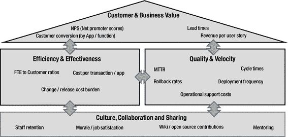
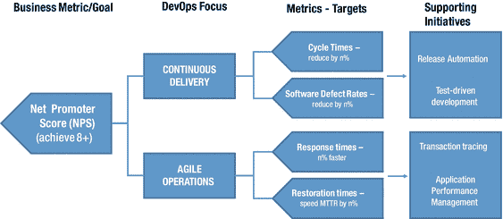

# 三、DevOps 基础

Culture, Lean Thinking, Metrics

在一级方程式进站时眨眼，你可能会错过它。但情况并非总是如此。五十年前，维修人员会花一分多钟来换轮胎和加油。今天，任何超过三秒钟的都被认为是失败。

在软件开发中也是如此，曾经负责以稳定的速度更新企业应用的团队现在必须交付新的软件服务，作为对客户的持续价值流。

然而，今天的企业面临的问题是软件团队不像一级方程式赛车维修人员那样工作。IT 团队不是一前一后地工作，而是连续地工作——开发代码，然后是 QA 测试，最后是 IT 操作监控。然而，随着应用软件在更短的时间内(几个月甚至几天)发布、增强和淘汰，这种时断时续的开发方法就不适用了。这就像 f1 维修站的每个成员在下一场比赛开始前更换轮胎并检查车轮螺母的张力一样无效——赛车离开维修站前比赛就已经结束了。

虽然我们可以赞美伟大的赛车手的英雄主义和技巧，但成功的制造商与众不同的是他们建立胜利文化的能力，无论角色和责任如何，无论是车手、车队经理、遥测工程师还是空气动力学主管，每个人都专注于一个单一的目标——赢得比赛。这就是为什么车手们在领奖台上喷洒香槟之前要感谢车队。

像 f1 车手一样，技术进步提高了 IT 专业人员的效率和效力。然而，在传统上基于职能领域内的技术专业化来衡量和激励的组织中，仅仅依靠工具永远不会建立业务增长和盈利所需的协作文化。

## DevOps 文化的特点是什么？

DevOps 和传统思维很不一样，因为它非常强调文化。它在多个团队中灌输了一种共同的愿景感，直接与业务及其客户保持一致。为此，标新立异的行为，比如偷工减料，允许充满缺陷的代码投入生产，或者在软件发布失败时责怪运维，都是与 DevOps 思维相违背的。DevOps unified 是英雄，没有人会因为问题而受到责备。

但是这在 IT 界是一个挑战，因为开发团队和其他 IT 团队之间存在摩擦，尤其是 IT 运维团队。一方面，开发人员专注于通过更快的应用交付来加速变化，而运维口号是不惜一切代价保持弹性和稳定性，即使这意味着阻止变化。

然而，有证据表明，虽然这两个目标同等重要，但它们并不相互排斥。例如，2016 年 Puppet Labs 的“DevOps 状态”报告表明，高性能的 IT 组织完全能够实现更快的软件交付以及更高的弹性和稳定性。显然，DevOps 的高绩效员工已经通过制定战略，将根深蒂固的筒仓式思维和行为重塑为更强大的集体力量，从而结束了部门间的“地盘之争”。

由于 DevOps 文化涉及在 IT 团队中创建新的共享价值观和行为，因此领导层必须在整个组织中积极推动这些特征。

### 关注产品胜于政治

传统上，IT 团队被组织在技术孤岛中。互动和交流是通过过度工程化和僵化的过程进行的。软件变更经历了漫长的变更管理过程、人工干预和变更审查委员会的考验。虽然本质上没有错，但这些元素是为了迎合变化不太频繁但发生量较大的情况而设计的，需要更加严格来确保运维稳定性和合规性。

然而，强大的 DevOps 文化的特点是系统思维。也就是说，将服务作为一个整体来共同强调，而不是单独的功能元素或过程。DevOps 的目标不是坚持技术领域，而是打破障碍——按照产品结构进行组织，并在产品生命周期的背景下不断推动改进，从创意的开始到全面生产状态。强有力的领导者认识到这一点，通过促进开放的沟通，使用共享的指标，并在团队内部和团队之间建立(甚至自动化)反馈机制。

### 建立信任和尊重

多年来，个人贡献者赢得了尊重。成为编写代码的超人开发人员，或者在凌晨 4:00 解决问题的随叫随到的操作人员。在繁荣的德沃普斯文化中，英雄崇拜退居集体尊重之后。有了 DevOps，每个人都应该尊重他人的贡献，任何人都不应该因为害怕被辱骂和诽谤而害怕发言。

这一点至关重要，因为从医疗保健到航空航天，研究表明，随着时间的推移，不良实践和行为可能会被视为正常的实践——往往会带来灾难性的后果(参见第[章第 8](08.html) 节，进一步讨论打击正常不良实践的策略)。由于权力游戏和缺乏尊重，这种事情经常发生。即使新员工目睹了公然的次优做法，他们也会因为害怕经理的指责和报复而不愿报告，最终接受这种情况并亲自实践。DevOps 领导应该注意这一点，并在整个产品生命周期中工作，以确定哪些情况下可以容忍违规行为，因为人们害怕说出来或显得刻薄。

信任在 DevOps 文化中也扮演着重要的角色。正如 f1 车手相信他的维修站工作人员能够安全地安装四个车轮一样，跨职能部门的信任也必须建立起来。对于开发来说，这意味着相信来自操作的生产性能信息实际上可以帮助软件重构和减少技术债务。对于运维，这意味着信任新的应用设计模式将有助于业务扩展。从安全性到企业架构，每个人都是信任等式的一部分，随着软件交付速度的加快，没有它，任何 DevOps 项目都不会成功。

### 处处增强同理心

众所周知，同理心在当今以应用为中心的软件设计中扮演着多么重要的角色。如果不了解客户的情感和生理需求，以及他们的行为模式，企业就有可能在软件投资上遭受重大损失。这解释了为什么许多组织在任何完整的软件发布之前都要进行严格的设计实验。这在谷歌的“50 种蓝色”用户界面测试中表现得淋漓尽致。 [2](#Fn2)

尽管如此，许多企业 IT 部门缺乏同理心。团队通常在不同的地方运作，因此开发和运维团队很少有面对面的机会来分享彼此的痛苦、提出关注点或提出问题。

领导者可以使用许多简单而有效的策略来建立同理心。至少这应该包括在发展和支持之间建立更密切的联系。即使是最好的软件和交付过程，理解他们的观点和他们在与客户打交道时的经历也是很重要的。

Tip

在开发产品或新功能时，将自己置于客户和支持人员的位置，检查他们可能需要帮助的所有情况。

员工(包括开发人员)应该理解创造良好客户体验的重要性。为此，考虑在各种不利情况下直接与现场的客户直接合作。作为一名顾客，当你试图登机时，扫描仪坏了，会发生什么？或者当移动应用崩溃或网络覆盖不好意味着无法呼叫路边援助时，会有什么影响？

显然，开发人员与客户紧密合作并不总是实际可行的；然而，有了分析工具，员工可以设身处地为客户着想，获得对客户体验的真实见解。

### 开放的沟通渠道

1968 年，计算机程序员梅尔文·康威(Melvin Conway)假设，设计系统的组织必须生产这些组织的通信结构的复制品。 [3](#Fn3) 在 DevOps 环境中，现在被称为康威定律的东西有很大的相关性，特别是在组织结构和封闭的沟通渠道阻止开发人员和运维人员就 IT 性能目标达成一致的情况下(例如，增加变更频率和提高可靠性)。在这种情况下，基于团队的活动有可能优先于更重要的跨职能改进策略。

这个问题有许多可能的解决方法。网飞和亚马逊的技术团队围绕小团队构建，每个人负责整个系统的一小部分。Spotify 通过敏捷开发团队、分会和行会促进跨团队边界的协作，由单独的 IT 运维团队为所有团队提供发布软件所需的支持。

除了以技术为中心的公司，还有其他商业繁荣的例子，因为他们改变了沟通结构。以 Zara 为例。

年复一年，在变幻莫测的零售时尚和服装领域，Zara 继续增加收入和利润。对于 Zara 来说，对客户需求的灵活响应，以紧密整合的供应链为后盾，由团队合作和协作推动。在零售店中，经理使用实时智能来下订单，并将信息直接反馈到生产点。不同的团队(包括设计、产品管理和销售)使用共享空间，密切合作。Zara 越来越重视从最初的服装设计到分销到商店的沟通，缩短了产品的交付周期，不会在时装季之前不必要地大量购买产品。

考虑到这些方法，跨职能 IT 协作可以在以下情况下得到改善:

*   领导将预算分配给实际的共址策略。这不仅仅是简单的员工重新安置，还应包括共享的工作空间和休息室，以及团队聚集区和普通的白板。
*   IT 运维团队成员定期参加敏捷站立会议，以了解快速部署代码的价值，以及他们当前的活动如何帮助或阻碍发布过程。
*   开发团队参加运维事后总结或研讨会，以更好地了解由性能差或不安全的软件引起的问题。
*   IT 运维部门与开发人员合作，在生产前建立性能监控，以便尽早发现问题，从而更容易、更经济地解决问题。
*   开发人员被列入下班后支持名单，以便更好地了解有问题的软件代码对用户和客户的影响。
*   支持专家分享在移动应用与客户互动过程中获得的关键应用体验分析。

### 其他因素

改变 IT 文化并不容易。无论对错，人们都有先入为主的观念和根深蒂固的想法。工作场所做法的任何突然转变，人们都会感到受到威胁并做出反击，这是很自然的。解决这个问题意味着耐心地与人们一起工作，制定必要的行为改变或将人们调到不同的工作岗位。

随着发展和文化的改变，从一个干净的状态开始是至关重要的。领导者不应该一头扎进大规模的 IT 劳动力转型计划，而应该首先从业务角度评估文化景观。这包括理解业务的主要目标，然后分析流行的行为是否支持它。虽然看起来很明显，但许多组织错过或忽视了这一关键步骤。例如，如果一家公司将其目标定义得过于宽泛，在不同 IT 团队中工作的人会以不同的方式解释它们，并相应地塑造活动，这通常会损害彼此和业务。

从更广泛的意义上来说，文化也会受到组织的商业模式和运维视角的影响。有三个类需要考虑:

*   运维业务——在这种模式中，业务的总体战略是以大致相同的方式继续运维——只是更好、更快、更便宜。在这里，IT 的重点是卓越运维——采用新技术，是的，但是使用它们来提高仓储和物流等流程的效率。
*   对于这些组织来说，IT 文化的特点是纪律和僵化——这对于支持效率的提高来说很好，但对于一个旧的业务规则不断受到颠覆性技术挑战的世界来说就不够了。
*   发展业务——业务战略从做更多相同的事情转变为以完全不同的方式经营相同的业务。网飞是这种模式的一个很好的例子。五年前，网飞通过邮件发送 DVD，现在他们通过网络播放娱乐节目，甚至创建自己的内容。顾客仍然转向网飞寻求娱乐，但网飞满足这种需求的方式已经发生了根本的变化。
*   对于这类组织，文化也需要改变。对于网飞，他们的 DVD 交付模式需要对库存管理和配送等流程进行强有力的运维监督，以提高效率和客户满意度。然而现在，他们的流模式和内容生成计划要求团队基于快速分析客户偏好和优化 web 性能和吞吐量来快速提供新服务。显然，如果一家公司的文化行为和价值观仍然偏向于推动某个运维领域的效率，转向新模式将会很困难。
*   转变业务——这种模式最有希望，也最有风险，因为它涉及到改变公司的结构。企业不只是以新的方式经营相同类型的业务，它们完全重塑了自己。对亚马逊来说，这意味着从卖书转型为大型云计算提供商。对沃尔格林来说，这意味着从柜台卖药到在商店治疗疾病。
*   通过这样的战略转型案例，企业被引入了新的动力和竞争对手。现在，IT 绩效不仅要根据今天的业务增长来判断，还要根据未来核心业务的创造来判断。为此，建立在开放沟通和协作、信任、尊重和同理心基础上的 DevOps 文化不仅对短期增长很重要，对长期业务可持续性也至关重要。

一旦清楚地理解和交流了业务模型和目标，支持它们所需的任何必要的 IT 行为和价值都可以通过开发完全一致的 IT 目标和度量来影响。这些可能包括缩短新产品的交付周期以支持更快的上市时间，增加移动应用客户转化率以支持增加的收入目标，或通过更好地利用云基础设施来帮助当前的业务规模。

## 精益思想减少浪费

燃油策略在一级方程式赛车中发挥着重要作用。一辆油箱半满的汽车比一辆充满燃料电池的竞争对手快 3 秒钟。额外的燃油相当于额外的重量，所以车队会竭尽全力计算出在全路况下所需的确切燃油量。

尽管设计精美，不断改进，赛车发动机仍然是公然浪费。就像你家里的汽车一样，内燃机的动力仍然意味着只有一定比例的储存在油箱中的燃料被转化为有用的能量。其余的都以热量和摩擦力的形式损失掉了，这也解释了为什么车队不断改进底盘设计以减少空气阻力。

除了一级方程式赛车的疯狂世界之外，许多因素导致了我们这些普通人驾驶的汽车中的发动机浪费。开空调消耗燃料，对运动没有贡献。发动机活塞的摩擦会浪费燃料，轮胎压力和额外的行李也会浪费燃料。总的来说，只有 14%的乘用车燃料被转化为有用的能量。显然，这种耗油量大的工程倒退普遍受到电动汽车和电池技术进步的破坏——时间会证明一切。

在许多方面，软件开发和内燃机一样浪费。开发和运维之间的摩擦会导致延迟。在我们自己的软件工厂中手工组装多个组件和配置会导致时间的浪费。以不必要的基础设施容量的形式持有过剩库存会增加额外的成本。除此之外，在测试期间阻止访问关键系统和数据的约束，缺陷会在软件生命周期中累积。

### 精益和价值创造

传统的 IT 价值观已经形成。几十年来，系统和应用已经被设计、构建、测试并发布给客户、公民和最终用户，在那里他们有希望影响行为。这一切都变了。随着云计算、移动性和社交计算的出现，消费者而不是生产者说了算。这意味着企业发现自己不得不对客户的行为和需求做出回应。

对 IT 来说，商业价值的重新定义意味着团队必须关注两个基本策略。首先，他们必须不断地从客户的角度重新检查他们交付的软件服务，其次，他们必须不断地努力最小化整个软件工厂中的任何干扰或浪费。这包括阻碍价值流向客户并导致更多成本的一切。

客户“拉动”价值和消除浪费的概念并不新鲜。丰田、摩托罗拉和施乐等精益先驱和实践者通过应用这些原则重新定义了制造业；理解生产过程中存在多种形式的浪费。而且，因为它们没有给顾客增加价值，所以必须从临床上去除。

但精益原则能应用于 IT 吗？与传统制造业不同，在 IT 领域，浪费不会通过过量的实物库存或闲置机器等警示性迹象在工厂车间中显现出来。通常由于其无形的性质，IT 中的浪费很难识别，也很难单独消除。

有趣的是，软件的交付与制造过程有许多相似之处。在 IT 中，我们有办法通过快速设计、开发和发布软件服务来响应客户的价值触发。而且，由于软件交付生命周期代表了软件工厂中的一条制造生产线，我们有一个指导性的上下文，在这个上下文中，我们可以识别出所有没有给企业和客户增加价值的浪费元素。

### 浪费的八个要素

如表 [3-1](#Tab1) 所示，有八个浪费或“大木”(使用精益术语)的元素严重影响 IT 团队增加软件服务价值的能力。

表 3-1。

Eight Elements of Waste (D.O.W.N.T.I.M.E)

   
| 废物类型 | 例子 | 业务成果 |
| --- | --- | --- |
| 缺点 | 设计不良和质量差的代码非功能性性能问题 | 失去客户和收入；负面品牌影响 |
| 生产过剩 | 提供客户不需要或不想获得额外容量的功能，因为有意料之外的性能要求 | 延迟、成本超支和预算问题 |
| 等待 | 过多的发布积压和瓶颈基础设施和数据不可用于测试变更审查；安全性和合规性审计 | 缓慢的上市时间和价值；失去的机会 |
| 非增值加工 | 冗长的问题解决和基于消防队的活动优先于计划级目标 | 士气问题；员工流动率高 |
| 运输 | 频繁的版本回滚开发/QA 移交 | 应用启动延迟；增加周期时间 |
| 库存(过剩) | 未充分利用的资源部分完成的工作和过多的正在进行的工作 | 资本和运维成本增加 |
| 移动 | 开发人员不断地切换重新学习和返工 | 生产力损失；人才流失 |
| 员工知识(未使用) | 不公开的回顾和站立会议没有从服务管理部门(例如呼叫中心/服务台)获得反馈 | 错过推动改进的机会 |

检查该表时，应该注意到各要素之间有密切的关系和联系。例如，导致性能问题的未检测到的代码缺陷可能导致组织购买额外的硬件容量，从而导致库存过剩，这增加了支持负担。在这种情况下，浪费导致浪费，技术债务累积到难以偿还的程度。结果是基本的开发与维护和支持活动紧密联系在一起。

最初由沃德·坎宁安在《敏捷宣言》中提出，技术债务倾向于从发展的角度来审视。毕竟，如果软件缺陷可以在开发的早期阶段被识别和根除，那么与生产相关的问题(修复起来可能会花费很大的代价)就可以避免。

但是技术债务也可能在 IT 运维中产生。例如，未能记录或可视化业务服务(以及支持应用的基础设施)意味着团队可能需要更长的时间来对问题进行分类。这里的浪费是无附加值的加工，这又(因为联系)导致更多的浪费。在这种情况下，增加了传输，因为必须回滚一个发布。

使用浪费列表的八个元素，DevOps 实践者可以开始一个在软件生命周期中识别浪费元素的过程。重要的是要理解“毒性”水平会有所不同，因此必须开发机制来不断揭示可能会引入更多废物的新情况和新条件。

同样重要的是，不要将练习局限于新的开发。这些可能会成为未来的债务负担，但只能代表投资组合的一小部分。遗留基础设施和生产应用也应包括在内，因为即使它们更改的频率较低，它们也经常会产生巨大的管理成本和开销。

最后，债务和相关的浪费应该作为一个连续体来审查，特别注意新的面向客户的应用和基本后端业务流程之间的集成。对于大多数企业来说，多渠道参与创造了巨大的价值创造机会，但如果不与现有的后端系统、应用和呼叫中心服务集成和协调，则会带来更多的浪费。

### 废物清除策略

今天的移动和以 API 为中心的服务交付形式意味着客户基于极高水平的功能和运维质量来评估价值。他们还期望企业以持续变革的形式提供附加价值。客户体验如此重要，从客户的角度开始废物识别至关重要；监控和分析应用的使用和行为，并确定哪些因素会影响总体体验。这对于移动应用尤其重要，因为 IT 部门无法控制的因素(例如，运维商网络延迟和云服务性能)会迅速侵蚀价值，无论功能质量有多好。

跨职能团队可以应用一些即时实践来帮助识别和消除浪费，包括以下内容。

#### 通过消除约束来防止缺陷

当开发和测试由于缺乏对依赖项(例如，中间件、web 服务和测试数据)的访问而受到限制时，缺陷会很快进入代码库。一项服务虚拟化调查说明了这一点，该调查发现，参与者平均需要访问 52 个用于开发或测试的相关元素，但只能无限制地访问其中的 23 个。 [5](#Fn5)

为了规避这些问题，许多开发团队经常通过手工编码(mocks 和 stubs)来尝试解决方法，但是这不能提供真实的应用行为，导致测试验证错误和缺陷的延迟发现。在第 [5](05.html) 章中进一步讨论，一个更具可扩展性的方法是将服务虚拟化合并到并行开发和测试活动中。

#### 关注价值，防止生产过剩

新的应用功能不一定意味着更多的客户对话和更多的收入。不必要的功能会导致额外的维护开销和成本。DevOps 从业者可以使用许多方法来减少这种形式的浪费，包括:

*   将应用体验分析纳入监控策略，以识别未使用的移动应用功能和特性
*   分割或 A/B 测试和漏斗或群组分析
*   重构代码元素以降低复杂性，记住最便宜和最可靠的组件是那些不存在的组件！

#### 平滑流程以减少等待时间

像浪费元素#1 一样，这种浪费可能由于在开发和测试期间等待依赖项的延迟而发生。在上面提到的 VOKE 报告中，81%的参与者认为开发延迟是因为为了开发软件、复制或修复缺陷而等待依赖。此外，84%的参与者发现等待依赖项的 QA 延迟，以便开始测试，开始新的测试周期，测试所需的平台，或者验证缺陷。

Caution

永远不要低估与访问测试数据相关的等待时间，因为平均软件交付生命周期中有 20%的时间浪费在等待数据、定位数据或者在数据不存在时手动创建数据上。

过长的等待时间也可能是由于管理高度复杂的发布和部署流程的问题。无论代码有多好，它的最终价值将取决于它能多快部署到生产中。手动过程和脆弱的脚本不仅损害了这些目标，还增加了缺陷代码被发布的可能性。这些问题可以通过以下方式解决:

*   确保拥有知识的所有关键利益相关者能够在整个生命周期内快速移动服务，并尽早参与进来
*   使用较小的批量，以便定期向客户交付价值
*   开发和自动化可重用和可重复的流程，以简化和精简应用发布

#### 通过数据驱动的洞察力限制无附加值的处理

修复应用问题为客户提供的价值有限。it 操作应该在开发生命周期的更早阶段介入，而不是等待问题在生产中出现。

使用工具来分享信息尤其有价值。例如，通过在构建过程中利用应用性能变化影响分析，开发人员可以快速确定他们的代码正在引入的任何不利的性能条件。

#### 通过自动化部署降低运输成本

当工作从一个团队手动移交给另一个团队时(例如，开发人员移交给测试/QA，QA 移交给运维)，关键知识可能会丢失。这可能会导致额外的延迟或所有版本回滚中最高的运输成本。

有许多策略可以解决这些问题，包括:

*   通过自动化标准任务和活动减少移交数量
*   确保发布自动化工具提供一组广泛的操作包和插件，以便在应用级别完全部署，同时还集成关键支持流程(例如，配置管理)
*   随着发布的进展积累更多的知识(例如，在生产前建立应用性能管理)

#### 消除整个软件工厂的过剩库存

最小化库存是精益思想的标志。和传统制造业一样，它自己的软件工厂里有很多浪费指标。在开发过程中，部分完成的工作可能在进入生产之前就已经过时了，应该暴露出来以确保它不会降低或破坏代码库。在运维中，通过在生产前建立监控，可以避免为解决意外性能问题而购买的过量内部服务器基础架构。

Note

当敏捷团队获得专业工具时，成本会大量累积。协作评估额外的成本(培训或支持)是否抵消了交付给一个团队的价值。

#### 平行显影防止不必要的运动

运输浪费与不必要的软件移动有关，而移动浪费涉及不必要的人员移动。一个很好的例子是任务切换，API 开发人员可能会将注意力转移到一个新项目上，而不是等待测试依赖变得可用。

除了增加更多的浪费(例如，延迟)，任务切换会引入更多的问题，特别是由于持续的中断而与开发人员的生产力相关。

减少这种浪费的一些简单策略，尤其是任务切换，包括:

*   努力确保团队拥有完成分配给他们的工作所需的所有知识、工具和数据
*   模拟和虚拟化所有依赖关系，以便开发团队可以并行编码和测试
*   由于多达 50%的测试被试图定位测试数据或者手动创建测试数据的团队所浪费，考虑用测试数据管理来补充约束移除策略(参见第 [5](05.html) 章)
*   努力消除不重要的工作、会议和干扰。如果它没有交付价值，问问你的团队为什么要这么做！

#### 使用反馈循环整合员工知识

虽然产品信息的反馈对于推动软件改进和提高可支持性很重要，但它并不是唯一可以传递知识的地方。

服务台和呼叫中心流程还应包括提供(开发)重要信息的机制，这些信息来自客户对新应用特性和功能的使用和响应。知识转移也应该是双向的。例如，应用体验分析可以(当与事件管理流程甚至社交媒体集成时)成为一种预警机制，在移动应用使用出现问题时触发协调响应。

## DevOps 指标

对于任何 IT 驱动的方法或程序，衡量业务环境中的有效性是至关重要的。但是由于 DevOps 不是一个正式的框架，组织在确定应该使用什么度量标准时几乎没有指导。

这可能会产生问题，并导致许多次优实践:

*   效率现状—IT 团队退回到传统上用于证明满足稳定性和弹性目标的技术熟练程度的指标。虽然这些不一定是错误的，但是 DevOps 指标还应该展示新流程和自动化技术如何影响业务，例如通过加快上市时间和缩短交付周期。
*   产出重于结果——组织倾向于评估团队生产力时常用的指标。这些可以包括基于输出的指标，如交付的功能数量或调配的服务器数量。除非与以结果为中心的指标相平衡，该指标显示相对于期望的质量水平所实现的结果，否则这类指标可能会适得其反。
*   唾手可得的果实——组织选择容易获得但不一定有用的指标。由于 DevOps 的成功取决于文化变革，企业还必须衡量哪些东西更难确定，但可能更有价值，即在组织层面采用 DevOps 行为和价值观对企业有何影响。

### 反模式度量

在开始指标更新之前，组织应该考虑所有现有的度量及其在 DevOps 环境中的适用性。如表 [3-2](#Tab2) 所示，应特别注意仔细审查那些违反 DevOps 原则的指标和激励措施。

表 3-2。

Problematic Metric Classes

   
| 公制等级 | 例子 | 不良反应 |
| --- | --- | --- |
| 虚荣度量 | 生成的代码行创建的功能点 | 可能会适得其反，因为它们奖励了错误的行为类型——尤其是当激励与指标挂钩时。在没有验证的情况下生产更多的代码和特性会抑制其他有价值的活动，比如重构和设计简化。 |
| 团队内部指标 | 敏捷团队排行榜部署/更改被阻止 | 小心那些让团队互相竞争并使用虚荣指标作为评分机制的指标。在影响积极的团队间行为的度量和奖励之间取得平衡——例如代码共享、同行评审和指导。特别要注意那些促进反 DevOps 文化的指标，比如根据防止发布和部署的能力来评定运维有效性。 |
| 传统指标 | 平均无故障时间(MTBF)fte:服务器 | 随着服务交付的加快，一些失败是可以预料的。始终要考虑到，提高响应能力可能比试图防止故障更重要(且成本更低)。 |

### 适用性清单

在审查和制定 DevOps 指标时，同样重要的是根据一般适用性清单考虑每个指标:

*   可获得性——文化和行为的改进很重要，但度量标准可能很难获得或量化。找出其他相关数据点来帮助揭示，例如，作为员工士气指标的员工保留率/调动率。
*   可审查—每个指标都必须经得起业务环境中的严格审查。仔细检查容易收集的度量标准，但是不增加任何有形的价值——例如，每个开发人员产生的代码行。
*   廉洁—确定每个指标是否会受到团队和员工偏见的影响。找出任何可能与协作 DevOps 文化背道而驰的相关激励措施——例如，现有的 SLA 奖金阻碍了变革。
*   可操作—任何指标都必须支持改进的决策制定。例如，公开 A/B 测试结果可能是快速确定新功能有效性的一种有价值的方式。

只要有可能，度量标准还应该是可共享的，并且在软件生命周期中与开发和操作相关。例如，在跨职能团队和部门级别生成安全分数可用于通知团队其行动的风险。

### 重要的指标

确定了不测量的内容后，下一步是开发支持 DevOps 计划的候选指标列表。一个常见的错误是测量太多的元素，退回到容易收集的元素。此外，适用于 DevOps 的指标对于组织来说可能是新的(例如，部署速度、变更率和客户响应能力)，因此从更广的角度考虑工作实践、流程和技术的变化如何支持这些目标非常重要。

*   人员—与员工相关的指标可能是最难收集的，但仍然是强有力的变化指标。应重点考虑内部指标，如员工保留率和培训，以及指导和知识积累(如开源贡献和维基开发)。
*   流程—考虑现有实践将如何帮助或阻碍新目标的实现非常重要，要特别注意现有的瓶颈(例如，仅在测试后进行的安全审计会影响部署率)。
*   技术——好的度量是那些帮助团队推动改进的度量，即使在失败之后(例如，失败的发布的百分比是多少，其中有多少百分比是由于代码缺陷、手工处理、配置错误等等)。).

在开发指标时，保持平衡很重要。默认偏向某个特定领域的指标(例如，运维或开发效率)会对行为改进产生负面影响

图 [3-1](#Fig1) 展示了可用于衡量 DevOps 计划有效性的四个维度和样本指标。

图 3-1。

DevOps metrics dimensions

#### 文化、协作和共享

此类别中的指标尤其有价值，因为它们提供了对 DevOps 的接受/抵制的持续指标。该维度中的一些指标(如员工保留率/离职率)比其他指标(如员工士气)更容易收集。因此，重要的是要考虑其他维度的衡量标准，以了解它们如何影响这一领域。例如，平均恢复时间(MTTR)的改善是否对员工士气、缺勤率和对变化的响应能力产生积极影响？也可以考虑自动调查和员工反馈，只要这些是完全透明和可操作的。

#### 效率和效力

这里的度量标准通常关注开发能力和运维能力的元素。虽然使用了服务器与系统管理员比率等传统指标，但许多组织现在正在采用更多以客户为中心的比率，如客户的全职当量(FTE)。

基于事务或应用检查全部成本是另一个很好的候选指标，因为它侧重于提高数据中心效率(例如，能源和冷却)。其他度量标准，比如发布成本，也是不错的，因为这些可以暴露与获取、准备和维护用于开发、测试和生产的物理基础设施相关的低效。

#### 质量和速度

该维度旨在衡量与服务交付相关的数据点。对于开始 DevOps 计划的组织，许多指标(例如，由于代码缺陷/中断/用户负面反应而回滚的部署的百分比)最初可能很高。这可能是因为采用新流程需要额外的时间，再加上补救现有的技术债务和这些指标暴露的浪费因素。然而，由于 DevOps 的重点是从开发开始就建立质量，这应该会随着时间的推移而减少。

配对后，这些指标还提供了额外的见解。例如，如果在低变更量期间回滚速率仍然增加，则可能表明存在严重问题，例如，由于手动/脚本发布流程、任务切换和过度移交而导致的错误。

这方面的其他有用指标包括:

*   周期时间——测量完成发布操作中一个阶段或一系列阶段所需的时间长度。这对于暴露任何瓶颈非常有价值。
*   MTTR—这可以分为检测、诊断和恢复阶段。MTTR 是团队处理变化效率的一个很好的指标。对于复杂的部署，会有峰值，但随着 DevOps 的建立，这一指标应该会下降。

#### 客户和商业价值

这一类指标是外部关注的，有助于衡量 DevOps 如何支持业务目标，如提高客户忠诚度和加快上市时间。交付周期的制造概念为 DevOps 实践者提供了一个类似的度量标准(从代码开始开发到成功的产品部署所用的时间),并确定了 DevOps 在满足快速交付高质量软件服务的需求方面做得如何。这个度量标准特别重要，因为长的交付周期可能表示代码缺陷或测试约束。

另一个有趣的候选是净推介值(NPS)，这是一种测量客户忠诚度的简单管理方法。虽然这一指标传统上用于业务的其他领域(如营销)，但它的包含是有效的，因为客户的忠诚度越来越取决于通过网站和/或移动应用交付高质量软件服务和更新的速度。

### 其他方法和技术

随着度量在前面讨论的四个维度中的每一个维度上的发展，团队可以开始确定它们之间的关系的过程。这一点很重要，这样团队就可以深入了解需要哪些流程增强和工具来满足目标或解决能力差距。

如图 [3-2](#Fig2) 所示，一种简单有效的方法是业务影响映射。这包括确定支持业务或客户体验目标所需的 DevOps 流程，以及支持这一结果的多个维度的基础指标、目标和计划/工具。

图 3-2。

Metrics, targets, and initiatives linked to business outcomes

图 [3-2](#Fig2) 显示了一个组织正在寻求达到 8+的净推广者分数。为了支持这一目标，IT 需要更快地交付软件版本和新功能，同时确保高质量的客户体验。因此，在质量和速度维度内设置了度量和目标，以及目标和支持过程/工具计划。

随着 DevOps 度量项目的发展，从业者还应该:

*   进行定期和持续的目标评审，以确保目标不是完全不现实的，或者现有的过程和工具没有交付改进。
*   当目标持续实现时，考虑删除持续的“绿灯”指标。
*   避免将所有指标都集中在速度上，而忽略客户满意度和忠诚度。
*   努力防止虚荣心和以运维或团队为中心的偏见渗透到项目中，扭曲真实的绩效情况。
*   注意不要根据目标给团队排名——比较团队的最好方法是测量客户忠诚度(如上所述)和团队在实现承诺方面有多成功。
*   充分考虑促进同行评审和开放性的度量标准、目标和计划。
*   精心建立激励和奖励计划，强化强大协作文化的价值。
*   从一开始就让业务对应方参与进来，以确保客户和业务数据与运维/效率指标保持相同的标准。
*   为 DevOps 计划匹配工具，特别是那些可以监控和响应实时条件(如交易时间、响应时间和移动应用崩溃)的工具，但也可以主动检测和防止影响性能的不利条件(如代码缺陷和发布瓶颈)。

## 摘要

其核心是，DevOps 是关于建立一种有生产力的组织文化，在这种文化中，业务改进高于一切。但正如本章所阐述的那样，这并不总是一帆风顺的，尤其是在那些被部门间的摩擦和缺乏方向困扰的组织中。通过利用本章的指导，特别是关于建立高度信任的团队、基于结果的度量计划和精益思想，组织有一个坚实的基础来指导他们的 DevOps 计划。

在第 [4](04.html) - [7](07.html) 章中，我们将仔细研究支持这一目标所需的自动化工具，以及企业如何改装和再造他们自己的软件工厂，以快速制造高质量的软件创新。在这些章节中，我们将研究贯穿软件生命周期的关键工具策略——构建、测试、部署和管理。

This chapter is distributed under the terms of the Creative Commons Attribution-NonCommercial-NoDerivatives 4.0 International License (http://creativecommons.org/licenses/by-nc-nd/4.0/), which permits any noncommercial use, duplication, distribution and reproduction in any medium or format, as long as you give appropriate credit to the original author(s) and the source, provide a link to the Creative Commons license and indicate if you modified the licensed material. You do not have permission under this license to share adapted material derived from this book or parts of it. The images or other third party material in this book are included in the work's Creative Commons license, unless indicated otherwise in the credit line; if such material is not included in the work's Creative Commons license and the respective action is not permitted by statutory regulation, users will need to obtain permission from the license holder to duplicate, adapt or reproduce the material. Footnotes [1](#Fn1_source)

[T2`https://puppet.com/blog/2016-state-of-devops-survey-here`](https://puppet.com/blog/2016-state-of-devops-survey-here)

  [2](#Fn2_source)

[T2`https://www.theguardian.com/technology/2014/feb/05/why-google-engineers-designers`](https://www.theguardian.com/technology/2014/feb/05/why-google-engineers-designers)

  [3](#Fn3_source)

梅尔文·e·康威，[“委员会如何发明？，"](http://www.melconway.com/Home/Committees_Paper.html) [数据化](https://en.wikipedia.org/wiki/Datamation#Datamation)14(5)(1968 年 4 月):28–31。

  [4](#Fn4_source)

敏捷宣言: [`http://www.agilemanifesto.org/`](http://www.agilemanifesto.org/)

  [5](#Fn5_source)

VOKE 市场快照报告:服务虚拟化:[T2`https://www.ca.com/au/register/forms/collateral/voke-market-snapshot-report-service-virtualization.aspx`](https://www.ca.com/au/register/forms/collateral/voke-market-snapshot-report-service-virtualization.aspx)