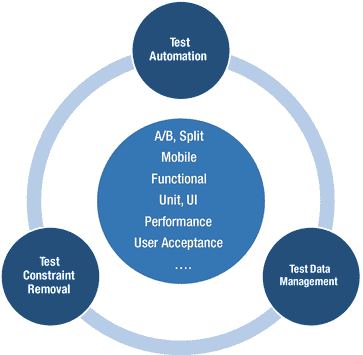
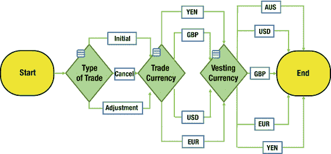
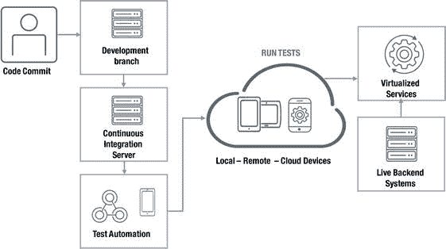
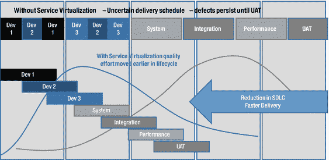

# 5.试验

Continuously Championing Quality

DevOps 提供的软件创新的数量和速度可能是 IT 转向这种新交付方法的最大驱动力。但是当组织在追逐发展的荣耀时忽略了质量，杯子只能是半空的。

商业技术领域充斥着许多以牺牲质量为代价追求软件速度的例子。也许最极端的是 Knight Trading，一个软件更新访问了过时的代码(8 年前),在不到 30 分钟内造成了超过 4.4 亿美元的不良交易。[1](#Fn1)[2](#Fn2)

因此，DevOps 的原则和实践不仅是为了提高软件发布的速度，也是为了提高质量——和交付一样，这必须持续进行！

然而，随着 DevOps 对自动化软件管道的关注，很明显，确保质量的传统方法现在必须受到质疑和审查。独立的团队在筒仓中工作，处理集中的污染测试数据，并在软件开发周期的后期执行手工任务，这不是维持质量的方法。

进步的企业含蓄地理解速度和质量之间的联系；是的，增加发布的节奏，但是通过高级 DevOps 自动化的应用来支持质量。一个说明性的例子是 AutoTrader.com，汽车买家和卖家的在线市场。

## 案例研究:AutoTrader.com

每个月有超过 1800 万人使用 AutoTrader.com 搜索二手车。该网站不仅仅是为卖家做广告；它也帮助人们研究和比较汽车和旧车交易。 [3](#Fn3)

AutoTrader 总部位于佐治亚州亚特兰大市，其目标是使车辆交换比以往任何时候都更简单、更安全，同时最大限度地提高私人和贸易买家和卖家的价值。

当 AutoTrader 的服务主要通过浏览器提供时，它认为自己是一家媒体公司。智能移动设备和应用程序经济的出现改变了这一切。

“现在我们是一家技术公司。该公司应用开发高级经理 Adam Mills 透露:“技术方面对 AutoTrader 业务非常重要。

十年前，AutoTrader 每年只发布四次网络服务更新；如今，它预计几乎每周都会发布一款。正如 Mills 所解释的，“我们必须跟上当前操作系统和设备的变化，并发展我们自己的产品。客户希望我们在几周内而不是几个月内交付出色的新功能。”

无论是通过手机、台式机还是笔记本电脑上的应用程序或浏览器访问 AutoTrader，客户都希望获得同样出色的体验。

在竞争激烈的市场中，这种出色的体验是 AutoTrader 的一个关键优势。“我们的应用必须是最好的，”米尔斯解释道。“只需要一些糟糕的客户体验，然后每个人都在 Twitter 上谈论它，我们就失去了市场份额。”

随着 AutoTrader.com 功能及其支持的设备数量和种类的增长，软件测试变得复杂、昂贵且耗时。“我们不得不建立巨大的仿真环境，购买许可证，并确保所有的服务相互交流，”米尔斯回忆道。“但是因为有太多的相互依赖，我们无法在同一时间内完成所有不同的测试。然后，我们必须找到所有的物理设备，插上它们，并在每台设备上测试我们的代码。”

AutoTrader 已经计划采用 DevOps 方法来整合其不同的开发团队，并意识到虚拟化不同的服务将实现更大的统一性。

AutoTrader 在市场上寻找支持 DevOps 方法的服务虚拟化解决方案，邀请了一些精选的供应商来演示这些解决方案。

在六周内实现了一个解决方案后，AutoTrader 开始使用该解决方案来模拟应用程序的正常行为和性能问题。“团队可以测试他们的服务的弹性，并回答那些关键的‘假设’问题，比如‘如果数据库崩溃会发生什么？’”米尔斯评论道。

米尔斯设想，不久之后，人类与一段代码的最后一次互动将是开发人员签入代码的时候。测试、构建和部署将实现自动化，将以前需要几周时间的流程缩短到几分钟。

AutoTrader 已经能够加速测试，同时提高质量并释放资源。正如 Mills 所证实的，“该解决方案意味着我们可以在数小时内完成测试，而不是数周。以前，我们需要数百名测试人员来检查每台设备的性能，但现在我们可以自动测试所有设备，同时我们的团队专注于更高价值的活动。”

建立新测试环境的时间也从两周缩短到了两天，成本大幅降低。AutoTrader.com 已经能够:

*   将集成时间从三天缩短到三小时
*   每次发布平均节省 567 个工时，即 2.5 个人
*   避免 300，000 美元的测试硬件和软件成本
*   将软件缺陷减少 25%

正如米尔斯总结的那样，“通过快速发布新版本和服务，我们可以为数百万汽车买家和卖家提供更好的体验，并继续在竞争激烈的市场中脱颖而出。”

## 测试次数

除了说明软件质量的重要性之外，AutoTrader 的故事还表明这并不一定会使事情变慢。正如具有前瞻性思维的 Mills 所建议的，自动化将是测试在持续集成和持续交付过程中得以确立的关键。

测试对于 DevOps 来说是必不可少的，因为它将规程直接引入开发过程，并且避免了将 QA 作为仅在周期的最后执行的门户或橡皮图章功能所产生的问题(例如，发布延迟和质量问题)。

这并不是说测试人员的角色将会包含在开发中，但是这个学科将会改变。测试的重点不再是向开发人员提供事务性的服务(例如，执行测试和传递坏消息)，而是转向更具咨询性的角色，帮助开发人员学习如何编写更好的测试，并改进他们的质量扫描方法。开发人员不一定天生就会寻找质量问题，即使绝大多数人确实关心质量代码，他们仍然会错过问题和改进的机会。

Tip

为了建立测试专家 DevOps 风格，领导者应该考虑以一种能够在软件开发生命周期中增加最大价值的方式来定位他们的团队。这可能包括在敏捷产品团队中安插专家，甚至创建一个卓越中心。

随着高级自动化变得越来越普遍，QA 和测试专业人员将需要在充分利用它方面变得更加熟练。这包括提供一个全面的和提升的测试规程，而不仅仅是执行一系列的日常任务。

一些新技能包括:

*   超越通过或失败的思考——帮助企业了解客户实际经历了什么，以及如何在测试过程中最好地模拟。本质上是提供更好地支持和增强高质量体验所需的正确数据和真实环境。
*   深入了解——面对当今应用程序的复杂性，QA 和测试人员需要更加熟练地了解所有的复杂性。至少，这意味着可视化所有依赖关系，并能够移除约束。
*   对分析的保证——QA 传统上一直专注于记录缺陷并向开发部门汇报。这必须转向从广泛的自动化测试中收集和汇总数据，以确定缺陷的实际原因以及哪里需要更严格的测试。
*   早期和彻底的测试——随着敏捷增加了用户故事的数量，将测试纳入验收标准是非常明智的。在这个早期阶段，任何进入 sprint 的进展都应该依赖于涉及 QA 的审查，但也包括安全和 IT 操作。

Note

使用敏捷和 DevOps，质量是融入到 SDLC 中的，而不是在最后附加上去的。这需要在跨职能层面建立所有权，而不是移交给一个团队。支持这一目标的自动化应该对所有涉众开放，而不仅仅是 QA/测试团队。

*   冲突指导——devo PS 专注于 QA 将与他们的编码同事密切合作，不断提高测试弹性，而不是不断被召集来解决脆弱的开发人员编写的测试。
*   从模糊到清晰——以多种格式存储的模糊需求会导致有缺陷的软件和次优的客户体验。团队应该寻找将变化的需求映射到可视化模型的方法，并消除不明确的需求和它们产生的代价高昂的缺陷。
*   质量胜于数量——有许多冗余的、重复的测试只能保证成本超支和延迟。QA 和测试团队应该考虑高级的自动化方法，生成 100%功能覆盖所需的最少数量的测试用例——所有这些都与正确的数据和预期的结果相关联。

## 敏捷测试三连胜

DevOps 的一个关键目标应该是让测试成为一个加速器，而不是高质量的快速应用交付的障碍。为了支持这一点，需要更先进的测试工具，为 QA 和测试团队配备支持敏捷和持续交付方法所需的三种基本能力。如图 [5-1](#Fig1) 所示，该“测试三连胜”包括:

图 5-1。

Testing trifecta for agile and DevOps

*   测试自动化从需求中创建测试用例
*   生成按需使用的合成测试数据
*   通过虚拟化每个需要访问的环境来测试约束消除

### 测试自动化

今天，几乎每个公司都从事软件业务。虽然一个组织可能销售有形的产品，但是他们使用软件来简化和增强客户体验意味着他们必须更加重视高质量的应用程序交付。通常，没有经过充分测试就匆忙通过开发周期的应用程序经常会遇到影响客户关系的代价高昂的缺陷。

就像盖房子一样，基础是软件建设成功的关键。如果基金会有问题，很有可能会进一步拖延进程，造成昂贵的损失。一开始就使用正确的开发工具将有助于确保软件基础得到正确的定义、构建和测试，同时保持质量和最终用户目标在头脑中的首要位置。

#### 不完整的需求等于有缺陷的软件

在需求设计阶段会出现许多质量问题。这是因为软件需求通常是模糊的、不完整的，并且由组织内的许多人以许多不同的格式存储。然后，从不完整的需求中手动定义测试用例，因此，甚至在构建应用程序之前，就已经为基础裂缝的出现做好了准备。

此外，测试用例的手动定义是一个缓慢且不系统的过程，可能导致 10-20%的功能测试覆盖率。测试人员最终会一遍又一遍地测试相同的特性，却无法确定结果。结果，缺陷在开发周期的后期被发现，导致昂贵的返工。

#### 自动化和敏捷的方法

如果测试要跟上持续交付的目标，它需要变得更加自动化和敏捷。采用需求驱动(或以客户为中心)的方法是第一步，可能需要软件解决方案来强制改变。有了先进的工具，测试人员可以生成最大覆盖率所需的正确的测试用例。测试资产可以直接从设计中获得，并自动更新以反映不断变化的用户需求。

此类工具允许用户故事被导入并建模为活动流程图(见图 [5-2](#Fig2) )。

图 5-2。

Agile requirements design allows user stories to be verified with end users

主动流程图有助于消除需求模糊性，并在设计阶段早期减少缺陷。这类工具还将生成最大覆盖率所需的最小的自动化测试集。重要的是，为了支持测试成为一门更加主动的学科，这些工具还帮助测试团队知道哪些特性应该接受基于分析和度量收集能力的最严格的测试。

#### 实现完整的测试覆盖

随着应用程序变得越来越复杂和分散，业务逻辑不再仅存在于用户界面(UI)和数据库中(与客户机/服务器模型一样)，而是跨多个层和技术扩展。当应用程序使用来自云提供商或第三方的底层服务，或者使用高度交互的表示层技术时，这变得更加复杂。

组织也正在从分布式团队中实现更敏捷的开发方法，然而这些团队之间可共享的、可重用的测试资产的使用是有限的或者不存在的。经常使用为更线性风格的瀑布开发设计的传统工具，但是缺乏可扩展性，仅支持一个组的需求。比如面向开发者的基于代码的单元测试工具，QA 和功能性用户界面(UI)无法使用；未能将错误转化为开发人员早期捕捉 bug 所需的可重复缺陷识别。

这需要更高程度的测试自动化和涉众之间的协作。随着测试效率和有效性变得至关重要，由先进的自动化技术支持的新的连续测试模型应该成为目标。只有通过这种协调的方法，组织才能建立满足未来需求所需的规模。

只有当应用程序的每一层和组件之间的复杂交互在整个软件生命周期中被自动测试和验证时，才能确保实现这些目标。这包括提供完整的测试覆盖，能够单独地或者作为端到端的服务调用和验证每个组件的行为。因此，此类解决方案必须提供行业领先的标准支持，并与 J2EE 服务器、集成套件和 ESB 进行本机集成。为了帮助加强 DevOps 工具链，解决方案还将集成流行的开源工具(例如，用于 UI 测试的 Selenium Builder)，从而实现从用户界面到后端系统的端到端测试。

##### 恰当的例子:移动测试

真正的可扩展性意味着一个工具在各种条件下在多个移动设备上协调和运行功能测试、测试 ui 和 API。传统的测试方法在移动世界中失败了，因为仅仅测试应用程序的“功能”已经不够了。代码需要在与应用程序在用户手中运行时相同的条件下进行测试，基于经验的指标和测试报告可由用户验收团队和开发团队审查，以进一步提高质量和加快缺陷解决。

为了支持在持续集成过程中确保高质量的目标(对于变化更新更频繁的移动应用程序来说至关重要)，这样的解决方案应该提供无人值守的自动化覆盖。这包括在提交代码后，立即对本地连接或从云中连接的真实移动设备执行测试(见图 [5-3](#Fig3) )。

图 5-3。

Automated mobile tests on smartphones, using multiple OS versions on multiple carrier networks and in different locations worldwide

本章后面更详细描述的虚拟化服务解决了测试人员需要访问相关系统进行端到端分析的常见移动测试挑战。测试还应考虑模拟网络条件、位置、后台应用和设备方向的不同配置文件。通过这种方式，团队可以在应用程序工作流程的不同点上报告和测试不同角色的用户体验。

Tip

当移动应用全面生产时，考虑使用应用体验分析工具来持续了解使用情况和性能。结果对于确定哪里需要功能和性能改进是有价值的。

### 测试数据管理

测试三连胜的第二部分，也是软件开发生命周期中普遍需要改进的领域是测试数据管理。每个测试人员都需要高质量的测试数据，而且要快。面临的挑战是，当他们需要时，获得正确的数据来匹配他们的测试。随着公司改进他们的开发过程，从瀑布式到敏捷式，测试已经落后了。同样，手动过程无法跟上公司测试数据需求的步伐，因为公司严重依赖于不断创建和维护测试数据的团队。

管理测试数据的另一个主要挑战是确保符合法律法规要求。许多组织在保护生产中的个人和敏感客户信息时采取了必要的严格措施，但却忽略了在非生产环境中处理数据时的影响。如果出现不合规的情况，这可能意味着严重的后果，不仅是最起码的品牌声誉，还会因罚款和处罚而造成财务损失。

许多特定于行业的法规都有自己独特的测试数据挑战，有些还带来了新的复杂性。以通用数据保护条例(GDPR)为例。GDPR 旨在保护欧盟(EU)公民在个人数据处理方面的权利。

尽管许多公司已经采用了与该指令一致的隐私流程和程序，但 GDPR 包含了许多针对欧盟数据主体的新保护措施，并威胁称，一旦该指令于 2018 年 5 月生效，将对违规行为处以巨额罚款和处罚(最高可达全球年营业额的 4%或 2000 万欧元，以较高者为准)。

GDPR 在数据匿名化、违规通知和跨境数据传输等领域引入了许多新的义务。许多对测试数据管理有影响。一个例子是“擦除权”，个人可以通知处理其数据的企业他们可以使用或不可以使用该数据，包括测试。

遵守这样的义务会带来巨大的开销。如果客户声明他们不希望他们的数据被使用(即使它被屏蔽了)，那么测试人员将需要获取数据的子集并应用过滤规则。他们还需要确保他们的方法可以跟踪每一个未被批准进行测试的记录，并且完全可审计。

许多企业可能会寻求这些测试数据问题的程序化解决方案，但这只会增加开发负担，并可能引入额外的脆弱性。当然，一个替代方案是使用更现代的合成测试数据生成来完全避免这些问题。

#### 黄金标准解决方案的方方面面

为了解决与获取质量数据和法规合规性相关的复杂问题，现代测试数据管理解决方案将提供:

*   可扩展的端到端平台—工具应该将数据子集克隆到目标环境中，并且能够使用自动化数据分析和高级屏蔽引擎在几分钟内保护数百万数据行。
*   测试数据分配——工具必须促进测试人员的自动化数据发现，以接收与他们的测试用例相关联的精确数据集。
*   测试数据仓库——将测试数据池作为可重用资产存储在中央存储库中，并并行测试多个版本和发布的能力。

*   Synthetic test data generation—Synthetic data contains all of the characteristics of production but none of the sensitive content. This ensures teams are provisioned with secure, realistic data that maintains referential integrity as part of a move toward a “Live Data Exclusion” model for testing. In addition to addressing compliance issues, and as illustrated in Table [5-1](#Tab1), synthetic test data generation can address other constraints.

    表 5-1。

    Removing Constraints with Synthetic Test Data

    <colgroup><col> <col></colgroup> 
    | 限制 | 解决 |
    | --- | --- |
    | 法规和合规性 | 生成数据时降低风险 |
    | 数据功能覆盖 | 测量并获得 100%的覆盖能力，通过环境之间的比较来识别数据“漏洞”,或者直接从测试用例中识别数据 |
    | 测试数据库大小 | 仅存储最有效的测试数据集 |
    | 供应延迟 | 通过门户网站在几分钟内按需为每个测试人员提供预订数据的能力 |

以下清单也有助于评估测试数据管理解决方案的功效:

*   提供一组标准数据进行测试
*   是“类生产”
*   涵盖了需要运行的所有可能的测试，包括未来和负面的场景
*   包含足够重复测试的数据
*   是最新的，同时还包含并支持所有以前的数据
*   绝对不包含敏感数据

#### 结合测试自动化

本节第一部分中描述的测试自动化方法，尤其是直接从需求中创建测试用例的能力，本身就是强大的功能。然而，将它们与测试数据管理结合起来，测试人员可以超越仅仅执行测试，主动地推动质量改进。

举例来说，考虑测试数据管理和敏捷需求定义之间的双向集成。在这里，测试匹配功能应该是可用的，以定位或创建执行优化测试所需的数据，该优化测试是直接根据需求构建的。测试数据本身将被存储在一个中央测试数据仓库中，在那里它可以被按需提供并与开发工作并行使用。

通过动态构建，测试人员可以根据特定的标准请求他们需要的数据，并在几分钟内从一个自助式门户网站获得这些数据。对提供的数据进行克隆，并应用版本控制来更新数据，以立即反映需求中的任何变化。

使用集成方法，团队在许多方面受益:

*   分布式测试团队可以使用匹配测试数据的多个应用程序版本
*   基于特定的测试需求自动定位或创建测试数据
*   测试异常值、意外结果和负面场景
*   显著减少供应测试数据所需的时间和资源
*   生成合成数据(从零开始的数据),无需屏蔽生产数据
*   快速创建用于服务虚拟化的测试数据，以加快测试速度并提高质量；直接向服务虚拟化引擎提供数据，并将测试数据与虚拟终端链接起来

实现测试数据管理策略对于实现连续应用交付的目标至关重要。通过在需求设计期间使测试数据可访问，团队可以简化和消除与测试用例创建和定位正确的测试数据相关的瓶颈。

### 测试约束移除

如今，企业构建应用程序的方式发生了根本性的转变。在早期的大型机和客户机/服务器应用程序中，应用程序的范围非常有限——从数据库到 UI 的所有组件都可以在一个开发和测试团队的控制之下。

在本世纪初的网络时代之后，一种新型的复合应用程序出现了。开发软件的新方法，包括敏捷，给组织带来了两个新的挑战

*   高度并行的开发工作带来的限制
*   依赖于系统中组件的一致行为

这些复杂性增加了开发和维护复合应用程序的复杂性和成本。

今天的应用程序是几十年来“在系统之上构建系统”的结果，这产生了巨大的依赖链。这些复杂的架构意味着软件开发比以往任何时候都更困难、更昂贵、更复杂。

许多大型组织现在发现，他们所依赖的许多系统，如大型机、数据库和外部服务，在最需要的时候受到开发人员和测试人员的限制，无法访问。

例如，需要的大型机可能是不允许的，记录系统可能有坏数据，或者第三方服务可能仍在开发中。试图重现这些环境——通过手动编码存根和管理测试数据——成本高昂且不一致。

一个有约束问题的客户这样说，“我不能做任何事情，除非我拥有一切…而我从来没有拥有一切！”

在最近一份关于服务虚拟化的 Voke 市场快照报告(2015 年 1 月)中，超过 500 家公司证实了约束是软件开发生命周期中创新的主要障碍。 [4](#Fn4) 报告中提到:

*   80%的团队经历过开发延迟，这是因为 SDLC 中处处都有限制
*   56%的关键依赖项在开发和测试需要时不可用
*   70%的团队在需要访问第三方系统时面临禁止性限制(延迟、时间和费用)

服务虚拟化解决方案可以通过捕获和建模依赖系统来解决这些约束问题。作为真实事物的虚拟版本，这些服务模拟任何环境中的受限组件，提供低成本、24/7 可用的模型。

当开发人员和测试人员使用服务虚拟化时，服务的行为和执行类似于真实事物，但是没有物理系统的底层硬件和软件复杂性。开发和测试一如既往地继续进行，但是限制更少，团队之间没有对环境、实验室、测试数据等的争夺。

尽管服务虚拟化解决了许多不同的开发问题，但有四个常见问题是重复出现的:

图 5-3。

“Shift-left” testing with service virtualization

*   “左移”——支持并行软件开发、测试和验证，以便更快地实现价值，更早地解决缺陷(参见图 [5-3](#Fig3) )
*   基础设施可用性——消除了敏捷开发带来的对环境和硬件的大量并发需求
*   性能就绪或解决正确评估应用程序可伸缩性的挑战性问题
*   场景和数据管理——通常不需要复杂的测试数据管理、系统设置和其他复杂性

服务虚拟化解决的一个常见问题是在集成领域。客户购买公司，他们向第三方提供服务，或者他们更新应用程序的功能、合规性或架构。这些挑战中的每一个都为服务虚拟化提供了改进软件开发过程的机会。集成团队和客户拥有软件开发和测试所需的资源，而不需要购买额外的硬件和软件。

当上市时间很重要时，服务虚拟化提供了缩短开发生命周期的绝佳机会。服务虚拟化减少了软件开发的限制，允许更多的团队有效地并行工作，而没有底层的依赖性。通常，服务虚拟化用户体验到发布时间减少了 25-50%。

服务虚拟化的巨大机会在性能工程领域。创建一个能够处理和测试生产能力负载的实验室是困难的，并且是资源密集型的。此外，随时访问大型机和交易服务器等系统可能是不可能的。所有这些都使得性能测试变得昂贵、不可靠和不一致。一些团队可能有一个很小的测试窗口，而另一些团队则必须等到整个应用程序架构组装完成之后，才能开始任何测试。但是，通过使用服务虚拟化，团队可以对每个组件进行性能测试，在生命周期的早期发现许多性能问题，并减少甚至消除在类似生产的实验室中所需的最终性能测试的数量。

使用传统的瀑布方法开发软件，许多应用程序的开发和测试活动发生在一系列的步骤中，一个接一个。但是，通过消除典型软件开发实践中常见的约束，服务虚拟化使许多 SDLC 能够并行运行，并且其中的步骤变得耗时更少。

使用服务虚拟化，开发人员可以直接从笔记本电脑上拥有自己的私有编码环境。他们不共享环境，也不需要等待其他开发人员完成他们的工作。

借助服务虚拟化，组件级的许多测试可以“左移”，或者在 SDLC 中提前进行。因为每个组件都可以单独测试(而不是等待一个完整的组装)，所以单元和回归测试发生得更快，更完整，并且在集成或用户验收测试之前很久就可以识别缺陷。更早地发现缺陷意味着开发人员在他们花费最低成本的时间点修复问题。这避免了缺陷泄漏到后面的阶段甚至产品中，并且因为开发人员已经转移到其他项目而变得更加难以解决。

随着团队提高服务虚拟化的成熟度，回归和单个组件测试变得越来越自动化。现在早在代码检入时就进行验证是可能的，这使得缺陷检测成为一个一致且可重复的过程。这也是可能的，因为服务虚拟化允许隔离组件级测试，而没有底层依赖性。

一旦实现了自动化，您可以很容易地使它成为一个连续的过程。使用这种方法，在代码破坏其他服务或应用程序之前，任何破坏接口、契约或使用模式的更改都很容易被检测到。

在一家大型银行部署服务虚拟化解决了两个关键挑战。首先，通过消除系统依赖性，测试在开发周期的早期就开始了。在 UAT 之前，代码中的缺陷不再潜伏，而是在更早的时候被发现。

此外，银行的正式串行流程是并行设置的，大大减少了发布时间。

使用虚拟服务减少了对物理硬件和测试实验室的需求。这种方法与硬件虚拟化截然不同，是对硬件虚拟化的补充。借助服务虚拟化，您可以虚拟化服务和业务功能，而不是硬件。

当对硬件的需求减少时，成本也会降低。调配实验室和设备、软件和配置的挑战和成本消失了。物理硬件需求显著降低，从而将预算从资本资产中解放出来，用于应用程序和业务投资。对数据中心机架空间、电力和存储的需求也减少了。

在性能测试中，服务虚拟化通过多种方式帮助客户降低成本、提高质量和灵活性。客户可以在组件级进行负载测试。不是等到应用程序完成，而是对组件进行独立的容量和容量测试，尽早发现瓶颈和问题。

主数据库、大型机和第三方系统等通常不可用于负载测试的纯生产系统被虚拟化，从而创建了一个不受传统负载测试约束的随时可用、高度可扩展的虚拟后端。这既方便了用户，又降低了与复制昂贵的后端系统相关的成本。

客户还可能面临第三方访问或软件许可费用。服务虚拟化通过虚拟化这些系统的行为，消除了对这些系统的高度可扩展版本的需求。对于销售服务的组织，其整个平台的虚拟化版本以虚拟形式提供给客户。根据虚拟后端进行验证可确保生产就绪性，而没有全面生产风格开发/测试实施的复杂性。

使用服务虚拟化解决了许多与测试数据管理相关的棘手问题。例如，组织努力建立正确的场景，结果却用测试周期“烧掉”了它们。或者，发现很难为边缘条件和业务逻辑构造测试场景。在这种情况下，设置测试工具通常比进行测试更昂贵！

边缘条件、负面测试场景和错误处理等虚拟化行为很容易在虚拟服务的行为中配置，并且永远不会“烧毁”，因为虚拟服务只是回放行为响应。

借助服务虚拟化，“测试数据”和场景可以轻松地进行版本控制，并针对每个新需求进行更改。此外，当两个测试周期或者团队对测试数据有不同的需求时，它们不会在测试实验室中发生冲突。

## 摘要

随着敏捷开发的出现，测试作为一门学科正在发生根本性的变化。使用本章中描述的方法，测试可以超越在周期结束时使用的一个单独的孤立的功能，成为一个更加主动的、持续的和分析性的规程，无论交付的速度如何，都可以牢固地建立质量。

虽然实现这一目标可能需要心态和组织结构的改变，但无可争议的是需要采用全面的测试方法来解决端到端的自动化需求，管理测试数据，并消除所有的约束。

在下一章中，我们将检查软件发布策略，当他们转向更连续的交付方法时，组织应该考虑这些策略。

This chapter is distributed under the terms of the Creative Commons Attribution-NonCommercial-NoDerivatives 4.0 International License (http://creativecommons.org/licenses/by-nc-nd/4.0/), which permits any noncommercial use, duplication, distribution and reproduction in any medium or format, as long as you give appropriate credit to the original author(s) and the source, provide a link to the Creative Commons license and indicate if you modified the licensed material. You do not have permission under this license to share adapted material derived from this book or parts of it. The images or other third party material in this book are included in the work's Creative Commons license, unless indicated otherwise in the credit line; if such material is not included in the work's Creative Commons license and the respective action is not permitted by statutory regulation, users will need to obtain permission from the license holder to duplicate, adapt or reproduce the material. Footnotes [1](#Fn1_source)

[T2`http://www.bloomberg.com/news/articles/2012-08-02/knight-shows-how-to-lose-440-million-in-30-minutes`](http://www.bloomberg.com/news/articles/2012-08-02/knight-shows-how-to-lose-440-million-in-30-minutes)

  [2](#Fn2_source)

[T2`https://www.sec.gov/litigation/admin/2013/34-70694.pdf`](https://www.sec.gov/litigation/admin/2013/34-70694.pdf)

  [3](#Fn3_source)

完整故事: [`http://www.ca.com/content/dam/ca/us/files/case-studies/autotrader-avoids-300000-in-testing-costs-with-ca-service-virtualization.pdf`](http://www.ca.com/content/dam/ca/us/files/case-studies/autotrader-avoids-300000-in-testing-costs-with-ca-service-virtualization.pdf)

  [4](#Fn4_source)

[T2`https://www.ca.com/au/collateral/industry-analyst-report/voke-market-snapshot-report-service-virtualization-iar.register.html`](https://www.ca.com/au/collateral/industry-analyst-report/voke-market-snapshot-report-service-virtualization-iar.register.html)