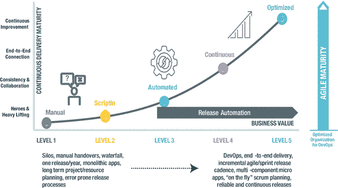
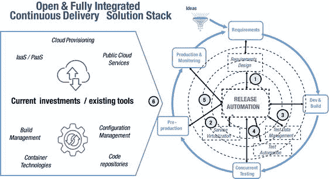

# 六、部署

Building an Agile, Resilient, and Scalable Continuous Delivery Pipeline

为了跟上对新功能和应用更新的需求，数字化转型必须由持续交付来驱动，即随时快速可靠地跨管道发布软件的能力。

几乎从每一个指标来看，解决这一问题的公司都比那些落后的公司创造了竞争优势。然而，很少有公司真正开发出所需的流程成熟度和可扩展自动化，以保持竞争力所需的数量、速度和质量水平交付应用。

在探讨提高成熟度所需的挑战和策略之前，让我们先看看由发布自动化支持的高级 DevOps 思维如何帮助技术巨头 Citrix 显著缩短部署时间并减少发布过程中的错误。 [1](#Fn1)

## 案例研究:Citrix

Citrix 为全球约 400，000 家客户提供一系列虚拟化、网络和云解决方案。为了帮助为客户和自己的用户创建更高效的工作空间，Citrix 不断寻找改进业务运营和支持创新的方法。作为这一努力的一部分，Citrix 于 2014 年 12 月成立了 IT 交付优化办公室，负责评估和改进 IT 的各个方面。作为优化工作的一部分，该团队正在采用 DevOps 原则。正如 Citrix 全球 IT 交付优化小组经理 Eugene Lehenbauer 解释的那样，“采用 DevOps 方法进行 IT 交付将有助于我们实现更好的跨团队协作、更快的交付和更高的质量。”

尽管 Citrix 的各个开发、架构和设计团队已经开始了他们自己的 DevOps 之旅，但该公司希望采用一种更加集中的方法来最大限度地提高成果并分享最佳实践。“支持创新和自由思考在 Citrix 非常重要，所以我们不想强加一套特定的工具集，”Lehenbauer 说。“但是，我们确实想让团队选择使用成熟的企业平台来自动化应用部署，以帮助他们的人员从重复和平凡的任务中解放出来。”

在概念验证过程中，Citrix 从手动发布流程转变为全自动发布流程，将部署时间减少了 80%。但这对 Citrix 团队来说还不够。开发人员受到启发，将一个大型“MyCitrix”应用重新设计为许多较小的部分，这与发布自动化一起，使应用部署时间进一步减少到 94%。

“取得如此令人印象深刻且立竿见影的可量化成果确实有助于加快 DevOps 原则在整个企业中的采用，并激发了开发创新，”Lehenbauer 解释道。

一个中央控制面板允许所有相关人员查看所有发布的状态，为团队提供他们需要的信息以快速行动，并为开发和操作团队提供审计跟踪。

MyCitrix 的每周更新通过发布自动化解决方案进行管理。“自从部署发布自动化以来，我们实现了更快的交付时间和更少的问题。因此，我们现在有更多的开发人员专注于创新，而不是被动反应，”Lehenbauer 补充道。

发布自动化是 Citrix 采用 DevOps 原则的催化剂。它使 Citrix 能够通过自动化应用发布任务和编排其持续交付工具链，采用企业级方法来交付应用。

Citrix 已经能够显著加快其应用交付，并减少发布过程中的错误和所需时间。这有助于该公司更好地响应客户需求，确保合规性和可审计性，并专注于创新而不是重复任务。

## 持续交付的障碍

正如 Citrix 的故事所展示的，持续交付软件是一个跨越多个部门的高度协作的过程，从开发到测试，从发布管理到运营。由于有如此多的利益相关者和动机，面向开发的团队所面临的挑战可能与运营专业人员所面临的挑战非常不同。

### 发展挑战

在强调增加吞吐量的同时，主要的障碍是延迟和发布瓶颈。例如:

*   手动、耗时、易出错的环境调配和发布流程
*   在整个应用发布周期中会出现许多错误，并且需要大量的检测工作来寻找问题的根源
*   由于不协调地采用开源工具而导致效率低下，导致重复劳动、冗余解决方案和脱节的集成
*   对客户反馈和市场需求的响应缓慢，影响了客户保持和获取

### 运营挑战

在强调确保稳定性的同时，主要挑战包括随着部署数量和速度的增加而保证弹性。例如:

*   破裂释放过程；使用电子表格、脚本和工具进行管理
*   随着更加敏捷的开发的出现，管理/跟踪发布的数量变得困难
*   漫长的周末，员工士气低落，由于最终部署到生产时出现的问题而产生压力
*   每个月都会发生两位数的应用中断或停机，需要“全员参与”的方法来解决
*   由于应用部署中的停机/中断或错误导致的客户和收入损失

### 寻找共同点

不管每个团队面临什么问题，重要的是通过跟踪所有阻碍成功业务成果的问题来达成共同点和共识。这是一个共享的练习，涉及到所有的利益相关者共同努力来确定组织作为一个整体在自动化软件发布的道路上处于什么位置，这些自动化软件发布驱动了对业务及其客户的持续的价值流。

Tip

考虑组织一个持续交付的“当前状态”研讨会，将所有利益相关者聚集在一起。这些人可能包括应用所有者、开发人员、企业架构师、安全经理、变更经理、发布经理、运营和支持。

为了促进公开讨论，一些好的对话开场白包括:

*   就持续交付而言，我们商定的业务目标和指标是什么？
*   我们如何管理和执行应用部署？哪些元素被大量脚本化并依赖人工干预？
*   从开发到生产，我们如何配置环境？不同的团队使用不同的过程吗？
*   在整个软件管道中，应用发布过程中有哪些显而易见的瓶颈？
*   目前利用了哪些自动化工具(例如，持续集成和配置管理)？团队使用不同的工具吗？

通过共同回答这样的问题，团队可以对整个发布过程中可能存在的弱点有一个结构化的理解，并确定自动化和改进过程的机会。

Tip

尽量不要将分析局限于发布团队和过程。寻找自动化可以帮助推动开发和测试改进的机会。应该仔细注意“当前状态”如何影响其他人的工作。例如，如果有发布延迟，这对开发有什么影响？他们使用什么流程来规避？

例如，开发团队是否会因为延迟而放弃重要的重构工作？测试是在周期的后期被推动还是因为团队认为他们以后有时间做而被忽视？

## 连续交割到期

与所有新技术和最佳实践一样，组织将处于持续交付之旅的不同阶段(见图 [6-1](#Fig1) )。有些已经开始了，通常是通过采用敏捷甚至开发运维，而其他的才刚刚开始。事实上，it 部门的不同团队处于不同的采用点并不罕见。

图 6-1。

Continuous delivery maturity levels

### 一级:(手动)

在这个层面上，成功取决于交付人员的能力和英雄气概。团队在很大程度上是孤立运作的。应用发布容易出错且不频繁，企业在新机遇下快速行动、捍卫市场地位或留住客户方面处于不利地位。

### 第 2 级:(脚本)

每个版本都规划了部署过程，并管理和跟踪状态。一些部署功能(例如，脚本)可能存在自动化。团队可能正在使用版本控制/存储库(例如，Nexus)并使用像 Jenkins/CloudBees 这样的工具进行自动化构建。很可能使用 Chef 或 Puppet 等供应或配置管理工具来帮助交付，但没有采用以应用为中心的端到端版本编排。

### 第三级:(自动化)

这里，有跨环境和版本建立的通用的、可重用的、自动化的应用交付过程。在完整的生命周期控制下，对发布过程、发布元数据和发布工件进行监控和跟踪。交付自动化存在于环境发布级别，可能包括利用现有的供应和部署自动化功能(可能不可扩展)。

### 第 4 级:(连续)

在这一阶段，发布自动化协调应用发布推广，支持从开发到生产的可预测、可监控和可度量的持续交付。组织可以在不同类型的环境中一致地部署应用，并且发布软件是一个常规且风险相对较低的事件。

### 第 5 级:(优化)

现在，所有元素都以完全协调的方式工作，以提供从规划到生产的零接触部署。通过反馈循环持续优化端到端应用交付流程，使用部署模式、场景模拟和运营发布数据分析来持续提高应用交付的性价比。团队通过持续交付管道管理多个应用(多服务),这成为一个单点控制。还非常注重弹性和连续可用性。

无论你处于持续交付成熟度曲线的哪个位置，有一点是明确的——每一个新的级别都提供了切实的好处。流程变得更加自动化和标准化。团队变得更有生产力，专注于提供差异化的功能，而不是管理计划外的工作和维护任务。他们可以应对应用不断增长的速度和复杂性，同时仍然确保质量和弹性。

## 加速成熟:三种方式

如图 [6-1](#Fig1) 所示，自动化发布过程和工具的采用通常会在持续交付的旅程中驱动主要的转折点。有三个重要的考虑因素。

### 第一种方式:连接端到端的发布管理

脚本自动生成

为了执行成功的持续交付策略，采用端到端的发布自动化方法是必不可少的。其中的关键是从开发到生产的整个过程中自动化和标准化应用发布的能力，以及计划、管理和优化发布渠道以提高质量和流程的能力。发布自动化不是孤立地行动，而是必须在持续交付工具链上与其他过程和工具(例如，连续集成、供应和配置管理)轻松集成；随着应用的数量、速度和复杂性的增长而无缝扩展。

采取这一步骤实现端到端的发布自动化也支持 DevOps 的采用。对于团队来说，拥有更有目的的协作所需的发布透明度、沟通和一致性变得更加容易。

更重要的是，跨职能团队获得了对整个发布管道的控制和可见性，系统地而不是孤立地看待发布过程。

在这个阶段和任何阶段，重要的是测量改进如何帮助支持在任何工具集实现之前确定的持续交付的业务目标。对于一家参与发布自动化 ROI 研究的大型财富 100 强金融服务公司来说，这涉及到在软件生命周期中提高应用发布率。正如 devo PS enterprise release and deployment 的经理所说，“我们的一个核心应用部署每周进行两次，原因是缺乏自动化、人力密集以及部署过程复杂。通过发布自动化实现应用部署自动化后，从持续集成到生产，应用一周内至少要部署 50 次。” [2](#Fn2)

Tip

当引入新的自动化发布方法时，永远不要低估人的影响。与其强制企业采用，不如考虑一些小而重要的项目，在这些项目中可以快速展示收益。这可以成为获得更广泛支持的催化剂。

### 第二种方法:操作反馈循环

自动到连续

虽然自动化对于持续交付至关重要，但这只是旅程的开始。随着自动化的端到端发布过程变得根深蒂固，许多新的发布挑战出现了。单独或整体来看(如表 [6-1](#Tab1) 所示)，这些压力点推动了向更好的管道管理的转变。

表 6-1。

Pressure Points Increase the Need for Advanced Release Automation

  
| 应用内容复杂性 | 更快地将反馈融入到发布中优先部署正确的内容根据业务需求演示实现，防止“受污染”的内容进入生产环境 |
| 管道乘数效应 | 规划、跟踪许多复杂的多级应用和独立开发的服务，并对其进行优先级排序；管理依赖性，避免冲突；在多个团队、项目和时间线之间共享资源 |
| 管道工具扩展 | 处理不同团队在企业中使用的越来越多的开源、自主开发和第三方商业工具 |

随着这些压力点的加剧，组织需要考虑执行多团队、跨应用、复合发布的过程，同时确保所有依赖关系都得到处理。移动部件的增加需要对管道有一个“全局”的了解，以保持生产能力，控制问题，并确保快速反馈。

更重要的是，持续交付管道正在成为单一控制点，应用交付正在变得简化、可预测且无风险。在这个阶段，发布自动化是在部署之外编排工具和流程，包括应用生命周期管理(ALM)和服务管理流程(例如，变更管理)。这对 DevOps 至关重要，因为它加强了反馈循环，更好地为决策提供信息。

企业中更多的团队现在应该通过单一控制点运行应用。如果是的话，他们可以更好地建立一个对整个组织有价值的持续交付最佳实践的框架。

Note

根据 2016 年开发运维状况报告，高性能 IT 组织的部署频率是低性能 IT 组织的 200 倍，交付周期快 2，555 倍。 [3](#Fn3)

### 第三种方式:优化持续输送管道

连续到优化

尽管很少有部门在这一级别运作，但这是所有团队都应该追求的最高境界。

由于持续交付管道太重要而不能失败，注意力应该集中在使管道(如此多的团队所依赖的)尽可能高效、稳定和有弹性上。

这包括转向掌握发布多应用、跨应用、多团队应用的艺术，并使部署更加可预测和高效。通过加速反馈循环提高业务执行将是另一个好处，通过建立持续改进的文化，团队将接受“快速失败”的文化，然后在他们的发布过程中应用学到的教训来防止未来的问题。

一家领先的财富 100 强金融服务公司的 DevOps 工具管理总监很好地解释了持续改进的概念，他说:“敏捷和持续的交付只能是一个旅程。你永远不会结束；你一直在移动指针。总有你可以做的事情。” [4](#Fn4)

## 基本工具链集成

虽然审查发布自动化解决方案的功能方面很重要，但是更重要的是从它如何帮助组织提高持续交付成熟度的角度来检查一个解决方案。

没有一个发布自动化工具能够独立工作。更先进的解决方案将作为一个集成中心，协调整个管道中的许多活动。简单来说，这可能涉及以应用为中心的发布自动化，以配置支持新版本所需的所有资源(例如，分配服务器和存储容量，并确保有适当的平台来接收版本)。

除了解决眼前的运营需求，高级解决方案还将与许多其他流程协同工作，以构建一个持续的交付生态系统，帮助 IT 实现最高级的成熟度。这里区分能力的不仅仅是强大的集成，而是支持更具适应性的工具链所需的灵活性——在这个工具链中，新技术可以快速而容易地被合并，以加强持续交付模型。

Tip

为了避免供应商锁定，确保发布自动化工具提供一个开放且可扩展的平台，与任何持续交付工具链轻松集成，以实现端到端的可见性和发布流程编排。

图 [6-2](#Fig2) 和随后的部分说明和描述了优化持续交付所需的基本发布自动化工具链集成。

图 6-2。

Release automation: toolchain integration

1.需求设计

这种集成允许敏捷团队在软件生命周期中跟踪多应用发布内容，并建立关键的反馈循环，以便更快地解决问题和交付应用。

通过一个实时仪表板来管理和监控发布管道中的多应用发布内容(用户故事、特性和错误修复),敏捷团队可以获得发布进度的完整可见性，更容易地协调依赖性，并可以映射到业务需求。

如果没有这种集成，敏捷团队将不得不手动跟踪和报告业务级别的用户故事、特性，或者对通过管道的特定应用版本的修复。

2.服务虚拟化

这种集成自动启动虚拟服务，作为优化资源和加快测试的部署的一部分。

在这里，DevOps 实践者可以直接在部署工作流中跨多个虚拟环境提供虚拟服务和执行测试套件。通过部署到任何测试环境中，团队都摆脱了约束(例如，等待构建物理硬件环境并为测试做好准备)。这提高了生产效率，加快了实现价值的速度。

没有这种集成，发布过程可能会中断。需要手动请求来调配独立于自动部署工作流的物理系统和虚拟化服务。这阻碍了价值的流动，并将资源束缚在重复性和容易出错的任务上。

3.测试数据管理

这种集成基于发布工作流中适当的测试用例自动生成准确的测试数据。

如果没有这种集成，就需要手动请求来生成独立于自动化部署工作流的正确的测试数据。同样，这会导致发布中断、延迟和交付变慢。

Note

集成测试数据管理和发布自动化应该被认为是 DevOps 自动化的最佳实践。它不仅确保团队可以随时访问准确的测试，它还有助于在发布过程本身中建立合规性(例如，生成合成数据以保护客户信息),并避免与每个周期结束时冗长的审计检查相关的延迟。

4.测试自动化

这种集成会自动启动测试用例过程，并将结果绑定到发布中，以确定和确认升级的准备情况。

在这里，测试用例过程将被自动启动，结果链接回发布。这对于决定是否进行自动升级至关重要，从而实现更快、更高质量的部署。

如果没有这种集成，就必须手动确定应用是否已经充分通过了测试阶段，以便前进到下一阶段，然后手动提升应用。同样，这很耗时。

5.性能监控

这种集成在软件生命周期的早期建立了监控，以便反馈提高质量所需的关键信息。

发布自动化可以协调生产前监控的安装和激活。“左移”监控技术(在第 [7](07.html) 章中讨论)使团队能够看到发布的性能影响，并将其与生产基线进行比较。这为开发提供了与代码相关的性能问题的早期警告，并为运营提供了服务级别需求的早期指导。

6.现有工具链投资

一个完全集成的持续交付工具链解决方案将是开放和可扩展的，在标准和可重用的发布过程中协调任何现有产品的应用。一些重要的集成包括:

*   持续集成—在 Jenkins 中立即完成软件构建后，自动启动应用部署。
*   配置管理—将发布自动化与 Chef 和 Puppet 等解决方案相结合，以解决当目标环境处于未知状态时尝试部署的问题。这里的集成可用于在部署之前强制实现特定的环境配置，并管理配置偏差。
*   云资源调配—使用户能够构建工作流，在部署工作流中调配、配置和拆除云环境。

## 发布自动化:能力清单

由于发布自动化在集成工具链中的工具和过程中扮演着如此重要的角色，这一类别的解决方案至少应该提供一个能够支持以下功能的部署引擎:

*   工件管理—在物理、虚拟、公共或私有云中部署许多不同组件和应用配置的能力。
*   可配置的部署选项—一个强大的可视化工作流引擎，可轻松创建标准、可重复使用的部署流程，将应用从一个环境提升到另一个环境。
*   可重用的部署最佳实践——共享组件，允许团队在不同的项目和应用中利用和重用部署逻辑。
*   首选工具的编排—如前所述，解决方案应利用现有的工具和技术投资，通过使用现成的操作包或软件开发工具包来实现部署自动化。
*   部署补救和审计——使用可视化仪表板，团队可以跟踪和记录配置、工件和发布进度，以进行改进和审计。

为了开发、计划、管理和优化持续交付管道，发布自动化还应该扩展到帮助团队:

*   设计共享管道—在持续交付管道中编排手动和自动任务。
*   执行许多复杂的发布—贯穿所有发布阶段—从开发到生产的多应用、多团队发布。迭代和改进失败的内容。
*   规划和管理时间表—使用可视化日历在多个阶段安排和管理应用。提供冲突和维护窗口的即时通知。
*   改善协作—为任务分配所有者，并使用活动订阅源来共享评论。
*   管理和跟踪内容—在生产过程中跟踪功能。在确定优先级时提供全面的见解，并确保明确延迟的业务影响。
*   优化发布—实时检测问题，识别瓶颈，并改进流程和团队活动。

随着成熟度的提高，发布自动化应该迎合更高级的需求。这可能包括:

### 依赖性管理

当构建多组件/多应用系统时，应用或应用的不同版本之间会有复杂的依赖关系。这可能包括发行版、内容、应用和应用版本级依赖关系的混合。了解哪个应用版本依赖于哪个版本是至关重要的，并且通常只有部门内的少数专家知道。系统应该能够建立这些依赖关系的定义，并在不满足依赖条件时自动发出警报。

### 具有通知的管道可见性

系统应该提供发布管道的清晰视图，包括所有阶段和每个阶段中的所有任务。每个阶段都应该显示任务列表、任务的执行顺序，以及是顺序运行还是并行运行。为了支持连续的交付，每个发布都应该触发一个新的构建，并通过管道从测试阶段一直到生产阶段提升这个构建。自动化应该重复各个阶段，直到所有任务都通过预定义的标准。如果某个版本出了问题，应该通过自动通知来减少延迟和空闲时间。

### 灵活的审批流程

对于生产部署等敏感阶段，可能需要完全的治理。为了支持这些情况，系统应该通过只允许被许可的用户批准这些阶段的执行来防止错误。

## 建议和行动计划

为了获得本章中描述的持续交付最佳实践，组织需要确保在采用自动化方法时应用尽职调查。

正如所建议的，最好的开始方式是通过评估当前使用的过程、文化和工具。通过这种方式，可以更清楚地了解企业目前所处的位置，以及它们需要达到的位置，以支持商定的目标和目的。

在其旅程的开始，City Index 使用手动流程将应用代码从开发部署到生产。价值链分析表明，将代码从开发环境转移到质量保证，然后在最终投入使用之前进行预生产，占交付工作的 50%。 [5](#Fn5)

Tip

评估功能时，不要将分析局限于一个元素(例如，测试实验室配置或配置管理)。采取系统级的方法来理解每个阶段的价值流和抑制因素——包括人员、流程和技术。

### 展示业务优势和投资回报

涉众、影响者和决策者需要理解采用发布自动化工具来支持持续交付的潜在商业利益。

用于指示 IT 性能并有助于支持案例的两个关键指标类别包括交付应用的速度或吞吐量，以及版本的质量或稳定性。

Tip

从那些在发布吞吐量和质量方面都取得显著进步的公司中寻找真实的客户例子。ING 就是这样一个例子。他们将发布频率提高到每月 12，000 次以上，以不到六周的周期时间实现了更快的上市时间，但事故减少了 50%以上。 [6](#Fn6)

任何解决方案还必须证明对部门和业务的积极经济影响，包括短期和长期影响。为了支持这一点，CA Technologies 委托 Forrester Consulting 进行了一项总体经济影响(TEI)研究，并考察了企业通过实现 CA 发布自动化可能实现的潜在投资回报(ROI)。 [7](#Fn7)

为了更好地了解与实现相关的优势、成本和风险，Forrester 采访了已经在其企业中实现了该解决方案的五家组织。作为一个整体，这家综合公司报告投资回报率为 389%，净现值为 844 万美元，投资回收期为 2.8 个月。该研究还表明，复合组织的配置管理和测试团队节省了部署时间和精力，三年内节省了 6 名全职员工，节约金额达 122 万美元。

Note

为了帮助确定商业利益和投资回报，寻找计算发布自动化的全部经济影响的工具。全面的工具提供总体效益分析，评估各种指标，如提高员工生产力、减少发布错误、缩短价值实现时间以及降低审计和合规成本。

### 战术执行，战略发展

从小处着手是可以的:着手一个冗长的公司范围的委员会来调查引入发布自动化不符合任何人的利益。通过试点项目展示商业价值通常更容易。

有了这个想法，考虑选择一个合适的项目作为你的试点。许多部门从低风险的应用开始，这些应用很重要，但不是业务关键型的。我们的目标是开始大量的支持，收集令人信服的指标，然后在更大的团队和项目中应用学到的经验。Western Union 共享服务企业 IT 运营团队采用基层方法来采用 DevOps，从小规模和可衡量的项目开始。团队使用发布自动化工具将软件发布到产品中，然后以此为杠杆打开与开发伙伴进行更广泛对话的大门。 [8](#Fn8)

## 摘要

在这一章中，我们讨论了推进持续交付成熟度所需的自动化方法——将团队从手动的、脚本化的过程带到更加自动化的、标准化的、高效的和敏捷的方法，同时持续改进发布的质量和他们交付的应用。

我们还描述了作为持续交付生态系统的关键，发布自动化解决方案必须能够协调许多过程和工具。最终目标是在整个企业内实现完整的持续交付优化，以及从规划到生产的零接触部署。

在下一章中，我们将探讨构建更加敏捷的运营所需的 DevOps 策略，这些策略超越了对应用和基础架构的基本监控，致力于优化至关重要的客户体验。

This chapter is distributed under the terms of the Creative Commons Attribution-NonCommercial-NoDerivatives 4.0 International License (http://creativecommons.org/licenses/by-nc-nd/4.0/), which permits any noncommercial use, duplication, distribution and reproduction in any medium or format, as long as you give appropriate credit to the original author(s) and the source, provide a link to the Creative Commons license and indicate if you modified the licensed material. You do not have permission under this license to share adapted material derived from this book or parts of it. The images or other third party material in this book are included in the work's Creative Commons license, unless indicated otherwise in the credit line; if such material is not included in the work's Creative Commons license and the respective action is not permitted by statutory regulation, users will need to obtain permission from the license holder to duplicate, adapt or reproduce the material. Footnotes [1](#Fn1_source)

完整故事: [`http://www.ca.com/content/dam/ca/us/files/case-studies/citrix-boosts-business-agility-and-accelerates-devops-adoption-with-ca-release-automation.pdf`](http://www.ca.com/content/dam/ca/us/files/case-studies/citrix-boosts-business-agility-and-accelerates-devops-adoption-with-ca-release-automation.pdf)

  [2](#Fn2_source)

CA 发布自动化的总体经济影响，2015 年 12 月: [`http://www.ca.com/content/dam/ca/us/files/industry-analyst-report/the-total-economic-impact-of-ca-release-automation.pdf`](http://www.ca.com/content/dam/ca/us/files/industry-analyst-report/the-total-economic-impact-of-ca-release-automation.pdf)

  [3](#Fn3_source)

2016 年 DevOps 国家报告: [`https://puppet.com/resources/white-paper/2016-state-of-devops-report`](https://puppet.com/resources/white-paper/2016-state-of-devops-report)

  [4](#Fn4_source)

CA 发布自动化的总体经济影响，2015 年 12 月: [`http://www.ca.com/content/dam/ca/us/files/industry-analyst-report/the-total-economic-impact-of-ca-release-automation.pdf`](http://www.ca.com/content/dam/ca/us/files/industry-analyst-report/the-total-economic-impact-of-ca-release-automation.pdf)

  [5](#Fn5_source)

完整故事: [`http://www.ca.com/content/dam/ca/us/files/case-studies/city-index-bets-on-ca-release-automation-for-it-operations.PDF`](http://www.ca.com/content/dam/ca/us/files/case-studies/city-index-bets-on-ca-release-automation-for-it-operations.PDF)

  [6](#Fn6_source)

[T2`http://www.slideshare.net/CAinc/case-study-ing-builds-highly-available-continuous-delivery-pipeline-with-microservices-and-containers`](http://www.slideshare.net/CAinc/case-study-ing-builds-highly-available-continuous-delivery-pipeline-with-microservices-and-containers)

  [7](#Fn7_source)

[T2`http://www.ca.com/au/collateral/industry-analyst-report/the-total-economic-impact-of-ca-release-automation.html`](http://www.ca.com/au/collateral/industry-analyst-report/the-total-economic-impact-of-ca-release-automation.html)

  [8](#Fn8_source)

演示- [`https://www.youtube.com/watch?v=JW2eukJuOqw`](https://www.youtube.com/watch?v=JW2eukJuOqw)