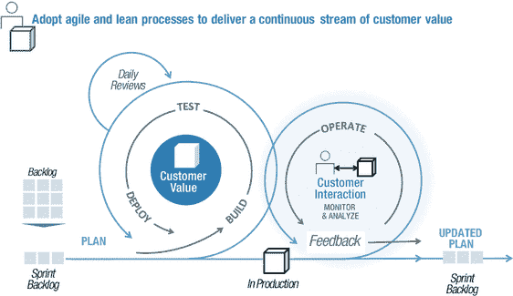
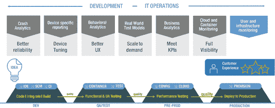
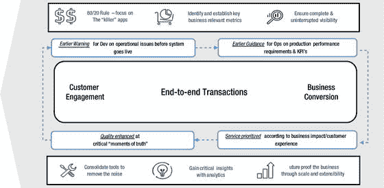
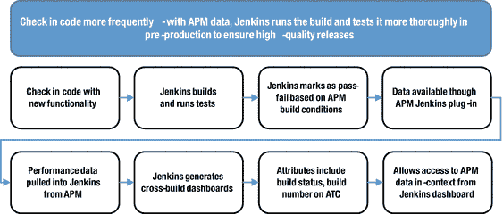

# 七、运维

Agile Operations: Powering the Modern Software Factory

在传统的企业 IT 中，开发人员的代码和操作管理“越过墙”进入生产的东西。虽然 DevOps 认为这是最终的分裂性反模式，但是这种实践仍然进行了几十年——但是为什么呢？

由于客户参与的性质，这种模式通常会持续下去。应用通常被设计为“由内向外”，通过单一渠道与客户进行交互。即使渠道被数字化，重点也是提高业务效率，客户利益只是事后才考虑。对于 IT 运营部门来说，支持这种模式很困难，但还是可以管理的。

但这一切都在彻底改变。现在，企业认识到，必须将客户“外部”的需求引入“内部”,并通过全渠道合作提供支持。无论客户在何时何地以何种方式与企业互动，全渠道都是关于体验的连续性。

从商业角度来看，全渠道提供了一个通过新的数字接触点提升至关重要的客户体验的机会；然而，这增加了 IT 运营的复杂性，团队现在面临着管理越来越多的快速变化的软件服务，这些服务是通过现代和传统的应用和基础架构交付的。

随着公司以数字化方式从业务效率“升级”到业务模式转型，IT 运营的价值主张必须改变，从擅长管理技术现状，到变得更加敏捷和完整，以推动成功的业务成果。

这种敏捷操作的概念与 DevOps 高度协同，因为它涉及团队协作，在软件生命周期中建立高质量的客户体验。敏捷运营团队不是等到生产和改进性能，而是使用新的监控方法与开发密切合作，在设计、测试和发布应用时将质量“烘焙”或加工到应用中。

在研究新的挑战和敏捷运营监控策略之前，让我们先来研究一个 DevOps 风格的实践取得巨大成效的案例。

## 案例研究:ANZ 银行

如今，银行业竞争的唯一来源是对服务和取悦客户的痴迷。总部位于澳大利亚墨尔本的 ANZ 银行最近推出了一项新的应用性能管理(APM)计划，希望将其扩展到整个 it 基础架构，包括四个数据中心、大型机和 10，000 多台服务器。 [1](#Fn1)

“我所有团队的首要目标是为我们的客户提供 100%的服务。就这么简单，”ANZ 银行 It 安全和运营主管 Adam Cartwright 解释道。

“这意味着不管是什么渠道——不管是进行工资交易的公司还是使用网上银行转账的私人用户——它都必须开通。必须天衣无缝。它的表现必须符合他们的期望。这是技术运营的首要任务。”

Cartwright 说，不幸的是，现代分布式应用的复杂性意味着这种情况不会一直发生。应用和系统停止运行，对最终用户造成负面影响。在 2012 年，很明显，基础设施监控本身(侧重于基础设施级别的平台和事件监控)不足以为 ANZ 银行提供修复和预防组织内事故所需的洞察力。

他解释说:“你真正需要做的是了解应用环境中的交易流程，以确定根本原因，或者在客户实际发生(事故)之前，你是否会获得潜在问题的早期信号。”。

例如，该银行有一个分布式支付应用，用于为其最高价值的客户交易数十亿美元。该应用包括 120 多个分布式服务器和 60 个独立的 Java 应用。每当应用出现问题时，几乎不可能确定稳定性问题的根本原因。最糟糕的是，很多时候，ANZ 银行直到客户通知他们这个问题时才意识到有问题。

这些挑战促成了 ANZ 银行应用性能管理(APM)的许多目标。首先也是最重要的一点，它希望减少由应用发布引起的事故数量。这将提高应用部署或更改的质量和信心，同时改进新 ANZ 应用的整体生命周期。

此外，Cartwright 希望有一种方法能够深入应用层，以获得代码级别的可见性来衡量性能和可用性。他还希望在交易通过高度多样化的分布式 ANZ 银行基础设施技术时进行测量和分析。这些努力帮助银行最大限度地减少了客户停机时间。

使用 APM，IT 现在可以在问题影响服务之前主动发出警报。由于 APM 不仅允许公司查看流经应用的事务，还允许公司识别与这些事务相关的业务用户行为，因此可以更快地发现中断，并且可以重新设计应用，以便中断不会重复发生。

“在生产中获得这种洞察力是很棒的，但也许更棒的是在开发和测试环境中获得这种洞察力，”他说。“我们已经能够证明，通过将 APM 投入开发和测试——使其成为这些领域流程的一部分——您可以阻止缺陷进入生产。对于不熟悉 APM 的人来说，这可能是最令人惊讶的事情，但从生产支持的角度来看，这是最重要的事情。”

卡特赖特说，事实上，这是 APM 更令人震惊的好处之一。例如，一个项目团队能够防止 10 起严重事故的发生，节省了十几个小时的调查时间。另一个项目团队将恢复时间从四个多小时减少到不到 30 分钟，而对服务没有任何影响。Cartwright 解释说:“虽然拥有 APM 并在生产中出现问题时使用它来诊断问题是件好事，但您的客户已经受到了影响。”。“最好从一开始就阻止这种客户效应的发生，不要让这种设计问题在产品化过程中蔓延。”

ANZ 银行在测试和开发领域的首批项目之一是一个支付应用，它导致了严重的生产问题。该银行每年发布五到六个主要版本，每次新版本上线都会出现“一大堆”严重事故。Cartwright 说:“无论我们做了什么测试、审查、传统的方法，或者性能和容量测试，我们总是设法在一个发布上线的情况下结束，我们在生产中会遇到问题。

通过使用 APM，ANZ 银行消除了 10 到 15 起严重程度较高的事件，这些事件通常会在发布后持续三到四周。“现在，我们减少到一两起，或者在某些情况下，零起[事故]，”卡特赖特说。IT 员工对这一变化兴奋不已。

ANZ 的支持过渡分析师 Joseph Rocco 解释说:“自 APM 投入使用以来，我们已经能够准确定位受影响的服务器，并在不影响业务和支付处理的情况下重启这些服务器。“在 APM 之前，LMS[限额管理系统]恢复需要四个多小时。APM 之后，总共需要大约 30 分钟来重新启动受影响的服务器，而不会出现宕机。”

这是一个事实的例子，虽然 ANZ 的主要重点是客户满意度，但减少事故的一个积极的副作用是它给整个 it 组织带来了促进。“如果你可以停止事故，你可以跟踪组织内的能力和人数，以做其他事情，更积极的事情，”罗科说。“APM 本质上意味着，随着系统占用空间的增长和复杂性的增加，您的组织将继续增长。”IT 员工可以更加主动，而不是被动。

在这一成功的基础上，ANZ 将其左移方法扩展到了 20 多个应用。因此，它具有性能和可用性问题的代码级可见性，这不仅阻止了缺陷进入生产环境，还增强了银行对应用开发和部署的信心。

开发和运营团队都进行性能和负载测试，并关联他们的数据。结果，预生产效率提高了，解决软件问题的时间减少了 60 %,相当于节省了 30 万澳元。 [2](#Fn2)

## 更多的变化，更多的复杂性

像 ANZ 银行这样的进步组织了解客户如何期望新功能的快速软件迭代以及高水平的性能。这个事实在企业管理协会(EMA)的报告中得到了说明，该报告指出，三分之二采用连续交付的组织每周甚至更频繁地发布代码。但是这并不是没有问题，EMA 的报告还指出，现在开发部门花在支持生产上的时间和写新代码的时间一样多，而运营部门花在应用支持上的时间比任何其他单一任务都多。

这种支持现在扩展到管理现代微服务风格的架构。微服务旨在作为执行一组特定任务的离散元素(或服务)进行部署，并作为自己的流程运行，它将特定的功能分解为通过 API 连接的小组件。

虽然这种方法潜在地允许更有规律地更新服务，而不影响支持业务流程的其他元素，但是存在重大的操作挑战。至少:

*   增加多样性——借助微服务，开发人员可以用多种语言编写代码，并使用最适合其服务的数据库。对于运营来说，这意味着在 Node.js 和 MongoDB 等不熟悉的技术上保持性能和可用性。

Tip

请始终记住，对于由微服务和更新技术支持的现代数字系统应用，应用性能管理解决方案必须比它们所监控的任何东西都更具弹性和可扩展性！

*   噪音增加-随着移动应用、微服务和容器化环境的出现，警报和警告的数量可能会显著增加。试图使用传统的基于规则的方法来发现、过滤掉噪声并找到问题的根本原因变得更加困难。

*   许多微服务的复杂性在于服务之间的关系和以 API 为中心的通信。对于这样的分布式系统，团队必须考虑一系列新问题，包括网络延迟、异步消息传递和负载平衡，更不用说微服务与后端应用连接时的端到端性能问题了。

*   巨大的复杂性——一个整体应用可以变成数千个微服务。与单片不同，微服务使得使用传统工具可视化应用拓扑和事务流极具挑战性。再加上潜在的并行运行多个服务版本的可能性，监控复杂性将呈指数级增长。

Tip

考虑定期指派开发人员检查他们的代码产生的警报和日志消息。这可能是识别哪里需要重构工作或者改进应用可支持性的一种有用的方法。

*   短暂性—随着变化的步伐加快，应用的生命周期必须大大缩短，分流团队不再能够使用过多的工具来捕获和分析历史数据。团队需要方法来更好地理解现代架构(包括容器)的实时性能，在更动态的环境中，实时性能可能在几分钟甚至几秒钟内发生变化。

## 新的 IT 运营要求

IT 运营作为一门学科，将不再根据它在解决应用问题方面的效率来判断，而是根据改善业务成果的能力来判断——检测和解决问题，是的，但要与软件工厂中的其他团队协作来建立质量。

在 ANZ 的案例中，令人钦佩的是如何管理业务成果已经成为 IT 运营咒语的一个既定部分。的确，团队仍然负责维护稳定性和弹性，但是通过在他们传统控制之外的领域建立性能监控，质量和信心得到了实质性的提高。

DevOps 专注于运营的职能部门将利用先进的工具，在系统投入生产之前主动确保高质量的客户体验，而不是被动的中断修复监控方法。从这个意义上来说，实践者将会成为超级系统管理员，和他们的开发同事一样敏捷。随着开发人员越来越有权制定运营决策，向敏捷运营方法的转变将变得更加重要。

那么敏捷运营团队需要掌握哪些新技能呢？有几个重要的问题需要考虑，将在下面的章节中介绍。

### 主动参与

随着技术的进步，IT 运营格局发生了巨大的变化，但不一定是价值观或思维的变化。随着运营职能的民主化，一个优秀的敏捷运营实践者将努力深入理解应用的行为，培育生产系统，并反馈信息和知识。为此，敏捷运营技术将不再是拔出路由器电缆和控制台监视，而是更多地分析应用行为和客户体验，以推动改进。

### 为失败而设计

从预防失败的角度衡量运营效率的传统方法不再有效。就技术和流程而言，云应用有许多移动部分。将会有支持新数字渠道的移动应用和应用编程接口，但也有后端数据和系统。在这些环境中，失败是不可避免的，因此目标应该是为它们设计—包含问题，但仍然保持业务运行。

接受这一现实，敏捷运维将与开发部门紧密合作，以完善优化现代基于云的系统所需的软件工程和监控实践，例如，在每个版本中建立基础设施监控，或在每个应用构建中公开性能诊断。

Tip

让在每个环境中建立基础架构和性能监控成为常规而非例外—从配置或维护模式开始。

### 超越弹性

就像神话中的凤凰一样，现代云系统和微服务应该被设计成能够从各种情况中恢复过来。他们必须这样做，因为当企业使用这些方法来大规模吸引客户并处理未知需求时，将会变得更加复杂，至少要确保数百(也许数千)项服务持续可用和高效。

再加上复杂的体系结构问题，如异步消息传递和 API 延迟，这是一个全新的痛苦世界。这类似于砍掉神话中九头蛇的头。当你解决了一个问题，又有两个问题出现了。这就是为什么弹性还不够。

当考虑新的数字交战系统时，应用不仅要有弹性，还必须像 Hydra 一样。敏捷运营方法不是解决问题，而是在每一个重大事件(积极的或消极的)发生后，致力于从技术和商业上改进应用。这对移动应用尤其重要，这也是基于体验的分析变得越来越重要的原因。

### 使支持成为首要的设计问题

敏捷运营不是充当下游的生产交通警察，而是以顾问的身份与上游的开发人员合作。当然，这需要开发的全面参与；希望从 IT 运营中学习，以便设计和构建一旦投入生产就更容易支持的系统。

但是，如果运营部门不能提供有用的信息，或者所使用的工具只能从一个角度解决监控问题，那么花时间学习就很有挑战性。如果为了满足项目级别的目标，开发团队选择了他们自己的单点工具和方法，而牺牲了整个系统级别的弹性和性能，这也是很困难的。

解决这些问题需要在软件生命周期的各个检查点结束与开发的“肉搏战”(这种战斗从来不会有好结果)。它包括展示每个人多年来获得的知识和专业技能不仅有助于提高应用的可支持性，而且使人们的工作更容易、更有价值。一些例子包括:

*   在移动应用场景中，提供实时使用崩溃分析，开发人员可以使用它来确定可能需要改进的功能。
*   共享 APM 工具集，使开发人员能够从他们的角度审查问题。用他们的方式提供信息，关于他们的世界，他们的代码。

Tip

考虑组织联合开发和运营研讨会，让团队公开讨论和分享他们多年来学到的“酷”东西。这包括运营部分享有关提高弹性的信息，以及开发部解释用于小批量发布软件更新的方法。

*   公开讨论旧式警报和静态基线在监控现代动态环境中的意义如何降低，并且只会增加支持负担。
*   联合执行分类场景，模拟在凌晨 3:00 尝试修复应用问题时真正涉及的内容(临床审查工具，以确定任何“噪音”是否确实值得让支持人员在凌晨起床)！

Tip

使用研讨会和工具:1)帮助开发人员理解其设计的“随叫随到”支持含义，2)帮助运营人员理解开发人员需要哪些信息来提高性能。

### 主动监控

团队需要采用积极的监控方法，在问题影响客户之前建立对问题的理解。其中包括寻找更好的方法来消除误导性警报和误报。

传统上，监控解决方案使用性能基线来处理误报警报。尽管这有所帮助，但这些方法通常只关注问题的一部分:严重性。看待这个问题的另一种方式是分析严重性和持续时间。例如，长时间发生的小问题可能最终升级为团队需要调查的大问题。或者，有时发生的中等问题应该发出警报，因为它可能会很快变成更大的问题。

Tip

一旦应用了去除无关噪声和警报的技术，就要寻找将主动警报与捕获更详细信息的方法相结合的方法。例如，自动启动诊断事务跟踪。

## 走向敏捷运营

与 CA Technologies 联合制作的 2015 年 Freeform Dynamics 报告表明，使用 DevOps，分别有 63%和 61%的高级采用者能够更好地帮助企业迅速抓住数字机遇，更快地进行攻击和防御，77%和 72%的人还表明在实现客户获取和保留目标方面有所改进。 [4](#Fn4)

这表明组织可以在不牺牲高质量的情况下快速前进。

实现这一点需要 IT 运营部门采用许多敏捷开发同事熟悉的实践和过程。当然，这仍然需要监控生产应用的性能，但这也意味着确保获得的信息被反馈并整合到敏捷开发过程中(例如，敏捷 sprints)。见图 [7-1](#Fig1) 。但是，正如我们所描述的，IT 运营部门必须确保与开发部门共享的信息比通过传统系统警报提供的信息更有价值。

图 7-1。

Agile development and operations

从开发的角度来看，有许多新的工具和技术支持左移阶段，因此团队可以并行工作以满足持续交付的目标。例如，如第 [5](05.html) 章所述，通过模拟依赖系统，服务虚拟化解决方案帮助团队消除约束，从而为团队提供即时和真实的测试环境。

IT 运营采用这种方法的速度要慢一些。这通常是因为要监视无数的诊断工具——这意味着花在传递对同事真正有用的信息上的时间减少了。

但是，未能采用敏捷运维左移的方法可能会导致成本增加并错失商机。例如，由于意外的性能问题而匆忙购买额外的容量，或者由于过多的非工作时间支持而增加了员工的疲劳和流动而雇用更多的承包商。

### 左移监控

当人们感到无力应对任何类型的变化时，采用像 shift-left 这样的敏捷操作方法可能是一个令人生畏的前景。根据企业管理协会(EMA)的报告，不到 50%的 IT 专业人员相信他们的应用管理解决方案能够充分满足现代 IT 环境的监控要求。 [5](#Fn5)

因此，抵制向不断增长的监控工具库中添加另一种工具(无论是商业工具还是开源工具)的冲动是很重要的。这种方法会进一步加剧团队分裂，这一点在基础架构和运营趋势调查中得到证实，80%的受访者认为脱节的跨平台管理会导致失去机会。 [6](#Fn6)

正如调查所暗示的，从业务角度来看，这可能是次优的，尤其是当不完整(或不可理解)的绩效信号导致糟糕的决策时。例如，由于意外的性能状况而抢购服务器。这可能解决了眼前的问题，但该组织刚刚降低了其利润率，真正的问题仍然潜伏在某个地方。

这表明监测方法应该从“避免”的角度进行。也就是说，在问题影响到业务之前，通过尽早、经常地检测它们来避免问题。用更少的工具或专家来做这件事，也避免了成本负担。反复实现和演示，IT 运营不再被视为成本中心，而更多地被视为价值创造者，从而增加了利润。

#### 持续的高质量反馈

实现持续的反馈循环是敏捷运维左移方法和 DevOps 项目成功的基础。最简单的形式是，来自运营的反馈应该有助于开发减少代码缺陷的数量，而来自开发的反馈应该在应用投入生产之前指导运营服务级别需求。

说起来容易，但实际上很难做到。应用更加多样化、分散化和短暂，这意味着反馈必须更快、更丰富、可用和有用。为了支持这一点，现代方法必须在临床上消除噪音，提取智慧，然后(这是真正重要的一部分)将其放在最能从中受益的人的背景下。这样的反馈更有价值，因为它是可操作的。

举个例子，一个移动购物应用更新了新的社交网络 API，它将利用黑色星期五发布。新的 API 可能是增加收入的好方法，但是由于需求难以预测，开发人员如何知道他们的代码将处理后端延迟和负载？我们可以采取“先吸后看”的方法，或者增加数据中心的容量，但这关系到品牌声誉，值得冒这个险吗？

或者，我们可以使用敏捷运营思维——在开发人员每次提交代码时，提供他们对 API 延迟、后端加载问题、端到端事务时间、移动设备性能影响的关键见解。这样，在他们发展的过程中，当他们从中获益最大时，反馈就会被提供。由于它被放在他们希望支持的业务目标的上下文中，因此可以立即付诸实施。这使得整个团队能够更有目的、更有紧迫感地行动。

像这样的场景在现实世界中无时无刻不在上演，敏捷运营方法提供了建立对问题和改进机会的共同理解所需的跨职能粘合剂。例如，通过在性能基准测试中使用监控工具，团队可以更好地解决容量和可伸缩性问题；获得信心，正在开发的新应用可以应付生产负载。这是丹麦零售商 Dansk Supermarked 在实施 APM 解决方案来监控开发、测试和生产环境时实现的一项重大优势。 [7](#Fn7)

通过促进绩效信息的共享，敏捷运维帮助团队超越在运维效率上的微小增量改进，成为业务差异化因素。一份 Techvalidate 报告证明了这一点，该报告表明，超过一半的使用 APM 的组织表示，它帮助他们主动管理用户体验，以创造竞争优势。 [8](#Fn8)

#### 情报和分析

随着运营职能与开发的融合，高级分析和统计方法将在为 DevOps 从业者提供推动改进所需的基本信息方面发挥关键作用。

跨职能团队将采用更新的技术来更好地预测应用性能和使用情况，而不是试图处理堆积如山的警报来获得对当前性能状态的清晰了解。有了这些见解，团队将会做出更聪明、更快速的决策，不仅仅是在生产环境中，而是在整个软件生命周期中(见图 [7-2](#Fig2) )。

图 7-2。

Agile operations analytics—quality and resilience across the software factory

一些有价值的方法包括:

*   移动应用分析崩溃报告-帮助确保任何影响用户体验的可靠性问题得到快速解决。借助特定于设备和平台的分析，开发人员可以优化代码，在所有移动终端上实现统一的性能。
*   行为分析-通过了解移动应用在现实条件下(例如，慢速无线网络)的表现，开发人员可以优化用户体验(UX)设计。
*   使用和性能分析——这使开发人员能够在每次新的迭代中改进设计，确保他们构建的东西在使用和条件变化时保持高性能。
*   业务分析——当应用进入生产时，这些可以增加应用满足业务目标的机会。分析还可用于衡量不同应用的投资回报率，以帮助确定未来开发的优先顺序(例如，揭示新开发的特性和功能如何帮助提高客户参与度和防止流失)。

随着数字商业格局的不断变化，预测分析将得到规范性技术的补充，这些技术实际上可以指导从业者在任何给定情况下找到最佳行动路线。随着进行长期根本原因分析的时间越来越少，这些技术将成为敏捷运营的关键。

在 APM 环境中，很容易看到复杂的分类的直接作用——在问题出现时开出解决方案。但是随着这些技术的成熟，它们也会变得更加以业务为中心。例如，考虑具有预测由于缓慢发展的性能问题而错过的在线销售目标的能力，然后在应用(设计、功能等)中快速规定必要的改变。)和基础设施来防止问题的发生。

提供像这样的基于业务成果的能力将成为成功的敏捷运营和左移战略的最终试金石。

### 敏捷运营工具

为了交付我们所描述的敏捷操作和左移方法，组织需要确保他们拥有正确的应用性能管理策略和工具。在查看工具本身之前，如图 [7-3](#Fig3) 所示，让我们概述一些主要考虑事项:

图 7-3。

Agile operations and shift-left monitoring—essential strategies and tools capabilities

#### 商业和发展预警

敏捷运营工具应该在系统上线之前提供对业务交易性能的关键洞察。随着业务遍历 API、移动应用、web 基础设施和后端记录系统，全面了解整个应用和基础设施结构的性能变得至关重要。这使得开发团队能够快速理解基础设施的依赖性，功能变化如何影响业务性能，以及哪里需要重构。

举例来说，让我们考虑一下将 APM 与持续集成工具(例如，Jenkins)集成在一起如何帮助开发人员。通过在构建过程中提供 APM 数据，开发人员可以快速确定他们的代码对性能的影响(早期警告)，然后利用它来制定改进措施。例如:

*   在两次构建之间立即看到 API 使用的增加。回报:避免 API 按使用付费场景中的成本增加。
*   识别新移动应用开发中认证服务的过度使用。回报:改善客户体验。
*   了解上游功能变化如何导致下游性能问题。回报:确定与构建相关的风险。

所提供的 APM 数据也应该非常细粒度(例如，方法和事务)，并允许开发人员回滚以查看任何代码级或环境变化对性能的影响。此外，通过将 APM 与持续集成的通过-失败构建测试相结合，可以在早期建立高质量(参见图 [7-4](#Fig4) )。

图 7-4。

APM and Jenkins integrated workflow Note

通过双向整合，该流程还更新了 APM，允许运营部门在生产前建立完整的绩效“记录系统”。

在移动应用环境中，敏捷运营工具应该整合一些功能，帮助业务和开发团队更好地理解和响应移动参与过程中的客户行为。在这种情况下，端到端交易性能监控应辅以分析，以揭示新功能如何推动参与度、活跃度和客户保留率的提高，这些数据在将开发工作与业务计划相结合时至关重要。

#### 关于运营影响的早期指导

这包括使用持续跟踪业务交易和客户参与的工具来指导生产系统需求和 KPI 的操作。这需要就什么是重要的以及为什么重要进行讨论并达成共识，协作开发一组共享的度量标准，根据这些标准可以监控整个系统(包括应用和基础架构组件)。

当体系结构的复杂性和新出现的应用行为使得难以建立精确的基线来衡量应用性能时，可能会出现困难。通常，最佳猜测性能基线会导致间歇性但可接受的性能峰值(由新的应用功能引起),使监控系统充满警报。在其他情况下，表明严重代码缺陷的长期问题会被忽视，因为它们在容许水平之内。为了解决这个问题，团队应该考虑较少依赖主观或最佳猜测基线的机制，而更喜欢使用统计方法，如差异分析，其中使用多个加权标准来构建和监控性能模式。然后，当阈值被突破时，可以启动更深入的分析(如事务跟踪)来查明问题并提供即时准确的反馈。

#### 按业务影响和客户体验划分优先级

今天的应用很少独立运行。在在线航班预订系统中，整体客户体验可以由 10 个或更多通过多渠道交付的离散元素来交付——从在线选择座位和在自助服务亭托运行李，到使用移动应用支付和扫描登机牌。

支持这种“体验”的元素可以是事务性的、上下文相关的或两者的混合。应用和基础设施将同样丰富，包括 API、移动应用、无线网络、传感器和信息亭，以及传统的预订和 CRM 应用。因此，敏捷运维工具必须能够对所有这些技术进行深度诊断，并能够在更高的服务级别上统一和监控信息。例如，在航班预订系统的情况下，能够优先考虑看似不重要的 API 延迟问题，因为它在支持新的创收服务(例如，来自合作伙伴的汽车租赁预订服务)中具有重要意义。

#### 关键时刻的反馈

在所有环境中，敏捷操作工具应该为团队提供关于软件代码有效性和问题组件的快速反馈。这种反馈在影响客户体验的关键点(关键时刻)最为关键。例如，通过利用实时应用体验分析，运营可以为开发人员和业务分析师提供关于新代码在提高用户参与度、活跃度和留存率方面的有效性的宝贵信息。

在根据需求、成本、时间或其他业务指标调用应用资源的云环境中，反馈可能更加困难。通常，当出现性能问题时，第一个问题是“发生了什么变化”，这可能会导致相互指责和冲突。虽然许多工具可以检测到变化，但是它们仍然需要长时间的分析来确定变化是否导致了问题。更现代的解决方案通过将更改放在应用性能的上下文中来解决这一问题，允许团队回滚到某个时间点来确定更改了什么以及对性能的影响。

为了支持这些策略，现代监控解决方案应具备以下功能:

*   消除噪音—根据应用组件、位置和业务部门等元素，将复杂的应用拓扑提取并简化为基于角色的视图。使用这些和其他属性，开发人员和支持分析人员可以快速地重新定位于解决问题，并在手头任务的上下文中实施改进。
*   分析洞察——如前所述，在软件生命周期中为所有利益相关者提供可操作的信息。例如，通过应用体验分析，高级地理空间服务允许业务分析师构建性能和使用模式，而开发人员可以使用视频应用回放来更好地确定新推出的功能对客户体验的影响。
*   不间断可见性—提供从移动应用到大型机的端到端事务级可见性。这种可见性应该从客户体验的角度来提供，能够全面、即时地追溯到支持应用和基础设施中的问题区域(例如，网络响应时间和 API 调用)。
*   规模和可扩展性—有效吸引客户和大规模交易更多业务的唯一方式是通过移动和云。因此，监控需要具有同等的可扩展性——通过在新技术推出时无缝支持它们，使业务面向未来。
*   管理结果—应重点考虑高级工具，这些工具可以更好地确定通过汇总技术诊断和优化性能(输出)可以实现哪些客户体验改善(业务结果)。这是确保跨职能团队的行动完全符合推动业务改进的关键，而不是为了技术而管理技术。

## 摘要

IT 运营部门在网络运营中心的封闭空间内工作并保持技术“正常运转”的日子已经屈指可数。

随着软件发布数量、种类和速度的增长，敏捷运营将成为 DevOps 的一个关键推动因素。这是一个协作规程，从业者在软件工厂中工作，帮助企业从高质量的客户体验中获得最佳结果。

敏捷运营的从业者会成为真正的 DevOps 工匠；采用新方法、现代工具和高级分析，在不增加支持负担的情况下提供卓越的应用性能。

在下一章，我们将讨论 DevOps 如何与现有的方法和最佳实践共存。我们还将研究它对其他 IT 功能的影响，包括企业架构和安全性。

This chapter is distributed under the terms of the Creative Commons Attribution-NonCommercial-NoDerivatives 4.0 International License (http://creativecommons.org/licenses/by-nc-nd/4.0/), which permits any noncommercial use, duplication, distribution and reproduction in any medium or format, as long as you give appropriate credit to the original author(s) and the source, provide a link to the Creative Commons license and indicate if you modified the licensed material. You do not have permission under this license to share adapted material derived from this book or parts of it. The images or other third party material in this book are included in the work's Creative Commons license, unless indicated otherwise in the credit line; if such material is not included in the work's Creative Commons license and the respective action is not permitted by statutory regulation, users will need to obtain permission from the license holder to duplicate, adapt or reproduce the material. Footnotes [1](#Fn1_source)

完整故事: [`http://www.ca.com/us/rewrite/articles/management-cloud/customer-obsessed.html`](http://www.ca.com/us/rewrite/articles/management-cloud/customer-obsessed.html)

  [2](#Fn2_source)

[T2`https://www.brighttalk.com/webcast/7819/134027`](https://www.brighttalk.com/webcast/7819/134027)

  [3](#Fn3_source)

《全渠道、微服务和现代应用》，2016 年 1 月: [`http://www.ca.com/content/dam/ca/us/files/white-paper/ema-omnichannel-microservices-and-modern-applications.pdf`](http://www.ca.com/content/dam/ca/us/files/white-paper/ema-omnichannel-microservices-and-modern-applications.pdf)

  [4](#Fn4_source)

[T2`https://www.ca.com/us/rewrite/articles/devops/assembling-the-devops-jigsaw.register.html`](https://www.ca.com/us/rewrite/articles/devops/assembling-the-devops-jigsaw.register.html)

  [5](#Fn5_source)

《全渠道、微服务和现代应用》，2016 年 1 月: [`http://www.ca.com/content/dam/ca/us/files/white-paper/ema-omnichannel-microservices-and-modern-applications.pdf`](http://www.ca.com/content/dam/ca/us/files/white-paper/ema-omnichannel-microservices-and-modern-applications.pdf)

  [6](#Fn6_source)

沉降宽度与深度: [`http://www.ca.com/content/dam/ca/us/files/ebook/settling-the-breadth-vs-depth-debate-mfinfrastructure.pdf`](http://www.ca.com/content/dam/ca/us/files/ebook/settling-the-breadth-vs-depth-debate-mfinfrastructure.pdf)

  [7](#Fn7_source)

[T2`http://www.ca.com/content/dam/ca/us/files/case-studies/dansk-supermarked-group-safeguards-online-sales-with-ca-apm.pdf`](http://www.ca.com/content/dam/ca/us/files/case-studies/dansk-supermarked-group-safeguards-online-sales-with-ca-apm.pdf)

  [8](#Fn8_source)

[T2`https://www.techvalidate.com/product-research/ca-application-performance-management`](https://www.techvalidate.com/product-research/ca-application-performance-management)