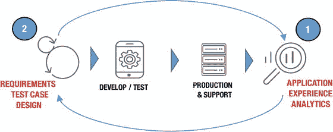

# 九、DevOps 和真实世界的投资回报率

在 2016 年一级方程式赛季期间，停站停留在三秒左右并不罕见。在极少数情况下，例如威廉姆斯 F1 车队在 2016 年欧洲大奖赛上，这一壮举在不到两秒钟的时间内惊人地完成。

暂时考虑一下这个想法。你可能需要很长时间来消化这个概念，而打出这句话肯定需要更长的时间，比一个 15-20 人的维修站工作人员扑向一辆停下来的赛车，把它抬离地面，交换四个车轮和轮胎，然后把它放下来送走所需的时间还要长。两秒钟！ [1](#Fn1)

## 质量是每个人的责任

当然，这种更大的表现代表了一个复杂的较小事件链，由高薪的全职专业人士无情地制定和实践——维修站工作人员的唯一工作是挽救他们的团队和车手的宝贵时间，这些时间可能导致位置的变化，在某些情况下甚至是胜利。

当一名工作人员带着一个旧轮胎旋转离开时，另一名工作人员立即旋转到位，并在汽车的轮毂上安装一个新的车轮，气动气枪操作员几乎不需要移除设备，因为一个车轮被移除，另一个车轮到达其位置。这一过程在汽车的所有四个车轮上同时进行。可以说，要成功地完成这一行动，每次执行都必须完美无缺。

想想看，在 F1 70 多年的历史中，至少有 10 场个人比赛是在不到 0.2 秒的时间内决定的，更多的比赛是在仅仅几秒钟内决定的；努力达到如此高的速度和精确度的动力很快成为焦点。 [2](#Fn2)

## 为开发运维投资回报提供案例

这些 F1 的工作人员是如何表演如此精准的芭蕾的？通过使用团队合作、沟通和近乎持续的评审来激励过程改进。我们花了数不清的时间查看复习站视频，寻找哪怕是最小的潜在改进机会，然后是无休止的实践练习，这些动作重复数百次。

与此同时，为了进一步加快这一进程，引入了经过修订的车轮、轮毂和维修站工作人员设备设计。追求完美的动力是一个永无止境的循环的一部分。

掌握这项技术的团队的投资回报(ROI)不仅体现在比赛成绩和非官方的维修站吹嘘权上，这两者都很重要，更重要的是体现在实实在在的金钱上。虽然比赛往往以秒计，但 2016 年 F1 车队总冠军的第一名和第十名之间的奖金差距估计约为 1.5 亿美元。 [3](#Fn3)

进站只代表了整个比赛的一小部分，但归根结底，F1 比赛的每一个方面都是为了以胜利的名义缩短时间，甚至是毫秒。

在现代软件工厂内部，工人们正在进行一场类似的高风险比赛，旨在抓住一个难以捉摸的机会，就像 F1 中的一场比赛或赛季胜利一样，可能会在眨眼之间消失。这是一个严峻的考验——在应用经济中取得成功也需要不断的回顾、改进和加速。

如前几章所述，为了在当前的业务环境中成长和生存，组织必须接受数字化转型，从而提高其发展软件和服务的能力，以满足不断变化的客户期望，这一点已被广泛接受。除了众多业务和技术领导者对这一主题的日益重视，当然还有技术供应商的猜测，硬数据已经开始出现，这有助于巩固采用 DevOps 的要求。

例如，在 CA Technologies 和 Zogby Analytics 在 2015 年发布的一项研究中，68%的消费者指出，他们会因为应用加载时间延迟几秒钟而完全放弃某个特定品牌。 [4](#Fn4) 具体来说，受访者表示期望应用在 6 秒或更短时间内加载，否则他们会直接放弃应用，通常会放弃相关的提供商。此外，超过一半的受访者表示，他们实际上希望应用的加载时间少于三秒钟，否则他们会失去耐心。

基于这一现实，更广泛地采用和改进 DevOps 文化、过程和工具来加速和改进应用交付的需求变得非常突出。组织拥抱开发运维的能力已经成为争夺最终用户注意力和资金的关键区别；相比之下，无法满足与应用质量和性能相关的不断变化的客户期望通常意味着输给更敏捷的竞争对手。

简而言之，软件交付的改进已经成为生存的先决条件。基于这个结论，除了推进一般生存能力的模糊概念之外，DevOps ROI 影响的度量显然是一个越来越重要的实践。

## 衡量 DevOps 成功的挑战

对于一些观察者来说，在 ROI 的背景下测量像 DevOps 这样影响深远且具有变革性的过程的影响似乎是不可能的，但是各种类型的组织——从从业者到行业分析师——已经开始尝试这样的计算。

首先，为这样的指标创建必要的框架需要更仔细地考虑采用 DevOps 背后的原因。不严格地说，这种基本原理被认为是需要提高软件开发和发布的速度，同时提高最终应用的质量。同样重要的是，DevOps 还承诺加快对新出现的性能问题的响应速度，同时更好地满足不断变化的客户期望。

乍一看，这似乎是一组容易与简单的度量概念联系在一起的过程和概念，例如软件部署的速度。然而，这本身可能是一个过于简单的观点。事实上，这种测量强调了 DevOps 进步的一些直接好处，而许多其他内在结果肯定更难量化。

考虑到一些专家，如 DevOps 行业专家和前研究分析师 Michael Cote，已经假定试图以这种双重意义来衡量 DevOps 的 ROI 是“同时荒谬和重要的”。 [5](#Fn5)

这位专家认为，原因在于 DevOps 转型中涉及的变量太多，以至于对影响的任何总体估计都不是一个完全可信的值。

在 2015 年为 FierceDevOps 撰写的文章中，Cote 特别指出，“DevOps 是一个关于 ROI 的不可衡量的过程，因为它的价值几乎不可能独立而精确地衡量。”

也就是说，Cote 同意，虽然开发运维的更大导入可能很难从纯 ROI 的角度来定义，但衡量特定项目的成功(或使用开发运维流程开发的产品)来建立相关评估的基线是可能的，也是可行的。这就是软件部署率和所谓的平均修复时间(MTTR)等计算(衡量组织识别和修复生产中出现的应用问题的能力)推断出一些评估开发运维回报(如果不是更大的成功)的指导原则的地方。

正如 TechBeacon 的行业观察家 Christopher Null 在他的开创性文章“如何测量 DevOps ROI”[6](#Fn6)中所指出的那样，这种影响测量在 devo PS 采用的最基本的环境中是最实际的，即节省以前花费在构建、部署和维护应用上的任何时间。

“DevOps 最大的好处之一，如果不是最大的好处，就是速度的承诺；“DevOps 支持更多更快的代码部署，这意味着上市时间缩短，从客户那里获取收入的机会更多，”Null 评论道。

使用这样的框架，人们还可以开始将任务关键型甚至影响收入的功能的交付与通过开发运维流程获得的应用生命周期改进联系起来。由于这些原因，今天可用的最实用的 DevOps ROI 度量形式实际上围绕着软件发布周期、MTTR 和应用代码变更失败率等因素。这些指标可能无法最终概括整体运动的更大影响，但可以推断出一些持续改进的概念。

虽然正在创建其他形式的 DevOps ROI 评估，包括侧重于衡量财务影响、提高生产力和组织效率的其他指标的评估，但目前最准确的指标是那些主要侧重于应用生命周期卓越性的评估，这些数字确实为 DevOps 的采用和发展提供了令人信服的案例。

正如 Null 所指出的，Patrick Debois，他自己也是一名系统管理员，在检查压倒一切的 DevOps 价值时特别指出:“我们应该从…加速利益实现和缩短[周期]的角度来考虑[ROI]。真的不是 DevOps 的 ROI，真的更多的是你原来项目的 ROI 能更快实现。”

## DevOps ROI 的真实模型

众所周知，在 IT 领域内应用特定的 ROI 计算通常是一门棘手的科学。这当然适用于 DevOps 的领域。

这在很大程度上与这样一个事实有关，即技术在很大程度上被视为成本中心而不是利润驱动因素，这使得很难说服管理层以提高底线为具体目标增加投资。

即使有大量的行业分析师计算旨在解决这个问题(IT 投资回报率)，也很少有具体的证据证明 IT 投资实际上可以提供可观的回报。大多数专家更愿意接受它可能成为业务增长的一个更大的渠道或催化剂，但任何大规模投资回报的概念或承诺往往被大量前期和持续投资的要求所掩盖。

此外，众所周知，技术供应商通过提供自私的计算来搅浑水，这些计算经常以促进销售和竞争前景的名义夸大其产品的拟议影响。也就是说，人们也认识到，尤其是在最近几年，移动性、云和虚拟化等技术范式带来了巨大的规模经济和新的商业机会，以至于难以完全量化。

那么，如何围绕 DevOps 建立一个可信的 ROI 案例呢？devo PS 是一个过程，像许多其他运动一样，有望完全重新定义组织创造和货币化其价值的方式。

2016 年 DevOps 报告是业内领先的研究项目，由 DevOps 研究和评估(DORA)计划实现和准备，提供了大量数据，为整体运动的提议和经常被认为模糊的好处提供了具体证明。 [7](#Fn7)

首先，该报告假定所谓的“高绩效组织”，即那些已经深入参与开发运维实践的使用和成熟的组织，“在吞吐量方面明显优于其低绩效同行。”这一发现不仅建立在同一份报告之前的类似结论上，而且认为 DevOps 采用者和落后者之间的差距继续扩大。

具体来说，DORA 认为这样的高绩效者部署应用代码的频率是还没有完全采用 DevOps 的组织的 200 倍。因此，实际上来说，这样的组织似乎更有能力享受敏捷计算的好处；也就是说，对不断变化的客户需求做出敏捷的反应。

此外，DevOps 报告还发现，高绩效组织目前的交付周期缩短了 2，555 倍，这更有力地证明了他们消除软件创新和改进障碍的能力。

也许更重要的是，特别是当它涉及到敏捷性和适应不断变化的性能条件的能力时，报告估计领先的 DevOps 实践者声称恢复时间快 24 倍，更改失败率低 3 倍。当人们认识到降低 MTTR 代表了当今应用经济中最重要的竞争优势之一时，这些数字形成了一个极具说服力的叙述。

由大约 4，600 名技术从业者完成的 DevOps 调查还发现，高绩效团队在所谓的“计划外工作和返工”上花费的时间要少得多，而这些工作和返工通常是为了应对与现有应用代码相关的新问题。这使得他们可以在新工作上多花将近 50%的时间。后一种努力通常旨在以增加商业机会的名义增加或改进特性功能。

最后，就纯粹的应用交付 ROI 指标而言，DevOps 的 State 报告表明，领先的从业者遭受的应用和服务中断要少得多——即系统离线并真正阻止最终用户流量和业务流动的时间范围。

IDC 的研究分析师建立了一个框架，该框架得出的结论是，对于《财富》1000 强企业而言，每小时的应用宕机成本可能在 12.5 亿美元到 25 亿美元之间，关键应用故障的平均成本为每小时 50 万美元到 100 万美元， [8](#Fn8) 《开发运维状况报告》得出的结论是，即使与那些采用了某种程度的开发运维的组织相比，高绩效组织每年平均节省的成本也超过 9100 万美元。

研究人员指出，这种优势在很大程度上是以较低的应用更改失败率的形式发现的，或者是那些导致后续性能问题或中断的软件代码更新。虽然高性能的 DevOps 实践者经历了 7.5%的平均变更失败率，但是中等性能的组织看到这个数字急剧上升，达到了惊人的 38%。

如果不可否认的格言“时间就是金钱”同样适用于今天的应用经济，如果不是比以往任何时候都更适用的话，那么这些 ROI 计算具有重要的意义。

除了这些旨在衡量应用生命周期改进的指标之外，2016 年 DevOps 报告还揭示了该运动影响的另一个领域，该领域似乎超越了直接计算，但肯定可以用一般术语进行量化。深度参与开发运维转型的组织往往拥有更快乐、更敬业的员工。

鉴于人们普遍认识到雇佣和培训新员工比留住现有员工要昂贵得多，尤其是高技能的 it 员工很难找到和留住，开发运维的这种较少动手的 ROI 优势可能会证明是比一些现有指标更重要的采用支持。

具体来说，DORA 的研究人员发现，高绩效、以 DevOps 为中心的组织的员工将他们的组织推荐为伟大工作场所的可能性是 2.2 倍，将他们的团队推荐为伟大工作环境的可能性是 1.8 倍。这些数字是使用员工净晋升分数(eNPS)计算出来的，该分数旨在衡量员工的整体忠诚度。

接下来，值得注意的是，其他研究，特别是贝恩公司(Bain & Co .)专家发表的一份报告发现，员工敬业度高的公司的收入通常是员工敬业度低的公司的 2.5 倍。此外，贝恩指出，在高度信任的工作环境中，上市公司的股票表现比市场指数高出三倍。 [9](#Fn9)

简而言之，这些结论(既有特定于流程的，也有本质上更普遍的)强调了 DevOps 在创建最关键的 ROI 衡量形式方面的具体效果，即更快创新、建立组织动力、降低成本以及尝试在竞争环境中区分产品的能力。

很自然地，那些花更多时间通过将想法转化为产品来创造新价值的组织，很可能比那些努力通过解决现有不足来迎头赶上的组织表现得更好。

## 衡量 DevOps 自动化的影响

如前所述，F1 赛场上的每一项成功都是以最小的增量来衡量的，在这个时代，最常见的是以十分之一秒的形式，更常见的是以数百秒的形式。对于 F1 维修站人员来说，每一个微小的物理运动的改进或省时技术的应用都会带来可观的收益。

DevOps 的采用也是如此，它可以延伸到软件设计、交付和支持的几乎每一个方面，以及大量旨在自动化一些复杂过程的工具。

隔离任何一个或两个特定的流程或工具只能提供一个小窗口，让我们了解 DevOps 自动化作为一个整体的广泛影响；然而，利用这些作为起点可以提供视角，然后可以扩展到许多领域。

一个这样的工具集是 CA Agile Requirements Designer 解决方案的使用，它寻求基于不断变化的需求来自动化测试用例设计和执行，以自动化应用交付中最耗时和资源密集的问题之一，即手动测试造成的延迟。

通过允许工程团队自动化创建和应用软件测试需求的过程，该解决方案有望极大地降低相关成本和复杂性，特别是通过直接减少所需测试周期的数量。

根据旨在预测 CA Agile Requirements Designer 与降低和避免成本相关的潜在投资回报率以及相关的收入增加的计算，采用此流程的直接好处(仅代表采用 DevOps 的一个次要方面)立即显现出来。

基于该解决方案的实际实现，除了仅与软件测试相关的收益之外，一个组织发现它能够推动业务和 it 团队之间更紧密的协作，并更好地估计开发项目的时间和成本。除了以下 ROI 计算，这些收益与更广泛采用 DevOps 的核心优势密切相关。[10T3】](#Fn10)

就具体的投资回报率而言，相关组织发现，在最坏的情况下，其三年期的收益增值将导致其现有投资的 168%的回报，或者说，在 100%收回初始成本之前需要 11 个月的时间；该研究预测的最佳情况是 319%的投资回报率，或 8 个月的全部回报。

推动这一回报的潜在好处包括组织减少软件缺陷修复的能力(类似于减少 MTTR 的领域)，降低测试创建和维护成本，以及最重要的是，在战略投资的总体范围内，改进应用发布的价值实现时间。

在软件生命周期的生产端，另一个重要的 DevOps 工具方面保证了 ROI 分析是应用性能管理(APM)。APM 寻求简化性能问题的分类，以便团队可以在问题对最终用户和客户产生影响之前快速解决问题。

通过快速分析移动、云和本地应用中复杂的微服务、API 和容器阵列的性能，这些监控工具为 IT 运营提供了一种重要的机制，用于保持预期的服务级别和高质量的应用体验。

在 DevOps 环境中，如第 [7](07.html) 章所述，这些工具尤其有价值，因为它们有助于在运营和开发团队之间建立反馈回路。通过在将软件更新投入生产之前深入了解应用性能，开发人员可以快速查明并修复任何与其代码相关的问题。通过这种方式，APM 解决方案不仅有助于确保操作的稳定性，而且有助于团队在应用中构建质量。

根据 Forrester Research 在 2015 年进行的总体经济影响研究，CA APM 的潜在投资回报与显著降低停机成本和提高工作效率有关。 [11](#Fn11)

对四个客户(跨金融服务、银行和医疗保险行业)的采访和随后的财务分析表明，基于被采访组织的复合组织获得了超过 720 万美元的收益，而实现成本仅超过 170 万美元，合计净现值(NPV)为 540 万美元，投资回报率为 306%。

正如预期的那样，所有受访组织都通过提高面向客户的应用的可用性和性能而获得了积极的财务影响。对于一家公司来说，这扩展到了降低服务级别罚款，因为它能够向一个关键的商业客户证明问题的原因，减少了每年向一家大型全球供应商支付的 80 多万美元。

除了可用性收益之外，从 DevOps 的角度来看，还有其他好处。该研究发现，通过在开发过程中应用 CA APM，开发人员的生产力得到了提高。当开发团队使用 CA APM 测试新代码时，组织能够在第一年将开发周期加快 15%。正如一家公司的代表所说，“本质上，我们在产品中发布了更少的代码或更少的修复，这使我们的开发组织能够更专注于在我们在线解决方案中交付的产品的市场中保持竞争优势。”

利用 CA APM 可以洞察从大型机到移动设备的性能。通过使用 CA APM，组织可以消除复杂环境中问题原因的不确定性。CA APM 还缩短了解决问题的平均时间，并且消除了相互指责。

避免指责游戏和英雄文化当然是 DevOps 的本质，但应用的复杂性和支持多个利益相关者的需要意味着工具必须能够提供不间断的可见性。该研究表明，通过提供从移动到大型机的性能洞察，CA APM 使组织能够消除复杂环境中问题绝对原因的不确定性。正如一位来自地区消费银行的性能分析师所说，“APM 让我们能够微观地了解客户体验。”

### 整体大于部分之和

鉴于应用交付的这些方面(敏捷需求设计和 APM)仅代表整个生命周期的一部分和潜在 DevOps 影响的领域，人们可以很容易地根据它们单独交付的 ROI 来证明采用的合理性。然而，为了真正反映 DevOps 的影响，应该统一检查工具。通过这种方式，组织可以开始推断自动化软件工厂之间的组合如何能够创造 DevOps 报告中强调的巨大收益。

图 [9-1](#Fig1) 和随后的注释展示了一个简单但强大的例子，展示了在软件生命周期中结合自动化工具的累积收益。

图 9-1。

Cumulative benefits of combining multiple tools example: application experience analytics and agile requirements design

#### 步骤 1:应用体验分析

在这一步中，工具将信息反馈给敏捷团队，这些信息被用作需求变更和迭代开发的输入。

预期收益包括通过分析(例如，应用和功能使用以及实时性能)获得的情报的持续循环，这有助于开发人员、运营人员和企业在每个版本中改进应用。

#### 步骤 2:需求和测试用例设计

随着需求的变化，敏捷需求设计工具将测试用例设计及其执行自动化。

预期的好处包括用最少的测试实现最大的功能覆盖，以及通过自动删除任何过时的、冗余的或重复的测试用例来减少测试用例周期。

当集成了其他工具时，好处会不断积累。例如，通过自动提供来自测试数据仓库的合成数据，并将其直接匹配到步骤 2 中创建的测试用例，组织可以:

*   提高质量——为测试提供正确的数据可以减少缺陷的产生
*   提高测试效率—消除数据限制可以减少调配数据所需的时间和资源
*   降低成本—创建准确的数据子集可以降低基础架构成本

## 摘要

如您所见，目前对 DevOps 投资回报率的衡量仍然有些不成熟，而且很困难。然而，真实的使用案例和行业研究清楚地强调了采用 DevOps 实践对当今早期采用者的巨大影响。对于那些上船的人来说，未来看起来是光明的，而那些留下的人可能会努力竞争和生存。

在下一章也是最后一章中，我们将了解一些已经开始流行于 DevOps 领域的额外概念、技术和新兴趋势，并研究如何利用它们来增强 DevOps 计划。

This chapter is distributed under the terms of the Creative Commons Attribution-NonCommercial-NoDerivatives 4.0 International License (http://creativecommons.org/licenses/by-nc-nd/4.0/), which permits any noncommercial use, duplication, distribution and reproduction in any medium or format, as long as you give appropriate credit to the original author(s) and the source, provide a link to the Creative Commons license and indicate if you modified the licensed material. You do not have permission under this license to share adapted material derived from this book or parts of it. The images or other third party material in this book are included in the work's Creative Commons license, unless indicated otherwise in the credit line; if such material is not included in the work's Creative Commons license and the respective action is not permitted by statutory regulation, users will need to obtain permission from the license holder to duplicate, adapt or reproduce the material. Footnotes [1](#Fn1_source)

“威廉姆斯数据显示巴库进站新纪录”，Motorsport.com，2016 年 6 月 22 日: [`http://www.motorsport.com/f1/news/williams-data-shows-baku-pit-stop-a-new-record-790776/`](http://www.motorsport.com/f1/news/williams-data-shows-baku-pit-stop-a-new-record-790776/)

  [2](#Fn2_source)

“谁赢了？F1 最接近的 10 场比赛，”福克斯体育，2014 年 9 月 1 日: [`http://www.foxsports.com/motor/story/who-won-it-10-of-f1-s-closest-finishes-090114`](http://www.foxsports.com/motor/story/who-won-it-10-of-f1-s-closest-finishes-090114)

  [3](#Fn3_source)

“2016 年一级方程式奖金(车队总冠军)”Total Sportek，2016 年 3 月 17 日: [`http://www.totalsportek.com/f1/formula-1-prize-money/`](http://www.totalsportek.com/f1/formula-1-prize-money/)

  [4](#Fn4_source)

“软件:品牌忠诚度的新战场”，CA Technologies 和 Zogby Analytics，2015 年 3 月 4 日: [`http://rewrite.ca.com/us/articles/application-economy/research-study-software-the-new-battleground.html`](http://rewrite.ca.com/us/articles/application-economy/research-study-software-the-new-battleground.html)

  [5](#Fn5_source)

《DevOps ROI》猛 devo PS 2015 年 7 月 21 日: [`www.fiercedevops.com/tags/devops-roi`](http://www.fiercedevops.com/tags/devops-roi)

  [6](#Fn6_source)

《DevOps ROI》猛 devo PS 2015 年 7 月 21 日: [`www.fiercedevops.com/tags/devops-roi`](http://www.fiercedevops.com/tags/devops-roi) `-how-measure-guide`

  [7](#Fn7_source)

《2016 年 DevOps 国家报告》，朵拉和赞助商，2016 年 6 月 22 日: [`https://puppet.com/resources/white-paper/2016-state-of-devops-report`](https://puppet.com/resources/white-paper/2016-state-of-devops-report)

  [8](#Fn8_source)

“开发运维与停机成本:量化的财富 1000 强最佳实践指标”，IDC，2014 年 12 月 1 日: [`http://www.idc.com/getdoc.jsp?containerId=253155`](http://www.idc.com/getdoc.jsp?containerId=253155)

  [9](#Fn9_source)

[T2`http://www.bain.com/publications/articles/the-chemistry-of-enthusiasm.aspx#2`](http://www.bain.com/publications/articles/the-chemistry-of-enthusiasm.aspx#2)

  [10](#Fn10_source)

《CA 测试用例优化器 ROI 业务案例详细报告》，CA Technologies，2015 年 7 月 1 日: [`https://km.ca.com/sales/presales/roi/ROI%20Portal/Dashboard/CA%20Test%20Case%20Optimizer%20Reference%20ROI%20Business%20Case%20V1FY16REF.pdf`](https://km.ca.com/sales/presales/roi/ROI%20Portal/Dashboard/CA%20Test%20Case%20Optimizer%20Reference%20ROI%20Business%20Case%20V1FY16REF.pdf)

  [11](#Fn11_source)

应用绩效管理的总经济影响: [`http://www.ca.com/content/dam/ca/us/files/industry-analyst-report/the-total-economic-impact-of-apm.pdf`](http://www.ca.com/content/dam/ca/us/files/industry-analyst-report/the-total-economic-impact-of-apm.pdf)