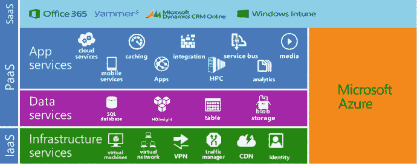
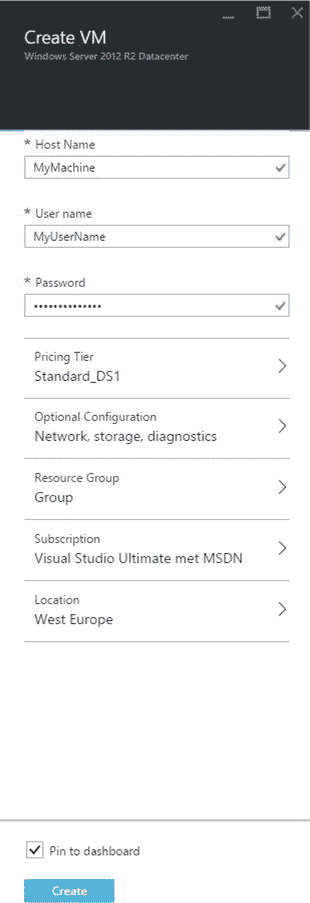
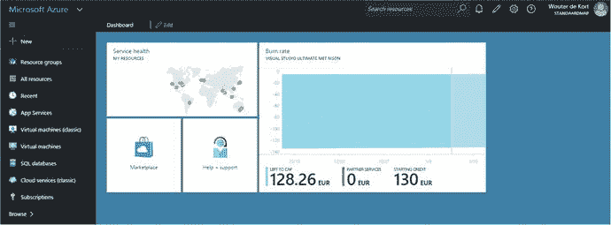
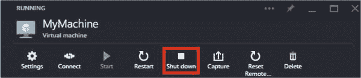
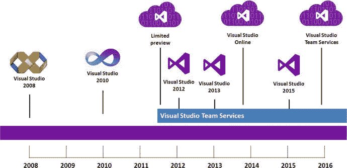
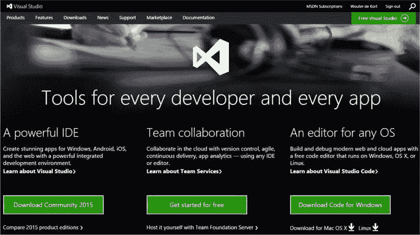

# 二、Azure 和 Visual Studio Team Services 简介

DevOps 是人员、流程和产品的结合，能够为我们的最终用户持续提供价值。作为一家公司，你带来了人，微软帮助你定义你的过程和一套伟大的产品。微软的 DevOps 工具的基础是 Team Foundation Server (TFS)和 Visual Studio Team Services。这些是一套完整的产品，可以帮助您进行 DevOps。

Team Foundation Server 安装在您自己的服务器上或在云环境中运行的虚拟机上。您配置环境并进行维护，您对环境拥有完全的控制权。微软还发布了一种使用 Team Foundation Server 的新方法，称为 VS Team Services。VS 团队服务运行在微软云平台之上，称为微软 Azure。在本书中，示例使用 VS Team Services，但是如果您有本地安装，也可以使用 Team Foundation Server。

在这一章中，你将学习什么是云，特别是微软 Azure。你将开始使用 Azure，并能够解释使用云的好处。之后，您将开始使用 VS 团队服务。当涉及到 Azure 和 VS Team Services 时，你将能够对安全性进行推理，并且你将能够根据你的情况做出明智的决定。

## 了解微软云:Azure

您的公司如何托管其应用？您的公司可能正在运行自己的基础架构，托管在数据中心或自己的空间中。也许您从专业公司租赁服务器，他们会配置和维护您的环境。

当需要部署新的应用时，您需要计算出所需的服务器数量和规格。然后，您向您的内部或外部托管方提交请求。一段时间后，从几天到几周甚至几个月不等，服务器被交付。然后，您为购买或租赁的服务器支付固定价格。

我合作过的大多数公司都使用这些类型的主机。在查看您需要采取的步骤时，您会立即看到一些缺点。如果您希望根据负载来扩展容量，该怎么办？如果您只想在几台服务器上运行实验，该怎么办？如果您只想为实际使用的东西付费，该怎么办？为什么要运行一个完整的服务器来只托管一个 web 应用呢？

对于试图实现 DevOps 的公司来说，价格和容量方面的灵活性已被证明是一个巨大的优势。这就是云所提供的。

### IaaS、PaaS 和 SaaS

微软 Azure 为你提供了几乎无限量的资源。您可以使用这些资源，如服务器或存储，并且只为您使用的资源付费。这意味着您可以开始将基础设施视为服务。请求虚拟机需要几分钟时间。使用储物件时，您只需为您使用的物品付费。当你不需要某个资源的时候，你就停止使用它，停止为它付费。

那么 Azure 给你提供了什么样的资源呢？你可以将所有的 Azure 资源分为两类:基础设施即服务(IaaS)和平台即服务(PaaS)。

图 [2-1](#Fig1) 显示了 IaaS 和 PaaS 之间的区别。除了 IaaS 和 PaaS 资源之外，还有软件即服务(SaaS)。由构建它们的公司维护的完整应用。

图 2-1。

IaaS, PaaS, and SaaS components of Azure

IaaS 位于服务器、网络和身份层。你不必担心底层的基础设施。您不需要购买服务器、布线和处理硬件故障。IaaS 看起来像一个典型的数据中心，不同之处在于 Azure IaaS 为您提供了完整的自助服务，并允许您按分钟付费。

PaaS 具有更高的抽象层次。使用 IaaS，您仍然需要运行操作系统(OS)、安装更新以及处理实际的虚拟机。PaaS 不会用那些东西来烦你。以 SQL Azure 为例。您只需使用 SQL Azure，而无需安装一个或多个运行 SQL Server 的服务器、配置帐户、安全性、备份和所有其他事情。Azure 将自动为您创建数据库服务器，安排备份，并确保您具有某些性能特征。这比运行您自己的 SQL Server 实例要容易得多。

PaaS 的另一个例子是 Azure Web apps，一个网站托管平台。Azure 完全为你管理底层机器、更新和可用性。你唯一要做的就是创建一个新的 Web 应用，将你的网站发布到它上面，你就大功告成了。管理互联网信息服务(IIS)、操作系统、补丁和更新等工作都已为您完成。如果一台机器崩溃，您的网站会自动在一台新机器上启动。因此，Azure 让你不用担心基础设施，而是专注于构建你的应用。

### 安全

谈到云，一个重要的讨论话题是安全性。我的数据存放在哪里？谁对此负责？谁能接触到它？我可以离开云吗？这些都是针对你的具体情况需要回答的重要问题。根据您构建的应用类型和存储的数据，您会有不同的需求。

微软明白安全性是组织向云迁移的一个关键问题。因此，微软采取了很多措施来保证你的数据安全。例如，微软使用安全开发生命周期。这是一个公司范围的强制性过程，将安全需求嵌入到整个软件生命周期中。Azure 提供了严格的身份和访问控制机制。双因素认证、动态和静态数据加密、网络安全和威胁管理都是微软方法的一部分。另一件有助于采用 Azure 的事情是 Azure 使用的数据中心的全球范围。微软不断投资新的数据中心，甚至为政府提供专门的版本。

如果你想了解更多关于安全和 Azure 的知识，你可以在 [`http://azure.microsoft.com/en-us/support/trust-center/`](http://azure.microsoft.com/en-us/support/trust-center/) 找到更多信息。如果你在一个严格控制的组织工作，不要一开始就对 Azure 不屑一顾。调查您是否可以使用某些安全功能或其他选项来允许使用公共云。

如果事实证明这是绝对不可能的，您也可以转向私有云解决方案。微软为希望在内部安装 Azure 功能的内部数据中心提供 Azure Stack。这意味着您可以获得大量可以在自己的数据中心运行的 IaaS 和 PaaS 服务。微软正在确保应用的管理、配置和部署可以在公共云和私有云中以类似的方式完成。

这本书用了很多天蓝色。如果你想充分利用本书中的所有例子，Azure 订阅是必要的。您可以快速注册自己的 Azure 帐户。如果您拥有 MSDN 套餐，您可以获得 Azure 的免费月度点数。否则，您可以使用信用卡注册试用或预付费订阅。

如果您拥有 MSDN 订阅，请按照下列步骤操作:

Go to [`https://account.windowsazure.com/signup?offer=Azure_MSDN`](https://account.windowsazure.com/signup?offer=Azure_MSDN) .   Accept the terms.   Click on Buy.   Wait for the signup process to finish.  

如果您想创建一个持续一个月的免费试用版或支付 200 美元，请执行此步骤:

Go to [`http://azure.microsoft.com/en-us/pricing/free-trial/`](http://azure.microsoft.com/en-us/pricing/free-trial/) .   Sign up for the free trial.  

采取此步骤创建一个新的预付费 Azure 订阅:

Go to [`http://azure.microsoft.com/en-us/pricing/purchase-options/`](http://azure.microsoft.com/en-us/pricing/purchase-options/) .   Select Buy Now for the Pay-As-You-Go option.   Complete the signup process.  

除了这三个选项，您还可以通过您的企业协议(EA)购买 Azure 订阅。如果您是与微软有 EA 的企业组织，您应该使用它以折扣价购买 Azure 信用。

使用 Azure 时，您将使用 Azure 门户网站，您可以在 [`http://portal.azure.com`](http://portal.azure.com/) 找到该网站。图 [2-2](#Fig2) 显示了 Azure 门户。您可以看到分布在世界各地的不同数据中心的财富。您还会看到一个磁贴，显示我的 MSDN 订阅点数还剩多少，还有一个市场链接以及帮助和支持链接。您可以通过单击左上角的绿色加号图标来创建新资源。这打开了一个刀片(这是 Azure 中不同部分的名称)，让您选择资源的类别。例如，虚拟机是计算类别的一部分。图 [2-3](#Fig3) 显示了创建新虚拟机所需的设置。输入您的设置后，您所要做的就是点击创建。创建新虚拟机的实际过程需要几分钟。完成后，您可以导航到虚拟机的刀片来管理设置以及启动和停止机器。您还可以设置远程桌面连接，以便从自己的 PC 上使用新机器的用户界面。

图 2-3。

You need to configure a couple of settings when creating a new virtual machine

图 2-2。

The Azure Portal

需要理解的重要一点是，您是为刚刚创建的虚拟机按分钟付费的。这意味着，如果你让机器运行，你继续支付它。通过选择关闭选项(图 [2-4](#Fig4) )，您关闭了机器并停止支付计算资源费用。您只需为虚拟机硬盘的存储支付少量费用。这只是你可以用 Azure 做的事情的一小部分。Microsoft 还创建了一个自动化服务，您可以使用它来计划自动关闭资源。您可以在门户中创建从存储到机器学习的各种服务。你可以部署复杂的应用，或者使用 Azure 作为开发/测试环境。

图 2-4。

You can shut down your machine to save costs

## 使用 Visual Studio Team Services

在微软 Azure 之上，微软构建了各种各样的应用。Office 365、Yammer、Bing 和 Skype 等都运行在 Azure 之上，并作为服务提供给客户。VS 团队服务也是如此。Team Foundation Server 作为运行在 Azure 上的 SaaS 解决方案提供，名为 VS Team Services。不需要在内部安装 Team Foundation Server，这意味着您必须配置服务器，然后安装 SQL Server、应用服务、构建服务器和其他组件，您只需将所有这些留给 Microsoft，并使用 VS Team Services。

VS 团队服务在 2013 年 6 月开始作为预览版。2013 年 11 月，它作为一项普遍可用的服务发布。图 [2-5](#Fig5) 显示了 VS 团队服务的时间线和名称变化。有时您会在文档中看到较旧的名称。VS Team Services 为您提供了将您的组织迁移到成熟的 DevOps 实现所需的所有工具。在这本书里，你会学到 VS 团队服务的所有不同元素，以及它们是如何工作的。

图 2-5。

Visual Studio Team Services’ timeline

### 安全

就像 Azure 一样，在使用 VS Team Services 时，你需要注意你所拥有的安全选项。微软正在努力确保 VS 团队服务有适当的认证和政策，允许各种组织安全地使用它。

在 Azure 之上构建的一个很大的优势是，Azure 的所有内置安全机制都会自动应用于 VS Team Services。身份管理、DDoS 保护和数据复制都是 Azure 基础设施的一部分，由 VS 团队服务使用。微软也在申请获得 VS 团队服务认证。2015 年初，微软获得了 ISO 27001(信息安全管理)认证。微软继续投资于额外的认证。

微软使用 VS Team Services 进行自己的开发。构建 Visual Studio 和 VS Team Services 的开发人员部门已经从内部 TFS 迁移到 VS Team Services。Microsoft 正在积极跟踪和修复 VS Team Services 中出现的任何问题。您可以关注 VS 团队服务 Twitter 账户(`@vsonline`)和服务博客( [`http://blogs.msdn.com/b/vsoservice/`](http://blogs.msdn.com/b/vsoservice/) )了解任何问题和更新。你也可以在你的 Visual Studio IDE 中安装 News for Visual Studio 插件( [`https://visualstudiogallery.msdn.microsoft.com/ace247af-962d-41a2-b6a3-7b0510690bf6`](https://visualstudiogallery.msdn.microsoft.com/ace247af-962d-41a2-b6a3-7b0510690bf6) )。这允许您直接在 IDE 中获取新闻。

微软对其服务质量非常开放。每当发生严重事故时，微软总是发布根本原因分析。这项工作由负责 VS 团队服务的副总裁 Brian Harry 完成。这些报告包含有关该问题的详细信息，例如它为什么会发生，以及 Microsoft 采取了哪些步骤来确保它不会再次发生。所有这些都是为了改善服务，并确保您可以信任 VS 团队服务(更多信息见 [`http://aka.ms/VSOSecurity`](http://aka.ms/VSOSecurity) )。

您可以通过导航到 [`http://visualstudio.com`](http://visualstudio.com/) 来创建一个 VS 团队服务帐户。图 [2-6](#Fig6) 显示登陆页面。注意页面中间是免费开始的选项。您只需使用 Microsoft 帐户登录，然后为您的帐户取一个名称。您的帐户会获得一个格式为`https://<youraccountname>.visualstudio.com`的 URL。您需要选择源代码控制类型(Git 或 Team Foundation 版本控制)。现在，只需选择缺省值。在第 [7](07.html) 章中，涵盖了版本控制，您将了解到不同之处以及选择哪些选项。您还可以为您的 VS Team Services 帐户选择一个位置。这是将存储您的帐户数据的 Azure 数据中心。此设置默认为离您最近的位置。

图 2-6。

The Visual Studio web site offers access to your VS Team Services account, documentation, and other resources

## 培训的必要性

由于敏捷、DevOps 和 ALM 实现的巨大影响，我看到很多实现都失败了。当涉及到 DevOps 时，公司往往看不到全局。他们只关注安装一些工具，然后强迫他们的团队使用这些工具。Azure 和 VS Team Services 是帮助您的组织实现 DevOps 的绝佳工具。但是，如果没有在使用这些工具和进行文化变革方面的适当培训，您的 DevOps 实现注定会失败。

不要指望有一个 Azure 订阅和一个 VS Team Services 账户就足够了。确保团队的每个成员都接受过使用这些工具的培训。如果你在训练中加入多学科的任务，你将打破各自为政的局面，与整个团队一起工作。这将给你 Azure 和 VS Team Services 所能给你的全部好处。

## 摘要

本章介绍了微软 Azure 和 VS Team Services。您现在知道 IaaS、PaaS 和 SaaS 之间的区别了。您已经看到了创建虚拟机这样的资源是多么容易。你也看到了 VS Team Services 是微软在 Azure 上运行的 Team Foundation Server 的 SaaS 产品。最后，您已经看到了如何创建帐户。

导言到此结束。在接下来的章节中，你将更深入地研究 VS Team Services 和 Azure，并学习如何使用这些工具实现 DevOps 过程。