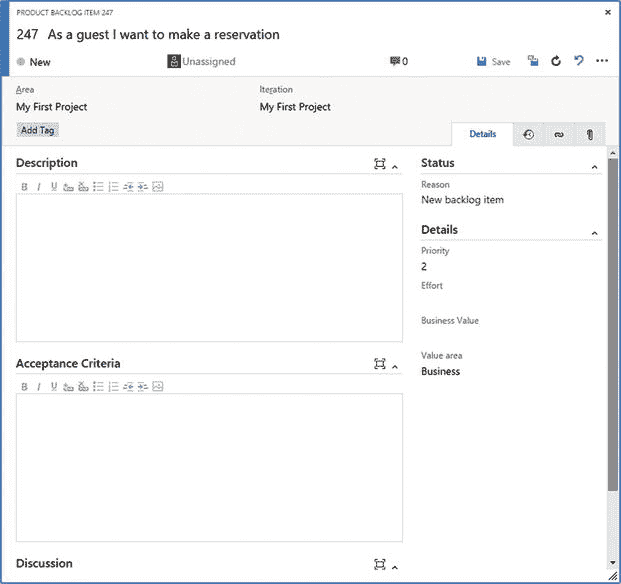

# 3.敏捷项目管理:沟通的重要性

当管理一个软件项目时，沟通是软件开发中最重要的方面之一。在本章中，您将了解 Visual Studio Team Services 为您管理项目提供的出色功能。促进交流，跟踪需要完成的工作，以及确保所有团队成员一起工作都是重要的方面。

您将学习 VS Team Services 在 Web 访问中直接为您提供的项目管理工具。您将看到如何使用这些工具来跟踪工作、规划资源和优化您的团队。您还将查看 team rooms，这是一个聊天环境，您可以使用它来激发讨论并跟踪所有正在进行的工作。最后，通过了解开发人员如何集成到这些过程中，您将在 Visual Studio 中迈出第一步。

## 敏捷项目管理

当构建软件时，会涉及到很多方面。首先，你有客户和他们所有不同的利益相关者。在一个典型的项目中，你还有业务分析师、用户体验设计师、架构师、开发人员、测试人员、运营人员、经理，也许你可以为你的项目想出更多的角色。

在现在所谓的瀑布项目中，项目被分成不同的阶段(见图 [3-1](#Fig1) )。首先，分析师与客户一起创建客户实际需要的详细规范。这通常被称为功能设计。有时会创建用户故事或其他类型的文档。与客户讨论并处理该文档，直到客户同意这是他想要的。

图 3-1。

Stages in a waterfall project

下一个阶段是编码。然后，功能规范被转化为技术规范。架构师参与创建架构图，并对安全性、可伸缩性和模块化等主题进行各种规划。这些计划然后被传递给开发者。他们试图在解释功能和技术规范的同时实际编码所有的特性。

希望这也是测试人员参与进来的时候。虽然在某些场景中，你看到测试人员只是在开发人员结束后才参与进来。测试人员试图将规范映射到实际的实现中，并找出任何错误和不正确的实现。在这个阶段之后，您应该有一个需要部署到生产环境中的正确的工作应用。运营团队被召集来配置正确的服务器，部署应用，并确保一切正常。

瀑布有一个很大的缺点，那就是反馈在周期中来得很晚。如果开发人员想出了一些在生产中部署时不安全的东西，该怎么办？如果业务分析师错误地解释了客户的请求，而客户几个月后才发现错误，该怎么办？如果测试人员在一部分代码中发现了一个 bug，而与此同时开发人员已经转移到代码库的一个完全不同的部分，该怎么办？

缩短反馈回路是改善沟通的关键。这就是过程和工具可以帮助的地方。敏捷就是缩短周期，改善沟通，从而提高客户的价值。VS Team Services 内置了对运行一般敏捷项目或基于 Scrum 方法的项目的支持。

如果你将 Scrum 视为流行的方法之一(如果你不熟悉 Scrum 术语，请阅读官方的 Scrum 指南，最重要的术语见图 [3-2](#Fig2) ),你会经常看到团队在没有任何工具支持的情况下开始。团队使用带有便利贴的白板或其他物理介质来运行他们的项目。每日的 Scrums 是在所有团队成员都聚集在一个地方的情况下完成的，其他的度量标准，比如消耗，都是手工计算的。

图 3-2。

Scrum is a popular Agile methodology that uses a couple of key principles

这个管用。对于小的、刚起步的团队来说，这甚至可能是一件好事，因为它允许他们专注于过程和协作，而不是迷失在工具和他们发现的所有可能性中。如果你刚刚开始使用 Scrum，我甚至会鼓励你手动进行几次冲刺，以确保你专注于这个过程。在此之后，您将理解工具可以帮助您的领域。在计划阶段使用 VS 团队服务将会更有意义。

实施 Scrum 不仅仅影响团队。它应该影响整个组织，并得到高层的全力支持。然而，说起来容易做起来难。管理承诺是 Scrum 实现经常失败的地方。尤其是在临近截止日期的时候，来自上面的压力会变得如此强烈，以至于团队失去了 Scrum 背后的想法，并最终陷入 Scrum 和瀑布:Scrummerfal 的混合中。这本质上是用短迭代的概念运行一个瀑布项目。

你需要意识到，在任何项目中，尤其是 Scrum 项目中，你都不可能有固定的时间、特性和资源。但这往往是组织想要的。采用 Scrum 的最大问题是组织采用了 Scrum，并带走了他们所有的旧包袱。组织有时害怕改变。但是对于 Scrum，以及同样的开发人员，管理层需要给团队自由。实验的自由，尝试新的过程，迭代他们自己的过程变得越来越好。尽量避免 ScrumBut:我们做 Scrum，但我们没有做所有的事情，因为<substitute your="" particular="" reason="">。当然 Scrum 不是圣杯，你不应该在没有考虑清楚的情况下采用它。然而，Scrum 是一个完整的框架，各部分互为补充。</substitute>

Note

微软 ALM Rangers 的项目经理、技术评审之一 Willy-Peter Schaub 指出，他不喜欢 ScrumBut 这个术语。“Scrum 是一个框架，”但是“没有任何地方说用户必须实现框架的每个方面。只要我们有上一幅图像中的关键伪影；例如，backlog、sprint、events 和潜在的可交付增量，我们正在实践 Scrum。使用 ScrumBut 总是给我一种印象，除非我实现了概述的所有内容，否则我就是 But 用户之一。”我明白威利在说什么。我不同意的原因是，我经常看到团队在尝试一次 sprint 之前就宣称 Scrum 的某些部分不适合他们，因为他们是不同的。然后在几次冲刺之后，他们放弃了 Scrum，因为它不起作用。

当一个团队开始成长时，使用工具变得尤其重要。让一个分布式团队使用带有便利贴的物理白板很难保持同步。拥有一个可供全球所有团队成员访问的电子白板要容易得多。当然，白板不会跟踪变化。如果便利贴从墙上掉了下来(或者被一个有用的清洁工很好地叠起来！)，你得从记忆中恢复一切。如果您所在的企业有审计需求，您可能需要一个比普通白板更复杂的解决方案。

这些和其他原因都表明工具对您有帮助。当然，VS 团队服务不会让你成为一个完美的 Scrum 团队。但是使用工具的方式肯定有助于您改进您的过程。谈到敏捷和 Scrum，VS 团队服务和 Visual Studio 有一些很好的工具支持。VS Team Services 作为应用生命周期管理实现的解决方案背后的整个思想是，您可以在整个过程中实现完全的可追溯性和可见性。

这是通过将您的所有工作项存储在一个中心位置来实现的。每个人都可以看到它们；每个人都可以使用它们(如果您需要，可以使用必要的权限)。您团队的所有成员都可以使用他们喜欢的工具。产品所有者和其他利益相关者可以通过 web 界面轻松访问。开发人员从 Visual Studio 中直接管理他们的任务。测试人员有他们自己的工具(参见第 [11 章](11.html)关于测试的更多信息)。他们的所有工作都集成在后端，因此可以全面了解整个过程。

让我们先来看看敏捷工具 Web 访问接口。

## 敏捷工具

创建新项目时，选择项目所基于的流程。默认情况下，这可以是 Scrum、CMMI 和敏捷。这些过程中的差异归结于您可以创建的不同类型的工作项、现成的查询和报告，以及您的工作所经历的状态。本质上，所有的过程都只是建立在共享基础上的模板。

当运行一个敏捷项目时，从 Scrum 模板开始通常是最容易的。Scrum 模板是最轻量级的模板，和敏捷模板有一些小的不同。例如，敏捷模板使用了用户故事这样的术语，而 Scrum 使用了更通用的产品 Backlog 项目。敏捷模板有类似 Resolved(代码完成和单元测试通过)的状态，鼓励开发人员和测试人员分离，而 Scrum 模板只有一个进行中的状态。我鼓励团队从 Scrum 模板开始，以避免团队将其术语和过程适应敏捷模板。

Scrum 模板给了你以下重要的东西:

*   短距离赛跑
*   产品积压项目
*   任务
*   妨碍
*   疯狂的
*   容量规划(无论使用什么样的模板，您都可以使用它)

Team Web Access 是一个门户，您可以使用它来访问 VS Team Services 上的所有项目。这是菜单中的工作选项卡(参见图 [3-3](#Fig3) )。

图 3-3。

Team Web Access showing the Work page

### 短距离赛跑

Sprints 是你的 Scrum 项目的基础。你需要决定你短跑的长度和你开始新短跑的日期。冲刺不过是开始和结束的一天。在此期间，您安排工作、跟踪进度并管理团队的能力。

Scrum 指南指出冲刺不应该超过四周。我遇到的典型团队会进行两到三周的冲刺。这是你作为一个团队和一个组织应该决定的事情。在整个组织中拥有一个 sprint 进度表可以改善沟通，并且使得跨多个团队安排发布更加容易。当在 VS Team Services 中配置您的 sprints 时，如果您愿意，您可以在发布中对它们进行分组。您还可以为每个 sprint 分配开始和结束日期。这将用于自动创建烧毁并进行容量规划(参见本章后面的“容量”一节)。

当您打开团队项目时，您从概述页开始。在 Other Links 部分，您会看到一个标题为 Configure schedules and iterations 的链接(图 [3-4](#Fig4) )。如果您没有看到其他链接部分，请将其作为小部件添加到您的仪表板。

图 3-4。

The Configure schedules and iterations link in the Other Links section

默认情况下，有六个 sprints 可见。通过使用“新建”和“新建”子按钮，您可以创建发布和冲刺的层次结构。默认情况下，迭代被命名为 sprints。这是因为你正在使用 Scrum 模板。如果您使用的是 Agile 模板，它们被命名为迭代。对于每个冲刺，你可以设置开始和结束日期。在设置了第一个 sprint 之后，VS Team Services 会通过建议其他 sprint 使用相同的 sprint 长度来帮助您。图 [3-5](#Fig5) 显示了一个配置好的迭代时间表，包含两个发布和九个冲刺。选定的 sprintss 是团队可见的 sprint。随着时间的推移，您可能希望选择新的 sprint 并隐藏旧的 sprint，以保持清晰的概览。

图 3-5。

A configured sprint schedule

### 产品积压项目

Scrum 团队处理 backlog，backlog 是需要完成的工作的优先列表。VS Team Services 通过让您创建产品积压项目(pbi)来帮助您跟踪您的产品积压。正如你在图 [3-6](#Fig6) 中看到的，产品待办事项是一个格式良好的项目列表。(在第 [5](05.html) 章高级敏捷工具中，你会看到看板)你可以配置你想要看到的列，比如标题、工作、商业价值和其他字段。

图 3-6。

An overview of the product backlog

产品待办事项可以包含很多细节。图 [3-7](#Fig7) 显示了 PBI 的详细视图。

图 3-7。

Details for a product backlog item

你有像标题和描述这样的标准字段。其他重要的字段被分配给验收标准、业务价值和工作。通过将 pbi 链接到其他项目，如任务或故事板(参见第 [4](04.html) 章关于管理用户反馈的更多信息，关于故事板)，你可以在过程的所有步骤中获得可追溯性。

VS 团队服务在如何使用 pbi 方面没有强制任何严格的规则。您可以自由选择如何命名它们，使用哪些字段，以及赋予它们什么含义。但是有一些最佳实践可以帮助您以最佳方式使用 pbi。

一个非常重要的字段是标题。此字段在所有报告和查询以及您的待办事项中可见。PBI 应该是最终用户能够理解的东西。因此，拥有“创建购物车”或“添加错误记录”字段并不是最好的选择。但是一个名为“作为一名顾客，我想看看我购物卡上的商品概览，这样我就可以决定我是否要下订单”的 PBI 有更多的信息。

As a <type of="" user="">I <want to=""><because>方法是构建 pbi 的方法之一。遵循标准命名约定将有助于您和您的团队确保 pbi 包含足够的信息并且易于理解。描述字段也是你不应该忘记的。这是一个富文本字段，您可以使用它来添加团队实现该功能所需的信息。</because></want></type>

我经常看到团队忘记的一个领域是验收标准。该字段中的信息应该有助于开发人员知道他何时完成了特性的编码。测试人员可以使用这些信息来测试特性是否真正完成。验收标准可以是重要项目的简单列表，例如:

*   用户可以在购物卡中查看每页 10 个项目的分页列表
*   用户可以看到每个商品的价格和数量
*   用户可以看到项目的总成本，包括正确的增值税金额
*   当购物车中有商品时，用户可以点击订单

这个列表可以由产品所有者和测试人员创建，因为他们通常最有能力提出这些需求。拥有所有 pbi 的验收标准是改进流程的一大步。

你也不应该忘记努力和商业价值。产品 backlog 只不过是需要完成的工作的优先列表。产品负责人负责确定待办事项的优先级。积压项目的顺序代表了一个项目给予客户的价值。因此，一个有很大价值并且很容易做到的 PBI 应该在顶端。那些没有任何价值并且很难完成的项目应该放在底部。当然，你有这两个值的组合。用你的 pbi 记录努力和商业价值是正确排序你的待办事项的关键。

谁应该决定努力领域？不是产品所有者。团队负责完成这项工作，所以他们应该是说明项目难度的人。以小时为单位记录没有意义，因为 PBI 还没有分解成任务，在这个过程中做这样详细的估计还为时过早。相反，许多团队使用斐波纳契数列:1，1，2，3，5，8，13，21，34，等等。(每个数字都是前面两个数字的和)。这个序列很快上升到非常大的数字。团队可以选择一个 PBI，为其赋值，然后使用该 PBI 作为参考来评估其他 pbi。这有助于团队不迷失在细节中(这应该是 21 还是 22？)而是关注项目的相对大小。这一项比这一项更难或风险更大吗？如果是这样，给它一个较大的值。你首先需要做一些研究吗？给它一个大数字。

商业价值由产品所有者决定。他是代表客户的人，负责确保团队首先交付高价值的项目。商业价值也可以是斐波那契数。我也看到团队从 1 到 100 中挑选数字。实际数字并不是最重要的。这些数字的相对大小是。

我想指出的两个资源是由微软 ALM Rangers 编写的优秀免费电子书:《用微软 Visual Studio Online ( [`http://blogs.msdn.com/b/microsoft_press/archive/2015/04/09/free-ebook-managing-agile-open-source-software-projects-with-microsoft-visual-studio-online.aspx`](http://blogs.msdn.com/b/microsoft_press/archive/2015/04/09/free-ebook-managing-agile-open-source-software-projects-with-microsoft-visual-studio-online.aspx) )管理敏捷开源软件项目》和 VS Team Services Marketplace 上提供的估算扩展( [`https://marketplace.visualstudio.com/items/ms-devlabs.estimate`](https://marketplace.visualstudio.com/items/ms-devlabs.estimate) )。电子书讨论的主题之一是护林员如何估计，以及他们如何使用标准化的估计。评估扩展使您能够与您的团队一起玩计划扑克，并以这种方式评估项目。

我经常看到团队没有使用的一些其他有用的特性是讨论域和标签域。团队成员可以使用讨论字段对 PBI 进行评论，并将这些评论直接存储在其中。其他团队成员可以查看并回复它们。标签可用于向 PBI 添加标注集合。想想 PBI 属于哪个领域(移动、前端、Windows 10 等。)或您想要分配的其他类别。您可以添加任意数量的标签，并且可以根据您分配给它们的标签轻松过滤 pbi(参见图 [3-8](#Fig8) )。

图 3-8。

Product backlog items with tags

查看待办事项时，您可以按标题轻松添加新的 pbi。在 backlog 的顶部，您会看到 New work item 窗格。如果更改类型下拉列表，也可以创建一个 bug。你所需要做的就是输入标题，然后点击添加。这将 PBI 添加到您的待办事项列表的顶部。然后，您可以双击 PBI 打开详细视图。你待办事项的顺序很重要。您可以通过在 pbi 上拖放来轻松调整。

### 任务

产品待办事项是直接为客户提供价值的特性。要实施 PBI，需要做一些工作。这可能是解决用户体验、编写代码、添加日志和跟踪或其他特定于每个 PBI 的工作。这些任务由您的团队挑选，并在冲刺阶段执行。

产品负责人在每个 sprint 开始的 Scrum 计划会议上向团队解释 PBI。在之前的 sprint 中，团队已经花了一些时间来检查 PBI 是否完整，或者他们是否需要更多信息。这是与产品负责人讨论这个问题的时候了。团队将 PBI 分解成任务，并同意承担工作。通过将 PBI 分配给 sprint，团队可以管理他们在 sprint backlog 和 sprint board 中的任务。图 3-9 显示了一个 sprint backlog 的例子。您将看到父 PBI(带有蓝色矩形)和任务(带有黄色矩形)作为其子项。

图 3-9。

A sprint backlog showing a PBI with tasks

在 sprint 期间，团队应该将他们所做的任何工作记录为任务。任务可以在冲刺阶段添加。例如，如果团队发现他们忘记了什么，他们可以为其添加一个新任务。pbi 不应添加到正在进行的 sprint 中。提交的 PBI 是固定的(除非在非常特殊的情况下，实现 PBI 没有意义),团队不应该被各种正在进行的变更所困扰。

与 pbi 一样，任务也有一组可以使用的默认字段。标题、描述、分配给和状态是最重要的。可用于跟踪进度的一个域是剩余工时。这是负责任务的团队成员定期更新的数字，以显示任务的进展情况。当任务进入完成状态时，剩余工时被设置为零。

当团队同意安排 PBI 时，您将 PBI 的状态设置为 Committed。之后，您可以使用拖放或者将迭代字段设置为您想要的 sprint。通过使用 PBI 前面的绿色+图标，您可以添加需要执行的任务。

### 妨碍

Scrum Master 的角色是帮助团队完成他们需要做的所有工作。有时团队成员会遇到自己无法解决的问题。Scrum 大师是来帮忙的。这些问题被称为 Scrum 中的障碍，VS Team Services 可以帮助你追踪它们。阻碍可以是各种各样的事情，从坏掉的笔记本电脑到没有足够的机会接触产品所有者来询问问题。

除了状态、标题和标签等默认字段之外，障碍还有描述和解决方案。图 [3-10](#Fig10) 显示了新障碍物的细节。

图 3-10。

Details for a new impediment

障碍不会显示在产品待办事项或任务列表中。这是因为障碍是需要由 Scrum 大师解决的事情，不应该占用团队的时间和空间。创建障碍有两种选择。第一个选项让您从 backlog 旁边的 Queries 选项卡创建一个新的障碍，如图 [3-11](#Fig11) 所示。第二个选项是使用新的工作项小部件，您可以将它放在您的仪表板上。

图 3-11。

Creating a new impediment

要查看障碍，您可以在共享查询中选择开放障碍查询。一旦障碍得到处理，您就可以打开细节视图并将状态设置为 Closed。然后，它将从开放障碍查询结果中消失。跟踪开放障碍的另一种方法是使用显示开放障碍数量的仪表板瓷砖(更多信息，参见第 [6](06.html) 章)。

### 疯狂的

每个项目都有 bug。bug 代表需要被跟踪的工作。这意味着您可以选择显示您的 backlog 中的 bug，并对它们进行优先级排序，就像您处理其他工作一样。有些 bug 需要立即修复；其他的安排在以后。这个决定应该由产品所有者做出。

错误可以通过各种方式引入。您可以通过 Team Web Access 将它们手动添加到 backlog 中，或者让测试人员通过 Microsoft 测试管理器添加它们。对于失败的自动构建，也可以自动添加 bug(更多信息参见第 [9](09.html) 章构建)。当使用 Scrum 模板时，bug 默认显示在你的 backlog 和需求板上。如果你愿意，你可以很容易地将它配置成不显示 bug 或者在任务板上显示它们。(第[章第 5](05.html) 节讲述了定制你的待办事项和看板的细节。)

Note

GitHub ( [`https://github.com/microsoft/mail2bug`](https://github.com/microsoft/mail2bug) )有一个开源扩展，可以让你从电子邮件线程中创建 bug。

bug 有自己独特的字段(见图 [3-12](#Fig12) )，例如:

图 3-12。

Detail view of a new bug

*   复制的步骤
*   优先
*   严重

如果 bug 是通过 Microsoft 测试管理器创建的，则会添加关于发生 bug 的系统、IntelliTrace 数据或其他数据源的附加信息(有关更多信息，请参见第 [11](11.html) 章测试)。可追溯性是通过将 bug 链接到 pbi 来实现的。通过这种方式，您可以获得哪些 pbi 是稳定的，哪些 pbi 中有很多错误的数据。bug 通过一个工作流，在这个工作流中，bug 首先被批准(这意味着它是一个需要被处理的真正的 bug)。然后一个团队致力于修复 bug(就像其他工作一样)，最后 bug 完成了，意味着它已经被修复和测试了。

您可以通过使用新面板并将下拉菜单更改为 Bug，直接从您的 backlog 中创建 Bug。这产生了一个与 PBI 无关的新错误。要将 bug 链接到 PBI，请打开 bug 的详细信息，选择“链接”选项卡，然后创建一个到现有项目的链接。然后设置父关系并选择 PBI 作为父关系(参见图 [3-13](#Fig13) )。

图 3-13。

Linking a bug to an existing PBI

### 容量

现在，您已经有了 sprints、pbi 和任务，您想要了解您的团队可以承担多少工作。在 Scrum 中，速度是跟踪团队在每个冲刺阶段所能完成的工作量的标准方法。速度基于之前 sprint 的经验，并显示了一个团队通常在 sprint 中交付多少 pbi。

作为产品所有者，您可以预测您的团队实现功能所需的时间。当您将工作值分配给 pbi 后，您可以使用 Velocity 特性来计算哪些项目可以在哪个 sprint 中完成。由于速度是一个不断变化的数字，明智的做法是做一个乐观和悲观的预测，这样你就能感觉到什么是可能的。图 [3-14](#Fig14) 显示了有四个 pbi 的积压预测。基于预测的值是产品所有者可以输入的值。当速度为 8 时，第一项将需要一个完整的冲刺。第二项和第三项将在 sprint 2 中完成，最后一项在 sprint 3 中完成。对于 sprint 4，目前没有任何工作安排。

图 3-14。

Forecasting sprints

速度不是帮助你计划冲刺的唯一标准。一些团队成员兼职工作，在你有假期的一年里，也许你需要为其他活动留出时间。容量规划有助于您快速了解团队的工作时间以及他们可以完成的工作类型。例如，如果您的团队中只有一个 Java 开发人员碰巧在度假，那么您不应该试图为下一个 sprint 安排任何 Java 工作，不管您在最后几个 sprint 中的速度是多少。图 3-15 显示了一个有两个开发人员和一个测试人员的团队的能力计划的例子。开发栏是红色的，因为开发工作超过了可用容量。

图 3-15。

Capacity overview of current sprint

VS 团队服务帮助您计划您的工作日(默认情况下，周一到周五)，并为每个团队成员分配每个 sprint 的休息时间。您还可以向不同的团队成员分配一个工作类别，例如开发或测试，以进一步帮助您进行规划。这些数据然后被用来显示你的团队可以承担多少工作，并将其与你的团队中不同类型的活动区分开来。容量是每个 sprint 唯一输入的内容。

要查看一些有趣的容量信息，您的团队中需要多个团队成员。如果您打开一个项目，请单击“团队成员”微件以打开“管理成员”对话框。通过电子邮件地址添加几个用户。在图 [3-16](#Fig16) 中，您可以看到两个虚拟用户被添加到团队中。

图 3-16。

Managing the members of your team

既然您的团队中已经有了几个团队成员，您就可以开始为即将到来的 sprint 安排他们的能力了。选择工作➤积压➤冲刺 1。你现在看到了 sprint backlog 和 a Capacity 选项(见图 [3-17](#Fig17) )。您现在可以为您的团队成员配置活动，设置他们的工作时间，并安排休息日(参见图 [3-18](#Fig18) )。如您所见，团队成员并不仅限于一项活动。您可以为每个团队成员添加多项活动，并指定他们可用于每项活动的时间。您还可以为单个团队成员和整个团队配置休息日。

图 3-18。

A sample capacity plan

图 3-17。

Capacity planning per sprint

既然您已经为团队成员选择了活动，那么您还需要为您创建的任务配置活动。这样，VS Team Services 就可以计算每项活动的时间，并显示在您的可用团队成员旁边。对于一项任务，从下拉菜单中选择一项活动，并将剩余工作设置为该任务所需的小时数(见图 [3-19](#Fig19) )。现在，您可以在 sprint backlog 的右侧查看容量规划。红色条表示某项活动的工作量过大。

图 3-19。

Assign hours and an activity to a task

容量是按 sprint 配置的。当您开始一个新的 sprint 时，您可以为您的团队的能力输入新的数字，或者您可以选择复制上一个 sprint 的数据，然后进行调整。

## 团队房间

沟通是关键。为了帮助你，VS Team Services 提供了 team rooms，这是一个在线聊天室，你的团队成员可以在这里留言。团队房间不仅仅是简单的聊天室。然而，团队空间绝对不是唯一的解决方案。我遇到的一些团队使用 Slack，一个流行的消息应用，或者其他解决方案。尤其是在跨平台工作时，选择一个易于团队使用的应用非常重要。

您可以配置 team rooms 来显示项目期间发生的不同事件的消息，例如工作项状态更改、开发人员签入代码、测试人员提交错误以及其他事件。这意味着 team room 为您提供了项目中发生的事情的完整记录。这使得跟踪你的团队成员在做什么变得容易，特别是如果你错过了几天。一些团队甚至在团队房间里记录他们的每日站立笔记。您可以创建不同的团队房间，让他们跟踪不同的事件。您还可以配置要查看哪些团队成员的事件。

Note

如果你在多个团队中工作，团队房间会很麻烦。您可以安装以下扩展，在一个地方获得您所属的所有团队房间的摘要: [`https://marketplace.visualstudio.com/items/tfc.TeamRoomSummary`](https://marketplace.visualstudio.com/items/tfc.TeamRoomSummary) 。

当您打开项目的概述页面时，您可以添加 Team Room 小部件来显示项目中可用 Team Room 的列表。当您创建新项目时，会自动为您创建一个单独的 team room。您可以点击房间名称导航至该房间(参见图 [3-20](#Fig20) )。

图 3-20。

The Team Room widget on the dashboard

图 [3-21](#Fig21) 显示了团队房间的样子。最简单的方法就是发送一条简单的聊天消息。您可以使用底部的文本框输入消息，然后单击“发送”与您的团队分享。

图 3-21。

A team room in VS Team Services

除了聊天，团队房间还可以显示事件。如果单击“管理事件”,您可以选择希望在 team room 中显示的事件类型。您还可以将用户添加到 team room，以便他们可以查看事件。但是，请注意，这可能意味着团队成员看到了他们通常无法访问的事件。图 [3-22](#Fig22) 显示了如何配置您的团队空间，为项目中的每个工作项更新显示一个事件(团队空间的成员和其他团队成员)。

图 3-22。

Configuring events for a team room

现在想象你改变了一个 PBI 的状态。这将被 team room 获取，并添加一条自动消息。图 [3-23](#Fig23) 显示了这样一个事件。您可以单击 PBI 直接导航至详细信息。

图 3-23。

An automated message showing that a PBI has been updated

## 与开发人员一起实现可追溯性

VS 团队服务最好的特性之一是它让所有团队成员交互并使用最适合他们的工具。对于开发者来说肯定是这样的。虽然开发人员应该能够使用 Web 访问功能来参与团队会议室、计划会议和其他活动，但 Visual Studio 是 Microsoft 开发人员的首选工具。对于非微软开发人员，VS Team Services 提供了与 Eclipse 和 IntelliJ 等工具的集成，或者可以在任何地方使用的跨平台命令行工具。

当开发人员使用 Visual Studio 时，她使用团队资源管理器(见图 [3-24](#Fig24) )连接到 VS 团队服务。使用团队资源管理器可以做的事情之一是显示分配给您的工作项并使用它们。

图 3-24。

The Team Explorer in Visual Studio

最棒的是，当开发人员进行代码更改并将这些更改发送到服务器时，她可以直接将她的更改与她正在处理的工作项相关联。这在代码和完成的工作之间创建了完全的可追溯性。稍后，可追溯性信息将被扩展到审查、测试、构建和发布。

开发人员可以看到哪些工作项对她是可用的，并选择一个工作项进行工作。更好的是，当开发人员被中断时，她可以保存开发环境的整个状态(代码更改、工作项、窗口布局、断点和其他设置)，切换到另一个任务，然后返回到保存的状态，继续处理手头的任务。在代码部分，您还将看到如何直接从 Visual Studio 请求代码审查。这将在 VS Team Services 中创建一个工作项，并跟踪它，直到执行代码审查。

从 Web Access 中打开 Visual Studio 中的项目很容易。如果您查看团队项目的概述页面，您会看到 Visual Studio 小部件(参见图 [3-25](#Fig25) )带有一个选项，可以直接在 Visual Studio 中打开项目。当你这样做的时候，你的浏览器会显示一些安全问题。因为您信任 VS Team Services 和 Visual Studio，所以可以接受安全警告来启动 Visual Studio。

图 3-25。

The Visual Studio widget on the Overview dashboard

Visual Studio 启动后，您会看到团队资源管理器面板(如果没有，请转到查看➤团队资源管理器)。选择“我的工作”区域，查看 Visual Studio 中直接分配给您的任何任务。如果你什么也没看到，这意味着没有任务分配给你。您可以使用 Web 访问向您分配任务。如果有一个您想要开始处理的任务，您可以使用拖放将它从可用工作项移动到进行中的工作(参见图 [3-26](#Fig26) )。这将更新工作项状态，并使新状态在 Web 访问中立即可见。这样，开发人员不必在离开 Visual Studio 的同时还能让其他人了解她的工作。

图 3-26。

The My Work panel in Visual Studio

在本书中，你将学习到其他工具，比如微软测试管理器，它将测试人员集成到可追溯链中。

## 摘要

谈到敏捷工具，VS 团队服务有很多可以提供的。Web 访问界面使您的整个团队能够轻松地合作并处理一个待办事项。您可以跟踪 sprints、产品待办事项、任务、障碍和 bug。如果您愿意，还可以让 VS Team Services 帮助您进行容量规划。

Team rooms 有助于您的团队交流和跟踪项目中发生的事情。特别是对于分散的团队或者想要快速更新的成员来说，团队空间是个不错的选择。您还初步了解了开发人员如何集成到敏捷过程中。您在 Visual Studio 中使用了“我的工作”面板，并初步了解了整个团队如何合作。

但这只是冰山一角。在接下来的一章中，你将看到如何通过容易地获得他们的反馈并确保他们能跟随你的过程来与所有的利益相关者合作。