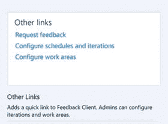

# 4.管理用户反馈:知道构建什么

本章向您介绍了使用 Visual Studio Team Services 的故事板和反馈管理。这两者都是促进与利益相关者沟通的重要方式，并确保你做的是正确的事情。

## 为什么我们需要更好的沟通

拥有一个包含详细描述和验收标准的产品待办事项列表是朝着正确方向迈出的一大步。这将帮助您的团队知道要构建什么，并正确地构建它。这并不意味着事情总会如你所愿。弄清顾客真正想要的是什么可能是一项艰巨的任务。有时候你最终会造出错误的东西。这花费了时间和金钱，并且损害了与股东的关系。帮助顾客清楚地了解他们想要的是什么是困难的，但是本章将通过解释你如何容易地与你的顾客分享想法并获得他们的反馈来帮助你。

你可能知道这样一句话，“一张图胜过千言万语”。看到用户体验的模型可以帮助开发人员或测试人员更好地理解他们需要构建和测试什么。与利益相关者讨论模型比花时间构建用户界面要快得多

缩短周期时间是关键。在短时间内讨论几个模型，集思广益，并对它们进行迭代，这就是敏捷和开发运维的目的。经常出错的是这个过程的时机。运行 Scrum 过程的团队用 sprints 来安排他们的工作。在每个 sprint 开始时，他们会召开计划会议，与产品负责人讨论下一个 sprint 的工作。

什么时候应该创建模型？既然模型与产品待办事项直接相关，难道它们不应该在 sprint 中创建吗？但是团队如何才能完全理解他们需要构建什么呢？这是我在团队中看到的问题。没有规定禁止团队查看下一个冲刺阶段的 pbi。要运行一个成功的项目，这是必不可少的。团队应该每天花一些时间来确保他们在不久的将来将要工作的 pbi 足够清晰。团队成员可以利用这段时间来创建模型、定义验收标准，并确保团队知道他们需要知道的所有信息，以召开计划会议。有一个用户体验专家创建模型绝对是一个优势，尤其是因为大多数开发人员不是 UX 的专家。

拥有良好的模型和清晰定义的 pbi 是构建用户真正想要的软件的一部分。在交付一个 PBI 之后，您需要验证您构建的东西。产品负责人的角色是不断与利益相关者互动，并确保团队正在构建正确的东西。同样的原则也适用:缩短周期时间是关键。真正让利益相关者参与到开发运维流程中是你价值流的一大胜利。

对于这两种场景——创建模型和获得用户反馈——市场上有很多工具。幸运的是，微软已经创建了直接与 VS 团队服务集成的工具。

## 用 PowerPoint 创建故事板

你用过 PowerPoint 吗？我认为几乎每个参加过会议的人都见过 PowerPoint 的实际应用。这主要是因为 PowerPoint 非常容易使用。创建几张幻灯片，添加一些动画和其他图形，您可以轻松地创建一些看起来很不错的东西。

微软意识到大多数用户都有 PowerPoint，而且它非常容易使用。这就是为什么微软为 PowerPoint 创建了一个扩展，帮助你轻松地创建实体模型，并将它们链接回 VS Team Services 中的工作项(见图 [4-1](#Fig1) )。

图 4-1。

Storyboarding plugin for PowerPoint

PowerPoint 插件为您提供了一组常用的形状，如 web 浏览器、标准控件和其他在创建模型时可能会用到的元素。您还可以添加自己的形状集并与您的团队共享，例如网页的默认布局、公司的徽标或一些您经常使用的自定义控件。通过将它们添加到形状库中，您可以在所有模型中创建一致的外观。

最终用户可以轻松地在 PowerPoint 中查看您的模型，即使他们没有安装插件。对于那些没有 PowerPoint 的人，他们可以安装一个免费的 PowerPoint viewer 来观看你的幻灯片。

这些故事板最好的一点是，你可以将它们链接到你的产品待办事项列表中。团队成员可以直接从 PBI 信息中打开故事板，并在执行任务时使用它。

要创建故事板，首先要打开 PowerPoint。如果您已经在 PC 上安装了 Visual Studio，那么您就已经安装了故事板插件。不想安装 Visual Studio 的用户可以安装独立的 Team Foundation Server Office 集成插件。这是一个每个人都可以使用的免费下载(下载详情见 [`https://www.microsoft.com/download/details.aspx?id=49992`](https://www.microsoft.com/download/details.aspx?id=49992) )。

在 PowerPoint 中，你现在可以在你的功能区看到故事板标签(见图 [4-1](#Fig1) )。如果你选择这个标签，你可以开始创建故事板。“故事板形状”面板包含几个您可能要使用的标准控件，如 web 浏览器、文本字段、按钮等。

如果您想为您的故事板创建一些模型文本，添加一个文本字段，输入文本`=` `Lorem()`，然后按 enter。这将用几行 Lorem Ipsum 文本填充您的文本框。您还可以扩展默认形状库。您可以添加自己的形状，并从 Visual Studio Gallery 网站下载形状集。

Note

Lorem Ipsum 是印刷商和设计师经常使用的伪拉丁语文本。你可以很容易地创建大量的文本，但由于文本实际上是不可读的，它不会分散你的观众对整体设计的注意力。

由于您是在 PowerPoint 中工作，您也可以轻松地添加动画。一个特别有用的动画是故事板形状库中的单击形状。单击形状使用路径动画。您可以配置指针从哪里开始，应该移动到哪里，最后点击什么。这允许你创建动画来展示故事板一旦实现将如何工作。图 [4-2](#Fig2) 显示了幻灯片上的点击形状。

图 4-2。

You can use the animated Click shape in your storyboards

完成故事板后，您希望与您的团队和利益相关者分享它。如果你看一下功能区，你会在团队组中看到一个叫做故事板链接的按钮(图 [4-3](#Fig3) )。

图 4-3。

You can link your storyboard to a work item in VS Team Services

单击此按钮将打开一个窗口，允许您将故事板链接到项目中的工作项。如果你看一下图 [4-4](#Fig4) ，你会看到一个预定义的查询是如何被用来在你的项目中查找产品待办事项的。然后您可以选择一个 PBI 并点击 OK 来建立链接(第 [6](06.html) 章，关于仪表板和报告，解释了关于查询的更多信息)。

图 4-4。

You can choose a work item to link to your storyboard

如果您现在在浏览器中打开 VS Team Services 项目，您可以查看到故事板的链接。如果您打开一个 PBI 工作项的详细信息，您会在左下角看到 Storyboards 选项卡。图 [4-5](#Fig5) 显示了这样一个示例链接。需要注意的是，该链接包含一个网络共享或互联网地址的实际 URI。在这种情况下，故事板存储在 OneDrive 上，以供整个团队使用。因此，这些文件没有存储在 VS Team Services 中。

图 4-5。

In the details of the PBI, you can view the storyboard’s link

## 让利益相关者参与反馈管理

从用户那里获得反馈是非常重要的。您需要一个构建、测量和学习的连续循环。最好的方法是让您的客户在房间里随时陪着您。每次你需要一些反馈，他们都会帮助你。事实上，客户不会总是有空的。也许你给他们打个电话或发封电子邮件，让他们看些东西。然后，您需要记录他们的反应，并手动将其添加到 VS 团队服务中。

因为这是经常发生的事情，微软在 VS 团队服务中添加了反馈管理工具。这允许您在 Web 访问中创建反馈请求。您可以添加所需的信息，如您希望收件人查看的内容、他们如何访问您的应用以及其他重要信息。然后你只需点击发送和 VS 团队服务做剩下的工作。收件人会收到一封详细说明您的请求的电子邮件和一个启动反馈会话的链接。他们第一次这样做时，会安装一个专门的工具来帮助用户给出反馈。该工具在屏幕的一侧打开，指导用户完成您希望他采取的步骤。在这样做的同时，用户可以很容易地添加反馈，如截图，甚至视频或语音。用户还可以添加评论，并给出简单的 1 到 5 星评级。

所有这些数据都会被收集并附加到反馈回复中。提交反馈后，您可以从 VS Team Services 中检索数据。这创建了从请求到响应的完全可追溯性，并将该数据链接到您想要反馈的 pbi。

VS Team Services 为您希望用户查看的每一项创建一个反馈请求工作项。图 [4-6](#Fig6) 显示了包含两个反馈项目的请求。

图 4-6。

Requesting feedback on multiple items

发送反馈请求后，VS Team Services 会为您生成两个包含所有细节的工作项。好的一点是，您的反馈请求与 VS Team Services 中的工作项相关联。这意味着当您在 VS Team Services 中更新您的反馈请求时，用户将在开始他们的反馈响应时自动看到这些更新。

当然，用户不回应您的反馈请求也是有可能的。您可以在 VS Team Services 中查看您发送的反馈请求。只要状态是活动的，您就知道用户没有响应。与反馈请求一起发送的 URL 保持活动状态，用户仍然可以使用反馈客户端进行响应。

发送反馈请求很容易。如果您转到 VS Team Services 团队项目的概述页面，您会看到一个名为 Other links 的小部分(参见图 [4-7](#Fig7) )。如果您点击“请求反馈”,则会打开“请求反馈”窗口。如果您没有看到“其他链接”组，请将该小部件添加到您的仪表板(参见第 [6](06.html) 章，仪表板和报告，了解如何操作)。

图 4-7。

Starting a feedback request from VS Team Services Web Access

图 [4-8](#Fig8) 显示了发出反馈请求所需的细节。需要注意的重要一点是，VS 团队服务需要知道您想要征求反馈的用户。幸运的是，您可以使用 VS Team Services 的免费涉众许可证来添加您的涉众。您需要给予这些涉众明确的权限来创建、测试和查看测试运行，以及查看项目级别的信息。这允许他们开始审核会话并发送反馈。

图 4-8。

Configuring a feedback request

除了您希望将请求发送给的涉众之外，您当然必须告诉他们该做什么。在步骤 2 中(参见图 [4-8](#Fig8) ，您指定它们如何到达您的应用。如果它是一个 web 应用，您可以添加 URL，并且有一个自由文本字段，您可以在其中指定用户名和密码等详细信息或其他他们在访问您的应用时应该知道的信息。如果您有远程机器，您可以输入机器的名称。对于客户端应用，您应该输入该应用的完整路径。

在步骤 3 中(见图 [4-8](#Fig8) ，你告诉涉众他们应该审查什么。你给每个项目一个标题和描述。对于审阅者来说，每一项都是需要完成的独立操作。完成后，您可以预览您的反馈请求。当您感到满意时，单击“发送”,一封电子邮件将发送给选定的利益相关者。

反馈请求的收件人会收到一封类似于图 [4-9](#Fig9) 所示的电子邮件。在这种情况下，我将反馈请求发送给自己，因此我在“收件人”和“抄送”行。

图 4-9。

An e-mail requesting feedbac k

如果没有安装反馈工具，用户应该先安装它。单击该链接将下载反馈工具并开始安装。然后点击开始反馈环节链接，打开反馈工具，开始反馈回复。

现在，您会在屏幕左侧看到反馈工具的一个实例。图 [4-10](#Fig10) 显示了这个工具的样子。该工具的第一页显示了如何访问该应用的信息。在这种情况下，显示一个指向 [`http://visualstudio.com`](http://visualstudio.com/) 的 URL。用户打开应用后，单击 Next 查看第一个反馈项目。

图 4-10。

The Feedback Response tool with information on how to access the application

在给出反馈时，用户可以添加截屏、录制屏幕视频、添加麦克风音频、添加评论，并对每个项目进行星级评定。这些信息是为您捕获的，并在用户完成时自动发送给 VS Team Services。图 [4-11](#Fig11) 显示了该请求的第一步以及用户可以采取的所有行动。

图 4-11。

The Feedback Response tool showing a feedback item

在用户完成反馈请求后，数据被发送到您的 VS Team Services 项目。反馈响应工作项现在包含了用户输入的所有数据。这包括任何视频、音频、截图或用户添加的其他数据。

如果您打开项目，转到 Work 选项卡，然后转到 Queries 子选项卡，您会在共享查询中看到一个名为 Feedback 的查询(参见图 [4-12](#Fig12) )。选择查询后，您会看到反馈响应列表。您可以查看每个项目，检查细节，并根据反馈创建新的工作项目。

图 4-12。

The Feedback query in your team project

反馈客户端是让利益相关者参与到流程中的好方法。在第 [11](11.html) 章，你还会看到 Chrome 网络浏览器(以及未来的其他浏览器)有一个插件，你可以用它对应用进行探索性测试，并将结果发送回 VS 团队服务。

## 摘要

了解客户的需求并为他们构建合适的解决方案仍然是软件开发中最困难的方面之一。在这一章中，你学习了一些简单易用的工具来帮助你。

您已经看到了如何使用 PowerPoint 创建模型，将它们链接到工作项，并与您的涉众共享。您还看到了作为 VS Team Services 一部分的反馈工具如何让您发送反馈请求并在流程中处理结果。

在下一章，你将深入敏捷工具的其他部分，即看板和项目组合管理。这些工具将帮助您优化您的团队交付的价值，并扩展到多个团队，所有团队都使用 VS 团队服务。