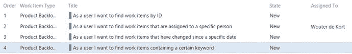
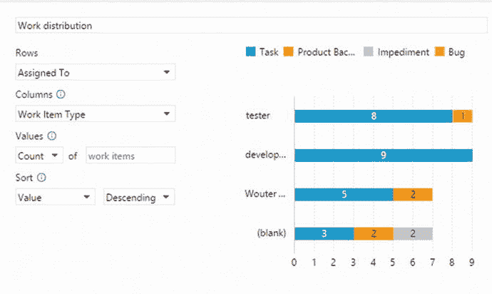
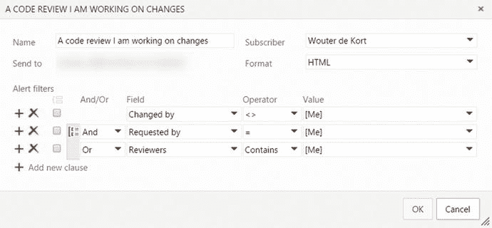

# 六、仪表板和报告

当运行您的项目时，您将生成大量数据。来自敏捷工具的数据——比如 Scrum、看板和项目组合管理——以及其他数据，比如代码、测试和发布数据。幸运的是，Visual Studio Team Services 有一个内置的查询系统，并且能够为项目的最新概览创建仪表板。本章讨论 VS Team Services 的仪表板、查询和通知功能。您还将了解如何搜索您的代码。

您从查看查询开始。这些查询是您在仪表板上显示数据和发送通知的基础。

## 问题

查询是 VS 团队服务的重要组成部分。能够以各种方式找到工作项是您日常工作的一个重要部分。这可以从选择一个工作项开始工作，到决定当前的 sprint 是否有太多的 bug 需要发布。

### 使用搜索框

当您打开 VS Team Services 项目时，搜索框位于右上角。当您位于概览页面或工作页面时，此搜索框允许您搜索您的工作项目。(当您导航到其他选项卡时，可以使用此框来搜索您的代码。你会在本章末尾看到这一点。)

假设您的项目中有如图 [6-1](#Fig1) 所示的工作项。这个 backlog 定义了四个产品 backlog 项。一个分配给某人，一个包含几个标签。

图 6-1。

An example backlog that you can search through

打开一个产品待办事项会在左上角显示工作项的 ID(见图 [6-2](#Fig2) )。这是在整个 VS Team Services 帐户中标识您的工作项目的唯一编号。这意味着您的帐户中不同团队项目中的工作项将具有唯一的 id。您还可以更改列选项以显示每一行的 ID。在搜索框中输入 ID，立即打开工作项详细信息页面。输入不存在的工作项 ID 或您无权访问的工作项 ID 会显示一条错误消息`'TF401232: Work item xxx does not exist, or you do not have permissions to read it.'`

图 6-2。

The work item ID is shown on the Work Item Detail page

您可能无法记住项目中每个工作项的 ID 号。幸运的是，还有其他方法可以搜索工作项。如果你看一下图 [6-3](#Fig3) ，你会看到 VS Team Services 有几个你可以使用的预定义过滤器(点击右边的箭头或将你的光标放在文本框中，点击向下的箭头来显示这个弹出窗口)。

图 6-3。

The search filters for work items

分配给过滤器将文本`a:"@Me"`放入搜索框。如果您随后开始搜索(通过按 Enter 或单击放大镜)，您将启动对分配给您的所有工作项的搜索。除了`@Me`之外，您还可以输入团队中某个人的(部分)姓名。“创建者”过滤器以同样的方式工作，除了您现在将找到最初由您搜索的人创建的所有工作项。

状态过滤器允许您搜索处于特定状态的工作项目。例如，产品待办事项可以处于新建、批准、提交、完成或删除状态(参见图 [6-4](#Fig4) )。这些状态因工作项类型而异。

图 6-4。

The States drop-down shows the possible states of a product backlog item

最后，您可以从搜索框中直接通过工作项类型进行搜索。您可以输入您正在寻找的工作项目的完整或部分名称。因此，搜索产品或产品待办事项会给你同样的结果。

您可以在这些过滤器之间放置一个空格，从而在一次搜索中组合这些过滤器。因此搜索文本`S:New T:"product"`搜索所有处于新状态的产品待办事项。在您的过滤器和值之间放置一个`:`(冒号)允许您运行部分搜索。放置一个`=`(等号)只会搜索与您指定的值完全匹配的值。您可以使用的第三个操作符是`-`(减号)，它指定了一个 not 操作。因此搜索`S-New`会找到任何不在新状态的工作条目。

除了使用预定义的过滤器，您还可以运行关键字搜索。VS Team Services 然后在 Title、Description 或 Repro Steps(bug 工作项特有的)字段中查找包含您的关键字的工作项。如果你想搜索一个(部分)句子，你需要像这样给你的单词加上引号:`"certain keywords"`。

如果您想要搜索特定的字段值，您可以输入字段的名称，后跟一个`:`(冒号)或`=`(等号)，然后是您想要查找的值。所以搜索`T=Bug System.Reason= Duplicate`会搜索所有重复的 bug。当您想要查询包含日期的字段时，例如更改日期和创建日期，您可以使用`@Today`宏来指定当前日期。然后你可以从中减去一个数字，回到过去。所以搜索`ChangedDate=@Today-7`会给出七天前修改的工作条目。

### 工作项查询

您一直使用的搜索框是定义查询的一种快速方式。查询是您在 VS Team Services(或 Visual Studio)中创建的项目，您可以与他人共享这些项目，并且可以将其用作图表和仪表板小部件的基础。以搜索文本`-A:@!Me`为例(搜索所有未分配给我的工作项目)。如果你在一些样本数据上运行这个，你会得到如图 [6-5](#Fig5) 所示的结果。

图 6-5。

The query results for a search

您在这里看到的是 VS Team Services 的 Work 部分中的 Queries 选项卡。您会立即进入一个名为“搜索结果”的查询，并显示结果。如果您单击 Editor 选项卡，您会看到 VS Team Services 为您的搜索定义的实际查询。图 [6-6](#Fig6) 显示了这个查询。在这种情况下，查询中只有一个子句，即确保“分配给”字段不包含您的姓名的过滤器。

图 6-6。

The query created by VS Team Services for a simple search

扩展这个查询很容易。您可以通过单击绿色加号图标来添加新条款。然后选择一个字段或运算符，并输入一个值。如果您滚动字段下拉列表，您将看到一大堆值。这些字段是在所有不同类型的工作项上定义的。其中一个字段是工作项类型本身。您可以使用此字段将您的查询限制在特定类型的工作项。

运算符下拉列表允许您选择处理数字的运算符(大于、小于等)。)和文本，并允许您比较一个字段和另一个字段。当您比较一个字段和另一个字段时，值字段是文本字段或下拉列表。

基于字段、运算符和值构建的子句是查询的基础。当您添加多个子句时，默认情况下，VS Team Services 将搜索与您的所有子句匹配的项目。如果希望在两个子句中的一个为真或者两个都为真的情况下返回结果，可以将 And/Or 下拉列表更改为 Or。如果您要比较条款组，请通过选中每个条款开头的复选框来选择条款，然后单击顶部的组图标。

当搜索工作项时，您有时想要搜索项之间的关系。也许你想找到没有故事板的产品待办事项。或者您想要查看是否有针对某些 bug 创建的任务。您可以搜索工作项及其直接链接，或者搜索整个工作项树。图 [6-7](#Fig7) 显示了一个查询，该查询搜索与分配给您的项目相关联的所有产品待办事项。

图 6-7。

A query for work items and their direct links

VS 团队服务中的一个链接可能意味着很多不同的事情。您有像工作项的父项或子项这样的内容，但您也有像“被...影响”或“被...引用”这样的链接。前面的查询将查找带有分配给您的任务的产品待定项，以及链接到分配给您的功能的产品待定项。不会显示未链接到分配给您的任何项目的产品积压项目。如果您想改变链接类型，您可以通过选择图 [6-7](#Fig7) 右下角所示的不同链接类型(一种或多种)来实现。例如，选择子链接类型将不再返回链接到分配给您的功能的产品待定项。

过滤器选项下拉菜单(图 [6-8](#Fig8) )也很有趣。当选择“仅返回具有匹配链接的项目”选项时，将不会得到任何与查询的顶部匹配而不是底部匹配的结果。因此，回到前面的查询作为例子，您不会找到所有的产品待办事项，即使它们没有分配给您的链接项。如果您选择第二个选项，返回所有顶层项目，您将找到所有产品积压项目。具有分配给您的链接项目的项目将在结果中返回。最后一个选项“只返回没有匹配链接的项目”否定了查询。在本例中，您将找到没有分配给您的链接项的产品待办事项。

图 6-8。

The different filter options when querying for work items and direct links

在工作项和直接链接查询类型搜索依赖项(由您选择的链接类型指定)的情况下，您还可以使用树类型查询来搜索工作项类型的整个层次结构。这将自动使用父/子关系来查询项目。例如，如果您想要查找产品待定项及其任务或 bug，请使用此查询。

最后，您可以使用“跨项目查询”选项来搜索您有权访问的所有项目。默认情况下，此选项未启用，将您的搜索限制在当前项目中。

如果您查看查询页面的左侧，您会看到一个可以使用的查询组树。默认情况下，当您开始一个新项目时，会为您创建几个查询。这些如图 [6-9](#Fig9) 所示。默认情况下，最上面的两个查询在这里。“分配给我”查询返回与搜索`A="@Me"`相同的结果。团队的所有成员都可以看到共享查询下的查询。在此添加或修改查询需要您是团队管理员。保存查询时，选择要添加查询的文件夹。您还可以拖放查询来移动它们。

图 6-9。

The Query Explorer in VS Team Services

### 图表

图表是查询的图形表示。它们可以是显示分配给您的 bug 状态的快照，也可以是显示您的查询如何随时间变化的趋势图。假设您想一目了然地看到分配给您的项目数量以及这些项目的状态。为此创建一个图表相当容易。图 [6-10](#Fig10) 显示了这样一个图表。该图表基于现成可用的“分配给我”查询。数据按状态字段分组，并呈现为饼图。在这种情况下，提交了两个项目—一个是新的，一个是完成的。如果您想从图表中删除已完成的工作项，您需要编辑底层查询(或者，如果您想在几次冲刺后自我感觉良好的话！).

图 6-10。

A pie chart showing the work items assigned to you, grouped by state

正如您在图 [6-10](#Fig10) 中看到的，有几个图表可供您使用。快照图表显示项目的当前状态。如果您查看饼图示例，您会看到此时有四个项目分配给您。如果您想知道上周分配给您的项目，您可以使用趋势图。图 [6-11](#Fig11) 显示了当前分配给你的四个项目的面积图，这是一种趋势图。如你所见，它们都是在过去两天内创建的。

图 6-11。

An area chart showing the total number of assigned work items over time

作为本章后面关于仪表板部分的前奏，最好了解一下将图表添加到仪表板有多容易。唯一要记住的是，只有共享查询可以添加到仪表板中。您自己的个人查询不能放在仪表板上。图 [6-12](#Fig12) 显示了如何向仪表板添加共享查询。在这种情况下，Work in Progress 查询显示了这个 sprint 的工作是如何在三个团队成员之间分配的。

图 6-12。

Adding a chart based on a shared query to a dashboard Note

请记住，只有共享查询才能添加到仪表板。您自己的个人查询不能放在仪表板上。

图 [6-13](#Fig13) 到 [6-19](#Fig19) 显示了您可以创建的不同类型的图表。

图 6-19。

A line chart shows a line for each state versus time

图 6-18。

A stacked area chart shows the total count of work items as a trend

图 6-17。

A stacked area chart shows a trend of the state changes

图 6-16。

A pivot table displays the different states set against work item types

图 6-15。

A stacked bar graph showing the distribution of work across your team members

图 6-14。

Select the column chart to view the different states as vertical columns

图 6-13。

Select the bar chart to view the different states as horizontal bars

## 代码搜索

你搜索过你的代码吗？在 Visual Studio 中，您可能已经搜索过文件、项目和解决方案。您可以使用复杂的正则表达式或简单的关键字搜索。但是，如果您想在多个团队项目中搜索代码，该怎么办呢？这就是代码搜索的用武之地。

代码搜索是 VS Team Services 的一个特性，它允许您在不同语言的多个存储库中搜索多个项目。为什么要搜索代码呢？在很多情况下，这样做是有帮助的。假设您的公司有一组广泛的项目，您的任务是为您的项目构建一个新功能。你想知道其他人过去是否建造过类似的东西。在本地驱动器上搜索当前项目很容易。但是代码搜索允许你搜索所有的项目。当您在寻找特定 API 或库的示例时，情况也是如此。或者如何搜索客户在 bug 中报告的错误消息呢？进行快速搜索不仅会显示项目中的错误信息，还会显示您所依赖的项目中的错误信息。

我经常使用代码搜索。我在我的 VS 团队服务帐户中有一个示例团队项目，它包含我用作参考的所有类型的项目。从罗斯林(C#和 VB 编译器)和 ASP.NET MVC 代码到我觉得有用的代码片段。如果我想查看某个特定方法的内部，或者只是想找到某个片段，我可以使用代码搜索来浏览 TFVC 和 Git 库。代码搜索不仅仅是简单的关键字搜索，它会解析您的文件并理解实际的代码。这允许您过滤您的查询，只包括类、方法、参数和其他语言类型。这就是代码搜索如此强大的原因。

微软实现了代码搜索作为一个扩展，你可以从市场上免费安装(见 [`https://marketplace.visualstudio.com/items/ms.vss-code-search`](https://marketplace.visualstudio.com/items/ms.vss-code-search) )。安装完扩展后，您可以使用 VS Team Services 页面顶部的搜索框来搜索代码(除了当您在 Home 或 Work 选项卡上时；然后您搜索工作项)。

图 [6-20](#Fig20) 显示了我在名为`QueriesAndDashboard`的项目中导入的罗斯林代码库的关键字分析器的示例搜索。搜索结果按文件分组。在结果页面上，您可以立即检查文件，并查看关键字的使用位置。在左侧，Roslyn 存储库被选中。显然，MVC 存储库也有一个结果。如果您想知道谁更改了文件，您可以直接在搜索结果中查看注释。

图 6-20。

The results of a basic keyword search

虽然关键字搜索很有帮助，但是当您开始使用内置过滤器时，代码搜索的真正威力才会显现出来。图 [6-21](#Fig21) 显示了您可以使用的过滤器。例如，搜索`class:Analyzer`会将结果限制在 Roslyn 代码中定义了一个名为`Analyzer`的类的所有地方。使用`method:analyze*`过滤搜索将您的搜索限制在所有能找到的以单词`Analyze`开头的方法。通配符`*`匹配所有字符，而`?`只匹配一个字符。所以`method:analyze*`匹配`AnalyzerForLanguage`和`AnalyzeControlFlow`这样的方法。搜索`arg:x?`可以匹配类似`x1`、`x2`或`xx`的参数(所有这些都可以在罗斯林项目中找到！).

图 6-21。

Available filters when searching through code

除了筛选代码元素之外，还可以将搜索限制在特定的项目或文件路径。例如，搜索`basetype:IDisposable path:*Test*`会发现所有对`IDisposable`接口的使用仅限于路径中某处有`Test`的文件。您还可以使用`AND`、`OR`和`NOT`操作符来组合多个语句。搜索`basetype:IDisposable NOT path:*Test*`会排除路径中包含单词`Test`的所有结果。除了自己在文本框中输入过滤器，您还可以使用代码搜索左侧的复选框来逐渐过滤出您想要的结果。关于所有不同过滤器条款的示例，您可以导航至图 [6-21](#Fig21) 底部显示的帮助页面。您还可以找到 Channel9 视频的链接，该视频演示了代码搜索用例。

代码搜索允许您搜索您拥有读取权限的所有存储库。为了有效地使用代码搜索，您应该对尽可能大的代码库拥有读取权限。这是你需要适应你的公司的监管规则。

## 仪表盘

仪表板提供了一种在项目中创建数据视图的简单方法。通过使用标准小部件并创建自己的查询来用数据填充小部件，您可以快速创建满足您需求的仪表板。

当您创建一个新的团队项目时，VS Team Services 会为您创建一个标准的概述仪表板。该控制面板由以下小部件组成:

*   关于如何开始的信息
*   关于在建工程的数据
*   如何创建工作项
*   如何访问产品的不同区域
*   如何管理团队成员

图 [6-22](#Fig22) 显示了这个默认仪表板。

图 6-22。

The default Overview dashboard helps you get started and gives you a quick overview of your project

通过进入编辑模式并将小部件拖动到所需位置，可以重新排列仪表板上的小部件。可配置的小部件在右上角有一个省略号，您可以编辑它们。某些小部件，例如欢迎和新工作项小部件，没有任何设置。您只能从仪表板中添加和删除这些小组件。也可以配置其他小部件。例如，单击团队成员小部件会打开一个窗口，您可以在其中添加和删除团队成员。默认添加的查询结果小部件由一个查询支持，您可以从配置刀片或通过在工作中心打开查询来更改该查询(参见图 [6-23](#Fig23) )。

图 6-23。

Configuring a query widget on your dashboard

仪表板的好处在于，它们可以供您的团队以及可以访问 VS 团队服务的利益相关者使用。由于您可以配置多个仪表板，因此您可以创建针对特定风险承担者和团队成员的仪表板。默认情况下，提供了一些小部件供选择；但是，您可以通过添加扩展或创建自己的扩展来增加选择。其中一些小部件非常简单，比如允许您在 Visual Studio 中打开项目的 Visual Studio 小部件。Welcome 小部件是团队项目的入门指南，它链接到项目的不同部分。其他小部件提供更复杂的功能，比如 Pull requests 小部件，它显示每个 Git 存储库的活动 Pull 请求。

## 警报和通知

VS 团队服务的另一个特性是支持警报和通知。假设您想知道什么时候构建失败，什么时候代码评审被分配给您，或者什么时候有人给您分配了一个工作项。当然，您可以在 VS Team Services Web 访问界面中找到所有这些，但是有一个通过电子邮件通知您的系统可以加快速度。

这都是通过为您感兴趣的团队项目创建警报来完成的。警报使用的过滤器与您在本章开始时已经看过的查询非常相似。您可以在团队项目设置中管理您的警报。图 [6-24](#Fig24) 显示了 Web 访问中的警报选项卡。如您所见，您设置了自己的警报和整个团队的警报。

图 6-24。

You can manage alerts for your project in the Team Project settings

创建新警报很简单。假设您希望在代码评审被分配给您时收到一封电子邮件。如果您查看 Create New Alert When 部分，您会看到已经有一个预定义的代码审查警报。如果您选择该警报，您可以如图 [6-25](#Fig25) 所示进行配置。如您所见，警报过滤器使用与常规查询相同的方法。

图 6-25。

Configuring an alert

除了查询之外，您还可以更改订阅者(如果您是管理员)和消息的格式。使用 HTML 或纯文本时，您需要指定一个电子邮件地址作为收件人。也可以选择肥皂。这允许您指定每当警报触发时调用的端点。因此，如果您想实现自动化，比如使用一个每当构建失败就改变颜色的构建监视器，您可以使用 SOAP 调用来实现这一点。

您可以查看、删除和编辑您的通知。您还可以查找特定用户的警报。这很方便，尤其是在管理 VS 团队服务环境时。如果某个用户抱怨他收到了许多电子邮件提醒，您可以快速搜索他的姓名，并查看配置了哪些提醒。

如果要创建非现成可用的警报，请选择“创建警报时间”部分中的其他选项。这将显示一个窗口，您可以在其中选择警报模板。您有四类警报:工作项、代码审查、签入和生成。这给了你很大的自由来设置你的提醒，并涵盖了广泛的事件。

还有一种类型的事件会向你的邮箱发送提醒:提名权。一个提及允许您通过名字指定一个团队成员，这将立即给他发送一封电子邮件。您可以在工作项的讨论部分使用它，如图 [6-26](#Fig26) 所示。其他地方，比如向 Git pull 请求添加审阅者，也允许您发送提及。只要输入一个`@`和某人名字的前三个字符，看看是否会弹出提及窗口。提到的人收到的邮件看起来如图 [6-27](#Fig27) 。

图 6-27。

A mention sends out an e-mail to your target

图 6-26。

Using mentions in a work item discussion

## 摘要

在本章中，您了解了查询、代码搜索、仪表板，最后是警报和通知。您学习了如何使用搜索框来运行快速工作项搜索。您还看到了如何使用查询编辑器创建更复杂的查询。您可以将这些保存为个人或共享查询。然后，您可以根据这些查询创建图表，并将它们固定到仪表板上。仪表板由您可以添加、删除和配置的小部件组成。您可以根据需要创建任意数量的仪表板，并与您的团队共享。您还了解了代码搜索，这是 VS Team Services 中的一个特性，它允许您在多个存储库中搜索共享代码、注释、示例或您能想到的任何其他用例。最后，本章讨论了警报和通知。您可以轻松设置发送电子邮件或触发 SOAP 端点的警报。您还看到了如何提及团队成员，以确保他们注意到 VS Team Services 中对他们来说重要的讨论或其他内容。

这是“计划”部分的最后一章。下一章是关于 VS 团队服务中的版本控制。您将了解 Git 和 Team Foundation 版本控制，并了解如何在您的项目中使用它们。