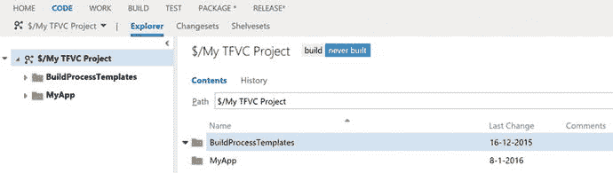
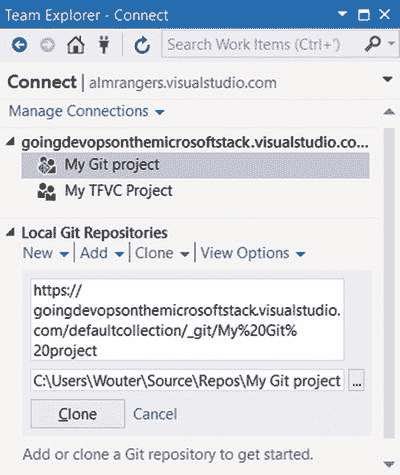

# 7.设置版本控制

在本章中，您将学习 Visual Studio Team Services 在将代码存储在版本控制中时能为您做些什么。您将了解什么是版本控制，以及 VS Team Services 提供的两种不同风格:Team Foundation 版本控制和 Git。您还将学习一些通过分支构建代码的最佳实践，以及如何使用特性切换更进一步。

## 版本控制简介

在我进入专业软件开发之前，我不知道什么是版本控制。我把我的代码存储在我的硬盘上，并做了备份，打上了时间戳。在团队中工作时，这一过程很快就会中断。共享代码，合并大家做的所有工作，是共同构建软件的一个需求。当我开始作为 ALM 顾问工作时，我非常惊讶地发现仍然有公司使用共享网络文件夹在团队内部共享代码。你可以理解，这给他们带来了相当多的问题。他们会重写彼此的更改，忘记合并文件，有时会完全错过更改。所有这些都导致了错误和时间的浪费。

版本控制是开发团队的基本需求。版本控制为您提供了一种存储代码的方式，这样您就可以轻松地与其他团队成员共享代码。自动跟踪更改，以便保留历史记录。个人开发人员可以将最新的更改下载到他们的计算机上，并与他们自己的更改合并。如果您处于不幸的境地，您的开发人员还没有使用版本控制，这绝对是您应该采用的第一件事。

两种主要的版本控制风格很受欢迎:

*   分布式版本控制
*   集中式版本控制

集中式版本控制使用一个集中的服务器来存储所有的文件和整个开发团队的历史。当客户端想要查看文件的历史或想要撤销其本地更改时，客户端连接到中央服务器(见图 [7-1](#Fig1) )。中央服务器知道每个文件的状态，并能够支持诸如合并更改、回滚到以前的版本以及找出谁做了哪些更改之类的操作。当开发人员长时间处理同一个文件，然后试图合并这些更改时，事情就会出错。这将总是花费你的时间，因为你必须弄清楚哪些行要保留，以何种顺序。


图 7-1。

Centralized version control

分布式版本控制不需要集中式服务器。相反，每个客户端不仅有文件的最新版本的快照，而且还有它们的完整历史。这意味着许多任务，如撤销更改或查看历史记录，都可以在本地完成。这不仅仅是将代码放在文件共享上。Git 是 VS Team Services 支持的分布式版本控制系统，它跟踪存储库中发生的一切。每个提交的步骤都被添加到项目的历史中，允许您在版本之间快速切换、撤销更改和比较文件。每当开发人员想要与其他人共享一些代码时，他们共享整个存储库，包括所有历史(见图 [7-2](#Fig2) )。当然，这些过程是由 VS 团队服务支持的，这并不意味着你必须在机器之间手动复制文件夹。当开发人员长时间处理相同的文件而不合并他们的变更时，会出现与集中式版本控制相同的问题。手动合并这些更改需要时间，并且容易出错。


图 7-2。

Distributed version control

这两种版本控制有很大不同的一个方面是分支。假设您想要并行处理不同版本的代码。您的应用程序在生产环境中运行，错误随之而来。与此同时，您的团队正在开发您产品的新版本。您可以修复团队正在开发的当前代码库中的一个 bug，但是您提供了什么？你有没有发布一个新版本的应用程序，它的特性还没有完成，但是错误已经被修复了？这可能会引入一些新的错误和不满意的客户。最好是，您希望修复运行在生产环境中的代码库中的 bug。您可以在每次发布时创建一个代码库的副本，并将其存储在某个地方，但这是您试图避免的情况。

相反，您可以使用一种称为分支的技术。为了理解树枝，想想一棵树。一棵树有主干，主干是主要的代码行。树枝是树干的分叉。这意味着您创建了一个与主干不同的单独的代码路径。代码的不同之处在于，您可以将分支中的更改合并回主干中。如果你拿前面的例子来说，在生产中有一个版本，并进行新的开发，你将在主干上进行新的开发。当你发布的时候，你在那个点上创建了一个分支。任何错误修复都可以在分支上完成，如果成功，就合并回主干。

图 [7-3](#Fig3) 显示了一个分支策略的例子。您有一个主分支，然后是服务、修补程序和发布分支。


图 7-3。

A sample branching strategy

如您所见，分支场景可能非常复杂。你应该尽量避免把事情弄得太复杂，因为分支需要时间。合并分支之间的变更并跟踪哪些分支包含哪些变更是很困难的。当发展朝着不同的方向发展并且存在许多冲突时，这可能特别困难。每当两个人更改同一文件中的同一行代码时，就会发生冲突。只要它在不同的行上，VS 团队服务就可以自动合并。但是当同一行被更改时，您需要手动合并这两个文件。这归结为选择你想要的改变和改变的顺序。

然而，分布式版本控制系统非常擅长分支。整个历史记录都在本地，所以您可以创建新的分支并在分支之间进行合并，而无需联系服务器。虽然你不联系服务器，但是你仍然需要知道你的团队在做什么。当您尝试合并您的存储库时，处理相同的文件仍然会产生合并冲突。Git，您在使用 VS Team Services 时将使用的分布式版本控制系统，可以确定两个分支之间的确切变化，并使分支变得更加容易。你甚至可以创建你只在本地拥有的分支，并且从不与任何人共享。对于习惯于分布式版本控制的开发人员来说，为他们开始工作的每个特性创建一个新的本地分支并不罕见。这并不意味着他们把所有的分支都推到服务器上，而是在本地把事情组织起来。一旦完成，它们就进行本地合并(或者在使用 Git 时进行重新排序),并将最终结果发送到共享服务器。

对于集中式版本控制，分支是一个更复杂的操作。要创建分支，需要联系服务器。然后在服务器上创建新的分支，您将获得它的一个本地副本。这使得团队中的每个人都可以看到该分支。集中式版本控制不支持创建一个快速分支并在完成后销毁它，同时将内容保存在本地。当向位于服务器上的分支提交您的更改时，如果其他人同时提交了更改，您仍然会遇到合并冲突。

选择您的版本控制类型会影响您团队的工作方式。由于分支的简易性，使用分布式版本控制的团队将更容易创建短期分支，从而允许他们快速试验和并行工作。集中式版本控制也支持分支，但是由于这有点困难，团队倾向于使用其他方式来组织他们的版本控制。

除了分支之外，一种非常适合 DevOps 策略的新方法也越来越受欢迎:特性切换。因为分支有其缺点(耗时、合并冲突等)。)，避免分支不是最好吗？然而，你如何同时处理项目的不同部分，而不将未完成的特性交付给客户呢？本章后面的“选择分支策略”一节将更详细地介绍特性切换。

Distributed Version Control and Large Files

由于分布式版本控制系统与所有客户机共享所有历史，存储大文件成为一个问题。当我用分布式版本控制系统启动一个新的应用程序时，在第一周，一个开发人员认为在版本控制中存储一个大的视频文件会很好。其他开发人员试图获得最新版本的代码，但都超时了，因为文件太大，无法下载。最初的开发人员删除了该文件，认为这样可以解决问题。然而，由于分布式系统与所有客户机共享所有历史，大文件仍然是历史的一部分，并且仍然需要由所有团队成员下载。幸运的是，当您知道自己在做什么时，您可以重写历史，有效地完全删除大文件。然而，这不是一个简单的操作，需要所有团队成员同步并在本地运行一些命令。绝对是你想避免的事情！有一个解决方案，使用 Git-LFS(大文件存储)。这是 Git 的一个扩展，它允许你将大文件放在共享服务器上，并且只在你的历史中放一个指向该文件的指针。尽管这是可行的，但在使用 Git 时避免签入大文件仍然是一个最佳实践。

VS Team Services 既支持 Git 形式的分布式版本控制，也支持 Team Foundation 版本控制(TFVC)中的集中式版本控制。两者都可以在 Visual Studio 中使用，也可以通过 Web 访问使用。如果需要，还可以在一个团队项目中混合使用这两种版本控制。这使您可以同时拥有 TFVC 和 Git 回购，而无需创建额外的团队项目。特性切换是独立于源代码控制策略的事情，因为它是在代码中实现的。以下部分讨论了如何使用 Git 和 TFVC。之后，您将看到不同的分支策略以及如何实现特性切换。

## 使用 Team Foundation 版本控制(TFVC)

Team Foundation 版本控制(TFVC)从第一个版本开始就是 TFS 的一部分。微软开发了 TFVC 来帮助处理他们内部运行的非常大的项目。TFVC 是一个集中的版本控制系统。TFVC 可以轻松管理超过 100，000 个文件的项目。所有这些文件都存储在中央服务器上，客户端只下载最新的快照。

TFVC 有几个关键的概念，你需要知道有效地使用它:

*   工作空间
*   获取最新信息并合并冲突
*   签入变更集
*   历史和注释
*   搁置集和挂起您的工作
*   分支
*   登记政策

### 工作空间

所有文件都存储在服务器上。当你想在你自己的电脑上处理代码时，你可以创建一个工作空间。工作区是服务器上的位置和硬盘上的位置之间的映射。您使用的每台 PC 都有一个唯一的工作空间名称，由您的计算机名称和本地存储数据的路径组成。

Note

我曾看到一个团队在使用一个虚拟机时犯了这样的错误，这个虚拟机的名称与他们共同工作的虚拟机名称相同。TFVC 感到困惑，这导致了各种各样的错误。

工作区有两种类型:

*   本地工作区
*   服务器工作区

图 [7-4](#Fig4) 显示了工作空间的配置选项。工作区在您的硬盘上有一个名称和位置。位置选项配置您的工作空间是本地还是服务器。


图 7-4。

Configuring workspaces in TFVC

在 Team Foundation Server 2012 之前，仅支持服务器工作区。服务器工作区与 TFVC 服务器有活动连接。每次更改文件时，Visual Studio 都会联系服务器，并发出您正在更改文件的信号。这个过程称为签出。由于与服务器的连接，您可以随时看到团队成员正在编辑哪些文件。这也允许您锁定文件并防止其他人签出这些文件。

拥有永久的服务器连接、锁定文件并显式地将它们签出对许多团队来说是一个障碍。你不能离线工作，而且你会减慢工作速度，因为团队成员必须互相等待。这就是为什么微软开发了本地工作区，这是当前的标准。在本地工作空间中，您可以自由地处理所有文件，而无需连接服务器，并且不再锁定文件。这是首选选项，只有当您的项目变得非常大(超过 100，000 个文件)时，您才应该查看服务器工作区。

对于大型项目，还有另一种选择。工作空间映射是递归的。这意味着，如果您映射版本控制存储库的根文件夹，您会将所有子文件夹和文件下载到您的计算机。这可能是大量的数据，可能包含您在工作中不需要的数据。为此，您可以遮盖文件夹。这意味着这些文件夹及其子文件夹不会下载到你的电脑。图 7-5 显示了一个隐藏的工作文件夹的例子。在这种情况下，`BuildProcessTemplates`文件夹不会下载到我的电脑上。


图 7-5。

Cloaking a folder in a workspace

启动新的团队项目时，您可以选择要使用的版本控制类型。然而，由于您可以在单个团队项目中组合 TFVC 和 Git，您总是可以添加额外的存储库。一旦您创建了一个基于 TFVC 的团队项目，您就会被定向到概览仪表板。创建工作空间映射最简单的方法是找到图 [7-6](#Fig6) 中所示的小部件，并选择在 Visual Studio 中打开。


图 7-6。

The Visual Studio widget lets you open your project in Visual Studio

启动 Visual Studio 后，可以使用团队资源管理器(查看➤团队资源管理器)来映射您的工作区。Visual Studio 足够聪明，它知道您还没有映射，并向您展示了一个示例映射，您可以更改或接受它。图 [7-7](#Fig7) 显示了这种情况。当您点击 Map & Get 时，工作区映射被创建，VS Team Services 上文件的当前版本被下载到您的 PC 上。因为这是一个空项目，所以没有要下载的文件，但是创建了映射。


图 7-7。

Configuring a workspace mapping in Visual Studio

### 签入变更集

现在您已经有了一个本地工作区，您可以开始向其中添加文件了。将你在本地所做的更改上传到服务器在 TFVC 被称为签入。当您更改多个文件时，这些更改被分组到一个变更集中。签入会将变更集发送到服务器。如果有合并冲突，VS 团队服务会尝试自动解决。如果这不起作用，您会得到一个错误，您需要运行手动合并。最佳实践是在进行签入之前始终运行 Get Latest 命令，这样可以确保您已经修复了所有合并冲突，并且在签入之前验证了代码仍然有效。

签入文件时，您可以添加注释。这让你的队友很容易(也让你在未来的某个地方！)了解本次签到有哪些变化。您甚至可以根据需要添加注释(请参阅本章后面的“签入策略”)。在本书的第二部分中，您已经看到了如何通过 My Work 面板选择一个工作项。当您选择了一个工作项并将其设置为“进行中”时，您的变更集将自动链接到该工作项。

这就是你的可追溯性的起点。通过链接变更集和工作项，您可以很容易地看到为了实现某个特性而进行了哪些代码更改。故事板、代码评审、测试用例，以及最终的部署都是以这种方式链接的。

当您有一个空的工作空间时，您可能希望其中有一些代码。在映射您的工作空间之后，团队资源管理器看起来如图 [7-8](#Fig8) 所示。在底部，您可以看到创建新解决方案的选项。您可以使用此选项创建一个新项目，并将其添加到您的本地工作区。这只不过是在映射到 VS Team Services 的本地驱动器上的文件夹中创建解决方案。


图 7-8。

Team Explorer helps you create a new solution in your local workspace

在创建您的项目时，您需要确保 Add to Source Control 按钮被选中，如图 [7-9](#Fig9) 的右下角所示。


图 7-9。

Adding a newly created project to source control

创建项目后，您可以通过团队资源管理器➤挂起的更改来查看准备签入的更改。在图 [7-10](#Fig10) 中，您可以看到一个签入是如何由一个注释和一个或多个包含文件组成的。排除的更改是您在本地进行的更改，但您不想将其发送到服务器。


图 7-10。

Check-in pending changes

在签入您的本地更改之后，您可以通过导航到代码中心，在 VS Team Services 的 Web 访问中查看结果。正如您在图 [7-11](#Fig11) 中看到的，代码中枢允许您在浏览器中浏览您的存储库。您还可以查看变更集和搁置集(本章后面将详细介绍搁置集)。



图 7-11。

Exploring your repository through Web Access

### 获取最新信息并合并冲突

当你在团队中工作时，你不会是唯一一个签入变更的人。要获得最新的更改，可以在本地运行 Get Latest 命令。获取最新版本到服务器，检查与您的版本相比，哪些文件被添加、删除或更改。然后，Visual Studio 下载这些更改，并将它们应用到您的本地工作区。

您应该定期运行“获取最新版本”。在本地开发代码而不与你的队友同步会导致问题。您开始编辑相同的文件——添加、删除或移动文件——这将导致合并冲突，并且在您知道之前，同步所有的更改将花费大量时间。您可以从 Visual Studio 中的几个位置执行获取最新版本。一种是在源代码管理浏览器中，如图 [7-12](#Fig12) 所示。源代码管理资源管理器可以从团队资源管理器中打开。源代码管理资源管理器向您显示本地映射了哪些文件夹，下载了哪些文件，或者哪些文件已过期。当您在 Visual Studio 中处理打开的解决方案时，也可以右击任何文件或项目或解决方案本身，并从解决方案资源管理器中运行“获取最新版本”。这是一个递归操作，所以在解决方案上运行 Get Latest 会下载项目中的所有更改。对单个文件运行它只会下载该文件的最新版本。


图 7-12。

Executing a Get Latest version from the Source Control Explorer

当您和团队中的其他人更改文件中的同一行时，就会发生合并冲突。只要您的更改没有重叠，Visual Studio 就足够聪明，可以自动为您整理更改并合并它们。但是每当你改变同一行时，就需要人工干预来整理。合并冲突会耗费您大量的时间。定期获取最新信息，并就您和您的团队成员工作的代码部分进行清晰的交流，有助于避免冲突。

图 [7-13](#Fig13) 显示了一个合并冲突。在本地，您已经编辑了第 9 行，这没有问题。您还编辑了第 13 行，该行已由另一个开发人员编辑并已签入。Visual Studio 自动合并第 9 行，但是第 13 行(本地 14)给出了一个错误。您需要告诉 Visual Studio 您希望它做什么。您想合并您的本地更改吗？服务器上已有的更改？还是两者兼而有之？您可以使用左边和右边的复选框来选择要包含的代码部分。结果显示在底部。然后，您可以手动编辑底部并保存结果。解决合并冲突后，您可以在本地测试代码，然后签入您的更改以与您的团队共享。


图 7-13。

Solving a merge conflict in Visual Studio

### 历史记录、注释和 CodeLens

当开发人员在 TFVC 签入变更集时，会更新最新版本的代码库。还存储了变更集的详细信息。这意味着 TFVC 存储了你的代码库曾经发生的所有变化的详细历史。这可以让你回到过去。您可以查看代码的以前版本，并比较两个变更集之间所做的更改。当引入一个新的 bug，并且您想要调查对一个文件所做的更改，或者当您想要知道自从您最后一次处理一个项目以来对它做了什么更改时，这是非常方便的。

可以在文件、文件夹、项目和解决方案级别查看历史记录。查看特定文件时，可以激活注释功能。这使您可以在一个概览中看到哪些更改是由谁进行的。当然，你需要避免一种文化，在这种文化中，你开始用这个特性来指责别人。找出谁制造了一个 bug 可能是有用的，但是不要开始把它当作武器。另一种跟踪代码情况的方法是 CodeLens。CodeLens 是一个指示器，它直接显示在 Visual Studio 的代码编辑器中，并为您提供有关代码的信息。当连接到 TFVC，你会看到你是否有最新版本的本地，谁做了修改，他们做了什么。

要查看文件的历史，可以使用上下文菜单并选择源代码控制➤查看历史，如图 [7-14](#Fig14) 所示。这将打开历史窗口，您可以在其中看到影响该文件的所有更改的列表。您可以打开单个更改来查看该时刻文件的内容。您也可以选择两个不同的变更集，然后选择 Compare。这将打开如图 [7-15](#Fig15) 所示的窗口，并并排显示两个文件。当您为文件选择“批注”选项时，您会看到哪个人修改了哪些行。这样，很容易发现谁做了特定的更改。在图 [7-16](#Fig16) 中，你可以看到我独自完成了这个简单的程序。然而，我首先创建了一个修订版 21，然后是 23，增加了一行。最后，图 [7-17](#Fig17) 显示了这在 CodeLens 中的样子。您可以看到 CodeLens 出现在代码编辑器中每个成员的顶部。您可以查看谁进行了最后的更改，并且可以直接访问更改列表。如果您的代码版本过期，CodeLens 也会发出这种信号。


图 7-17。

CodeLens shows history information in a hub in your editor


图 7-16。

The Annotate feature shows which changes were made, when they were made, and who made them


图 7-15。

Comparing two versions of a file


图 7-14。

You can view the history of a file, project, or solution

### 搁置集和挂起您的工作

你什么时候签入代码？当你准备好回家的时候？当它编译时。当它运行的时候？当你彻底测试过之后。我希望您不要在没有编译、运行和测试的情况下签入代码。请记住，当您签入代码时，您的团队成员就可以访问它。因此，当您签入一些非编译代码而其他人执行 Get Latest 时，他们的本地版本会突然中断。这不会让你的团队成员对你特别满意(在第 [9](09.html) 章，你将学习如何避免这种情况)。

但是，如果您的代码还没有完成，并且您想回家一天呢？只要您的代码没有被签入，您的计算机崩溃或其他一些事件就可能意味着代码丢失。此外，只要代码在您的硬盘上，您就不能与团队成员共享它。幸运的是，VS Team Services 支持一个叫做搁置集的概念来帮助您解决这些特殊的问题。搁置集允许您在服务器上存储变更集，而无需将其添加到当前代码库中，也无需直接与团队成员共享。每个团队成员都有自己的“架子”，在那里他可以存放任意多的架子集。您可以与特定的团队成员共享搁置集，从而允许您共享代码，而不会妨碍其他团队成员。图 7-18 显示了如何创建一个搁置集。


图 7-18。

Shelving pending changes

导航到"挂起的更改"窗口，并选择"搁置"而不是"签入"。然后，您需要命名搁置集。您还可以选择是否要将搁置的更改保留在本地。如果不选择此选项，您的更改将被回滚，您需要还原搁置集才能继续使用您的更改。有时，这正是您想要的，因为出现了其他事情，您想暂时搁置您的更改。

要恢复搁置集，您可以转到挂起的更改➤操作➤查找搁置集(参见图 [7-19](#Fig19) )。这将打开一个显示所有搁置集的窗口。然后，您可以简单地选择一个搁置集并恢复它。如果您想打开团队中其他人的搁置集，您需要搜索他们的名字。


图 7-19。

You can find a shelveset from the Pending Changes window

搁置集也是其他 VS Team Services 特性的基础，即挂起和代码审查。Suspend 允许您在服务器上存储代码的当前状态和 Visual Studio 的整个状态(打开了哪些文件、设置了哪些断点，甚至是窗口的布局)。然后，您可以执行一些其他的工作(比如您的经理突然提出的 bug)，然后从暂停的工作中恢复，继续工作，就像什么都没发生一样。这允许您快速切换上下文，同时仍然保持您的工作。您在团队资源管理器的“我的工作”窗口中暂停您的工作，如图 [7-20](#Fig20) 所示。该位置还显示您之前暂停的工作，并允许您继续工作。Resume 将恢复您的代码更改和其他工作，如断点和对话框。


图 7-20。

You can suspend and resume work from the My Work panel

代码评审也基于搁置集。代码审查允许你要求一个团队成员(或者一组用户)来检查你的代码。他们可以添加评论，然后将评论发送给您。代码通过搁置集共享，允许其他用户看到您的代码更改，而不必签入它们。您可以在我的工作面板中请求代码审查，如图 [7-21](#Fig21) 所示。


图 7-21。

You can request a code review from the My Work panel

要开始代码评审，您需要添加一个或多个您想要进行评审的人。您还可以添加标题和描述。或者，您可以向描述您正在处理的功能的工作项添加链接。一旦你这样做了，你提交请求。图 [7-22](#Fig22) 显示了一个代码评审请求。


图 7-22。

Requesting a code review

审阅者在“我的工作”面板中看到该请求。审阅者可以向审阅请求添加总体注释。她还可以对个别更改添加注释。审阅者完成后，提交审阅。图 [7-23](#Fig23) 显示了代码审查响应。


图 7-23。

Responding to a code review

### 分支

正如引言中所讨论的，当并行处理同一代码库的不同版本时，分支就开始发挥作用了。分支可能是一个强大的特性，但也可能是危险的(参见本章后面的“选择分支策略”一节)。TFVC 支持直接从 Visual Studio 分支。您可以从源代码管理资源管理器中查看结构、分支和合并的可视化效果。启动 TFVC 项目的最佳实践是添加一个单独的`Main`文件夹，并在该文件夹下添加所有工件。如果您将来需要分支，您可以很容易地将您的`Main`文件夹转换成一个分支，然后基于`Main`创建新的分支。

如果你查看图 [7-24](#Fig24) 中的上下文菜单，你会看到分支和合并子菜单。选择“分支”来创建一个新的分支，选择“合并”来将一个分支的更改合并到另一个分支中。


图 7-24。

You can branch and merge from the Source Control Explorer

创建分支时，首先选择新分支的源。然后输入分支的目标名称。图 [7-25](#Fig25) 显示了一个将`Main`分支到`Dev`分支的例子。“版本分支”下拉列表很有趣。默认情况下，会选择最新版本。但是如果你愿意，你也可以从一个特定的变更集或者标签中分支。这允许您从过去的某个点创建一个分支。最后，选择是否要启用分支可视化，以及是否要将分支下载到您的工作区。这意味着当您在 TFVC 处理多个分支时，您的本地工作区中有几个包含这些分支的文件夹(正如您将看到的，这与 Git 不同)。当使用分支时，在做出改变之前，确保你在正确的分支中是很重要的。


图 7-25。

Creating a new branch

现在假设您已经在 Dev 分支中完成了一些工作，并且您想要将这些变更合并到主分支中。图 [7-26](#Fig26) 显示合并窗口。选择一个源分支和一个目标分支。默认情况下，您将所有变更集从源分支合并到目标分支。您还可以挑选要合并的变更集，但是这是一件错误多于正确的事情。记住，`Dev`和`Main`很容易合并，因为它们有直接的链接:你从`Main`中分支出`Dev`。如果两个分支之间没有直接的联系，你可以进行所谓的无根据合并。毫无根据的合并很难执行。因为 Visual Studio 不知道这些分支之间的关系，所以您需要进行大量的手动合并。最好避免毫无根据的合并，但如果你真的需要，这是一个强大的功能。


图 7-26。

Merging to branches

### 登记政策

你对你的代码有最低质量标准吗？例如，允许开发人员签入不能编译的代码吗？他们需要在签入中添加评论吗？确保开发人员在将代码签入服务器之前编译代码并运行某些测试，将有助于提高整个过程的质量。Visual Studio 和 TFVC 通过签入策略支持这一点。每次开发人员想要签入代码时，都会运行一个签入策略。该策略可以检查某些事情(代码可以编译吗？是否有与此签入相关联的工作项？)并且可以在策略失败时拒绝签入。您甚至可以创建自己的策略，在团队中分发这些策略，并实现对您来说很重要的质量检查。

您可以从 Visual Studio 中配置签入策略。如果导航到团队项目设置➤源代码管理➤签入策略，然后选择添加，您将看到如图 [7-27](#Fig27) 所示的窗口。这四个签入策略是现成可用的。构建策略确保开发人员在签入之前成功运行其代码的构建。变更集注释策略强制开发人员向他们的签入添加注释。代码分析策略确保开发人员在签入之前在本地运行代码分析。最后，工作项策略确保开发人员将工作项与签入相关联。


图 7-27。

Add a check-in policy for a team project

现在假设您已经选择了变更集注释策略。如果开发人员现在试图在不输入注释的情况下签入一些代码，则会显示图 [7-28](#Fig28) 中的警告。如您所见，有一个选项可以覆盖警告。你可以设置一个提醒(更多信息请参见第 [6](06.html) 章),当有人覆盖策略时通知你。不幸的是，在使用 VS Team Services 时，没有禁用覆盖的选项。


图 7-28。

A policy warning is shown when checking in changes

## 使用 Git 版本控制系统

Git 是一个非常流行的分布式版本控制系统。Git 是由 Linus Torvalds 为在 Linux 内核上开发而创建的。Git 是英国俚语，意为“不愉快的人”，被一些人认为是对 Git 工作方式的描述。这并不意味着你应该远离 Git。只是如果你来自一个集中的版本控制背景，比如 TFVC，你可能很难习惯 Git。但是值得。Git 的纯粹速度和它给你的灵活性足以让你认真看待 Git。我知道一些 ALM 专家，他们甚至说如果不使用像 Git 这样的分布式版本控制系统，团队就不可能真正敏捷和开发。我个人认为那个意见太强了。我见过团队用 TFVC 成功，也见过他们用 Git 失败。但它确实清楚地表明了 Git 有多有趣。

在 VS Team Services 中创建新的团队项目时，需要设置几个重要的配置选项。首先，你选择你想要使用的过程(敏捷、CMMI 或 Scrum ),然后你选择你想要使用的版本控制系统:Git 或 TFVC。幸运的是，在一个团队项目中混合 Git 和 TFVC 也是可能的。

Git 基于几个关键动作:

*   克隆
*   提交和推送
*   取和拉
*   树枝
*   取得
*   拉取请求

以下各节讨论了这些操作。

### 克隆

使用 Git 存储库从克隆开始。您输入外部存储库的 URL，然后将其内容克隆到您的开发机器上。克隆可以获得存储库的所有历史记录，并将其复制到您的机器上。克隆后，你完全自给自足。克隆可以比作在 TFVC 设置工作空间映射。最大的区别是，在 TFVC 你只下载代码的最新快照，而 Git 给你整个历史。

因为 Visual Studio 支持标准的 Git 协议，所以您不仅可以使用 Visual Studio 处理 VS Team Services 中的 Git 存储库，还可以处理 GitHub 或其他托管的 Git 存储库。这使得使用 Visual Studio 来处理托管在 GitHub 上的开源项目变得非常容易。您甚至可以创建一个本地 Git 存储库，并且永远不与任何人共享它。

您可以从团队资源管理器中克隆一个 Git 存储库。如果你看图 [7-29](#Fig29) ，你会看到我的团队资源管理器连接到一个 VS 团队服务账户，同时有一个 Git 和一个 TFVC 项目。如果选择 Git 项目并选择 Clone，系统会询问您希望在计算机上存储项目的位置。如果您随后单击“克隆”，该项目将被下载到您的本地计算机上。克隆项目后，您就可以开始使用它了。



图 7-29。

Cloning a Git repository

### 提交和推送

我发现提交是 Git 最好的特性之一。使用 TFVC，你在本地做你的变更，这形成了一个变更集，然后你把这个变更集作为一个整体上传到 TFVC。撤消本地更改会撤消自上次签入以来所做的所有更改。如果你想小批量工作，你必须每次都把你的代码上传到 TFVC。但是如果您的代码还没有完全完成呢？您还不能将它上传到 TFVC，并且您还会丢失可以撤消的小批量数据。为此使用搁置集也不是最佳选择，因为搁置集不包含历史。

本地 Git 存储库是真正的本地存储库，因为您可以将更改提交到本地存储库，而无需将它们上传到服务器。这意味着在工作时，您可以小批量地提交您的更改。这些提交存储在本地，当您完成时，您可以将您的提交推送到服务器。您可以撤销本地提交(在推送之前),因此创建了一种非常灵活的工作方式。当您有多个本地提交时，您甚至可以将它们压缩成一个提交并发送给服务器。这样，您可以在您的开发 PC 上非常精细地工作，而不会让您的团队成员忙于提交。

从 TFVC 的角度来看，最重要的变化是您不直接检入您的更改。首先在本地提交它们，然后将本地提交推送到服务器。

Note

在撰写本文时，Visual Studio 中的 Git 工具支持仍在开发中。IDE 已经支持许多 Git 命令。然而，有些命令，比如`squash`和`amend`，并不是这样，你需要使用命令行来执行这些命令。更多信息见 [`https://msdn.microsoft.com/en-us/library/dd286572.aspx`](https://msdn.microsoft.com/en-us/library/dd286572.aspx) 。

图 [7-30](#Fig30) 显示了在使用 Git 存储库时可以打开的变更面板。这里您可以看到所做的更改，以及这些更改是否包含在内。您需要输入提交消息。然后选择 Commit 将这些更改添加到您的本地存储库中。这在服务器上还不可用，其他人也看不到您的更改。


图 7-30。

You first commit your changes locally

要与其他人共享您的更改，您可以运行推送命令。Push 获取您的本地存储库，并将更改发送到远程 Git 存储库。这种两阶段提交和推送对于 Git 来说很典型。提交只是在本地进行，推送是将您的更改发送到服务器。只要更改没有被推送，您就可以在本地撤销它们。您甚至可以将多个提交合并在一起，并将它们作为一个整体推送到服务器。推送是在团队资源管理器的同步面板中完成的。如果您查看图 [7-31](#Fig31) ，您会看到一个传出提交。该列表包含自上次推送以来您在本地执行的所有提交(下一节将讨论传入的提交)。要将您的提交发送到服务器，您可以单击 Push。


图 7-31。

You can push local commits to a remote server

### 取和拉

当您想要用团队成员所做的更改来更新您的本地存储库时，是时候进行拉取了。拉获得所有的变化，那里作出了，因为你有你的最新版本，并下载这些到你的电脑。如果有冲突，拉将立即开始尝试合并它们。另一方面，Fetch 让您首先获得所有错过的提交的列表，以便您可以在开始合并之前检查它们。图 [7-32](#Fig32) 显示了当有变化并且您选择获取时会发生什么。在这种情况下，一个远程变更还没有与您的本地存储库合并。


图 7-32。

You can fetch and pull changes from a remote repository to your local repository

您还会看到一个名为同步的选项。如果没有冲突，Sync 首先运行拉，然后自动运行推。我不建议使用这个选项。同步有时会在合并您的更改时出现问题。这将增加一个额外的提交，并弄乱你的历史。

### 树枝

分支是 Git 真正擅长的地方。在 TFVC，你联系服务器创建一个分支。整个团队可以立即看到该分支，并且服务器控件在不同的分支之间合并。因为 Git 有本地存储库的概念，所以您也可以在本地创建分支。比方说，在服务器上有一个主分支，所有开发人员都用它来相互共享代码。您在本地开发一个新的特性，并且希望将这个特性与其他开发人员隔离开来。Git 允许您创建一个只存在于您的开发 PC 上的本地分支。您在该分支中进行更改，完成后，您可以在本地合并分支并推送您的更改。也可以选择推送本地分支，使其成为别人可以看到的公共分支。对于有经验的 Git 用户来说，一天之内创建和删除多个分支并不少见。

Visual Studio 中的 Git 分支是从团队资源管理器➤分支面板管理的。如果你看图 [7-33](#Fig33) ，你会看到一个新克隆项目的分支结构。远程/原点指向 VS Team Services 上的项目。本地分支以粗体显示，目前处于活动状态。


图 7-33。

You can view the branches for your Git repositor y in Visual Studio

要创建一个新的本地分支，右键单击要分支的分支，并从上下文菜单中选择新建本地分支，如图 [7-34](#Fig34) 所示。然后输入分支的名称，并在本地运行创建分支流程。


图 7-34。

Creating a new local branch

Git 在硬盘上存储分支不同于 TFVC。TFVC 为每个分支创建一个新文件夹，而 Git 只需要一个文件夹来存放整个存储库。当切换分支时，Git 将正确的快照应用到您的文件夹中。需要记住的一点是，未提交的变更不是分支历史的一部分。合并分支也可以在团队资源管理器中完成。如图 [7-35](#Fig35) 所示，您选择了一个源和一个目标分支。然后 Git 将执行合并，如果有任何需要手动解决的合并冲突，它会请求您的帮助。


图 7-35。

Merging two Git branches

合并在目标分支之上添加了一个新的提交，它既指向该分支上的前一个提交，又指向源分支上的最后一个提交。如果您已经在本地创建了一个分支，并且在提交更改之前运行了本地合并，那么您可以通过运行 rebase 来避免这种合并冲突。Rebase 从源分支获取提交，并将它们应用到目标分支。然后，您可以安全地删除源分支；就好像那个分支从未存在过。

### 拉取请求

Git 以拉请求的形式内置了本机代码审查。从概念上讲，你可以把拉请求想象成某人通过电子邮件向你发送他们想要改变的代码库的一小部分。他们向您展示他们的新代码，如果您批准，您可以将他们的代码复制并粘贴到您的代码版本中。他们向您发送请求，要求您撤销他们所做的一些更改。

在上一节中，您创建了一个本地分支，并在本地将其合并。如果您想要创建一个拉请求，您可以将您的本地分支推送到服务器，然后请求一个拉请求。其他人检查您的分支，并对您所做的任何更改进行评论。如果更改被接受，分支将被合并到主分支中。拉请求是 Git 的一个非常好的特性，您应该非常熟悉。

若要发布分支，请导航到团队资源管理器中的“分支”面板，右键单击本地分支，然后选择“发布”。完成发布后，您会看到如图 [7-36](#Fig36) 所示的结果。在这里，我发布了 VS 团队服务的本地`Dev`分支。然后，您会看到既有一个本地`Dev`分支又有一个远程`Dev`分支。


图 7-36。

A published local branch shows as a remote

Git 的好处是在 Web 访问中有很多对操作的支持。如果您导航到项目的代码中枢，您可以切换分支，如图 [7-37](#Fig37) 所示。然后，您可以直接在 Web Access 中查看该分支的内容。


图 7-37。

Select a branch from the Code hub in Web Access

切换分支后，可以选择创建拉取请求的选项，如图 [7-38](#Fig38) 所示。然后，您可以为您的拉请求输入一个名称(默认情况下，将<源分支>合并到<目标分支>)，包括一个描述，并添加评审者(默认情况下，您的整个团队)。您也可以直接从 Visual Studio 中的“分支”面板创建一个拉请求，而不是先发布分支，然后分两步创建一个拉请求。这将在一个步骤中发布您的分支并创建一个拉请求。


图 7-38。

Create a pull request from within Web Access

现在，您的团队成员可以在 Web 访问中查看拉动请求。他们可以看到您想要获取的描述和提交(参见图 [7-39](#Fig39) )。他们可以输入评论并开始讨论某些变更(参见图 [7-40](#Fig40) )。完成后，可以接受拉请求，将其与目标分支合并。


图 7-40。

You can comment on the changes of a pull request


图 7-39。

In Web Access you can inspect the changes that a pull request introduces

## 选择分支策略

我见过团队采用如此复杂的分支方案，以至于他们完全不知道哪个分支中有哪些变化。这导致错误只在他们分支机构的一个子集内被修复，为客户引入了随机重复出现的错误。当涉及到合并时，拥有一个过于复杂的分支方案也会花费大量的时间。

当使用集中式版本控制时，最好的分支策略是只有一个分支。这样可以节省时间，因为你不用合并。您的代码总是集成的，使得部署和测试更容易。总是从单个分支开始。只有在真正需要的时候，才考虑创建其他分支。当使用分布式版本控制时，情况就不同了。开发人员通常在本地分支到特性分支，然后发布他们的分支，并创建一个拉请求来与主分支合并。还有哪些分支可以有所帮助的场景？

### 分支场景

分支的一个原因是，当其他团队继续开发新功能时，您正在为新版本稳定您的代码。在同一个分支中混合稳定和新开发可能不是一个好主意。为了有助于这一点，您可以创建一个新的分支，在那里进行新的开发，同时保留您的主分支，用于稳定和发布。一旦开发分支中的特性完成，它们就会被合并到主分支中，这样它们就可以被发布了。

当一个团队并行处理多个新特性时，有时会用到特性分支。如果您从主场景和开发分支场景开始，那么只有当开发分支中的所有功能都完成时，您才能将开发分支合并回主场景。尤其是当您并行处理多个功能时，这意味着一些功能必须等待其他功能完成。在您的开发分支下有特性分支，您可以在其中隔离不同特性的工作，这将有助于您做到这一点。当一个特性完成时，代码被合并回开发分支，与其他新特性集成在一起。完成后，代码就可以合并到 main 中并发布了。尤其是对于 Git，这是一个常见的场景。使用分布式版本控制时，创建和使用有时从不发布的本地特性分支(也称为主题分支)非常容易。GitFlow 是一个流行的 Git 分支模型，它提倡使用主题分支来帮助并行开发，并让开发人员通过使用已发布的主题分支来共同开发一个特性。

我经常遇到的第三种情况是:生产中的问题。如果您有主分支、开发分支和特性分支，那么您就可以很好地隔离所有新的开发。但是，如果生产中出现问题，您希望在生产代码库中修复该问题，并将该代码库部署到生产中。这就是可以使用发布分支的地方。当一个 bug 需要在产品中被修复时，您从发布代码的时间点创建一个新的分支。然后修复错误，部署代码，并将错误修复合并到最新版本的代码中。然后，您必须确保您的开发和特性分支得到此修复，以防止任何冲突。如您所见，合并步骤的数量迅速增加，使得管理所有这些分支变得困难。甚至可能有更复杂的情况。想象一下，您必须在生产中处理修补程序、服务包和多个版本。

Note

ALM 管理员已经提供了详细描述所有这些场景的很好的指导。他们可以帮助你选择最适合你的情况的分支策略。更多信息见 [`https://vsarbranchingguide.codeplex.com/`](https://vsarbranchingguide.codeplex.com/) 。

### 功能切换

如果您希望在开发新功能的同时坚持尽可能少的分支，该怎么办？你如何在你的产品中结合 bug 修复、新开发和整体稳定性？您已经了解了特性切换，但是您实际上是如何实现它们的呢？

特性切换背后的基本思想非常简单。您开发了一个新特性，并将访问它的代码隐藏在一个简单的 if 语句后面。如果特征切换为真，则显示该特征。如果是假的，它会一直隐藏着。当特性完成时，切换被移除以保持代码干净。您可以根据需要创建简单或复杂的切换系统。您可以将切换存储在数据库或简单的配置文件中。切换可以是简单的真或假。但是，基于特定的时间戳进行切换又如何呢？如果日期和时间已过，功能切换将被激活。这样，你可以定时发布你的新特性。该功能已经在生产代码中。你可以对它进行广泛的测试，然后向全世界发布。

您可以只为特定用户或用户组激活切换。通过这种方式，你可以有 beta 测试人员或其他早期采用程序。你也可以用这个来做 A/B 测试。A/B 测试就是在生产中同时运行产品的多个版本，并测量用户的反应。因此，如果你有一个新功能的两个版本，你可以很容易地为你的一部分用户群激活它们。通过测量他们如何使用你的应用程序，你突然有了一个将你的开发过程引向正确方向的方法。

您可以使用几个开源特性切换库。当然，你也可以建立你自己的，但是看看是否有被社区广泛支持的东西总是一个好主意。一个流行的特性切换框架是来自杰森·罗伯茨的特性切换。可以在 GitHub ( [`https://github.com/jason-roberts/FeatureToggle`](https://github.com/jason-roberts/FeatureToggle) )找到，通过 NuGet ( [`https://www.nuget.org/packages/FeatureToggle/`](https://www.nuget.org/packages/FeatureToggle/) )安装。

一个简单的例子使用下面的代码来定义一个特性切换:

```
class ShowMessageToggle : SimpleFeatureToggle { }

```

您可以使用下面的代码检查是否启用了切换:

```
var toggle = new ShowMessageToggle();
if (toggle.FeatureEnabled)
{
  Console.WriteLine("This feature is enabled");
}

```

通过在配置文件中向`appSettings`添加设置来配置切换的状态:

```
<appSettings>
  <add key="FeatureToggle.ShowMessageToggle" value="true"/>
</appSettings>

```

这个框架的好处在于开关是作为类型类实现的。移除一个开关就像移除类定义，然后修复仍然引用该开关的所有编译错误一样简单。

功能切换可用于绿地和棕地项目。这只是意味着当你开始构建一个新的特性时，你把它隐藏在一个开关后面。这可以像在菜单或用户界面的其他部分隐藏一个新选项一样简单。当你想用一个新的版本替换你的代码的一个现存的部分时，它需要更多的计划。最简单的策略是在代码中添加一个足够高的特性切换，这样您就可以完全切换旧的特性来实现新的特性。如果你想实现一个真正的 DevOps 过程，在你开始创建分支之前考虑一下特性切换。

Note

马丁·福勒发表了一篇由[皮特·霍奇森](http://blog.thepete.net/)撰写的关于特性切换的优秀文章，你可以在 [`http://martinfowler.com/articles/feature-toggles.html`](http://martinfowler.com/articles/feature-toggles.html) 找到。如果您想了解更多关于特性切换的信息，这是一篇不错的文章。

## 摘要

本章向您介绍了版本控制，您了解了 VS Team Services 提供的两种风格:TFVC 和 Git。

TFVC 是集中式版本控制的一种形式。您创建了开发环境和中央服务器之间的映射。然后，您只需下载代码的快照，并在本地使用它。您签入您的更改，并通过获取最新版本来更新您的本地存储库。您可以使用搁置集，暂停您的工作，并要求代码审查。您还可以创建分支并使用签入策略。

Git 是分布式版本控制的一种形式。首先克隆一个存储库，不仅下载最新的代码，还下载整个历史。您可以在本地查看历史记录，而无需联系服务器。您还可以创建分支并在它们之间切换。您通过运行 pull 来更新您的存储库，并且通过推送至远程(比如 VS Team Services)来共享代码。您可以创建拉请求作为代码审查的一种形式。

您还了解了一些分支策略。一个分支绝对是最简单的解决方案，如果你能侥幸成功的话。多个分支通常用于特性隔离、稳定和错误修复。使用特性切换，您可以避免许多复杂的分支，同时打开新的可能性。

下一章讨论如何管理技术债务，以确保你的项目处于完美状态。