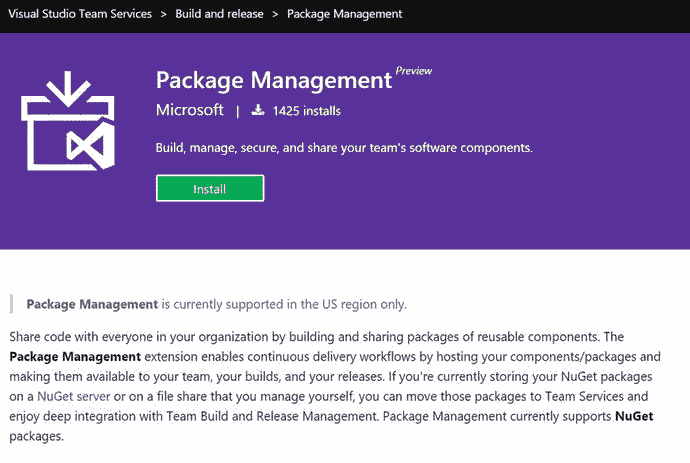
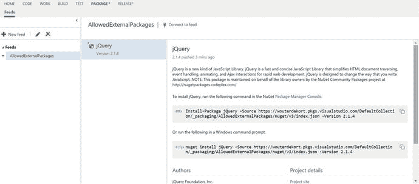

# 十、创建和共享包

您在项目中经常使用多少第三方软件包？像 jQuery、Twitter Bootstrap、AngularJS 和 NHibernate 这样的包非常受欢迎，它们来自各种第三方开发者和公司。微软正在为自己的项目使用越来越多的开源软件。ASP.NET MVC、Web API、Roslyn、Entity Framework 以及 Visual Studio Team Services 的各种扩展和实用程序是微软在 GitHub 上托管的一些项目。当然，您可能有自己的一些项目，您可以重用这些项目，或者与组织内的其他项目共享。但是，如何跟踪所有这些共享组件呢？能够共享代码和使用第三方组件，但仍然有一种有效的方法来管理您使用的包，最好的方法是什么？这就是本章的内容。您将了解 VS Team Services 提供的包管理特性。您将使用这些功能创建自己的包并与您的团队共享。

## 什么是包？

首先，讨论什么是包以及包目前是如何分发的是很重要的。以 jQuery 为例，它是一个非常受 web 开发人员欢迎的库。如果你去 [`http://jquery.com`](http://jquery.com/) ，你会看到一个大的下载 jQuery 按钮，在那里你可以明显地下载两个不同的版本(见图 [10-1](#Fig1) )。如果您查看可以下载的包列表，您可以在 jQuery 1.x 和 2.x 的压缩、未压缩和映射文件之间进行选择，您知道您需要哪一个吗？如果您有一些使用 JavaScript 库的经验，您可能想要这三个库！压缩版本用于生产，未压缩版本用于开发，映射文件用于将压缩版本映射到未压缩版本。


图 10-1。

You can download jQuery from the jQuery web site

如果您下载未压缩的版本，您会得到一个名为`jquery-1-11.3`的文件(至少对于这个版本是这样)。现在，如果您想使用这个 JavaScript 文件，您可能会将它复制到 web 应用的`scripts`文件夹中，并在运行时从 HTML 文件中引用它来加载它。jQuery 的一个优点是它没有任何依赖性。这使得下载和包含这个文件变得很容易。但是假设你想使用一个有依赖关系的包。例如，bootstrap 依赖于 jQuery 是否可用。单独下载所有这些文件并将它们放在正确的位置是可行的，但是当您的项目变得更大时，您会发现它会很快崩溃。

幸运的是，有一种更简单的方法来处理包。程序包管理器允许您安装程序包及其依赖项，而无需手动访问它们的网站来下载文件并将其放入您的项目中。最好用一个例子来解释。NuGet 是一个包管理器，在。NET 项目来分发包。假设您想将`EntityFramework`添加到新项目中。如果在 Visual Studio 中打开空项目，可以通过转到工具➤ NuGet 包管理器➤管理解决方案的 NuGet 包来查看 NuGet 包管理器。这将打开如图 [10-2](#Fig2) 所示的页面。


图 10-2。

The NuGet Package Manager in Visual Studio

可以看到，最上面的包是`EntityFramework`。如果您选择您的项目并点击 Install，那么`EntityFramework`的二进制文件就会下载到您的项目中，并进行配置更改。如果您在解决方案资源管理器中查看它，您会看到添加了一个`App.config`文件(如果您正在构建一个 Web 项目，则为`Web.config`),内容如下:

```
<?xml version="1.0" encoding="utf-8"?>
<configuration>
  <configSections>
    <!-- For more information on Entity Framework configuration, visit http://go.microsoft.com/fwlink/?LinkID=237468 -->
    <section name="entityFramework" type="System.Data.Entity.Internal.ConfigFile.EntityFrameworkSection, EntityFramework, Version=6.0.0.0, Culture=neutral, PublicKeyToken=b77a5c561934e089" requirePermission="false" />

  </configSections>
  <entityFramework>
    <defaultConnectionFactory type="System.Data.Entity.Infrastructure.LocalDbConnectionFactory, EntityFramework">
      <parameters>
        <parameter value="mssqllocaldb" />
      </parameters>
    </defaultConnectionFactory>
    <providers>
      <provider invariantName="System.Data.SqlClient" type="System.Data.Entity.SqlServer.SqlProviderServices, EntityFramework.SqlServer" />
    </providers>
  </entityFramework>
</configuration>

```

添加了一个新的 configSection，它将`EntityFramework`配置为使用您的`localdb`(随 Visual Studio 一起安装的 SQL Server 的开发版本)。因为起始项目是空的，所以配置文件添加了新的内容。如果你已经有了一个`config`文件，NuGet 足够聪明，可以添加新的修改，而不会完全覆盖你的设置。除了配置设置，还增加了两个参考:`EntityFramework`和`EntityFramework.SqlServer`。如果您检查这两个引用的属性，您会看到它们指向存储在您的`Solution`文件夹中的`packages`文件夹。图 [10-3](#Fig3) 显示了您安装的`EntityFramework`包的文件树。在根目录中，有一个扩展名为`nupkg`的文件。这是复制到您的解决方案中的实际 NuGet 包。如果您将扩展名更改为。zip，您可以将该文件作为普通的 ZIP 文件打开。它包含`content`、`lib`和`tools`文件夹以及描述内容和如何安装软件包的元数据文件。`content`文件夹包含两个转换文件。这些文件包含更新或创建应用或 web 配置文件的逻辑。如果你的目标是,`lib`文件夹包含所需的 dll。NET 4.0 或。净 4.5。最后，`tools`文件夹包含一组脚本和可执行文件，用于第一次安装`EntityFramework`和以后使用它。


图 10-3。

The files copied to your solution when you install the EntityFramework package

正如你所看到的，一个 NuGet 包不仅仅是你手动下载的一些 dll。这是一组关于如何将文件添加到您的项目甚至配置它的说明。但是这个包从哪里来呢？

如果你回头看图 [10-2](#Fig2) ，你会在右上角看到一个名为 Package Source 的下拉菜单。默认可以选择`nuget.org`或者微软和. NET，这些包源指向一个 URL。例如，`nuget.org`指向 [`https://api.nuget.org/v3/index.json`](https://api.nuget.org/v3/index.json) 。如果您在浏览器中打开这个 URL，您将得到一个 JSON 对象，它定义了可以用来查询 NuGet 的其他 URL，并在您按名称搜索包时提供自动完成搜索的功能。访问 [`https://api-v3search-0.nuget.org/query`](https://api-v3search-0.nuget.org/query) 会返回一个大型 JSON 对象，其中包含可用包的信息。当您在 Visual Studio 中使用 NuGet 包管理器时，这些数据可以很好地显示出来。这些包裹怎么会出现在 NuGet 上？有人花时间构建了您在`EntityFramework`示例中看到的`nupkg`文件，然后将这个包上传到 NuGet。NuGet 对所有人都是公开的。您可以自由创建一个帐户，然后使用您的凭据上传您自己的软件包。然后，您和其他人可以使用这些包。

如果您不希望每个人都可以免费使用您的包，您可以使用 VS Team Services 的包管理特性来托管您自己的提要。然后，您可以将包添加到此提要中，只有具有正确 URL 和凭据的人才能连接到此提要并下载包。这意味着您可以使用包管理在您的组织内分发共享组件。您不再需要将它们存储在网络共享或版本控制系统中。相反，VS 团队服务为您提供了一个安全的集中位置来管理包。

如果您想限制某些包的使用，也可以使用这种方法。以所谓的左版权许可发布的软件为例。强版权许可允许您自由使用某些软件，然后要求您的产品使用相同的许可并作为开源发布。如果您在不知情的情况下使用了带有 copyleft 许可的组件，您仍然需要开源您的产品。有些情况下这没问题，但是如果你不愿意开源你的知识产权，注意你使用的软件包是有意义的。安全问题也是如此。开源软件包并非没有风险。一些软件包有漏洞，这些漏洞有时会在以后的版本中被修复，或者还没有被修复。将软件包的使用限制在一个好的、已知的集合可以消除这些问题。您可以限制开发人员只使用内部的托管提要，而不是使用像 NuGet 这样的公共包提要。如果开发人员需要一个内部 feed 上没有的新包，他们可以请求添加这个包，这允许您验证新包的许可结构和安全性。

到目前为止，我们一直把 NuGet 看作是一个流行的包管理器的例子。但是 NuGet 并不是包的唯一来源。例如，在第 9 章中创建定制构建任务时，您使用了一个叫做 npm:节点包管理器的东西。Node.js 是一个 JavaScript 运行时，可以运行您的服务器端 JavaScript 代码。Node.js 包生态系统允许你安装成千上万的包。npm 专注于服务器端框架，Bower 是另一个专注于客户端库的包管理器。在 ASP.NET MVC 5 应用中，鲍尔、NPM 和努杰都被用作包管理器。如果您基于 Web 应用模板创建一个新的 ASP.NET MVC 5 应用，您会得到一系列文件，如图 [10-4](#Fig4) 所示(确保选择显示所有文件)。`references`文件夹不再包含对单个 dll 的引用，而是包含对 NuGet 包的引用。文件`bower.json`包含了您想要使用的所有 Bower 包的列表，而`package.json`引用了所有的 npm 包。这些其他的包管理器具有与 NuGet 相似的功能；他们只是有不同的使用场景。


图 10-4。

An ASP.NET MVC application uses Package Management for all its references

现在您已经知道了什么是包，以及在。NET 生态系统，您可以深入了解 VS Team Services 提供给您的包管理特性。

Note

创建 NuGet 包超出了本书的范围。如果你想知道如何创建自己的包，你可以看看 [`http://docs.nuget.org/create`](http://docs.nuget.org/create) 了解更多信息

## Visual Studio Team Services 的包管理

微软将软件包管理作为一个扩展提供，您可以将其安装到您的帐户中。如果您导航到 [`https://marketplace.visualstudio.com/#VSTS`](https://marketplace.visualstudio.com/#VSTS) 的市场，您会看到 VS 团队服务可用的扩展列表。然后你可以导航到包管理(见图 [10-5](#Fig5) )并选择安装将扩展添加到你的帐户。



图 10-5。

You can find the Package Management extension at the marketplace

包管理是一个扩展，安装在全球一级为您的整个帐户。您可以通过导航到一个团队项目并选择 Packages hub 来访问它。如图 [10-6](#Fig6) 所示，包管理是基于 feeds 的。提要是您可以与组织中的团队共享的包的集合。您可以在提要上设置安全权限，以允许人们阅读和贡献包。要创建提要，只需点击图 [10-6](#Fig6) 中所示的绿色+图标。要创建订阅源，请输入名称、描述和权限设置。


图 10-6。

Package Management is added as a hub to your account

一个提要有三个访问级别。作为所有者，您可以重命名和删除您的订阅源。贡献者可以向提要添加包，读者可以使用提要的包。默认情况下，您的 Team Build 帐户也被添加为参与者。这允许您自动添加在自动构建过程中创建的包，并将它们分发给您的团队。

当您创建新的 feed 时，Package Management 会向您显示开始使用新 feed 的重要步骤列表(参见图 [10-7](#Fig7) )。例如，您可以从`nuget.org`获得 jQuery 包，并将其添加到名为`AllowedExternalPackages`的新提要中。当您将页面顶部显示的工具切换到 NuGet 3.x 时，您会看到一步一步的说明。首先，你需要从 [`http://nuget.org`](http://nuget.org/) 下载`nuget.exe`，打开一个命令行，指向你的`nuget.exe`文件的位置。然后点击生成 NuGet 凭证。这为您提供了一个可以复制/粘贴到命令行中的命令。这个命令看起来像这样:


图 10-7。

You can start by adding packages to your new, empty feed

```
nuget sources add -name "AllowedExternalPackages" -source https://<youraccount>.pkgs.visualstudio.com/DefaultCollection/_packaging/AllowedExternalPackages/nuget/v3/index.json -username "...." -password "..."

```

运行该命令后，`AllowedExternalPackages`提要作为包源被添加到您的全局 NuGet 配置中。您现在可以测试一下，首先从`NuGet.org`下载一个包，然后通过运行以下命令将它上传到您自己的内部:

```
nuget install jQuery
nuget push jQuery.2.1.4\jQuery.2.1.4.nupkg -Source https://<youraccount>.pkgs.visualstudio.com/DefaultCollection/_packaging/AllowedExternalPackages/nuget/v3/index.json -ApiKey VSTS

```

第一个命令从`NuGet.org`下载 jQuery 包。jQuery 包安装在当前路径的子文件夹中。然后用第二个命令将 jQuery 的`nupkg`包添加到您自己的提要中。

如果您现在导航到 VS Team Services 中的包管理，您会看到带有 jQuery 包的新提要，如图 [10-8](#Fig8) 所示。如您所见，不仅列出了软件包的名称，还列出了关于如何安装软件包的描述和说明。这些信息包含在您刚刚推送到提要的 jQuery `nupkg`包中。



图 10-8。

The jQuery package is now added to your AllowedExternalPackages feed

大多数时候你不想从命令行使用 NuGet。相反，您希望在 Visual Studio 中使用提要。如果打开 Visual Studio，导航到工具➤选项➤ NuGet 包管理器➤包源，可以添加新的包源，如图 [10-9](#Fig9) 所示。如果您使用前面的命令行命令添加包源，那么您的新提要已经显示在 Package Sources 窗口中。如果没有，您可以通过选择绿色+图标并输入您的软件包源的名称和 URL 来添加它。


图 10-9。

You can configure package sources in Visual Studio

您也可以通过取消选中来禁用软件包源。这允许您禁用`NuGet.org`作为包源，只使用您自己的内部提要作为包源。为团队中的每个开发人员配置这个可能会有问题。如果有人忘记禁用 NuGet.org 软件包源，他们可以很容易地安装未经您的组织验证的软件包。如果您想强制所有开发人员使用这个配置，有一个 NuGet 包可以帮助您一次性配置您的解决方案，然后让它自动应用到使用该解决方案的所有开发人员。

如果您打开一个 PowerShell 会话并将其指向项目的根目录，您可以运行以下命令来初始化 NuGet 配置:

```
Invoke-WebRequest https://dist.nuget.org/win-x86-commandline/latest/nuget.exe -OutFile nuget.exe
.\nuget.exe install -OutputDirectory packages Microsoft.VisualStudio.Services.NuGet.Bootstrap
.\packages\Microsoft.VisualStudio.Services.NuGet.Bootstrap.*\tools\Bootstrap.ps1
rm .\NuGet.exe

```

第一个命令是下载`NuGet.exe`并将其存储在工作文件夹中的简单方法。第二个命令下载`Microsoft.VisualStudio.Services.NuGet.Bootstrap`包并将其存储在当前位置下的 packages 文件夹中。作为这个包的一部分，您将获得一个引导 PowerShell 脚本来初始化您的环境。运行这个文件后，您会得到一个`nuget.config`文件和一个 init PowerShell 文件。要初始化开发人员的环境，您需要运行 init PowerShell 文件。这将下载最新的 NuGet 工具并配置身份验证。`nuget.config`文件包含您想要在项目中使用的包源:

```
<?xml version="1.0" encoding="utf-8"?>
<configuration>
  <config>
    <clear />
    <add key="repositoryPath" value="packages" />
  </config>
  <packageSources>
    <!-- When <clear /> is present, previously defined sources are ignored -->
    <!-- Remove this tag or un-comment the nuget.org source below to restore packages from nuget.org -->
    <!-- For more info, see https://docs.nuget.org/consume/nuget-config-file -->
    <clear />
    <!-- Intentionally v2, as v3 doesn't yet support list which is used by Update-Environment.ps1 -->
    <add key="vss-package-management" value="https://www.myget.org/F/vss-package-management/api/v2" />
    <!-- <add key="nuget.org" value="https://api.nuget.org/v3/index.json" /> -->
  </packageSources>
  <activePackageSource>
    <add key="All" value="(Aggregate source)" />
  </activePackageSource>
</configuration>

```

您可以将托管在 VS Team Services(或其他位置)上的您自己的提要添加到这个文件中，方法是复制行`<add key="..." value="..." />`并将键设置为您的提要的名称，将值设置为您从 Web Access 复制的 URL。当为这样配置的项目运行 VS Team Services 构建时，将 NuGet 安装程序任务(参见图 [10-10](#Fig10) )添加到您的构建定义中是很重要的。您用您的`nuget.config`文件的路径配置这个任务。NuGet Installer 任务负责从正确的软件包源下载您的软件包。


图 10-10。

The NuGet Installer task makes sure that your build knows where to find your packages

将包添加到提要的一种常用方法是 Team Build。这允许您编译您的项目并自动将包添加到提要中。为了帮助你，有两个现成的软件包:NuGet Packager 和 NuGet Publisher(见图 [10-11](#Fig11) )。


图 10-11。

Use the NuGet Packager and NuGet Publisher tasks to publish your packages

打包程序任务搜索存储库中的所有`nuspec`文件，并为这些文件创建 NuGet 包。当您将发布任务指向一个内部提要时，您只需输入要将包发布到的提要的 URL。

目前包管理只支持 NuGet 包。在未来的版本中，包管理也将支持 NPM 和 Maven。总体思路会保持不变；您将能够为其他包类型添加提要，并在您的项目中使用它们。

## 摘要

拥有一个共享第三方和内部组件的简单方法是迈向 DevOps 的重要一步。VS 团队服务包管理帮助您托管自己的提要，并在您的项目中使用它们。您可以轻松地添加现有的 NuGet 包，或者将您自己的包添加到您的提要中。然后可以引导开发人员环境，确保所有开发人员都使用这些提要。您还可以将包管理与您的构建相集成。您可以在运行构建时安装包，并创建和发布包到您的提要。

在下一章中，您将看到作为 VS 团队服务一部分的广泛的测试能力。