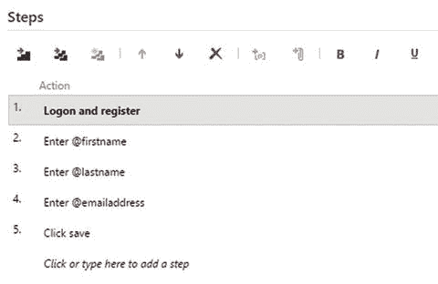
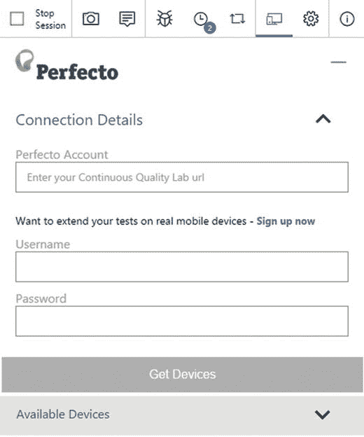
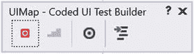

# 十一、将测试人员集成到DevOps中

测试是 DevOps 的关键部分。当转移到持续交付时，您不希望优化您的过程来更快地交付 bug。你希望尽可能快地发布高质量的特性。这意味着在 DevOps 过程中，不存在所有开发都停止的长期稳定阶段。相反，测试人员和开发人员一起工作。本章详细介绍了测试人员如何通过使用 Visual Studio Team Services 的特定测试功能来最有效地工作。您将首先研究手动测试，然后探索自动化测试的主题。

## 通过 Web 访问进行手动测试

除了开发人员和其他利益相关者，测试人员在 Web 访问中也有专门的位置。测试中心是测试人员花费大部分时间的地方。在测试中心，测试人员可以创建和运行测试，并跟踪他们的总体进度。图 [11-1](#Fig1) 显示了一个空项目的测试中心。


图 11-1。

The Test hub is a part of VS Team Services Web Access

测试是以层次结构组织的。在最高层次上，您使用一个测试计划。我经常看到团队为他们的每个 sprint 创建一个新的测试计划(如果他们使用 Scrum 的话)。当从一个 sprint 到另一个 sprint 时，他们克隆他们的测试计划，然后修改它以适应新的 sprint 的需求。其他团队将他们的测试计划映射到发布或者其他对他们的项目有意义的模式。在一个测试计划中，你有测试套件。测试套件是测试用例的容器。单个测试用例是您指定您想要测试什么和您期望什么的地方。您可以将这些测试用例分组为静态套件、基于需求的套件和基于查询的套件。

静态套件顾名思义就是:测试用例的静态集合，只有当你改变它时才会改变。基于需求的套件将您的测试用例链接到您的待办事项列表中的特定项目。这种关系允许您查看哪些测试用例被分组到一个产品 backlog 项下，并使用测试用例的结果来确定 PBI 的状态。基于查询的套件自动包含满足查询的所有测试用例。

图 [11-2](#Fig2) 显示了一个平面图下的三种套房。第一个套件是基于需求的套件，指向 ID 为 261 的 PBI。第二个是基于查询的套件，它过滤优先级为 1 的测试用例，回归测试是一个静态套件。静态套件也可以用于对其他套件进行分组。


图 11-2。

A test plan groups test suites and a static test suite can group other suites Note

测试用例资源管理器扩展( [`https://marketplace.visualstudio.com/items?itemName=ms-devlabs.TestCaseExplorer`](https://marketplace.visualstudio.com/items?itemName=ms-devlabs.TestCaseExplorer) )使得当你有很多测试用例时，管理它们变得更加容易。

创建这种结构很容易。您可以使用绿色+图标来创建新项目。您首先必须从一个测试计划开始。然后，您可以添加子项，甚至可以根据需要创建更多嵌套项。然后，您开始向基于需求或静态测试套件添加测试用例。图 [11-3](#Fig3) 显示了一个测试用例。正如其他工作项一样，您可以设置标题和状态。Assigned To 字段指向负责维护测试用例的人。被指派执行测试用例的测试人员是从包含测试用例的套件中指派的。这种分离允许您让一个人负责维护测试，让其他人负责实际运行测试。你也可以添加标签，并有一个讨论区。一个测试用例的独特之处在于步骤和标签，就像相关的自动化一样。


图 11-3。

A test case in VS Team Services Web Access

测试步骤是测试用例的核心。这是你描述一个测试人员应该做什么和期望什么结果的地方。例如，图 [11-3](#Fig3) 显示了一系列步骤，让用户导航到测试中心，创建测试计划和静态测试套件，然后检查绿色+图标是否可用于静态套件以创建测试用例。如果这些步骤中的一个失败了，或者如果预期的结果失败了，测试人员将测试用例标记为失败，并记录一个 bug。运行测试用例也可以通过 Web 访问来完成。一旦你设计了一个测试用例并将其状态设置为 Ready，你可以从测试中心的工具栏中选择 Run 按钮，如图 [11-4](#Fig4) 所示。


图 11-4。

The toolbar lets you run a test and change the test outcome

当您从 Web Access 运行一个测试用例时(在本章的后面您将会看到专用的微软测试管理器客户端)，您会看到如图 [11-5](#Fig5) 所示的测试运行器。这个测试运行器是一个单独的弹出窗口，在执行所示步骤时，您可以将它放在屏幕上的某个位置。当然，您测试的应用不一定要在您自己的 PC 上运行。如果你使用一个独立的设备，比如平板电脑或手机，你仍然可以跟踪测试进程，并记录任何潜在的错误。如果您单击按钮创建一个新的 bug，您将导航到一个新 bug 的详细信息。您采取的导致 bug 的步骤是从测试运行程序和测试用例中复制的，并且这个特定的测试结果被附加到新的 bug 中。这使得开发人员更容易重现错误。


图 11-5。

The Test Runner window

测试用例的另一个特性是添加参数的能力。假设您正在测试 web 应用的注册表单。用户需要输入他们的姓名和联系方式，并且您希望确保您的验证正确地报告无效的电子邮件地址或缺少的字段。您可以创建单独的测试用例，重复相同的一系列步骤，但是对于特定的字段使用不同的值，但是这不是非常易于维护的。相反，您可以添加一个测试用例，然后指定不同的值行来运行测试。您可以在测试步骤中使用`@`符号来创建一个参数。因此,`Enter @firstname`行增加了一个名为`firstname`的新参数。这些参数以网格的形式列在步骤的底部。图 [11-6](#Fig6) 显示了一个这样的例子。


图 11-6。

You can use parameters to create multiple data sets for your test case

当您运行您的测试用例时，测试运行器知道您创建了多少行，并显示每个单独字段的值。正如您在图 [11-7](#Fig7) 中看到的，测试运行程序让您浏览第一行测试数据。顶部的迭代字段显示了您当前正在使用的测试行。您可以使用“上一个”和“下一个”按钮导航到其他迭代。当您提交 bug 时，您正在测试的行的参数会添加到 bug 中。


图 11-7。

You can run test cases with multiple sets of data

正如您可能预测的那样，当您有多个测试用例时，对于每个测试用例，有些步骤是相同的。例如，打开浏览器，导航到您的应用，并登录是每个测试用例必须采取的必要步骤。为了帮助您做到这一点，您可以创建共享步骤。共享步骤是一组命名的步骤，您可以将其插入到其他测试用例中。如果您随后对您的共享步骤进行了更改，那么它会在所有使用该共享步骤的测试用例中发生更改。您可以使用测试用例细节中步骤区域上方的工具栏来创建和插入共享步骤，如图 [11-8](#Fig8) 所示。除了共享步骤，您还可以创建共享参数(参见图 [11-6](#Fig6) 的底部)。这些参数集可以通过 Web 访问进行编辑，并在不同的测试用例之间共享。



图 11-8。

The Steps toolbar allows you to create and insert shared steps

您现在知道了如何创建和运行测试用例。您可以将与测试用例相关的 bug 归档，并将您的用例组织成套件。如果你后退一步，你可能会怀疑在每个新特性的开始创建一堆测试用例是否是正确的做法。在快速发展的 DevOps 过程中，你不能花太多时间为应用的每个部分创建测试用例。相反，您希望与应用一起工作，并查明需要用手动(或自动化)测试覆盖的区域。这就是探索性测试的用武之地。当你进行探索性测试时，你不需要从预先定义的测试用例开始。相反，您只需浏览应用，同时跟踪您所采取的步骤。如果你发现一个问题，你可以创建一个新的 bug，甚至创建一个测试用例，这样你就可以确保这个缺陷不再出现。

探索性测试会话可以从 Microsoft 测试管理器客户端或从您的浏览器中启动。为此，您需要安装一个特殊的扩展。这里的起点是 Visual Studio Marketplace 中的探索性测试扩展: [`https://marketplace.visualstudio.com/items/ms.vss-exploratorytesting-web`](https://marketplace.visualstudio.com/items/ms.vss-exploratorytesting-web) 。点击 install 进入 Chrome 网上商店(其他浏览器访问即将开始)。安装扩展后，您可以在浏览器中启动它(参见图 [11-9](#Fig9) )。您首先需要决定是要连接到 VS Team Services 帐户(或本地 Team Foundation Server)还是以独立模式运行。连接模式允许您使用此扩展的全部功能。


图 11-9。

You can do exploratory testing with the extension for Chrome

一旦连接，您开始一个新的会话。在会话运行时，您可以添加注释和屏幕截图。时间线显示你已经采取的步骤(见图 [11-10](#Fig10) )。然后，您可以记录一个 bug(或创建一个任务),注释和屏幕截图会自动添加到 bug 中，同时还会添加关于您正在运行的系统的信息，如浏览器、语言、维度、操作系统和硬件功能。您还可以选择一个您想要进行一些探索性测试的产品待办事项。如果选择了 PBI，您创建的任何项目都将自动链接到 PBI。


图 11-10。

The timeline keeps track of the notes and screenshots you make during your session

如果你想在其他设备上测试你的网络应用，你可以使用 Perfecto 提供的服务。Perfecto 提供了在多种设备上运行测试的解决方案。为此，他们提供了自己的设备集合，但您也可以连接自己的设备。您可以在一个设备上手动运行测试，或者自动执行这些步骤，让它们在许多设备上运行。探索性测试插件可以连接到 Perfecto，从而允许您选择想要测试的设备，并直接在 VS Team Services 中报告任何错误(参见图 [11-11](#Fig11) )。



图 11-11。

You can connect to Perfecto if you want to test on multiple devices

当运行您的测试时，您当然想要跟踪您的不同测试套件和测试用例的进度。为了帮助你做到这一点，你可以创建图表。您可以从测试中心查看这些图表，也可以将它们固定到您团队的仪表板上。默认情况下，您会得到一个饼图，显示您计划中不同测试用例的结果(参见图 [11-12](#Fig12) )。您可以创建图表来显示您的测试用例的状态(设计、就绪或关闭)、分配给单个测试人员的用例数量、您的每个套件中的测试状态以及许多其他场景(您可以在第 [6](06.html) 章中找到关于如何创建图表的更多信息，该章涵盖了仪表板和报告)。您还可以通过转到测试中心的 runs 选项卡来查看测试运行的历史记录。这使您可以很容易地看到哪些测试需要注意或者已经成功完成。


图 11-12。

You can create charts to track your test’s status

关于手动测试，Web Access 中的测试中心到此结束。在关于自动化的部分，你将返回到 Web 访问，但是首先你将学习微软测试管理器。

Note

微软 ALM Rangers 发布了很棒的测试指南，你可以在 [`https://vsartestreleaseguide.codeplex.com/`](https://vsartestreleaseguide.codeplex.com/) 找到。这个指南将帮助你计划和运行你的测试。

## Microsoft 测试管理器

正如开发人员使用他们喜欢的 IDE，比如 Visual Studio 或 Eclipse，测试人员也有他们自己的软件。测试中心的手动测试的补充是微软测试管理器。如果您运行的是 Visual Studio Enterprise，您就已经可以访问 MTM 了。对于测试人员来说，有一个单独的 MSDN 订阅——测试专业版——它给了他们访问 MTM 的权限。第一次启动 MTM 时，系统会要求您登录 VS Team Services 帐户，并选择您正在处理的项目。如果你看一下图 [11-13](#Fig13) ，很多东西看起来和你在 Web Access 测试中心看到的很相似。您会看到您当前的测试计划和三个测试套件。您还可以在基于查询的套件中看到高优先级测试用例。微软正在努力扩展 Web Access，使其等同于微软测试管理器。像共享参数这样的功能仅在 Web Access 中可用。但是还有其他一些 MTM 独有的特征，这就是你在这一部分要探索的。


图 11-13。

Microsoft Test Manager is the standalone client for testers

最大的区别在于，你使用的是一个真正的桌面应用，可以与你电脑上的每个程序进行交互。这意味着当你运行一个测试用例时，MTM 可以跟踪你在做什么，并记录你所有的鼠标点击和键盘按键。当从 Web Access 运行测试时，您会得到一个浏览器弹出窗口，它与您的操作系统没有这种复杂的关系。这是运行跨平台测试或在平板电脑和手机等设备上测试的理想选择。当使用 Windows 时，MTM 测试运行程序有更多的功能。如果你看图 [11-14](#Fig14) ，你会看到第一次装载时的 MTM 测试车。测试运行程序停靠在屏幕的一侧，并自动将其他应用放置在它旁边。如果您点击 Start Test，您会看到测试用例中的测试步骤。就像 Web 测试运行器一样，您可以将每个测试标记为通过(使用 Win+Ctrl+Q)或失败(使用 Win+Ctrl+W)。您可以添加截图和创建 bug，就像您在 Web Test Runner 中看到的那样。


图 11-14。

The Test Runner launched from MTM

图 [11-14](#Fig14) 中显示的 Create Action Recording 复选框是 Web 测试运行器中还没有的。当你运行一个测试用例时，MTM 会跟踪你的行为。如果你启动一个程序，输入一些文本，或者用鼠标点击某个地方，这些都会被记录下来。一旦动作录制完成，你可以让 MTM 为你重放动作。例如，您有一个包含许多字段的注册表单。您有一个包含多行参数的测试用例。手动运行这个测试用例意味着您必须在正确的字段中输入每个参数，然后验证结果。

使用动作录制，您可以录制打开注册页面的步骤，并录制一行输入到正确字段中的数据。MTM 会记录所有这些，下次跑步时，你可以快速前进。这是你必须看到的东西，看看这个功能有多棒。我想鼓励你启动 MTM，创建一个简单的测试用例，包括导航到 [`http://visualstudio.com`](http://visualstudio.com/) ，在搜索框中输入一个值，然后关闭浏览器的步骤。记录下你的动作后，你会看到类似图 [11-15](#Fig15) 的东西。


图 11-15。

A test case with an action recording can automate manual steps

现在您有了一个播放按钮，可以用来自动重放记录的动作。在步骤 3 中，需要一些手动验证，以便步骤总是暂停并要求您确认。这是我有时看到出错的地方。测试人员通常被训练为对他们采取的每一个行动都有一个预期的结果。如果他们将同样的过程应用于 MTM 测试案例，你不能快进，因为 MTM 会在每一步停下来问结果是否有效。只有在为您的测试提供真正价值的步骤上才有预期的结果，这允许您更好地利用动作记录。如果步骤 1 和 2 在多个测试用例中使用，您可以为它们创建一个共享的步骤，甚至是一个共享的操作记录。这样，你就可以一直快进最初的步骤，以达到你真正想要达到的状态。使用动作记录离真正的自动化测试还很远，但是它可以帮助测试人员更有效地工作。

当您从 MTM 运行探索性测试会话时，也可以使用这种记录技术。如果你去 MTM 的测试菜单，你会看到做探索性测试选项。图 [11-16](#Fig16) 显示了在探索阶段创建的 bug 的重现步骤。如你所见，MTM 跟踪你所有的脚步。鼠标点击甚至附有小截图！这使得复制 bug 更加容易。测试人员不必担心记录他是如何在特定状态下结束的。这是自动记录的。当您的探索性测试会话需要一些时间时，您可以编辑这些步骤，以确保您只包括相关的步骤，方法是选择重现步骤列表顶部的更改步骤。


图 11-16。

The repro steps recorded for a new bug

在你完成配置你的新 bug 之后，你可以创建 bug 或者你可以创建一个 bug 和一个新的测试用例，这样你就可以跟踪这个 bug 并确保它不再出现。当您创建一个测试用例时，您可以使用 MTM 中的 Verify Bugs 选项来检查是否可以关闭一个打开的 bug。

运行测试时，会收集数据。您已经看到了如何记录动作，以及如何将系统信息添加到 bug 中。您可以使用 MTM 记录更多信息。如果你看图 [11-17](#Fig17) ，你会看到你的测试计划的运行设置。对于手工和自动化测试，有一个默认的计划。此计划捕获操作记录和系统信息。您还可以记录代码覆盖率、系统事件日志、IntelliTrace、屏幕和语音记录、测试影响和 ASP.NET 客户端代理数据。


图 11-17。

Through run settings, you can configure data to collect while running your test

Test Impact 和 IntelliTrace 是我个人的最爱。使用测试影响，MTM 可以帮助您跟踪不同版本的应用之间发生了什么变化。MTM 还跟踪哪些测试用例触及了代码库的哪个部分。如果一些代码发生了变化，MTM 建议你运行测试用例来测试那部分代码。这并没有让你放弃运行一组好的回归测试，但是它确实帮助你首先运行最高优先级的测试。IntelliTrace 就像是您代码的 TiVo。在收集 IntelliTrace 数据时，MTM 会准确记录代码中发生的事情——调用了哪些方法，使用了哪些参数，以及从外部调用(例如，SQL 查询)返回了什么。然后，您可以使用 IntelliTrace 日志文件在事后调试问题。如果您运行的应用具有多个层(例如客户端、数据库和 web 服务器)，那么在这些额外的机器上跟踪事件日志和 IntelliTrace 数据是有意义的。

在图 [11-17](#Fig17) 的右下角，您还可以看到一个配置设置。配置是一个简单的选择列表，您可以通过 MTM 的组织中心进行编辑。配置可以是操作系统和浏览器版本等设置的组合。当您为您的测试用例选择多个配置时，MTM 会自动让您为每个配置运行测试用例。

我非常喜欢微软测试管理器。然而，我也知道很多组织并没有意识到 MTM 的可能性。如果你在这样的组织中，试着体验一下 MTM，尤其是数据记录和动作记录功能。看看这些是否能增加价值，然后在你自己的组织中做一个布道者！在下一部分中，您将会看到不同形式的测试自动化。

## 自动化测试

自动化测试是 DevOps 成功实现的关键。让运维部门担心来自开发人员的所有变更是很自然的。对这些感觉做点什么是强制性的。不仅运维部门会高兴，您的利益相关者也会高兴。自动化测试有多种风格。在关于管理技术债务的第 8 章中，你看到了单元测试以及单元测试、集成测试和场景测试之间的区别。单元测试和集成测试是用代码和应用的练习部分编写的，但不涉及用户界面。场景测试确实触及了用户界面，这也是你接下来要关注的。

Visual Studio 提供了一个用于创建 UI 测试的框架，称为编码 UI。编码的 UI 允许您测试客户端和 web 应用。您可以通过记录要采取的步骤，然后生成执行这些步骤的代码来创建编码的 UI 测试。您还可以添加检查 UI 并验证结果的断言。例如，你可以用一个简单的计算器将两个数相加。你要输入这两个数字，点击加法按钮，然后验证加法的结果是否正确。

若要使用编码的 UI 测试，您需要有 Visual Studio Enterprise。然后，您可以创建一个编码的 UI 测试项目，并使用它来记录和修改测试。当创建一个新项目时，系统会询问您是想通过记录一个新的测试来开始，还是想使用一个现有的动作记录(见图 [11-18](#Fig18) )。这里你可以看到手工和自动化测试之间的联系。如果一个测试人员有一个好的手动测试记录，他可以和开发人员坐下来，然后完全自动化测试。


图 11-18。

You can create new Coded UI tests by recording your steps or by using an action recording that was made earlier

如果您选择从一个新的记录中创建一个新的测试，编码的 UI 测试构建器将被加载(见图 [11-19](#Fig19) )。这个工具栏允许您开始和暂停记录，检查您的步骤，并为您的测试生成代码。您还可以将控件添加到 UI 映射中。UI 映射是编码的 UI 用来组织测试期间与之交互的控件的结构。例如，文本字段、按钮、复选框和其他控件被添加到 UI 映射中。如果需要，您可以手动添加控件来验证值或其他设置。



图 11-19。

The Coded UI Test Builder helps you record your tests

图 [11-20](#Fig20) 显示了一个简单编码的 UI 测试记录的 UI 图。UI 图包含打开浏览器的步骤，转到 [`http://visualstudio.com`](http://visualstudio.com/) ，点击 Marketplace 链接，然后打开 GitHub for Visual Studio 扩展。这些步骤列在左侧面板中。


图 11-20。

The UI map shows the structure of the controls that are used in your test

在右边的面板中，您可以看到 UI 控制图。这些是我在记录这个测试时交互的控件。显示最后一个控件`UIGitHubExtensionforViImage`的属性。编码的 UI 通过查找控件的 id 以及搜索属性和窗口标题的组合来识别控件。例如，窗口标题集合包含 Visual Studio Marketplace 值，因为这是搜索 GitHub 徽标时浏览器的标题。搜索属性声明编码的 UI 应该查找图像。如果成功找到控件需要属性和其他搜索值，可以添加这些值。

为该测试生成的代码位于 UI 映射的代码隐藏文件中。开始测试的代码非常简单:

```
[TestMethod]
public void CodedUITestMethod1()
{
    this.UIMap.GoToGitHubExtension();
}

```

如果要修改`GoToGitHubExtension`方法，可以在图 [11-19](#Fig19) 所示的 UI 图中右键单击，选择将代码移动到一个名为`UIMap.cs`的文件中。然后您可以自由地修改代码，但是您不能再通过使用编码的 UI 测试构建器来更新它。生成的代码如下所示:

```
public void GoToGitHubExtension()
{
    #region Variable Declarations
    BrowserWindow bing = this.Bing;
    HtmlHyperlink uIMarketplaceHyperlink = this.Bing.UIVisualStudioMicrosofDocument
                                           .UIFragment_HeaderTocPane.UIMarketplaceHyperlink;
    HtmlImage uIGitHubExtensionforViImage = this.Bing.UIVisualStudioMarketplDocument
                                           .UIItem8Pane.UIGitHubExtensionforViImage;
    #endregion

    // Go to web page 'http://visualstudio.com/'
    bing.NavigateToUrl(new System.Uri(this.GoToGitHubExtensionParams.BingUrl));

    // Click 'Marketplace' link
    Mouse.Click(uIMarketplaceHyperlink, new Point(65, 32));

    // Click 'GitHub Extension for Visual Studio' image
    Mouse.Click(uIGitHubExtensionforViImage, new Point(57, 105));
}

```

您可以在第一个区域中看到如何使用 UI 映射来访问所需的控件。然后浏览器被指向正确的 URL，鼠标点击被模拟以导航到正确的位置。编码的 UI 测试不适合在 UI 仍在剧烈变化的应用部分使用。正如您所理解的，这段代码会变得非常脆弱，很难维护。然而，这并不意味着您不能为您的编码 UI 测试使用更易维护的代码。如果你看着 [`http://visualstudio.com`](http://visualstudio.com/) ，你看到了什么？你看到了`div` s、超链接、段落和输入控件吗？或者您是否看到了登录选项、带有导航选项的菜单以及带有其他选项的信息块？在单个 HTML(或 WPF)元素的层次上构建您的编码 UI 测试注定会失败。如果您有多个首先需要登录的测试，那么您可以使用如下方式:

```
browser.NavigateToUrl(new Uri(Params.VisualStudioUrl));
Mouse.Click(signinLink, new Point(65, 32));
// Enter username
// Enter password
// Click on Sign In

```

但是如果登录按钮移动到另一个位置呢？如果您决定使用双因素身份验证，该怎么办？您是否将这几行代码分布在所有测试中，或者您是否将它们封装在一个简单的`Signin`方法中？测试代码的质量应该和生产代码一样好。在记录之后，重构你编码的 UI 测试，使之抽象出单独的控件，并确保你的测试可以被很好地维护。许多团队在测试自动化方面失败了，因为他们没有足够重视他们的测试代码。当正确使用时，自动化测试会非常强大。

Note

在测试 web 应用时，也可以使用 Selenium ( [`http://www.seleniumhq.org/`](http://www.seleniumhq.org/) )代替编码 UI。Selenium 是测试浏览器应用的一个非常强大的工具，是您在构建复杂的 web 应用时应该研究的东西。

自动化测试的另一个重要部分是性能和负载测试。性能测试与应用的速度有关。负载测试帮助您确定有多少用户可以同时使用您的应用。您可以通过导航到 VS Team Services 项目的根目录并转到负载测试中心来非常容易地开始(图 [11-21](#Fig21) )。


图 11-21。

You can run load tests directly from VS Team Services

一个简单的负载测试要求您配置您在图 [11-22](#Fig22) 中看到的选项。首先，指定被测试应用的 URL。然后输入一个名称并选择一个位置。Location 是 Azure 数据中心之一，将用于模拟 URL 上的用户负载。如果您希望确保您的应用运行良好，您可能希望选择靠近用户的数据中心。如果您有全球性的服务，您可以创建多个负载测试，并让它们从不同的数据中心运行。


图 11-22。

A simple load test can be created in VS Team Services

在窗口的底部，您可以配置负载测试要做的事情。您可以选择用户数量和测试运行的时间。这两个值构成了您的虚拟用户分钟数，这也是您在 VS Team Services 上使用负载测试时需要支付的费用。幸运的是，您可以免费获得 20，000 分钟的虚拟用户时间来开始使用。您还可以配置思考时间。当你有 100 个用户查看你的 web 应用时，他们不会一直保持活跃。一个用户在使用你的网页的时候阅读一些东西，移动她的鼠标，并且输入一些东西。这需要一些时间，您可以通过指定思考时间来配置某些操作之间的延迟。您还可以通过配置浏览器分布来选择您的用户是使用 Google Chrome 还是 Internet Explorer，以及各自的百分比。

运行负载测试时，您会看到一个显示结果的漂亮图形。图 [11-23](#Fig23) 显示了使用图 [11-22](#Fig22) 中设置的示例图。您可以看到，在最初的 1:45 分钟内，没有报告任何错误。用户负载恒定在 100 个用户，平均请求时间为 0，而每秒请求数上升到 40。测试完成后，您会看到平均响应时间、发出的请求总数以及错误数量的摘要。


图 11-23。

While running your load test, you see a real-time graph with the results

你可能想知道这有多现实。您现在只点击了 web 应用的根 URL。缓存之类的东西会影响结果，尤其是因为您只使用一个代理和一个 IP 地址来运行测试。一个更真实的场景是点击网站的多个页面并模拟一个真实的用户。但是如果您没有任何负载测试，这是一个很好的起点。若要创建更复杂的负载测试，可以使用 Visual Studio Enterprise 创建基于云的负载测试。如果不使用云，这将需要您设置能够使用 Visual Studio Lab Management 之类的工具生成负载的机器。

使用基于云的负载测试，所有这些设置都由 VS Team Services 完成。您所要做的就是记录一个 web 测试，并将其发送到云端。首先，您需要创建一个 web 性能和负载测试项目。性能测试不同于编码的 UI 测试。编码的 UI 测试实际上是打开浏览器并与不同的元素进行交互，而负载测试只捕获客户端和 web 应用之间的 web 流量。然后，这个流量被扩展到多个并发用户，并针对您的 web 应用执行，以测试其性能。

首先创建一个 web 性能和负载测试项目。默认情况下，添加一个空的 web 测试。如果你看图 [11-24](#Fig24) 你会看到一个样本 web 测试。web 测试列出了对我在 Azure 上托管的示例网站的一系列请求。这是一个简单的 MVC 5 web 应用，没有任何修改。第一个要求是主页。这导致加载三种字体的三个额外请求。然后是对 About 页面的请求，最后是对 Contact 页面的请求。然后我导航回主页，得到最后四个请求。


图 11-24。

A web test is a recording of several HTTP requests

使用工具栏中的“添加记录”按钮是创建 web 测试的最简单方法。这将启动带有 Microsoft Web 测试记录器帮助程序插件的 Internet Explorer。这个记录器跟踪所有来自你的浏览器的 HTTP 流量。在图 [11-25](#Fig25) 中，您可以看到 Web 测试记录器处于活动状态。导航到 [`http://visualstudio.com`](http://visualstudio.com/) 生成第一个请求。其他请求在加载`visualstudio.com`主页时运行。如果您想从记录中排除某些步骤，可以暂停记录。你也可以在你的录音中添加评论，当然你也可以停止录音。一旦完成，Visual Studio 将解析您的请求并查找任何动态参数。动态参数是用户每次运行应用时重新生成的参数。这可以是会话 ID、存储在 cookies 中的值、隐藏字段(如 ASP.NET Web 窗体应用的 ASP.NET 视图状态)以及查询字符串或 post 参数。所有这些信息都由 Visual Studio 提取，并作为提取规则添加到 web 测试中。此规则配置 Visual Studio 如何获取参数值，以及您希望如何处理它。您还可以创建插件来与您的测试进行交互。例如，您可以过滤掉所有图像请求，修改请求和响应数据等。您可以轻松地在本地运行 web 测试，并查看它是否执行了正确的请求。


图 11-25。

The Web Test Recorder is an Internet Explorer add-on

一旦有了正常工作的 web 测试，就可以创建负载测试。负载测试采用一个或多个 web 测试，并使用您的本地 PC 或 VS Team Services 来运行负载测试。图 [11-26](#Fig26) 显示了创建新负载测试的向导。当使用 VS 团队服务时，您首先需要指定您的 VS 团队服务帐户。然后，该帐户用于负载测试，并按您生成的虚拟用户分钟数计费。然后输入要运行负载测试的位置。例如，如果我测试一个荷兰的网站，我会使用西欧的位置，因为它位于荷兰的阿姆斯特丹。运行设置指定测试应该运行多长时间，以及是否应该有一个预热期。可能是因为应用需要启动，缓存需要构建，所以对网站的第一个请求需要更长的时间。您可以通过选择一个准备期来从负载测试中排除这些结果。场景指定了您想要运行的测试类型。您想要一个恒定的用户负载(压力测试)还是想要每隔几秒钟增加一次用户计数？


图 11-26。

You can create a load test in Visual Studio

测试组合是关于单个 web 测试的分布。如果您只有一个 web 测试，这个选项就不那么令人兴奋了。如果您有多个测试，并且希望根据用户的数量或速度或者每个测试之间的比例，按一定的顺序运行测试，您可以使用测试混合模型来指定。当然，您还需要添加您想要在负载测试中使用的单个 web 测试。最后，浏览器组合说明了您希望使用哪个浏览器进行负载测试。

一旦完成，您就可以开始您的负载测试。你可以用你自己的电脑来产生负载，当然这也有它的局限性。但是，这是一种验证负载测试设置的有用方法。一旦有了正确的负载测试，就可以用 VS Team Services 运行它了。这将得到如图 [11-27](#Fig27) 所示的结果。这里您可以看到您的应用的性能图。您还可以查看负载测试期间发生的错误或验证违规的详细数据。还可以在负载测试配置中指定要跟踪的属性，例如，应用每秒返回的页数或代理在生成负载时的 CPU 负载。所有这些数据都可以用来创建验证规则并监视负载测试的输出。


图 11-27。

A graph displaying the results of a load test

## 摘要

测试是一个庞大的课题。本章的目的不是向你介绍所有可能的测试细节。相反，我希望你已经看到了你还不知道存在的东西，这激发了你的兴趣。您已经看到了如何通过使用 VS Team Services Web Access 从手动测试开始。您可以创建测试计划、套件和案例。您可以插入步骤和结果，并使用参数和共享步骤来创建一组可维护的测试。您已经看到了探索性测试如何帮助您在不做太多前期工作的情况下找到应用中的弱点。

您还探索了 Microsoft 测试管理器的可能性:测试人员的桌面客户端。此客户端允许您在运行测试时收集从音频/视频到 IntelliTrace 数据的多个数据源。您还看到了 MTM 的探索性测试特性如何帮助您跟踪您的步骤，并生成新的测试用例以及错误报告。

最后，您看了自动化测试。您已经看到了编码的 UI 测试如何帮助您创建通过应用用户界面的系统测试。您还看到了如何通过使用 web 和负载测试以及 VS Team Services 来测试 web 应用的性能。

本章没有提到的一件事是，如何在你的发布过程中自动运行所有这些测试。下一章是关于创建这样一个基于 VS 发布管理的自动化发布管道。您将学习如何设置连续部署，并运行您作为流程的一部分创建的自动化测试。