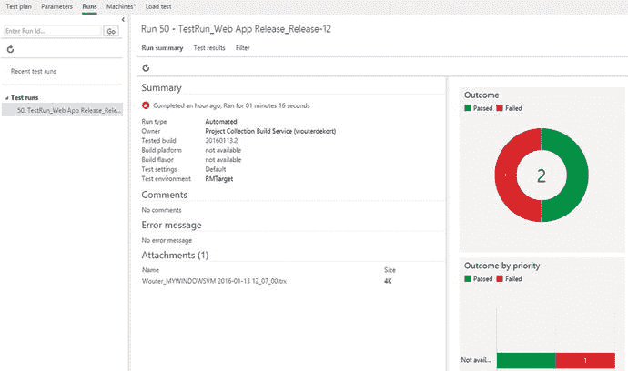
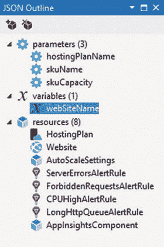

# 十二、通过发布管理实现持续交付

自动化部署通常是团队在转向开发运维流程时首先要做的事情之一。这不是没有原因的。自动化部署是一个巨大的进步。自动化的部署过程可以帮助您的团队减少错误，让您的团队专注于重要的事情。本章向您展示了如何使用发布管理来实现自动部署。您将会看到什么是发布管理以及它是如何工作的，并且会看到部署不同应用类型的可能性。

## 了解部署管道

我见过公司以各种方式进行部署。正如仍然有公司不使用版本控制一样，也有公司完全手动进行部署。良好部署的先决条件是版本控制和持续集成构建。构建是所谓的交付管道的开始。交付管道是一组自动化的步骤，将您的代码从版本控制一直带到生产。其中一些步骤是关于实际部署的，但也是关于运行自动化测试并确保部署的代码正在工作。

通常，开发人员通过在自己的开发机器上本地编译代码，然后将结果复制到服务器上来开始发布。您的部署管道不应该从开发人员的 PC 开始。相反，您希望从您的持续集成服务器开始。这是一个你可以控制和管理的位置。如果可以从生成服务器创建可预测的输出，则可以将该输出用作部署的开始。这消除了开发人员在机器上手动创建部署包的不确定性。

在构建服务器生成一个包之后，您可以通过其他步骤来处理这个包。这可以是部署到不同的环境中，运行自动化和手动测试，数据迁移，以及任何其他需要的步骤，以确保您的发布质量，并让您有信心将其发布给利益相关者。

关于交付管道，需要理解的最重要的事情之一是:只构建一次。构建服务器输出您想要部署的工件。这些构成了你的管道的起点。您的管道中的每个阶段都获取这些工件，对它们进行配置，并将它们部署到您的环境中。这保证了您的工件在所有阶段都是一致的。这也意味着无论何时您想要部署变更，您都要经历交付管道的所有阶段。你从不跳过步骤；您永远不会直接部署到生产环境中。这意味着您的部署在投入生产之前要经过多次测试。

除了交付管道中的步骤之外，您还希望围绕您的流程进行编排。您需要确定每个阶段的负责人，哪些步骤是自动化的，哪些需要人工批准。您还需要配置管理来存储每个环境的不同配置选项，例如连接字符串或其他设置，并确保在每个阶段都应用了正确的设置。

为了建立有效的部署管道，您需要开发和运营之间的协作。这是一个巨大的文化转变。传统上，这些部门都是各自为政，目标迥异。运营部门负责保持应用的稳定。每一个变化都是一种风险。另一方面，开发者发布新功能是有报酬的。他们一直面临着遵守最后期限的压力。通常操作不信任开发，因为他们交付难以安装和监控的不稳定代码。开发人员发现操作很慢，只会妨碍他们做所有真正的工作。

现在试着让这两组人一起工作。这是一个很难解决的问题。明面上不是圣杯。然而，让运营和开发都对一个工具感兴趣是一个巨大的胜利。DevOps 是关于打破不同部门之间的孤岛。尝试让运营部门的人对可审计性、可追溯性以及最重要的稳定性等关键词感兴趣。你们需要理解彼此的问题，开始团队合作。

让运营部门在半夜修复现场生产问题，而你告诉他们“它在我的机器上工作”不会让你受欢迎。团队合作。如果你需要让管理层参与进来，告诉他们持续交付的优势。客户满意度总是一个巨大的争论点。拥有更频繁、更稳定、更可预测的版本是非常重要的。好的交付过程的另一个重要的可能性是假设驱动的设计。不要让产品负责人根据一些客户访谈和直觉来创建待办事项，而是使用您新发现的快速部署能力来运行小实验。通过测量您的应用在生产中的使用情况(在第 [14 章](14.html)中有更多的介绍)，您可以快速部署小的(或大的)变更并测量它们的效果。

这就是发布管理所提供的。跨平台、基于 web 的编排和部署工具。发布管理与 Visual Studio Team Services 构建系统无缝集成，并提供从工作项到代码更改、构建、测试和部署阶段的完全可追溯性。下面的章节将详细介绍如何在 VS Team Services 中使用发布管理。

## 使用发放管理设置自动发放

发布管理是 VS Team Services 中一个非常好的集成解决方案，它协调将您的应用部署到不同的环境中，无论是在本地或 Azure 中运行的(虚拟)计算机上，还是在平台即服务环境(如 Azure apps)中。发布管理是一个跨平台的解决方案，它使用与构建系统相同的代理。发布管理执行各种各样的任务，有些是现成的，有些是您创建的，并以这种方式部署您的应用。除了完成实际工作的任务细节之外，发布管理还协调跨不同环境的部署。它确保遵循适当的权限，并在部署期间安全地存储和应用配置设置。

正如 Team Build 一样，您将获得一个托管代理，它完全由 VS Team Services 为您管理。您可以将某个版本排队，然后由代理人领取。托管池允许您连接到 Azure。由于防火墙的限制，使用托管代理部署到内部环境通常是不可能的。在这种情况下，您可以在本地部署一个代理，并将该代理连接到 VS Team Services 来运行本地部署。

您可以通过创建一个版本定义来开始配置。在您的发布定义中，您定义了您想要部署到的环境，例如集成、测试、试运行和生产。这完全取决于你。您可以根据需要创建任意数量的环境。对于每个环境，您可以配置要运行的任务。除了任务之外，您还可以配置变量和权限。当然，发布定义需要从某个地方获得您的应用。这就是藏物出现的地方。通过将您的发布定义链接到一个构建定义，您可以配置从您的构建输出中获取的工件。这允许您创建一个完整的交付管道，在其中构建和发布受版本控制的代码，完全不需要手工操作。图 [12-1](#Fig1) 显示了一个非常基本的发布定义，叫做 Web App 发布。有一个环境只有一个任务:Azure 文件复制。


图 12-1。

A Release Definition with one environment and one task

Azure 文件复制允许您将工件复制到 Azure 中的虚拟机或存储帐户。如果你看图 [12-2](#Fig2) ，你会看到文件复制任务的配置。该任务被配置为将一个源(在下一段中会有更多介绍)复制到 Azure VM。该虚拟机存储在名为`rmtarget5002`的存储帐户中。虚拟机也是资源组的一部分。资源组可以包含逻辑上属于一起的多个项目。通过名称选择虚拟机，并指定登录凭据和目标文件夹。


图 12-2。

Configuring the Azure File Copy task Note

Azure 订阅是为每个团队项目配置为服务的属性。如果在部署任务的属性中单击 Manage，VS Team Services 会导航到项目的服务部分。然后，您可以使用名称/密码、证书或服务主体添加 Azure 订阅。如果要部署到资源组，需要建立与服务主体的连接。经典款的，最好用证书。有关所需步骤的详细描述，请参见 [`https://msdn.microsoft.com/Library/vs/alm/Release/getting-started/deploy-to-azure#prerequ`](https://msdn.microsoft.com/Library/vs/alm/Release/getting-started/deploy-to-azure#prerequ) 。

将凭证显示为纯文本可能不是您想要的。为了帮助您存储和保护变量，Release Management 能够存储您的整个版本定义和每个环境都可以访问的变量。如果选择环境名称旁边的省略号，您会看到一个配置变量的选项。这将显示如图 [12-3](#Fig3) 所示的窗口。这里我添加了一个名为`AdministratorLogin`的变量。然后，您可以输入该值，并选择锁图标来安全地存储该值。这不仅隐藏了视图中的值，还确保了它不会出现在日志文件中。然后，您可以用`$(AdministratorLogin)`替换密码的值。`$(...)`语法可以用于您定义的所有变量，无论是全局变量还是每个环境变量。


图 12-3。

Configuring variables used by an environment

该任务的源数据从`$(System.DefaultWorkingDirectory)` \CI Build 开始。这个数据是从一个已配置的工件中检索的。工件是可以在整个部署过程中使用的数据包。图 [12-4](#Fig4) 显示了一个从 VS 团队服务构建中获取数据的工件。发布管理可以从 Team Build、Jenkins 或内部 Team Foundation Server 加载工件。这允许您在云中使用发布管理，而您的其他 TFS 数据在本地。在开始向环境发布时，代理下载您的工件并将其存储在本地。然后，其他任务可以访问工件并部署它们。受支持的工件源的数量仍在增长。如果您错过了一个特定的工件源，您总是可以跳过工件的链接，并添加手动下载工件的任务。


图 12-4。

A VS Team Services Build output can function as an artifact for your release Note

变量`$(System.DefaultWorkingDirectory)`由发布管理预先定义。您可以在文档中找到所有预定义变量的完整列表，方法是导航到您的版本定义的配置选项卡并选择预定义变量链接。

在您配置了环境、部署任务和所需的工件之后，您可以开始一个新的发布来测试一切是否正常工作。图 [12-5](#Fig5) 显示了新的发布窗口。通过给你的版本一个描述，你可以很容易地在日志中找到它。您还可以选择您想要使用的工件版本。在这种情况下，我选择了我的团队构建的一个成功的最新版本。最后，选择目标环境。这里选择一个环境并不意味着您只执行所选环境的步骤。这意味着您的发布定义将被部署到所有环境中，直到您选择的环境。


图 12-5。

You can start a new release by selecting the version of your artifacts and the target environment

当您的发布执行时，您可以看到一个类似于 Team Build 日志的日志。图 [12-6](#Fig6) 显示了一个正在进行的发布的日志文件。您可以看到当前的环境和不同的步骤。


图 12-6。

A realtime log file shows the status of your release

第一步是部署前批准，这是您可以配置的流程编排工作流的一部分。在每个环境之前和之后，您都有一个批准步骤。您可以将这些步骤配置为自动执行或手动批准。如果选择手动选项，您还需要选择一个或多个负责批准该步骤的用户或组。您还可以启用通过电子邮件通知这些人。然后，只要等待批准，他们就会收到一封电子邮件。图 [12-7](#Fig7) 显示了分配批准者的窗口。


图 12-7。

You can assign manual approval or automate the approvals for an environment

触发器部分允许您设置连续部署。这意味着一个成功的团队构建触发了一个新的发布。图 [12-8](#Fig8) 显示了如何进行配置。您可以从下拉列表中选择一个生成定义。这将列出团队项目中可用的所有生成定义。然后选择一个目标环境，您希望在那里结束您的发布。也许您想要将每个签入部署到一个集成环境中，并且您想要将每夜构建一直部署到生产环境中。


图 12-8。

Configuring continuous deployment for your Release Definition

创建发布定义时，您可以从许多预定义的任务中进行选择。你可以在图 [12-9](#Fig9) 中看到默认的部署任务列表。以同样的方式向团队构建添加任务，如果你遗漏了什么，你可以添加发布任务(更多信息见第 [9](09.html) 章)。您也可以选择使用 PowerShell 任务来运行您自己的脚本。


图 12-9。

Available deployment tasks

当涉及到可追溯性时，发布管理也可以帮助你。您已经看到了特定版本的详细日志。您还可以很好地了解您的发布定义，如图 [12-10](#Fig10) 所示。我的第一个版本只包含一个环境，并且获得了成功。第二个版本部署到三个环境中。第一个完成了。目前第二个版本正在运行，第三个版本在那之后。当您分配手动批准步骤时，您将看到一个带秒表的人图标。这意味着下一个阶段是等待批准。批准人可以选择此项，然后输入备注并拒绝或接受批准。如果发布失败，可以选择放弃发布或者重启发布，如图 [12-10](#Fig10) 工具栏所示。


图 12-10。

Release Management gives you an overview of your releases

您已经看到了发布管理的能力。您可以根据环境、任务、核准者和变量创建发行定义，然后运行发行。部署流程中的另一个重要步骤是测试。在第 11 章中，你看到了自动化测试。当您向交付管道中添加自动化测试时，您的交付管道的价值会大大增加。

想象一下，开发人员的每次签入都被编译、运行，然后自动部署到测试环境中，在测试环境中运行一组编码的 UI 和其他自动化测试。测试人员可以获得这些版本中的一个，然后批准它被部署到手动测试环境中。测试人员已经知道发布的基础质量是可以的。然后执行额外的手动测试，当稳定性成熟时，这些测试也是自动化的。

要运行您的测试，您将需要能够执行它们的机器。例如，您将您的 web 应用部署到 Azure Web Apps，并希望使用不同的浏览器从不同的客户端操作系统测试它。您需要自己创建这些测试客户端，并将它们添加到 VS Team Services 中。这是在机器选项下的测试中枢中完成的，如图 [12-11](#Fig11) 所示。


图 12-11。

Machine groups can be used to deploy to

首先创建一个计算机组，然后向该组添加计算机。您需要输入该计算机上管理员帐户的凭据，然后输入每台计算机的完全限定域名(FQDN)或 IP 地址。这些机器需要支持带有签名证书的 HTTPs 上的 PowerShell 远程处理。创建这种配置的机器最简单的方法就是使用一个模板，你可以在 [`https://github.com/Azure/azure-quickstart-templates/tree/master/201-vm-winrm-windows`](https://github.com/Azure/azure-quickstart-templates/tree/master/201-vm-winrm-windows) 找到这个模板。在这个页面上有一个部署到 Azure 按钮，您可以使用它来创建您的计算机。创建之后，在 VS Team Services 中将它添加到您的机器组中。

图 [12-12](#Fig12) 显示了使用我根据前面提到的模板创建的机器对机器组进行配置后的样子。VS 团队服务通过远程 PowerShell 与您的机器组连接。因为我使用的是自签名证书，所以我禁用了 CA(证书颁发机构)检查。我组中的机器由其 FQDN 决定。你可以在 Azure 门户中找到这个名字。我还在机器上贴了标签。标签的格式为 key:value。您可以输入任何想要的组合。


图 12-12。

The machine group after configuration

稍后，当您想要运行您的测试或者部署内容时，您可以使用它来过滤特定的机器。例如，如果您有多台客户机都需要代理，您可以添加一个标记类型:client，并使用它作为过滤器来获取所有客户机。

在创建您的机器组之后，您可以设置自动化测试。第一步是将包含测试的程序集从 Team Build 输出复制到目标计算机。你可以通过 Azure 文件复制任务来实现。然后将测试代理部署到计算机上，最后使用测试代理运行测试。图 [12-13](#Fig13) 显示了你需要的任务。Azure 文件复制任务使用来自 Azure 门户的值进行配置，如资源组和存储帐户。您还可以在虚拟机上指定要将文件复制到的目标文件夹。测试代理部署需要一个计算机组和作为目标的计算机。您还可以指定代理运行时将使用的凭据。最后一个任务运行实际的测试。在这里，您还可以选择一个机器组，然后指定您想要运行的测试。例如，这可能是在以`test.dll`结尾的程序集中找到的所有测试。在此之后，您可以开始并运行测试。


图 12-13。

Required tasks to run tests using a test agent

您的版本现在将运行测试作为它的一部分。如果你看一下图 [12-14](#Fig14) ，你会看到运行了一些测试的发布的输出。发布失败，并显示一些测试没有通过的消息。如果您查看测试结果部分，您会看到两个测试中有一个通过了。


图 12-14。

Summary of a release that failed because a test failed

通过选择测试结果名称，您将被重定向到测试中心➤运行页面。在这里，您可以看到您执行的所有测试运行的历史。如果您查看图 [12-15](#Fig15) 中的当前运行，您会看到您的测试运行的摘要。在右侧，您可以找到许多图表，以各种格式显示您的测试结果。



图 12-15。

The Test hub contains the details of all the individual test runs

您可以转到“测试结果”菜单来查找有关单个测试的详细信息。在这里你也可以更新每个故障的分析，如图 [12-16](#Fig16) 所示。对于失败的测试，您还可以创建一个 bug，并将其与测试细节相关联，以便进一步调查。


图 12-16。

You can update an analysis for a failed test

保护您的发布定义也是可能的。您可以在您的版本定义中配置允许谁对每个环境进行更改。您可以设置的权限有:

*   管理发布权限
*   删除发布环境
*   编辑发布环境
*   管理发布批准者

默认情况下，项目集合管理员、项目管理员和发布管理员拥有所有这些权限。贡献者可以删除、编辑和管理环境，而读者没有这些权限。如果您需要更细粒度的权限，您可以从图 [12-17](#Fig17) 所示的窗口中编辑这些权限。


图 12-17。

You can configure permissions for each environment

发布管理的介绍到此结束。在下一节中，您将了解如何部署由 web 应用和数据库组成的应用。

## 部署网站

具有后端数据库的 web 应用是我作为顾问遇到的最常见的应用类型之一。当您想要部署网站时，您需要为前端部署 HTML、JavaScript 和 CSS 文件。对于后端，您部署一组程序集和配置文件。其中一些配置设置需要根据环境进行更改。例如，测试环境的数据库连接字符串与生产环境的不同。部署 web 应用最简单的方法是使用 Web Deploy。Web Deploy 是一个用于打包和部署应用的完整框架。您通过使用 Web 平台安装程序( [`https://www.microsoft.com/web/downloads/platform.aspx`](https://www.microsoft.com/web/downloads/platform.aspx) )来安装 Web Deploy。

在 Visual Studio 中打开 web 应用后，可以选择“生成➤发布”。“发布 Web”窗口打开，您可以通过单击“自定义”按钮创建新的自定义配置文件，然后输入您的配置文件的名称，如图 [12-18](#Fig18) 所示。


图 12-18。

You create a new custom publish profile to use in Web Deploy

在连接步骤中，您会看到一个 Web Deploy 选项，该选项允许您指定一个服务器，并立即将应用从 Visual Studio 发布到您的服务器。这对于测试您的配置来说很好，但是这不是一个非常适合交付管道的解决方案。相反，您可以选择 Web Deploy 包，如图 [12-19](#Fig19) 所示。我已经将包的位置设置为当前项目下的相对路径。如果您使用这些设置完成向导，您将在项目下的`DeployOutput`文件夹中找到几个文件:

*   `MyWebApplication.deploy.cmd`
*   `MyWebApplication.deploy-readme.txt`
*   `MyWebApplication.SetParameters.xml`
*   `MyWebApplication.SourceManifest.xml`
*   `MyWebApplication.zip`


图 12-19。

Publish lets you create a Web Deploy package

ZIP 文件是 Web Deploy 包。`SetParameters.xml`文件在部署时用于配置您的应用。`deploy.cmd`文件包含一个批处理脚本，您可以在 IIS web 服务器上运行该脚本来部署应用。为了测试这是否真的有效，您可以在本地运行批处理文件。确保您已经安装了 IIS 和 Web Deploy。您可以编辑`SetParameters`文件来指定您想要在 IIS 中使用的 web 应用名称。如果不想发布到 Azure，可以扩展`SetParameters`文件并添加自己的参数，比如连接字符串。在这种情况下，我想向您展示如何部署到 Azure Web 应用，以及如何使用 Web 应用来配置设置。

交付管道的起点是团队建设。将项目添加到版本控制后，您可以建立一个新的团队构建，它不仅编译代码，还创建 Web Deploy 包。为此，您需要向`MSBuild`传递两个参数:

```
msbuild /p:DeployOnBuild=true;PublishProfile=<TheNameOfYourProfile>

```

发布概要文件指向您在向导中创建的概要文件，如图 [12-19](#Fig19) 所示。您可以通过配置您的构建定义将这些参数传递给`MSBuild`，如图 [12-20](#Fig20) 所示。这确保您的 Web Deploy 包已创建。


图 12-20。

Configure MSBuild to create the Web Deploy package

要将您的包复制到构建的输出中，您需要将`DeployOutput`文件夹添加到复制和发布构建工件任务的 contents 属性中。图 [12-21](#Fig21) 显示了这一点。通过像这样包含`DeployOutput`，它将成为您的 web 项目的子文件夹。如果您想要将事情分离到不同的顶级文件夹中，那么您可以添加多个复制和发布构建工件任务。这是你运输管道的第一步。您创建一个输出包，并将其存储在 VS Team Services 中。下一步是使用发布管理来部署您的 web 应用。


图 12-21。

You can add the DeployOutput folder to your build artifacts

发布管理有一个名为 Azure Web App deployment 的任务，您可以使用它将 Web Deploy 包发布到现有的 Azure Web App。要使用此任务，您需要一个基于证书的 Azure 服务端点。您可以从 [`https://manage.windowsazure.com/PublishSettings`](https://manage.windowsazure.com/PublishSettings) 下载发布设置文件。这个文件包含一个名为`ManagementCertificate`的属性，您可以使用它将您的 Azure 订阅链接到 VS Team Services。然后你可以配置 Azure Web App 部署任务，如图 [12-22](#Fig22) 所示。Web Deploy 包是从构建工件中检索的。您需要链接创建输出的构建定义，然后将 ZIP 文件的路径放在那里。


图 12-22。

Configure the Azure Web App deployment task to publish your Web Deploy package

如果您现在为您的团队构建启用了持续集成，并且为您的发布定义启用了持续部署，那么您已经配置了自动部署。每次签入都会触发一次构建，一次成功的构建会触发一次发布。通过添加多个环境和手动批准步骤(如果需要),您可以从代码到产品协调您的部署。

配置值呢？举个例子，假设你有一个 ASP.NET MVC 应用。您已经在您的`web.` `config`的`appSettings`中添加了以下密钥:

```
<appSettings>
  ...
  <add key="Environment" value="Development"/>
  ...
</appSettings>

```

和您的 home controller 类上的以下方法:

```
public ActionResult WhatsTheEnvironment()
{
    string environment = ConfigurationManager.AppSettings["Environment"];
    return Content(environment);
}

```

如果您破坏了本地主机上的应用，您可以导航到`http://localhost:PORT/Home/WhatsTheEnvironment`。这将从您的`web.config`文件中返回字符串`Development`。当在 Azure Web 应用上运行生产时，您希望该值为`Production`。要启用此功能，您可以转到 web 应用的设置页并选择应用设置，如图 [12-23](#Fig23) 所示。这里我添加了一个名为`Environment`的应用设置，值为`Production`。如果您导航到 [`http://yourwebapp.azurewebsites.net/Home/WhatsTheEnvironment`](http://yourwebapp.azurewebsites.net/Home/WhatsTheEnvironment) ，您将获得一个值`Production`。因此，无需任何代码更改就可以覆盖应用设置和连接字符串。Azure 确保如果一个值出现在你的 web 应用的应用设置中，该值将被用于存储在`web.config`文件中的任何内容。


图 12-23。

Configuring settings for your Web App in the Azure portal Note

如果您希望将配置值存储在版本控制中，而不是通过 Azure Portal 进行配置，您可以添加一个脚本，将正确的`web.config`复制到应用的根目录，或者使用一个脚本来解析`web.config`，并根据在发布管理中配置的参数更改值。这需要多做一点工作，但也适用于内部部署的 IIS web 服务器。你可以在 [`https://marketplace.visualstudio.com/items?itemName=colinsalmcorner.colinsalmcorner-buildtasks`](https://marketplace.visualstudio.com/items%3FitemName=colinsalmcorner.colinsalmcorner-buildtasks) 的市场中找到一些帮助你完成这些任务的任务，在 [`http://bit.ly/webrmwebdeploy`](http://bit.ly/webrmwebdeploy) 的一篇好的博客文章中详细讨论了这些任务。

您现在已经看到了如何在 Azure 中将您的项目部署到 web 应用。你也可以使用 Azure 资源管理模板。如果你创建了一个 Azure 资源组项目(你可以在 Cloud 类别中找到这个模板)，那么你可以选择你想要开始使用的 ARM 模板，如图 [12-24](#Fig24) 所示。


图 12-24。

Creating an ARM template in Visual Studio

您新创建的项目包含两个文件:

*   `AzCopy.exe`:用于将数据复制到 Azure 存储账户的可执行文件
*   `Deploy-AzureResourceGroup.ps1`:启动 ARM 模板部署的 PowerShell 文件
*   `Website.json`:实际手臂模板
*   `Website.parameters.json`:ARM 模板部署需要的参数

要开始部署，可以右键单击 Azure 资源组项目，然后选择“部署”。图 [12-25](#Fig25) 显示了部署到资源组窗口。在这里，您选择要部署到的订阅，然后创建一个资源组或选择一个现有的资源组。您还需要在参数部分输入一个 web 应用计划(比如免费)。之后你就可以开始部署了，你会看到 web 应用是如何在 Azure 上创建的。


图 12-25。

Deploy an ARM template from Visual Studio to a resource group Note

如果在部署过程中出现错误，请确保安装了最新的 PowerShell 工具。您可以在 [`https://azure.microsoft.com/nl-nl/documentation/articles/powershell-install-configure/`](https://azure.microsoft.com/nl-nl/documentation/articles/powershell-install-configure/) 找到说明和下载。也不要忘记安装后重新启动。

要扩展 ARM 模板，需要打开`WebSite.json`文件。然后，您可以打开 JSON 大纲(查看➤其他窗口➤ JSON 大纲)来检查模板。图 [12-26](#Fig26) 为轮廓图。这些参数是您的 ARM 模板需要部署的值。`skuName`和`skuCapacity`都有默认值，所以不需要输入。`hostingPlanName`值是必需的，您可以输入一个类似`Free`的值。



图 12-26。

The JSON outline lets you work with your ARM template

变量部分定义了 ARM 模板中的计算值，您可以在以后重用这些值。例如，`webSiteName`:

```
"webSiteName": "[concat('webSite', uniqueString(resourceGroup().id))]"

```

最后一部分 Resources 包含了您使用这个 ARM 模板创建的实际资源。如图 [12-26](#Fig26) 所示，它不仅仅是一个简单的 web 应用。您还可以配置您的托管计划、自动缩放设置，并使用应用洞察(有关应用洞察的更多信息，请参见第 [13](13.html) 章)。

目前，该模板仅创建一个新的网站，但不会将您的 Web Deploy 包上载到其中。点击左上方带绿色+的立方体可以扩展手臂模板，如图 [12-26](#Fig26) 所示。在图 [12-27](#Fig27) 中，您可以看到如何将 Web 应用的 Web Deploy 部分添加到您的 ARM 模板中。这将添加`MSDeploy`作为网站的子节点。需要注意的一个重要属性是`PackageUri`:


图 12-27。

Add Web Deploy for Web Apps to your ARM template

```
"packageUri": "[concat(parameters('_artifactsLocation'), '/', parameters('WebDeployPackageFolder'), '/', parameters('WebDeployPackageFileName'), parameters('_artifactsLocationSasToken'))]"

```

这个属性包含您的工件的位置和一个访问令牌。你不能在本地机器上存储 Web Deploy 包，然后从 Azure 中运行的 ARM 模板引用它。相反，PowerShell 模板负责将您的 Web Deploy 包上传到 Azure 存储，然后将正确的 URL 和令牌传递给 ARM 模板。若要部署该包，可以将其复制到资源组项目的文件夹中，然后将其作为项目文件包含在 Visual Studio 中。这确保了文件被上传到存储器。

然后，您可以在部署的参数部分中输入 ZIP 文件的相对路径和名称。如果您想要验证您的内容是否已上载到 Azure 存储，您可以在 Visual Studio 中打开云浏览器(查看➤云浏览器),然后导航到存储帐户 blobs。在那里寻找你上传的内容。要在发布管理中使用 ARM 模板，您可以使用 PowerShell 任务来执行部署脚本或使用 Azure 资源组部署任务。您可以使用 Azure 文件复制任务将 Web Deploy 包移动到 Azure 存储，然后运行 ARM 模板。

我在客户那里看到的几乎所有 web 应用都使用数据库，然而几乎所有团队都有自动部署数据库的问题。重命名列、更改存储过程和拥有一组基本的测试数据只是团队在自动数据库部署时面临的一些问题。不幸的是，几乎没有不使用数据库的项目。请记住，我说的是像 SQL Server 这样的关系数据库。像文档数据库这样的 NoSQL 数据库还有其他的挑战和优势，不在本书的讨论范围之内。

幸运的是，微软意识到数据库很难部署。这就是他们创建 SQL Server 数据工具(SSDT)来帮助您的原因。SSDT 向 Visual Studio 添加了一个新的项目类型:数据库项目。该项目允许您将数据库模式置于版本控制之下。模式不仅仅是关于表和列；存储过程、视图和权限也可以存储在数据库项目中。当你编译一个数据库项目时，你会得到一个`dacpac`文件。该文件是数据库的完整表示，可以进行部署。您通过给它一个目标数据库来更新来部署一个`dacpac`。系统会指出需要进行哪些更改，然后自动应用这些更新。当然，您可以检查`dacpac`部署将要做什么，并且您可以应用关于数据丢失的规则。在使用数据库项目时，可以通过将数据库项目与本地开发数据库同步，或者直接在 Visual Studio 中对数据库项目进行更改来保持数据库项目的最新状态。

您的数据库项目还可以包含您希望在部署之前或之后运行的脚本。这允许您向部署中添加一些手动步骤。您可能想做的事情之一是向数据库添加一组默认数据。这可以是一些您希望可用的测试数据，也可以是运行您的应用所需的一组基本数据。

作为 SSDT 的一部分，您会得到一个名为`sqlpackage.exe`的可执行文件，它会为您执行实际的部署。您可以从命令行使用`sqlpackage.exe`来更新数据库。这可以是常规的 SQL Server 数据库或 SQL Azure。

## 了解容器

您可能熟悉虚拟机(VM)的概念。他们模仿计算机。在一台物理计算机上，您可以部署多台虚拟机。Azure 是托管多个虚拟机的平台的一个例子。您可以通过门户请求虚拟机，并在以后访问它。这并不意味着在数据中心放置了新的物理硬件，并且您获得了新安装的服务器的凭证。它只是一个运行在容量足够大的主机上的虚拟机。您的虚拟机被分配了大量的 CPU 和内存。这些资源来自主机，虚拟机的数量受到主机容量的限制。即使虚拟机没有使用所有分配给它的内存或 CPU 能力，主机也不能将其分配给另一个虚拟机。由于虚拟机是一个完整的虚拟机器，启动一个新的虚拟机需要时间。这限制了您扩展应用和配置新资源的速度。

容器是一个越来越受欢迎的概念。容器看起来很像 VM，但是要轻得多。容器不是拥有专用的 CPU 和内存，而是动态地使用这些资源。如果容器需要 2GB 内存，它将使用 2GB 内存。如果它需要的少，它只使用它需要的。容器启动非常快。您仍然可以获得一个具有外部 IP 地址的隔离环境，但是没有虚拟机的缺点。

Docker 是一个非常流行的容器平台。Docker 容器运行在 Linux 上。由于微软了解容器的重要性，Windows Server 2016 也将能够托管容器。容器是由图像构建而成的。这些图像层层叠加，形成一个应用。同一主机上的不同容器之间也可以共享映像。这样可以节省内存和磁盘空间。共享这些资源并不意味着您的应用存在安全风险，因为容器宿主确保每个容器都在自己的进程中运行。一个容器有一个配置文件，该文件指定了您想要将哪些层放在彼此之上。层可以是 web 服务器或 ASP.NET 堆栈。层有一个版本号，一旦创建就不可改变。这些图像存储在中央注册表中。你可以在 [`https://hub.docker.com/`](https://hub.docker.com/) 找到 Docker 注册表的公共版本。如果你搜索 ASP.NET，你可以在 [`https://hub.docker.com/r/microsoft/aspnet/`](https://hub.docker.com/r/microsoft/aspnet/) 找到微软 ASP.NET 的图片。这是 ASP.NET 的跨平台版本，可以让你运行用。NET 在 Linux 上的应用。

因为容器是图像形式的一堆组件，所以可以很容易地移动容器。这允许您重新定义交付管道的概念，其中应用经过多个环境。Docker 容器的环境不会改变。您只需使用另一组配置参数将整个环境推到另一个位置。

作为如何部署到 Docker 的示例，您可以创建一个新的 ASP.NET 6 应用。如果您从已安装的模板创建一个标准应用，然后打开发布 Web 向导，您会看到图 [12-28](#Fig28) 中的选项。


图 12-28。

ASP.NET 6 applications can be deployed to Docker

选择 Docker 选项后，会要求您选择一台主机或创建一台新的主机。图 [12-29](#Fig29) 显示了新 Linux 主机的设置。这将创建一个存储在项目中的新 ARM 文件。然后 Visual Studio 将这个 ARM 文件部署到 Azure 来创建您的主机。创建主机后，您可以向其部署应用。这只不过是选择您创建的 Docker 主机作为目标。Visual Studio 确保加载了正确的 ASP.NET 图像，然后将您的应用放在它上面的图像中。


图 12-29。

You can create a new container host running Linux Note

这只是对容器概念的简短介绍，它们正变得越来越重要。要深入了解容器，我推荐 Karl Matthias 和 Sean P. Kane 的《Docker: Up & Running》。

## 摘要

本章向您介绍了交付管道的概念，交付管道是从代码到部署应用的一系列步骤。您已经看到了如何使用发布管理来协调您的部署。您可以创建一个包含多个环境和任务的发布定义，这些环境和任务执行您的部署所需的实际步骤。您还看到了如何将自动化测试集成到您的部署管道中。

然后，您查看了部署 web 应用的不同选项。您已经看到了如何创建 Web Deploy 包，以及如何将包部署到 Azure Web 应用。您还看到了如何利用 Azure 资源管理器模板来自动化资源的创建和配置。最后，您查看了容器的介绍，并了解了它们为什么如此受欢迎。

在下一章中，您将了解应用洞察。您将看到 AI 如何让您监控您的应用，以了解您的用户在做什么，以及您的应用是如何工作的。