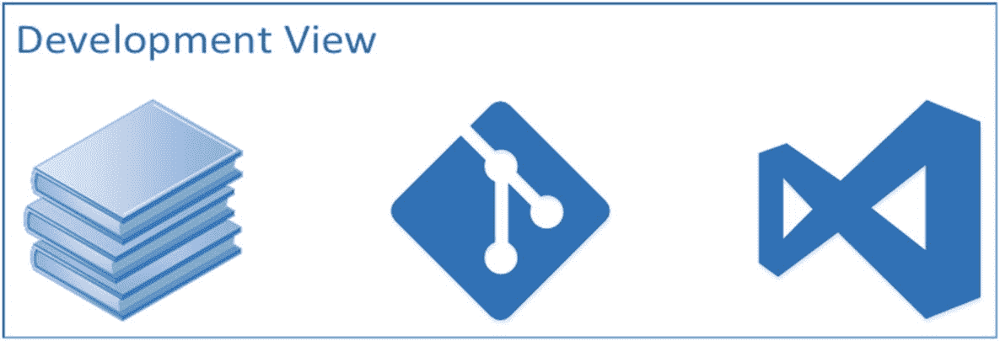

# 1.介绍

亲爱的读者，你正开始走上卓越之路。通过拿起这本书，你展示了你的领导能力和决心，使你的开发组织成为世界级的，与地球上任何其他开发组织竞争。你在采取主动。你是软件领导者。你正在直面挑战。这本书给你。这本书是实践、工具和过程的综合，它们一起可以装备一个软件组织来快速移动并交付最高质量的软件。在这一章中，我们涵盖了我们行业面临的相关常见问题、该问题的解决方案，以及如何为您的团队实现该解决方案。该文本与在 [`https://dev.azure.com/clearmeasurelabs/Onion-DevOps-Architecture`](https://dev.azure.com/clearmeasurelabs/Onion-DevOps-Architecture) 公开发布的完全实现的示例紧密相关。

## 问题

每天都有数百万开发者使用。NET 为世界各地的组织构建和操作关键任务软件系统。Visual Studio，。NET 和 Windows Server，无论是内部部署还是在 Azure 中，都提供了令人惊叹的功能，支持任何类型的软件。市场上有许多书籍、在线课程和教程，教授每一种技术框架和语言特性。微软自己的在线文档广泛而全面。微软平台，以及市场、扩展和软件包，为你所能想象的一切提供了一个构建模块。但是，完全取决于您是否以适合您环境的方式将所有模块组合在一起。这本书试图改变这种情况。

### 爆炸式增长的挑战

无论用什么标准来衡量，专业开发人员的数量在过去十年里都呈爆炸式增长，超过了过去十年的增长率。如图 [1-1](#Fig1) 所示，从 Stack Overflow 2018 年的调查中我们可以看到，超过一半的职业开发者是在最近五年进入这个行业的。

图 1-1

超过一半的开发人员有五年或更少的专业编码经验——堆栈溢出

如果你有超过 20 年的开发经验，你就有资格获得行业中前 5.2%的经验。我们可以看到 6-8 年和 3-5 年经验之间的拐点。尚不清楚这种增长将如何持续，也不清楚商业需求是否会开始饱和。不管未来的增长如何，劳动力的爆炸性增长给我们的行业带来了挑战。考虑一下这个类比。你要开一家新的汽车修理店。图 [1-2](#Fig2) 摘自维基共享网站 [1](#Fn1)

图 1-2

汽车修理厂必须以有利于提高质量和速度的方式建立

你购买了一个位于主干道上的绝佳位置，靠近其他商业中心。你不惜重金建造商店。你联系了当地的一所技工学校，宣称你希望雇佣即将毕业的班级中排名前 7%的学生。你已经为雇佣最好的、最聪明的、刚被训练成新技工的人所需要的工资做了预算。

毕业日到了，下一周，你准备开业。你们聚集在商店门前，旁边是一堆刚交货的工具和商店设备。你向你的新员工简单介绍了一下，表达了你的兴奋之情，说:“让我们准备好开店吧。我们下周开始为顾客服务。”你的员工的兴奋变成了睁大眼睛的恐惧。你的盛大开幕是一场灾难，你想知道你错过了什么。

这位经理雇佣了受过汽车维修和保养培训的员工。他们聪明、有技巧、有动力。他们在经过专业配置的环境中接受培训。唉，课程没有包括如何为自己建立一个新的环境。

不幸的是，不少团队领导和经理都经历过类似的情况。这些团队的开发人员知道如何应用他们的培训和实践。但是在每一个建造东西的行业中，工地或环境对团队的效率有着深远的影响。共同课程有一些差距，这是其中之一。这本书试图填补课程中的这一空白。这本书将帮助你为你的团队建立一个高效的 DevOps 环境。

### 没有端到端参考实现

除了文档、开源项目和示例，不存在任何完整 DevOps 环境的端到端演示。许多人寻求这样的参考实现。有了参考实现，团队可以模拟演示的模式并执行配置，而不是在这个领域进行研究和开发。虽然有教程和在线视频，但它们只是演示了解决方案的一部分，并没有提供任何可以评估和复制的功能实现。这本书改变了这一点。

## 解决方案

本书提供了使用微软技术时世界级 DevOps 环境的模型。虽然工具、语言或需求的差异会改变所需的实现，但本文中共享的 DevOps 模型是您团队工作环境的架构。如果你认为合适的话，可以修改它的某些部分，但是这个架构将使你所有的团队和你所有的应用在性能上加速，并在下一个十年向前推进。

在过去 13 年的 22 年多的软件工程生涯中，这位作者试图综合研究、模式、方法、过程和工具，为开发团队提供最好的环境。通过早期的敏捷转变，包括 Scrum、极限编程、看板、精益软件和其他方法，我们可以看到方法本身并不能保证软件的成功。此外，工具本身并不能消除项目中的所有风险。只有结合一切可用的最佳元素，我们才能创造一个失败比成功更难的环境。本书中描述的 DevOps 环境试图从所有可用的现有技术中提取好的想法，以任何团队都可以实现的独特方式将它们结合起来。这是作者的信念，当配备了正确的环境、工具和过程时，任何团队都可以是世界级的。

这本书是为一个开发领导者而写的。无论你是软件架构师、首席工程师、经理、执行官，还是开发团队中充满激情的领导者，这本书都是为了让你能够采取行动，为团队的成功做好准备。我们的目标读者是那些致力于让其他人在发布让您的客户满意的优秀软件方面富有成效的人。为了沿着这条路走下去，让我们首先了解 DevOps 环境的架构。

### DevOps 架构

当设计软件或任何类似的东西时，人们必须画出要构建的东西。在软件世界中，我们描述与软件相关的软件架构的最佳方法是 Philippe Kruchten 的 4+1 模型。他在他的 IEEE 论文中写道，“架构蓝图——软件架构的‘4+1’视图模型。”在这个涌现和迭代架构的模型中，Kruchten 先生定义了四个层次来说明架构和一个场景列表，这些场景是架构支持的精选用例。所需的功能驱动架构。就像一所房子的蓝图会有诸如平面布置图、电气和管道之类的层次一样，这个软件架构模型中的四个层次是

*   逻辑视图

*   流程视图

*   物理视图

*   发展观

#### 逻辑视图

让我们考虑一下代表 DevOps 的非常受欢迎的徽标。图 [1-3](#Fig3) 取自维基共享网站。T33

图 1-3

DevOps 的通用徽标仍然没有将开发和运营结合起来

关于 DevOps 的相同描述有许多版本，但作者认为这是根本错误的。它未能统一开发和运营。它仍然认为他们是两个。如果有两个必须很好地一起工作，那么一个会问:“产品管理在哪里”或者“质量保证在哪里”一旦描述了这些其他群体，我们就有了一个仍然挂在筒仓上的组织。不，DevOps 更好的逻辑视图是下图 [1-4](#Fig4) 。

图 1-4

从逻辑上讲，DevOps 寻求通过统一的组织来加快周期时间

对 DevOps 更恰当的看法是，将横向的 8 字形解开，形成一个统一的周期。统一团队的目标是在尽可能短的时间内完成一个周期。该周期包括

*   计划

*   密码

*   合并

*   包裹

*   释放；排放；发布

*   操作

*   学习

为了促进这个循环的持续加速，我们定义了一个中枢，这个循环可以围绕这个中枢旋转。这个中心就是自动化的 DevOps 管道。在此基础之上，我们还可以在团队中实现几层能力。每层都需要

*   战略:决定做什么和如何做

*   执行:持续有效地执行战略

*   测量:检查和验证策略的执行是否达到了预期的目标

在这个模型中，团队的六层能力是

*   自动化 DevOps 管道:将代码转换成生产软件的自动化方式

*   最佳实践:选择并恰当地实现被认为是最适合软件和团队情况的实践

*   缺陷消除:缺陷预防和缺陷消除技术的选择及其应用

*   团队工作流:完全了解团队正在做的所有工作，能够快速发现瓶颈

*   架构蓝图:软件的清晰蓝图的定义、维护和检查

*   云操作:软件在生产中是如何操作、监控和支持客户的

这是团队 DevOps 环境的逻辑模型。当您评估这些层时，您不会发现适合每个团队的单一的千篇一律的实现，但是这些功能层中的每一层都必须针对每个团队。当您为您的团队分析这个模型时，如果您的环境认为合适，请不要犹豫添加一个额外的层。

请记住，这个逻辑架构中最重要的元素是循环。一切都从属于持续加速团队能力的能力，即从计划一个想法到学习预期的结果已经完成的能力。对于软件系统来说，只有大约 1/3 的想法最终会产生预期的积极影响。微软 Azure DevOps 产品线的产品负责人 Sam Guckenheimer 在 2018 年的播客采访中分享了他对相关行业研究的分析。在采访的 15 点 43 分，古肯海默先生讲述了“三分法”

*   三分之一的优先特性具有积极的预期效果。

*   三分之一的优先特征具有中性效果。

*   三分之一的优先功能有负面影响，应该立即恢复。

如果即使是最好的、最复杂的公司仍然受这条一般规则的约束，那么软件组织必须能够非常快速地执行软件周期。能够缩短周期时间的公司将在市场上拥有持续的竞争优势。

#### 流程视图

在 4+1 架构中，流程视图遵循事情完成的顺序。随着工具的集成和方法的选择，这个视图及其结构将指导许多其他的实现决策。如图 [1-5](#Fig5) 所示，这是贯穿本书的 DevOps 模型的端到端流程视图。

图 1-5

DevOps 的架构过程观

DevOps 环境的流程不仅仅包含自动构建和部署。它从建模整个价值链开始，从一个想法被讨论到这个想法作为一个新的软件功能被放到客户手中。在接触代码之前，有四种不同类型的设计必须在一个特性上执行，以便开发人员知道应该如何实现它。一些小团队没有跟踪他们的过程到这个粒度级别。相反，他们依靠与产品负责人的对话来回答问题，就像在 Scrum 中一样。这在小范围内可以很好地工作，但是一个高性能的流程会列举每一种必须执行的不同类型的工作，并按顺序将它们分开。这允许测量每个工作站的在制品(WIP)和生产量。本书将引用的现代 DevOps 书籍都将其对心流概念的思考归功于《目标:持续改进的过程》的作者 Eliyahu Goldratt。 [5](#Fn5) 这是同一本畅销书的作者*论约束*。这种流程的概念，就像在一个制造工厂里，让我们设计流程，以便我们可以看到任何给定工作阶段的工作量，并确保它们不会成为整个流程的瓶颈。从数学上来说，一个步骤将始终是瓶颈，因此我们在寻求更快周期时间的过程中的持续改进将针对目前阻碍生产率进一步提高的工作阶段。

#### 物理视图

软件系统的物理视图意味着在运行时表示组成它的项目。随着虚拟成为新的物理，云成为新的虚拟，我将把这个视图简化为拥有自己的内存空间的组件。如果您正在为生产中的应用描述物理视图，您可能会绘制一个虚拟机，但这对于小型应用来说不是很好的描述。一种更好的方法是将虚拟机绘制成一个容器，并说明可能在该虚拟机上运行的不同进程以及它们之间的依赖关系。出于我们正在描述的 DevOps 环境的目的，请考虑图 [1-6](#Fig6) 。

图 1-6

. NET DevOps 环境的物理视图

我们的 DevOps 体系结构的物理视图显示了为了支持我们的 DevOps 环境，必须联机并相互连接的产品。随着您添加产品和其他工具，这种架构视图将会增长。

这是一个高级物理视图，因为我们在本地视图中看到的三个环境在该视图中仅由一个 Azure 图标表示。如果我们想为我们的环境指定不同的区域，将它分离出来是合适的。在最高水平上，这是我们的物理观点。

#### 发展观

在您的 4+1 架构中，开发视图描述了开发人员的工作站和周围资源的结构，以便实现该架构所描述的系统。如图 [1-7](#Fig7) 所示。

图 1-7

本书中描述的 DevOps 环境的开发视图

为了让你为你的团队开发你自己的世界级 DevOps 环境，你将需要随本书提供的公共 Azure DevOps 服务项目、示例应用的 Git 存储库、本书以及对本文脚注中引用的其他书籍和文本的访问。这本书并不是独立的。这是一个完整的指南。NET DevOps 实现随书提供，通过 Git 和一个公共 Azure DevOps 服务项目交付。

这本书并不是独立的。这是一个完整的指南。NET DevOps 实现随书提供，通过 Git 和一个公共 Azure DevOps 服务项目交付。

既然我们已经回顾了 DevOps 环境的架构的四个视图，那么让我们看看该架构将支持的一些场景。

#### 情节

4+1 架构中包含的场景旨在说明该架构的功能。最简单的形式是，场景可以是用例，甚至是架构提供的功能列表。对于复杂的场景，通过绘图来说明当某人使用系统的某项功能时，数据将如何在系统中流动是很有用的。对于我们的 DevOps 环境，作为设计中的系统，一个功能列表就足够了:

*   团队成员可以通过浏览项目板来了解哪些功能处于不同的设计状态。

*   开发人员可以从正在开发的功能工作项中打开新的功能分支。

*   开发人员可以在本地运行私有构建，无需外部依赖，以验证提交/推送的准备情况。

*   开发人员可以在将代码推送到团队的 Git 存储库之前，在本地执行单元测试和集成测试来验证更改。

*   开发人员可以在持续集成构建中看到新推出的代码构建，并知道新的更改与其他队友的更改配合得很好。

*   开发人员会收到在完全部署的环境中运行的全部自动化全系统测试通过或失败的通知。

*   任何团队成员都可以访问任何成功构建的任何应用组件的版本化发布候选包。

*   开发人员可以提交一个 pull 请求，以便让团队成员检查链接到分支工作项的变更集。

*   在执行拉式请求检查清单时，拉式请求检查员可以看到成功的 CI 构建、部署和全系统测试运行，以及静态分析结果和测试代码覆盖度量。

*   利益相关者可以按需请求将一个新的构建自动部署到一个环境中，并看到它被快速部署，包括数据库和所有内容。

*   团队成员可以从任何环境中查询集中式日志，以便诊断通过配置的警报报告的问题。

每个团队的 DevOps 环境都应该包括这些基本功能。许多团队想要更多的功能。这本书将使您能够设计和实现一个具有上述功能的 DevOps 环境。在此，作者希望你感到兴奋！如果你的团队的工作环境包含所有这些列举的能力，你会为你的客户生产得更快还是更慢？使用前面的功能，您会产生更好的质量还是更多的错误？当然，任何团队拥有这些能力都会更好。

### DevOps 方法

在我们开始讨论如何实现 DevOps 环境的架构之前，让我们回顾一下业界 DevOps 方法的现状。在他的畅销书《凤凰计划:一部关于它的小说，开发和帮助》中... 、 [7](#Fn7) 基因金列举了 DevOps 的三个指导原则。他将它们命名为“三种方式”他们是

1.  第一种方式:系统思考

2.  第二种方法:放大反馈回路

3.  第三条路:不断实验和学习的文化

这些非常抽象，但是当我们实现上面指定的 DevOps 场景时要注意它们。在我们的行业中，关于 DevOps 存在很多困惑。DevOps 在 2010 年才被命名为 devo PS，现已商业化和市场化。你会看到“开发工程师”的职位空缺这类似于 2005 年前后的“高级敏捷工程师”职位招聘。DevOps 是一种思维方式。这是一种心态。有些实践非常适合 DevOps 的思维方式，就像测试驱动开发非常适合敏捷的思维方式一样。下面简单举例说明 DevOps 的三种方式。

#### 第一种方式:系统思考

DevOps 方法基于被称为三种方法的原则。第一种方式是系统思维，如图 [1-8](#Fig8) 所示。

图 1-8

第一种方式是系统思考

DevOps 的第一个原则中包含了很多思想。它包括从开发人员的想象到客户的积极使用，创建一个平滑的、可预测的工作软件流的能力。在我们的世界里，不管职位描述或职称如何，如果你参与构建或更改软件，你就是站在开发人员一边的。如果你是使用或消费或依赖软件的人，那么你是站在 Ops 一边的。不包括用户的开发运维的其他定义存在很大风险。

#### 第二种方法:放大反馈回路

根据这一原则，我们创造了一个环境，让那些使用我们软件的人——那些使用我们软件运营业务或部门的人——向那些操作、开发和更改软件的人提供持续的反馈，如图 [1-9](#Fig9) 所示。

图 1-9

那些使用我们的软件管理他们部门的人向那些改变软件的人提供持续的反馈

通过将关键词翻译如下，我们可以将自己置于正确的 DevOps 思维模式中:

*   开发人员:包括支持、构建、变更和改进软件或系统的任何人

*   Ops:包括依赖该软件来运营其业务或部门的任何人

如果我们公司有一个名为 IT 运营、支持或数据中心运营的部门，重要的是不要将这些部门混淆为我们的客户。他们不使用软件。它们仅仅是我们开发能力的一部分——向我们的客户交付有价值的软件的能力，这样我们的客户就可以操作软件来体验它的价值。

#### 第三条路:不断实验和学习的文化

如果前两种方法是关于以一种精简有效的方式完成一个软件发布周期。第三种方法是让这个周期更快，如图 [1-10](#Fig10) 所示。

图 1-10

第三种方式是在循环中引入更小的循环

像网飞这样的公司向我们展示了软件不仅可以每天发布，而且可以每天多次发布，没有停机时间，没有缺陷(或者接近理想状态)。第三条路让我们带着这个目标去思考，解决任何阻碍我们实现这一能力的挑战。即使客户不希望软件以这样的节奏发布，这种思维方式也会使我们获得这种能力，这样我们就可以在接到通知后立即发布软件，始终稳定，始终工作，并且始终没有错误。这种思维方式也鼓励我们不要再把软件发布当成一个大仪式。我们将在接下来的章节中看到如何让我们的团队具备发布大大小小变更的能力。我们将会看到，当每一个小变更都在 DevOps 管道中运行时，小变更所需的相同过程对于大变更也是有效的。现在我们已经介绍了 DevOps 的架构和思想，让我们看看如何开始。

## 如何开始

示例应用以及 Azure DevOps 服务配置作为公共项目在线提供。

[T2`https://dev.azure.com/clearmeasurelabs/Onion-DevOps-Architecture`](https://dev.azure.com/clearmeasurelabs/Onion-DevOps-Architecture)

阅读本书时，请将示例应用和 Azure DevOps 项目放在手边。这个工作示例用于演示所有功能的协同工作。没有一个示例应用足以说明开发世界中的每个场景，但是为了 DevOps 环境的目的，我们选择了目前最常见的应用类型。在我们查看示例应用之前，让我们将常见的应用组件映射到它们的运行时组件。

### 应用运行时架构

您正在使用 Visual Studio 构建软件。不管您选择什么样的库或框架，您都有有限的运行时架构可供选择。当今流行的是一种 web 架构，它由一个 ASP.NET web 应用和一个 SQL Server 数据库组成。或者，您可能有一个桌面 WPF 应用与 ASP.NET Web API 服务通信，然后使用 SQL Server 数据库。如果你有一个 iPhone 应用，它可能会连接到你的 Web API 服务。不管您利用的运行时组合是什么，微软平台都有有限的选择，Azure cloud 有几种方式来运行每一种必须部署到云中的方式。

图 1-11

Azure 运行时的一个小例子，涵盖了应用架构的广度

虽然这个表还远未完成，但我们可以看到，通过 web 应用、离线作业和关系数据库，我们涵盖了很大比例的应用。少量选项也支持 WPF、Winforms 以及原生 iOS 和 Android 应用。对于每一种应用类型，我们都可以选择从基础设施即服务(IaaS)到平台即服务(PaaS)的全方位运行时选项。

设计 DevOps 功能时要考虑的架构要点是要认识到，在实现第一种方式时，我们需要**而不是**支持每个团队或应用的独特配置。一旦我们理解了如何向 Azure 交付某种形式的带有 SQL 数据库的 web 应用，那么我们现在涵盖了多少应用呢？大多数。亲爱的读者，我斗胆为你们每一个人猜测，你们的大量应用使用了那些架构组件。然后，我们添加了离线作业的功能，如 Windows 服务和计划任务，我们很好地弥补了这一差距。一旦我们涵盖了这些应用类型，您将会看到涵盖您的原生移动应用以及 Windows 桌面应用是多么小的一个飞跃。

### 必要的工具

为了建立一个针对 Azure 的专业 DevOps 环境，你需要一些关键工具来开始:

*   Azure 订阅

*   Visual Studio (2019 或 VSCode)

*   Azure DevOps 服务组织帐户

这些工具只是起点，在本书中，我们将集成更多来自微软、其他供应商的工具、库、框架以及开源库。请记住，DevOps 是一种思考方式，可以缩短交付时间、缩短周期时间和减少中断。在本书中，我们将把所有这些片段一个接一个地放在一起。

如果你刚刚开始使用 Azure 或 Azure DevOps 服务，不要跳过第 [2](02.html) 章。它会以互动的方式快速介绍一些基本功能，而不需要您编写任何脚本。但是不要止步于此。第 [2](02.html) 章中显示的步骤仅用于介绍这些工具的首次用户。这些技术并不意味着长期的可维护性。对于设置您的 DevOps 环境的专业方法，请转到第 [3](03.html) 章，在那里我们将详细介绍每个领域。

### 示例应用

虽然样本往往过于简单或不必要的复杂，这本书使用了一个配置有 SQL Server 数据库的 ASP.NET 核心 web 应用，使用实体框架核心对象关系映射器(ORM)。这个应用被适当地分解到控制对关键依赖项的访问的逻辑层中。该应用只做一件事，即公开一个检索费用报告记录的 Web API。我们的核心对象模型只有一个实体 ExpenseReport，而我们的 SQL Server 数据库模式只有一个表 ExpenseReport。本示例提供了一些结构性的指导，有足够的表面积来演示所有必要的 DevOps 技术，而不是将本书与一般的编码实践混为一谈。它没有阐明编码模式或框架。

图 1-12

示例应用的解决方案结构

Visual Studio 解决方案确实符合洋葱架构 [8](#Fn8) 依赖关系管理模型，它将关键依赖关系隔离在它们自己的程序集中，并将应用和业务逻辑集中在一个称为“核心”的无依赖关系程序集中

*   验收测试:全系统验收测试存在于这个项目中。它们作为配置了 Selenium 的 NUnit 测试运行，并驱动 Chrome 浏览器对应用的完全部署实例执行测试。

*   核心:这个项目没有 NuGet 包依赖项，也没有项目依赖项。它最好作为. NET 标准库来实现，并且应该包含普通的 C#对象。这个库的价值在于，它包含的任何代码都被验证为可移植到任何应用类型，只要生成的程序集没有基类库和 C#语言所具有的其他依赖项。

*   核心。AppStartup:这个项目用于引导应用，启动控制反转(IoC)容器，并实例化应用可能需要的任何全局资源或缓存。一些开发人员将这种逻辑放在 UI 项目中，因为它是应用的启动点，但是由于 IoC 与服务网页无关，我们将其分解到自己的非常小的项目中。

*   DataAccess:该项目负责配置和使用实体框架核心依赖项。它包含将我们的类映射到 SQL Server 模式的逻辑。它还包含任何需要使用 EFCore APIs 的逻辑。这个项目之外的任何代码都不知道 EFCore 包的存在。

*   数据库:数据库项目包含我们的 SQL Server 模式迁移工具和迁移脚本，它们是对数据库模式和非用户数据进行增量、自动化更改所必需的。

*   集成测试:这个项目包含了我们的 L1 测试，或者集成测试。这将在第 [7](07.html) 章中详细描述。

*   Job:这个项目包含一个正常的后端作业，它按预定的时间间隔运行。

*   UI:这个项目是 ASP.NET 的核心项目，为我们的 ValuesController 服务，返回所有费用报告。它利用了核心项目的能力。

*   单元测试:这个项目包含 L0 测试，或者我们代码的单元测试。

这个应用非常简单。然而，Visual Studio 解决方案是以一种适合更大的应用或服务的方式分解的。希望这个示例可以成为您自己的应用的起点，提供一个只包含一个项目而没有逻辑分离或依赖隔离的示例是不现实的。

## 关于这本书

使用前面描述的完整 DevOps 环境的模型，本书的每一章都详细强调了如何考虑每个领域。首先将介绍相关的原则以及如何实现环境的这一部分。虽然本章强调了一些细节，但本文大量引用了其他书籍、文章和 Microsoft 文档。不是复制其他的作品和文件，它们会比这本书更新得更快，脚注是用来引导你找到正确的资源。此外，使用示例应用和公共 Azure DevOps 服务(有时在下文中缩写为“AzDO”)进行深入研究。建立完整的 DevOps 环境所需的集成和设置数量令人望而生畏。这就是这本书需要出版的原因。虽然没有实际可行的方法来发布文本中的每个设置和脚本文件，但是您可以使用附带的视频录制的公共 AzDO 项目的演练，以便详细了解从默认设置更改的所有设置。

在您拥有一个完整的 DevOps 环境之前，请“照章办事”一旦一切都上线并正常运行，请随意定制、更改和改进。

现在，您已经了解了我们的行业所面临的挑战以及本书中将要实现的 DevOps 模型，让我们回顾一下您在阅读这些章节时将会涉及到的内容。

第 2 章是为那些不熟悉 Azure DevOps 和 Azure 的人准备的。它将涵盖如何设置基础知识，以便您可以跟随本书的其余部分。如果你已经是 AzDO 和 Azure 的用户，请随意快速浏览这一章并继续前进。

第 [3](03.html) 章超越了快速入门和在线教程，描述了专业级开发环境和您应该使用的工具。

第 [4](04.html) 章深入到我们 DevOps 流程的第一阶段工作，即跟踪工作。您将学习如何自定义自己的项目板，以便所有工作都是可见的。

第 5 章讲述如何使用 Azure Repos 跟踪代码。更重要的是，它教导了以一种适合自动化 DevOps 管道开始的方式将应用分割成 Git 存储库的自然规则。

第 6 章构建代码。本章涵盖了不同类型的构件以及何时使用每种构件。在介绍了每种类型的构建应该包含的步骤之后，读者将了解 Azure Pipelines 中持续集成构建的配置。

第 7 章是质量控制章节，阐述了如何在你的 DevOps 环境中考虑代码验证。本章讲述了相关的质量研究，以及在任何 DevOps 环境中实现三个必需的缺陷消除方法的经验法则。

第 8 章创建一个版本化的、可部署的候选版本。本章展示了如何决定应用打包的边界，应该有多少个包，以及如何以可部署的格式创建它们并将其存储在 Azure 工件中。

第 9 章提供、配置环境，并在 Azure 环境中部署我们的候选版本。本章涵盖了三种不同类型的环境，它们之间的差异，以及如何使用 PowerShell、Azure Resource Manager (ARM)模板和 Azure Pipelines 动态创建每一种环境。它还向读者介绍了三种环境类型所需的部署步骤，以及 Azure Pipelines 中的配置设置，这些设置允许对软件发布的时间和方式进行全面控制。

第 [10](10.html) 章涵盖了如何监控和支持已经部署到生产环境中的软件，从而使本书更加完整。本章展示了如何实现和集中日志和其他诊断，以便它们可用于分析使用 Azure Monitor 的主动警报以及按需调查。

## 包裹

这对你的软件团队来说是一个新时代的开始。使用本书中的方法和例子来不断加速你的团队的周期时间。分析流程中导致延迟或瓶颈的任何部分，并排除这些问题。现在让我们继续看这本书吧！

## 文献学

戈德拉特，E. M. (1990 年)。*理论约束。*北河出版社。检索自 [`www.amazon.com/Theory-Constraints-Eliyahu-M-Goldratt-ebook/dp/B00L7XYW2Q`](http://www.amazon.com/Theory-Constraints-Eliyahu-M-Goldratt-ebook/dp/B00L7XYW2Q)

E. M .戈德拉特(2014 年)。*目标:持续改进的过程，30 周年纪念版。*北河出版社。检索自 [`www.amazon.com/Goal-Process-Ongoing-Improvement/dp/0884271951`](http://www.amazon.com/Goal-Process-Ongoing-Improvement/dp/0884271951)

Guckenheimer，S. (2018，9 24)。Sam Guckenheimer 谈测试、数据收集和 DevOps 报告状态——第 003 集。(J. Palermo，采访者)检索自 [`http://azuredevopspodcast.clear-measure.com/sam-guckenheimer-on-testing-data-collection-and-the-state-of-devops-report-episode-003`](http://azuredevopspodcast.clear-measure.com/sam-guckenheimer-on-testing-data-collection-and-the-state-of-devops-report-episode-003)

Kim，g .，Behr，k .，和 Spafford，G. (2013 年)。*凤凰计划:一部关于它的小说，DevOps，帮助你的企业赢得*。检索 2019 年 2 月 18 日，来自 [`https://amazon.com/phoenix-project-devops-helping-business/dp/0988262592`](https://amazon.com/phoenix-project-devops-helping-business/dp/0988262592)

克鲁希滕，p .(未注明)。取自架构蓝图——软件架构的“4+1”视图模型: [`www.cs.ubc.ca/~gregor/teaching/papers/4+1view-architecture.pdf`](http://www.cs.ubc.ca/%257Egregor/teaching/papers/4%252B1view-architecture.pdf)

巴勒莫，j .(未注明)。*洋葱架构*。检索 2019 年 3 月 21 日，来自 [`http://jeffreypalermo.com/blog/the-onion-architecture-part-1/`](http://jeffreypalermo.com/blog/the-onion-architecture-part-1/)

维基媒体共享(2010 年)。ant berzhnyi[cc by 3.0[`https://creativecommons.org/licenses/by/3.0`](https://creativecommons.org/licenses/by/3.0)]。F *岛:* [`https://commons.wikimedia.org/wiki/File:Chery_A1_-_service_shop_in_Ukraine_`](https://commons.wikimedia.org/wiki/File:Chery_A1_-_service_shop_in_Ukraine_) *(7)。jpg* 取自[`https://commons.wikimedia.org/wiki/File:Chery_A1_-_service_shop_in_Ukraine_`](https://commons.wikimedia.org/wiki/File:Chery_A1_-_service_shop_in_Ukraine_)【7】。jpg 格式

维基媒体共享(2016 年)。inedo(Karl haragy)*文件:devos-tool chain . SVG*。从 [`https://commons.wikimedia.org/wiki/File:Devops-toolchain.svg`](https://commons.wikimedia.org/wiki/File:Devops-toolchain.svg) 中检索

<aside class="FootnoteSection" epub:type="footnotes">Footnotes [1](#Fn1_source)

维基媒体共享，2010 年

  [2](#Fn2_source)

锅碗瓢盆

  [3](#Fn3_source)

维基媒体公社，2016 年

  [4](#Fn4_source)

古肯海默，2018

  [5](#Fn5_source)

Goldratt,《目标:持续改进的过程》, 30 周年纪念版，2014 年

  [6](#Fn6_source)

戈德拉特，约束理论，1990 年

  [7](#Fn7_source)

金、贝尔和斯帕福德，2013 年

  [8](#Fn8_source)

巴勒莫，纽约。

 </aside>