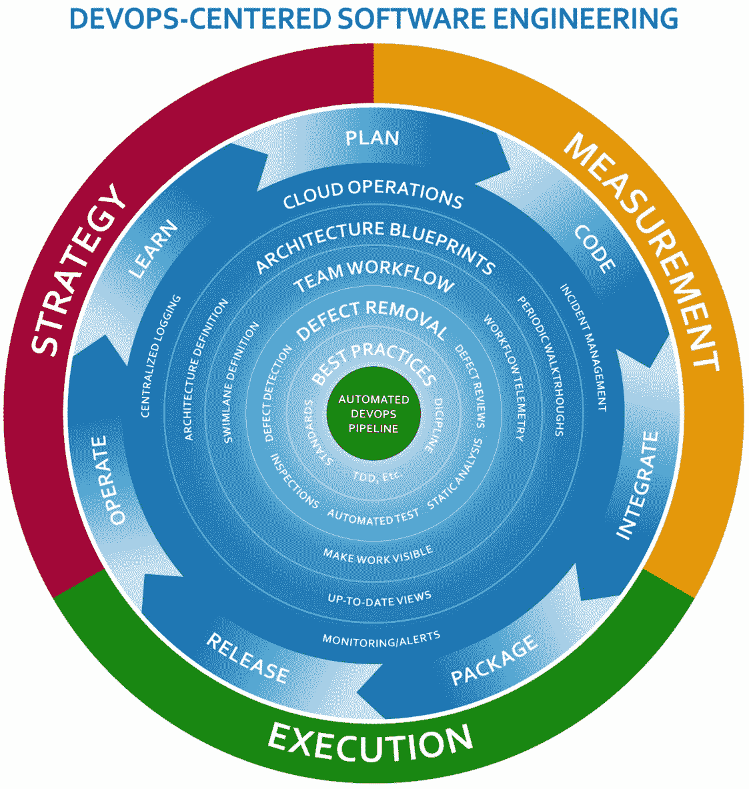
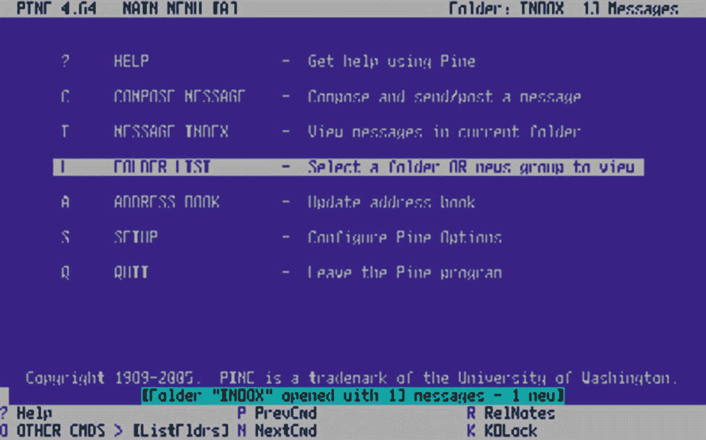
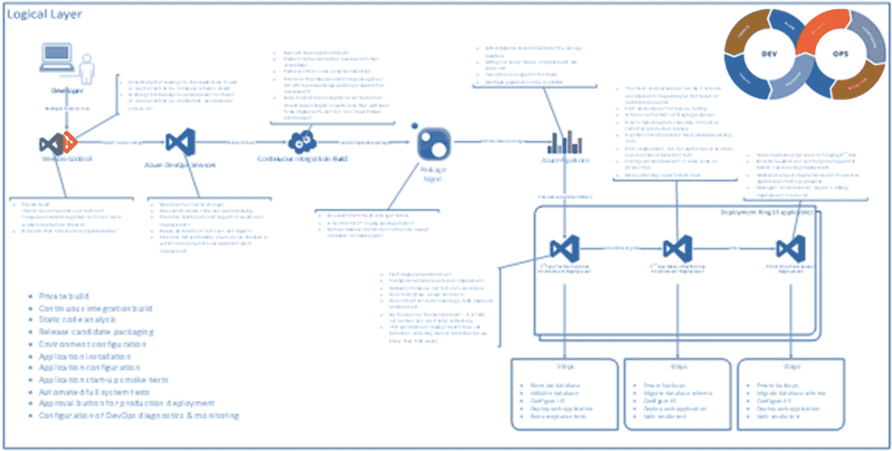
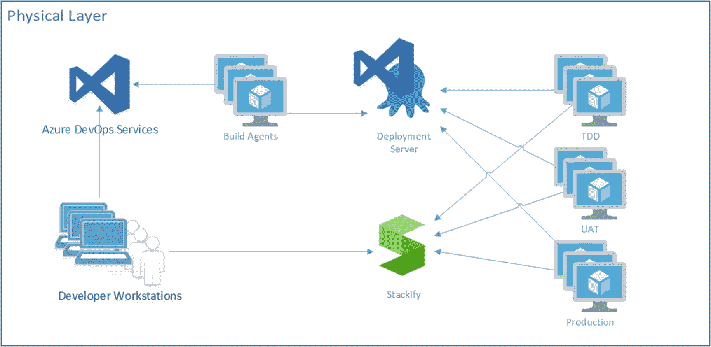
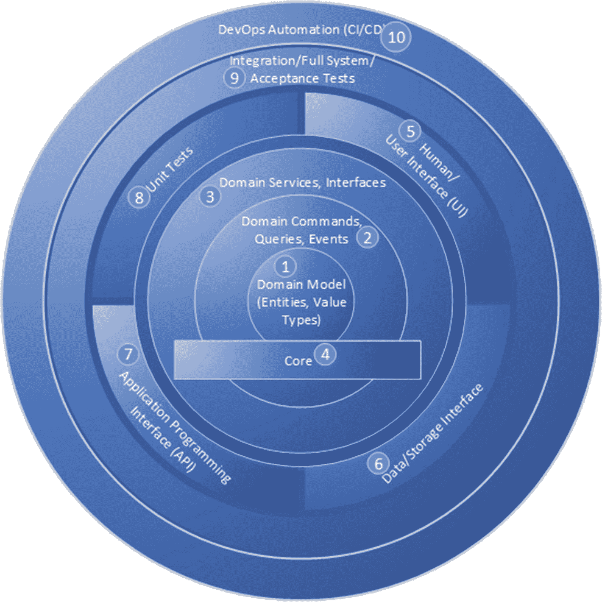
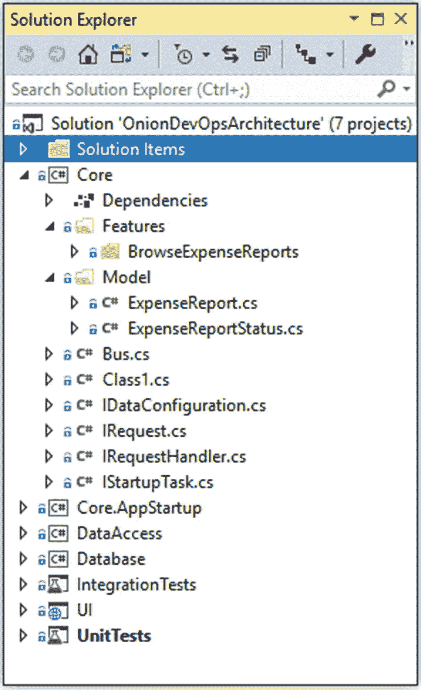
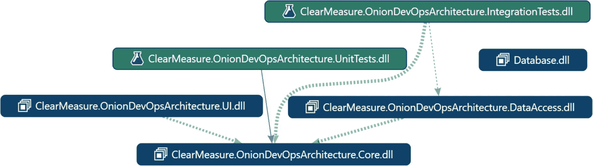

# 三、专业级 DevOps 环境

当我们为我们的团队配备专业级环境时，我们需要一个模型，通过它我们可以知道我们缺少什么。该模型描述了为 DevOps 的成功而建立的完整环境。该模型的名称为 Onion DevOps 架构，如图 [3-1](#Fig1) 所示。



图 3-1

完整 DevOps 环境的 Onion DevOps 架构模型

您可以看到自动化的 DevOps 管道位于洋葱的中心——模型的中心。围绕它的层是团队配备的连续能力。每个能力都有一个策略、执行方法和度量方法。一旦具备了所有的能力，这个过程就会在很短的周期内完成，并且随着技术的成熟有望加速。我们将在本书的后面部分更深入地探讨洋葱 DevOps 架构。为了继续定义专业级 DevOps 环境，反思一下业界 DevOps 的现状是很有意思的。

## 德沃普斯州

一些组织正在对整个行业的开发运维方法的进步进行持续研究。木偶和朵拉是两个突出的例子。微软赞助了 DORA devo PS 报告。Sam Guckenheimer 是微软所有 Azure DevOps 产品的产品负责人，并为该报告做出了贡献。他在最近接受 Azure DevOps 播客采访时也谈到了这一点，该采访可在 [`http://azuredevopspodcast.clear-measure.com/sam-guckenheimer-on-testing-data-collection-and-the-state-of-devops-report-episode-003`](http://azuredevopspodcast.clear-measure.com/sam-guckenheimer-on-testing-data-collection-and-the-state-of-devops-report-episode-003) 找到。

DORA 的 DevOps 状态报告的一个关键发现是，精英执行者充分利用了自动化。从构建到测试再到部署，甚至是安全配置更改，精英执行者的更改失败率降低了七倍，从事件中恢复的速度提高了 2000 多倍。

引领行业定义 DevOps 的其他关键文本是一系列书籍，其中都包括 Jez Humble。你阅读它们的顺序应该是

*   *《凤凰计划:一部关于 IT 的小说，DevOps，帮助你的企业成功*，作者金、斯帕福德和贝尔<sup>T3【1】T5】</sup>

*   *持续交付:通过构建、测试和部署自动化*进行可靠的软件发布，由法利和汉布尔<sup>负责[2](#Fn2)T5】</sup>

*   *《devo PS 手册:如何在技术组织中创造世界一流的敏捷性、可靠性和安全性》*，作者金姆、亨布尔和德博伊斯 <sup>[3](#Fn3)</sup>

如果你刚刚进入 DevOps，不要气馁。该行业也仍在搞清楚它是什么，但现在有很多成功的故事可以借鉴。

### 消除 DevOps 中的歧义

在大型企业软件组织的社区中，许多人将 DevOps 定义为开发和运维走到一起，从开发到运维一起工作。这可能是许多组织的情况，但我想提出的是，当你从现在起 20 年后回顾这个时代时，当你的世界观没有被今天的问题所影响时，DevOps 可能是什么。

20 世纪 50 年代没有操作系统。因此，在一台计算机上不可能同时运行多个程序。一个程序员没有机会让一个程序干扰另一个程序员的程序。不需要这种作战概念。编写程序的人也加载了程序。那个人也运行程序并评估它的输出。

快进到终端主机服务器的时代。在这个时代，程序员可以加载一个程序，这有可能给大型机的其他用户带来问题。在这个时代，为不断增长的大型机用户群保持大型机运行成为了某些人的工作。即使您从未为大型机编程，您也可能记得使用 Pine 收发电子邮件。这在 20 世纪 90 年代的大学里很流行。如果这发生在你之前，你可以在图 [3-2](#Fig2) 中看到。



图 3-2

Pine 是 20 世纪 90 年代流行的 Unix 主机邮件客户端(图片来源:维基百科 [`https://upload.wikimedia.org/wikipedia/en/c/ce/PineScreenShot.png`](https://upload.wikimedia.org/wikipedia/en/c/ce/PineScreenShot.png) )

我相信 DevOps 运动是对一个始于大型机时代的软件文化问题的修正。因为越来越多的人依赖多用户计算机(不久将被称为服务器),所以公司必须确保它们保持运行。这将数据处理部门转变为 IT 部门。所有的 IT 资产都需要平稳运行。试图改变其上运行的东西的团体被称为开发者，尽管我仍然称自己为计算机程序员。那些负责软件在生产环境中稳定运行的人被称为操作人员，他们由 IT 专业人员、系统工程师等组成。

我相信你会回顾 DevOps 时代，看到这不是你创造的新东西，而是二三十年来一个巨大的、代价高昂的错误的终结。不是把两个部门放在一起，让他们一起工作，你将消除这两个不同的部门，将出现一种类型的角色:软件工程师。顺便说一句，较小的公司并不认同所有关于开发和运维协同工作的说法，因为它们从一开始就没有进行过这种拆分。有成千上万的软件组织总是负责操作他们构建的东西。有了 Azure 云，任何基础设施操作都变得像电力和电话服务一样，公司一直依赖外部方来提供。

微软已经以这种方式重组了他们的 Azure DevOps 部门。没有两个部门一起工作的概念。他们通过让一个部门承担两个角色来消除分歧:

*   程序管理器

*   工程师

我相信这种类型的整合会在整个行业发生。虽然在非常狭窄的学科中总是有专家的空间，但是软件组织将要求计算机程序员能够执行所有必要的任务，以交付他们在构建和操作时所设想的东西。

## 专业级 DevOps 视觉

当你审视你自己的组织时，你可能处在想要更高质量和更快速度的阵营中。你的质量形式可能是更少的缺陷。可能是生产上的问题比较少。这可能会延长正常运行时间，或者更好地处理用户负载高峰。当您想到速度时，您可能会想到开发新功能。但是，企业高管可能会考虑缩短从他们为战略计划提供资金到他们能够推出支持该计划的软件之间的交付时间。不考虑具体问题，它似乎总是归结为质量和速度。这时你就需要 Capers Jones 了，他是你所在行业领先的软件研究统计学家。在他的新书《软件工程最佳实践》中，他展示了证明两点的研究:

*   优先考虑速度导致捷径，导致缺陷，导致返工，耗尽速度。因此，优先考虑速度既达不到速度，也达不到质量。

*   优先考虑质量减少了缺陷，从而减少了返工，返工将所有的工作能力导向下一个特征。因此，优先考虑质量也能提高速度。

你想设计一个 DevOps 环境，一路挤出缺陷。你可以通过自动化重复的任务并把它们从人类手中拿走来做到这一点。人类不擅长重复性的任务。计算机在这方面要好得多。但是人类非常擅长解决问题。计算机不擅长“跳出框框思考”。以下功能是我对专业级 DevOps 环境的愿景:

*   私人建筑

*   持续集成构建

*   静态代码分析

*   发布候选版本和打包

*   环境供应和配置

*   至少三层部署管道

*   由开发团队管理的生产诊断

*   前几个步骤的循环时间短得惊人

你不需要像网飞这样的基础设施来实现这一点。事实上，你甚至可以在为一个新的应用编写第一个特性或屏幕之前，用一个框架架构来设置它。您也可以将当前的软件改造成这样的环境。您希望记住 80/20 规则，并在不增加太多范围或试图在第一次迭代中“煮沸海洋”的情况下获得这些新功能。

## DevOps 架构

让我们浏览一下 DevOps 环境管理的流程。图 [3-3](#Fig3) 显示了 DevOps 环境的逻辑结构。全尺寸图片可以从 [`https://jeffreypalermo.com/2018/08/applying-41-architecture-blueprints-to-continuous-delivery/`](https://jeffreypalermo.com/2018/08/applying-41-architecture-blueprints-to-continuous-delivery/) 下载。



图 3-3

DevOps 环境的逻辑架构层

当我走过这里的时候，我会一步一步来。

### 版本控制

首先，您必须正确构建您的版本控制系统。在当今世界，你使用的是 Git。属于应用的所有内容都应该存储在源代码控制中。这是指导原则。数据库模式脚本应该在那里。配置环境的 PowerShell 脚本应该放在那里。概述如何开始开发应用的文档应该放在那里。一旦你接受了这个原则，你将会后退一步，确定什么样的例外情况适用于你的情况。例如，由于 Git 不能很好地处理二进制文件中的差异，您可能会选择不存储非常大的 Visio 文件的大量版本。如果你搬到。NET core 中，甚至框架都变成了 NuGet 包，你可以选择不存储/packages 文件夹，就像你在。NET 框架应用。但是 Git 存储库是版本控制的单元，所以如果您必须及时返回到上个月，那么当您从 Git 存储库中取出它时，您需要确保上个月的所有内容都是正确的。

属于应用的所有内容都应该存储在源代码控制中。这是指导原则。数据库模式脚本应该在那里。

### 私人建筑

正确配置的下一步是私有构建。这应该在本地工作站上运行自动化单元测试和组件级集成测试。只有当这个私有构建工作正常并通过时，您才应该将您的更改提交并推送到 Git 服务器。这个私有构建是持续集成构建的基础，所以您希望它在尽可能短的时间内运行。不超过 10 分钟是被广泛接受的行业指导。对于刚刚起步的新应用，45 秒是正常的，这将表明您已经步入正轨。这个时间应该包括运行两个级别的自动化测试套件:您的单元测试和组件级集成测试。

### 持续集成构建

持续集成构建通常缩写为“CI 构建”首先，这个构建运行私有构建中的所有步骤。它是一个独立的服务器，远离本地开发人员工作站上的细微配置。它运行在一个服务器上，该服务器具有团队确定的软件应用所需的配置。如果它在这个阶段中断了，团队成员知道他们需要撤销他们的变更并再试一次。一些团队有一个标准，允许“我忘记提交一个文件”的构建中断。在这种情况下，开发人员只有一次机会再次提交并修复构建。如果没有立即实现这一点，提交将被恢复，以便构建再次工作。这没有坏处，因为在 Git 中，您实际上永远不会丢失提交。中断构建的开发人员可以检查他们最后处理的提交，并在问题解决后重试。

持续集成构建是第一个集中的质量关口。前面提到的 Capers Jones 的研究， <sup>[4](#Fn4)</sup> 也得出结论，三种质量控制技术可以可靠地将团队的缺陷消除效率(DRE)提升到 95%。三种质量控制技术是测试、静态代码分析和检查。检查将在稍后对拉请求的讨论中涉及，但是静态代码分析应该包含在持续集成构建中。存在大量选项，这些选项可以非常容易地与 Azure DevOps 服务集成。

### 静态代码分析

静态代码分析是一种在编译后的代码或源代码中运行自动分析器以发现缺陷的技术。这些缺陷可能不符合已建立的标准。这些缺陷可能是业内已知的导致运行时错误的模式。安全缺陷也可以通过分析已知的代码模式或带有已发布漏洞的库版本的使用来发现。一些比较流行的静态代码分析工具有

Visual Studio 代码分析( [`https://docs.microsoft.com/en-us/visualstudio/code-quality/code-analysis-for-managed-code-overview?view=vs-2017`](https://docs.microsoft.com/en-us/visualstudio/code-quality/code-analysis-for-managed-code-overview%253Fview%253Dvs-2017)

ReSharper 命令行工具( [`www.jetbrains.com/resharper/download/index.html#section=resharper-clt`](http://www.jetbrains.com/resharper/download/index.html%2523section%253Dresharper-clt) )

Ndepend ( [`https://marketplace.visualstudio.com/items?itemName=ndepend.ndependextension`](https://marketplace.visualstudio.com/items%253FitemName%253Dndepend.ndependextension) )

声纳员〔t1〕〔t0〕T2〕

CI 构建还在 10 分钟内运行尽可能多的自动化测试。通常，所有的单元测试和组件级集成测试都可以包含在内。这些集成测试不是全系统测试，而是验证应用的一个或两个组件的功能的测试，这些组件需要调用外部的代码。NET AppDomain。例如，依赖于数据库往返行程的代码，或者将数据推送到队列或文件系统的代码。跨越 AppDomain 或进程边界的代码比只保留 AppDomain 内存空间的代码慢几个数量级。这种类型的测试组织严重影响 CI 构建时间。

CI 构建还负责产生版本化的发布候选包。无论您将应用组件打包在 NuGet 包还是 zip 文件中，您都需要有组织的打包。每个包都需要用构建版本命名和编号。因为您只构建一次，所以无论您部署到多少个环境，这个包都必须包含在下游环境中提供、配置和安装应用组件所必需的一切，这一点很重要。请注意，这不包括凭证或特定于环境的设置。这个包中的每个程序集都必须标有内部版本号。确保在编译时使用正确的命令行参数，以便所有生成的程序集都能收到内部版本号。以下代码片段显示了一个示例，其中参数配置为 PowerShell 变量:

```
dotnet build $syource_dir\$projectName.sln -nologo
        --no-restore -v $verbosity -maxcpucount
        --configuration $projectConfig --no-incremental
        /p:Version=$version

```

### 包管理

因为您正在生产发布候选包，所以您需要一个好的地方来存储它们。您可以使用文件系统或 Azure DevOps 的简单构件功能，但使用 NuGet 坚如磐石的包管理基础设施是当前存储这些的最佳方法。该方法为下游部署和其他工具(如 Octopus Deploy)提供了 API 表面区域。

Azure DevOps Services 提供了一个内置的 NuGet 服务器作为 Azure 工件。通过您的 MSDN 或 Visual Studio Enterprise 订阅，您已经拥有了此服务的许可证配置，我建议您使用它。它允许您使用标准的。nupkg(发音为 nup-keg)包格式，其中有一个位置用于存放名称和版本，其他工具可以通过编程读取。它还保留了发布候选，因此它们总是可用于部署。当您需要及时返回进行修补程序部署或重现客户问题时，您总是拥有每个版本。

### 测试驱动的开发环境(TDD 环境)

DevOps 管道中三种环境类型的第一种是 TDD 环境。如果你采用了验收测试驱动的开发，你也可以称之为 ATTD 环境。这是不允许人类进入的环境。一旦您的管道部署了最新的候选版本，您的自动化全系统测试套件就在这个环境中发布了。全系统测试的一些例子可能是

*   使用 Selenium 的 Web UI 测试

*   依赖于队列的长时间运行的全系统测试

*   ADA 可访问性测试

*   负载测试

*   耐力测试

*   安全扫描测试

TDD 环境可以是单个实例，或者您可以创建并行实例，以便同时运行多种类型的测试套件。这是一种独特的环境类型，构建会自动部署到这种环境类型中。它不适合人类，因为它会在每次后续构建时自动销毁和重新创建自己，包括 SQL Server 数据库和其他数据存储。这种类型的环境让我们相信，您可以在任何需要的时候为您的应用重新创建一个环境。在执行灾难恢复规划时，这种信心是一个巨大的推动。

TDD 环境是一种独特的环境类型，构建会自动部署到这种环境类型中。它不适合人类。

### 手动测试环境

这是一种环境类型，而不是单一的环境。组织通常有许多这样的东西。QA、UAT 和 staging 都是这种环境类型的常见名称，它是为候选发布的人工验证而存在的。您可以自动地配置和部署到这个环境中，但是您需要依靠人工来检查一些东西，并给出一个报告，要么是发布候选有问题，要么是它通过了验证。这种类型的环境是第一个可用于人类测试的环境，如果您需要一个演示环境，它就是这种类型。它使用全尺寸的类似生产的数据集。请注意，it 不应使用生产数据，因为这样做可能会将敏感数据暴露给更多的人，从而增加数据泄露的风险。数据的大小和复杂性应该与生产规模相似。在这种环境类型的部署过程中，不会每次都重新加载数据，自动数据库模式迁移会针对现有数据库运行并保留数据。这种配置确保了数据库部署过程在部署到生产环境时会对生产环境产生影响。由于这种环境配置的性质，它可能适合在后台运行一些非功能性的测试套件。例如，当团队成员正在进行常规的手动验证时，在这个环境中运行一组正在进行的负载测试是很有用的。这可以创造一种轶事般的体验，给相关人员一种感觉，即从感知的角度来看，系统是否感觉迟钝。最后，这种环境类型应该配置与生产环境类似的规模规格，包括监控和警报。尤其是在 Azure 中，像生产一样扩展环境是不太经济的，因为环境可以随时关闭。计算资源占 Azure 成本的绝大部分；即使环境的其余部分被拆除，数据集也能以几分钱的价格保存下来。

### 生产环境

这种环境类型大家都很熟悉。这是过去最受关注的一部电影。该环境使用与手动环境类型完全相同的部署步骤。显然，您保留了所有数据集，而不是从头开始创建它们。监控警报阈值的配置将有自己的调整，来自该环境的警报将流经所有通信通道；如果某个应用组件出现故障，以前的环境不会在半夜发出“唤醒呼叫”警报。在这种环境下，你要确保你没有做任何新的。你不希望第一次在一个发布候选上做任何事情。如果您的软件需要零停机部署，那么之前的环境也应该使用这种方法，这样就不会在生产中第一次进行任何测试。如果离线作业被关闭，并且事务需要排队一段时间，直到该流程恢复，则之前的环境应该包括这种情况，以便您的流程设计在生产中运行之前得到验证。简而言之，如果所有需要的功能都已经在上游环境中测试过了，那么部署到生产环境中应该是非常无聊的。这就是目标。

如果所有需要的功能都已经在上游环境中测试过了，那么部署到生产环境中应该是非常无聊的。

### 生产监控和诊断

生产监控和诊断不是一个独立的状态，而是一个需要应用于所有环境的主题。在 Azure 中监控和操作你的软件不仅仅是一个话题。为了防止事故，您需要一个方法分类。最近，Eric Hexter 向 Azure DevOps 用户组 <sup>[5](#Fn5)</sup> 做了一个关于这个主题的演示，视频记录可以在 [`https://youtu.be/6O-17phQMJo`](https://youtu.be/6O-17phQMJo) 找到。Eric 经历了不同类型的诊断，包括指标、集中式日志、错误情况、警报和心跳。

## 专业开发环境的工具

既然您已经介绍了需要成为专业开发运维环境一部分的功能，那么让我们来讨论如何使用微软和市场提供的功能。图 [3-4](#Fig4) 显示了该环境的物理(运行时)环境视图。



图 3-4

该视图显示了 DevOps 基础架构运行的位置

在图 [3-4](#Fig4) 中，您选择了一个补充 Azure DevOps 服务的市场工具样本。Visual Studio 和 Azure marketplaces 提供了大量功能强大的产品，您需要选择并集成适合您的软件架构的产品。在这个配置中，您会看到 Azure DevOps 服务将是开发人员通过从他们的工作站提交代码、对工作项进行更改以及执行拉请求而与之交互的内容。您指定您将拥有自己的虚拟机作为构建代理，以便为构建过程提供更快的速度。您还将结合 Octopus Deploy 使用 Azure DevOps 中的发布中心作为您的部署功能。尽管 Azure Pipeline 增加了对各种部署架构的支持，但 Octopus Deploy 是。NET 生态系统，它的支持目前在业界是无与伦比的。您展示了在代表每个环境的服务器上有部署代理，它们回调部署服务器，而不是让部署服务器通过防火墙直接调用每个服务器。然后，您将 Stackify 指定为 APM 工具，从每个环境中收集日志、遥测和指标。然后，您的开发人员可以访问这些信息。显然，这种架构在 PaaS 上展示了一个非常轻量级的环境。尽管新的应用可以轻松地大量使用 PaaS，我们也鼓励这样做，但大多数读者也有一个现有的系统，需要做大量的工作才能将架构从基于 VM 的环境中解放出来。专业 DevOps 不仅适用于绿地应用。它可以应用于所有应用。

### Azure DevOps 服务

2018 年 9 月 10 日，微软扣动了重大发布的扳机，其中包括其热门产品 Visual Studio Team Services (VSTS)的细分。它将该产品分为五个产品，并将这一系列产品命名为 Azure DevOps。这五种新产品是

*   Azure Pipelines:支持持续集成构建和自动化部署

*   Azure Repos:为 TFVC 仓库和任意数量的 Git 仓库提供源代码托管

*   Azure Boards:使用积压工作、看板和仪表板的组合来组织工作和项目范围

*   Azure 测试计划:通过提供对自动化和手动全系统测试的支持，以及一些非常有趣的利益相关者反馈工具，与 Azure Boards和 Azure 管道紧密集成

*   Azure 工件:提供使用 NuGet、Maven 或 npm 提供团队自己的包提要的能力

自 9 月初以来，Azure Pipelines 这种独立服务得到了闪电般的采用。尤其是在收购 GitHub 之后，为存储在 GitHub 中的代码库建立一个构建的体验变得简单而快捷。

### Azure 订阅

为了设置您的 DevOps 环境，您需要 Azure 订阅。即使你的所有服务器都在本地数据中心，Azure DevOps 服务也会连接到你的 Azure 订阅运行，即使只是为了计费和 Azure Active Directory。使用您的 Visual Studio Enterprise 订阅，您也有尝试 Azure 功能的每月预算，所以您不妨使用它。

Azure 订阅是一个重要的界限。如果你把你的应用放在 Azure 中，你真的要考虑你的订阅和资源组的架构。永远不会只有一个。事实上，即使您试图将所有应用放在一个订阅中，您也会很快发现该订阅不是为这样使用而设计的。订阅是安全、计费和环境划分的一个强边界。在决定何时创建新的订阅或资源组时，一些经验法则是

*   包含系统生产环境的订阅不应同时包含安全性控制较低的环境。订阅的安全性仅取决于其最不安全的资源组和访问控制列表。

*   生产前环境可以组合在一个订阅中，但放在不同的资源组中。

*   一个团队可能拥有并使用许多 Azure 订阅，但一个订阅不应被多个团队使用。

*   应该创建和销毁资源组，而不是资源组中的单个资源。

*   仅仅因为你在云中，并不意味着你不能意外地以“宠物”资源组结束；仅在您自己的个人订阅中通过 Azure 门户创建资源，您可以将其用作临时游乐场。参见杰弗里·斯诺弗的《宠物与牛在 [`http://cloudscaling.com/blog/cloud-computing/the-history-of-pets-vs-cattle/`](http://cloudscaling.com/blog/cloud-computing/the-history-of-pets-vs-cattle/) `.`

*   资源组适用于对一起创建和销毁的资源进行分组。资源不应该通过手工制作来创造。宠物和牛的类比可以应用于宠物 Azure 订阅，其中由人而不是由过程或自动化系统来命名和照顾事物。

    Azure 订阅是一个重要的界限。如果你把你的应用放在 Azure 中，你真的要考虑你的订阅和资源组的架构。您的所有应用永远不会只有一个订阅。

### Visual Studio 2019

您当然可以从 Visual Studio 社区开始，但是 Visual Studio Enterprise 将是您希望在专业 DevOps 环境中使用的。你需要做的不仅仅是写 C#代码。你需要一套完整的工具来管理你的软件。例如，来自 Redgate 的业界领先的数据库自动化工具 SQL Change Automation 就安装在 Visual Studio Enterprise 中。这使得创建自动化数据库迁移脚本变得轻而易举。您还需要为您的 IDE 配备一些来自 Visual Studio 市场的扩展。当然，JetBrains 的 ReSharper 是我的最爱。

## 以 DevOps 为中心的应用

一旦我们为我们的团队创建了工具和实践的环境，我们必须将注意力转向我们的应用。您可能有许多需要现代化的现有应用，但我们将在本书中构建一个应用，以便您可以看到我们如何在现实世界中应用所有概念。我们从建筑和如何构建建筑开始。NET 应用，无论该应用是系统中的唯一应用，还是基于微服务的系统中的许多应用中的一个。

### 使用洋葱架构支持开发运维

您已经看到了 Azure DevOps 系列产品如何支持专业的 DevOps 环境。您已经看到了如何使用 Azure Repos 来正确存储应用的源代码。您已经使用 Azure Boards 使您的所有工作可见，并且通过设计每个阶段的质量控制检查，您已经将跟踪工作和构建质量的过程建模到每个步骤中。您已经使用 Azure Pipelines 创建了一个快速的自动化周期，因此您可以将一个构建部署到任意数量的环境中，同时部署应用组件和数据库。您已经使用 Azure 工件打包了您的候选版本。您已经让您的利益相关者能够测试工作软件，并使用 Azure 测试计划提供探索性反馈。

这些领域中的每一个都需要新的版本化的工件，如果 DevOps 自动化不是该过程的一部分，这些工件是不必要的。例如，您有一个构建脚本。你有 Azure ARM 模板。您有新的 PowerShell 脚本。从架构上来说，你必须确定这些东西住在哪里。这些新艺术品的主人是谁？

#### 洋葱建筑是什么？

洋葱架构是我在 2008 年首次写的一种架构模式。你可以在 [`https://jeffreypalermo.com/2008/07/the-onion-architecture-part-1/`](https://jeffreypalermo.com/2008/07/the-onion-architecture-part-1/) 找到原文。洋葱架构有四个关键原则:

*   该应用是围绕一个独立的对象模型构建的。

*   内层定义了界面。外层实现接口。

*   耦合的方向朝向中心。

*   所有应用核心代码都可以独立于基础设施进行编译和运行。

图 [3-5](#Fig5) 显示了洋葱架构的扩展模型，代表了 DevOps 世界的扩展模式。



图 3-5

洋葱架构可以扩展到 DevOps 世界

核心是熟悉的，包括实体、值类型、命令、查询、事件和域服务。核心还定义了基础设施类型必须满足的接口。核心中的接口是 C#接口或抽象类型。该模型的组成部分如下:

*   领域模型对象是最核心的。它们代表了商业世界中的真实事物。他们应该非常丰富和复杂，但应该没有任何外层的概念。

*   可以围绕核心域模型定义命令、查询和事件。使用 CQRS 模式实现这些通常很方便。

*   领域服务和接口通常是洋葱架构核心的边缘。这些服务和接口知道域模型支持的所有对象和命令，但是它们仍然没有与人或存储基础设施交互的概念。

*   核心是这样一个概念，即大部分应用应该以一种内聚的方式存在，不需要了解外部接口技术。在 Visual Studio 中，这由称为“核心”的投影来表示这个项目可能会变得非常大，但是它仍然是完全可管理的，因为不允许引用基础设施。非常严格地说，不允许提及数据访问或用户界面技术。Onion 架构的核心应该可以在许多不同的技术堆栈中完美地使用，并且应该在 web 应用、Windows 应用甚至 Xamarin 移动应用等技术之间进行移植。因为项目没有大多数依赖，所以可以有针对性地开发。NET 标准(netstandard2.x)。

*   人机界面位于核心层之外。这包括 web 技术和任何 UI。它是数据访问的兄弟层，它可以知道朝向中心的层，但不知道共享它的层的代码。就是不能参考数据访问技术。这违反了洋葱架构。更具体地说，ASP.NET MVC 控制器不允许在控制器动作中直接使用 DbContext。这将需要一个直接引用，这违反了洋葱架构。

*   数据接口在核心中实现抽象类型，并通过 IoC(控制反转)或提供者注入。通常，数据接口层中的代码能够处理核心中定义的查询。这段代码依赖于 SQL Server 或 ORM 类型来满足查询的需要并返回适当的对象。

*   API 是另一种接口技术，通常需要大量的框架依赖。它们调用核心中的类型，并将该功能公开给其他调用的应用。

*   单元测试测试核心的所有功能，并且不允许调用栈冒险离开直接 AppDomain。由于内核的无依赖性，洋葱架构中的单元测试非常快，并且覆盖了高得惊人的应用功能百分比。

*   集成测试和其他全系统测试可以集成多个外层，以便在应用的依赖项完全配置好的情况下对其进行测试。这一层测试有效地测试了整个应用。

*   DevOps 自动化。这些代码或脚本集从整体上了解应用，包括其测试套件，并编排应用代码以及测试套件中的例程，用于为特定目的设置配置或数据集。这一层中的代码负责设置和执行全系统测试。另一方面，全系统测试对它们执行的环境一无所知，因此，为了运行和生成测试报告，必须进行编排。

前面是对洋葱架构的更新，以及它在过去十年中的表现。这些原则已经被证实，全世界的团队都已经实现了。它适用于专业 DevOps 环境中的应用，前面的模型演示了 DevOps 资产是如何相对于代码的其余部分进行组织的。

### 在中实现洋葱架构。净核心

中实现洋葱结构的 Visual Studio 解决方案。NET Core 的结构看起来与。NET 框架应用。图 3-6 显示了 Visual Studio 中的解决方案资源管理器。



图 3-6

洋葱架构围绕着一个核心项目

Visual Studio 解决方案中最大的项目应该是核心项目。这个项目将包含你的大部分类和大部分业务逻辑。通过严格防止该项目引用额外的框架依赖项，您可以长期保持代码的安全。您可以防止您的业务逻辑和域模型与特定于 web 框架、ORM 的代码纠缠在一起，或者读写文件或队列消息。所有后者都倾向于迅速改变。如果您让您的代码与它们耦合在一起，您的应用将会有一个短暂的生命周期。亲爱的读者，你可能遇到过这样的应用，如果他们删除了所有的用户界面和数据访问代码，就不会有代码留下了。这是因为这些依赖关系纠缠在一起。这被称为意大利面条式代码——逻辑和依赖关系的混乱。形成鲜明对比的是，图 [3-7](#Fig7) 显示了洋葱架构实现中依赖关系的方向。



图 3-7

核心项目没有引用其他项目

请特别注意数据访问程序集。请注意，它取决于核心组件，而不是相反。当用户访问代码引用一个域模型，而域模型直接引用数据访问代码时，传递性依赖常常鼓励意大利面条式代码。有了这种结构，就不可能有抽象，只有最训练有素的超人软件工程师才有机会防止依赖入侵领域模型。

### 集成 DevOps 资产

为了便于自动化构建和部署，需要存在一些新文件。这些需要和应用一起进行版本控制。让我们讨论一下它们是什么，以及它们方便的地方。您已经介绍了构建脚本， **build.ps1** 。让我们看一下每个新的 DevOps 资产和每个资产的路径:

*   /build.ps1:包含您的私有构建脚本

*   /src/Database/DatabaseARM.json:包含在 Azure 中创建 SQL Server 数据库的 ARM 模板

*   /src/Database/updateazuresql . PS1:包含您的自动化数据库迁移命令

*   /src/Database/scripts/Update/*。sql:包含一系列数据库模式更改脚本，运行这些脚本是为了在任何环境下生成正确的数据库模式

*   /src/UI/WebsiteARM.json:包含在 Azure 中创建应用服务和网站的 ARM 模板

要获得这些文件的完整源代码，您可以在本文包含的代码链接中找到它们。在专业的 DevOps 环境中，每个生产前和生产环境都必须从代码中创建和更新。这些 DevOps 资产支持专业 DevOps 环境中必需的构建和环境自动化。

### 对 Devops 的需求

开发运维是对软件开发生命周期(SDLC)中根深蒂固的功能障碍的回应，甚至是在使用敏捷方法的团队中。自从第一台带有联网终端的多用户大型机问世以来，组织一直在努力平衡保持系统稳定运行与不断改变它们以满足额外的业务场景之间的关系。在接下来的几十年里，这个行业为承担这些责任的人正式划分了角色。最初的计算机程序员被分成软件开发人员和系统管理员。作为这种划分的一个例子，微软的旗舰技术会议被分为(有时仍然是)为“开发人员”设计的会议和为“it 专业人员”设计的会议如今，每个角色都有单独的职位描述，甚至部门。许多大公司整合了他们的 IT 专业人员，以便在努力运行稳定、可靠的计算系统时保持标准、一致性和成本效益。他们一路走来了解到，这种必要性与开发人员的目的和目标是内在冲突的，开发人员的工作是快速行动，改变系统，并为用户提供新的功能。由于现代公司使用定制软件应用直接与客户联系，这使得软件成为战略性创收的一部分。因此，速度现在比以往任何时候都更重要。

## 包裹

现在，您已经熟悉了本书中将要利用的技术以及完整、专业的 DevOps 环境的元素，下一章将更详细地深入到该过程的开始，从以一种支持高性能 DevOps 周期的方式跟踪工作开始。

## 文献学

赫克斯特，e .(未注明)。*devo PS Diagnostics w/Eric hex ter(Azure devo PS 用户组)。*检索自 [`www.youtube.com/watch?v=6O-17phQMJo`](http://www.youtube.com/watch%253Fv%253D6O-17phQMJo)

亨布尔，J. a. (2010 年)。持续交付:通过构建、测试和部署自动化来发布可靠的软件。艾迪森-卫斯理。

琼斯，C. (2016)。*软件的缺陷消除效率(DRE)超过 99%。*检索自 [`www.ifpug.org/Documents/Toppin99percentDRE2016.pdf`](http://www.ifpug.org/Documents/Toppin99percentDRE2016.pdf)

Kim，g .，Behr，k .，和 Spafford，G. (2013 年)。*凤凰计划:一部关于它的小说，DevOps，帮助你的企业赢得*。检索 2019 年 2 月 18 日，来自 [`https://amazon.com/phoenix-project-devops-helping-business/dp/0988262592`](https://amazon.com/phoenix-project-devops-helping-business/dp/0988262592)

Kim，g .，Debois，p .，Willis，j .，& Humble，J. (2016 年)。*devo PS 手册:如何在技术组织中创造世界级的敏捷性、可靠性和安全性*。检索 2019 年 4 月 19 日，来自 [`https://amazon.com/devops-handbook-world-class-reliability-organizations/dp/1942788002`](https://amazon.com/devops-handbook-world-class-reliability-organizations/dp/1942788002)

巴勒莫，j .(未注明)。*洋葱架构*。检索 2019 年 3 月 21 日，来自 [`http://jeffreypalermo.com/blog/the-onion-architecture-part-1/`](http://jeffreypalermo.com/blog/the-onion-architecture-part-1/)

<aside class="FootnoteSection" epub:type="footnotes">Footnotes [1](#Fn1_source)

Kim，Behr 和 Spafford,《凤凰计划:一部关于它的小说》, DevOps,《帮助你的企业成功》, 2013 年

  [2](#Fn2_source)

谦逊，2010 年

  [3](#Fn3_source)

Kim，Debois，Willis，& Humble，2016 年

  [4](#Fn4_source)

琼斯，2016

  [5](#Fn5_source)

德克斯特

 </aside>