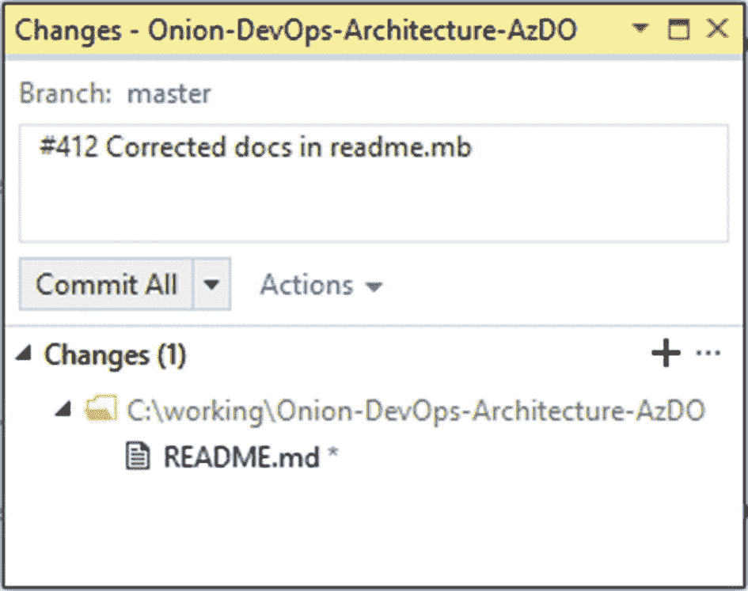

# 四、跟踪工作

现在，您已经了解了专业 DevOps 环境的功能以及可能成为其中一部分的工具组合，我们将深入了解 Azure DevOps 系列中的每个产品，并以适当的方式进行设置。您当然希望定制配置，但是您建议的配置在 80%的情况下都很好。如果你已经读过金、斯帕福德和贝尔的《凤凰计划》这本书，你会认识到我们在本章中实现的原则。您可能希望创建一个新项目，以便在阅读时测试不同的配置。创建 Azure DevOps 项目后，浏览一下您的项目设置，然后选择您想要启用的产品。

在图 [4-1](#Fig1) 中，您可以看到我启用了所有产品。对于您的团队，您将希望为他们配备 Visual Studio 企业版订阅(以前称为 MSDN 高级版)，以便他们拥有所有产品的许可。你会需要它们的。如果您使用免费或较低的许可证，软件包是您将错过的第一个。随着我们阅读这本书，您将会使用 Azure DevOps 系列中的所有产品。

图 4-1

您可以启用或禁用 Azure DevOps 系列中的任何产品

## 更改您的过程模板

本节的标题不是“选择您的过程模板”您将这样做，但是您的组织有一个工作流，您必须捕获它，并使过程模板忠实地模拟该工作流。DevOps 的第一个方法是“让工作可见”的原则 Azure Boards 是为你的作品造型的首选工具。Azure Boards 使用工作项来跟踪工作单元。一个工作项可以是任何类型的，并且有一个状态以及您想要的任何数量的其他字段。当您考虑您的工作层次结构时，不要立即使用内置的示例层次结构来创建工作项。相反，想想你已经做的工作和一些工作类型之间的父子关系。例如，在一个营销部门，图 [4-2](#Fig2) 中的结构可能是合适的。

图 4-2

营销部门的营销活动被分解为单独的项目

这个营销部门决定他们只需要三个层次的工作。一个活动可以有多个活动项目或产品积压项目。一个活动项目和一个产品积压项目可以有多个任务。在顶层，他们可以在活动级别或执行级别进行跟踪。一个单独的迭代或冲刺是用任务来跟踪的。如果您需要更高级别的分组，您可以拥有任意数量的更高级别的投资组合积压。即使内置的过程模板包括 Epic ➤特性➤产品待定项，您也会很快发现它不适合您的组织。您需要禁用大多数内置的工作项类型，并创建您自己的工作项类型，以便您可以命名它们，并只放置在您的团队环境中有意义的字段和状态的进展。

你可以考虑以下工作类型来激发创造力，以捕捉你的组织世界的模型。请注意，我没有说“设计模型”您的模型已经存在。你需要捕捉现有现实中的名词和动词，让 Azure Boards 代表已经存在的东西。如果您捕获了错误的模型，它就不合适，并且您的同事将很难跟踪他们的工作，因为它没有意义。因此，考虑以下类型:

*   商业计划

*   适销特征

*   预算、进度和资金的可计划工作

*   要完成的单个任务

这成为你今后使用 Azure Boards 的基础。您绝不会想到用 Northwind 或 AdventureWorks 数据库模式启动一个新的应用。那些桌子是别人选的。这种模式不符合您试图存储的数据的性质。同样，内置流程模板的模式也不适合您的组织。你需要加载你自己的模型。一旦您有了您的模型，您需要指定每个主要实体(工作项)的过程。例如，如果您正在写一篇文章或一本书，您可能会创建一个章节工作项，并在看板上指定状态进展，如图 [4-3](#Fig3) 所示。

图 4-3

这些列都映射到一个工作项的状态，并且每一列都可以被分配一个 Done 的定义

通过提前确定某个级别的工作项目从创建到完成的过程，您可以组织您的团队。每个状态或董事会通道都应该由一种类型的角色拥有。例如，如果你有一个利益相关者被指定为在屏幕草图开发出来之前给它放行的人，那么这个利益相关者应该有一个他们拥有工作的专栏。每一个工作项目都由看板上的一个可视卡片来表示，它们所在的列中的卡片是他们要工作的。如果利益相关者什么都不做，卡片就堆积在那一栏中，由于那一栏中的瓶颈，什么都没有开发出来。仪表板报告可以每天显示这一点，这样任何列都不会有太多的工作。利益相关者的工作要么是批准屏幕的草图，要么是发起一个对话来修正它。在任何情况下，你都不希望一个坏的屏幕被编码。那会更糟。通过创建大量的列，映射到工作项的状态，您可以在一个已知的过程中移动工作，其中每一列都有一种类型的角色，负责执行一组已知的工作，然后将在制品 WIP 转发到下一列。从质量控制的角度来看，每个开始工作的人都有义务检查 WIP，看看工作是否准备好了。如果有什么东西丢失了，在错误进一步向下游传播之前，您可以停止该行并得到纠正。

对于软件团队来说，在 Scrum 过程模板的情况下，预先填充了产品 backlog 项目的 Backlog 级别，或者在敏捷过程模板的情况下，预先填充了用户故事的 Backlog 级别，是进行分支和拉式请求以及设计测试用例的适当级别，正如您将在本文后面看到的。迭代或者冲刺可以从这个级别的工作项目中进行计划。然后，任务可以日复一日地被有机地创建、完成或销毁。基于最低的积压水平制定计划，然后在 sprint 期间根据需要将这些计划分解成任务，这通常是好的。

## 工作项的类型

根据您在创建项目时所选择的过程模板，您将从一组预定义的工作项类型、状态和工作板上的泳道开始。您应该更改这些模板，因为只有三个内置的流程模板，而且它们都非常基础。除了非常简单的项目，不要期望在没有定制的情况下使用它们。启动项目时，您有三个过程模板可供选择。如果您已经创建了一个项目，并且您想要选择一个不同的过程模板，那么您就不走运了。创建新项目。如果那艘船很久以前就起航了，不要担心。您可以将任何项目模板变形为您想要的任何内容。

项目模板的选择有 CMMI、敏捷和 Scrum。Scrum 模板可能是本书写作时使用最广泛的，也是维护最多的模板。但是基本模板是新的，并且已经被简化到仅仅是基本的。如果你不知道使用什么流程模板，也不知道这些之间的区别，**选择基本模板**、、T3】 1 、T5，从那里修改。这是最少预先指定的，您可以添加任何您喜欢的内容。

您将看到内置过程模板中的一些相似之处和不同之处，但是它们的共同点多于不同点。图 [4-4](#Fig4) 中的表格说明了模板的配置。

图 4-4

内置过程模板附带了一组需要自定义的工作项类型

您可以看到过程模板是多么的相似，并且您应该检查每个模板以获得一些想法，因为每个工作项都配置有一定数量的字段，并且每个工作项的字段很可能不符合您的需要。与数据库模式一样，如果继续使用未使用的表和列，数据集最终会有许多空值。这导致了报告的混乱。如果您不打算使用某个字段，请自定义您的模板并将其从工作项中移除或隐藏。简单更好。

您可能认为前面的过程是如此的相似，以至于您从哪一个开始并不重要，但是需求级工作项类型可能会帮助您做出决定。下面是这个关键工作项类型中的字段，如图 [4-5](#Fig5) 所示。

图 4-5

每个过程模板的主要工作项类型的结构

正如您所看到的，流程模板在这一点上开始出现分歧。您可以隐藏内置工作项类型的字段，但不能移除它们。添加自定义字段而不是隐藏大多数内置字段是一种更简洁的工作跟踪数据模型。

## 定制您的流程

与任何项目管理工具一样，使用 Azure DevOps，您可以定制工作的状态。摆在你面前的任务是确保对工作完成所需要经历的所有状态进行建模。很多工具都提供了类似这样的板，如图 [4-6](#Fig6) 所示。

图 4-6

每个棋盘都从简单的状态开始

这个过程对于家里的待办事项列表来说是没问题的，但是它不支持任何类型的严肃软件开发项目。软件开发生命周期中有更多固有的活动。不管你的团队是否喜欢使用 Scrum 或看板，或者其他方法，你都需要决定在任何给定的时间工作可能处于的独特状态。下面是一个你可能选择的非常常见的州列表。每一个都会在你的板上显示为一列。注意，我使用通用术语“卡”来代替工作项、问题、产品待办事项、用户故事等等。在对你的板建模时，每一项工作都将在数字板上表现为一个数字索引卡。我们建议卡处于相应状态时的典型所有者。请注意，在很大程度上，所有权在产品管理和工程之间来回循环。关于角色，我们没有比这更具体的了。对于采用凤凰计划、、[和](#Fn2)、中概述的 DevOps 方式的团队来说，只有委托工作的人和交付工作的人。除此之外的任何组织都取决于团队，这与敏捷软件开发的宣言是一致的。 [3](#Fn3)

图 4-7

软件开发项目中常见状态的代表性董事会结构

如果你独自工作，前面的图 [4-7](#Fig7) 可能看起来有太多的状态，但是当你的团队中有三个或更多的开发人员时，你会很高兴你能够看到工作在哪里。没有这个结构，你会忘记是什么支撑着每一张工作卡片。让我们简化这些状态，以便我们可以看到一个不同的视图:

计划

*   想法/积压

*   定义

*   设计

*   测试规范

建设

*   实现

支票

*   检查

*   试验

*   稳定

*   发布；排放；发布

有趣的是，我们将代表建筑物的州夹在中间，两边各有四个州。如果你在没有适当规划的情况下直接进入建筑，有四类决策会让你犯错:

1.  想法:对构建什么的错误概念

2.  定义:分析差距或不清楚构建内容的范围

3.  设计:构建所需的技术/架构/模式决策

4.  测试规范:如何知道你已经构建了你需要构建的所有东西

同样，如果你是作为一个一两个人的团队来构建软件，你可以简化这一点，因为你经常沟通，并在这些事情发生时处理它们。对于比这更大的团队，您需要这些概念的某种形式，不管您决定用什么来命名状态或列。

## 使用流程

现在，您已经为您的组织确定了多少阶段或泳道是合适的，您需要将您的版本控制系统与 Azure Boards 集成，以便能够跟踪与卡(或 Azure Boards 中的工作项)相关联的每个代码或资产变更。

虽然组织我们的版本控制系统将在本书的后面讨论，但是我们现在将讨论为了集成那些变化要做的基本事情。GitHub 于 2018 年被微软 [4](#Fn4) 收购，在战略上意味着成为微软未来的优质 Git 源代码控制产品。这项工作今年正在进行，以实现这一点:微软广告登录，自动拉请求链接，等等。如果你的代码已经在 GitHub 里面了，你可以在今天写的时候做一些链接。在您的 Azure DevOps 项目设置中，您可以连接您的 GitHub 帐户。参见图 [4-8](#Fig8) 。

图 4-8

导航到项目设置➤板➤ GitHub 连接，以开始该过程

### 链接提交

如果你还不是 GitHub 用户，你可以在 Azure Repos 中使用 Git 源代码控制。在图 [4-9](#Fig9) 中，我们正在从 Visual Studio 内部执行一个提交到我们的 Azure Repos Git 存储库。

图 4-9

Visual Studio 中的提交可以通过包含# {工作项 id}来自动链接工作项

在 Azure Boards 中，将提交与您的工作项链接起来所需要做的就是用工作项编号开始提交消息。你应该每次都这样做，即使你是一个人工作。除了对工作项需要什么变更有更好的可追溯性之外，它将鼓励团队通过只对他们面前的工作项进行变更来控制范围并保持在正轨上。

### 保持心流

作为一名开发人员，浏览代码时很容易分心，因为你会看到重构的机会，你会想让代码变得更好。在一个小时的编码工作后，你会发现你甚至没有在你计划完成的项目上工作，这种情况并不少见。通过设置一个团队规则，您将总是将提交与一个工作项联系起来，您可以让您自己和您的团队成员每天都处于最有成效的状态。

不管您选择使用哪个 Git 工具，以当前工作项的编号开始提交消息都会导致 Azure Boards 进行链接。

图 4-10

Azure Boards 自动将工作项与相关的 git 提交和构建链接起来

在图 [4-10](#Fig10) 中，您可以看到工作项#412 已经与两个 git 提交以及包含这些提交的两个结果构建相链接。如果你标记了你的提交，但没有自动看到这一点，请检查 Azure Repos 设置，确认队友没有关闭这一功能。对于新项目，它是默认打开的，但是对于从外部源导入的存储库，它可能不是默认打开的。在这种情况下，您需要为新的存储库启用它。

### 从 Azure 板分支

在 Azure Boards 中处理任何类型的工作项时。你会想在整个过程中建立他们。当您分析所需的更改并创建屏幕模型或任何其他文档时，要么附加文档，要么将其包含在 Git 存储库中。当您准备好开始编码时，创建一个分支。如果你知道如何组织你的分支机构，那么你就领先了。如果您想知道选择什么分支策略，那么保持简单，使用普通的特性分支，而不是“特性”名称空间。有关可用分支策略的更多研究，请参见微软的分支组织文档。 [5](#Fn5)

当开始在一个工作项目上编码时，让 Azure Boards 为你做工作。在图 [4-11](#Fig11) 中，你可以看到我们可以直接从板上创建我们的特征分支。

图 4-11

通过点击菜单图标，我们可以为工作项的开发创建一个新的分支

从这里开始，我们想要维护我们团队的分支约定。

图 4-12

将工作项编号放在分支名称中，以保持它们的组织性

你可以创建任何你能想到的分支方案，所以保持简单。将工作项编号放在开头，这样您就能够找到您的分支。然后，使用所有小写破折号。分支名称中不能使用空格。在您的分支名称中包含工作项目编号的一个额外好处是，它将是一个**持续的提醒，提醒您保持在正确的轨道上**，并且只对您面前的当前工作进行必要的更改。

现在您已经有了工作项的分支，转到 Visual Studio 并从团队资源管理器中签出新的分支，如图 [4-13](#Fig13) 所示。

图 4-13

使用团队资源管理器查看分支

你所做的任何承诺，然后留在新的分支。如果您将特性分解为用户故事和任务，请记住将提交消息标记为您正在处理的最具体的工作项。为了保持记录，您将有一个对应于您的特性(或者问题，或者用户故事)的分支，然后您将有单独的提交标记到它或者您已经处理过的任何子项目。

当您完成工作并准备合并您的分支时，您可以创建一个拉请求。

### 使用拉请求合并

在 Azure DevOps 中，有几个地方可以创建拉请求。虽然您可以在没有拉请求的情况下执行 Git 合并，但是使用 Git 合并允许您的团队集成一个正式的检查过程，这是发现和防止缺陷被发送到您的客户的一种行之有效的方法。

图 4-14

在工作项屏幕中，您可以创建一个拉请求

在图 [4-14](#Fig14) 中，我们可以看到为工作项创建的分支。当我们完成构建工作项所代表的特性时，我们可以创建一个 pull 请求，这样我们的团队就可以将变更带回主分支。

图 4-15

您可以选择个人或组作为拉式请求审阅者

创建拉动式请求后，您的团队将会收到通知。他们将能够看到和浏览您带来的更改。他们将能够对这些变化发表评论，如果有必要，甚至可以进行交流。这提供了一个在代码合并到 master 中之前进行任何更改的机会。如果需要任何更改，只需在分支上进行更改。拉请求将自动更新自身。拉请求在分支级别操作，而不是在提交级别。因此，如果您需要做更多的工作和进行更多的提交，您的 pull 请求不会失效。获得批准后，您可以完成您的拉取请求并监控自动合并，如图 [4-16](#Fig16) 所示。

图 4-16

在批准人将拉式请求标记为已批准后，完成该请求

## 包裹

当使用 Azure Boards 来管理你的软件项目时，你会从与 Azure DevOps 家族的自动集成中受益。这一章虽然展示了一些神奇的功能，但只是触及了 Azure Boards 的皮毛。本书的目的不是成为 Azure DevOps 的全面功能指南。更多关于 Azure Boards 的阅读，请访问官方文档。 [6](#Fn6)

我们已经带您完成了定制您的主板的微工作流程，并通过您的定制流程处理软件变更。图 [4-17](#Fig17) 显示了这个小例子中的细节层次。当你通过你的板跟踪你的工作时，你的工作项目将会有更多的信息。

图 4-17

只要在 Azure Boards 上跟踪你的工作项，它就会变得信息丰富

有了这个工具，您就拥有了世界级的项目跟踪能力，使您能够专注于您的代码。在下一章，我们将关注 Azure Repos，但更重要的是，如何成功地设置您的 Git 存储库。

## 文献学

*采用 Git 分支策略*。(未注明日期)。检索 2019 年 2 月 18 日，来自 [`https://docs.microsoft.com/en-us/azure/devops/repos/git/git-branching-guidance?view=azure-devops`](https://docs.microsoft.com/en-us/azure/devops/repos/git/git-branching-guidance%253Fview%253Dazure-devops)

*Azure Boards 文档*。(未注明日期)。检索自 [`https://docs.microsoft.com/en-us/azure/devops/boards/?view=azure-devops`](https://docs.microsoft.com/en-us/azure/devops/boards/%253Fview%253Dazure-devops)

贝克，k .，格林宁，j .，马丁，R. C .，比德尔，m .，海史密斯，j .，梅勒，s .。。marick b .(2001 年)。敏捷软件开发宣言。检索 2019 年 2 月 18 日，来自敏捷联盟: [`http://agilemanifesto.org/`](http://agilemanifesto.org/)

Kim，g .，Behr，k .，和 Spafford，G. (2013 年)。*凤凰计划:一部关于它的小说，DevOps，帮助你的企业赢得*。检索 2019 年 2 月 18 日，来自 [`https://amazon.com/phoenix-project-devops-helping-business/dp/0988262592`](https://amazon.com/phoenix-project-devops-helping-business/dp/0988262592)

*微软以 75 亿美元收购 GitHub*。(未注明日期)。检索 2019 年 2 月 18 日，来自 [`https://news.microsoft.com/2018/06/04/microsoft-to-acquire-github-for-7-5-billion/`](https://news.microsoft.com/2018/06/04/microsoft-to-acquire-github-for-7-5-billion/)

<aside class="FootnoteSection" epub:type="footnotes">Footnotes [1](#Fn1_source)

成功的陷阱:从基础开始继承新的过程模板

  [2](#Fn2_source)

金、贝尔和斯帕福德，2013 年

  [3](#Fn3_source)

Beck 等人，2001 年

  [4](#Fn4_source)

微软将以 75 亿美元收购 GitHub

  [5](#Fn5_source)

采用 Git 分支策略。

  [6](#Fn6_source)

Azure Boards 文档，未注明

 </aside>