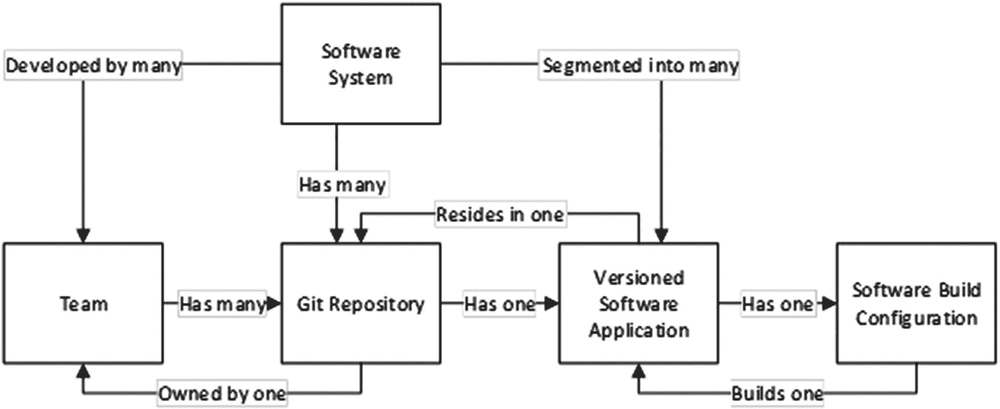
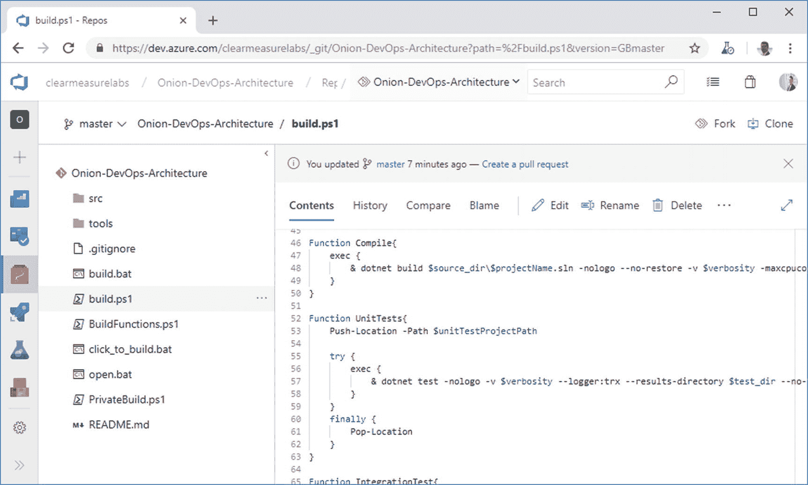
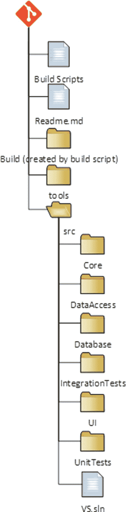

# 五、跟踪代码

版本控制系统(VCS)在过去的 20 年中已经完全成熟，Git 版本控制系统已经成为软件世界中事实上的标准。事实上，这个星球上最大的活动源代码控制库，微软 Windows 源代码，已经被转换为 Git。像 Subversion 和 Team Foundation 版本控制(TFVC)这样的集中式源代码控制系统已经让位于 Mercurial 和 Git。其中，Git 已经成为所有现代平台上开发人员的版本控制工具。在 Git 版本控制中跟踪代码是现代 DevOps 过程的一部分。在整个行业中，从业者将版本控制、源代码控制、VCS 和 SCM 作为同义词互换使用。

Azure Repos 是 Azure DevOps 家族中的版本控制系统。它支持源代码控制的旧 TFVC 格式，以及无限数量的私有或公共 Git 库。有一些导入工具可以将现有的代码库迁移到 Azure Repos 中，所以不管你的代码现在在哪里，你都可以把它移入。Azure Repos 不仅适用于 Visual Studio，还适用于任何其他 Git 客户端，例如 TortoiseGit，这是我最喜欢的 Windows 资源管理器“右键单击”集成之一。出于本章和本书大部分内容的目的，我们将 Azure Repos 等同于 Git 版本控制。虽然 TFVC 将在未来十年内继续得到支持，但是任何新的投资都应该使用 Git 技术。

## 有多少仓库？

在以专业的方式设置 Git 存储库时，需要记住一些原则。首先，您的团队可能有多个存储库，除非您只发布一个产品。您的软件架构将与您的存储库设计的粒度有关。例如，如果您一起部署整个系统，而架构不支持只部署系统的一个子集，那么您很可能会将整个系统放入一个 Git 存储库中。作为一个组织，你可能有多个软件团队。图 [5-1](#Fig1) 是一个实体关系图，帮助你理解如何将你的系统分解到 Git 仓库中。



图 5-1

设计 Git 存储库时的关系规则

您的团队将拥有您的 Git 存储库。单个 Git 存储库不能由多个团队拥有或开发。对于过去几年的集中式版本控制系统，这是可能的，因为这些系统支持子级分支。这些系统托管了一个不同类型的存储库。术语“存储库”的重复使用在 TFVC 和 Subversion 的用户中引起了一些混淆，它们愉快地托管多个软件系统，同时允许在子级进行分支。虽然合并在很多时候很困难，但是这些工具确实支持它。Git 的存储库设计是不同的。克隆和分支仅在顶层完成。因此，要管理多个软件，您需要创建多个 Git 存储库。在 Azure Repos 中，一个项目可以有无限数量的 Git 存储库，因此您有办法维护相关 Git 存储库的分组。

既然我们理解了团队必须有一个专用的 Git 存储库，我们的下一个关系就是软件应用本身。不管软件应用的大小，都应该只有一个。你的应用可以是一个除了 Azure 功能什么都没有的小型微服务，也可以是一个非常大的应用。如果它保持独立的版本控制，并且可以独立部署，那么它必须驻留在自己的 Git 存储库中，它拥有版本控制的概念。如果你是一个 Git 和构建专家，读到这里，你可能会发明一个可以违反这个规则的定制范例，但是对于我们其他人来说，这个规则是正确的。让我们考虑一些这样的例子:

1.  您有一个非常大的 Visual Studio 解决方案，用于一个超过 10 年的软件系统。它有一些 web 应用、一些 Windows 服务、一些计划作业和一个 SQL Server 数据库。要问的问题是“它的任何部分是否独立于其他部分构建或版本化？”如果答案是否定的，那么所有这些都属于同一个 Git 存储库。如果有时您对网站进行了更改，然后决定不将其余部分部署到产品中，请不要担心。这和独立版本化是不一样的。

2.  你设计了一个有独立应用或微服务的系统。每个应用都拥有自己的小型数据库，各部分通过队列异步通信。每一个都可以以完全不同的节奏改变和部署。在这种情况下，为了保持版本独立性的能力，您可以将每一个都分割到它自己的 Git 存储库中。

有一些例子，您可能将一个系统分解成大部分独立的应用，但是希望将它们保存在同一个 Git 存储库中。Azure DevOps 本身就是一个很好的例子。这种划分有利于部署架构，而不是版本独立性。Azure DevOps 产品由几十个服务组成，但它们都驻留在一个 Git 存储库中，一个单独的(但很大的)团队用 Git 开发系统。整个系统是用一个单一的版本号一起构建和部署的。你可以在线阅读更多关于 Azure DevOps 团队如何做 DevOps 的内容。遵循一个经验法则:把你当前的 Visual Studio 解决方案放在它自己的 Git 库中。

## 您的 Git 存储库中应该有什么

经常有关于在应用的 Git 存储库中存储什么的讨论。简短的回答是“储存你能储存的一切。”绝对永远不会对。(前一句除外。)但是，几乎所有东西都存储在 Git 存储库中，包括

*   数据库模式迁移脚本

*   Azure 资源管理器(ARM) JSON 文件

*   PowerShell 脚本

*   试验

*   构建脚本

*   形象

*   内容资产

*   Visio 架构蓝图

*   文件

*   依赖性，包括不是来自包管理器的库和工具

考虑到有一些异常不能提交给 VCS，我将介绍一些开发软件所需的项目，这些项目没有存储在您的 Git 存储库中。你可以看到这张单子上的物品已经不适合存放了。虽然从技术上来说储存这些物品是可能的，但是痛苦开始变成一种风险的权衡。

*   很明显是窗户。

*   Visual Studio 或 VSCode，即使可以直接从磁盘运行它。

*   特定于环境的数据和配置；这不属于软件，这属于环境。

*   秘密；它们是秘密的，所以你不应该知道它们。

*   经常更改的大型二进制文件，例如 AutoCAD 和 Revit 等 Autodesk 产品中的文件。

我想说。NET 核心，因为。NET Framework 在这里有一些基本的区别。与。NET 框架应用中，框架版本作为操作系统本身的一个组件安装在计算机上。所以，很明显你不入住。您只签入您的应用所依赖的库。如果您需要 7Zip 或 Log4Net，您可以获得这些库并将其签入 Git 存储库，因为您依赖于它们的特定版本。随着包管理器的出现，关于何时不从 npm 或 NuGet 签入包的争论愈演愈烈。这个争论还没有解决，但是。NET 框架应用，我的建议是签入所有的依赖项，包括包。

这从根本上改变了的体系结构。NET 核心。与。NET Core，框架不是作为操作系统的一个组件安装的。NuGet 将框架交付给运行构建过程的计算机。此外。被打包成 NuGet 组件的. NET 核心库已经被提升到框架的地位，并以与。NET 核心 SDK 组件有。因此，我的建议是。NET Core applications 的方法是保留默认值，不要将 dotnet.exe 恢复过程的结果提交到您的 Git 存储库中。在积极的开发下，SDK 组件和其他 NuGet 包的混合将会有很大的变化。一旦系统达到成熟，变化的速度变慢，移动并提交 **packages** 文件夹以锁定依赖关系的混合可能是合适的，因为包管理器不能绝对保证相同的依赖关系混合将在下个月或明年恢复。如果您想自己评估这一点并确定您的风险承受能力，您可以通过使用以下配置将 Nuget.config 文件添加到您的解决方案中，按应用轻松地检查包:

```
<?xml version="1.0" encoding="utf-8"?>
<configuration>
  <config>
    <add key="globalPackagesFolder"
        value=".\packages" />
  </config>
</configuration>

```

## Git 存储库的结构

我们已经讨论了如何确定我们的系统需要多少 Git 存储库。现在我们需要适当地考虑单个应用。不管应用的架构如何，我们与 VCS 的关系来自于 Visual Studio 解决方案。该解决方案可以包含一个称为应用的大型代码库，也可以包含一个称为微服务的小型代码库。就本指南而言，它们是相同的。

如果你是一个有经验的开发人员，你也许可以设计一个不同的结构来布局一个 Git 存储库；但是，如果您希望得到关于 Git 中所有内容应该放在哪里的说明性指导，请考虑下面的建议。在 Azure Repos 中，Figure [5-2](#Fig2) 描绘了一个分解良好的 Git 存储库的顶层。



图 5-2

不管您正在开发的 Visual Studio 软件是什么类型，Git 存储库的顶层都是非常标准的

您可以在顶层看到一些目录和一些脚本文件。请注意，您在顶层看不到 Visual Studio 解决方案。那是故意的。让我们把您需要的目录和文件放在一个组织良好的 Git 存储库中:

*   /src/:应用代码位于此目录中，从解决方案文件开始。这是多种编程平台中的常见约定。

*   /tools/:构建过程所需的任何工具都在这个目录中。常见的需求有 7Zip、Octo.exe 等。

*   /build.ps1:这是私有构建脚本。无论您是否这样命名，您都需要在顶级目录中有自己的私有构建脚本。

*   /click_to_build.bat:一个鼠标/键盘友好的助手，它向构建脚本添加了一个“& pause ”,以便控制台窗口保持打开以检查构建输出。

*   /open.bat:一个鼠标/键盘友好的助手，通过双击或回车打开 Visual Studio 解决方案。

*   /build/:该目录由构建脚本自动创建和销毁。它不应该致力于源代码控制。这是测试/发布输出的目的地，本质上是临时的。

前面的实现是本书的示例应用。更一般地，结构应该如左图所示。这种结构适用于小型微服务以及具有数百个屏幕和功能的超大型应用。请注意，此结构仅向下延伸到 Visual Studio 解决方案级别以及该解决方案中的文件夹。Visual Studio 项目中的分离会有所不同。

规则如下:

1.  Git 存储库的顶部将包含您的私有构建资产。这包括实际的私有构建脚本、助手函数和任何资产/快捷方式，以便在本地工作站上运行私有构建。

2.  Git 存储库需要一些关于它包含什么以及如何构建它包含什么的基本文档。这就是 Readme.md 的用武之地。你可以用。txt 或者。docx，但 Azure Repos、GitHub 和许多其他工具可以很好地处理 markdown 格式，并可以将该文件显示为仪表板页面。

3.  “build”目录是一个临时目录，将包含由您的构建脚本生成的内容。随便你怎么称呼它，但是这个文件夹不会提交给 Git。请确保将其添加到您的。gitignore 文件。无论是测试输出还是通过运行“publish”命令创建的工件，都可以在私有构建过程的本地和持续集成构建的在线使用这个文件夹来生成输出。

4.  “tools”目录可以包含构建过程所需的任何工具，包括构建框架(如果您选择使用的话)。与。NET Core，简化了构建过程。许多开发人员喜欢 psake 等构建工具。

5.  “src”目录(源)包含 visual studio 解决方案和应用的所有代码。Visual Studio 解决方案文件应该在此文件夹中

6.  Visual Studio 解决方案中的每个项目/程序集都有自己的文件夹。注意将这些文件夹与 Visual Studio 解决方案放在同一目录级别。

无论应用类型如何，都要将代码嵌套在/src 文件夹中。。NET 框架，。NET Core，Xamarin，TypeScript 等。为构建资产保留存储库的顶层，如图 [5-3](#Fig3) 所示。



图 5-3。

## 选择分支模式

如果您没有按顺序阅读这些章节，我们在第 [4](04.html) 章中讨论了在处理工作项目时的分支和合并。由于分支是对相关代码更改进行分组的一种方式，所以请确保对应用的每个更改都使用分支。这条经验法则会引发更多问题。谷歌、脸书和负责 Azure DevOps 系列产品的微软团队都使用“基于主干的开发” <sup>[2](#Fn2)</sup> 你还可以在微软的分支文档上研究其他可用的分支策略。 <sup>[3](#Fn3)</sup>

使用基于主干的开发。在基于主干的开发中，主干(master)就像一棵树的主干一样，比树枝更粗，而且总是越来越长。分支的存在时间很短，规模也很小，它们的存在是为了方便审查拉式请求流程。每天以合并分支为目标。

“基于主干的开发”的声音可能会让你认为采用它就意味着不分支。一点也不。每个分支策略都包括分支。分支是将提交到主代码行(Git 中的 master)的提交分组的一种非常有效的方式。正如第 [4](04.html) 章所述，拉动请求是你与团队一起评审一组产品变更的方法。当拉取请求被批准时，分支机构被合并到主机构中并被删除。在对分支的 pull 请求被批准之前，这些提交将保留在分支上，保证不会破坏 master 的稳定性。通过这个审查过程，团队一起保持主分支的稳定。以下是有效使用分支的一些规则:

*   让它们非常短暂:不要试图在单个分支上添加大量新功能。如果你的用户故事是小而谨慎的，你将能够在 24 小时内创建/拉请求/合并/删除一个分支。进入第二天的分支是一个危险信号，应该引起团队讨论。

*   将它们与一个工作项联系起来，这样分支上的每个变更都与该工作项相关。

*   当其他应用有开放分支时，避免大型应用重构——如果你违反了这条规则，将会有痛苦的合并冲突。

*   将您的 DevOps 管道配置为在所有分支上运行，以便从构建和首次部署中获益。如果您的更改第一次部署是在 pull 请求之后，那么您将会把更多的 bug 传递到 master 上。

## Azure Repos 配置中的有用提示

因为 Azure Repos 集成在 Azure DevOps 项目中，所以您需要了解名称和 URL 是如何构建的。一个项目意味着容纳多个 Git 存储库。因此，项目名称包含在 Git URL 中。考虑这个相同的项目名称。

```
My Clunky Project

```

Azure Repos 将为初始克隆生成一个 URL，如下所示:

```
https://clearmeasurelabs@dev.azure.com/clearmeasurelabs/My%20Clunky%20Project/_git/My%20Clunky%20Project

```

请注意，项目名称中的空格在 URL 中被转换为%20。虽然这可以正常工作，但是有些自动化场景和工具不能正确处理 URL 中的%20。如果在创建项目时它在您的控制之内，只需在项目名称中避免空格。本书使用的公共 Azure DevOps 项目是这种技术的一个很好的例子:

```
https://dev.azure.com/clearmeasurelabs/Onion-DevOps-Architecture

```

这会产生一个 GIT URL，如下所示:

```
https://clearmeasurelabs@dev.azure.com/clearmeasurelabs/Onion-DevOps-Architecture/_git/Onion-DevOps-Architecture

```

当您在同一个项目中创建第二个 Git 存储库时，注意避免空格，这样您就有了一个干净的 URL:

```
https://clearmeasurelabs@dev.azure.com/clearmeasurelabs/Onion-DevOps-Architecture/_git/My-New-Repository

```

## GitHub 如何融入？

微软在 2018 年收购了 GitHub。 <sup>[4](#Fn4)</sup> GitHub 旨在成为微软生态系统内 Git VCS 托管的首选产品。在撰写本文时，Azure Repos 是完全集成的 Git 托管产品。因此，它支持客户所需的所有企业场景，包括无缝身份管理以及使用 Office 365 和 Active Directory 帐户登录。GitHub 在路线图上有这种集成，并将像 Azure Repos 一样无缝集成，但在撰写本文时，这项工作尚未完成。如果你的代码已经在 GitHub 上，不要移动它。保持它的位置，并集成 Azure DevOps 系列产品的功能。如果你的代码已经在 Azure Repos 中，不要移动它。

## 包裹

在本章中，我们介绍了在实现一个合适的 DevOps 环境时，如何正确地跟踪您的代码。我们讨论了如何确定 Git 存储库的大小和范围，以及应该有多少个。我们讨论了什么应该和不应该对你的 VCS 负责。我们分析了存储库中的结构，以及如何考虑和使用分支。当您创建或更新源代码时，遵循这个指南，您就不会出错。当您遇到复杂的情况时，请在牢记核心原则的同时计划调整。

既然我们已经了解了如何在？NET DevOps 环境，继续第 6 章，在那里你将学习如何设计和配置你的构建过程。

## 文献学

(未注明)。从微软的 DevOps 检索: [`https://docs.microsoft.com/en-us/azure/devops/learn/devops-at-microsoft/`](https://docs.microsoft.com/en-us/azure/devops/learn/devops-at-microsoft/)

*采用 Git 分支策略*。(未注明日期)。检索 2019 年 2 月 18 日，来自 [`https://docs.microsoft.com/en-us/azure/devops/repos/git/git-branching-guidance?view=azure-devops`](https://docs.microsoft.com/en-us/azure/devops/repos/git/git-branching-guidance%253Fview%253Dazure-devops)

哈曼特博士(未注明)。从主干基础开发中检索: [`https://trunkbaseddevelopment.com/`](https://trunkbaseddevelopment.com/)

*微软以 75 亿美元收购 GitHub*。(未注明日期)。检索 2019 年 2 月 18 日，来自 [`https://news.microsoft.com/2018/06/04/microsoft-to-acquire-github-for-7-5-billion/`](https://news.microsoft.com/2018/06/04/microsoft-to-acquire-github-for-7-5-billion/)

<aside class="FootnoteSection" epub:type="footnotes">Footnotes [1](#Fn1_source)

微软的开发人员

  [2](#Fn2_source)

哈曼特

  [3](#Fn3_source)

采用 Git 分支策略。

  [4](#Fn4_source)

微软将以 75 亿美元收购 GitHub

 </aside>