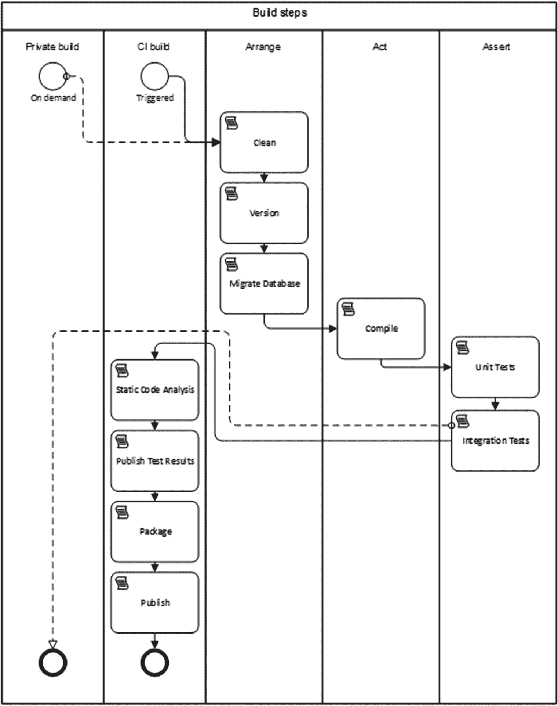

# 六、构建规范

在第 [5](05.html) 章中，您学习了如何在准备 DevOps 自动化时正确地组织您的 Git 库。在本章中，你将学习如何构建代码。您将了解私有构建和集成构建的区别，集成构建通常被称为持续集成构建或 CI 构建。您还将了解如何在 Azure DevOps 服务中配置您的 CI 构建。如果您按照代码进行操作，请确保您已经克隆了示例应用。

```
https://clearmeasurelabs@dev.azure.com/clearmeasurelabs/
    Onion-DevOps-Architecture/_git/
    Onion-DevOps-Architecture

```

## 建筑物结构

2007 年，Paul Duvall、Steve Matyas 和 Andrew Glover 出版了一本名为*持续集成:提高软件质量和降低风险*的书。 <sup>[1](#Fn1)</sup> 当时，持续集成是一个新话题，业界正在进行一场意义深远的对话。这本书记录了持续集成实践的成熟结构。其中明确定义了两种类型的构建:

*   私人建筑

*   集成构建

私有构建只在单个开发人员工作站上运行，它是一种工具，可以知道即时更改不会破坏应用的稳定性。集成构建运行在共享服务器上，属于团队。它从许多开发者那里构建代码。随着分支模型的流行，集成构建已经适应于在特性分支和主分支上运行。在我们继续讨论如何实现我们的构建之前，让我们回顾一下构建过程的结构和流程。

### 功能分支上的构建流程

在我们讨论私有构建或 CI 构建的步骤之前，让我们从较高的层面来看一下。当您开始处理一个用户故事或者软件变更时，不管分支策略如何，您都将创建一个分支。还记得在第 4 章中，您了解到即使那些使用基于主干的开发仍然使用短命的分支。图 [6-1](#Fig1) 显示了当你在一个特性分支上工作时发生的构建活动的流程。


图 6-1

功能分支上代码的构建过程跨越三种环境

当您更改代码时，您将在每个停止点运行您的私有构建。这让你安全。如果你不小心打碎了什么东西，你马上就会知道。因为你在 Git 中工作，这是一个分散的版本控制系统，所以你会犯很多短的错误。这使您能够非常容易地撤消更改。根据您的判断，您将在本地运行私有构建。在我们的应用中，它是一个 PowerShell 脚本，在本章的后面会有更详细的描述。当您决定将变更推送到团队的 Git 服务器时，CI 构建将检测这些变更，并在团队的构建服务器上运行集成构建流程。一旦成功，构建将归档构建的工件，很可能在 Azure 工件中，一个 NuGet 存储库。然后，一个自动化部署脚本将触发并部署那些构建的工件到一个专用于持续集成过程的环境中。这种环境最好的名字是“TDD 环境”此环境的目的是验证(1)可以部署新版本的软件，以及(2)新版本的软件仍然通过所有验收测试。这确实要求您的代码库中有完整的系统验收测试。如果你没有，他们很容易开始发展。在验收测试成功并且您确定您的更改已经完成之后，作为开发人员，您将创建一个 pull 请求，以便您的团队知道您相信您的分支上的工作已经完成，并且代码已经准备好被检查以包含在主分支中。

### 主分支上的构建流程

一旦拉取请求被批准，您的分支机构将自动合并到主机构中。无论你用的是 GitHub 还是 Azure Repos 都是如此。监视更改的 CI 构建将会启动。成功后，构建工件将作为 NuGet 包存储在 Azure 工件中。然后，构建将被部署到 TDD 环境中，以验证可部署性并运行自动化的全系统验收测试。一旦这些验收测试成功完成，这个构建就被认为是一个有效的发布候选。也就是说，它是潜在发布的一个编号的候选，可以在手动测试环境(或者甚至额外的自动化测试环境)中进一步验证，并在生产过程中部署。图 [6-2](#Fig2) 显示了主分支构建的生命周期。

软件构建的可部署包可以像 zip 文件一样简单，但是在。NET 中，NuGet 包是标准的，它们应该被存档在 Azure 工件中。


图 6-2

主服务器上变更的构建过程以新的发布候选结束

### 构建的步骤

在我们介绍如何在您自己的工作站上和 Azure 管道中配置构建之前，让我们回顾一下私有构建和 CI 构建必须具备的步骤。



图 6-3

私有和配置项构建有许多共同的步骤

私有构建在开发人员工作站上运行。CI 构建运行在共享的团队构建基础设施上，无论是完整的服务器还是 Azure 管道。测试驱动开发 <sup>[2](#Fn2)</sup> (TDD)引入了 Arrange、Act、Assert 的验证概念。流程如下:

1.  安排:在任何验证中，无论是自动化测试、手动测试、静态分析运行，还是 CI 构建，验证过程都要负责建立一个可以运行的环境。

2.  Act:在这一步中，您执行一个流程，运行一些代码，启动一个过程，等等。

3.  断言:最后，你看事情是怎么进行的。你检查以确保发生的事情与你预期的一致。如果发生的事情符合预期，那么您的验证就成功了。如果它没有达到预期，您的验证就失败了。

就像在 TDD 中一样，构建过程是一种正式的验证。您将需要在构建脚本中添加步骤来设置构建运行的环境(安排)，运行从源文件到可执行形式的转换(Act)，并检查尽可能多的东西(断言)。在图 [6-3](#Fig3) 中，您可以看到我们的私有构建和 CI 构建中的活动类型。让我们一个一个地看一下:

*   开始:私有构建将由开发人员按需触发。当新的提交发生时，CI 构建将由 Git 存储库上的观察器触发。

*   Clean:删除所有临时目录或文件，并清除先前构建的任何残余。

*   版本:内部版本号被压入任何需要输入的区域，以使生成的可执行软件被打上内部版本号。私有版本通常有一个硬编码的版本，比如 0.0.0 或 9.9.9，这样任何人都可以立即看出这个版本来自私有版本。在 Azure Pipelines 中，构建编号将来自环境变量，构建脚本应该将该编号推入相关位置，例如。NET 框架或 dotnet.exe 命令行。NET 核心。如果省略此步骤，将导致。NET 程序集将不会正确标记内部版本号。

*   迁移数据库:这一步代表应用运行所需的任何环境。大多数应用存储数据，因此需要创建一个数据库并迁移到当前模式，为后续的构建步骤做准备。在本书中，我们展示了使用 SQL Server 关系数据库模式的例子。

*   编译:这一步将源文件转换成程序集，并执行任何编码、转换、 <sup>[3](#Fn3)</sup> 缩小等操作，将源代码转换成适合在预期运行时环境中执行的形式。

*   单元测试:这是属于断言范畴的第一步。现在我们有了一个可以验证的软件形式，假设编译步骤成功，我们从最快的验证类型开始。单元测试执行不调用进程外的类和方法。英寸这是 AppDomain，它是内存空间的边界。因此，单元测试的速度非常快。

*   集成测试:这些测试确保应用的各种组件可以相互集成。最常见的是我们的数据访问代码可以与 SQL Server 数据库模式集成。这些测试执行跨进程遍历的代码。NET AppDomain，通过网络堆栈，到 SQL Server 进程)以验证功能。这些测试很重要，但是它们比单元测试慢几个数量级。随着应用的增长，预计单元测试和集成测试的比例约为 10:1。

*   私有构建成功:在这些步骤之后，私有构建就完成了。在开发人员工作站上运行不需要更多的东西。

*   静态代码分析:无论是 FxCop 系列的分析器、Ndepend 或 SonarQube 之类的产品，还是 JavaScript linters，CI 构建都应该在其验证列表中包含静态代码分析。它们很容易运行并发现自动化测试不会发现的错误。Capers Jones 将它们包括在他的研究中的三大缺陷检测方法中。 <sup>[4](#Fn4)</sup>

*   发布测试结果:此时，CI 构建已经成功，需要输出构建工件。每种应用类型都有一个过程，该过程以适合打包的方式输出工件，这是下一步。

*   包装:In。NET，这是将每个可部署的应用组件压缩到一个命名和版本化的 NuGet 包中的行为，例如，UI(ASP.NET 网站)、数据库(SQL Server 模式迁移资产)、BatchJob (Windows 服务、Azure 函数等)。)，以及验收测试(可部署的测试将在 DevOps 管道中运行)。这些 NuGet 包将被推送到 Azure 工件。虽然可以使用 zip 文件，但 NuGet 是. NET 的标准包格式。

*   发布:将打包的 NuGet 文件推送到 Azure 工件，以便它们可以通过 NuGet 提要获得。

*   CI 构建成功:持续集成构建现在已经完成，可以报告成功了。

您的私有构建和 CI 构建的实现可能与本书中显示的示例有所不同，但是要注意以适合您的应用的方式包括前面的每个步骤。现在您已经知道了构建的结构，让我们来看看如何在. NET 环境中配置和运行它们。

## 使用内部版本。NET Core 和 Azure 管道

Azure Pipelines 正在获得广泛的采用，因为它的兼容性和易用性，可以与驻留在任何地方的软件应用一起建立自动化的持续交付管道。无论是 GitHub 还是 Azure Repos，或者你自己的 Git 仓库，Azure 管道都可以提供构建和部署管道。持续交付有四个阶段，正如 2010 年的书*持续交付所描述的:通过构建、测试和部署自动化的可靠软件发布*。 <sup>[5](#Fn5)</sup> 这些阶段是

*   犯罪

*   自动化验收测试

*   手动验证

*   发布；排放；发布

提交阶段包括私有构建和持续集成构建。自动化验收测试阶段包括您的 TDD 环境以及代表验收测试的测试套件。UAT 环境，或者您选择的任何名称，代表了适合手工验证的部署环境。然后，最后的发布阶段进入生产阶段，在那里你的市场提供关于你为它创造的价值的反馈。让我们看看私有构建和 Azure 管道的配置，看看如何启用持续交付的提交阶段。

### 启用持续交付的提交阶段

在配置 Azure 管道之前，您必须有自己的私有版本。试图在没有这个基础的情况下创建一个 CI 构建是浪费时间和以后返工的原因。在本书附带的源代码中，您会发现一个名为。/build.ps1 "。该文件的完整列表在本章末尾。请随意将它用作您自己的构建脚本。NET 核心应用。它包含前面叙述的所有必要步骤，将作为您 CI 构建的良好开端。这个构建脚本包含恢复、编译、创建本地数据库和运行测试的步骤。第一次克隆存储库时，您会看到相当多的 NuGet restore 活动，这在后续的构建中是看不到的，因为这些包都被缓存了。图 [6-4](#Fig4) 显示了 dotnet.exe 恢复的输出，您只能在单击 click_to_build.bat 后第一次看到它


图 6-4

私有构建第一次运行时，您会看到比恢复步骤正常情况下更多的输出

Click_to_build.bat 是一个简单的助手文件，它通过添加一个“& pause”使运行私有构建变得简单而方便，这样当通过键盘或鼠标从 Windows 资源管理器调用命令窗口时，命令窗口将保持打开状态。在正常的开发过程中，您将重复运行私有构建，以确保您所做的每一个更改都是坚实、稳定的一步。您将使用一个本地 SQL Server 实例，并且构建脚本将在您每次运行该脚本时销毁并重新创建您的本地数据库。单元测试将针对您的代码运行。组件级集成测试将确保数据库模式和 ORM 配置协调工作，以在您的领域模型中持久化和水合对象。图 [6-5](#Fig5) 显示了启用了“安静”详细级别的完整构建脚本执行程序。


图 6-5

私有构建的输出可以显示在一个屏幕上，并且运行时间不到 1 分钟

这是一个简单的私有构建脚本，但是无论您向解决方案中添加多少代码以及向这些测试套件中添加多少测试，它都会随着您而扩展。事实上，即使您将一个又一个表添加到 SQL Server 数据库中，这个构建脚本也不必更改。在过去的 13 年里，这个构建脚本模式已经在多个团队、数百个客户以及从 CruiseControl.NET 到詹金斯、从 Bamboo 到 TeamCity、从 VSTS 到 Azure Pipelines 的构建服务器之旅中经过了彻底的测试。尽管有些部分可能会稍有变化，但请使用这个构建脚本来构建您自己的模型。结构是经过验证的。

既然已经有了基础构建脚本，就可以创建 Azure Pipeline CI 构建了。作为概述，图 [6-6](#Fig6) 显示了您使用的步骤，包括将您的发布候选包推送到 Azure 工件。


图 6-6

当您从私有构建脚本的基础开始时，Azure Pipelines 构建配置非常简单

许多默认设置适用于 CI 构建，不需要定制。让我们看一下重要的部分。首先，您将选择您的代理池。我选择了 Visual Studio 2019 的托管代理。为了便于说明，我使用构建设计器，而不是 YAML 选项。Azure Pipelines 中的所有构建和发布定义都将被转换为 YAML。在撰写本文时，YAML 工具、编辑器和市场集成尚未部署。因此，设计人员提供了完整的编辑体验。希望 YAML 的体验能够快速提升。当它完全完成时，您将能够将您的 CI 构建配置作为 YAML 文件保存在您的 Git 存储库中，就在您的应用旁边。您会希望这样做，因为任何没有用您的代码进行版本控制的逻辑都可能会破坏您的管道，因为它本质上与分支不兼容，因为只有一个版本的构建配置存在。

要继续进行 CI 构建配置，您需要设置执行 PowerShell 构建脚本的环境，该脚本包含与我们的私有构建共享的步骤。这意味着我需要一个 SQL Server 数据库。鉴于托管的构建代理没有安装 SQL Server，我需要到其他地方去找它。您可以使用 ARM 脚本在 Azure 订阅中提供数据库，以便您的集成测试拥有测试数据访问层的基础架构。用于此的 ARM 脚本是示例应用的一部分。在创建了集成测试可以使用的数据库之后，您希望确保您的编译步骤能够正确地处理版本控制。毕竟，这个构建的目的是创建一个发布候选。发布的候选版本必须被正确地版本化和打包，然后在您信任它在生产中运行之前通过一系列的验证。调用 PowerShell 构建脚本时，可以使用以下参数调用命令:

```
./build.ps1 ; CIBuild

```

即使在前面的命令中只有一个显式参数，所有的构建变量都可以作为环境变量用于任何脚本。图 [6-7](#Fig7) 显示了为该构建配置的变量。


图 6-7

构建变量作为环境变量可用于构建步骤

定义变量时，利用其他变量来建立适当的值。您会发现，一旦您创建了一些 CI 构建配置和变量集，这些模式就非常容易从一个应用移植到下一个应用。确保改变值，以便多个构建可以并行运行。在下文中，您将看到如何配置构建以支持特性分支上的并行构建。另一个非常重要的配置是构建号，它提供了我们构建的版本。在本章末尾显示的构建脚本中，我们有一些 PowerShell 变量，它们从 CI 构建配置中提取变量。构建配置和版本在以下位置捕获:

```
$projectConfig = $env:BuildConfiguration
$version = $env:Version

```

这样，您可以调用 dotnet.exe，以便每个 DLL 都被正确标记。查看编译解决方案时使用的命令行参数:

```
Function Compile{
  exec {
    & dotnet build $syource_dir\$projectName.sln
    -nologo --no-restore -v $verbosity
    -maxcpucount --configuration $projectConfig
    --no-incremental /p:Version=$version
    /p:Authors="Clear Measure"
    /p:Product="Onion DevOps Architecture"
  }
}

```

构建脚本还运行测试，输出。trx 文件，以便 Azure Pipelines 可以显示和跟踪测试的结果，因为它们随着时间的推移重复运行:

```
Function UnitTests{
  Push-Location -Path $unitTestProjectPath
  try {
    exec {
      & dotnet test -nologo -v $verbosity --logger:trx
        --results-directory $test_dir --no-build
        --no-restore --configuration $projectConfig
    }
  }
  finally {
    Pop-Location
  }
}

```

我们使用 NUnit 作为这个应用的自动化测试框架。请注意，我们在制定命令时很少进行硬编码。这是为了使我们的构建脚本更易于维护。它也可以在我们的团队和其他应用中进行标准化，因为差异出现在文件顶部的属性中。请特别注意参数–no-restore 和–no-build。默认情况下，任何对 dotnet.exe 的调用都将重新编译您的代码并执行 NuGet restore。您不希望这样做，因为这会浪费宝贵的时间，而且会在测试之前创建新的程序集。

在构建脚本完成之后，我们可以运行我们的静态分析工具，然后将应用及其各种组件作为∑推送到 Azure 工件。nupkg 文件，本质上是∫。zip 文件，但有一些特殊的区别。

除了构建配置的步骤之外，还有一些其他选项应该从它们的默认设置中进行更改。首先是内部版本号。默认情况下，您将日期作为版本号嵌入。这当然可以是默认的，但是要使用 SemVer、或语义版本化、模式( [`https://semver.org/`](https://semver.org/) )，您必须将“构建编号格式”更改为以下格式:

```
1.0.$(Rev:r).0

```

此外，当您启用持续集成时，会询问您应该关注哪些分支。默认情况下是主分支，但是您可能希望将其更改为任何分支。当您创建一个分支来开发一个 backlog 项目或用户故事时，您将希望在该分支上提交来启动管道。成功的构建、部署和一整套自动化测试将让您确信是时候提交您的拉取请求了。这个设定比较棘手，不太明显。当您单击“分支规范”时，您将键入一个星号()并按回车键。图 [6-8](#Fig8) 显示了您应该看到的内容。


图 6-8

将持续集成构建配置为在提交到每个分支时触发

一旦您的 CI 构建启动并运行，将图 [6-9](#Fig9) 中所示的构建历史小部件添加到您的项目仪表板中。


图 6-9

在仪表板上看到构建可以提醒您构建时间在增加

请注意，构建时间超过了 4 分钟。这是一个简单的应用，但是您的构建时间已经达到了 4 分 38 秒。然而，您的私有构建在本地运行大约需要 1 分钟。这是因为托管构建代理架构。一旦你有了一个稳定的构建，你就会想要开始调整它。您可以进行的第一个性能优化是附加您自己的构建代理，以便您可以控制处理能力以及您希望您的构建环境使用的缓存级别。虽然托管的构建代理肯定会随着时间的推移而改进，但是您必须使用私有的构建代理，以便实现快速移动所需的短周期时间。在撰写本文时，您为托管代理招致的 3 分钟开销并不是您希望整个团队的短周期时间所需要的。

在撰写本文时，微软内部团队使用私有构建代理来实现复杂项目所需的性能和控制。使用托管代理来稳定新的生成配置。然后测量和调整它们，以决定是否需要提供自己的私有代理。

## 包裹

在这一章中，你已经学会了如何构建你的代码。您已经学习了构建的结构、类型以及如何设置每个类型。您已经看到了特性分支和主分支上的构建流程，以及步骤之间的不同。您还看到了如何在 Azure 管道上实现. NET 核心解决方案的构建，如清单 [6-1](#PC8) 所示。

```
. .\BuildFunctions.ps1
$startTime =
$projectName = "OnionDevOpsArchitecture"
$base_dir = resolve-path .\
$source_dir = "$base_dir\src"
$unitTestProjectPath = "$source_dir\UnitTests"
$integrationTestProjectPath = "$source_dir\IntegrationTests"
$acceptanceTestProjectPath = "$source_dir\AcceptanceTests"
$uiProjectPath = "$source_dir\UI"
$jobProjectPath = "$source_dir\Job"
$databaseProjectPath = "$source_dir\Database"
$projectConfig = $env:BuildConfiguration
$framework = "netcoreapp2.2"
$version = $env:Version
$verbosity = "m"

$build_dir = "$base_dir\build"
$test_dir = "$build_dir\test"

$aliaSql = "$source_dir\Database\scripts\AliaSql.exe"
$databaseAction = $env:DatabaseAction
if ([string]::IsNullOrEmpty($databaseAction)) { $databaseAction = "Rebuild"}
$databaseName = $env:DatabaseName
if ([string]::IsNullOrEmpty($databaseName)) { $databaseName = $projectName}
$databaseServer = $env:DatabaseServer
if ([string]::IsNullOrEmpty($databaseServer)) { $databaseServer = "localhost\SQL2017"}
$databaseScripts = "$source_dir\Database\scripts"

if ([string]::IsNullOrEmpty($version)) { $version = "9.9.9"}
if ([string]::IsNullOrEmpty($projectConfig)) {$projectConfig = "Release"}

Function Init {
    rd $build_dir -recurse -force  -ErrorAction Ignore
        md $build_dir > $null

        exec {
                & dotnet clean $source_dir\$projectName.sln -nologo -v $verbosity
                }
        exec {
                & dotnet restore $source_dir\$projectName.sln -nologo --interactive
                 -v $verbosity
                }

    Write-Host $projectConfig
    Write-Host $version
}

Function Compile{
        exec {
                & dotnet build $source_dir\$projectName.sln -nologo --no-restore
                 -v $verbosity -maxcpucount --configuration $projectConfig
                 --no-incremental /p:Version=$version
                 /p:Authors="Clear Measure" /p:Product="Onion DevOps Architecture"
        }
}

Function UnitTests{

        Push-Location -Path $unitTestProjectPath

        try {
                exec {
                        & dotnet test -nologo -v $verbosity --logger:trx `
                        --results-directory $test_dir --no-build `
                        --no-restore --configuration $projectConfig `
                        --collect:"Code Coverage"
                }
        }
        finally {
                Pop-Location
        }
}

Function IntegrationTest{
        Push-Location -Path $integrationTestProjectPath

        try {
                exec {
                        & dotnet test -nologo -v $verbosity --logger:trx `
                        --results-directory $test_dir --no-build `
                        --no-restore --configuration $projectConfig `
                        --collect:"Code Coverage"
                }
        }
        finally {
                Pop-Location

        }
}

Function MigrateDatabaseLocal {
        exec{
                & $aliaSql $databaseAction $databaseServer $databaseName
                  $databaseScripts
        }
}

Function MigrateDatabaseRemote{
    $appConfig = "$integrationTestProjectPath\app.config"
    $injectedConnectionString = "Server=tcp:$databaseServer,1433;Initial
        Catalog=$databaseName;Persist Security Info=False;
        User ID=$env:DatabaseUser;Password=$env:DatabasePassword;
        MultipleActiveResultSets=False;Encrypt=True;TrustServerCertificate=False;
        Connection Timeout=30;"

    write-host "Using connection string: $injectedConnectionString"
    if ( Test-Path "$appConfig" ) {
        poke-xml $appConfig "//add[@key='ConnectionString']/@value"
        $injectedConnectionString
    }

    exec {
        & $aliaSql $databaseAction $databaseServer $databaseName $databaseScripts
           $env:DatabaseUser $env:DatabasePassword
        }
}

Function Pack{

    Write-Output "Packaging nuget packages"
    exec{
        & dotnet publish $uiProjectPath -nologo --no-restore --no-build -v $verbosity
            --configuration $projectConfig
    }
    exec{
        & .\tools\octopack\Octo.exe pack --id "$projectName.UI" --version $version
           --basePath $uiProjectPath\bin\$projectConfig\$framework\publish
           --outFolder $build_dir --overwrite
        }

    exec{
        & .\tools\octopack\Octo.exe pack --id "$projectName.Database"
           --version $version --basePath $databaseProjectPath --outFolder $build_dir
           --overwrite
        }

    exec{
        & dotnet publish $jobProjectPath -nologo --no-restore --no-build -v $verbosity
            --configuration $projectConfig
    }
    exec{
        & .\tools\octopack\Octo.exe pack --id "$projectName.Job" --version $version
           --basePath $jobProjectPath\bin\$projectConfig\$framework\publish
           --outFolder $build_dir --overwrite
        }

    exec{
        & dotnet publish $acceptanceTestProjectPath -nologo --no-restore --no-build
            -v $verbosity --configuration $projectConfig
    }
    exec{

        & .\tools\octopack\Octo.exe pack --id "$projectName.AcceptanceTests"
           --version $version
           --basePath $acceptanceTestProjectPath\bin\$projectConfig\$framework\publish
           --outFolder $build_dir --overwrite
        }
}

Function PrivateBuild{
        $sw = [Diagnostics.Stopwatch]::StartNew()
        Init
        Compile
        UnitTests
        MigrateDatabaseLocal
        IntegrationTest
        $sw.Stop()
        write-host "Build time: " $sw.Elapsed.ToString()
}

Function CIBuild{
        Init
        MigrateDatabaseRemote
        Compile
        UnitTests
        IntegrationTest
        Pack
}

Listing 6-1../build.ps1

```

## 文献学

贝克，K. (2002 年)。测试驱动开发:通过例子。艾迪生-卫斯理专业。

杜瓦尔，下午(2007 年)。持续集成:提高软件质量，降低风险。艾迪森·卫斯理。

亨布尔，J. a. (2010 年)。持续交付:通过构建、测试和部署自动化来发布可靠的软件。艾迪森-卫斯理。

琼斯，C. (2012 年)。从软件中检索缺陷来源和清除方法: [`www.ifpug.org/Documents/Jones-SoftwareDefectOriginsAndRemovalMethodsDraft5.pdf`](http://www.ifpug.org/Documents/Jones-SoftwareDefectOriginsAndRemovalMethodsDraft5.pdf)

普雷斯顿-沃纳，t .(未标明)。取自语义版本 2.0.0: [`https://semver.org/`](https://semver.org/)

*Visual Studio 代码中的 TypeScript*。(未注明日期)。检索自 [`https://code.visualstudio.com/docs/languages/typescript`](https://code.visualstudio.com/docs/languages/typescript)

<aside class="FootnoteSection" epub:type="footnotes">Footnotes [1](#Fn1_source)

杜瓦尔，2007 年

  [2](#Fn2_source)

贝克，2002 年

  [3](#Fn3_source)

Visual Studio 代码中的 TypeScript

  [4](#Fn4_source)

琼斯，2012

  [5](#Fn5_source)

谦逊，2010 年

  [6](#Fn6_source)

新奥尔良普雷斯顿-沃纳公司

 </aside>