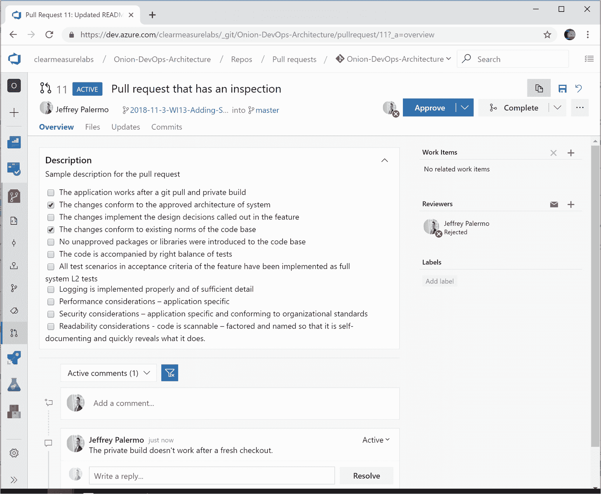

# 7.验证代码

既然您正在处理代码，跟踪工作项的变更，并构建代码，那么您需要挤出缺陷。在第 4 章中，我们讨论了如何配置 Azure Boards 来阐明一个工作项目从一个想法到客户必须完成的每一种工作。这样，您就将缺陷检测融入到了流程的每一个部分。您当然可以拥有在由于糟糕的设计或糟糕的分析而做了错误的事情时仍能完美执行的代码。但是这一章是关于确保代码正常工作的。因为代码是构建软件的基础，所以您希望确保您的开发运维流程和基础设施能够全面、快速地进行验证。你可能会积累大量的代码，而这些代码是不可能保存在你的大脑中的。重要的软件系统有如此多的代码文件，以至于能够以一种可管理的方式验证代码的唯一方法是将大部分代码自动化，并创建一个过程来手工审查最近的变更。本章将介绍通过持续集成构建、第一个部署的环境和拉请求实现自动化的步骤。

## 缺陷检测策略

根据我们行业可用的研究，Capers Jones 总结道，“发现和修复错误或缺陷的成本是软件历史上最大的单个费用元素。”琼斯先生继续报告说，对于一个 50 万行代码的 25 年预期寿命来说。NET 系统(估计在 52 LOC C#到 1 功能点 <sup>[2](#Fn2)</sup> )，我们每一美元中差不多有 0.50 美元会花在寻找和修复 bug 上。对可用质量研究的回顾将有助于任何希望构建高性能 DevOps 环境的人。

总之，缺陷去除效率(DRE)是一个在行业研究中有基础的度量。在所有可用于最大化 DRE 的方法和技术中，有三种方法和技术是一种很好的投资平衡，它们共同拥有实现 85%-95% DRE 的记录。这应该被认为是最低的起点。排除这些技术中的任何一种几乎肯定会产生差的质量，因为没有其他技术可以弥补这些技术的不足。使用这些作为一个必要的起点，并评估你的标准应该是什么。三种基本的缺陷消除技术是

*   静态分析

*   测试

*   检查

在不知道我们应该预期在一个给定的软件项目中会产生多少缺陷的情况下，讨论 85%是不值得的。只有到那时，我们才知道为了达到 85%的 DRE 水平，需要捕获和修复多少缺陷。在此之后，如果有 15%的缺陷逃脱，那么有多少缺陷被交付生产？Capers Jones 在他 2016 年的文章“软件缺陷消除效率超过 99%(DRE)”中总结了这项研究 <sup>[3](#Fn3)</sup> 图 [7-1](#Fig1) 中的表格显示了各工作阶段的平均潜在缺陷。这些是 2016 年软件项目研究中每种类型的工作产生的平均缺陷率。


图 7-1

每产生 100 行 C#代码，工作阶段应该预期的缺陷

研究团体使用功能点来规范化项目，并使它们具有可比性。我们可以通过一种叫做逆火的技术将平均值转换成可比较的代码行。这就是我们认为软件功能的平均功能点可以用 52 行 C#实现的地方。我们使用这个对话比率来决定什么范围的潜在缺陷可能与我们自己的软件系统相关。如果我们的系统是 10，000 行 C# (HTML、VB、SQL 都有非常相似的转换率)，我们应该预计所有来源的大约 800 个缺陷。在最低质量标准下，85%的 DRE 会在发布给客户之前发现 680 个缺陷，并发布给生产部门 120 个。研究表明，大约 25%的这些发布的缺陷可以在发布后每年被捕获和修复。这就是为什么已经在生产中使用多年的系统会变得相当稳定——也是为什么新的变化往往会以一种可见的方式破坏事物，尤其是当用户已经习惯了稳定性的时候。

如果我们的系统非常大，比如说 500，000 行代码，我们应该预计在工作的所有阶段会产生大约 41，000 个缺陷。这些数字可能会变得相当可怕。如果我们实现了 95%的 DRE，我们仍然会向客户发布超过 6000 个缺陷。99% DRE 会将发布给客户的缺陷数量减少到 400 个左右。这些数字发人深省。这很容易让人想到，即使有这样的行业平均水平，你的团队肯定也是高于平均水平的。人们希望如此，并且应该能够清楚地说明原因。如果你推测要以 2 的因子击败平均值，请随意将这些数字减半。即使在那里，我们也可以看到一个清晰的缺陷检测和缺陷移除策略的重要性，如果我们想要生产一个高质量的软件系统的话。高度自动化的 DevOps 环境是质量和速度的推动者，但它必须是一个丰富的管道，充满质量控制。

考虑一个城镇水处理系统的类比。我们可以把它想象成一条管道，来自可利用水源的水进入管道。通过一系列的处理步骤，容易导致疾病和不适的水被净化、过滤和处理，从而产生优质的饮用水作为输出。饮用水并不完美，但对社区来说已经足够好了。这条输水管道中的这一系列处理和过滤是我们 DevOps 管道中必须创造的。来自商业计划的原始想法不适合工作软件。我们将想法转化为需求(特性)，然后我们将它们分解成可以实现的单元(用户故事)。我们将这些翻译成代码，然后翻译成可部署的候选版本，然后翻译成可部署的环境，然后翻译成可工作的生产系统。每一步，来自左边的在制品，就像我们在 Azure 板中的泳道一样，都有更多隐藏的缺陷，我们希望提升到项目板右边的阶段。我们有责任确保每次工作从一个泳道转移到下一个泳道时，都有一个过滤器或“治疗方法”来及时发现隐藏在那个时间点的缺陷并消除它们。在本章的剩余部分，我们将关注质量控制技术，这是检测和消除我们团队编写的代码中产生的缺陷的最低标准。

### 缺陷检测的策略和执行

虽然这一章，或者这本书，不可能全面地涵盖您可能想要实现的所有缺陷检测技术，但是它将涵盖三个基本技术。考虑到三者中每一个的记录的有效性和可负担性，省略其中任何一个都可以被认为是不正当行为。

### 成对编程作为缺陷检测

结对编程在缺陷检测方面有着良好的记录。阅读本章引用的课文，以便深入了解实际数字。结对编程是让两个开发人员一起创建和修改代码的行为，每个人在键盘上交换，并交换编码员和导航员的角色。那些参与这些练习的人报告了研究显示的趣闻:对于棘手的问题，它有助于更快地完成，但是对于普通到简单的代码，它会产生开销。这项技术不是您应该首先使用的技术之一的原因是，作为一种缺陷检测方法，它的成本很高。回报率没有静态分析、测试和检查高，因为对于相同范围的软件来说，它的劳动成本是两倍。软件质量很高，但是投资回报率并没有转化为经济优势。这种技术最适合用于数量较少、风险较高或难度较大的软件特性。

让我们简要地定义三种基本的缺陷消除方法。

#### 静态分析

静态分析是为了预测缺陷而对源文件进行的自动检查。更广泛地说，静态分析可以作为一种针对文档和其他工件以及源代码的技术。微软 Word 中的拼写和语法检查是一个非常有价值的静态分析器，如果没有它，这本书可能听起来非常不专业。虽然副本编辑器通过阅读每个单词对每一章进行测试，并且章节版式校样器检查图像、表格和页边距，但是 Microsoft Word 中的静态分析器要运行多次，通常是在每次更改文档之后。因为它是自动化的，所以可以经常免费运行。对于我们的源代码，我们将实现许多静态分析工具。这些将作为我们 DevOps 管道的一部分自动运行。这些工具将发出警告和错误。当错误发生时，我们可以选择让管道中的某个步骤失败，或者选择在出现新警告时失败。

#### 测试

自从软件出现以来，测试一直是工作流程的一部分。程序员总是运行写好的代码，看看它是否如预期的那样工作。2002 年，Kent Beck 出版了一本非常有影响力的书，改变了许多团队的测试方法。这本书是*测试驱动开发:举例子*。 <sup>[4](#Fn4)</sup> James Newkirk，NUnit 2 和 XUnit 测试框架的合著者。NET 在他 2004 年的书《微软的测试驱动开发》中。网。测试驱动开发技术将开发人员从手工桌面检查或定制测试工具转移到创建可执行测试的标准模式。这种标准格式和创建方法允许测试套件随着软件的增长而不断增长。在许多情况下，Scrum 对于待办事项的验收标准的最佳格式是一个书面的测试场景，它的步骤被编码到一个自动化测试中，以这种方式测试系统。

#### 检查

任何建成的东西都要经过检验。我们重视房屋检查员，他们可以在购买或入住前使用正式的清单检查房屋或公寓。这些检查员是专家。他们知道要寻找什么，他们配备了一份清单，以确保他们不会忘记检查所有必要的项目。外行人不能当检查员。他们缺乏检查内容的培训或知识。提交人同样没有资格检查正在购买的房屋。在软件中，人们可以在价值链的几个阶段进行检查。DevOps 流程不仅仅包括管道，而且在构思完成并放在项目板上后就开始了。仔细评估哪些步骤应该包括正式检查，谁应该执行检查，以及检查清单应该是什么。

### DevOps 管道中的代码验证

我们已经看到，工作按照我们的泳道进度在我们的流程中移动，如图 [7-2](#Fig2) 所示。


图 7-2

可测量的 DevOps 流程的标准泳道

出于本章的目的，我们将只关注以下内容:

*   测试设计

*   发展

*   功能验证

这三个阶段的工作围绕着代码，并产生一个可以进一步评估的发布候选。所以我们的关注范围缩小到这三列，如图 [7-3](#Fig3) 所示。


图 7-3

在我们的过程中，验证代码集中在这三个泳道上

为了简单起见，这里是我们的自动化 DevOps 管道的一部分，它将受到我们的缺陷消除方法的实现的影响。

图 [7-4](#Fig4) 是围绕代码变更的 DevOps 过程的快照。静态分析、测试和检查在这个过程中的特定地方进行。每种方法都可以很好地集成到 Azure DevOps 服务、Visual Studio 和. NET 中。


图 7-4

代码验证从编码前的几个步骤开始，包括编码后的一些关键步骤

### 静态分析

一旦您决定了您应该使用什么静态分析工具，您将在持续集成构建中配置它们。作为私有构建的一部分，通常没有必要每次都运行它们，但是开发人员可以自己频繁地运行它们。任何静态分析工具都将能够按需在本地运行，但是您将希望使它成为您的管道的自动化部分。将它放在发布候选包之前很重要。如果修订版没有通过静态分析检查，那么从构建中归档包就没有什么意义了，因为修订版没有机会成为发布候选版本。

在 Visual Studio 中，FxCop 长期以来一直是. NET 可用的静态分析工具。NET 框架。随着 C#编译器的最新变化，基于 Roslyn 的分析器已经取代了 FxCop，成为首选方法。这些分析器成为 Visual Studio 解决方案的一部分，可以在 IDE 和命令行中运行。本章不会重复文档，文档可以在网上找到。 <sup>[6](#Fn6)</sup> 其他流行的静态分析工具包括

*   ReSharper 命令行:用于代码样式约定

*   Ndepend:用于代码度量、警告和高级质量评级

*   SonarQube:用于代码度量、警告和高级质量分级

*   TSLint:针对可读性、可维护性和功能性错误

*   WAVE:网页可访问性评估工具，用于静态分析网页的屏幕阅读器兼容性错误

这并不是静态分析工具的全面列表。还有很多很多。静态分析是一种有许多实现方式的方法。评估你的软件，并尽可能多地包含其中。

### 测试

手动测试总是会发生。对于某些验证，只有人眼才能发现可能影响客户的缺陷。当然，如果在颜色或 CSS 电子表格上有缺陷，使得所有文本在白色背景上是白色的，你的软件可能运行得很好，但是很少有客户能够使用它。大多数的系统功能都可以被自动化测试的形式所覆盖，这一部分将会关注这一点。通过应用不同级别的自动化测试，我们可以最小化人工测试人员的工作量，并确保执行可用性测试的人员不会遇到功能缺陷。此外，那些执行探索性测试的人将能够专注于该任务，而不是花费时间来报告可由自动化测试预防的功能缺陷。

当我们考虑自动化测试时，可以将它们分成四类。

*   单元测试

*   集成测试

*   全系统测试

*   专业测试

专业测试并没有创建一个详尽的列表，而是包括了一些测试类型，这些测试没有足够短的周期时间来以任何全面的方式可靠地包含在自动化 DevOps 管道中。负载测试和安全测试属于这一类。虽然您可能会在您的全系统测试中对这些类型的测试进行一些抽查，但是这些类型的专门测试用例通常需要特殊的环境和人工协助才能运行。它们很有价值，但不在本章讨论范围之内。对于前三种类型的测试，微软提供了一些文档 <sup>[7](#Fn7)</sup> 以及他们如何在 Azure DevOps 产品团队中分离这些测试类型的指导。它们将 L0-L3 这四个不同类别的测试关联起来，并与前面的列表很好地匹配。所有这些测试都可以用流行的测试框架运行，比如 NUnit 和 XUnit。

#### 单元测试(L0)

这些测试非常快。调用堆栈留在内存中。这些测试的平均执行时间应该在 50-70 毫秒左右。因此，包含进程外依赖项的代码是不合格的。这些都会使测试太慢。这些测试可以测试单个方法或者多个类，但是它们应该测试软件逻辑的一些逻辑单元。这些测试的口号是小而快。这些测试应该能够在每个开发人员的工作站以及构建服务器上运行。这些测试应该与生产代码一起包含在 Visual Studio 解决方案中。单元测试的一些反模式是

*   使用全局或线程资源，如互斥、文件 I/O、注册表等

*   一个测试和另一个测试之间的依赖关系

*   单次测试消耗大量 CPU 或内存

*   包括调用当前进程的代码

#### 集成测试(L1)

微软的指导是 L1 测试应该在 2 秒内完成。这些测试中的绝大多数应该在 1 秒钟内运行。认为 2 秒是一个上限。当代码被单元测试覆盖时，我们只剩下一个代码库，其中各个类做正确的事情，但是我们还没有证明所有的模块或层可以一起工作。最好的例子是数据库模式、数据层和域模型实体。实体框架核心是在中处理关系数据的非常好的选择。但是如果不执行从域模型实体到数据库的往返测试，我们就无法知道这些组件在下游环境中集成在一起时是否能够工作。单元测试不会测试这种能力，因为对数据库的任何调用都是进程外调用。集成测试与持续集成构建一起运行，也在开发人员工作站上的私有构建脚本中运行。这些测试应该与生产代码一起包含在 Visual Studio 解决方案中。集成测试的一些反模式是

*   需要大量的数据设置。

*   对任何其他测试的任何功能依赖性。

*   验证层之间的多个逻辑行为(太大)。

*   需要外部测试状态或数据设置:每个测试负责自己的设置。

#### 全系统测试(L2)

这些测试是为每个开发的特性设计的测试场景的超集，并且是在缺陷的根本原因被识别时创建的缺陷修正证明。全系统测试需要完全部署的环境才能执行。它们通常会通过与软件的其他交互器相同的接口来执行。在网页中，Selenium 可以用来在文本框和按钮中输入内容。执行这些测试时，应用程序或服务的所有层都是在线的。他们负责自己的设置，并且经常负责以任何顺序可靠地运行，即使其他测试不断地改变系统的状态。这些测试应该假设身份的上下文，并像普通用户一样执行完整的应用程序。这些测试应该与生产代码一起包含在 Visual Studio 解决方案中。集成测试的一些反模式是

*   不必要的慢:虽然这些测试会比单元测试慢几个数量级，但是它们的总和将决定一个发布分支的周期时间。

*   修改全局状态。

*   使用阻止并行化的共享资源。

*   超出团队控制的第三方服务的要求，即 Office 365 登录、PayPal 等。

对于这三种类型的自动化测试，你会发现每一种的数量都在下降。让我们考虑一个 300，000 行代码的代码库。作者看到的一些平均值(根本没有研究支持)是每 50 行代码进行一次单元测试。对于被覆盖的代码，平均值应该更低，但有些生产代码不会被覆盖，尤其是那些处于边缘、无可救药地耦合到第三方库和框架、被包裹在隔离层中的代码。除此之外，降低你对集成测试的期望值。这将是每 500 行代码的集成测试。然后对于全系统测试，每 5000 行代码进行一次测试。给出这样的具体数字充满了危险，因为没有足够的研究来给出任何数字。考虑到“视情况而定”的答案是无用的，当查看单元测试、集成测试和全系统测试时，轶事经验已经看到了诸如 100:10:1 的比率。不要期望数量级的下降是精确的，但是要期望每个更小范围的测试包含更多的数量。您的比率肯定会有变化，但是如果您最终得到的全系统测试比集成测试多，集成测试比单元测试多，就要警惕了。如果数字相似，请警惕。你应该能看到数字上的显著差异。例如，全系统测试是在完全部署的系统在线的情况下测试用户场景。业务逻辑的每个分支都可以作为单元测试来测试，数据库或队列行为的每个分支都可以用集成测试来测试。因此，在确定如何测试代码行为的某个方面时，要注意选择范围最小的测试类型。

### 验收测试驱动的开发

在编码之前，我们有一个泳道叫做测试设计。在此列中，测试场景将被添加到工作项定义中。Scrum 呼吁在待办事项中加入明确的验收标准。脚本化测试场景是 Scrum 验收测试概念的一个实现，它创建了一个测试名称和一组测试步骤，可以编程到一个可执行的全系统测试中。以这种方式，验收标准被添加到可执行的回归测试套件中，以便所有累积的验收标准在软件的每个后续构建中都得到验证。这使得产品负责人或其他领导能够控制这方面的可验证质量。

### 检查

检查是一个手动过程。但是它不同于手工测试。检查是一个一致的过程，在这个过程中，一个人使用与其他工作产品相同的清单和标准来检查某个工作产品。在软件中，我们可以在更广泛的过程中的几个地方实现检查。例如，一个好的预编码检查应该是在设计的所有四个元素都完成之后，并且在特性或用户故事被清除用于开发之前。此类检查的清单可能包含验证完整性的高级项目:

*   特征包括概念定义和远景描述以及目标。

*   功能包括详细的用户体验设计，如线框、屏幕模型等。

*   特性包括架构层的变化、所需的新库以及其他关键技术决策。

*   特性包括编写的测试场景，以及适合手动执行和自动化测试的测试步骤。

如果没有这种检查，开发人员很可能会发现功能缺乏设计的关键部分。面对一个不完整的设计，开发人员将不得不停止开发并回溯正确的对话，以便完成流程上游未完成的工作。如果没有发现这种设计返工，当开发人员实际上发现上游设计缺陷并在继续编码之前修复它们时，工作的开发阶段可能会出现生产力(吞吐量)下降。

为了发现编码缺陷，一个好的检查实现应该与拉请求过程集成在一起。如果每一个特性/用户故事都是使用一个特性分支开发的，那么一个拉请求就可以控制和记录将分支上的变更接受回主分支的过程。在 Azure Repos 或 GitHub 中，pull 请求体验非常丰富，足以容纳正式的、有文档记录的检查。当拉请求没有通过检查时，这并不可怕，因为这将表明发现了缺陷，分支可以继续工作，以便解决缺陷。一旦修复了缺陷，就可以再次检查分支，通过检查后，就可以批准拉请求，并将分支合并到主分支中。在本例中，我们将使用一名专家检查员-工程团队的另一名成员。对于这种类型的检查，超级用户或产品所有者不是合格的检查员，因为检查的目标是源代码。但是产品所有者/产品经理可能会对检查的结果、检查发生的报告以及通过执行检查发现和修复的缺陷数量非常感兴趣。

与其他项目一起，拉式请求代码检查可能包含以下列表中的步骤:

*   该应用程序在 Git pull 和私有构建之后工作。

*   变更符合批准的系统架构。

*   这些变化实现了特性中所要求的设计决策。

*   这些变化符合代码库的现有规范。

*   没有未经批准的包或库被引入代码库。

*   代码附有正确的测试平衡。

*   该功能验收标准中的所有测试场景都已作为全系统 L2 测试实施。

*   日志记录正确实施，并且足够详细。

*   性能考虑:具体应用。

*   安全性考虑:特定于应用程序并符合组织标准。

*   可读性考虑:代码是可扫描的——分解并命名，因此它是自文档化的，并能快速揭示它做了什么。

当检查员(拉动请求批准人)批准拉动请求时，该人确认他们已经根据检查清单忠实地检查了分支上的变更，并且在他们的专业意见中，分支满足检查的所有要求，并且不包含任何此时可以看到或怀疑的缺陷。有了这么大的责任，代码评审就成为了过去。快速浏览一下代码，拉请求记录中的主观评论就会停止。取而代之的是，当分支被创建并合并回 master 时，我们获得了对每组变更的严格和全面的检查。使用基于主干的开发，分支是非常短暂的，因此检查仍然可以快速执行。并且因为通过检查的标准是众所周知的，开发人员确切地理解什么是期望的，并且提交拉请求完全期望通过检查。

## 实现缺陷检测

有了这些缺陷去除方法以及它们应该在过程中的位置，让我们看看它们中的每一个是如何出现的。NET 并使用 Azure DevOps 服务实现它们。

### 静态分析

微软提供了关于 Visual Studio 的 FxCop 分析器的非常好的文档，这些说明可以在脚注中找到。 <sup>[8](#Fn8)</sup> 将 FxCop 分析器添加到. NET Framework 应用程序后，我们可以直接在 Visual Studio 中自定义内置的 Microsoft 规则集。


图 7-5

如果您修改 Microsoft ruleset 的任何设置，Visual Studio 将保存特定于项目的规则集文件

在您的构建脚本中，您可以添加以下命令行参数，以便在您希望分析器运行时运行它们。确保在规则失败时构建失败:

```
msbuild.exe
/t:Clean`;Rebuild /v:m /maxcpucount:1 /nologo /p:RunCodeAnalysis=true
/p:ActiveRulesets=MinimumRecommendedRules.ruleset/p:Configuration=Release
src\MySolution.sln

```

当您添加 NuGet 包时

```
Microsoft.CodeAnalysis.FxCopAnalyzers

```

到您的项目中。NET Core 中，您将看到分析器出现在您的解决方案资源管理器中，并且当您在 Visual Studio 中构建代码时，警告将开始显示，如图 [7-6](#Fig6) 所示。


图 7-6

代码分析器通过 NuGet 添加到. NET 核心项目中

没有必要在构建脚本中向 dotnet.exe 调用添加命令行参数。当分析器被添加到您的项目中时，它们将自动运行并生成适当的警告或错误。

每个静态分析产品都有自己的将其与代码集成的说明，但是为了保持 Azure Pipelines 构建配置简单，请确保将静态分析工具添加到构建脚本中，以便将配置存储在 g it 存储库中。如果您将 Azure Pipelines 构建转换为 YAML，您将在 Git 中存储更多的构建逻辑。

### 测试

实现自动化测试本身就可以写满一本书，而且有很多关于这个主题的书籍。如果你是测试自动化的新手，你会花一些时间好好阅读前面提到的 James Newkirk 的书。为了简单起见，这里有一些本章中提到的各种类型的测试的例子。

#### 单元测试

在我们的示例应用程序中，用领域驱动的设计术语来说，我们有一个充当聚合根的实体。它有许多属性和方法。这个简短类的代码如下:

```
using System;

namespace ClearMeasure.OnionDevOpsArchitecture.Core.Model
{
    public class ExpenseReport
    {
        public Guid Id { get; set; }
        public string Title { get; set; }
        public string Description { get; set; }
        public ExpenseReportStatus Status { get; set; }
        public string Number { get; set; }

        public ExpenseReport()
        {
            Status = ExpenseReportStatus.Draft;
            Description = "";
            Title = "";
        }

        public string FriendlyStatus
        {
            get { return GetTextForStatus(); }
        }

        protected string GetTextForStatus()
        {
            return Status.ToString();
        }

        public override string ToString()
        {
            return "ExpenseReport " + Number;
        }

        protected bool Equals(ExpenseReport other)
        {
            return Id.Equals(other.Id);
        }

        public override bool Equals(object obj)
        {
            if (ReferenceEquals(null, obj)) return false;
            if (ReferenceEquals(this, obj)) return true;
            if (obj.GetType() != this.GetType()) return false;
            return Equals((ExpenseReport) obj);
        }

        public override int GetHashCode()
        {
            return Id.GetHashCode();
        }
    }
}

```

这里有相当多的逻辑可能会失败。这种逻辑可以在单个内存空间内测试，而不需要调用进程外的任何应用程序依赖项；因此，我们可以编写一些单元测试。在将实体放入集合、排序和比较的代码库中，一些方法由基类库(BCL)使用，并显示显式单元测试的投资回报减少。这些方法是 Equals()和 GetHashCode()。域模型中没有实现这些的任何实体将迫使其他逻辑知道什么属性代表它的身份，以便查看两个对象是否代表相同的记录。这些对象中的大多数都有从某种数据库中提取的数据。Equals()和 GetHashCode()的完全覆盖通常在编写业务逻辑测试时自动发生。而且一些工具比如 JetBrains ReSharper 会自动生成这些方法，所以缺陷的可能性很低，除非你手写。

这里显示了 ExpenseReport 的单元测试类:

```
using System;
using ClearMeasure.OnionDevOpsArchitecture.Core.Model;
using NUnit.Framework;

namespace ClearMeasure.OnionDevOpsArchitecture.UnitTests
{
    public class ExpenseReportTester
    {
        [Test]
        public void PropertiesShouldInitializeToProperDefaults()
        {
            var report = new ExpenseReport();
            Assert.That(report.Id, Is.EqualTo(Guid.Empty));
            Assert.That(report.Title, Is.EqualTo(string.Empty));
            Assert.That(report.Description, Is.EqualTo(string.Empty));
            Assert.That(report.Status, Is.EqualTo(ExpenseReportStatus.Draft));
            Assert.That(report.Number, Is.EqualTo(null));
        }

        [Test]
        public void ToStringShouldReturnNumber()
        {
            var report = new ExpenseReport();
            report.Number = "456";
            Assert.That(report.ToString(), Is.EqualTo("ExpenseReport 456"));
        }

        [Test]
        public void PropertiesShouldGetAndSetValuesProperly()
        {
            var report = new ExpenseReport();
            Guid guid = Guid.NewGuid();
            report.Id = guid;
            report.Title = "Title";
            report.Description = "Description";
            report.Status = ExpenseReportStatus.Approved;
            report.Number = "Number";

            Assert.That(report.Id, Is.EqualTo(guid));
            Assert.That(report.Title, Is.EqualTo("Title"));

            Assert.That(report.Description, Is.EqualTo("Description"));
            Assert.That(report.Status,
                Is.EqualTo(ExpenseReportStatus.Approved));
            Assert.That(report.Number, Is.EqualTo("Number"));
        }

        [Test]
        public void ShouldShowFriendlyStatusValuesAsStrings()
        {
            var report = new ExpenseReport();
            report.Status = ExpenseReportStatus.Submitted;

            Assert.That(report.FriendlyStatus, Is.EqualTo("Submitted"));
        }
    }
}

```

当您阅读这个代码文件时，您会看到每个测试都验证了一段逻辑是否正确工作，同时保持所有正在执行的代码都在进程中。以这种方式编写的单元测试运行速度非常快，数千个单元测试可以在几秒钟内执行。

#### 集成测试

我们的 ExpenseReport 对象通过实体框架核心持久化到 SQL Server 数据库中。为了验证费用报告类可以从 SQL Server 中的数据中提取，我们需要一个将几层放在一起的测试:

*   领域模型本身，包含费用报告类

*   实体框架核心映射配置

*   数据访问逻辑，指定要运行的查询

*   SQL Server 架构，其中包含 ExpenseReport 表的 DDL(数据定义语言)

在大多数情况下，这些测试很容易编写，但是它们非常重要。没有它们，你会遇到缺陷，为了找到问题，你会花宝贵的时间调试通过这四层。如果您的所有数据库支持的类都配备了持久性级别的集成测试，您将很少会在调试会话中发现这方面的问题。

我们已经看到了费用报告类。下一个要检查的类是实体框架核心映射配置，它由数据上下文类和映射类组成。数据上下文类如下:

```
using ClearMeasure.OnionDevOpsArchitecture.Core;
using Microsoft.EntityFrameworkCore;
using Microsoft.EntityFrameworkCore.Diagnostics;

namespace ClearMeasure.OnionDevOpsArchitecture.DataAccess.Mappings
{
    public class DataContext : DbContext
    {
        private readonly IDataConfiguration _config;

        public DataContext(IDataConfiguration config)
        {
            _config = config;
        }

        protected override void OnConfiguring(DbContextOptionsBuilder
            optionsBuilder)
        {
            optionsBuilder.EnableSensitiveDataLogging();
            var connectionString = _config.GetConnectionString();
            optionsBuilder
                .UseSqlServer(connectionString)
                .ConfigureWarnings(warnings =>
                    warnings.
                    Throw(RelationalEventId.QueryClientEvaluationWarning));

            base.OnConfiguring(optionsBuilder);
        }

        protected override void OnModelCreating(ModelBuilder modelBuilder)
        {
            new ExpenseReportMap().Map(modelBuilder);
        }
    }
}

```

在我们的示例应用程序中，我们有一个聚合根，所以在我们的 OnModelCreating 类中，我们包含了一个“Map”类。我们使用这种模式，以便当我们累积数百个映射的实体时，每个实体都有自己的类，而不是膨胀单个 DataContext 类:

```
using System;
using ClearMeasure.OnionDevOpsArchitecture.Core.Model;
using Microsoft.EntityFrameworkCore;
using Microsoft.EntityFrameworkCore.Metadata.Builders;
using Microsoft.EntityFrameworkCore.ValueGeneration;

namespace ClearMeasure.OnionDevOpsArchitecture.DataAccess.Mappings
{
    public class ExpenseReportMap : IEntityFrameworkMapping
    {
        public EntityTypeBuilder Map(ModelBuilder modelBuilder)
        {

            var mapping = modelBuilder.Entity<ExpenseReport>();
            mapping.UsePropertyAccessMode(PropertyAccessMode.Field);
            mapping.HasKey(x => x.Id);
            mapping.Property(x => x.Id).IsRequired()
                .HasValueGenerator<SequentialGuidValueGenerator>()
                .ValueGeneratedOnAdd()
                .HasDefaultValue(Guid.Empty);
            mapping.Property(x => x.Number).IsRequired().HasMaxLength(10);
            mapping.Property(x => x.Title).HasMaxLength(200);
            mapping.Property(x => x.Description).HasMaxLength(4000);
            mapping.Property(x => x.Status).HasMaxLength(3)
                .HasConversion(status => status.Code
                    , s => ExpenseReportStatus.FromCode(s));

            return mapping;
        }
    }
}

```

我们的 map 类指定了如何映射每个属性，而不是依赖于往往会改变的默认值。选择以这种方式明确也降低了开发人员理解正在发生什么的门槛。对于实体框架核心的默认行为，每个开发人员都有不同程度的记忆。我们的 ExpenseReport 表如下所示:

```
CREATE TABLE [dbo].[ExpenseReport] (
    [Id]          UNIQUEIDENTIFIER NOT NULL,
    [Number]      NVARCHAR (10)    NOT NULL,
    [Title]       NVARCHAR (200)   NULL,
    [Description] NVARCHAR (4000)  NULL,
    [Status]      NCHAR (3)        NOT NULL
);

```

有四个不同的代码层跨两个不同的进程运行，大部分时间跨网络在不同的服务器上运行，您应该看到自动化测试确保这些层集成的稳定性的重要性。我们验证持久性逻辑的集成测试在这里:

```
using ClearMeasure.OnionDevOpsArchitecture.Core.Model;
using NUnit.Framework;
using Shouldly;

namespace ClearMeasure.OnionDevOpsArchitecture.IntegrationTests.DataAccess.Mappings
{
    public class ExpenseReportMappingTester
    {
        [Test]
        public void ShouldPersist()
        {
            new DatabaseTester().Clean();
            var report = new ExpenseReport
            {
                Title = "TestExpense",
                Description = "This is an expense",
                Number = "123",
                Status = ExpenseReportStatus.Cancelled
            };

            using (var context = new StubbedDataContextFactory().GetContext())
            {
                context.Add(report);
                context.SaveChanges();
            }

            ExpenseReport rehydratedExpenseReport;
            using (var context = new StubbedDataContextFactory().GetContext())
            {
                rehydratedExpenseReport = context
                    .Find<ExpenseReport>(report.Id);
            }

            rehydratedExpenseReport.Title.ShouldBe(report.Title);
            rehydratedExpenseReport.Description.ShouldBe(report.Description);
            rehydratedExpenseReport.Number.ShouldBe(report.Number);
            rehydratedExpenseReport.Status.ShouldBe(report.Status);
        }
    }
}

```

集成测试的这种模式可以在所有必须通过对象关系映射器保存到数据库的类中重复。基本情况是通过 ORM 将对象发送到数据库，清空内存，然后再次查询以构建对象。在这个案例中，我们有了第一个测试助手。对 DatabaseTester 的调用。Clean()表示一个助手，它可以按照外键依赖的顺序从数据库的所有表中删除所有记录。它包含的代码比这本书能打印的要多一点。如果你对它感兴趣，克隆本书附带的 Git 库。在涉及数据库的集成测试中，每个测试负责将数据库置于已知状态。在许多情况下，从数据库中没有记录开始运行测试可能是合适的。当然，这个案例就是这样的。在其他情况下，您可能希望在测试套件执行之前将一小部分已知的数据加载到数据库中。为构建目的维护一个数据测试集可能会变得很耗时，所以不要把它作为你的第一个解决方案。

#### 全系统测试

全系统测试，实施验收标准应该从应用程序的外部接口开始。如果有问题的特性是 web 服务，那么测试应该执行设置并调用 web 服务。如果界面是用户界面屏幕，测试应该导航到屏幕并使用它。如果接口是用于数据导入的自定义 Excel 文件的文件摄取，测试应该建立一个 Excel 文件，并将其放在正确的文件路径中进行处理。你知道模式了。

由于 web 应用程序如此受欢迎，您肯定会在您的。NET DevOps 管道。您可以在微软的文档中看到如何实现 Selenium 测试。 <sup>[9](#Fn9)</sup> 对于一个简单的基于表单的登录屏幕，Selenium 测试可能类似于下面这样:

```
[Test]
public void ShouldLoginAndLogOut()
{
    Driver.Navigate().GoToUrl(AppUrl);
    var login = Driver.FindElement(
        By.XPath("//button[contains(text(), 'Log In')]"));
    login.Click();

    Driver.Title.ShouldStartWith("Home Page");

    var logout = Driver.FindElement(By.LinkText("Logout"));
    logout.Click();

    Driver.Title.ShouldStartWith("Login");
}

```

在这种情况下，Driver 是 Selenium 驱动程序类的一个属性，它包装了浏览器正在查看的 web 页面的模型。这些测试可以在任何机器上执行，只要执行身份可以实际启动并控制 web 浏览器的实例。由于全系统测试是在完全部署的环境中运行的，因此 CI 构建过程将测试套件打包并将其与 TDD 环境中的应用程序组件一起部署是非常重要的。我们将在后面的章节中讨论更多关于打包和部署的内容。

### 检查

Azure Repos 或 GitHub 中的 pull 请求是促进代码检查的最佳场所。这是蔚蓝色的一束花。我们从一个准备合并的特征分支开始。开发人员创建拉取请求。根据策略，开发人员用一个包含所有检查步骤的降价任务列表来初始化描述。这可以从应用程序存储的 wiki 或 markdown 文件中提取，如图 [7-7](#Fig7) 所示。



图 7-7

执行多步检验的拉式请求

审批人可以在检查项目时进行核对。当一个项目失败时，可以使用注释并拒绝拉取请求。可以向分支添加更多的提交来解决这个问题。然后，使用 pull 请求中的注释，提交者可以请求检查员再看一眼。一旦分支满足检查中的所有标准，检查员就批准拉请求并合并分支。清单和用于解决任何问题的完整对话在 Azure Repos 中有完整的文档记录。

## 包裹

在这一章中，你已经学会了如何使用一些可用的研究来预测你的应用程序会有多少缺陷。您还学习了业内可用的三种关键缺陷消除方法。我们已经讨论了静态分析、多层次测试以及检查的概念和实现。有了这些缺陷消除方法，您的团队甚至可以在开发过程中快速消除缺陷，而不是将它们推进到下游阶段。

## 文献学

贝克，K. (2002 年)。测试驱动开发:通过例子。艾迪生-卫斯理专业。

*在 Visual Studio* 中安装 FxCop 分析器。(2018, 8 2).从 Visual Studio 文档中检索: [`https://docs.microsoft.com/en-us/visualstudio/code-quality/install-fxcop-analyzers?view=vs-2017`](https://docs.microsoft.com/en-us/visualstudio/code-quality/install-fxcop-analyzers%253Fview%253Dvs-2017)

琼斯，C. (2012 年)。从软件中检索缺陷来源和清除方法: [`www.ifpug.org/Documents/Jones-SoftwareDefectOriginsAndRemovalMethodsDraft5.pdf`](http://www.ifpug.org/Documents/Jones-SoftwareDefectOriginsAndRemovalMethodsDraft5.pdf)

琼斯，C. (2016)。*软件的缺陷消除效率(DRE)超过 99%。*检索自 [`www.ifpug.org/Documents/Toppin99percentDRE2016.pdf`](http://www.ifpug.org/Documents/Toppin99percentDRE2016.pdf)

琼斯，C. (2017)。软件经济学和功能点度量:IFPUG 进展的三十年。检索自 [`www.ifpug.org/wp-content/uploads/2017/04/IYSM.-Thirty-years-of-IFPUG.-Software-Economics-and-Function-Point-Metrics-Capers-Jones.pdf`](http://www.ifpug.org/wp-content/uploads/2017/04/IYSM.-Thirty-years-of-IFPUG.-Software-Economics-and-Function-Point-Metrics-Capers-Jones.pdf)

微软。(未注明日期)。*开始使用罗斯林分析仪*。从 Visual Studio 文档中检索: [`https://docs.microsoft.com/en-us/visualstudio/extensibility/getting-started-with-roslyn-analyzers?view=vs-2017`](https://docs.microsoft.com/en-us/visualstudio/extensibility/getting-started-with-roslyn-analyzers%253Fview%253Dvs-2017)

微软/Azure。(未注明日期)。*左移使测试快速可靠*。从 Azure DevOps 文档中检索: [`https://docs.microsoft.com/en-us/azure/devops/learn/devops-at-microsoft/shift-left-make-testing-fast-reliable#test-taxonomy`](https://docs.microsoft.com/en-us/azure/devops/learn/devops-at-microsoft/shift-left-make-testing-fast-reliable%2523test-taxonomy)

纽柯克、J. W .、沃龙佐夫(2004 年)。微软. NET 中的测试驱动开发。

*含硒 UI 测试*。(未注明日期)。检索自 [`https://docs.microsoft.com/en-us/azure/devops/pipelines/test/continuous-test-selenium?view=azure-devops`](https://docs.microsoft.com/en-us/azure/devops/pipelines/test/continuous-test-selenium%253Fview%253Dazure-devops)

<aside class="FootnoteSection" epub:type="footnotes">Footnotes [1](#Fn1_source)

Jones，软件缺陷来源和消除方法，2012 年

  [2](#Fn2_source)

Jones，软件经济学和功能点度量:IFPUG 进展三十年，2017

  [3](#Fn3_source)

Jones，2016 年 DRE 软件缺陷消除效率超过 99%

  [4](#Fn4_source)

贝克，2002 年

  [5](#Fn5_source)

纽柯克和沃龙佐夫，2004 年

  [6](#Fn6_source)

微软，挪威

  [7](#Fn7_source)

微软/Azure，未标明日期

  [8](#Fn8_source)

在 Visual Studio 2018 中安装 FxCop 分析器

  [9](#Fn9_source)

含硒的 UI 测试，未注明

 </aside>